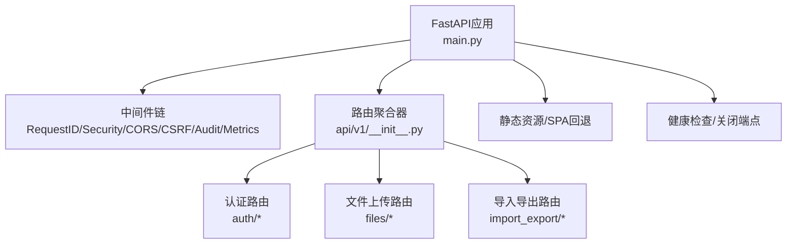
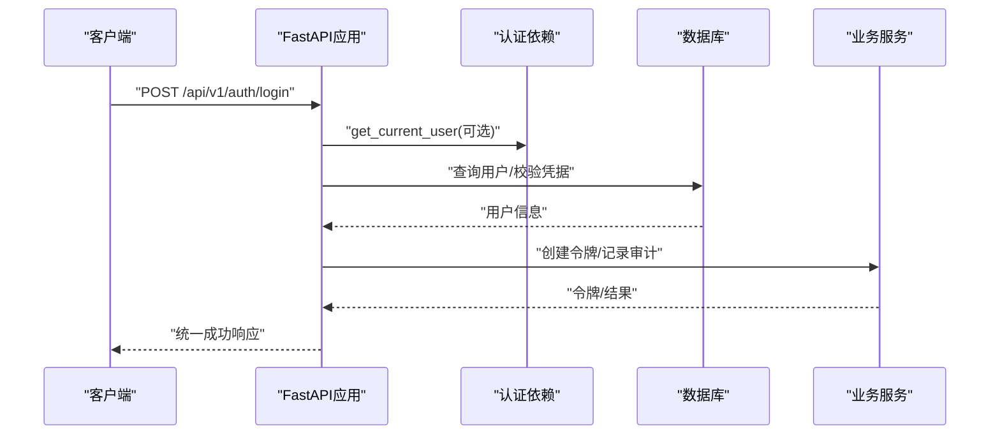
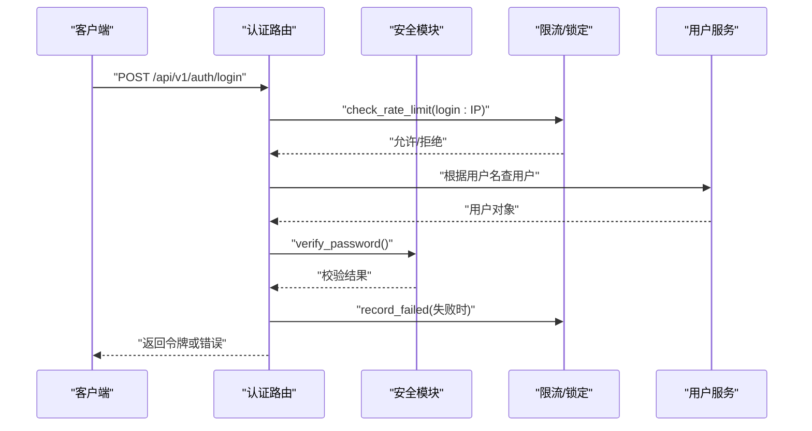
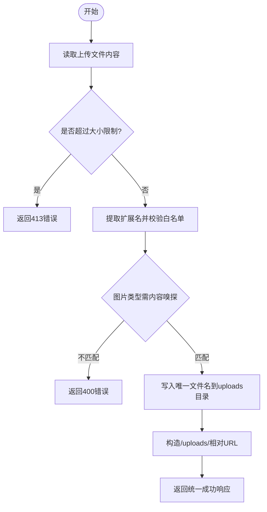
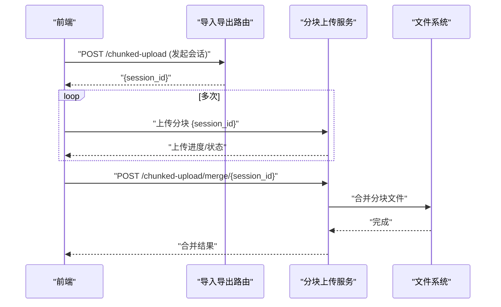
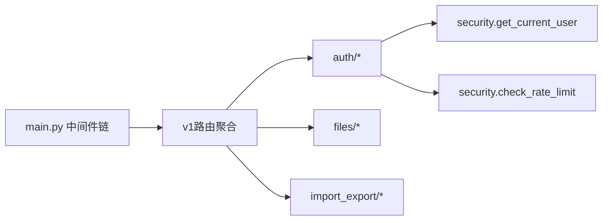

# API文档

<cite>
**本文引用的文件**
- [backend/app/main.py](file://backend/app/main.py)
- [backend/app/core/config.py](file://backend/app/core/config.py)
- [backend/app/core/security.py](file://backend/app/core/security.py)
- [backend/app/core/response.py](file://backend/app/core/response.py)
- [backend/app/api/v1/__init__.py](file://backend/app/api/v1/__init__.py)
- [backend/app/api/v1/auth/__init__.py](file://backend/app/api/v1/auth/__init__.py)
- [backend/app/api/v1/auth/auth.py](file://backend/app/api/v1/auth/auth.py)
- [backend/app/api/v1/files.py](file://backend/app/api/v1/files.py)
- [backend/app/api/v1/import_export/__init__.py](file://backend/app/api/v1/import_export/__init__.py)
</cite>

## 目录
1. [简介](#简介)
2. [项目结构](#项目结构)
3. [核心组件](#核心组件)
4. [架构总览](#架构总览)
5. [详细组件分析](#详细组件分析)
6. [依赖关系分析](#依赖关系分析)
7. [性能考虑](#性能考虑)
8. [故障排查指南](#故障排查指南)
9. [结论](#结论)
10. [附录](#附录)

## 简介
本API文档面向开发者，系统化说明帮扶管理信息系统后端提供的RESTful接口、认证授权机制、数据验证与权限控制策略，并给出调用示例与客户端集成要点。系统基于FastAPI构建，统一路由前缀为 /api/v1，提供认证、文件上传、导入导出等能力；同时说明WebSocket在单机版中的启用状态与替代方案（HTTP轮询）。

## 项目结构
- 应用入口与中间件：应用启动时注册全局中间件（请求ID、安全头、CORS、CSRF、审计、慢请求监控、查询计数、缓存头等），挂载静态资源与SPA回退，加载业务路由。
- 配置中心：集中管理数据库、缓存、CORS、CSRF、速率限制、文件上传/导出目录、加密密钥等。
- 安全模块：JWT签发与校验、密码哈希与策略、当前用户获取、管理员权限校验、速率限制、IP来源判定。
- 响应规范：统一成功/失败响应体，分页元信息封装。
- 路由聚合：v1路由按模块静态导入并注册，保证打包与可观测性。

**图表来源**
- [backend/app/main.py:98-179](file://backend/app/main.py#L98-L179)
- [backend/app/api/v1/__init__.py:29-140](file://backend/app/api/v1/__init__.py#L29-L140)

**章节来源**
- [backend/app/main.py:98-179](file://backend/app/main.py#L98-L179)
- [backend/app/api/v1/__init__.py:29-140](file://backend/app/api/v1/__init__.py#L29-L140)

## 核心组件
- 认证与授权
  - JWT访问令牌与刷新令牌生命周期由安全模块统一管理，支持黑名单吊销与版本强制下线。
  - 登录接口具备速率限制、账户锁定、机器码校验、审计日志记录。
  - 受保护接口通过依赖注入获取当前用户，管理员接口需角色或超级管理员校验。
- 配置与安全
  - 生产环境默认关闭调试与SQL日志，强制字段加密密钥生成与持久化。
  - CORS、CSRF、安全响应头、请求体大小限制、慢请求监控、查询计数等中间件保障安全与可观测性。
- 统一响应格式
  - 成功响应包含 code、message、success、data；列表接口使用 ok_list 返回 items、total、page、page_size。
  - 错误响应包含 code、message、success、errors/detail。

**章节来源**
- [backend/app/core/security.py:210-336](file://backend/app/core/security.py#L210-L336)
- [backend/app/core/config.py:126-154](file://backend/app/core/config.py#L126-L154)
- [backend/app/core/response.py:52-178](file://backend/app/core/response.py#L52-L178)

## 架构总览

**图表来源**
- [backend/app/api/v1/auth/auth.py:101-200](file://backend/app/api/v1/auth/auth.py#L101-L200)
- [backend/app/core/security.py:243-336](file://backend/app/core/security.py#L243-L336)

## 详细组件分析

### 认证与授权
- 登录
  - 方法：POST
  - 路径：/api/v1/auth/login
  - 请求体：用户名、密码（具体字段以LoginRequest模型为准）
  - 响应：统一成功响应，包含访问令牌与过期时间
  - 错误：
    - 401：凭证无效或用户不存在
    - 403：账户未激活或未授权机器
    - 429：登录尝试过于频繁
  - 安全：
    - 速率限制：同一IP每分钟最多5次
    - 账户锁定：连续失败达到阈值后锁定指定时长
    - 审计：登录成功/失败均记录审计日志
- 刷新令牌
  - 方法：POST
  - 路径：/api/v1/auth/refresh-token
  - 请求体：刷新令牌
  - 响应：新的访问令牌
  - 错误：401（令牌无效/过期）、429（刷新频率限制）
- 登出
  - 方法：POST
  - 路径：/api/v1/auth/logout
  - 请求头：Authorization: Bearer <access_token>
  - 行为：将令牌加入黑名单，后续请求将被拒绝
- 受保护接口鉴权
  - 依赖：get_current_user（Bearer令牌校验、黑名单检查、token_version一致性校验）
  - 管理员接口：require_admin() 要求admin/super_admin或is_superuser

**图表来源**
- [backend/app/api/v1/auth/auth.py:101-200](file://backend/app/api/v1/auth/auth.py#L101-L200)
- [backend/app/core/security.py:439-488](file://backend/app/core/security.py#L439-L488)

**章节来源**
- [backend/app/api/v1/auth/auth.py:101-200](file://backend/app/api/v1/auth/auth.py#L101-L200)
- [backend/app/core/security.py:243-336](file://backend/app/core/security.py#L243-L336)
- [backend/app/core/security.py:439-488](file://backend/app/core/security.py#L439-L488)

### 文件上传下载
- 通用文件上传
  - 方法：POST
  - 路径：/api/v1/files/upload
  - 请求：multipart/form-data，字段 file（必填），category（可选子目录）
  - 响应：统一成功响应，data包含 url、file_name、file_size、file_type
  - 规则：
    - 文件大小限制：MAX_FILE_SIZE（默认50MB）
    - 扩展名白名单：image/document/archive/audio/video分类
    - 图片内容嗅探：扩展名与实际文件头匹配
    - 存储位置：/uploads/generic[/category]，返回相对URL可直接访问
- 下载
  - 静态资源通过 /uploads/{relative_path} 直接访问（由应用静态文件服务提供）

**图表来源**
- [backend/app/api/v1/files.py:39-127](file://backend/app/api/v1/files.py#L39-L127)

**章节来源**
- [backend/app/api/v1/files.py:39-127](file://backend/app/api/v1/files.py#L39-L127)

### 数据导入导出
- 导出
  - 路由组：import_export/export
  - 典型端点：POST /api/v1/import-export/export（具体路径以实际模块定义为准）
  - 功能：按数据类型导出数据包，支持异步导出任务
- 导入
  - 路由组：import_export/import_data
  - 典型端点：POST /api/v1/import-export/import（具体路径以实际模块定义为准）
  - 功能：导入数据包或批量数据，支持校验与历史记录
- 分块上传（用于大文件导入/导出）
  - 路由组：import_export/chunked_upload
  - 典型端点：
    - POST /api/v1/import-export/chunked-upload（发起分块会话）
    - GET /api/v1/import-export/chunked-upload/progress/{sessionId}（查询进度）
    - POST /api/v1/import-export/chunked-upload/merge/{sessionId}（合并分块）
    - DELETE /api/v1/import-export/chunked-upload/{sessionId}（取消上传）

**图表来源**
- [backend/app/api/v1/import_export/__init__.py:1-21](file://backend/app/api/v1/import_export/__init__.py#L1-L21)

**章节来源**
- [backend/app/api/v1/import_export/__init__.py:1-21](file://backend/app/api/v1/import_export/__init__.py#L1-L21)

### WebSocket实时通信
- 单机版默认禁用WebSocket，消息通过HTTP轮询获取（如最近活动、消息中心等）。
- 若部署于可信反向代理且开启相关配置，可在服务端启用WebSocket；当前前端实现中已预留初始化与关闭逻辑但默认不建立连接。

**章节来源**
- [frontend/src/views/message/MessageCenter.vue:493-505](file://frontend/src/views/message/MessageCenter.vue#L493-L505)

### 系统与健康检查
- 健康检查
  - 方法：GET
  - 路径：/health
  - 响应：status、version、git_hash、migration（at_head、head、error）
- 内部关闭
  - 方法：POST
  - 路径：/api/v1/shutdown
  - 限制：仅本机调用 + X-Internal-Shutdown 头部密钥校验
  - 行为：延迟触发进程关闭信号

**章节来源**
- [backend/app/main.py:235-287](file://backend/app/main.py#L235-L287)

## 依赖关系分析
- 路由注册顺序影响匹配优先级，例如 supported_village_export 需在 supported_village 之前注册，避免动态路由冲突。
- 中间件执行顺序（从外到内）：RequestID → SecurityHeaders → CORS → CamelToSnake → CSRF → RequestLogger → Audit → Metrics。
- 认证依赖贯穿所有受保护接口，管理员接口额外依赖 require_admin。

**图表来源**
- [backend/app/main.py:111-163](file://backend/app/main.py#L111-L163)
- [backend/app/api/v1/__init__.py:49-140](file://backend/app/api/v1/__init__.py#L49-L140)
- [backend/app/core/security.py:243-336](file://backend/app/core/security.py#L243-L336)

**章节来源**
- [backend/app/main.py:111-163](file://backend/app/main.py#L111-L163)
- [backend/app/api/v1/__init__.py:49-140](file://backend/app/api/v1/__init__.py#L49-L140)

## 性能考虑
- 数据库连接池：SQLite走QueuePool，WAL模式支持多读者并发；默认连接数与溢出参数已优化。
- 慢请求监控与查询计数：便于定位瓶颈。
- 静态资源长期缓存：带hash的资源设置immutable，提升浏览器缓存命中率。
- 速率限制：登录、刷新等敏感操作采用滑动窗口算法，防止滥用。

[本节为通用指导，无需特定文件引用]

## 故障排查指南
- 认证失败
  - 401：检查Authorization头是否正确携带Bearer令牌；确认令牌未过期且未被拉黑；检查token_version是否与用户一致。
  - 403：账户未激活或未授权机器；非管理员访问管理员接口。
  - 429：登录或刷新频率超限，稍后再试。
- 文件上传失败
  - 413：超过最大文件大小；调整MAX_FILE_SIZE或拆分上传。
  - 400：扩展名不在白名单或图片内容与扩展名不匹配。
- 导入导出异常
  - 检查分块会话是否存在、进度是否正常、合并是否成功；查看导入导出历史记录与错误信息。
- 健康检查
  - /health的migration.at_head为False时，检查Alembic迁移状态与数据库schema是否落后目标head。

**章节来源**
- [backend/app/core/security.py:243-336](file://backend/app/core/security.py#L243-L336)
- [backend/app/api/v1/files.py:54-84](file://backend/app/api/v1/files.py#L54-L84)
- [backend/app/main.py:235-257](file://backend/app/main.py#L235-L257)

## 结论
本系统提供完整的RESTful API体系，涵盖认证授权、文件上传、导入导出、系统健康检查等关键能力。通过统一的响应格式、严格的安全中间件与鉴权依赖，确保接口的一致性与安全性。建议在客户端集成时遵循统一响应解析、错误处理与重试策略，并结合速率限制与CSRF保护进行健壮调用。

[本节为总结，无需特定文件引用]

## 附录

### 统一响应格式
- 成功响应
  - 结构：{code: 200, message: "success", success: true, data: ...}
  - 列表响应：ok_list返回 {items, total, page, page_size} 作为data
- 错误响应
  - 结构：{code: 错误码, message: "错误描述", success: false, errors?: [...], detail?: any}

**章节来源**
- [backend/app/core/response.py:52-178](file://backend/app/core/response.py#L52-L178)

### 认证流程与权限控制
- 获取当前用户：get_current_user依赖注入，校验Bearer令牌、黑名单、token_version
- 管理员权限：require_admin()要求admin/super_admin或is_superuser
- 速率限制：check_rate_limit(key, request, limit, window)

**章节来源**
- [backend/app/core/security.py:243-336](file://backend/app/core/security.py#L243-L336)
- [backend/app/core/security.py:439-488](file://backend/app/core/security.py#L439-L488)

### 配置项（节选）
- 基础：PROJECT_NAME、PROJECT_VERSION、API_PREFIX、SECRET_KEY、ALGORITHM、DEBUG、ENVIRONMENT
- 数据库：DATABASE_URL、DB_POOL_*、SLOW_QUERY_THRESHOLD_MS
- 服务器：HOST、PORT、TRUST_PROXY_HEADERS
- 安全：ACCESS_TOKEN_EXPIRE_MINUTES、REFRESH_TOKEN_EXPIRE_DAYS、BCRYPT_ROUNDS、PASSWORD_EXPIRE_DAYS、MAX_FAILED_LOGIN_ATTEMPTS、ACCOUNT_LOCKOUT_MINUTES
- CORS：CORS_ORIGINS、CORS_ALLOW_CREDENTIALS、CORS_ALLOWED_METHODS、CORS_ALLOWED_HEADERS
- CSRF：CSRF_ENABLED、CSRF_SECRET_KEY
- 速率限制：RATE_LIMIT_ENABLED、RATE_LIMIT_PER_MINUTE、RATE_LIMIT_PER_HOUR
- 文件：UPLOAD_DIR、EXPORT_DIR、MAX_FILE_SIZE、ALLOWED_FILE_TYPES

**章节来源**
- [backend/app/core/config.py:64-176](file://backend/app/core/config.py#L64-L176)

### 客户端集成要点
- 认证
  - 登录后保存access_token，并在后续请求头中携带 Authorization: Bearer <token>
  - 刷新令牌：使用refresh_token调用刷新接口获取新access_token
  - 登出：调用登出接口将令牌加入黑名单
- 文件上传
  - 使用multipart/form-data上传file字段，可选category指定子目录
  - 下载通过返回的/uploads相对URL直接访问
- 导入导出
  - 使用分块上传接口处理大文件，先发起会话，再上传分块，最后合并
  - 关注进度与合并结果，必要时取消会话
- 错误处理
  - 统一解析响应体的code与message
  - 对401/403/429等状态码做友好提示与重试策略

[本节为通用指导，无需特定文件引用]