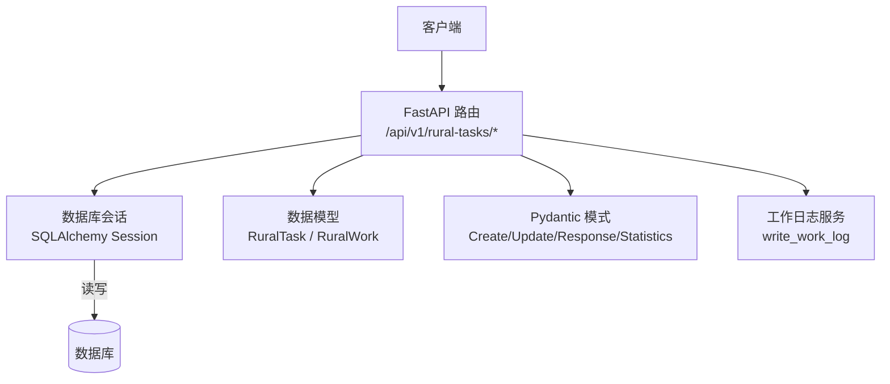
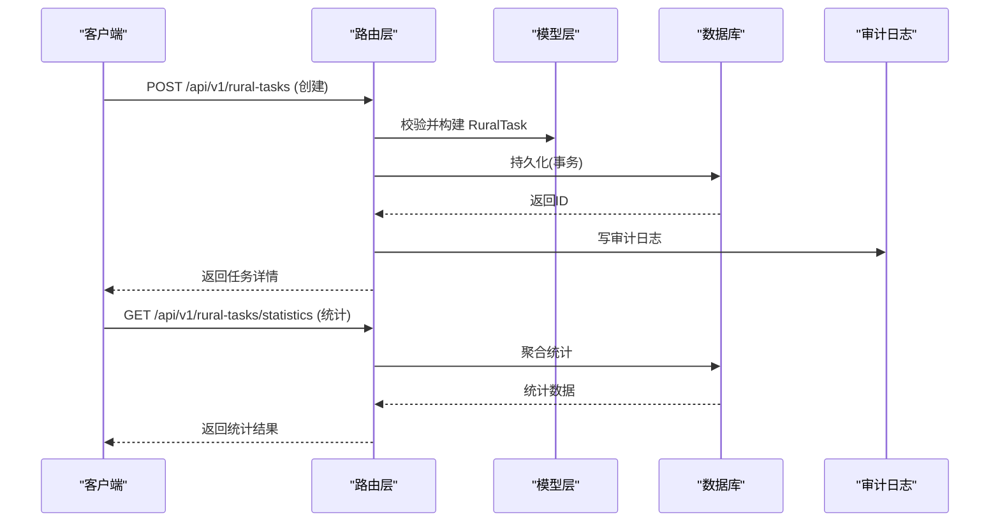
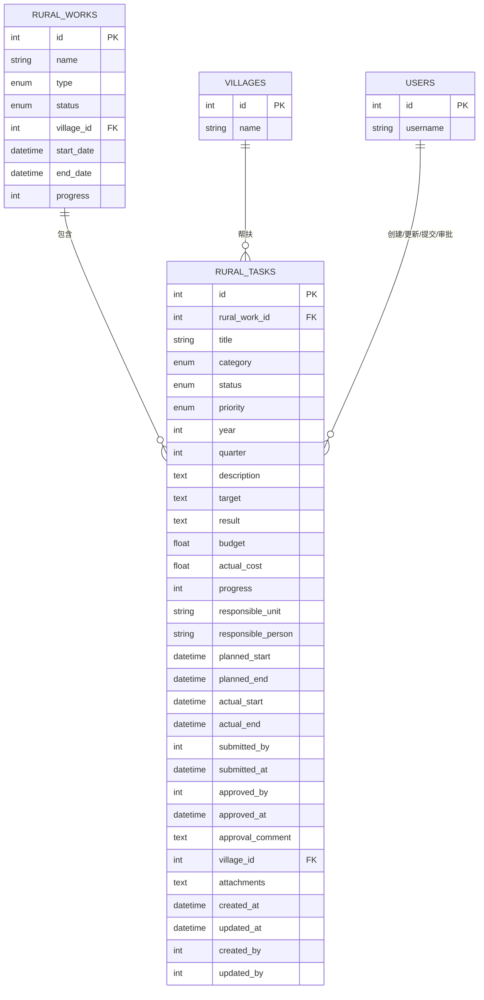
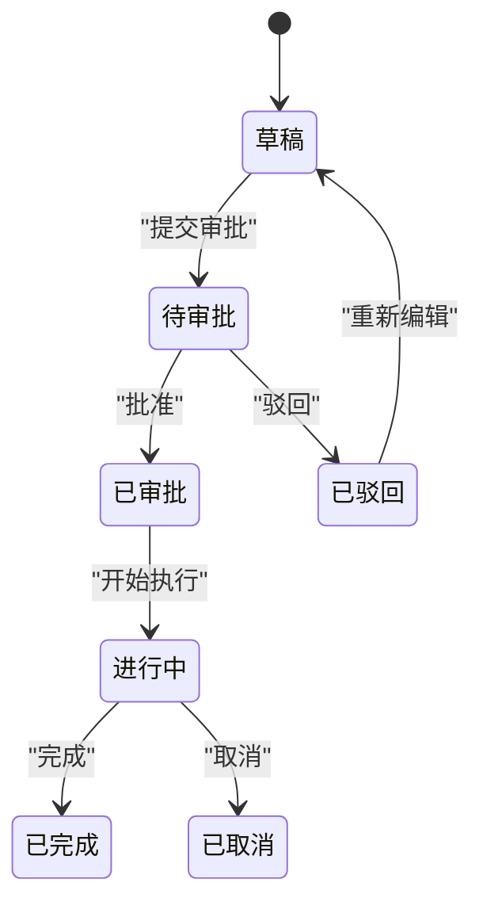
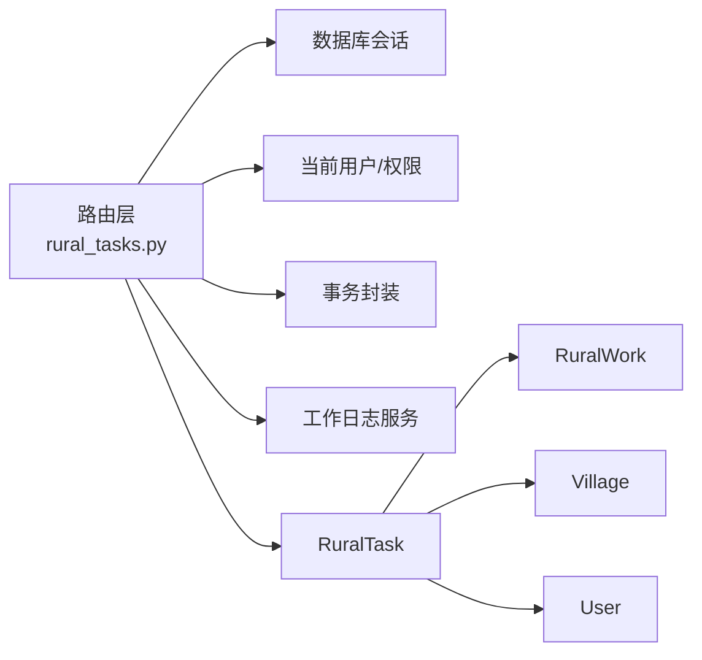

# 乡村任务API

<cite>
**本文引用的文件**
- [rural_tasks.py](file://backend/app/api/v1/rural_tasks.py)
- [rural_task.py](file://backend/app/models/rural_task.py)
- [rural_work.py](file://backend/app/models/rural_work.py)
- [rural_task_schema.py](file://backend/app/schemas/rural_task.py)
- [test_api_rural_tasks_full.py](file://backend/tests/unit/test_api_rural_tasks_full.py)
</cite>

## 目录
1. [简介](#简介)
2. [项目结构](#项目结构)
3. [核心组件](#核心组件)
4. [架构总览](#架构总览)
5. [详细组件分析](#详细组件分析)
6. [依赖关系分析](#依赖关系分析)
7. [性能考虑](#性能考虑)
8. [故障排查指南](#故障排查指南)
9. [结论](#结论)
10. [附录：API接口与调用示例](#附录api接口与调用示例)

## 简介
本文件面向“乡村振兴工作任务”模块的API，覆盖任务的创建、查询、更新、删除、提交审批、批量删除以及统计汇总等能力。文档同时说明任务与乡村工作的关联关系、任务状态管理（草稿、待审批、已审批、进行中、已完成、已驳回、已取消）、优先级设置、进度跟踪、截止日期管理等关键业务点，并提供端到端调用示例，帮助使用者从创建到完成全生命周期管理任务。

## 项目结构
围绕乡村任务的核心代码分布在以下位置：
- API路由层：定义RESTful接口与权限校验、参数校验、事务提交与审计日志写入
- 数据模型层：定义任务与工作、村庄、用户等实体的关系及字段约束
- 模式层：定义请求/响应数据结构与校验规则
- 测试层：提供基础用例以验证接口行为

图表来源
- [rural_tasks.py:1-366](file://backend/app/api/v1/rural_tasks.py#L1-L366)
- [rural_task.py:1-133](file://backend/app/models/rural_task.py#L1-L133)
- [rural_work.py:1-76](file://backend/app/models/rural_work.py#L1-L76)
- [rural_task_schema.py:1-130](file://backend/app/schemas/rural_task.py#L1-L130)

章节来源
- [rural_tasks.py:1-366](file://backend/app/api/v1/rural_tasks.py#L1-L366)
- [rural_task.py:1-133](file://backend/app/models/rural_task.py#L1-L133)
- [rural_work.py:1-76](file://backend/app/models/rural_work.py#L1-L76)
- [rural_task_schema.py:1-130](file://backend/app/schemas/rural_task.py#L1-L130)

## 核心组件
- 任务数据模型：包含分类、状态、优先级、年度/季度、目标/成果、预算/实际花费、进度、责任人、计划起止时间、实际起止时间、审批信息、帮扶村关联、附件列表、审计字段等
- 任务模式：创建、更新、响应、列表、统计、提交审批、审批请求等结构化定义
- 任务路由：CRUD、筛选分页、统计、提交审批、批量删除、审计留痕
- 工作模型：作为任务的父级聚合维度，支持类型、状态、负责人、时间范围、进度、组织隔离等

章节来源
- [rural_task.py:21-133](file://backend/app/models/rural_task.py#L21-L133)
- [rural_task_schema.py:9-130](file://backend/app/schemas/rural_task.py#L9-L130)
- [rural_tasks.py:72-366](file://backend/app/api/v1/rural_tasks.py#L72-L366)
- [rural_work.py:18-76](file://backend/app/models/rural_work.py#L18-L76)

## 架构总览
乡村任务API采用分层设计：
- 路由层负责鉴权、参数校验、业务编排、事务与审计
- 模型层通过ORM映射数据库表，维护实体关系与索引
- 模式层统一输入输出契约，保障前后端一致性
- 服务层（如工作日志）用于可追溯性记录

图表来源
- [rural_tasks.py:175-222](file://backend/app/api/v1/rural_tasks.py#L175-L222)
- [rural_tasks.py:117-161](file://backend/app/api/v1/rural_tasks.py#L117-L161)
- [rural_task.py:56-133](file://backend/app/models/rural_task.py#L56-L133)

## 详细组件分析

### 数据模型与关系
- 任务与乡村工作：多对一（一个乡村工作包含多个任务）
- 任务与村庄：多对一（可选关联帮扶村）
- 任务与用户：创建者、更新者、提交人、审批人等多角色关系
- 索引优化：按工作+年度、状态、分类、村庄、年度建立索引以提升查询性能

图表来源
- [rural_task.py:56-133](file://backend/app/models/rural_task.py#L56-L133)
- [rural_work.py:34-76](file://backend/app/models/rural_work.py#L34-L76)

章节来源
- [rural_task.py:56-133](file://backend/app/models/rural_task.py#L56-L133)
- [rural_work.py:34-76](file://backend/app/models/rural_work.py#L34-L76)

### 任务状态管理与流转
- 状态枚举：草稿、待审批、已审批、进行中、已完成、已驳回、已取消
- 提交审批：仅草稿或被驳回的任务可提交，提交后进入待审批
- 审批：仅待审批的任务可审批，批准则进入已审批，否则退回已驳回
- 执行中/已完成/已取消：可通过更新接口调整进度与状态（例如将进度设为100并标记为已完成）

图表来源
- [rural_task.py:35-54](file://backend/app/models/rural_task.py#L35-L54)
- [rural_tasks.py:276-333](file://backend/app/api/v1/rural_tasks.py#L276-L333)

章节来源
- [rural_task.py:35-54](file://backend/app/models/rural_task.py#L35-L54)
- [rural_tasks.py:276-333](file://backend/app/api/v1/rural_tasks.py#L276-L333)

### 任务分配机制与责任人
- 责任人字段：责任单位、负责人、联系电话（加密存储）
- 权限控制：非管理员仅能访问自己创建的任务；详情/写操作需通过属主校验
- 建议实践：在更新接口中设置负责人与联系方式，结合提醒引擎进行跟进（系统内未暴露专用分配接口）

章节来源
- [rural_task.py:94-96](file://backend/app/models/rural_task.py#L94-L96)
- [rural_tasks.py:55-66](file://backend/app/api/v1/rural_tasks.py#L55-L66)

### 进度跟踪、优先级与截止日期
- 进度：0-100整数，可在更新时调整；统计中计算完成率
- 优先级：低、中、高、紧急，用于排序与提醒策略
- 截止日期：计划开始/结束与实际开始/结束时间，便于延期检测与报表展示

章节来源
- [rural_task.py:76-101](file://backend/app/models/rural_task.py#L76-L101)
- [rural_task_schema.py:29-52](file://backend/app/schemas/rural_task.py#L29-L52)

### 统计汇总接口
- 支持按年度、乡村工作ID过滤
- 返回总量、各状态计数、分类计数、预算与实际花费合计、完成率
- 非管理员默认仅统计本人创建的任务

章节来源
- [rural_tasks.py:117-161](file://backend/app/api/v1/rural_tasks.py#L117-L161)
- [rural_task_schema.py:103-117](file://backend/app/schemas/rural_task.py#L103-L117)

## 依赖关系分析
- 路由依赖：数据库会话、当前用户、权限工具、事务封装、工作日志服务
- 模型依赖：RuralTask 依赖 RuralWork、Village、User
- 模式依赖：Pydantic 校验与序列化
- 外部集成：审计日志写入（失败不影响主流程）

图表来源
- [rural_tasks.py:1-366](file://backend/app/api/v1/rural_tasks.py#L1-L366)
- [rural_task.py:1-133](file://backend/app/models/rural_task.py#L1-L133)

章节来源
- [rural_tasks.py:1-366](file://backend/app/api/v1/rural_tasks.py#L1-L366)
- [rural_task.py:1-133](file://backend/app/models/rural_task.py#L1-L133)

## 性能考虑
- 查询优化：使用索引字段（工作+年度、状态、分类、村庄、年度）提升筛选效率
- 分页：列表接口支持 skip/limit，避免一次性加载大量数据
- 统计：按年度/工作过滤减少扫描范围；建议在高频场景增加缓存或物化视图
- 并发：使用事务封装保证一致性；批量删除使用 IN 条件减少往返

章节来源
- [rural_task.py:126-133](file://backend/app/models/rural_task.py#L126-L133)
- [rural_tasks.py:72-114](file://backend/app/api/v1/rural_tasks.py#L72-L114)
- [rural_tasks.py:336-366](file://backend/app/api/v1/rural_tasks.py#L336-L366)

## 故障排查指南
- 404 任务不存在：检查任务ID是否存在
- 403 无权访问：确认是否为任务创建者或管理员
- 400 状态不合法：提交/审批前确保任务处于允许的状态
- 422 参数校验失败：检查必填字段、范围限制（如进度0-100、季度1-4）
- 审计日志异常：日志写入失败不影响主流程，可忽略或单独排查

章节来源
- [rural_tasks.py:55-66](file://backend/app/api/v1/rural_tasks.py#L55-L66)
- [rural_tasks.py:276-333](file://backend/app/api/v1/rural_tasks.py#L276-L333)
- [rural_task_schema.py:9-52](file://backend/app/schemas/rural_task.py#L9-L52)

## 结论
乡村任务API提供了完整的任务生命周期管理能力，涵盖创建、查询、更新、删除、审批、统计与批量操作。通过明确的状态机、优先级与进度字段，以及与乡村工作、村庄、用户的强关联，能够满足乡村振兴工作中的任务协同与追踪需求。建议在实际使用中结合权限控制、审计日志与提醒机制，形成闭环管理。

## 附录：API接口与调用示例

### 接口清单
- 获取任务列表：GET /api/v1/rural-tasks
  - 查询参数：skip, limit, rural_work_id, status, category, year, village_id, search, order_by, order_desc
- 获取任务统计：GET /api/v1/rural-tasks/statistics
  - 查询参数：year, rural_work_id
- 获取任务详情：GET /api/v1/rural-tasks/{task_id}
- 创建任务：POST /api/v1/rural-tasks
  - 请求体：RuralTaskCreate
- 更新任务：PUT /api/v1/rural-tasks/{task_id}
  - 请求体：RuralTaskUpdate
- 删除任务：DELETE /api/v1/rural-tasks/{task_id}
- 提交审批：POST /api/v1/rural-tasks/{task_id}/submit
  - 请求体：TaskSubmitRequest
- 审批任务：POST /api/v1/rural-tasks/{task_id}/approve
  - 请求体：TaskApproveRequest
- 批量删除：POST /api/v1/rural-tasks/batch-delete
  - 请求体：{ids: [int]}

章节来源
- [rural_tasks.py:72-366](file://backend/app/api/v1/rural_tasks.py#L72-L366)
- [rural_task_schema.py:9-130](file://backend/app/schemas/rural_task.py#L9-L130)

### 调用示例（端到端）
- 步骤1：创建任务
  - 方法：POST /api/v1/rural-tasks
  - 请求体关键字段：rural_work_id, title, category, priority, year, quarter, description, target, budget, responsible_unit, responsible_person, contact_phone, planned_start, planned_end, village_id
  - 预期：返回任务详情（含code、status=draft）
- 步骤2：提交审批
  - 方法：POST /api/v1/rural-tasks/{task_id}/submit
  - 请求体：comment（可选）
  - 预期：status=pending_approval
- 步骤3：审批通过
  - 方法：POST /api/v1/rural-tasks/{task_id}/approve
  - 请求体：approved=true, comment（可选）
  - 预期：status=approved
- 步骤4：开始执行
  - 方法：PUT /api/v1/rural-tasks/{task_id}
  - 请求体：status=in_progress, progress=初始值（如10），planned_start（可选）
  - 预期：状态变为进行中
- 步骤5：更新进度
  - 方法：PUT /api/v1/rural-tasks/{task_id}
  - 请求体：progress=逐步递增，actual_start（可选）
  - 预期：进度更新
- 步骤6：完成任务
  - 方法：PUT /api/v1/rural-tasks/{task_id}
  - 请求体：status=completed, progress=100, actual_end（可选）
  - 预期：状态为已完成
- 步骤7：查看统计
  - 方法：GET /api/v1/rural-tasks/statistics?year=当前年
  - 预期：返回总量、状态分布、分类分布、预算与实际花费、完成率

章节来源
- [rural_tasks.py:175-222](file://backend/app/api/v1/rural_tasks.py#L175-L222)
- [rural_tasks.py:276-333](file://backend/app/api/v1/rural_tasks.py#L276-L333)
- [rural_tasks.py:117-161](file://backend/app/api/v1/rural_tasks.py#L117-L161)
- [rural_task_schema.py:9-130](file://backend/app/schemas/rural_task.py#L9-L130)

### 测试参考
- 单元测试覆盖了列表、详情、创建、更新、删除、分配、完成等常见路径，可用于快速验证接口可用性

章节来源
- [test_api_rural_tasks_full.py:12-63](file://backend/tests/unit/test_api_rural_tasks_full.py#L12-L63)