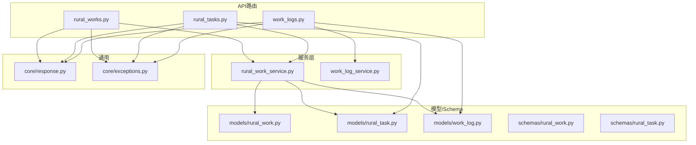
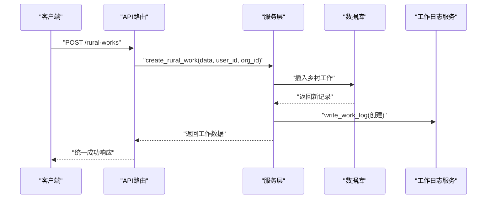
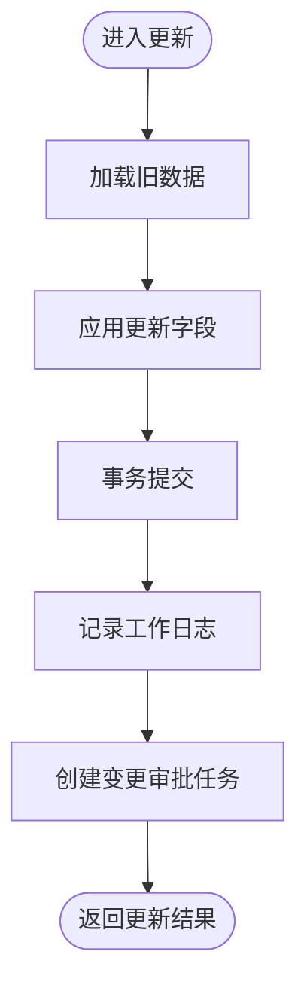
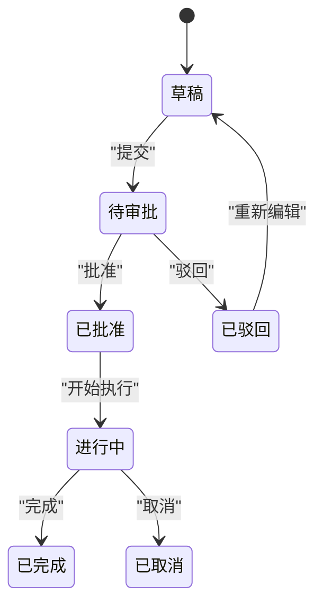
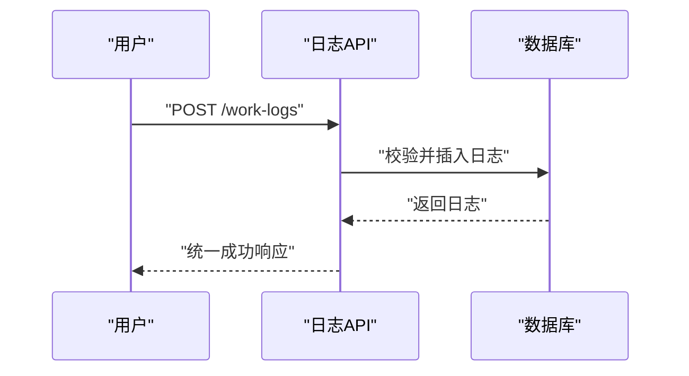
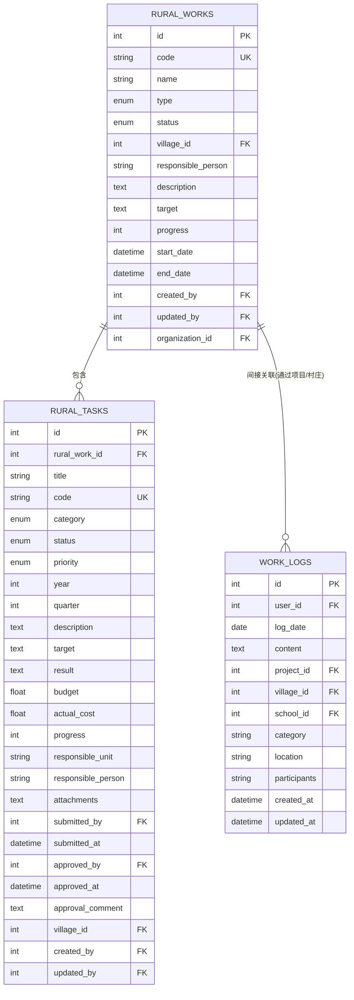
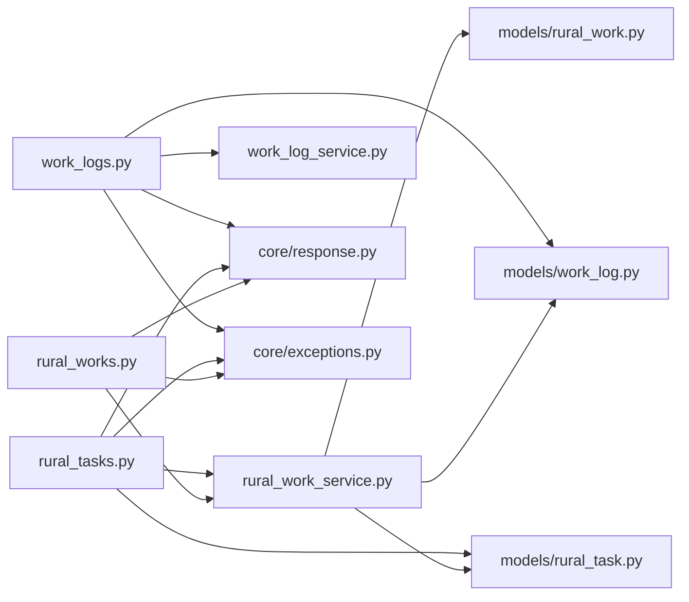

# 乡村工作API

<cite>
**本文引用的文件**
- [rural_works.py](file://backend/app/api/v1/rural_works.py)
- [rural_tasks.py](file://backend/app/api/v1/rural_tasks.py)
- [work_logs.py](file://backend/app/api/v1/work_logs.py)
- [rural_work_service.py](file://backend/app/services/rural_work_service.py)
- [work_log_service.py](file://backend/app/services/work_log_service.py)
- [rural_work.py](file://backend/app/models/rural_work.py)
- [rural_task.py](file://backend/app/models/rural_task.py)
- [work_log.py](file://backend/app/models/work_log.py)
- [rural_work_schema.py](file://backend/app/schemas/rural_work.py)
- [rural_task_schema.py](file://backend/app/schemas/rural_task.py)
- [response.py](file://backend/app/core/response.py)
- [exceptions.py](file://backend/app/core/exceptions.py)
</cite>

## 目录
1. [简介](#简介)
2. [项目结构](#项目结构)
3. [核心组件](#核心组件)
4. [架构总览](#架构总览)
5. [详细组件分析](#详细组件分析)
6. [依赖关系分析](#依赖关系分析)
7. [性能考虑](#性能考虑)
8. [故障排查指南](#故障排查指南)
9. [结论](#结论)
10. [附录：API参考与调用示例](#附录api参考与调用示例)

## 简介
本文件为“乡村工作”模块的API技术文档，覆盖工作任务管理、工作报告提交、工作日志记录等接口的HTTP方法、URL路径、请求参数、响应格式与错误处理；并说明任务状态流转、进度跟踪、统计汇总等业务逻辑，以及与项目管理、审批流程等模块的数据关联。文档面向开发与集成人员，提供可直接用于联调的接口约定与调用示例。

## 项目结构
后端采用FastAPI路由+服务层+模型/Schema的分层设计：
- API路由层：定义HTTP端点、参数校验、权限与事务控制
- 服务层：封装业务逻辑（数据权限过滤、统计、报告生成、审计日志）
- 模型层：SQLAlchemy ORM实体（乡村工作、任务、日志）
- Schema层：Pydantic请求/响应模型
- 通用能力：统一响应体、异常处理器、事务工具、工作日志写入工具

**图表来源**
- [rural_works.py:1-272](file://backend/app/api/v1/rural_works.py#L1-L272)
- [rural_tasks.py:1-366](file://backend/app/api/v1/rural_tasks.py#L1-L366)
- [work_logs.py:1-437](file://backend/app/api/v1/work_logs.py#L1-L437)
- [rural_work_service.py:1-533](file://backend/app/services/rural_work_service.py#L1-L533)
- [work_log_service.py:1-100](file://backend/app/services/work_log_service.py#L1-L100)
- [rural_work.py:1-76](file://backend/app/models/rural_work.py#L1-L76)
- [rural_task.py:1-133](file://backend/app/models/rural_task.py#L1-L133)
- [work_log.py:1-79](file://backend/app/models/work_log.py#L1-L79)
- [response.py:1-178](file://backend/app/core/response.py#L1-L178)
- [exceptions.py:1-145](file://backend/app/core/exceptions.py#L1-L145)

**章节来源**
- [rural_works.py:1-272](file://backend/app/api/v1/rural_works.py#L1-L272)
- [rural_tasks.py:1-366](file://backend/app/api/v1/rural_tasks.py#L1-L366)
- [work_logs.py:1-437](file://backend/app/api/v1/work_logs.py#L1-L437)
- [rural_work_service.py:1-533](file://backend/app/services/rural_work_service.py#L1-L533)
- [work_log_service.py:1-100](file://backend/app/services/work_log_service.py#L1-L100)
- [rural_work.py:1-76](file://backend/app/models/rural_work.py#L1-L76)
- [rural_task.py:1-133](file://backend/app/models/rural_task.py#L1-L133)
- [work_log.py:1-79](file://backend/app/models/work_log.py#L1-L79)
- [response.py:1-178](file://backend/app/core/response.py#L1-L178)
- [exceptions.py:1-145](file://backend/app/core/exceptions.py#L1-L145)

## 核心组件
- 乡村工作（RuralWork）：代表一项帮扶工作，包含类型、状态、时间范围、目标、进度、负责人、所属组织等字段，支持列表查询、详情、创建、更新、删除、批量删除、统计与报告生成。
- 乡村工作任务（RuralTask）：乡村工作的子任务，具备分类、优先级、年度/季度、预算与实际花费、计划/实际起止时间、审批流（草稿→待审批→已批准/驳回→进行中→已完成/取消）等。
- 工作日志（WorkLog）：记录日常工作内容，支持按日期、项目、村庄、学校、类别筛选，提供日历视图与月度总结。

**章节来源**
- [rural_work.py:18-76](file://backend/app/models/rural_work.py#L18-L76)
- [rural_task.py:21-133](file://backend/app/models/rural_task.py#L21-L133)
- [work_log.py:10-79](file://backend/app/models/work_log.py#L10-L79)

## 架构总览
乡村工作模块通过FastAPI路由暴露REST接口，调用服务层完成数据权限过滤、统计计算、报告生成与审计日志记录；所有写操作均使用事务工具保证一致性；统一响应体与异常处理器确保前后端契约一致。

**图表来源**
- [rural_works.py:150-175](file://backend/app/api/v1/rural_works.py#L150-L175)
- [rural_work_service.py:260-309](file://backend/app/services/rural_work_service.py#L260-L309)
- [work_log_service.py:58-99](file://backend/app/services/work_log_service.py#L58-L99)

## 详细组件分析

### 乡村工作（RuralWork）API
- 列表查询
  - 方法/路径：GET /rural-works
  - 查询参数：skip、limit、status、type、village_id、search、start_date、end_date、year、order_by、order_desc
  - 响应：分页对象 {code, message, success, data: {items, total, page, page_size}}
  - 权限：数据权限隔离（管理员全量；部门范围含下级组织；仅本人按创建人）
- 统计摘要
  - 方法/路径：GET /rural-works/statistics/summary
  - 响应：{total, planned, in_progress, completed, delayed, by_type, completion_rate}
- 下拉村庄
  - 方法/路径：GET /rural-works/villages
  - 响应：[{id, name, county}]
- 报告生成
  - 方法/路径：GET /rural-works/report/generate?year=&start_date=&end_date=
  - 响应：{total, by_status, by_type, completion_rate, summary, items}
- 可用年份
  - 方法/路径：GET /rural-works/years
  - 响应：[int]
- 详情
  - 方法/路径：GET /rural-works/{work_id}
  - 响应：单条工作数据
- 创建
  - 方法/路径：POST /rural-works
  - 请求体：RuralWorkCreate（名称必填，其他可选）
  - 响应：工作数据 + approval_task_id
  - 副作用：自动创建审批任务（注册到审批工作流）
- 更新
  - 方法/路径：PUT /rural-works/{work_id}
  - 请求体：RuralWorkUpdate（部分更新）
  - 响应：工作数据 + approval_task_id
  - 副作用：自动创建变更审批任务（附带原值对比）
- 删除
  - 方法/路径：DELETE /rural-works/{work_id}
  - 响应：成功消息
  - 副作用：自动创建删除审批任务
- 批量删除
  - 方法/路径：POST /rural-works/batch-delete
  - 请求体：{"ids": [int]}
  - 响应：{deleted, approval_task_id}
  - 副作用：批量审计日志 + 审批任务

**图表来源**
- [rural_works.py:178-202](file://backend/app/api/v1/rural_works.py#L178-L202)
- [rural_work_service.py:311-368](file://backend/app/services/rural_work_service.py#L311-L368)

**章节来源**
- [rural_works.py:57-272](file://backend/app/api/v1/rural_works.py#L57-L272)
- [rural_work_service.py:162-517](file://backend/app/services/rural_work_service.py#L162-L517)
- [rural_work_schema.py:50-130](file://backend/app/schemas/rural_work.py#L50-L130)

### 乡村工作任务（RuralTask）API
- 列表查询
  - 方法/路径：GET /rural-tasks
  - 查询参数：skip、limit、rural_work_id、status、category、year、village_id、search、order_by、order_desc
  - 权限：非管理员仅可见自己创建的任务
- 统计
  - 方法/路径：GET /rural-tasks/statistics
  - 响应：{total, draft, pending_approval, in_progress, completed, rejected, by_category, total_budget, total_actual_cost, completion_rate}
- 详情
  - 方法/路径：GET /rural-tasks/{task_id}
  - 权限：需属主或管理员
- 创建
  - 方法/路径：POST /rural-tasks
  - 请求体：RuralTaskCreate（标题必填，关联乡村工作ID必填）
  - 响应：任务数据（默认状态：草稿）
- 更新
  - 方法/路径：PUT /rural-tasks/{task_id}
  - 请求体：RuralTaskUpdate（部分更新）
  - 响应：任务数据
- 删除
  - 方法/路径：DELETE /rural-tasks/{task_id}
  - 权限：需属主或管理员
- 提交审批
  - 方法/路径：POST /rural-tasks/{task_id}/submit
  - 请求体：{"comment": "..."}
  - 行为：仅草稿或被驳回可提交；提交后状态变为“待审批”，记录提交人与时间
- 审批
  - 方法/路径：POST /rural-tasks/{task_id}/approve
  - 请求体：{"approved": bool, "comment": "..."}
  - 行为：仅待审批可审批；批准后状态“已批准”，驳回则“已驳回”
- 批量删除
  - 方法/路径：POST /rural-tasks/batch-delete
  - 请求体：{"ids": [int]}
  - 权限：非管理员仅能删除自己创建的任务

**图表来源**
- [rural_tasks.py:276-333](file://backend/app/api/v1/rural_tasks.py#L276-L333)
- [rural_task.py:35-45](file://backend/app/models/rural_task.py#L35-L45)

**章节来源**
- [rural_tasks.py:72-366](file://backend/app/api/v1/rural_tasks.py#L72-L366)
- [rural_task_schema.py:9-130](file://backend/app/schemas/rural_task.py#L9-L130)
- [rural_task.py:56-133](file://backend/app/models/rural_task.py#L56-L133)

### 工作日志（WorkLog）API
- 列表查询
  - 方法/路径：GET /work-logs
  - 查询参数：start_date、end_date、project_id、village_id、category、keyword、log_type、source、page、page_size
  - 权限：非管理员仅可见自己的手动日志；自动日志所有人可见
- 创建
  - 方法/路径：POST /work-logs
  - 请求体：兼容前端字段 title/work_date/log_type 与标准字段 log_date/content/category/location/participants
  - 校验：日期与内容必填；同一用户同一天checkin去重
- 更新
  - 方法/路径：PUT /work-logs/{log_id}
  - 权限：仅本人或管理员
- 删除
  - 方法/路径：DELETE /work-logs/{log_id}
  - 权限：仅本人或管理员；自动日志不可删
- 日历事件
  - 方法/路径：GET /work-logs/calendar?year=&month=
  - 响应：当月日志条目（自动优先排序）
- 月度总结
  - 方法/路径：GET /work-logs/monthly-summary?year=&month=
  - 响应：总条数、打卡天数、分类统计、明细与总结文本

**图表来源**
- [work_logs.py:163-233](file://backend/app/api/v1/work_logs.py#L163-L233)

**章节来源**
- [work_logs.py:77-437](file://backend/app/api/v1/work_logs.py#L77-L437)
- [work_log.py:10-79](file://backend/app/models/work_log.py#L10-L79)

### 数据模型与关系

**图表来源**
- [rural_work.py:34-76](file://backend/app/models/rural_work.py#L34-L76)
- [rural_task.py:56-133](file://backend/app/models/rural_task.py#L56-L133)
- [work_log.py:10-79](file://backend/app/models/work_log.py#L10-L79)

**章节来源**
- [rural_work.py:34-76](file://backend/app/models/rural_work.py#L34-L76)
- [rural_task.py:56-133](file://backend/app/models/rural_task.py#L56-L133)
- [work_log.py:10-79](file://backend/app/models/work_log.py#L10-L79)

## 依赖关系分析
- 路由与服务：路由负责参数解析与权限注入，服务层实现数据权限过滤、统计、报告生成与审计日志
- 服务与模型：服务层直接操作ORM模型，并通过索引优化查询（如按状态、类型、村庄、年度）
- 服务与日志：关键写操作通过工作日志服务记录审计轨迹
- 路由与通用：统一响应体与异常处理器保障一致的HTTP语义

**图表来源**
- [rural_works.py:1-272](file://backend/app/api/v1/rural_works.py#L1-L272)
- [rural_tasks.py:1-366](file://backend/app/api/v1/rural_tasks.py#L1-L366)
- [work_logs.py:1-437](file://backend/app/api/v1/work_logs.py#L1-L437)
- [rural_work_service.py:1-533](file://backend/app/services/rural_work_service.py#L1-L533)
- [work_log_service.py:1-100](file://backend/app/services/work_log_service.py#L1-L100)
- [response.py:1-178](file://backend/app/core/response.py#L1-L178)
- [exceptions.py:1-145](file://backend/app/core/exceptions.py#L1-L145)

**章节来源**
- [rural_works.py:1-272](file://backend/app/api/v1/rural_works.py#L1-L272)
- [rural_tasks.py:1-366](file://backend/app/api/v1/rural_tasks.py#L1-L366)
- [work_logs.py:1-437](file://backend/app/api/v1/work_logs.py#L1-L437)
- [rural_work_service.py:1-533](file://backend/app/services/rural_work_service.py#L1-L533)
- [work_log_service.py:1-100](file://backend/app/services/work_log_service.py#L1-L100)
- [response.py:1-178](file://backend/app/core/response.py#L1-L178)
- [exceptions.py:1-145](file://backend/app/core/exceptions.py#L1-L145)

## 性能考虑
- 列表查询使用分页（skip/limit），避免一次性拉取大量数据
- 常用筛选字段建立索引（状态、类型、村庄、年度），提升过滤性能
- 统计与报告聚合在数据库侧完成（group by、extract year），减少内存压力
- 日志查询对自动日志优先排序，提升用户体验
- 写操作使用事务工具，保证一致性且最小化锁持有时间

[本节为通用性能建议，不直接分析具体文件]

## 故障排查指南
- 参数验证失败：返回422，包含errors数组，检查请求体字段类型与约束
- 资源不存在：返回404，检查ID是否存在或是否被删除
- 无权限访问：返回403，检查当前用户角色与数据权限（仅本人/部门范围/管理员）
- 服务器内部错误：返回500，查看服务端日志定位未捕获异常
- 工作日志写入失败：写日志失败不影响主业务流程，但会记录调试日志；若频繁失败，检查user_id是否为空及数据库连接

**章节来源**
- [exceptions.py:123-145](file://backend/app/core/exceptions.py#L123-L145)
- [work_log_service.py:58-99](file://backend/app/services/work_log_service.py#L58-L99)

## 结论
乡村工作API围绕“工作-任务-日志”三要素构建，提供完整的CRUD、审批流、统计与报告能力，并通过数据权限隔离与审计日志满足合规与可追溯要求。结合统一的响应体与异常处理，便于前后端高效协作与问题定位。

[本节为总结性内容，不直接分析具体文件]

## 附录：API参考与调用示例

### 统一响应格式
- 成功响应：{code: 200, message: "success", success: true, data: ...}
- 列表响应：data中包含 {items, total, page, page_size}
- 错误响应：{code: <http状态码>, message: "...", success: false, errors?: [...], detail?: "..."}

**章节来源**
- [response.py:63-98](file://backend/app/core/response.py#L63-L98)
- [response.py:101-178](file://backend/app/core/response.py#L101-L178)

### 乡村工作
- GET /rural-works
  - 示例：GET /rural-works?status=in_progress&type=infrastructure&year=2025&page=1&page_size=20
  - 响应：分页列表
- POST /rural-works
  - 示例：{"name": "道路修缮", "type": "infrastructure", "start_date": "2025-06-01", "end_date": "2025-08-31", "target": "完成主干道硬化"}
  - 响应：工作数据 + approval_task_id
- PUT /rural-works/{work_id}
  - 示例：{"progress": 60, "status": "in_progress"}
  - 响应：工作数据 + approval_task_id
- DELETE /rural-works/{work_id}
  - 示例：DELETE /rural-works/123
  - 响应：成功消息
- POST /rural-works/batch-delete
  - 示例：{"ids": [123, 124]}
  - 响应：{deleted: 2, approval_task_id: ...}
- GET /rural-works/statistics/summary
  - 示例：GET /rural-works/statistics/summary
  - 响应：统计对象
- GET /rural-works/report/generate
  - 示例：GET /rural-works/report/generate?year=2025&start_date=2025-01-01&end_date=2025-12-31
  - 响应：报告数据

**章节来源**
- [rural_works.py:57-272](file://backend/app/api/v1/rural_works.py#L57-L272)
- [rural_work_schema.py:50-130](file://backend/app/schemas/rural_work.py#L50-L130)

### 乡村工作任务
- GET /rural-tasks
  - 示例：GET /rural-tasks?status=draft&category=infrastructure&year=2025
  - 响应：分页列表
- POST /rural-tasks
  - 示例：{"rural_work_id": 1, "title": "桥梁加固", "category": "infrastructure", "budget": 50.0}
  - 响应：任务数据（状态：草稿）
- PUT /rural-tasks/{task_id}
  - 示例：{"progress": 30, "actual_start": "2025-06-10T09:00:00Z"}
  - 响应：任务数据
- POST /rural-tasks/{task_id}/submit
  - 示例：{"comment": "请审批"}
  - 响应：提交成功
- POST /rural-tasks/{task_id}/approve
  - 示例：{"approved": true, "comment": "同意"}
  - 响应：任务已批准
- GET /rural-tasks/statistics
  - 示例：GET /rural-tasks/statistics?year=2025
  - 响应：统计对象

**章节来源**
- [rural_tasks.py:72-366](file://backend/app/api/v1/rural_tasks.py#L72-L366)
- [rural_task_schema.py:9-130](file://backend/app/schemas/rural_task.py#L9-L130)

### 工作日志
- GET /work-logs
  - 示例：GET /work-logs?start_date=2025-06-01&end_date=2025-06-30&category=visit&page=1&page_size=20
  - 响应：分页列表
- POST /work-logs
  - 示例：{"work_date": "2025-06-10", "content": "走访农户了解需求", "category": "visit", "location": "某村村委会"}
  - 响应：日志数据
- PUT /work-logs/{log_id}
  - 示例：{"content": "补充了后续跟进计划"}
  - 响应：日志数据
- DELETE /work-logs/{log_id}
  - 示例：DELETE /work-logs/456
  - 响应：成功消息
- GET /work-logs/calendar
  - 示例：GET /work-logs/calendar?year=2025&month=6
  - 响应：当月日志条目
- GET /work-logs/monthly-summary
  - 示例：GET /work-logs/monthly-summary?year=2025&month=6
  - 响应：月度总结数据

**章节来源**
- [work_logs.py:77-437](file://backend/app/api/v1/work_logs.py#L77-L437)

### 与项目管理、审批流程的数据关联
- 工作日志可关联项目（project_id）、村庄（village_id）、学校（school_id），形成跨模块关联
- 乡村工作新增/更新/删除会自动创建审批任务，进入审批工作流；任务提交/审批状态变更会记录审计日志
- 乡村工作与服务层的数据权限过滤确保不同组织/部门的数据隔离

**章节来源**
- [work_log.py:32-49](file://backend/app/models/work_log.py#L32-L49)
- [rural_works.py:150-227](file://backend/app/api/v1/rural_works.py#L150-L227)
- [rural_tasks.py:276-333](file://backend/app/api/v1/rural_tasks.py#L276-L333)
- [rural_work_service.py:30-89](file://backend/app/services/rural_work_service.py#L30-L89)