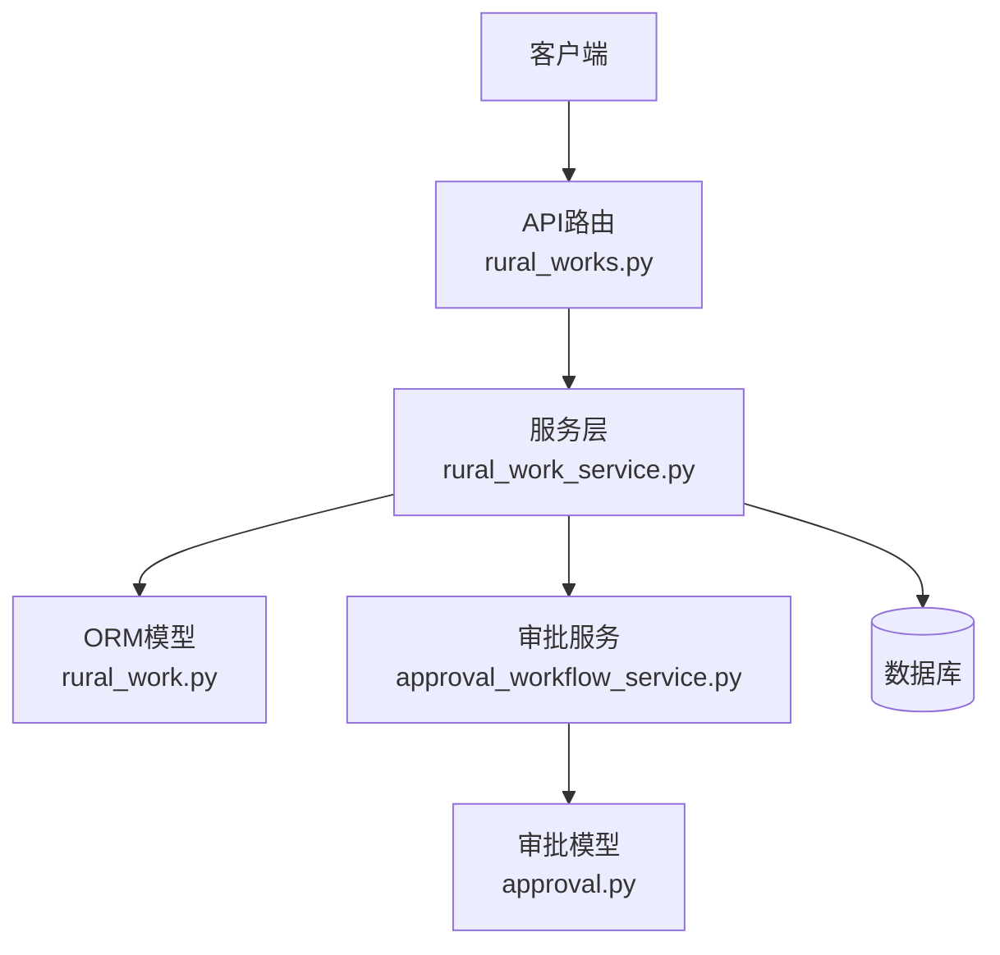
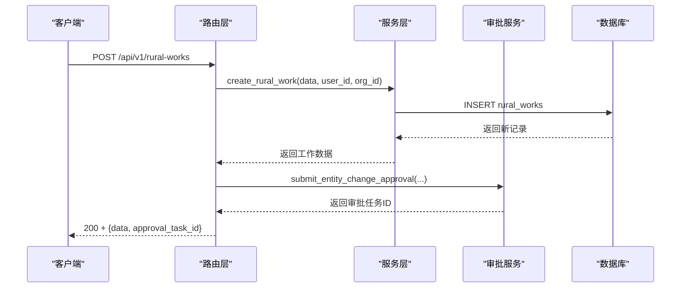
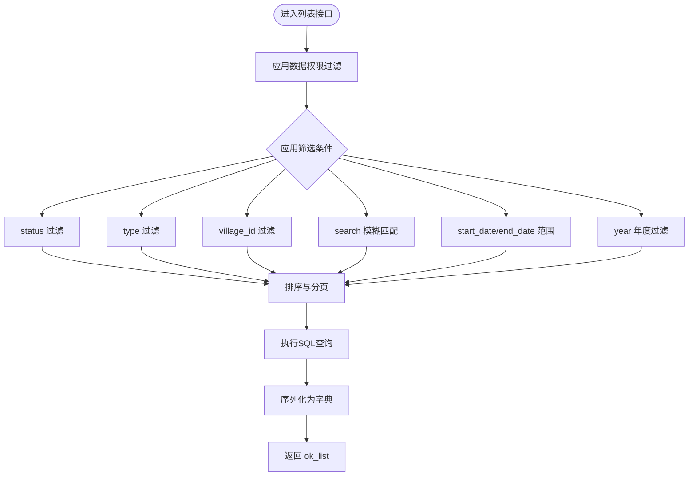
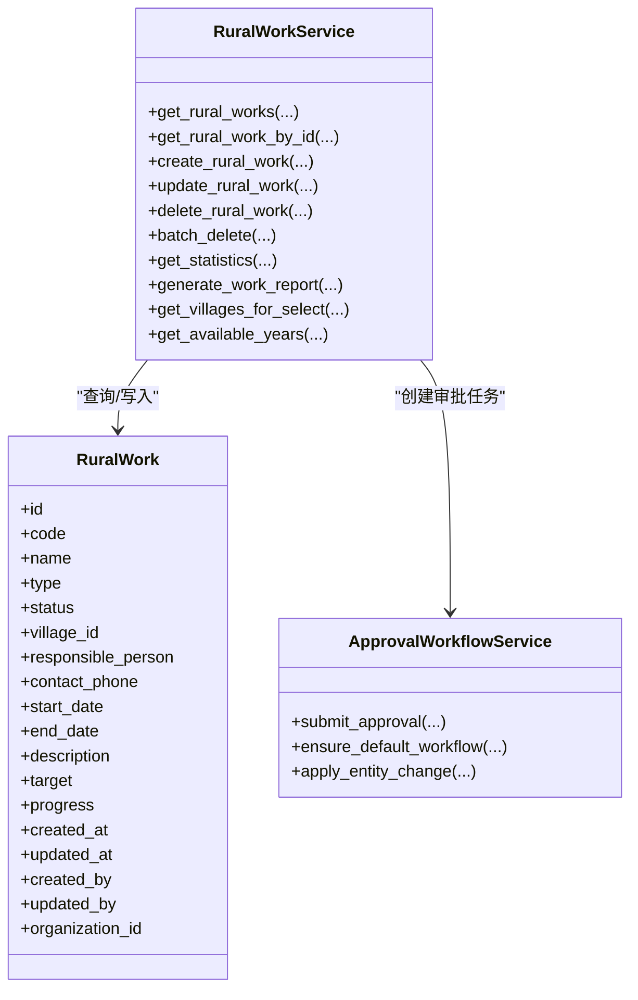

# 乡村工作管理API

<cite>
**本文引用的文件**
- [backend/app/api/v1/rural_works.py](file://backend/app/api/v1/rural_works.py)
- [backend/app/services/rural_work_service.py](file://backend/app/services/rural_work_service.py)
- [backend/app/models/rural_work.py](file://backend/app/models/rural_work.py)
- [backend/app/schemas/rural_work.py](file://backend/app/schemas/rural_work.py)
- [backend/app/services/approval_workflow_service.py](file://backend/app/services/approval_workflow_service.py)
- [backend/app/models/approval.py](file://backend/app/models/approval.py)
</cite>

## 目录
1. [简介](#简介)
2. [项目结构](#项目结构)
3. [核心组件](#核心组件)
4. [架构总览](#架构总览)
5. [详细接口说明](#详细接口说明)
6. [依赖关系分析](#依赖关系分析)
7. [性能与查询优化](#性能与查询优化)
8. [故障排查指南](#故障排查指南)
9. [结论](#结论)
10. [附录：完整调用示例](#附录完整调用示例)

## 简介
本文件为“乡村工作管理”模块的API文档，覆盖CRUD操作、高级筛选（分页、状态/类型/村庄/搜索/日期范围/年度）、统计与报告、以及审批流程集成。所有接口均基于FastAPI实现，服务层封装数据访问与权限过滤，并通过统一响应格式返回结果。

## 项目结构
- API路由：位于 backend/app/api/v1/rural_works.py，定义HTTP端点与参数校验。
- 服务层：backend/app/services/rural_work_service.py，负责业务逻辑、数据权限隔离、分页与筛选、序列化。
- 数据模型：backend/app/models/rural_work.py，定义数据库表结构与索引。
- 请求/响应Schema：backend/app/schemas/rural_work.py，定义创建、更新、列表与统计等数据结构。
- 审批集成：backend/app/services/approval_workflow_service.py，提供自动提交审批任务的能力；审批实体模型在 backend/app/models/approval.py。

图表来源
- [backend/app/api/v1/rural_works.py:57-272](file://backend/app/api/v1/rural_works.py#L57-L272)
- [backend/app/services/rural_work_service.py:162-516](file://backend/app/services/rural_work_service.py#L162-L516)
- [backend/app/models/rural_work.py:34-76](file://backend/app/models/rural_work.py#L34-L76)
- [backend/app/services/approval_workflow_service.py:30-200](file://backend/app/services/approval_workflow_service.py#L30-L200)
- [backend/app/models/approval.py:149-179](file://backend/app/models/approval.py#L149-L179)

章节来源
- [backend/app/api/v1/rural_works.py:1-272](file://backend/app/api/v1/rural_works.py#L1-L272)
- [backend/app/services/rural_work_service.py:1-533](file://backend/app/services/rural_work_service.py#L1-L533)
- [backend/app/models/rural_work.py:1-76](file://backend/app/models/rural_work.py#L1-L76)
- [backend/app/schemas/rural_work.py:1-130](file://backend/app/schemas/rural_work.py#L1-L130)
- [backend/app/services/approval_workflow_service.py:1-200](file://backend/app/services/approval_workflow_service.py#L1-L200)
- [backend/app/models/approval.py:149-179](file://backend/app/models/approval.py#L149-L179)

## 核心组件
- 路由层：定义RESTful端点，解析查询参数，调用服务层，并处理异常与统一响应。
- 服务层：实现CRUD、分页、多条件筛选、数据权限隔离、统计与报告生成、村庄下拉数据同步。
- 模型层：定义乡村工作实体字段、枚举类型、外键关系与索引。
- Schema层：定义请求体与响应体的字段约束、日期解析、统计结构。
- 审批集成：新增/修改/删除乡村工作时自动创建审批任务，支持变更对比与审计留痕。

章节来源
- [backend/app/api/v1/rural_works.py:57-272](file://backend/app/api/v1/rural_works.py#L57-L272)
- [backend/app/services/rural_work_service.py:124-516](file://backend/app/services/rural_work_service.py#L124-L516)
- [backend/app/models/rural_work.py:34-76](file://backend/app/models/rural_work.py#L34-L76)
- [backend/app/schemas/rural_work.py:50-130](file://backend/app/schemas/rural_work.py#L50-L130)
- [backend/app/services/approval_workflow_service.py:30-200](file://backend/app/services/approval_workflow_service.py#L30-L200)

## 架构总览
乡村工作管理采用分层架构：
- 路由层接收HTTP请求，进行参数校验与权限注入，调用服务层。
- 服务层执行业务逻辑，包括数据权限过滤、筛选、分页、事务提交与日志记录。
- 模型层映射数据库表，提供ORM查询能力。
- 审批服务在关键写操作后自动创建审批任务，形成闭环。

图表来源
- [backend/app/api/v1/rural_works.py:150-175](file://backend/app/api/v1/rural_works.py#L150-L175)
- [backend/app/services/rural_work_service.py:260-309](file://backend/app/services/rural_work_service.py#L260-L309)
- [backend/app/services/approval_workflow_service.py:30-200](file://backend/app/services/approval_workflow_service.py#L30-L200)

## 详细接口说明

### 通用约定
- 基础路径：/api/v1/rural-works
- 认证：需要登录用户上下文（current_user）
- 统一响应：使用 ResponseModel 或 ok_list 包装，包含 code、data、message 等字段
- 错误处理：找不到资源时抛出 NotFoundException，由全局异常处理器返回标准错误

章节来源
- [backend/app/api/v1/rural_works.py:10-30](file://backend/app/api/v1/rural_works.py#L10-L30)
- [backend/app/api/v1/rural_works.py:136-147](file://backend/app/api/v1/rural_works.py#L136-L147)

### 列表查询（分页、筛选、排序）
- 方法：GET
- 路径：/api/v1/rural-works
- 查询参数
  - skip: 跳过记录数，默认0，最小0
  - limit: 每页记录数，默认10，最大500
  - status: 状态筛选（如 planned、in_progress、completed、delayed）
  - type: 类型筛选（如 infrastructure、industry、education、healthcare、environment）
  - village_id: 村庄ID筛选
  - search: 关键词模糊匹配名称与描述
  - start_date: 开始日期筛选（YYYY-MM-DD 或 ISO8601）
  - end_date: 结束日期筛选（YYYY-MM-DD 或 ISO8601）
  - year: 年度筛选（按 start_date 年份）
  - order_by: 排序字段，默认 created_at
  - order_desc: 是否降序，默认 True
- 响应：ok_list 结构，包含 items、total、page、page_size
- 数据权限：管理员全量；部门范围含下级组织；仅本人按创建人过滤

图表来源
- [backend/app/api/v1/rural_works.py:57-90](file://backend/app/api/v1/rural_works.py#L57-L90)
- [backend/app/services/rural_work_service.py:162-221](file://backend/app/services/rural_work_service.py#L162-L221)

章节来源
- [backend/app/api/v1/rural_works.py:57-90](file://backend/app/api/v1/rural_works.py#L57-L90)
- [backend/app/services/rural_work_service.py:162-221](file://backend/app/services/rural_work_service.py#L162-L221)

### 获取详情
- 方法：GET
- 路径：/api/v1/rural-works/{work_id}
- 路径参数：work_id（整数）
- 响应：ResponseModel.data 为单个工作对象
- 错误：不存在时返回404

章节来源
- [backend/app/api/v1/rural_works.py:136-147](file://backend/app/api/v1/rural_works.py#L136-L147)
- [backend/app/services/rural_work_service.py:224-233](file://backend/app/services/rural_work_service.py#L224-L233)

### 创建工作
- 方法：POST
- 路径：/api/v1/rural-works
- 请求体：RuralWorkCreate
  - name: 必填，长度1-200
  - description: 可选，最大500
  - type: 可选，枚举值
  - status: 可选，枚举值
  - village_id: 可选
  - responsible_person: 可选，最大50
  - contact_phone: 可选，最大20
  - start_date: 可选，支持多种日期格式
  - end_date: 可选，支持多种日期格式
  - target: 可选
  - progress: 可选，0-100
- 响应：ResponseModel.data 为新工作对象，包含 approval_task_id
- 审批集成：自动创建审批任务，标题包含工作名称或ID

章节来源
- [backend/app/api/v1/rural_works.py:150-175](file://backend/app/api/v1/rural_works.py#L150-L175)
- [backend/app/schemas/rural_work.py:50-64](file://backend/app/schemas/rural_work.py#L50-L64)
- [backend/app/services/rural_work_service.py:260-309](file://backend/app/services/rural_work_service.py#L260-L309)

### 更新工作
- 方法：PUT
- 路径：/api/v1/rural-works/{work_id}
- 请求体：RuralWorkUpdate（部分字段更新）
- 响应：ResponseModel.data 为更新后的工作对象，包含 approval_task_id
- 错误：不存在时返回404
- 审批集成：自动创建审批任务，携带变更前后数据对比

章节来源
- [backend/app/api/v1/rural_works.py:178-202](file://backend/app/api/v1/rural_works.py#L178-L202)
- [backend/app/schemas/rural_work.py:66-80](file://backend/app/schemas/rural_work.py#L66-L80)
- [backend/app/services/rural_work_service.py:311-368](file://backend/app/services/rural_work_service.py#L311-L368)

### 删除工作
- 方法：DELETE
- 路径：/api/v1/rural-works/{work_id}
- 响应：ResponseModel.message 表示成功
- 错误：不存在时返回404
- 审批集成：自动创建审批任务，标记删除并保留原数据快照

章节来源
- [backend/app/api/v1/rural_works.py:205-227](file://backend/app/api/v1/rural_works.py#L205-L227)
- [backend/app/services/rural_work_service.py:235-258](file://backend/app/services/rural_work_service.py#L235-L258)

### 批量删除
- 方法：POST
- 路径：/api/v1/rural-works/batch-delete
- 请求体：{ "ids": [1, 2, 3] }
- 响应：ResponseModel.data 包含 deleted 数量与 approval_task_id
- 审计：记录批量删除日志

章节来源
- [backend/app/api/v1/rural_works.py:230-271](file://backend/app/api/v1/rural_works.py#L230-L271)
- [backend/app/services/rural_work_service.py:502-516](file://backend/app/services/rural_work_service.py#L502-L516)

### 统计数据
- 方法：GET
- 路径：/api/v1/rural-works/statistics/summary
- 响应：ResponseModel.data 为 RuralWorkStatistics
  - total、planned、in_progress、completed、delayed
  - by_type：按类型的计数
  - completion_rate：完成率

章节来源
- [backend/app/api/v1/rural_works.py:93-98](file://backend/app/api/v1/rural_works.py#L93-L98)
- [backend/app/services/rural_work_service.py:370-396](file://backend/app/services/rural_work_service.py#L370-L396)
- [backend/app/schemas/rural_work.py:120-130](file://backend/app/schemas/rural_work.py#L120-L130)

### 村庄下拉列表
- 方法：GET
- 路径：/api/v1/rural-works/villages
- 响应：ResponseModel.data 为村庄列表（id、name、county）
- 说明：从帮扶村表同步到 villages 表，保证外键一致性与下拉数据可用

章节来源
- [backend/app/api/v1/rural_works.py:101-106](file://backend/app/api/v1/rural_works.py#L101-L106)
- [backend/app/services/rural_work_service.py:398-442](file://backend/app/services/rural_work_service.py#L398-L442)

### 工作报告汇总
- 方法：GET
- 路径：/api/v1/rural-works/report/generate
- 查询参数：year、start_date、end_date
- 响应：ResponseModel.data 包含 total、by_status、by_type、completion_rate、items

章节来源
- [backend/app/api/v1/rural_works.py:109-125](file://backend/app/api/v1/rural_works.py#L109-L125)
- [backend/app/services/rural_work_service.py:444-488](file://backend/app/services/rural_work_service.py#L444-L488)

### 可用年份列表
- 方法：GET
- 路径：/api/v1/rural-works/years
- 响应：ResponseModel.data 为年份数组（降序）

章节来源
- [backend/app/api/v1/rural_works.py:128-133](file://backend/app/api/v1/rural_works.py#L128-L133)
- [backend/app/services/rural_work_service.py:490-500](file://backend/app/services/rural_work_service.py#L490-L500)

## 依赖关系分析
- 路由依赖服务层：所有CRUD与查询均通过 RuralWorkService 完成。
- 服务依赖模型：使用 SQLAlchemy ORM 查询 rural_works 表。
- 服务依赖审批服务：在写操作后调用 submit_entity_change_approval 创建审批任务。
- 数据权限：服务层内置 _apply_work_scope 与 _can_access_work 实现细粒度访问控制。

图表来源
- [backend/app/services/rural_work_service.py:124-516](file://backend/app/services/rural_work_service.py#L124-L516)
- [backend/app/models/rural_work.py:34-76](file://backend/app/models/rural_work.py#L34-L76)
- [backend/app/services/approval_workflow_service.py:30-200](file://backend/app/services/approval_workflow_service.py#L30-L200)

章节来源
- [backend/app/services/rural_work_service.py:124-516](file://backend/app/services/rural_work_service.py#L124-L516)
- [backend/app/models/rural_work.py:34-76](file://backend/app/models/rural_work.py#L34-L76)
- [backend/app/services/approval_workflow_service.py:30-200](file://backend/app/services/approval_workflow_service.py#L30-L200)

## 性能与查询优化
- 索引：rural_works 表对 type、status、village_id 建立索引，提升筛选与分组效率。
- 分页：skip/limit 配合 offset/limit 避免全表扫描。
- 排序：order_by 支持动态字段，默认按 created_at 降序。
- 筛选：字符串模糊匹配使用 ilike，日期范围使用 fromisoformat 解析，年度使用 extract(year,...)。
- 数据权限：在服务层统一过滤，减少前端复杂度与无效数据传输。

章节来源
- [backend/app/models/rural_work.py:71-76](file://backend/app/models/rural_work.py#L71-L76)
- [backend/app/services/rural_work_service.py:162-221](file://backend/app/services/rural_work_service.py#L162-L221)

## 故障排查指南
- 404 未找到：当 work_id 不存在时，路由层抛出 NotFoundException，检查ID是否正确。
- 权限拒绝：若当前用户无权限访问某条记录，服务层返回空或None，检查数据权限配置与用户角色。
- 日期解析失败：start_date/end_date 需符合支持的格式，否则会被忽略或回退。
- 审批任务未创建：确认审批流程已存在（系统会自动创建默认流程），检查 submit_entity_change_approval 调用是否成功。
- 批量删除日志失败：日志记录失败不影响主流程，可忽略或检查日志服务。

章节来源
- [backend/app/api/v1/rural_works.py:136-147](file://backend/app/api/v1/rural_works.py#L136-L147)
- [backend/app/services/rural_work_service.py:235-258](file://backend/app/services/rural_work_service.py#L235-L258)
- [backend/app/services/approval_workflow_service.py:180-197](file://backend/app/services/approval_workflow_service.py#L180-L197)

## 结论
乡村工作管理API提供了完整的CRUD能力与丰富的筛选功能，结合数据权限隔离与审批流程集成，满足乡村工作的日常管理与合规要求。建议在生产环境启用索引、合理设置分页大小，并结合审批流程确保数据变更的可追溯性。

## 附录：完整调用示例

### 创建工作
- 请求
  - 方法：POST
  - 路径：/api/v1/rural-works
  - 请求体：
    - name: "基础设施建设项目"
    - type: "infrastructure"
    - status: "planned"
    - village_id: 1
    - start_date: "2025-01-01"
    - end_date: "2025-12-31"
- 响应
  - data.id: 新工作ID
  - data.approval_task_id: 审批任务ID
  - message: "创建成功"

章节来源
- [backend/app/api/v1/rural_works.py:150-175](file://backend/app/api/v1/rural_works.py#L150-L175)
- [backend/app/schemas/rural_work.py:50-64](file://backend/app/schemas/rural_work.py#L50-L64)

### 列表查询（分页+筛选）
- 请求
  - 方法：GET
  - 路径：/api/v1/rural-works?skip=0&limit=20&type=infrastructure&status=planned&search=建设&start_date=2025-01-01&end_date=2025-12-31&year=2025
- 响应
  - data.items: 工作列表
  - data.total: 总数
  - data.page: 当前页码
  - data.page_size: 每页大小

章节来源
- [backend/app/api/v1/rural_works.py:57-90](file://backend/app/api/v1/rural_works.py#L57-L90)
- [backend/app/services/rural_work_service.py:162-221](file://backend/app/services/rural_work_service.py#L162-L221)

### 更新工作
- 请求
  - 方法：PUT
  - 路径：/api/v1/rural-works/{work_id}
  - 请求体：
    - status: "in_progress"
    - progress: 50
- 响应
  - data.approval_task_id: 审批任务ID
  - message: "更新成功"

章节来源
- [backend/app/api/v1/rural_works.py:178-202](file://backend/app/api/v1/rural_works.py#L178-L202)
- [backend/app/schemas/rural_work.py:66-80](file://backend/app/schemas/rural_work.py#L66-L80)

### 删除工作
- 请求
  - 方法：DELETE
  - 路径：/api/v1/rural-works/{work_id}
- 响应
  - message: "删除成功"

章节来源
- [backend/app/api/v1/rural_works.py:205-227](file://backend/app/api/v1/rural_works.py#L205-L227)

### 批量删除
- 请求
  - 方法：POST
  - 路径：/api/v1/rural-works/batch-delete
  - 请求体：{ "ids": [1, 2, 3] }
- 响应
  - data.deleted: 删除数量
  - data.approval_task_id: 审批任务ID
  - message: "成功删除N条记录"

章节来源
- [backend/app/api/v1/rural_works.py:230-271](file://backend/app/api/v1/rural_works.py#L230-L271)
- [backend/app/services/rural_work_service.py:502-516](file://backend/app/services/rural_work_service.py#L502-L516)

### 获取统计数据
- 请求
  - 方法：GET
  - 路径：/api/v1/rural-works/statistics/summary
- 响应
  - data.total、data.planned、data.in_progress、data.completed、data.delayed
  - data.by_type、data.completion_rate

章节来源
- [backend/app/api/v1/rural_works.py:93-98](file://backend/app/api/v1/rural_works.py#L93-L98)
- [backend/app/services/rural_work_service.py:370-396](file://backend/app/services/rural_work_service.py#L370-L396)

### 获取村庄下拉列表
- 请求
  - 方法：GET
  - 路径：/api/v1/rural-works/villages
- 响应
  - data: [{ id, name, county }, ...]

章节来源
- [backend/app/api/v1/rural_works.py:101-106](file://backend/app/api/v1/rural_works.py#L101-L106)
- [backend/app/services/rural_work_service.py:398-442](file://backend/app/services/rural_work_service.py#L398-L442)

### 生成工作报告
- 请求
  - 方法：GET
  - 路径：/api/v1/rural-works/report/generate?year=2025&start_date=2025-01-01&end_date=2025-12-31
- 响应
  - data.total、data.by_status、data.by_type、data.completion_rate、data.items

章节来源
- [backend/app/api/v1/rural_works.py:109-125](file://backend/app/api/v1/rural_works.py#L109-L125)
- [backend/app/services/rural_work_service.py:444-488](file://backend/app/services/rural_work_service.py#L444-L488)

### 获取可用年份
- 请求
  - 方法：GET
  - 路径：/api/v1/rural-works/years
- 响应
  - data: [2025, 2024, ...]

章节来源
- [backend/app/api/v1/rural_works.py:128-133](file://backend/app/api/v1/rural_works.py#L128-L133)
- [backend/app/services/rural_work_service.py:490-500](file://backend/app/services/rural_work_service.py#L490-L500)