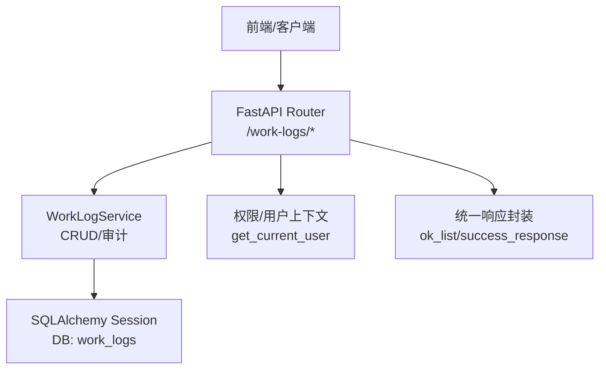
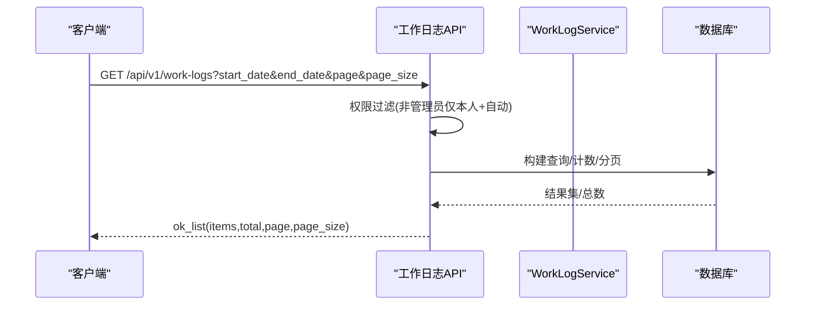
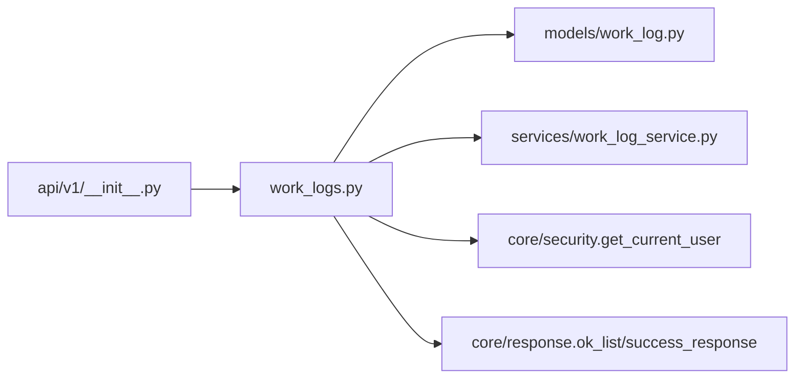

# 工作日志API

<cite>
**本文引用的文件**
- [backend/app/api/v1/work_logs.py](file://backend/app/api/v1/work_logs.py)
- [backend/app/models/work_log.py](file://backend/app/models/work_log.py)
- [backend/app/services/work_log_service.py](file://backend/app/services/work_log_service.py)
- [backend/app/api/v1/__init__.py](file://backend/app/api/v1/__init__.py)
- [backend/tests/unit/test_work_logs_api.py](file://backend/tests/unit/test_work_logs_api.py)
- [backend/tests/integration/test_comprehensive_functional.py](file://backend/tests/integration/test_comprehensive_functional.py)
- [backend/app/api/v1/batch_operations.py](file://backend/app/api/v1/batch_operations.py)
</cite>

## 目录
1. [简介](#简介)
2. [项目结构](#项目结构)
3. [核心组件](#核心组件)
4. [架构总览](#架构总览)
5. [详细组件分析](#详细组件分析)
6. [依赖关系分析](#依赖关系分析)
7. [性能考虑](#性能考虑)
8. [故障排查指南](#故障排查指南)
9. [结论](#结论)
10. [附录：API调用示例与流程](#附录api调用示例与流程)

## 简介
本文件为“工作日志”模块的API技术文档，覆盖创建、查询、统计、日历视图等能力，并说明数据结构、筛选条件、权限控制、分页排序及批量操作集成。文档面向前后端开发与测试人员，提供清晰的接口约定与调用流程。

## 项目结构
工作日志功能由以下关键部分组成：
- API路由层：定义RESTful端点与请求/响应模型
- 数据模型层：数据库表结构与索引
- 服务层：通用CRUD与审计日志写入
- 注册与挂载：在v1路由集中统一注册

图表来源
- [backend/app/api/v1/work_logs.py:1-437](file://backend/app/api/v1/work_logs.py#L1-L437)
- [backend/app/services/work_log_service.py:1-100](file://backend/app/services/work_log_service.py#L1-L100)
- [backend/app/models/work_log.py:1-79](file://backend/app/models/work_log.py#L1-L79)

章节来源
- [backend/app/api/v1/__init__.py:70-148](file://backend/app/api/v1/__init__.py#L70-L148)
- [backend/app/api/v1/work_logs.py:1-437](file://backend/app/api/v1/work_logs.py#L1-L437)

## 核心组件
- 数据模型 WorkLog：包含工作日期、内容、类别、地点、参与人、附件路径（JSON数组）、关联项目/村/学校等字段，并提供兼容前端的 title、work_date、log_type 属性；建立多列索引优化查询。
- API路由：提供列表、详情、创建、更新、删除、日历视图、月度总结等端点；支持时间范围、类型、关键词、来源等多维筛选与分页。
- 服务层：封装基础CRUD与审计日志写入，保证事务提交与刷新。
- 权限控制：非管理员仅能查看本人手动日志，自动记录（category=system_auto）对所有人可见；管理员可查看全部。

章节来源
- [backend/app/models/work_log.py:10-79](file://backend/app/models/work_log.py#L10-L79)
- [backend/app/api/v1/work_logs.py:22-75](file://backend/app/api/v1/work_logs.py#L22-L75)
- [backend/app/services/work_log_service.py:8-100](file://backend/app/services/work_log_service.py#L8-L100)

## 架构总览
工作日志API采用分层架构：
- 路由层负责参数校验、权限判断、业务编排与响应封装
- 服务层负责数据访问与事务管理
- 模型层定义持久化结构与索引
- 通过统一响应格式返回分页、总数与数据项

图表来源
- [backend/app/api/v1/work_logs.py:77-160](file://backend/app/api/v1/work_logs.py#L77-L160)
- [backend/app/services/work_log_service.py:15-21](file://backend/app/services/work_log_service.py#L15-L21)

## 详细组件分析

### 数据模型与字段规范
- 主键与时间戳：id、created_at、updated_at
- 业务字段：
  - log_date：工作日期（Date）
  - content：工作内容（Text）
  - category：日志类别（visit/meeting/inspection/training/other/checkin/system_auto/daily等）
  - location：工作地点（String）
  - participants：参与人员（逗号分隔字符串）
  - attachments：附件路径（JSON数组字符串）
  - project_id/village_id/school_id：关联实体ID
- 兼容字段：
  - title：从content截取前100字符
  - work_date：等价于log_date
  - log_type：等价于category或默认daily
- 索引：user_id、project_id、village_id、log_date、user_id+log_date复合索引

章节来源
- [backend/app/models/work_log.py:10-79](file://backend/app/models/work_log.py#L10-L79)

### 列表查询接口
- 端点：GET /api/v1/work-logs
- 查询参数：
  - start_date/end_date：按日期范围筛选
  - project_id/village_id：按关联实体筛选
  - category/log_type：按类别筛选（二者等价）
  - keyword：模糊匹配内容
  - source：auto/manual/all（基于category是否为system_auto）
  - page/page_size：分页
- 权限：非管理员仅能看到本人手动日志与所有自动日志；管理员可见全部
- 排序：自动记录优先，其次按log_date降序
- 响应：统一分页结构，items中包含is_auto标识

章节来源
- [backend/app/api/v1/work_logs.py:77-160](file://backend/app/api/v1/work_logs.py#L77-L160)
- [backend/tests/unit/test_work_logs_api.py:148-177](file://backend/tests/unit/test_work_logs_api.py#L148-L177)
- [backend/tests/unit/test_work_logs_api.py:255-277](file://backend/tests/unit/test_work_logs_api.py#L255-L277)
- [backend/tests/unit/test_work_logs_api.py:303-331](file://backend/tests/unit/test_work_logs_api.py#L303-L331)

### 创建接口
- 端点：POST /api/v1/work-logs
- 请求体：支持title/work_date/log_type与标准字段映射；必填验证log_date与content
- 特殊规则：
  - checkin打卡同用户同日去重
  - 自动写入user_id=current_user.id
- 响应：返回WorkLogResponse，包含兼容字段

章节来源
- [backend/app/api/v1/work_logs.py:163-233](file://backend/app/api/v1/work_logs.py#L163-L233)
- [backend/tests/unit/test_work_logs_api.py:1164-1177](file://backend/tests/unit/test_work_logs_api.py#L1164-L1177)

### 更新与删除接口
- 更新：PUT /api/v1/work-logs/{log_id}，仅本人或管理员可编辑
- 删除：DELETE /api/v1/work-logs/{log_id}，自动记录不可删除，仅本人或管理员可删除

章节来源
- [backend/app/api/v1/work_logs.py:236-310](file://backend/app/api/v1/work_logs.py#L236-L310)

### 日历视图接口
- 端点：GET /api/v1/work-logs/calendar?year&month
- 能力：按月聚合日志，支持source筛选（auto/manual），返回items列表含标题、内容、日期、类型、是否自动等

章节来源
- [backend/app/api/v1/work_logs.py:313-371](file://backend/app/api/v1/work_logs.py#L313-L371)
- [backend/tests/unit/test_work_logs_api.py:838-947](file://backend/tests/unit/test_work_logs_api.py#L838-L947)

### 月度统计接口
- 端点：GET /api/v1/work-logs/monthly-summary?year&month
- 能力：统计当月总条数、打卡天数、分类计数、明细列表与摘要文本

章节来源
- [backend/app/api/v1/work_logs.py:374-437](file://backend/app/api/v1/work_logs.py#L374-L437)

### 批量操作集成
- 系统提供通用批量更新/删除接口（/batch/update、/batch/delete），用于跨模块批量处理，并在成功后通过write_work_log记录审计日志
- 工作日志本身未提供专用批量导入端点；可通过其他导入导出模块或脚本完成批量数据入库后，再使用工作日志API进行查询与分析

章节来源
- [backend/app/api/v1/batch_operations.py:121-200](file://backend/app/api/v1/batch_operations.py#L121-L200)
- [backend/app/services/work_log_service.py:58-100](file://backend/app/services/work_log_service.py#L58-L100)

## 依赖关系分析
- 路由注册：work_logs模块在v1路由集中被引入并注册
- 权限与上下文：依赖get_current_user获取当前用户角色与ID
- 数据库会话：通过get_db注入Session
- 响应封装：使用ok_list/success_response统一返回格式
- 服务层：WorkLogService提供CRUD与审计日志写入

图表来源
- [backend/app/api/v1/work_logs.py:1-437](file://backend/app/api/v1/work_logs.py#L1-L437)
- [backend/app/api/v1/__init__.py:70-148](file://backend/app/api/v1/__init__.py#L70-L148)

章节来源
- [backend/app/api/v1/__init__.py:70-148](file://backend/app/api/v1/__init__.py#L70-L148)
- [backend/app/api/v1/work_logs.py:1-437](file://backend/app/api/v1/work_logs.py#L1-L437)

## 性能考虑
- 索引优化：针对user_id、project_id、village_id、log_date以及user_id+log_date复合索引，提升常见查询效率
- 查询顺序：count()在order_by之前执行，避免排序影响计数
- 分页限制：page_size上限100，防止过大页导致性能问题
- 自动记录优先：通过case表达式实现排序，减少前端二次排序开销
- 建议：
  - 大数据量场景下，结合时间范围与关键字缩小查询集
  - 定期评估索引命中情况，必要时增加覆盖索引

[本节为通用指导，不直接分析具体文件]

## 故障排查指南
- 创建失败：
  - 日期格式无效：检查log_date是否为ISO日期或Python date对象
  - 内容为空：确保content去除空白后非空
  - 打卡重复：checkin在同日同用户仅允许一条
- 权限错误：
  - 非管理员无法查看他人手动日志
  - 自动记录不可删除
- 列表为空：
  - 确认筛选条件是否正确
  - 确认当前用户角色与数据来源（manual/auto）

章节来源
- [backend/app/api/v1/work_logs.py:191-233](file://backend/app/api/v1/work_logs.py#L191-L233)
- [backend/app/api/v1/work_logs.py:299-310](file://backend/app/api/v1/work_logs.py#L299-L310)
- [backend/tests/unit/test_work_logs_api.py:464-496](file://backend/tests/unit/test_work_logs_api.py#L464-L496)

## 结论
工作日志API提供了完整的记录、查询、统计与日历视图能力，具备严格的权限控制与良好的可扩展性。通过统一的响应格式与分页机制，便于前端集成与数据分析。建议在大数据量场景下合理使用筛选与分页，并结合索引优化查询性能。

[本节为总结性内容，不直接分析具体文件]

## 附录：API调用示例与流程

### 创建日志
- 方法：POST
- 路径：/api/v1/work-logs
- 请求体要点：
  - log_date：必填，ISO日期
  - content：必填，去除空白后非空
  - category：可选，如visit/meeting/inspection/training/checkin/daily
  - 兼容字段：title→content、work_date→log_date、log_type→category
- 成功响应：返回WorkLogResponse，包含id、log_date、content、is_auto等

章节来源
- [backend/app/api/v1/work_logs.py:163-233](file://backend/app/api/v1/work_logs.py#L163-L233)
- [backend/tests/unit/test_work_logs_api.py:1164-1177](file://backend/tests/unit/test_work_logs_api.py#L1164-L1177)

### 查询日志列表
- 方法：GET
- 路径：/api/v1/work-logs
- 常用参数：
  - start_date/end_date：日期范围
  - category/log_type：类别筛选
  - keyword：内容模糊搜索
  - source：auto/manual/all
  - page/page_size：分页
- 成功响应：ok_list结构，包含items、total、page、page_size

章节来源
- [backend/app/api/v1/work_logs.py:77-160](file://backend/app/api/v1/work_logs.py#L77-L160)
- [backend/tests/integration/test_comprehensive_functional.py:514-540](file://backend/tests/integration/test_comprehensive_functional.py#L514-L540)

### 日历视图
- 方法：GET
- 路径：/api/v1/work-logs/calendar
- 参数：year、month、source（可选）
- 成功响应：包含items列表与年月信息

章节来源
- [backend/app/api/v1/work_logs.py:313-371](file://backend/app/api/v1/work_logs.py#L313-L371)
- [backend/tests/unit/test_work_logs_api.py:838-947](file://backend/tests/unit/test_work_logs_api.py#L838-L947)

### 月度统计
- 方法：GET
- 路径：/api/v1/work-logs/monthly-summary
- 参数：year、month
- 成功响应：包含total_logs、checkin_days、category_counts、items、summary_text

章节来源
- [backend/app/api/v1/work_logs.py:374-437](file://backend/app/api/v1/work_logs.py#L374-L437)

### 批量导入工作日志（推荐方式）
- 由于工作日志模块未提供专用批量导入端点，建议：
  - 使用系统提供的导入导出模板或脚本将日志数据批量写入数据库
  - 随后通过工作日志API进行查询、统计与分析
- 若需记录批量操作的审计日志，可在业务侧调用write_work_log记录

章节来源
- [backend/app/services/work_log_service.py:58-100](file://backend/app/services/work_log_service.py#L58-L100)
- [backend/app/api/v1/batch_operations.py:121-200](file://backend/app/api/v1/batch_operations.py#L121-L200)