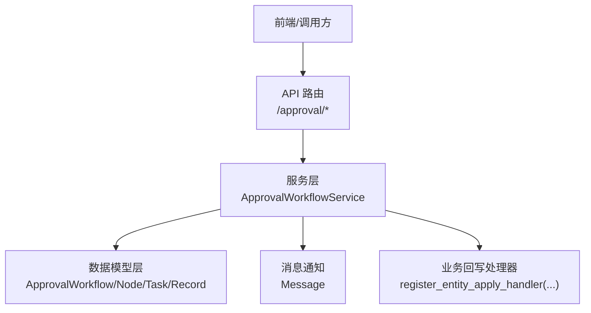
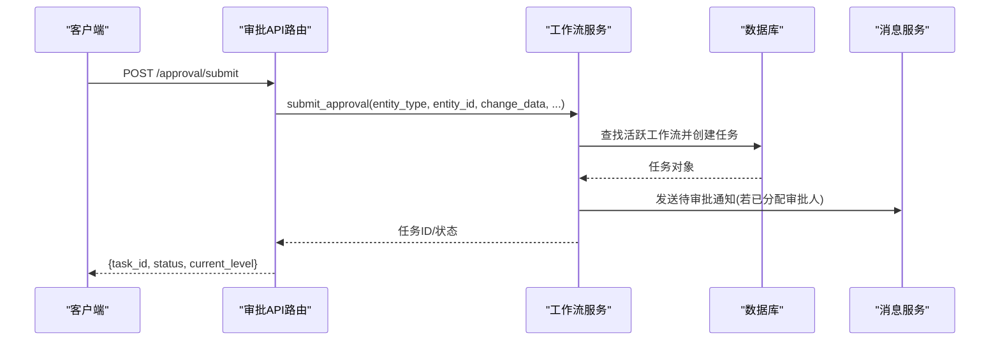
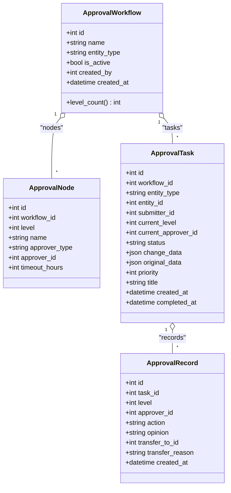
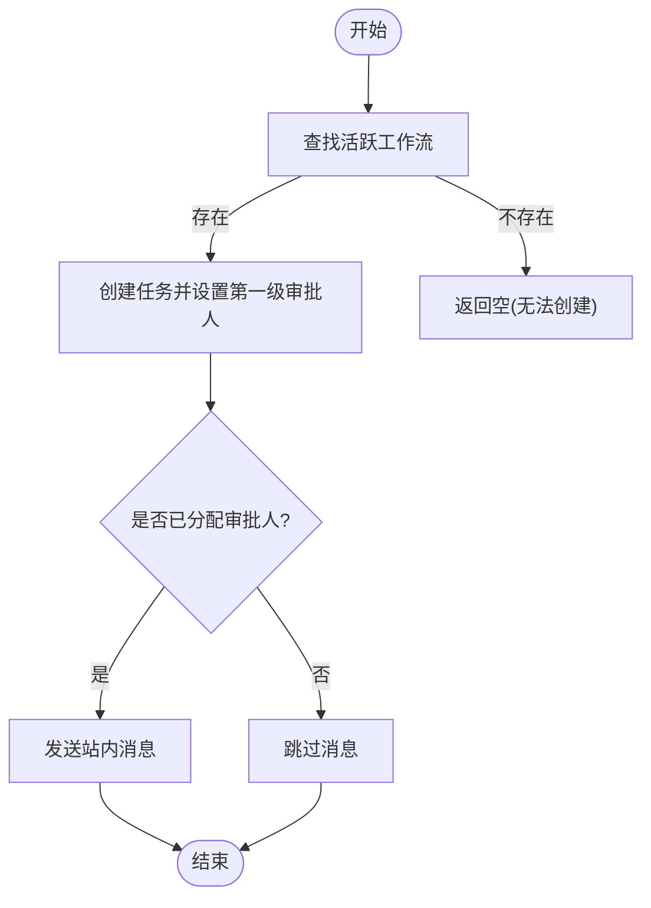
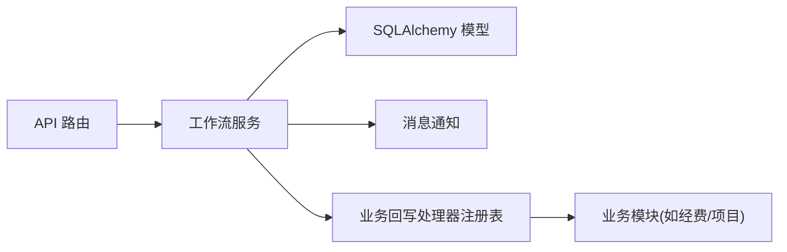

# 审批流程API

<cite>
**本文引用的文件**
- [backend/app/api/v1/approval.py](file://backend/app/api/v1/approval.py)
- [backend/app/services/approval_workflow_service.py](file://backend/app/services/approval_workflow_service.py)
- [backend/app/models/approval.py](file://backend/app/models/approval.py)
- [docs/03-开发文档/03-API文档/API接口文档.md](file://docs/03-开发文档/03-API文档/API接口文档.md)
- [backend/tests/unit/test_approval.py](file://backend/tests/unit/test_approval.py)
</cite>

## 目录
1. [简介](#简介)
2. [项目结构](#项目结构)
3. [核心组件](#核心组件)
4. [架构总览](#架构总览)
5. [详细组件分析](#详细组件分析)
6. [依赖关系分析](#依赖关系分析)
7. [性能考虑](#性能考虑)
8. [故障排查指南](#故障排查指南)
9. [结论](#结论)
10. [附录：API 参考与调用示例](#附录api-参考与调用示例)

## 简介
本文件为“审批流程”模块的完整 API 文档，覆盖审批申请、审批处理、审批查询、历史记录等接口的 HTTP 方法、URL 路径、请求参数、响应格式与错误处理。系统支持多级审批流程（最多5级）、任务自动分配、状态管理、转交/撤回/重试回写、批量操作、变更对比与超时提醒等能力，并提供单机版快捷审批能力。同时说明与各业务模块的集成方式（通过实体类型注册回写处理器）与配置方法。

## 项目结构
审批功能由三层组成：
- API 层：FastAPI 路由定义，负责鉴权、参数校验、统一响应封装与权限控制。
- 服务层：工作流引擎，实现流程创建、任务流转、状态机、角色解析、批量与重试逻辑。
- 数据模型层：SQLAlchemy 模型定义流程、节点、任务、记录及索引。

图表来源
- [backend/app/api/v1/approval.py:1-1109](file://backend/app/api/v1/approval.py#L1-L1109)
- [backend/app/services/approval_workflow_service.py:1-875](file://backend/app/services/approval_workflow_service.py#L1-L875)
- [backend/app/models/approval.py:1-291](file://backend/app/models/approval.py#L1-L291)

章节来源
- [backend/app/api/v1/approval.py:1-1109](file://backend/app/api/v1/approval.py#L1-L1109)
- [backend/app/services/approval_workflow_service.py:1-875](file://backend/app/services/approval_workflow_service.py#L1-L875)
- [backend/app/models/approval.py:1-291](file://backend/app/models/approval.py#L1-L291)

## 核心组件
- 审批流程（Workflow）：按实体类型配置多级审批链（最多5级），可启用/禁用。
- 审批节点（Node）：每个级别指定审批人类型（用户/角色）与超时时间。
- 审批任务（Task）：一次数据变更对应一个任务，维护当前级别、审批人、状态、优先级、变更数据快照等。
- 审批记录（Record）：每次操作的留痕（通过/拒绝/转交/重新提交等）。
- 服务层（ApprovalWorkflowService）：提供工作流 CRUD、任务提交、流转、批量、重试回写、历史与差异对比等。
- API 路由：对外暴露 RESTful 接口，统一返回结构与权限控制。

章节来源
- [backend/app/models/approval.py:53-291](file://backend/app/models/approval.py#L53-L291)
- [backend/app/services/approval_workflow_service.py:30-875](file://backend/app/services/approval_workflow_service.py#L30-L875)
- [backend/app/api/v1/approval.py:45-1109](file://backend/app/api/v1/approval.py#L45-L1109)

## 架构总览

图表来源
- [backend/app/api/v1/approval.py:380-413](file://backend/app/api/v1/approval.py#L380-L413)
- [backend/app/services/approval_workflow_service.py:203-278](file://backend/app/services/approval_workflow_service.py#L203-L278)

## 详细组件分析

### 数据模型与状态机
- 状态枚举：pending、approved、rejected、withdrawn；以及带后缀的失败态用于回写失败重试。
- 任务字段：包含实体类型/ID、提交人、当前级别、当前审批人、优先级、变更前后数据快照、标题/说明、完成时间等。
- 记录字段：级别、操作类型、意见、转交目标与原因、时间戳。

图表来源
- [backend/app/models/approval.py:53-291](file://backend/app/models/approval.py#L53-L291)

章节来源
- [backend/app/models/approval.py:36-291](file://backend/app/models/approval.py#L36-L291)

### 工作流服务（ApprovalWorkflowService）
- 流程CRUD：创建时限制最多5级且至少1个节点；支持按实体类型与是否启用过滤列表；更新/删除原子事务。
- 任务提交：匹配活跃工作流，自动设置第一级审批人（支持角色解析为管理员）；未分配审批人时跳过消息推送。
- 任务流转：approve/reject 记录操作并推进级别或进入终态；终态成功时尝试回写业务实体，失败则标记为 *_apply_failed 以便重试。
- 批量与自动：批量审批、一键自动审批所有 pending、提交并自动通过（单机版）。
- 历史与差异：按实体/提交人/状态分页查询历史；返回变更对比（兼容新旧键名）。

图表来源
- [backend/app/services/approval_workflow_service.py:203-278](file://backend/app/services/approval_workflow_service.py#L203-L278)

章节来源
- [backend/app/services/approval_workflow_service.py:76-875](file://backend/app/services/approval_workflow_service.py#L76-L875)

### API 路由与权限
- 概览统计：GET /approval，区分管理员与普通用户的数据范围。
- 流程管理：POST/GET/PUT/DELETE /approval/workflows，创建/更新/删除需管理员。
- 任务操作：
  - 提交：POST /approval/submit
  - 通过/拒绝：POST /approval/tasks/{id}/approve | reject
  - 转交/撤回/重新提交：POST /approval/tasks/{id}/transfer | withdraw | resubmit
  - 重试回写：POST /approval/tasks/{id}/retry-apply（管理员）
  - 单机版快速审批：POST /approval/tasks/{id}/auto-approve | /approval/tasks/auto-approve-all（管理员）
  - 批量审批：POST /approval/tasks/batch
- 列表与历史：
  - 待审批：GET /approval/tasks/pending（管理员可见全部 pending）
  - 我的申请：GET /approval/tasks/mine
  - 历史：GET /approval/history
  - 变更对比：GET /approval/tasks/{id}/diff
  - 提醒：POST /approval/tasks/{id}/remind（防重复1小时）

章节来源
- [backend/app/api/v1/approval.py:86-1109](file://backend/app/api/v1/approval.py#L86-L1109)
- [docs/03-开发文档/03-API文档/API接口文档.md:69-96](file://docs/03-开发文档/03-API文档/API接口文档.md#L69-L96)

## 依赖关系分析
- API 依赖服务层进行业务编排，服务层依赖 SQLAlchemy 模型与数据库会话。
- 服务层通过注册表与业务模块解耦：业务模块在导入时注册实体回写处理器，审批终态时调用以同步业务实体状态。
- 消息通知与审计日志作为副作用写入，失败不阻断主流程。

图表来源
- [backend/app/services/approval_workflow_service.py:30-71](file://backend/app/services/approval_workflow_service.py#L30-L71)
- [backend/app/api/v1/approval.py:33-42](file://backend/app/api/v1/approval.py#L33-L42)

章节来源
- [backend/app/services/approval_workflow_service.py:30-71](file://backend/app/services/approval_workflow_service.py#L30-L71)
- [backend/app/api/v1/approval.py:33-42](file://backend/app/api/v1/approval.py#L33-L42)

## 性能考虑
- 列表与历史查询使用 joinedload 预加载关联，减少 N+1 查询。
- 分页参数限制上限，避免大结果集拖垮数据库。
- 批量审批逐个独立事务，单个失败不影响其余任务。
- 提醒接口具备1小时内去重机制，避免重复消息风暴。
- 索引优化：任务与记录的常用查询字段均建立索引。

章节来源
- [backend/app/services/approval_workflow_service.py:318-445](file://backend/app/services/approval_workflow_service.py#L318-L445)
- [backend/app/api/v1/approval.py:768-844](file://backend/app/api/v1/approval.py#L768-L844)
- [backend/app/models/approval.py:192-199](file://backend/app/models/approval.py#L192-L199)
- [backend/app/models/approval.py:261-267](file://backend/app/models/approval.py#L261-L267)

## 故障排查指南
- 无法创建审批任务：检查是否存在该实体类型的活跃工作流；若无，可使用“提交并自动审批”接口自动创建默认流程。
- 无权限审批：确认当前用户是否为任务当前审批人或处于单机模式；管理员可通过自动审批绕过校验。
- 驳回必须填写原因：后端强制校验 opinion 非空，否则返回 400。
- 审批成功但业务状态未变：查看任务状态是否带有 _apply_failed 后缀；使用“重试回写”接口修复一致性。
- 提醒重复发送：同一任务1小时内仅允许发送一次，重复将返回冲突。
- 批量审批部分失败：关注返回中的 failed 列表，定位具体任务失败原因。

章节来源
- [backend/app/api/v1/approval.py:453-483](file://backend/app/api/v1/approval.py#L453-L483)
- [backend/app/api/v1/approval.py:486-512](file://backend/app/api/v1/approval.py#L486-L512)
- [backend/app/api/v1/approval.py:1004-1055](file://backend/app/api/v1/approval.py#L1004-L1055)
- [backend/app/services/approval_workflow_service.py:49-71](file://backend/app/services/approval_workflow_service.py#L49-L71)
- [backend/app/services/approval_workflow_service.py:541-566](file://backend/app/services/approval_workflow_service.py#L541-L566)

## 结论
审批流程API提供了完整的生命周期管理能力，涵盖多级流程、自动分配、状态机、批处理与重试回写等关键特性。通过清晰的职责分层与可扩展的业务回写机制，既能满足复杂审批场景，又便于与现有业务模块集成。建议在生产环境结合权限策略与监控告警，确保审批链路稳定可靠。

## 附录：API 参考与调用示例

### 通用约定
- 基础路径：/api/v1/approval
- 鉴权：除明确标注外均需登录；涉及流程配置与批量/自动审批等操作需要管理员。
- 响应格式：统一包含 code、success、data/message 字段。

章节来源
- [docs/03-开发文档/03-API文档/API接口文档.md:69-96](file://docs/03-开发文档/03-API文档/API接口文档.md#L69-L96)
- [backend/app/api/v1/approval.py:263-291](file://backend/app/api/v1/approval.py#L263-L291)

### 流程管理
- POST /approval/workflows
  - 作用：创建审批流程（最多5级）
  - 权限：管理员
  - 请求体关键字段：name、entity_type、description、nodes[]
  - 响应：返回 id、name、entity_type、level_count
  - 错误：节点数非法返回 400；未授权返回 401/403
- GET /approval/workflows
  - 作用：获取流程列表（支持 entity_type、is_active、skip、limit）
- GET /approval/workflows/{workflow_id}
  - 作用：获取流程详情（含节点）
- PUT /approval/workflows/{workflow_id}
  - 作用：更新流程名称/描述/启用状态
- DELETE /approval/workflows/{workflow_id}
  - 作用：删除流程（级联删除节点）

章节来源
- [backend/app/api/v1/approval.py:226-374](file://backend/app/api/v1/approval.py#L226-L374)
- [backend/app/services/approval_workflow_service.py:76-178](file://backend/app/services/approval_workflow_service.py#L76-L178)

### 任务操作
- POST /approval/submit
  - 作用：提交审批申请（自动匹配工作流并创建任务）
  - 请求体关键字段：entity_type、entity_id、change_data、original_data、title、priority
  - 响应：task_id、status、current_level
  - 错误：无工作流返回 400
- POST /approval/tasks/{task_id}/approve
  - 作用：审批通过（记录意见，推进级别或进入 approved）
  - 错误：无权限/不存在返回 403；其他异常 400/404
- POST /approval/tasks/{task_id}/reject
  - 作用：拒绝（必须填写 opinion）
  - 错误：opinion 为空返回 400；无权限返回 403
- POST /approval/tasks/{task_id}/transfer
  - 作用：转交给其他用户（管理员可代为转交任意待审批任务）
- POST /approval/tasks/{task_id}/withdraw
  - 作用：撤回申请（仅提交人可操作）
- POST /approval/tasks/{task_id}/resubmit
  - 作用：驳回后重新提交（可选携带更新后的变更数据）
- POST /approval/tasks/{task_id}/retry-apply
  - 作用：重试 *_apply_failed 任务的实体回写（管理员）
- POST /approval/tasks/{task_id}/auto-approve
  - 作用：单机版快速审批单个任务（管理员）
- POST /approval/tasks/auto-approve-all
  - 作用：一键审批所有待处理任务（管理员）
- POST /approval/tasks/batch
  - 作用：批量审批（非管理员仅能处理指派给自己的任务）

章节来源
- [backend/app/api/v1/approval.py:380-717](file://backend/app/api/v1/approval.py#L380-L717)
- [backend/app/services/approval_workflow_service.py:447-753](file://backend/app/services/approval_workflow_service.py#L447-L753)

### 列表与历史
- GET /approval
  - 作用：模块概览统计（pending/approved/rejected/total/my_pending）
- GET /approval/tasks/pending
  - 作用：待审批列表（管理员可见全部 pending；普通用户可见自己提交或待自己审批的任务）
- GET /approval/tasks/all
  - 作用：管理员获取所有任务（含 total）
- GET /approval/tasks/mine
  - 作用：我的申请列表（支持状态与日期范围过滤）
- GET /approval/tasks/history
  - 作用：审批任务历史（管理员可见全部；普通用户仅自己提交的）
- GET /approval/history
  - 作用：审批历史（按实体/提交人/状态过滤）
- GET /approval/tasks/{task_id}/diff
  - 作用：变更对比（返回 change_data/original_data/diff_fields）
- POST /approval/tasks/{task_id}/remind
  - 作用：发送超时提醒（1小时内去重）

章节来源
- [backend/app/api/v1/approval.py:86-158](file://backend/app/api/v1/approval.py#L86-L158)
- [backend/app/api/v1/approval.py:720-844](file://backend/app/api/v1/approval.py#L720-L844)
- [backend/app/api/v1/approval.py:927-1001](file://backend/app/api/v1/approval.py#L927-L1001)
- [backend/app/api/v1/approval.py:1004-1055](file://backend/app/api/v1/approval.py#L1004-L1055)
- [backend/app/api/v1/approval.py:1058-1109](file://backend/app/api/v1/approval.py#L1058-L1109)

### 典型调用示例（基于测试与前端契约）
- 创建流程
  - 方法：POST
  - 路径：/api/v1/approval/workflows
  - 请求体示例：{ "name": "经费审批", "entity_type": "fund", "nodes": [{"name":"部门主管","approver_type":"user","approver_id":1,"timeout_hours":24}] }
  - 预期：返回 id、level_count
- 提交审批
  - 方法：POST
  - 路径：/api/v1/approval/submit
  - 请求体示例：{ "entity_type":"project","entity_id":100,"change_data":{"amount":1000},"original_data":{"amount":0},"title":"预算调整"}
  - 预期：返回 task_id、status、current_level
- 审批通过
  - 方法：POST
  - 路径：/api/v1/approval/tasks/{id}/approve
  - 请求体示例：{ "opinion":"同意" }
  - 预期：返回 task_id、status、current_level
- 待审批列表
  - 方法：GET
  - 路径：/api/v1/approval/tasks/pending?skip=0&limit=100
  - 预期：返回 data 数组与 total
- 变更对比
  - 方法：GET
  - 路径：/api/v1/approval/tasks/{id}/diff
  - 预期：返回 diff_fields、change_data、original_data

章节来源
- [backend/tests/unit/test_approval.py:88-134](file://backend/tests/unit/test_approval.py#L88-L134)
- [frontend/tests/unit/api/approval.test.ts:51-122](file://frontend/tests/unit/api/approval.test.ts#L51-L122)

### 与业务模块集成与配置
- 注册实体回写处理器
  - 目的：在审批终态（通过/拒绝）时，将任务状态同步到业务实体（如经费从 pending→approved/rejected）。
  - 方式：在服务类中通过 register_entity_apply_handler(entity_type, handler) 注册回调。
  - 失败处理：若回写失败，任务状态追加 _apply_failed 后缀，可通过 retry-apply 接口重试。
- 默认工作流（单机版）
  - 当某实体类型无活跃工作流时，“提交并自动审批”会创建默认单节点流程，使流程可用。
- 角色审批人解析
  - 节点类型为 role 时，系统会将角色标识解析为具体用户（单机版解析为管理员），若解析失败保持未分配，仍可在待审批板块可见并由管理员处理。

章节来源
- [backend/app/services/approval_workflow_service.py:30-71](file://backend/app/services/approval_workflow_service.py#L30-L71)
- [backend/app/services/approval_workflow_service.py:180-197](file://backend/app/services/approval_workflow_service.py#L180-L197)
- [backend/app/services/approval_workflow_service.py:280-307](file://backend/app/services/approval_workflow_service.py#L280-L307)
- [backend/app/services/approval_workflow_service.py:627-670](file://backend/app/services/approval_workflow_service.py#L627-L670)