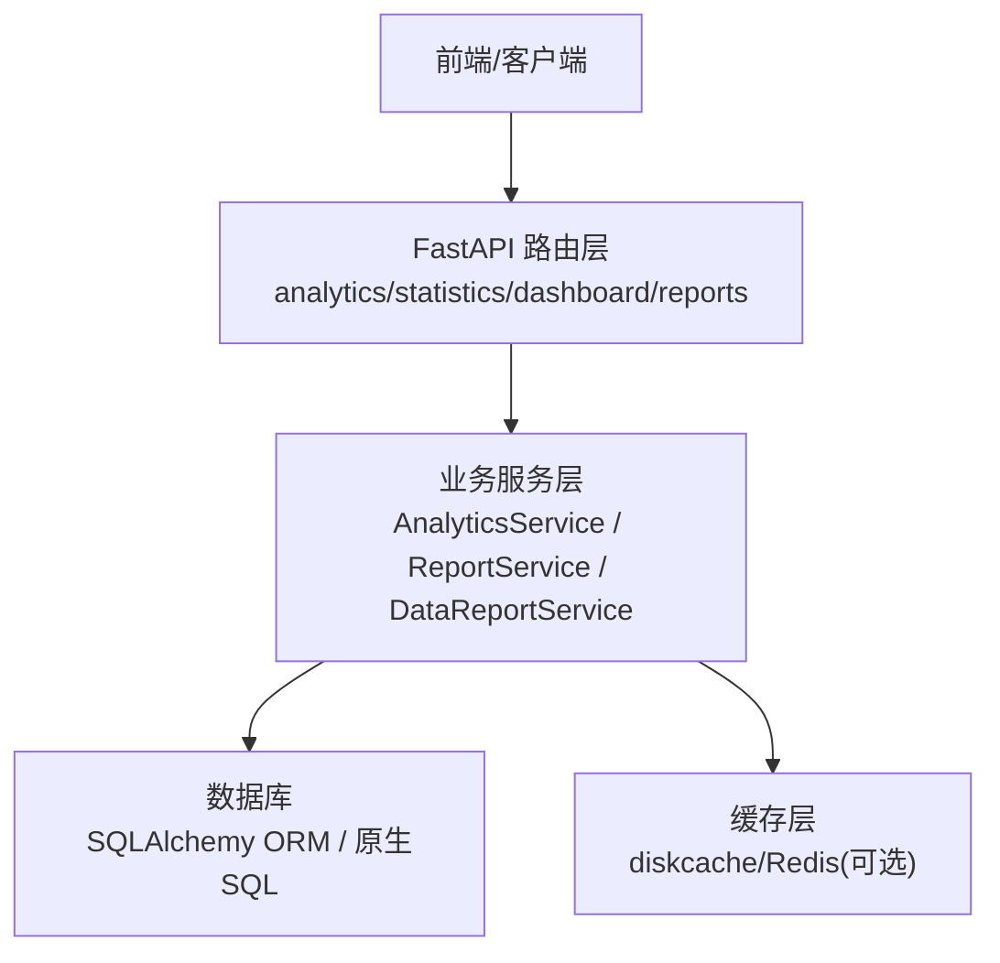
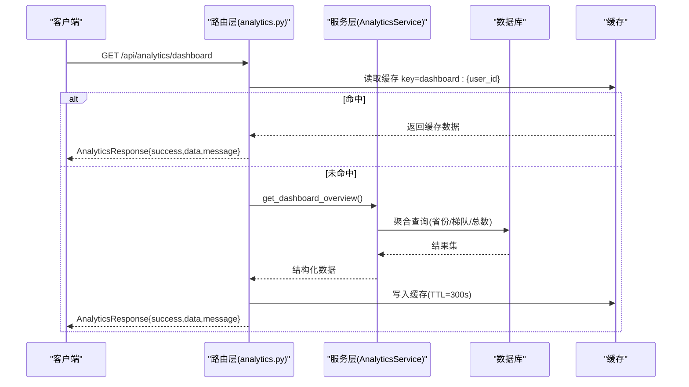
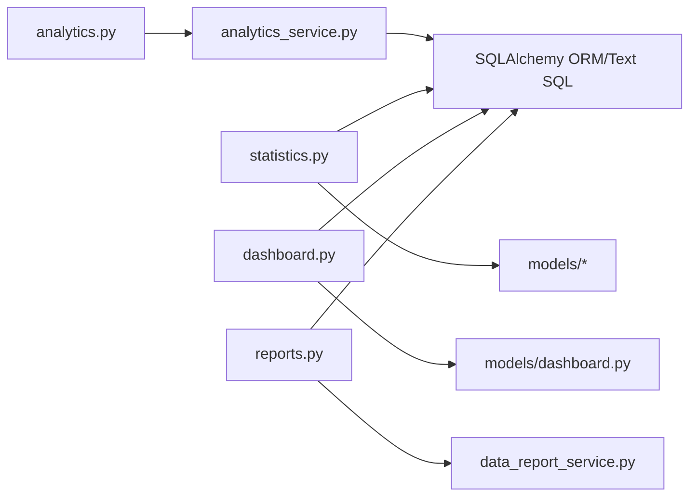

# 数据分析API

<cite>
**本文引用的文件**
- [backend/app/api/v1/data/data/analytics.py](file://backend/app/api/v1/data/data/analytics.py)
- [backend/app/services/analytics_service.py](file://backend/app/services/analytics_service.py)
- [backend/app/api/v1/data/data/statistics.py](file://backend/app/api/v1/data/data/statistics.py)
- [backend/app/api/v1/data/data/dashboard.py](file://backend/app/api/v1/data/data/dashboard.py)
- [backend/app/models/dashboard.py](file://backend/app/models/dashboard.py)
- [backend/app/api/v1/data/data/reports.py](file://backend/app/api/v1/data/data/reports.py)
- [backend/app/services/data_report_service.py](file://backend/app/services/data_report_service.py)
</cite>

## 目录
1. [简介](#简介)
2. [项目结构](#项目结构)
3. [核心组件](#核心组件)
4. [架构总览](#架构总览)
5. [详细接口说明](#详细接口说明)
6. [依赖关系分析](#依赖关系分析)
7. [性能与缓存](#性能与缓存)
8. [故障排查](#故障排查)
9. [结论](#结论)
10. [附录：前端集成与数据格式](#附录前端集成与数据格式)

## 简介
本文件为“乡村振兴系统”后端数据分析相关API的权威文档，覆盖统计数据查询、报表生成、趋势分析、可视化数据等能力。内容包含各接口的HTTP方法、URL路径、请求参数、响应格式、错误处理，以及多维度统计分析、数据聚合计算、图表数据格式化等核心功能说明，并提供调用示例与前端图表集成要点。

## 项目结构
数据分析能力由三层构成：
- API路由层：定义HTTP端点、鉴权、缓存、统一响应封装
- 服务层：实现统计/分析/导出等业务逻辑与SQL聚合
- 模型层：提供ORM映射（如帮扶村、人口、收入、经费、项目、学校等）

**图示来源**
- [backend/app/api/v1/data/data/analytics.py:1-364](file://backend/app/api/v1/data/data/analytics.py#L1-L364)
- [backend/app/services/analytics_service.py:1-703](file://backend/app/services/analytics_service.py#L1-L703)
- [backend/app/api/v1/data/data/statistics.py:1-850](file://backend/app/api/v1/data/data/statistics.py#L1-L850)
- [backend/app/api/v1/data/data/dashboard.py:1-851](file://backend/app/api/v1/data/data/dashboard.py#L1-L851)
- [backend/app/api/v1/data/data/reports.py:1-779](file://backend/app/api/v1/data/data/reports.py#L1-L779)

**章节来源**
- [backend/app/api/v1/data/data/__init__.py:1-26](file://backend/app/api/v1/data/data/__init__.py#L1-L26)

## 核心组件
- AnalyticsService：仪表盘概览、帮扶村分析、资金趋势、绩效指标、对比分析、汇总统计、钻取、筛选、导出等
- Dashboard路由：首页KPI、年度趋势、近期动态、汇总摘要等
- Statistics路由：系统概览、模块分布、项目/经费/学校统计、综合分析聚合
- Reports路由：Excel/PDF导出、综合报表导出、订阅管理、报表生成
- DataReportService：上报生命周期管理、审批流转、下级单位看板统计

**章节来源**
- [backend/app/services/analytics_service.py:22-703](file://backend/app/services/analytics_service.py#L22-L703)
- [backend/app/api/v1/data/data/dashboard.py:365-580](file://backend/app/api/v1/data/data/dashboard.py#L365-L580)
- [backend/app/api/v1/data/data/statistics.py:105-780](file://backend/app/api/v1/data/data/statistics.py#L105-L780)
- [backend/app/api/v1/data/data/reports.py:54-779](file://backend/app/api/v1/data/data/reports.py#L54-L779)
- [backend/app/services/data_report_service.py:81-492](file://backend/app/services/data_report_service.py#L81-L492)

## 架构总览

**图示来源**
- [backend/app/api/v1/data/data/analytics.py:84-100](file://backend/app/api/v1/data/data/analytics.py#L84-L100)
- [backend/app/services/analytics_service.py:28-84](file://backend/app/services/analytics_service.py#L28-L84)

## 详细接口说明

### 1) 数据分析（/api/analytics）
- 基础信息
  - 前缀：/api/analytics
  - 鉴权：需要登录用户（get_current_user）
  - 缓存：多数接口使用键前缀 ANALYTICS_CACHE_PREFIX，TTL=300秒
  - 统一响应：AnalyticsResponse{success, data, message}

- 关键端点
  - GET /api/analytics/dashboard
    - 作用：获取仪表盘数据（按省份、振兴梯队分布、总数）
    - 参数：无
    - 响应：data包含 total_villages、province_distribution、tier_distribution
    - 错误：异常时记录日志并返回空结构
    - 参考：[backend/app/api/v1/data/data/analytics.py:84-100](file://backend/app/api/v1/data/data/analytics.py#L84-L100), [backend/app/services/analytics_service.py:28-84](file://backend/app/services/analytics_service.py#L28-L84)

  - GET /api/analytics/village-analysis
    - 作用：帮扶村分析（投资、人口、收入、基础设施分类）
    - 参数：无
    - 响应：investment/population/income/infrastructure
    - 参考：[backend/app/api/v1/data/data/analytics.py:103-117](file://backend/app/api/v1/data/data/analytics.py#L103-L117), [backend/app/services/analytics_service.py:86-171](file://backend/app/services/analytics_service.py#L86-L171)

  - GET /api/analytics/funding-trends?years=5
    - 作用：资金趋势（近N年总额、军地/地方拆分、村数）
    - 参数：years（默认5）
    - 响应：trends数组、start_year、end_year
    - 参考：[backend/app/api/v1/data/data/analytics.py:120-134](file://backend/app/api/v1/data/data/analytics.py#L120-L134), [backend/app/services/analytics_service.py:173-218](file://backend/app/services/analytics_service.py#L173-L218)

  - GET /api/analytics/performance-metrics
    - 作用：绩效指标（政策发布、示范村、各类帮扶投资）
    - 参数：无
    - 响应：policies/villages/investment_categories
    - 参考：[backend/app/api/v1/data/data/analytics.py:137-151](file://backend/app/api/v1/data/data/analytics.py#L137-L151), [backend/app/services/analytics_service.py:220-290](file://backend/app/services/analytics_service.py#L220-L290)

  - POST /api/analytics/comparison
    - 作用：对比分析（按省份或梯队）
    - 请求体：ComparisonRequest{compare_type, target_value?, province?}
    - 响应：comparison数组、compare_type
    - 参考：[backend/app/api/v1/data/data/analytics.py:154-164](file://backend/app/api/v1/data/data/analytics.py#L154-L164), [backend/app/services/analytics_service.py:292-341](file://backend/app/services/analytics_service.py#L292-L341)

  - POST /api/analytics/generate-report
    - 作用：生成报表数据（comprehensive/village_funding/policy_execution）
    - 请求体：ReportRequest{report_type, start_date?, end_date?}
    - 响应：按类型聚合的数据+generated_at
    - 参考：[backend/app/api/v1/data/data/analytics.py:167-177](file://backend/app/api/v1/data/data/analytics.py#L167-L177), [backend/app/services/analytics_service.py:343-385](file://backend/app/services/analytics_service.py#L343-L385)

  - POST /api/analytics/export
    - 作用：导出数据（json/excel）
    - 请求体：ReportRequest
    - 响应：json直接返回；excel返回二进制流（application/vnd.openxmlformats-officedocument.spreadsheetml.sheet）
    - 参考：[backend/app/api/v1/data/data/analytics.py:180-202](file://backend/app/api/v1/data/data/analytics.py#L180-L202), [backend/app/services/analytics_service.py:685-702](file://backend/app/services/analytics_service.py#L685-L702)

  - GET /api/analytics/realtime-stats
    - 作用：实时统计（概览+最近活动+时间戳）
    - 参数：无
    - 响应：overview/recent_activities/timestamp
    - 参考：[backend/app/api/v1/data/data/analytics.py:205-223](file://backend/app/api/v1/data/data/analytics.py#L205-L223)

  - GET /api/analytics/kpi-summary?period=month
    - 作用：KPI汇总（帮扶村总数、项目完成/批准数、完成率）
    - 参数：period（默认month）
    - 响应：total_villages/total_projects/completed_projects/approved_projects/completion_rate/period
    - 参考：[backend/app/api/v1/data/data/analytics.py:259-274](file://backend/app/api/v1/data/data/analytics.py#L259-L274)

  - GET /api/analytics/cross-org-comparison
    - 作用：跨组织对比（仅admin/super_admin），按组织聚合村数、项目数、资金总额、完成率
    - 权限：角色校验
    - 响应：items列表、total
    - 参考：[backend/app/api/v1/data/data/analytics.py:283-363](file://backend/app/api/v1/data/data/analytics.py#L283-L363)

- 调用示例（JSON）
  - 生成综合报表
    - 方法：POST
    - URL：/api/analytics/generate-report
    - 请求体：{"report_type": "comprehensive", "start_date": "2024-01-01", "end_date": "2024-12-31"}
    - 响应：{success:true, data:{report_type:"comprehensive", dashboard:{...}, village_analysis:{...}, performance:{...}, generated_at:"..."}, message:"报表生成成功"}

**章节来源**
- [backend/app/api/v1/data/data/analytics.py:47-364](file://backend/app/api/v1/data/data/analytics.py#L47-L364)
- [backend/app/services/analytics_service.py:22-703](file://backend/app/services/analytics_service.py#L22-L703)

### 2) 统计分析（/api/statistics）
- 基础信息
  - 前缀：/api/statistics
  - 鉴权：需要登录用户
  - 缓存：部分接口使用本地缓存（TTL=300秒）

- 关键端点
  - GET /api/statistics/summary
    - 作用：系统概览统计（用户/村/学校/项目/经费数量、已批金额、项目状态分布、活跃/完成项目数）
    - 响应：total_users/total_villages/total_schools/total_projects/total_funds/approved_funds_amount/projects_by_status/active_projects/completed_projects
    - 参考：[backend/app/api/v1/data/data/statistics.py:105-169](file://backend/app/api/v1/data/data/statistics.py#L105-L169)

  - GET /api/statistics/overview
    - 作用：数据总览（各模块记录数、最后更新时间、健康评分、近7天趋势、最近操作）
    - 响应：villages/projects/schools/users/funds_amount/completeness/health_score/today_operations/modules/filing_rates/trend/recent_logs
    - 参考：[backend/app/api/v1/data/data/statistics.py:172-311](file://backend/app/api/v1/data/data/statistics.py#L172-L311)

  - GET /api/statistics/villages/distribution
    - 作用：帮扶村分布（状态、人口Top10、省份分布）
    - 响应：by_status/top_population/by_province
    - 参考：[backend/app/api/v1/data/data/statistics.py:314-366](file://backend/app/api/v1/data/data/statistics.py#L314-L366)

  - GET /api/statistics/projects/statistics
    - 作用：项目统计（状态/类型分布、预算/投入合计、平均进度、最近项目）
    - 响应：by_status/by_type/total_budget/total_invested/average_progress/recent_projects
    - 参考：[backend/app/api/v1/data/data/statistics.py:369-424](file://backend/app/api/v1/data/data/statistics.py#L369-L424)

  - GET /api/statistics/funds/statistics?year=2024
    - 作用：经费统计（按类型计数与金额、总金额、已批金额、月度趋势）
    - 响应：by_type/total_amount/approved_amount/monthly_trend
    - 参考：[backend/app/api/v1/data/data/statistics.py:427-473](file://backend/app/api/v1/data/data/statistics.py#L427-L473)

  - GET /api/statistics/schools/statistics
    - 作用：学校统计（类型分布、师生人数、支持类型分布、支持金额）
    - 响应：by_type/total_students/total_teachers/by_support_type/total_support_amount
    - 参考：[backend/app/api/v1/data/data/statistics.py:476-523](file://backend/app/api/v1/data/data/statistics.py#L476-L523)

  - GET /api/statistics/analysis
    - 作用：分析页聚合（投入趋势、帮扶分类统计、地区分布、年度关键指标对比）
    - 响应：overview/investment_trend/category_stats/region_stats/yearly_comparison
    - 参考：[backend/app/api/v1/data/data/statistics.py:526-780](file://backend/app/api/v1/data/data/statistics.py#L526-L780)

- 调用示例（JSON）
  - 获取数据总览
    - 方法：GET
    - URL：/api/statistics/overview
    - 响应：见上方字段说明

**章节来源**
- [backend/app/api/v1/data/data/statistics.py:105-780](file://backend/app/api/v1/data/data/statistics.py#L105-L780)

### 3) 仪表盘（/api/dashboard）
- 基础信息
  - 前缀：/api/dashboard
  - 鉴权：需要登录用户
  - 缓存：diskcache（TTL=120秒），可按用户维度缓存

- 关键端点
  - GET /api/dashboard/stats?refresh=false
    - 作用：仪表盘统计（村/人口/学校/经费/项目/待办/用户/完整性），含30天环比趋势
    - 响应：stats对象+trends
    - 参考：[backend/app/api/v1/data/data/dashboard.py:365-407](file://backend/app/api/v1/data/data/dashboard.py#L365-L407)

  - GET /api/dashboard/kpi-trends
    - 作用：当年KPI（村数/人口/人均收入/经费投入）
    - 响应：villages/population/income/investment
    - 参考：[backend/app/api/v1/data/data/dashboard.py:410-435](file://backend/app/api/v1/data/data/dashboard.py#L410-L435)

  - GET /api/dashboard/yearly-trends?years=5
    - 作用：年度趋势（村/人口/收入/经费计划与实际、项目数）
    - 响应：years/villages/population/income/trends
    - 参考：[backend/app/api/v1/data/data/dashboard.py:438-508](file://backend/app/api/v1/data/data/dashboard.py#L438-L508)

  - GET /api/dashboard/summary
    - 作用：汇总（stats + recent_activities）
    - 响应：stats/recent_activities
    - 参考：[backend/app/api/v1/data/data/dashboard.py:552-579](file://backend/app/api/v1/data/data/dashboard.py#L552-L579)

  - GET /api/dashboard/recent-activities
    - 作用：近期动态（项目/经费/审批/自定义，最多10条）
    - 响应：items[]
    - 参考：[backend/app/api/v1/data/data/dashboard.py:681-711](file://backend/app/api/v1/data/data/dashboard.py#L681-L711)

  - POST /api/dashboard/recent-activities
    - 作用：创建自定义动态
    - 请求体：ActivityCreate{type, action, target}
    - 响应：新动态对象
    - 参考：[backend/app/api/v1/data/data/dashboard.py:730-764](file://backend/app/api/v1/data/data/dashboard.py#L730-L764)

  - PUT /api/dashboard/recent-activities/{activity_id}
    - 作用：更新自定义动态（本人或管理员）
    - 请求体：ActivityUpdate{type?, action?, target?}
    - 响应：成功消息
    - 参考：[backend/app/api/v1/data/data/dashboard.py:767-800](file://backend/app/api/v1/data/data/dashboard.py#L767-L800)

- 调用示例（JSON）
  - 获取年度趋势
    - 方法：GET
    - URL：/api/dashboard/yearly-trends?years=5
    - 响应：{years:[...], villages:[...], population:[...], income:[...], trends:[{year,total_planned,total_actual,project_count}]}

**章节来源**
- [backend/app/api/v1/data/data/dashboard.py:365-800](file://backend/app/api/v1/data/data/dashboard.py#L365-L800)
- [backend/app/models/dashboard.py:9-42](file://backend/app/models/dashboard.py#L9-L42)

### 4) 报表与导出（/api/reports）
- 基础信息
  - 前缀：/api/reports
  - 鉴权：需要登录用户
  - 输出：Excel/PDF/JSON流下载

- 关键端点
  - POST /api/reports/export/excel
    - 作用：导出Excel（支持年份、村ID、板块选择）
    - 请求体：ExportQuery{year?, village_ids?, include_sections?}
    - 响应：文件流（xlsx）
    - 参考：[backend/app/api/v1/data/data/reports.py:54-85](file://backend/app/api/v1/data/data/reports.py#L54-L85)

  - POST /api/reports/export/pdf
    - 作用：导出PDF（需安装reportlab）
    - 请求体：ExportQuery
    - 响应：文件流（pdf）
    - 参考：[backend/app/api/v1/data/data/reports.py:88-119](file://backend/app/api/v1/data/data/reports.py#L88-L119)

  - GET /api/reports/export/comprehensive/{year}?village_ids=...
    - 作用：导出综合报表（xlsx）
    - 响应：文件流（xlsx）
    - 参考：[backend/app/api/v1/data/data/reports.py:122-155](file://backend/app/api/v1/data/data/reports.py#L122-L155)

  - GET /api/reports/analytics/filter-options
    - 作用：获取筛选选项（省、梯队、部门）
    - 响应：provinces/tiers/departments
    - 参考：[backend/app/api/v1/data/data/reports.py:161-170](file://backend/app/api/v1/data/data/reports.py#L161-L170)

  - POST /api/reports/analytics/filter
    - 作用：多维度筛选帮扶村（分页）
    - 请求体：filters{department?, is_three_regions?, is_key_county?}
    - 响应：ok_list{items[], total, page, page_size, pages}
    - 参考：[backend/app/api/v1/data/data/reports.py:173-220](file://backend/app/api/v1/data/data/reports.py#L173-L220)

  - POST /api/reports/analytics/drill-down
    - 作用：数据钻取（按维度/值）
    - 请求体：DrillDownQuery{dimension, value}
    - 响应：dimension/value/items/total
    - 参考：[backend/app/api/v1/data/data/reports.py:223-243](file://backend/app/api/v1/data/data/reports.py#L223-L243)

  - POST /api/reports/analytics/compare-villages?village_ids=[...]&year=2024&metrics=[...]
    - 作用：多村对比
    - 响应：villages/year/metrics/data
    - 参考：[backend/app/api/v1/data/data/reports.py:246-269](file://backend/app/api/v1/data/data/reports.py#L246-L269)

  - GET /api/reports/analytics/compare-years/{village_id}?years=2022,2023&metrics=...
    - 作用：同村多年对比
    - 响应：village_id/years/metrics/data
    - 参考：[backend/app/api/v1/data/data/reports.py:272-302](file://backend/app/api/v1/data/data/reports.py#L272-L302)

  - GET /api/reports/analytics/summary?year=&department=&is_three_regions=&is_key_county=
    - 作用：汇总统计（可带筛选）
    - 响应：year/villages/population/income/investment（详见服务层）
    - 参考：[backend/app/api/v1/data/data/reports.py:305-339](file://backend/app/api/v1/data/data/reports.py#L305-L339)

  - 订阅管理
    - POST /api/reports/subscriptions
    - GET /api/reports/subscriptions
    - GET /api/reports/subscriptions/{id}
    - PUT /api/reports/subscriptions/{id}
    - DELETE /api/reports/subscriptions/{id}
    - POST /api/reports/subscriptions/{id}/toggle
    - 作用：创建/查询/更新/删除/切换订阅
    - 参考：[backend/app/api/v1/data/data/reports.py:345-586](file://backend/app/api/v1/data/data/reports.py#L345-L586)

  - 报表生成与下载
    - POST /api/reports/generate
      - 作用：生成报表（支持综合/汇总/统计，返回JSON或触发导出）
      - 请求体：ReportGenerateRequest{report_type, subscription_id?, year?, village_ids?, include_sections?, format="excel|pdf|json"}
      - 响应：success_response{data}
      - 参考：[backend/app/api/v1/data/data/reports.py:627-708](file://backend/app/api/v1/data/data/reports.py#L627-L708)
    - GET /api/reports/{report_id}/download?format=excel|pdf|json
      - 作用：下载已生成报表（或根据订阅重新生成）
      - 响应：文件流或JSON
      - 参考：[backend/app/api/v1/data/data/reports.py:711-778](file://backend/app/api/v1/data/data/reports.py#L711-L778)

- 调用示例（JSON）
  - 导出Excel
    - 方法：POST
    - URL：/api/reports/export/excel
    - 请求体：{"year": 2024, "village_ids": [1,2], "include_sections": ["basic","income"]}
    - 响应：二进制流（xlsx）

**章节来源**
- [backend/app/api/v1/data/data/reports.py:54-779](file://backend/app/api/v1/data/data/reports.py#L54-L779)
- [backend/app/services/data_report_service.py:81-492](file://backend/app/services/data_report_service.py#L81-L492)

## 依赖关系分析

**图示来源**
- [backend/app/api/v1/data/data/analytics.py:1-364](file://backend/app/api/v1/data/data/analytics.py#L1-L364)
- [backend/app/services/analytics_service.py:1-703](file://backend/app/services/analytics_service.py#L1-L703)
- [backend/app/api/v1/data/data/statistics.py:1-850](file://backend/app/api/v1/data/data/statistics.py#L1-L850)
- [backend/app/api/v1/data/data/dashboard.py:1-851](file://backend/app/api/v1/data/data/dashboard.py#L1-L851)
- [backend/app/models/dashboard.py:1-42](file://backend/app/models/dashboard.py#L1-L42)
- [backend/app/api/v1/data/data/reports.py:1-779](file://backend/app/api/v1/data/data/reports.py#L1-L779)
- [backend/app/services/data_report_service.py:1-492](file://backend/app/services/data_report_service.py#L1-L492)

**章节来源**
- [backend/app/api/v1/data/data/__init__.py:1-26](file://backend/app/api/v1/data/data/__init__.py#L1-L26)

## 性能与缓存
- 分析接口缓存：ANALYTICS_CACHE_PREFIX，TTL=300秒，按用户或维度键隔离
- 统计接口缓存：STATS_CACHE_PREFIX，TTL=300秒，开关受配置控制
- 仪表盘缓存：diskcache，TTL=120秒，支持刷新参数跳过缓存
- 查询优化：大量使用GROUP BY、子查询、条件聚合减少N+1；必要时使用原生SQL提升性能

**章节来源**
- [backend/app/api/v1/data/data/analytics.py:24-45](file://backend/app/api/v1/data/data/analytics.py#L24-L45)
- [backend/app/api/v1/data/data/statistics.py:21-56](file://backend/app/api/v1/data/data/statistics.py#L21-L56)
- [backend/app/api/v1/data/data/dashboard.py:44-80](file://backend/app/api/v1/data/data/dashboard.py#L44-L80)
- [backend/app/services/analytics_service.py:387-498](file://backend/app/services/analytics_service.py#L387-L498)

## 故障排查
- 常见错误
  - 缓存读写失败：记录警告日志，降级为直查DB
  - 数据库查询异常：记录错误日志，返回空结构或统一错误码
  - PDF导出依赖缺失：返回501提示安装reportlab
  - 权限不足：跨组织对比仅admin/super_admin可用，否则返回失败消息

- 定位建议
  - 检查缓存服务是否启用及连接正常
  - 核对数据库表是否存在、字段是否变更
  - 查看日志中的具体异常堆栈与SQL
  - 对导出类接口确认依赖库安装

**章节来源**
- [backend/app/api/v1/data/data/analytics.py:30-45](file://backend/app/api/v1/data/data/analytics.py#L30-L45)
- [backend/app/api/v1/data/data/statistics.py:167-181](file://backend/app/api/v1/data/data/statistics.py#L167-L181)
- [backend/app/api/v1/data/data/dashboard.py:404-407](file://backend/app/api/v1/data/data/dashboard.py#L404-L407)
- [backend/app/api/v1/data/data/reports.py:113-119](file://backend/app/api/v1/data/data/reports.py#L113-L119)

## 结论
本套数据分析API通过分层设计与缓存策略，提供了高可用的统计、趋势、对比与导出能力。接口覆盖从概览到钻取的完整分析链路，并与前端图表组件良好对接，满足大屏与日常分析场景需求。

## 附录：前端集成与数据格式
- 数据格式约定
  - 统一信封：{success, data, message}（部分接口返回裸对象或列表，前端需兼容）
  - 列表分页：ok_list{items[], total, page, page_size, pages}
  - 文件下载：Content-Disposition头指定文件名，MIME类型区分excel/pdf/json

- 前端图表对接要点
  - 年度趋势：/api/dashboard/yearly-trends 返回 years/villages/population/income/trends，可直接用于折线图
  - KPI趋势：/api/dashboard/kpi-trends 返回当前年度核心指标，适合迷你图展示
  - 综合统计：/api/statistics/analysis 返回 investment_trend/category_stats/region_stats/yearly_comparison，适配饼图/柱状图/地图
  - 报表导出：/api/reports/export/* 返回二进制流，前端以Blob下载

- 调用示例（前端伪代码）
  - 获取年度趋势
    - fetch('/api/dashboard/yearly-trends?years=5')
    - 解析 response.data.years / response.data.trends
  - 导出Excel
    - fetch('/api/reports/export/excel', {method:'POST', body: JSON.stringify({year:2024})})
    - 将响应转为Blob并触发下载

**章节来源**
- [backend/app/api/v1/data/data/dashboard.py:438-508](file://backend/app/api/v1/data/data/dashboard.py#L438-L508)
- [backend/app/api/v1/data/data/statistics.py:526-780](file://backend/app/api/v1/data/data/statistics.py#L526-L780)
- [backend/app/api/v1/data/data/reports.py:54-155](file://backend/app/api/v1/data/data/reports.py#L54-L155)