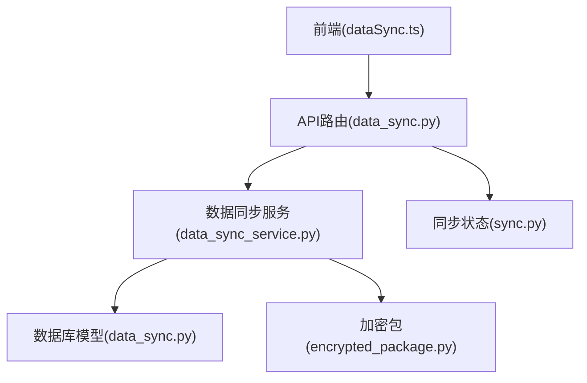
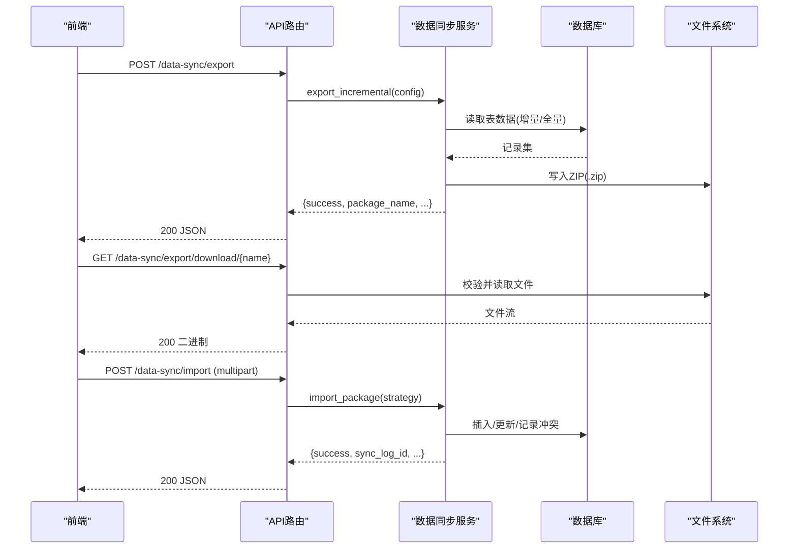
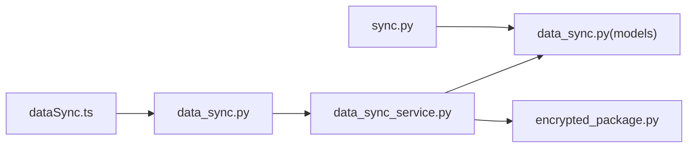

# 数据同步API

<cite>
**本文引用的文件**
- [backend/app/api/v1/data_sync.py](file://backend/app/api/v1/data_sync.py)
- [backend/app/services/data_sync_service.py](file://backend/app/services/data_sync_service.py)
- [backend/app/models/data_sync.py](file://backend/app/models/data_sync.py)
- [backend/app/services/encrypted_package.py](file://backend/app/services/encrypted_package.py)
- [backend/app/api/v1/sync.py](file://backend/app/api/v1/sync.py)
- [frontend/src/api/dataSync.ts](file://frontend/src/api/dataSync.ts)
- [backend/tests/unit/test_data_sync_route.py](file://backend/tests/unit/test_data_sync_route.py)
</cite>

## 目录
1. [简介](#简介)
2. [项目结构](#项目结构)
3. [核心组件](#核心组件)
4. [架构总览](#架构总览)
5. [详细组件分析](#详细组件分析)
6. [依赖关系分析](#依赖关系分析)
7. [性能与一致性](#性能与一致性)
8. [故障排查指南](#故障排查指南)
9. [结论](#结论)
10. [附录：API 规范与调用示例](#附录api-规范与调用示例)

## 简介
本文件面向“数据同步”能力，覆盖数据导入、导出（含增量）、加密包传输、冲突检测与解决、同步日志查询等接口。文档说明HTTP方法、URL路径、请求参数、响应格式、错误处理，并给出多机协同、数据一致性保证、版本控制等关键机制的说明与调用示例。

## 项目结构
数据同步相关代码主要分布在后端 API 路由、服务层、模型与加密工具中，前端通过 TypeScript 封装调用。

图表来源
- [backend/app/api/v1/data_sync.py:1-337](file://backend/app/api/v1/data_sync.py#L1-L337)
- [backend/app/services/data_sync_service.py:1-933](file://backend/app/services/data_sync_service.py#L1-L933)
- [backend/app/models/data_sync.py:1-72](file://backend/app/models/data_sync.py#L1-L72)
- [backend/app/services/encrypted_package.py:1-120](file://backend/app/services/encrypted_package.py#L1-L120)
- [backend/app/api/v1/sync.py:1-173](file://backend/app/api/v1/sync.py#L1-L173)
- [frontend/src/api/dataSync.ts:1-88](file://frontend/src/api/dataSync.ts#L1-L88)

章节来源
- [backend/app/api/v1/data_sync.py:1-337](file://backend/app/api/v1/data_sync.py#L1-L337)
- [backend/app/services/data_sync_service.py:1-933](file://backend/app/services/data_sync_service.py#L1-L933)
- [backend/app/models/data_sync.py:1-72](file://backend/app/models/data_sync.py#L1-L72)
- [backend/app/services/encrypted_package.py:1-120](file://backend/app/services/encrypted_package.py#L1-L120)
- [backend/app/api/v1/sync.py:1-173](file://backend/app/api/v1/sync.py#L1-L173)
- [frontend/src/api/dataSync.ts:1-88](file://frontend/src/api/dataSync.ts#L1-L88)

## 核心组件
- API 路由层：提供数据同步相关 HTTP 端点，负责鉴权、参数校验、异常包装与返回。
- 服务层：实现增量导出、全量/选择性导出、导入策略（跳过/覆盖/手动冲突）、冲突查询与解决、加密包创建与解析。
- 模型层：记录同步日志与冲突信息，支撑可追溯性与审计。
- 加密包：基于 AES-256-GCM + PBKDF2-SHA256，提供完整性校验与密码保护，支持离线U盘拷贝场景。
- 前端封装：统一调用入口，包含类型定义与下载辅助。

章节来源
- [backend/app/api/v1/data_sync.py:1-337](file://backend/app/api/v1/data_sync.py#L1-L337)
- [backend/app/services/data_sync_service.py:1-933](file://backend/app/services/data_sync_service.py#L1-L933)
- [backend/app/models/data_sync.py:1-72](file://backend/app/models/data_sync.py#L1-L72)
- [backend/app/services/encrypted_package.py:1-120](file://backend/app/services/encrypted_package.py#L1-L120)
- [frontend/src/api/dataSync.ts:1-88](file://frontend/src/api/dataSync.ts#L1-L88)

## 架构总览
数据同步流程包括：
- 增量/全量导出：按 since 时间或模块列表导出为 ZIP；或生成加密 .rrs 包。
- 导入：支持 ZIP 与 .rrs 两种格式，按策略处理冲突（skip/overwrite/manual）。
- 冲突管理：记录冲突明细，支持查询与人工/自动合并。
- 日志与状态：记录每次同步任务的状态、统计与详情。

图表来源
- [backend/app/api/v1/data_sync.py:82-185](file://backend/app/api/v1/data_sync.py#L82-L185)
- [backend/app/services/data_sync_service.py:128-302](file://backend/app/services/data_sync_service.py#L128-L302)
- [backend/app/services/data_sync_service.py:304-472](file://backend/app/services/data_sync_service.py#L304-L472)

## 详细组件分析

### 导出接口
- 增量导出（无加密）
  - 方法/路径：POST /api/v1/data-sync/export
  - 查询参数：
    - since: ISO 时间字符串（可选），用于增量导出
    - modules: 数组（可选），指定导出的表/模块
    - include_files: 布尔（可选），是否打包上传附件
  - 权限：仅管理员
  - 响应：包含 success、package_name、package_path、total_records、exported_at、size、message，可能包含 errors
  - 错误：时间格式错误返回 400；其他异常包装为业务错误
  - 参考：[backend/app/api/v1/data_sync.py:82-113](file://backend/app/api/v1/data_sync.py#L82-L113)

- 加密导出（.rrs）
  - 方法/路径：POST /api/v1/data-sync/export-encrypted
  - 请求体：
    - password: 字符串（必填）
    - export_type: "full" | "selective"（必填）
    - modules: 数组（可选，selective 时使用）
    - since: ISO 时间字符串（可选）
  - 权限：仅管理员
  - 响应：包含 success、package_name、package_path、total_records、exported_at、size、file_hash、message
  - 错误：export_type 非法或时间格式错误返回 400；其他异常包装为业务错误
  - 参考：[backend/app/api/v1/data_sync.py:115-154](file://backend/app/api/v1/data_sync.py#L115-L154)

- 下载数据包
  - 方法/路径：GET /api/v1/data-sync/export/download/{package_name}
  - 路径参数：package_name（仅允许字母数字下划线横线点）
  - 行为：优先 .zip，不存在则尝试 .rrs；进行路径边界检查
  - 响应：二进制文件流
  - 错误：无效名称或路径越界返回 400；不存在返回业务错误
  - 参考：[backend/app/api/v1/data_sync.py:157-185](file://backend/app/api/v1/data_sync.py#L157-L185)

章节来源
- [backend/app/api/v1/data_sync.py:82-185](file://backend/app/api/v1/data_sync.py#L82-L185)
- [backend/tests/unit/test_data_sync_route.py:56-200](file://backend/tests/unit/test_data_sync_route.py#L56-L200)

### 导入接口
- 导入 ZIP（无加密）
  - 方法/路径：POST /api/v1/data-sync/import
  - 表单字段：
    - file: 文件（必填）
    - strategy: "skip" | "overwrite" | "merge" | "manual"（默认 "skip"）
  - 权限：仅管理员
  - 行为：分块保存临时文件，导入后清理；敏感表禁止导入
  - 响应：success、sync_log_id、total/success/failed records、conflicts、errors、message
  - 错误：文件不存在或格式错误返回业务错误
  - 参考：[backend/app/api/v1/data_sync.py:188-219](file://backend/app/api/v1/data_sync.py#L188-L219)

- 导入 .rrs（加密）
  - 方法/路径：POST /api/v1/data-sync/import-encrypted
  - 表单字段：
    - file: 文件（必填）
    - password: 字符串（必填）
    - strategy: "skip" | "overwrite" | "merge"（默认 "merge"）
  - 权限：仅管理员
  - 行为：解密包，校验完整性，执行导入；记录冲突与统计
  - 响应：同 ZIP 导入
  - 错误：密码错误或完整性校验失败返回业务错误
  - 参考：[backend/app/api/v1/data_sync.py:222-255](file://backend/app/api/v1/data_sync.py#L222-L255)

章节来源
- [backend/app/api/v1/data_sync.py:188-255](file://backend/app/api/v1/data_sync.py#L188-L255)
- [backend/app/services/data_sync_service.py:304-472](file://backend/app/services/data_sync_service.py#L304-L472)
- [backend/app/services/data_sync_service.py:706-800](file://backend/app/services/data_sync_service.py#L706-L800)

### 冲突管理与解决
- 获取冲突列表
  - 方法/路径：GET /api/v1/data-sync/conflicts/{sync_log_id}
  - 响应：success、data（冲突列表）、count
  - 参考：[backend/app/api/v1/data_sync.py:258-268](file://backend/app/api/v1/data_sync.py#L258-L268)

- 解决冲突
  - 方法/路径：POST /api/v1/data-sync/resolve-conflict
  - 查询参数：
    - conflict_id: 整数（必填）
    - resolution: "keep_local" | "use_import" | "merge"（必填）
    - merged_data: 对象（resolution=merge 时必填）
  - 权限：仅管理员
  - 响应：success、message
  - 参考：[backend/app/api/v1/data_sync.py:271-291](file://backend/app/api/v1/data_sync.py#L271-L291)

- 服务层冲突逻辑
  - 导入阶段对重复记录按策略处理：skip（跳过计数）、overwrite（更新）、manual（记录冲突）
  - 冲突记录持久化到 data_conflicts，支持后续查询与解决
  - 参考：[backend/app/services/data_sync_service.py:407-472](file://backend/app/services/data_sync_service.py#L407-L472)
  - 参考：[backend/app/services/data_sync_service.py:515-574](file://backend/app/services/data_sync_service.py#L515-L574)

章节来源
- [backend/app/api/v1/data_sync.py:258-291](file://backend/app/api/v1/data_sync.py#L258-L291)
- [backend/app/services/data_sync_service.py:407-574](file://backend/app/services/data_sync_service.py#L407-L574)

### 同步日志与状态
- 同步日志查询
  - 方法/路径：GET /api/v1/data-sync/logs
  - 查询参数：
    - sync_type: "import" | "export"（可选）
    - limit: 整数（默认 50）
  - 响应：分页结构 items、total、page、page_size
  - 参考：[backend/app/api/v1/data_sync.py:294-336](file://backend/app/api/v1/data_sync.py#L294-L336)

- 同步状态与仪表盘
  - 方法/路径：GET /api/v1/sync/status
  - 响应：last_sync、pending_changes、sync_status（idle/syncing）
  - 方法/路径：GET /api/v1/sync/dashboard
  - 响应：汇总统计、趋势、最近活动、包统计、磁盘信息等
  - 参考：[backend/app/api/v1/sync.py:22-64](file://backend/app/api/v1/sync.py#L22-L64)
  - 参考：[backend/app/api/v1/sync.py:67-173](file://backend/app/api/v1/sync.py#L67-L173)

章节来源
- [backend/app/api/v1/data_sync.py:294-336](file://backend/app/api/v1/data_sync.py#L294-L336)
- [backend/app/api/v1/sync.py:22-173](file://backend/app/api/v1/sync.py#L22-L173)

### 加密包与多机协同
- 加密包格式（.rrs）
  - 头部：MAGIC、VERSION、salt、metadata_len、encrypted_metadata
  - 数据区：encrypted_data
  - 尾部：SHA256 校验和（对 metadata+data 明文计算）
  - 密钥派生：PBKDF2-SHA256，迭代次数高，抗暴力破解
  - 参考：[backend/app/services/encrypted_package.py:1-120](file://backend/app/services/encrypted_package.py#L1-L120)

- 多机协同
  - 通过 U 盘物理拷贝 .rrs 包，在目标机器使用相同密码解密导入
  - 完整性校验确保数据未被篡改
  - 参考：[backend/app/services/encrypted_package.py:37-119](file://backend/app/services/encrypted_package.py#L37-L119)

章节来源
- [backend/app/services/encrypted_package.py:1-120](file://backend/app/services/encrypted_package.py#L1-L120)

### 版本控制与数据一致性
- 版本元数据
  - 导出包 metadata 中包含 version、exported_at、since、tables 等信息
  - 参考：[backend/app/services/data_sync_service.py:165-175](file://backend/app/services/data_sync_service.py#L165-L175)
  - 参考：[backend/app/services/data_sync_service.py:636-644](file://backend/app/services/data_sync_service.py#L636-L644)

- 一致性保障
  - 表名白名单与列名校验，防止注入
  - 事务提交与连接上下文管理，确保原子性
  - 导入时对敏感表硬禁止，防止提权或篡改
  - 参考：[backend/app/services/data_sync_service.py:23-47](file://backend/app/services/data_sync_service.py#L23-L47)
  - 参考：[backend/app/services/data_sync_service.py:474-513](file://backend/app/services/data_sync_service.py#L474-L513)

章节来源
- [backend/app/services/data_sync_service.py:128-233](file://backend/app/services/data_sync_service.py#L128-L233)
- [backend/app/services/data_sync_service.py:474-513](file://backend/app/services/data_sync_service.py#L474-L513)

## 依赖关系分析
- API 路由依赖服务层完成具体业务逻辑
- 服务层依赖数据库模型记录日志与冲突
- 加密包模块独立于业务，提供安全传输能力
- 前端通过 TypeScript 封装调用，统一类型与下载逻辑

图表来源
- [backend/app/api/v1/data_sync.py:1-337](file://backend/app/api/v1/data_sync.py#L1-L337)
- [backend/app/services/data_sync_service.py:1-933](file://backend/app/services/data_sync_service.py#L1-L933)
- [backend/app/models/data_sync.py:1-72](file://backend/app/models/data_sync.py#L1-L72)
- [backend/app/services/encrypted_package.py:1-120](file://backend/app/services/encrypted_package.py#L1-L120)
- [backend/app/api/v1/sync.py:1-173](file://backend/app/api/v1/sync.py#L1-L173)
- [frontend/src/api/dataSync.ts:1-88](file://frontend/src/api/dataSync.ts#L1-L88)

章节来源
- [backend/app/api/v1/data_sync.py:1-337](file://backend/app/api/v1/data_sync.py#L1-L337)
- [backend/app/services/data_sync_service.py:1-933](file://backend/app/services/data_sync_service.py#L1-L933)
- [backend/app/models/data_sync.py:1-72](file://backend/app/models/data_sync.py#L1-L72)
- [backend/app/services/encrypted_package.py:1-120](file://backend/app/services/encrypted_package.py#L1-L120)
- [backend/app/api/v1/sync.py:1-173](file://backend/app/api/v1/sync.py#L1-L173)
- [frontend/src/api/dataSync.ts:1-88](file://frontend/src/api/dataSync.ts#L1-L88)

## 性能与一致性
- 大文件分块读写：导入时按固定缓冲区大小分块保存，避免内存峰值
- 增量导出：通过 since 时间过滤减少数据量
- 白名单与校验：表名/列名校验降低风险与开销
- 事务与连接管理：确保并发下的数据一致性与资源释放
- 建议：
  - 大规模导入时采用 merge 策略并结合冲突解决
  - 使用 selective 模式仅导出必要模块，减少体积
  - 合理设置 since 时间窗口，提升增量效率

章节来源
- [backend/app/api/v1/data_sync.py:51-71](file://backend/app/api/v1/data_sync.py#L51-L71)
- [backend/app/services/data_sync_service.py:128-233](file://backend/app/services/data_sync_service.py#L128-L233)
- [backend/app/services/data_sync_service.py:474-513](file://backend/app/services/data_sync_service.py#L474-L513)

## 故障排查指南
- 常见错误
  - 时间格式错误：检查 since 是否为 ISO 格式
  - 数据包不存在：确认 package_name 与扩展名匹配
  - 密码错误或完整性校验失败：确认 .rrs 包未损坏且密码正确
  - 权限不足：确认当前用户具备管理员权限
- 定位步骤
  - 查看同步日志：GET /api/v1/data-sync/logs
  - 查看冲突列表：GET /api/v1/data-sync/conflicts/{sync_log_id}
  - 检查系统状态：GET /api/v1/sync/status
- 参考测试用例
  - 导出/导入/下载/冲突等端点的成功与异常分支
  - 参考：[backend/tests/unit/test_data_sync_route.py:56-200](file://backend/tests/unit/test_data_sync_route.py#L56-L200)

章节来源
- [backend/app/api/v1/data_sync.py:82-336](file://backend/app/api/v1/data_sync.py#L82-L336)
- [backend/tests/unit/test_data_sync_route.py:56-200](file://backend/tests/unit/test_data_sync_route.py#L56-L200)

## 结论
数据同步API提供了完整的导入、导出（含增量与加密）、冲突解决与日志追踪能力，结合白名单校验、事务与完整性校验，确保在多机协同场景下的数据安全与一致性。通过模块化导出与策略化导入，系统可在不同规模与网络条件下稳定运行。

## 附录：API 规范与调用示例

### 接口清单
- 增量导出（无加密）
  - POST /api/v1/data-sync/export
  - 参数：since、modules、include_files
  - 响应：{success, package_name, package_path, total_records, exported_at, size, message, errors?}
  - 参考：[backend/app/api/v1/data_sync.py:82-113](file://backend/app/api/v1/data_sync.py#L82-L113)

- 加密导出（.rrs）
  - POST /api/v1/data-sync/export-encrypted
  - 请求体：{password, export_type, modules?, since?}
  - 响应：{success, package_name, package_path, total_records, exported_at, size, file_hash, message}
  - 参考：[backend/app/api/v1/data_sync.py:115-154](file://backend/app/api/v1/data_sync.py#L115-L154)

- 下载数据包
  - GET /api/v1/data-sync/export/download/{package_name}
  - 响应：二进制文件流
  - 参考：[backend/app/api/v1/data_sync.py:157-185](file://backend/app/api/v1/data_sync.py#L157-L185)

- 导入 ZIP
  - POST /api/v1/data-sync/import
  - 表单：file、strategy
  - 响应：{success, sync_log_id, total_records, success_records, failed_records, conflicts, errors, message}
  - 参考：[backend/app/api/v1/data_sync.py:188-219](file://backend/app/api/v1/data_sync.py#L188-L219)

- 导入 .rrs
  - POST /api/v1/data-sync/import-encrypted
  - 表单：file、password、strategy
  - 响应：同 ZIP 导入
  - 参考：[backend/app/api/v1/data_sync.py:222-255](file://backend/app/api/v1/data_sync.py#L222-L255)

- 获取冲突列表
  - GET /api/v1/data-sync/conflicts/{sync_log_id}
  - 响应：{success, data, count}
  - 参考：[backend/app/api/v1/data_sync.py:258-268](file://backend/app/api/v1/data_sync.py#L258-L268)

- 解决冲突
  - POST /api/v1/data-sync/resolve-conflict
  - 参数：conflict_id、resolution、merged_data?
  - 响应：{success, message}
  - 参考：[backend/app/api/v1/data_sync.py:271-291](file://backend/app/api/v1/data_sync.py#L271-L291)

- 同步日志
  - GET /api/v1/data-sync/logs
  - 参数：sync_type?、limit?
  - 响应：分页结构
  - 参考：[backend/app/api/v1/data_sync.py:294-336](file://backend/app/api/v1/data_sync.py#L294-L336)

- 同步状态与仪表盘
  - GET /api/v1/sync/status
  - GET /api/v1/sync/dashboard
  - 参考：[backend/app/api/v1/sync.py:22-173](file://backend/app/api/v1/sync.py#L22-L173)

### 调用示例（前端）
- 增量导出
  - 调用：post('/data-sync/export', {since, modules, include_files})
  - 参考：[frontend/src/api/dataSync.ts:56-56](file://frontend/src/api/dataSync.ts#L56-L56)

- 加密导出
  - 调用：post('/data-sync/export-encrypted', {password, export_type, modules?, since?})
  - 参考：[frontend/src/api/dataSync.ts:58-59](file://frontend/src/api/dataSync.ts#L58-L59)

- 下载包
  - 调用：downloadExportPackage(packageId)
  - 参考：[frontend/src/api/dataSync.ts:61-65](file://frontend/src/api/dataSync.ts#L61-L65)

- 导入 ZIP
  - 调用：importData(file, strategy='overwrite')
  - 参考：[frontend/src/api/dataSync.ts:38-45](file://frontend/src/api/dataSync.ts#L38-L45)

- 导入 .rrs
  - 调用：importEncryptedData(file, password)
  - 参考：[frontend/src/api/dataSync.ts:47-54](file://frontend/src/api/dataSync.ts#L47-L54)

- 冲突查询与解决
  - 调用：getConflicts(syncLogId)、resolveConflict({conflict_id, resolution, merged_data?})
  - 参考：[frontend/src/api/dataSync.ts:69-75](file://frontend/src/api/dataSync.ts#L69-L75)

章节来源
- [frontend/src/api/dataSync.ts:1-88](file://frontend/src/api/dataSync.ts#L1-L88)
- [backend/app/api/v1/data_sync.py:82-336](file://backend/app/api/v1/data_sync.py#L82-L336)
- [backend/app/api/v1/sync.py:22-173](file://backend/app/api/v1/sync.py#L22-L173)