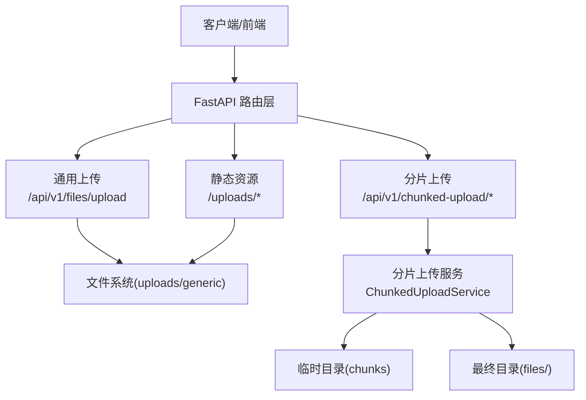
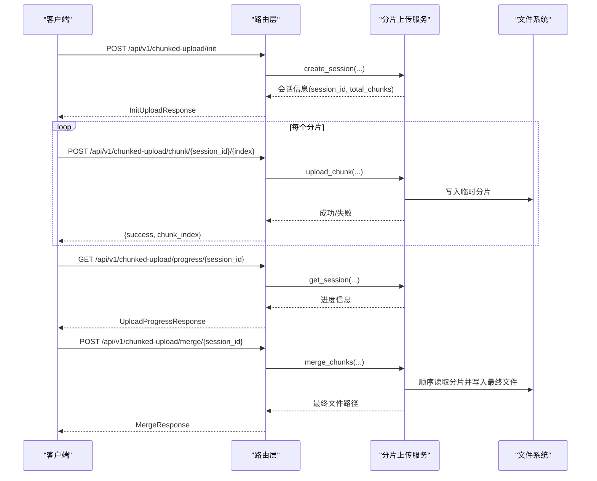
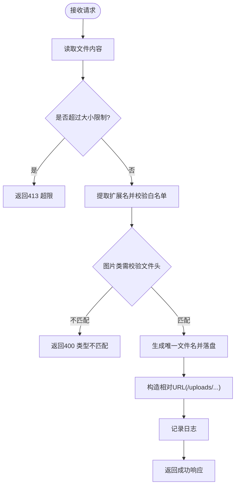
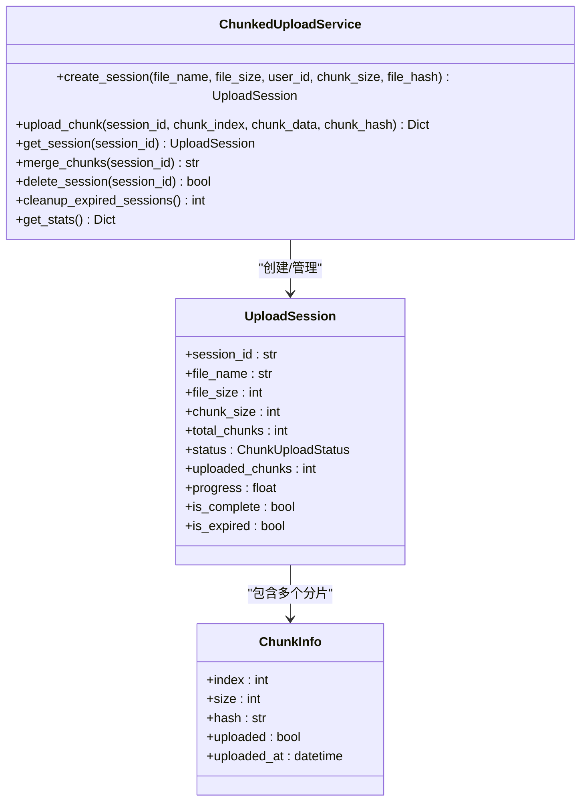
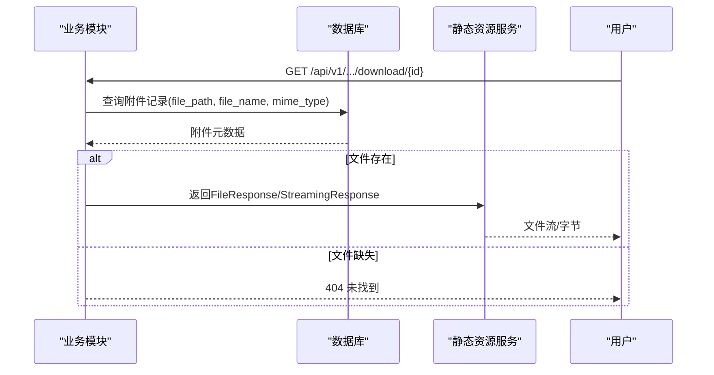
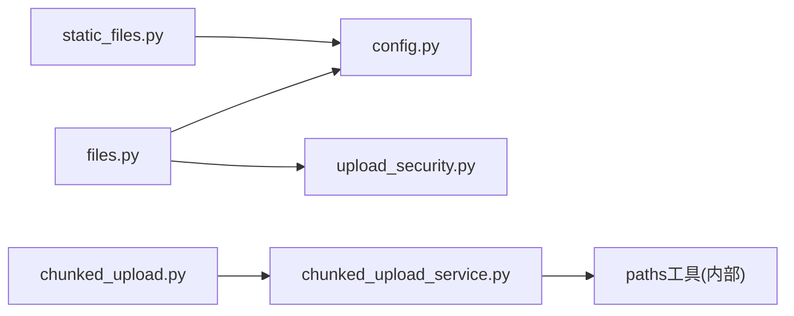

# 文件上传下载API

<cite>
**本文引用的文件**
- [backend/app/api/v1/files.py](file://backend/app/api/v1/files.py)
- [backend/app/api/v1/import_export/chunked_upload.py](file://backend/app/api/v1/import_export/chunked_upload.py)
- [backend/app/services/chunked_upload_service.py](file://backend/app/services/chunked_upload_service.py)
- [backend/app/core/static_files.py](file://backend/app/core/static_files.py)
- [backend/app/core/config.py](file://backend/app/core/config.py)
- [backend/app/core/upload_security.py](file://backend/app/core/upload_security.py)
- [backend/app/models/project.py](file://backend/app/models/project.py)
</cite>

## 目录
1. [简介](#简介)
2. [项目结构](#项目结构)
3. [核心组件](#核心组件)
4. [架构总览](#架构总览)
5. [详细组件分析](#详细组件分析)
6. [依赖关系分析](#依赖关系分析)
7. [性能考虑](#性能考虑)
8. [故障排查指南](#故障排查指南)
9. [结论](#结论)
10. [附录：API参考与示例](#附录api参考与示例)

## 简介
本文件面向“帮扶管理信息系统”后端，系统化说明文件上传、分块上传（断点续传）、文件下载与预览等接口的设计与实现。内容覆盖HTTP方法、URL路径、请求参数、响应格式、错误处理、文件大小限制、类型验证、安全扫描、存储管理与业务关联持久化机制，并提供大文件上传与断点续传的调用示例。

## 项目结构
- 通用文件上传：提供无业务绑定的附件上传能力，返回可通过静态资源访问的相对URL。
- 分片上传：为大文件提供会话初始化、分片上传、进度查询、合并与取消清理能力。
- 静态资源挂载：将上传目录以 /uploads 前缀暴露为静态资源，便于浏览器直接访问或前端下载。
- 配置与安全：集中管理上传目录、大小限制、允许类型；提供扩展的安全校验工具。
- 业务模型：部分业务模块通过模型字段记录文件元数据（如项目附件），用于与业务实体关联。

**图表来源**
- [backend/app/api/v1/files.py:39-127](file://backend/app/api/v1/files.py#L39-L127)
- [backend/app/api/v1/import_export/chunked_upload.py:63-182](file://backend/app/api/v1/import_export/chunked_upload.py#L63-L182)
- [backend/app/services/chunked_upload_service.py:138-179](file://backend/app/services/chunked_upload_service.py#L138-L179)
- [backend/app/core/static_files.py:31-51](file://backend/app/core/static_files.py#L31-L51)

**章节来源**
- [backend/app/api/v1/files.py:1-127](file://backend/app/api/v1/files.py#L1-L127)
- [backend/app/api/v1/import_export/chunked_upload.py:1-182](file://backend/app/api/v1/import_export/chunked_upload.py#L1-L182)
- [backend/app/services/chunked_upload_service.py:1-523](file://backend/app/services/chunked_upload_service.py#L1-L523)
- [backend/app/core/static_files.py:1-52](file://backend/app/core/static_files.py#L1-L52)

## 核心组件
- 通用上传接口：支持按类别子目录存储、白名单校验、图片头校验、唯一文件名生成与日志记录。
- 分片上传服务：维护会话状态、分片落盘、进度计算、合并校验、过期清理与统计。
- 静态资源服务：统一挂载上传目录，确保 /uploads 可被浏览器直接访问。
- 配置项：UPLOAD_DIR、MAX_FILE_SIZE、ALLOWED_FILE_TYPES 等集中管理。
- 安全校验工具：扩展了扩展名、MIME、大小、内容安全检测与文件名清洗。

**章节来源**
- [backend/app/api/v1/files.py:21-127](file://backend/app/api/v1/files.py#L21-L127)
- [backend/app/services/chunked_upload_service.py:24-122](file://backend/app/services/chunked_upload_service.py#L24-L122)
- [backend/app/core/static_files.py:31-51](file://backend/app/core/static_files.py#L31-L51)
- [backend/app/core/config.py:170-176](file://backend/app/core/config.py#L170-L176)
- [backend/app/core/upload_security.py:19-50](file://backend/app/core/upload_security.py#L19-L50)

## 架构总览
系统采用分层设计：
- 路由层：定义RESTful端点，负责鉴权、参数校验与响应封装。
- 服务层：分片上传服务封装会话、分片、合并、清理等复杂逻辑。
- 存储层：文件系统作为对象存储，配合静态资源挂载对外暴露。
- 配置与安全：集中配置与通用安全校验工具，保证一致性与安全性。

**图表来源**
- [backend/app/api/v1/import_export/chunked_upload.py:63-182](file://backend/app/api/v1/import_export/chunked_upload.py#L63-L182)
- [backend/app/services/chunked_upload_service.py:207-465](file://backend/app/services/chunked_upload_service.py#L207-L465)

## 详细组件分析

### 通用文件上传接口
- 方法与路径：POST /api/v1/files/upload
- 请求体：multipart/form-data
  - file: 必填，二进制文件
  - category: 可选，存储子目录（如 policies/villages/schools）
- 响应：统一成功包装，包含 url、file_name、file_size、file_type
- 行为要点：
  - 大小限制：超过 MAX_FILE_SIZE 返回413
  - 类型校验：基于扩展名白名单；图片类进行文件头匹配校验
  - 存储：uploads/generic[/<category>]，唯一文件名
  - 访问：返回相对URL，通过 /uploads 静态资源访问
- 错误处理：
  - 400：不支持的文件类型或内容与扩展不匹配
  - 413：超过大小限制
  - 鉴权失败：依赖全局鉴权中间件

**图表来源**
- [backend/app/api/v1/files.py:39-127](file://backend/app/api/v1/files.py#L39-L127)

**章节来源**
- [backend/app/api/v1/files.py:21-127](file://backend/app/api/v1/files.py#L21-L127)
- [backend/app/core/config.py:170-176](file://backend/app/core/config.py#L170-L176)

### 分片上传接口（断点续传）
- 初始化会话：POST /api/v1/chunked-upload/init
  - 请求体：file_name、file_size、chunk_size（可选）、file_hash（可选）
  - 响应：session_id、total_chunks、status 等
- 上传分片：POST /api/v1/chunked-upload/chunk/{session_id}/{chunk_index}
  - 请求体：file（分片二进制）、chunk_hash（可选）
  - 响应：{success, chunk_index}
- 查询进度：GET /api/v1/chunked-upload/progress/{session_id}
  - 响应：uploaded_chunks、progress、status 等
- 合并分片：POST /api/v1/chunked-upload/merge/{session_id}
  - 响应：file_path、file_name、status
- 取消上传：DELETE /api/v1/chunked-upload/{session_id}
  - 响应：{success, message}
- 行为要点：
  - 用户隔离：所有操作校验 session.user_id == current_user.id
  - 分片校验：支持分片MD5校验；合并时校验总分片数与最终文件大小，可选校验文件哈希
  - 存储：临时目录按 session_id 组织；最终文件按 user_id 组织
  - 过期清理：会话默认24小时过期，支持批量清理
- 错误处理：
  - 404：会话不存在
  - 403：无权操作他人会话
  - 400：分片大小不匹配、哈希不一致、合并失败等

**图表来源**
- [backend/app/services/chunked_upload_service.py:36-103](file://backend/app/services/chunked_upload_service.py#L36-L103)
- [backend/app/services/chunked_upload_service.py:124-179](file://backend/app/services/chunked_upload_service.py#L124-L179)
- [backend/app/services/chunked_upload_service.py:207-465](file://backend/app/services/chunked_upload_service.py#L207-L465)

**章节来源**
- [backend/app/api/v1/import_export/chunked_upload.py:23-182](file://backend/app/api/v1/import_export/chunked_upload.py#L23-L182)
- [backend/app/services/chunked_upload_service.py:24-122](file://backend/app/services/chunked_upload_service.py#L24-L122)
- [backend/app/services/chunked_upload_service.py:207-465](file://backend/app/services/chunked_upload_service.py#L207-L465)

### 文件下载与预览
- 静态资源访问：通过 /uploads/<relative_path> 直接访问已上传文件（由静态资源服务挂载）。
- 业务下载：各业务模块通常通过数据库中的文件路径字段定位文件，使用 FileResponse 或 StreamingResponse 返回。
- 预览：对于文本或可在线预览的类型，可直接通过 /uploads 访问；对二进制或受控资源，建议走业务下载接口并设置合适的Content-Type/Content-Disposition。

**图表来源**
- [backend/app/core/static_files.py:31-51](file://backend/app/core/static_files.py#L31-L51)

**章节来源**
- [backend/app/core/static_files.py:31-51](file://backend/app/core/static_files.py#L31-L51)

### 安全扫描与类型验证
- 扩展名白名单与黑名单：禁止执行脚本与危险后缀，仅允许办公文档、图片、音视频等。
- MIME类型校验：拒绝非预期MIME类型。
- 内容安全检测：识别可执行签名与脚本特征。
- 图片头校验：防止通过重命名绕过类型检查。
- 文件名清洗：去除非法字符，避免路径穿越。

**章节来源**
- [backend/app/core/upload_security.py:19-50](file://backend/app/core/upload_security.py#L19-L50)
- [backend/app/core/upload_security.py:57-160](file://backend/app/core/upload_security.py#L57-L160)
- [backend/app/core/upload_security.py:175-195](file://backend/app/core/upload_security.py#L175-L195)
- [backend/app/api/v1/files.py:21-84](file://backend/app/api/v1/files.py#L21-L84)

### 存储管理与业务关联
- 存储目录：
  - 通用上传：uploads/generic[/<category>]
  - 分片上传：临时目录 chunks/<session_id>；最终目录 files/<user_id>/<session_id>.ext
- 业务关联：
  - 项目附件模型 ProjectFile 记录 project_id、category、filename、filepath、file_size、uploaded_by、created_at，便于按项目维度检索与管理。
- 静态资源：/uploads 映射到实际上传目录，便于前端直链访问。

**章节来源**
- [backend/app/services/chunked_upload_service.py:185-199](file://backend/app/services/chunked_upload_service.py#L185-L199)
- [backend/app/models/project.py:278-319](file://backend/app/models/project.py#L278-L319)
- [backend/app/core/static_files.py:31-51](file://backend/app/core/static_files.py#L31-L51)

## 依赖关系分析
- 路由层依赖：
  - 通用上传：依赖配置（MAX_FILE_SIZE、UPLOAD_DIR）、安全校验（扩展名、图片头）、响应封装。
  - 分片上传：依赖 ChunkedUploadService 单例，注入当前用户进行权限隔离。
- 服务层依赖：
  - 分片上传服务：依赖异步文件IO、路径工具、时间与时区、哈希计算。
- 静态资源：
  - 静态资源服务：依赖配置与路径工具，挂载 /uploads。

**图表来源**
- [backend/app/api/v1/files.py:13-16](file://backend/app/api/v1/files.py#L13-L16)
- [backend/app/api/v1/import_export/chunked_upload.py:12-18](file://backend/app/api/v1/import_export/chunked_upload.py#L12-L18)
- [backend/app/core/static_files.py:8-10](file://backend/app/core/static_files.py#L8-L10)

**章节来源**
- [backend/app/api/v1/files.py:1-127](file://backend/app/api/v1/files.py#L1-L127)
- [backend/app/api/v1/import_export/chunked_upload.py:1-182](file://backend/app/api/v1/import_export/chunked_upload.py#L1-L182)
- [backend/app/core/static_files.py:1-52](file://backend/app/core/static_files.py#L1-L52)

## 性能考虑
- 分片大小：默认5MB，范围1~20MB，可根据网络与服务器内存调整。
- 并发上传：分片并行上传提升吞吐；合并阶段顺序写盘，注意磁盘I/O。
- 内存占用：分片上传服务在内存中维护会话与分片索引，生产环境建议引入Redis持久化会话。
- 静态资源：使用反向代理（如Nginx）缓存静态资源，减轻后端压力。
- 日志与监控：记录上传事件与耗时，结合指标监控定位瓶颈。

## 故障排查指南
- 上传失败（400/413）：
  - 检查文件大小是否超过 MAX_FILE_SIZE
  - 检查扩展名是否在白名单，图片是否通过文件头校验
- 分片上传异常：
  - 确认 session_id 有效且属于当前用户
  - 检查分片大小与索引是否正确，必要时携带 chunk_hash 校验
  - 合并失败时查看错误消息与最终文件大小是否匹配
- 下载404：
  - 确认数据库中 file_path 是否存在于 UPLOAD_DIR
  - 确认静态资源挂载路径与实际目录一致
- 权限问题：
  - 确认鉴权中间件生效，用户具备相应操作权限

**章节来源**
- [backend/app/api/v1/files.py:56-84](file://backend/app/api/v1/files.py#L56-L84)
- [backend/app/api/v1/import_export/chunked_upload.py:97-113](file://backend/app/api/v1/import_export/chunked_upload.py#L97-L113)
- [backend/app/services/chunked_upload_service.py:282-303](file://backend/app/services/chunked_upload_service.py#L282-L303)
- [backend/app/services/chunked_upload_service.py:391-465](file://backend/app/services/chunked_upload_service.py#L391-L465)

## 结论
本系统提供了完善的文件上传与分片上传能力，内置安全校验与静态资源访问，满足大文件上传与断点续传需求。通过服务层抽象与配置化管理，具备良好的可扩展性与可维护性。建议在生产环境中引入外部会话存储（如Redis）与反向代理缓存，进一步提升稳定性与性能。

## 附录：API参考与示例

### 通用文件上传
- 方法：POST
- 路径：/api/v1/files/upload
- 请求：
  - Content-Type: multipart/form-data
  - 表单字段：
    - file: 二进制文件
    - category: 可选，字符串（如 policies/villages/schools）
- 响应：
  - data.url: 相对URL（如 /uploads/generic/xxx.jpg）
  - data.file_name: 原始文件名
  - data.file_size: 字节数
  - data.file_type: MIME类型
- 错误：
  - 400：不支持的文件类型或内容与扩展不匹配
  - 413：超过大小限制

示例（curl）：
- curl -X POST http://localhost:8000/api/v1/files/upload -F "file=@report.pdf" -F "category=policies"

**章节来源**
- [backend/app/api/v1/files.py:39-127](file://backend/app/api/v1/files.py#L39-L127)
- [backend/app/core/config.py:170-176](file://backend/app/core/config.py#L170-L176)

### 分片上传（断点续传）
- 初始化会话
  - 方法：POST
  - 路径：/api/v1/chunked-upload/init
  - 请求体：
    - file_name: 字符串
    - file_size: 整数（字节）
    - chunk_size: 可选，整数（默认5MB）
    - file_hash: 可选，字符串（文件MD5）
  - 响应：
    - session_id: 字符串
    - total_chunks: 整数
    - status: 枚举值（pending/uploading/completed/merging/merged/failed/expired）
- 上传分片
  - 方法：POST
  - 路径：/api/v1/chunked-upload/chunk/{session_id}/{chunk_index}
  - 请求：
    - Content-Type: multipart/form-data
    - file: 分片二进制
    - chunk_hash: 可选，分片MD5
  - 响应：{success: true, chunk_index: 整数}
- 查询进度
  - 方法：GET
  - 路径：/api/v1/chunked-upload/progress/{session_id}
  - 响应：
    - uploaded_chunks: 整数
    - progress: 浮点数（百分比）
    - status: 枚举值
- 合并分片
  - 方法：POST
  - 路径：/api/v1/chunked-upload/merge/{session_id}
  - 响应：
    - file_path: 最终文件路径
    - file_name: 原始文件名
    - status: merged
- 取消上传
  - 方法：DELETE
  - 路径：/api/v1/chunked-upload/{session_id}
  - 响应：{success: true, message: "上传已取消"}

示例（curl）：
- 初始化：curl -X POST http://localhost:8000/api/v1/chunked-upload/init -H "Content-Type: application/json" -d '{"file_name":"large.zip","file_size":104857600,"chunk_size":5242880}'
- 上传分片：curl -X POST http://localhost:8000/api/v1/chunked-upload/chunk/{session_id}/0 -F "file=@part0.bin"
- 查询进度：curl http://localhost:8000/api/v1/chunked-upload/progress/{session_id}
- 合并：curl -X POST http://localhost:8000/api/v1/chunked-upload/merge/{session_id}
- 取消：curl -X DELETE http://localhost:8000/api/v1/chunked-upload/{session_id}

**章节来源**
- [backend/app/api/v1/import_export/chunked_upload.py:23-182](file://backend/app/api/v1/import_export/chunked_upload.py#L23-L182)
- [backend/app/services/chunked_upload_service.py:207-465](file://backend/app/services/chunked_upload_service.py#L207-L465)

### 文件下载与预览
- 静态资源访问
  - 方法：GET
  - 路径：/uploads/<relative_path>
  - 说明：直接返回文件内容，适用于图片、PDF等可在线预览或下载的场景
- 业务下载（示例）
  - 方法：GET
  - 路径：/api/v1/.../download/{id}
  - 说明：根据业务ID查询附件元数据，返回文件流或字节；若文件不存在返回404

示例（浏览器）：
- 打开 https://localhost:8000/uploads/generic/report.pdf 直接预览或下载

**章节来源**
- [backend/app/core/static_files.py:31-51](file://backend/app/core/static_files.py#L31-L51)

### 与业务模块的关联与持久化
- 项目附件模型（ProjectFile）
  - 关键字段：project_id、category、filename、filepath、file_size、uploaded_by、created_at
  - 用途：按项目维度组织附件，便于检索、展示与权限控制
- 存储策略
  - 通用上传：uploads/generic[/<category>]
  - 分片上传：chunks/<session_id> -> files/<user_id>/<session_id>.ext
  - 静态资源：/uploads 映射到实际目录

**章节来源**
- [backend/app/models/project.py:278-319](file://backend/app/models/project.py#L278-L319)
- [backend/app/services/chunked_upload_service.py:185-199](file://backend/app/services/chunked_upload_service.py#L185-L199)
- [backend/app/core/static_files.py:31-51](file://backend/app/core/static_files.py#L31-L51)