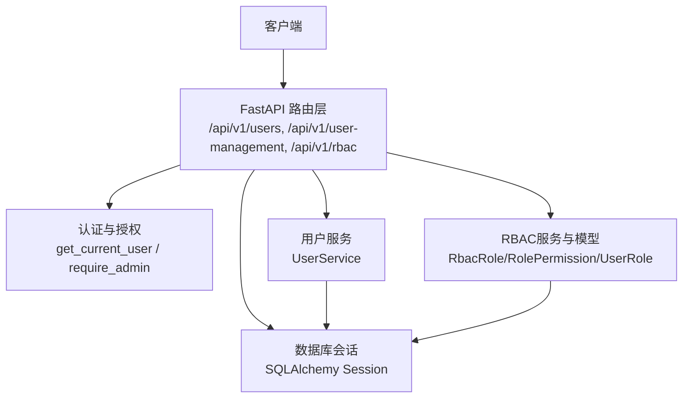
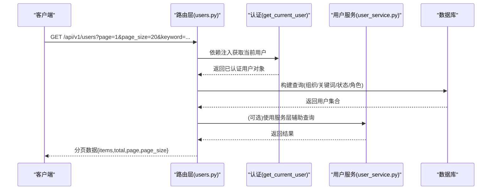
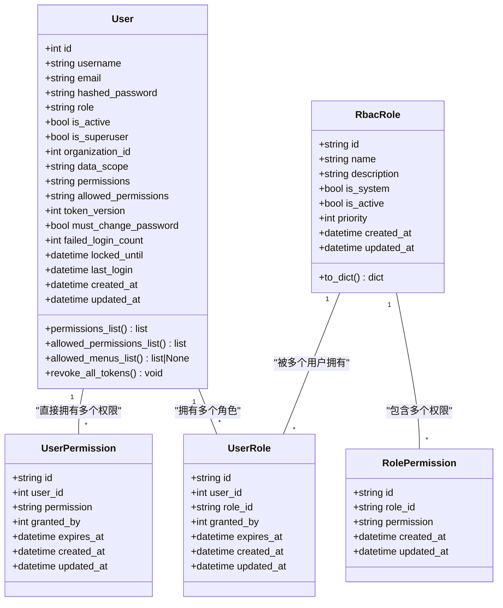
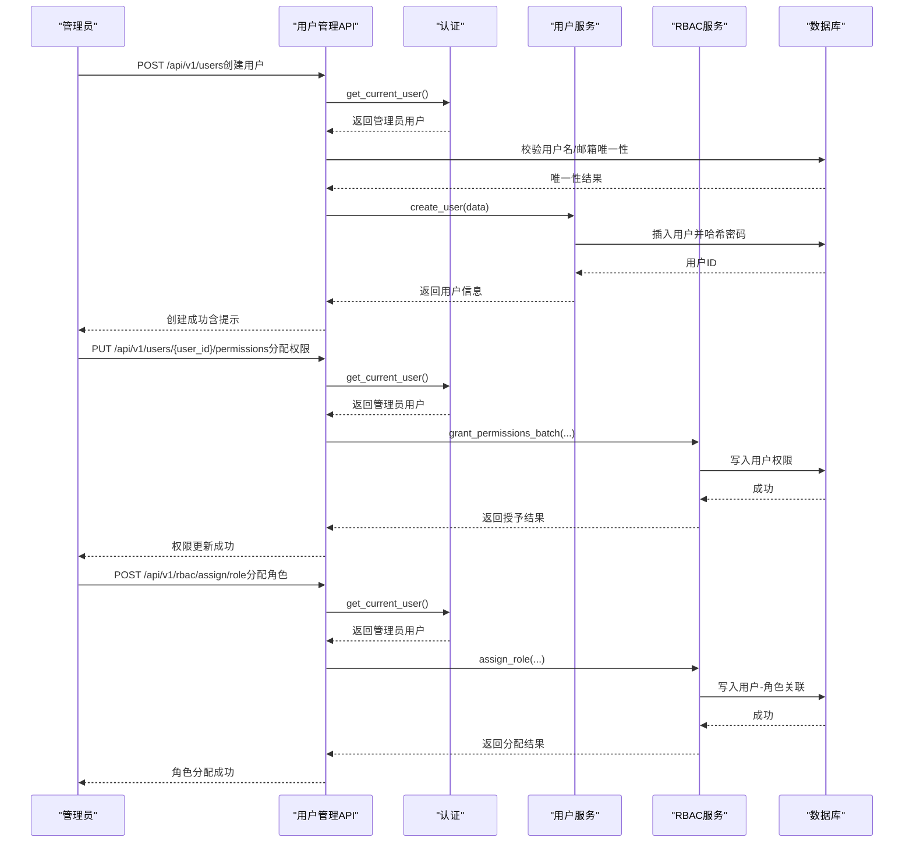

# 用户管理API

<cite>
**本文引用的文件**
- [backend/app/api/v1/auth/user_management.py](file://backend/app/api/v1/auth/user_management.py)
- [backend/app/api/v1/auth/users.py](file://backend/app/api/v1/auth/users.py)
- [backend/app/api/v1/auth/rbac.py](file://backend/app/api/v1/auth/rbac.py)
- [backend/app/models/user.py](file://backend/app/models/user.py)
- [backend/app/schemas/user.py](file://backend/app/schemas/user.py)
- [backend/app/services/user_service.py](file://backend/app/services/user_service.py)
- [backend/app/core/security.py](file://backend/app/core/security.py)
- [backend/app/models/rbac.py](file://backend/app/models/rbac.py)
</cite>

## 目录
1. [简介](#简介)
2. [项目结构](#项目结构)
3. [核心组件](#核心组件)
4. [架构总览](#架构总览)
5. [详细接口说明](#详细接口说明)
6. [依赖关系分析](#依赖关系分析)
7. [性能与扩展性](#性能与扩展性)
8. [故障排查指南](#故障排查指南)
9. [结论](#结论)
10. [附录：完整业务流程示例](#附录完整业务流程示例)

## 简介
本文件面向后端开发者与集成方，系统化梳理“用户管理”相关API，覆盖用户CRUD、角色分配、权限管理、状态管理、搜索过滤、批量操作以及与RBAC系统的集成。文档以实际代码为依据，给出HTTP方法、路径、请求参数、响应格式、错误处理与调用示例，帮助快速对接与排障。

## 项目结构
用户管理功能由以下模块协同实现：
- API路由层：提供RESTful接口，负责鉴权、入参校验、业务编排与响应封装
- 服务层：封装用户查询、创建、更新、删除等核心逻辑
- 模型层：定义用户实体与RBAC相关表结构
- 安全与认证：JWT令牌、密码策略、管理员权限校验、速率限制与安全头
- RBAC权限：角色、权限、用户-角色/权限关联、资源访问控制与审计日志

图表来源
- [backend/app/api/v1/auth/users.py:213-296](file://backend/app/api/v1/auth/users.py#L213-L296)
- [backend/app/api/v1/auth/user_management.py:131-190](file://backend/app/api/v1/auth/user_management.py#L131-L190)
- [backend/app/api/v1/auth/rbac.py:144-183](file://backend/app/api/v1/auth/rbac.py#L144-L183)
- [backend/app/services/user_service.py:50-74](file://backend/app/services/user_service.py#L50-L74)
- [backend/app/core/security.py:243-347](file://backend/app/core/security.py#L243-L347)

章节来源
- [backend/app/api/v1/auth/users.py:213-296](file://backend/app/api/v1/auth/users.py#L213-L296)
- [backend/app/api/v1/auth/user_management.py:131-190](file://backend/app/api/v1/auth/user_management.py#L131-L190)
- [backend/app/api/v1/auth/rbac.py:144-183](file://backend/app/api/v1/auth/rbac.py#L144-L183)
- [backend/app/services/user_service.py:50-74](file://backend/app/services/user_service.py#L50-L74)
- [backend/app/core/security.py:243-347](file://backend/app/core/security.py#L243-L347)

## 核心组件
- 用户模型（User）：包含用户名、邮箱、角色、组织、数据范围、权限白名单、菜单可见性等字段，并提供列表解析与Token版本控制等方法
- 用户Schemas：用于创建、更新、响应的Pydantic模型，约束字段长度、必填项与类型
- 用户服务（UserService）：提供按条件分页查询、创建、更新、删除等基础能力
- 认证与安全：JWT生成/校验、密码哈希/验证、管理员权限校验、速率限制与安全响应头
- RBAC模型：角色、用户-角色、角色-权限、用户直接权限、资源访问控制、访问日志等

章节来源
- [backend/app/models/user.py:26-152](file://backend/app/models/user.py#L26-L152)
- [backend/app/schemas/user.py:9-53](file://backend/app/schemas/user.py#L9-L53)
- [backend/app/services/user_service.py:20-124](file://backend/app/services/user_service.py#L20-L124)
- [backend/app/core/security.py:120-173](file://backend/app/core/security.py#L120-L173)
- [backend/app/models/rbac.py:31-263](file://backend/app/models/rbac.py#L31-L263)

## 架构总览
用户管理API采用分层设计：
- 路由层：接收HTTP请求，进行鉴权与参数校验，调用服务或RBAC模块
- 服务层：封装领域逻辑，统一事务提交与刷新
- 模型层：映射数据库表，承载实体与关系
- 安全层：提供认证、授权、密码策略、速率限制、审计上下文注入
- RBAC层：提供角色、权限、用户-角色/权限的增删改查与检查

图表来源
- [backend/app/api/v1/auth/users.py:213-296](file://backend/app/api/v1/auth/users.py#L213-L296)
- [backend/app/core/security.py:243-347](file://backend/app/core/security.py#L243-L347)
- [backend/app/services/user_service.py:50-74](file://backend/app/services/user_service.py#L50-L74)

## 详细接口说明

### 通用约定
- 认证方式：Bearer Token（Authorization: Bearer <token>）
- 管理员接口：需具备 admin 或 super_admin 角色，或通过 is_superuser 判定
- 统一响应：多数接口返回 {success/code, message, data} 或 ok_list 包装的分页结构
- 错误码：400 参数/业务错误；401 未认证/令牌无效；403 无权限；404 资源不存在；500 服务器错误

章节来源
- [backend/app/core/security.py:243-347](file://backend/app/core/security.py#L243-L347)
- [backend/app/api/v1/auth/users.py:213-296](file://backend/app/api/v1/auth/users.py#L213-L296)
- [backend/app/api/v1/auth/user_management.py:131-190](file://backend/app/api/v1/auth/user_management.py#L131-L190)

### 用户列表与搜索
- 路径与方法
  - GET /api/v1/users
  - GET /api/v1/user-management
- 鉴权：管理员
- 查询参数
  - page, page_size：分页
  - keyword/username/name/email：模糊搜索
  - is_active/status：激活状态筛选
  - organization_id：按组织筛选
  - role：按角色筛选
- 响应
  - items：用户数组（含id、username、email、full_name、department、position、is_active、role、organization、data_scope、permissions、machine_binding_required、allowed_permissions、last_login、created_at等）
  - total/page/page_size
- 典型错误
  - 401：未携带有效令牌
  - 403：非管理员
  - 400：非法参数（如无效的数据范围）

章节来源
- [backend/app/api/v1/auth/users.py:213-296](file://backend/app/api/v1/auth/users.py#L213-L296)
- [backend/app/api/v1/auth/user_management.py:131-190](file://backend/app/api/v1/auth/user_management.py#L131-L190)
- [backend/app/services/user_service.py:50-74](file://backend/app/services/user_service.py#L50-L74)

### 创建用户
- 路径与方法
  - POST /api/v1/users
  - POST /api/v1/user-management
- 鉴权：管理员
- 请求体关键字段
  - username：必填，唯一
  - password：必填，满足密码策略（最小长度、大小写、数字、特殊字符、弱口令前缀限制等）
  - email：可选，唯一
  - full_name、department、position、phone、avatar、gender、birthday、address、remark：可选
  - role：默认 user，支持归一化（兼容历史角色值）
  - organization_id：可选，存在性校验
  - data_scope：可选，限定数据范围（all/org/org_children/self）
  - permissions/allowed_permissions：旧格式逗号分隔或新格式JSON数组字符串
  - is_active：是否立即激活
- 响应
  - 成功：返回用户基本信息及提示消息（是否处于待审核状态）
- 典型错误
  - 400：用户名/邮箱重复、组织不存在、角色无效、数据范围无效、密码不合规
  - 401/403：认证/权限不足

章节来源
- [backend/app/api/v1/auth/users.py:431-520](file://backend/app/api/v1/auth/users.py#L431-L520)
- [backend/app/api/v1/auth/user_management.py:193-249](file://backend/app/api/v1/auth/user_management.py#L193-L249)
- [backend/app/core/security.py:524-590](file://backend/app/core/security.py#L524-L590)

### 更新用户信息
- 路径与方法
  - PUT /api/v1/users/{user_id}
  - PUT /api/v1/user-management/{user_id}
- 鉴权：管理员
- 请求体关键字段
  - 可更新：email、full_name、department、position、phone、avatar、gender、birthday、address、remark、role、organization_id、data_scope、is_active
  - 受保护字段：is_superuser 不可通过此接口修改
  - 自更新保护：不能取消自己的管理员权限
- 响应
  - 成功：返回更新的字段列表或成功消息
- 典型错误
  - 400：组织不存在、角色无效、数据范围无效、尝试取消自身管理员权限
  - 404：用户不存在

章节来源
- [backend/app/api/v1/auth/users.py:523-572](file://backend/app/api/v1/auth/users.py#L523-L572)
- [backend/app/api/v1/auth/user_management.py:252-293](file://backend/app/api/v1/auth/user_management.py#L252-L293)

### 删除用户
- 路径与方法
  - DELETE /api/v1/users/{user_id}
  - DELETE /api/v1/user-management/{user_id}
- 鉴权：管理员
- 规则
  - 不允许删除当前登录用户
  - 另一处实现禁止删除系统管理员账户（admin）
  - 支持级联删除（部分实现调用级联服务）
- 响应
  - 成功：删除成功消息（可能包含删除记录数）
- 典型错误
  - 400：禁止删除当前用户或系统管理员
  - 404：用户不存在
  - 500：删除失败

章节来源
- [backend/app/api/v1/auth/users.py:575-589](file://backend/app/api/v1/auth/users.py#L575-L589)
- [backend/app/api/v1/auth/user_management.py:296-346](file://backend/app/api/v1/auth/user_management.py#L296-L346)

### 重置/修改密码
- 路径与方法
  - POST /api/v1/users/{user_id}/admin-reset-password（管理员重置）
  - PUT /api/v1/users/{user_id}/password（本人修改）
  - POST /api/v1/user-management/{user_id}/reset-password（管理员重置）
- 鉴权：管理员（管理员重置），本人（修改密码）
- 请求体关键字段
  - new_password：必须满足密码策略
  - old_password：修改密码时需提供
- 行为
  - 重置后强制下线所有会话（token_version递增）
  - 管理员重置后标记 must_change_password=True，要求首次登录修改
- 响应
  - 成功：重置成功消息
- 典型错误
  - 400：密码不合规、旧密码错误
  - 404：用户不存在

章节来源
- [backend/app/api/v1/auth/users.py:729-797](file://backend/app/api/v1/auth/users.py#L729-L797)
- [backend/app/api/v1/auth/user_management.py:348-384](file://backend/app/api/v1/auth/user_management.py#L348-L384)
- [backend/app/core/security.py:120-173](file://backend/app/core/security.py#L120-L173)

### 用户详情与个人资料
- 路径与方法
  - GET /api/v1/users/me（当前用户资料）
  - PUT /api/v1/users/me/profile（更新当前用户资料）
  - GET /api/v1/users/{user_id}（用户详情，仅本人或管理员）
- 鉴权：已认证用户（个人资料），管理员（他人详情）
- 响应
  - 个人资料：包含基本信息、角色、状态、允许菜单等
  - 用户详情：包含组织、数据范围、权限列表、机器绑定、锁定时间、最后登录等
- 典型错误
  - 404：用户不存在
  - 403：无权查看他人信息

章节来源
- [backend/app/api/v1/auth/users.py:136-207](file://backend/app/api/v1/auth/users.py#L136-L207)
- [backend/app/api/v1/auth/users.py:388-428](file://backend/app/api/v1/auth/users.py#L388-L428)

### 角色与权限选项
- 路径与方法
  - GET /api/v1/users/roles/options（角色选项）
  - GET /api/v1/users/data-scopes/options（数据范围选项）
  - GET /api/v1/users/permissions/options（权限选项）
  - GET /api/v1/user-management/roles（角色列表，含计数）
- 鉴权：管理员
- 响应
  - 角色：value/label/description
  - 数据范围：all/org/org_children/self
  - 权限：code/name/category
- 典型错误
  - 401/403：认证/权限不足

章节来源
- [backend/app/api/v1/auth/users.py:658-726](file://backend/app/api/v1/auth/users.py#L658-L726)
- [backend/app/api/v1/auth/user_management.py:85-125](file://backend/app/api/v1/auth/user_management.py#L85-L125)

### 权限分配与用户权限管理
- 路径与方法
  - PUT /api/v1/users/{user_id}/permissions（管理员分配/修改用户权限）
  - POST /api/v1/user-management/{user_id}/assign-role（为用户分配角色）
- 鉴权：管理员
- 请求体关键字段
  - role：归一化后的角色
  - organization_id：所属组织
  - data_scope：数据范围
  - permissions：旧格式逗号分隔
  - allowed_permissions：新格式JSON数组字符串
  - machine_binding_required：是否强制机器码绑定
  - is_active：激活状态
- 行为
  - 防止自身降级（不能取消自己的管理员权限）
  - 组织存在性校验、角色有效性校验、数据范围有效性校验
- 响应
  - 成功：返回更新后的用户关键信息
- 典型错误
  - 400：组织不存在、角色无效、数据范围无效、尝试取消自身管理员权限
  - 404：用户不存在

章节来源
- [backend/app/api/v1/auth/users.py:592-655](file://backend/app/api/v1/auth/users.py#L592-L655)
- [backend/app/api/v1/auth/user_management.py:387-411](file://backend/app/api/v1/auth/user_management.py#L387-L411)

### RBAC权限管理接口
- 路径与方法
  - POST /api/v1/rbac/check（权限检查）
  - GET /api/v1/rbac/user/{user_id}/permissions（用户权限）
  - GET /api/v1/rbac/user/{user_id}/roles（用户角色）
  - POST /api/v1/rbac/roles（创建角色）
  - GET /api/v1/rbac/roles（角色列表）
  - GET /api/v1/rbac/roles/{role_id}（角色详情）
  - PUT /api/v1/rbac/roles/{role_id}（更新角色）
  - DELETE /api/v1/rbac/roles/{role_id}（删除角色）
  - GET /api/v1/rbac/roles/{role_id}/users（角色下用户）
  - POST /api/v1/rbac/assign/role（分配角色给用户）
  - DELETE /api/v1/rbac/revoke/role（撤销角色）
  - POST /api/v1/rbac/grant/permission（授予权限）
  - POST /api/v1/rbac/revoke/permission（撤销权限）
  - POST /api/v1/rbac/save-permissions（原子保存权限）
  - GET /api/v1/rbac/permissions（权限列表）
  - GET /api/v1/rbac/frontend/current-user-permissions（前端权限）
  - GET /api/v1/rbac/frontend/route-permissions（路由权限）
- 鉴权：管理员（大部分），部分为已认证用户
- 行为
  - 使用事务管理器保证原子性
  - 支持批量授予/撤销权限
  - 提供前端专用权限视图与路由权限配置
- 典型错误
  - 400：系统内置角色不可删除、角色不存在
  - 404：角色不存在
  - 403：无权查看其他用户权限

章节来源
- [backend/app/api/v1/auth/rbac.py:85-524](file://backend/app/api/v1/auth/rbac.py#L85-L524)
- [backend/app/models/rbac.py:31-263](file://backend/app/models/rbac.py#L31-L263)

### 用户状态管理与安全
- 激活/禁用：通过 is_active 控制登录与访问
- 锁定机制：locked_until 字段配合登录失败次数 failed_login_count
- 强制修改密码：must_change_password 标记，管理员重置后设置
- Token版本控制：revoke_all_tokens() 使所有现有JWT失效
- 速率限制：check_rate_limit 基于滑动窗口限制请求频率
- 安全头：SecurityHeadersMiddleware 添加安全响应头

章节来源
- [backend/app/models/user.py:63-85](file://backend/app/models/user.py#L63-L85)
- [backend/app/core/security.py:439-516](file://backend/app/core/security.py#L439-L516)
- [backend/app/core/security.py:598-636](file://backend/app/core/security.py#L598-L636)

## 依赖关系分析
- 路由层依赖认证与安全模块进行鉴权与限流
- 路由层调用用户服务完成用户CRUD
- 路由层调用RBAC服务与模型完成角色与权限管理
- 用户模型与RBAC模型通过外键与关系维护一致性
- 安全模块提供密码策略、JWT、审计上下文注入

图表来源
- [backend/app/models/user.py:26-152](file://backend/app/models/user.py#L26-L152)
- [backend/app/models/rbac.py:31-160](file://backend/app/models/rbac.py#L31-L160)

章节来源
- [backend/app/models/user.py:26-152](file://backend/app/models/user.py#L26-L152)
- [backend/app/models/rbac.py:31-160](file://backend/app/models/rbac.py#L31-L160)

## 性能与扩展性
- 分页与索引：用户列表使用分页，模型层对常用查询字段建立索引（如角色+激活状态、部门、组织ID）
- 批量操作：RBAC提供批量授予/撤销权限接口，减少往返开销
- 缓存：角色/数据范围/权限选项使用缓存降低重复查询
- 事务：角色与权限变更使用事务管理器保证原子性
- 建议
  - 对高频查询增加复合索引（如 organization_id + is_active）
  - 大列表导出考虑异步任务与流式响应
  - 敏感操作（删除、权限变更）加入审计日志与二次确认

章节来源
- [backend/app/models/user.py:31-35](file://backend/app/models/user.py#L31-L35)
- [backend/app/api/v1/auth/rbac.py:144-183](file://backend/app/api/v1/auth/rbac.py#L144-L183)
- [backend/app/api/v1/auth/users.py:658-691](file://backend/app/api/v1/auth/users.py#L658-L691)

## 故障排查指南
- 401 未认证/令牌无效
  - 检查 Authorization 头是否正确携带 Bearer Token
  - 检查令牌是否过期或被吊销（黑名单、token_version不匹配）
- 403 无权限
  - 确认当前用户是否为管理员或超级管理员
  - 检查是否尝试修改自身管理员权限
- 400 参数/业务错误
  - 检查用户名/邮箱唯一性
  - 检查角色、数据范围是否合法
  - 检查密码是否符合策略（长度、复杂度、弱口令前缀）
- 404 资源不存在
  - 检查用户ID/角色ID是否存在
- 500 服务器错误
  - 检查删除操作的级联逻辑与异常捕获
  - 检查数据库连接与事务提交

章节来源
- [backend/app/core/security.py:243-347](file://backend/app/core/security.py#L243-L347)
- [backend/app/api/v1/auth/users.py:431-520](file://backend/app/api/v1/auth/users.py#L431-L520)
- [backend/app/api/v1/auth/user_management.py:296-346](file://backend/app/api/v1/auth/user_management.py#L296-L346)

## 结论
用户管理API提供了完整的CRUD、角色分配、权限管理、状态管理与搜索过滤能力，并通过RBAC模块实现细粒度权限控制。接口遵循统一的鉴权与响应规范，支持批量操作与事务保障，具备良好的可扩展性与可维护性。建议在生产环境启用审计日志、速率限制与安全头，并对高频查询优化索引与缓存。

## 附录：完整业务流程示例
以下为典型的用户管理流程（以管理员视角）：

图表来源
- [backend/app/api/v1/auth/users.py:431-520](file://backend/app/api/v1/auth/users.py#L431-L520)
- [backend/app/api/v1/auth/users.py:592-655](file://backend/app/api/v1/auth/users.py#L592-L655)
- [backend/app/api/v1/auth/rbac.py:288-310](file://backend/app/api/v1/auth/rbac.py#L288-L310)
- [backend/app/core/security.py:243-347](file://backend/app/core/security.py#L243-L347)