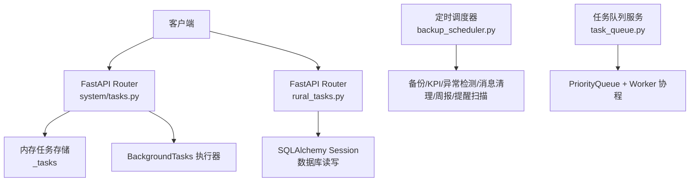
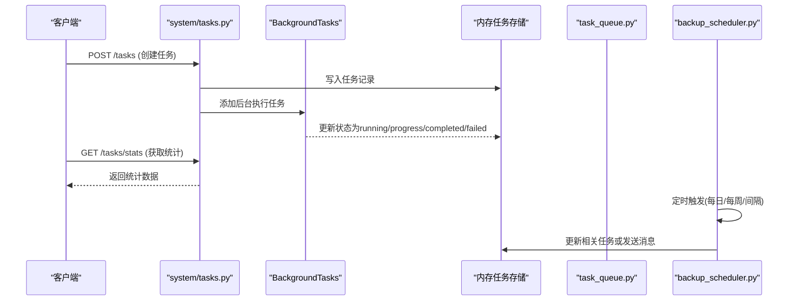
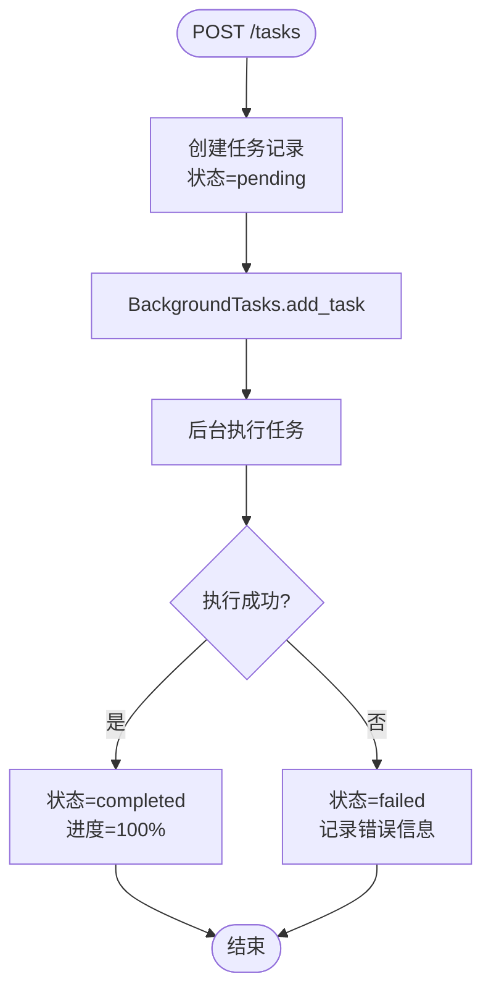
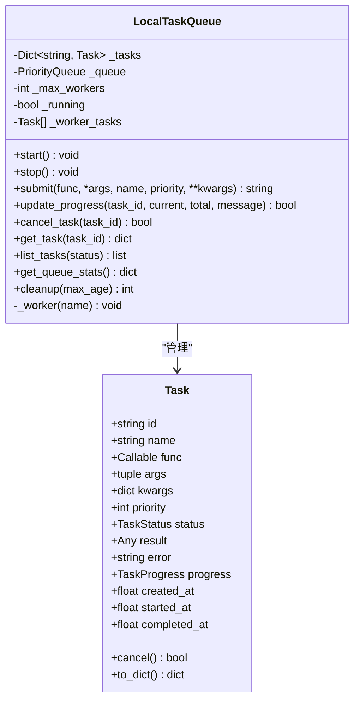
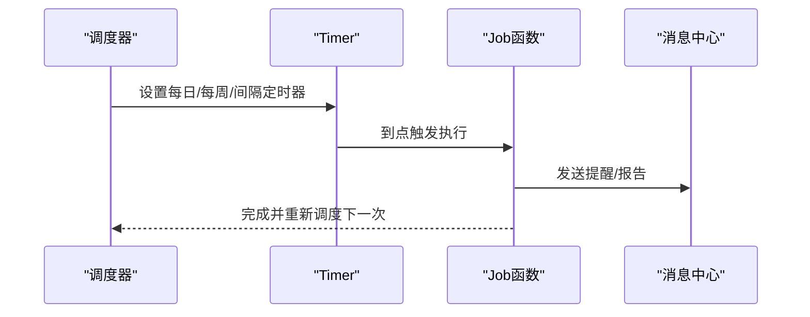
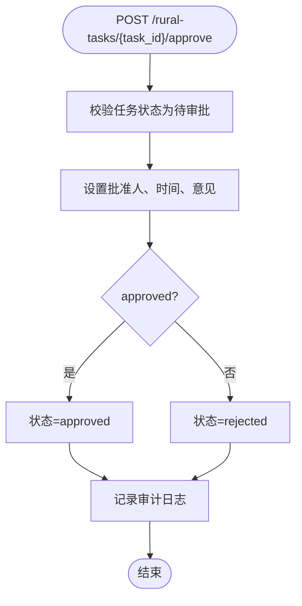
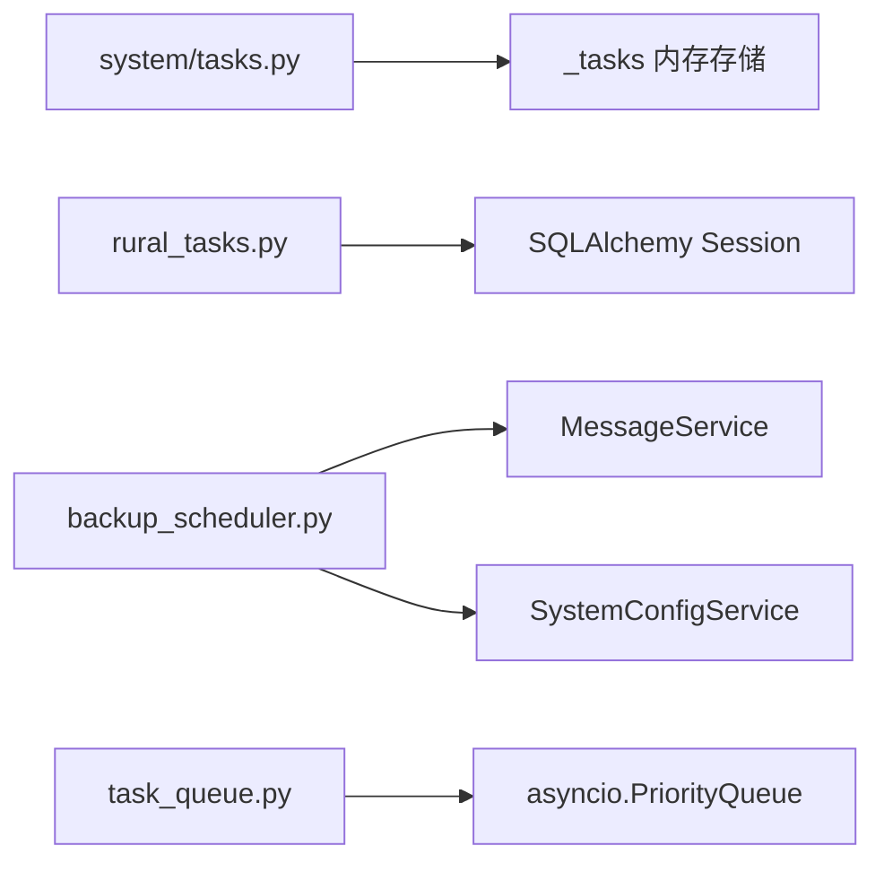

# 任务调度API

<cite>
**本文引用的文件**
- [backend/app/api/v1/system/tasks.py](file://backend/app/api/v1/system/tasks.py)
- [backend/app/services/task_queue.py](file://backend/app/services/task_queue.py)
- [backend/app/services/backup_scheduler.py](file://backend/app/services/backup_scheduler.py)
- [backend/app/api/v1/rural_tasks.py](file://backend/app/api/v1/rural_tasks.py)
- [backend/app/models/rural_task.py](file://backend/app/models/rural_task.py)
- [backend/app/schemas/rural_task.py](file://backend/app/schemas/rural_task.py)
</cite>

## 目录
1. [简介](#简介)
2. [项目结构](#项目结构)
3. [核心组件](#核心组件)
4. [架构总览](#架构总览)
5. [详细组件分析](#详细组件分析)
6. [依赖关系分析](#依赖关系分析)
7. [性能与并发控制](#性能与并发控制)
8. [故障处理与重试机制](#故障处理与重试机制)
9. [配置与环境](#配置与环境)
10. [使用示例](#使用示例)
11. [排错指南](#排错指南)
12. [结论](#结论)

## 简介
本文件面向“任务调度API”的完整技术文档，覆盖以下能力：
- 定时任务管理：系统级后台任务的创建、查询、统计、取消、删除。
- 任务执行监控：任务状态、进度、运行中数量等监控接口。
- 任务队列与并发：本地内存任务队列、优先级、工作协程并发度。
- 失败处理与重试：任务异常捕获、日志记录；周期性任务的重入保护与间隔控制。
- 批处理、周期性与事件驱动任务：提供批量删除、每日/每周/固定间隔调度、以及基于提醒扫描的事件驱动任务。
- 任务定义格式、执行环境、资源限制：统一的任务模型、异步执行环境、最大工作协程数等。

## 项目结构
与任务调度相关的后端代码主要分布在以下模块：
- 系统级后台任务API：位于 system/tasks.py，提供任务生命周期管理。
- 本地任务队列服务：位于 services/task_queue.py，提供优先级队列、并发worker、进度追踪。
- 定时调度服务：位于 services/backup_scheduler.py，实现每日/每周/固定间隔的定时任务。
- 乡村工作任务API：位于 api/v1/rural_tasks.py，提供CRUD、审批、批量操作。
- 数据模型与Schema：models/rural_task.py 与 schemas/rural_task.py，定义任务字段、枚举、校验规则。

图表来源
- [backend/app/api/v1/system/tasks.py:96-293](file://backend/app/api/v1/system/tasks.py#L96-L293)
- [backend/app/services/backup_scheduler.py:455-542](file://backend/app/services/backup_scheduler.py#L455-L542)
- [backend/app/services/task_queue.py:124-288](file://backend/app/services/task_queue.py#L124-L288)

章节来源
- [backend/app/api/v1/system/tasks.py:1-293](file://backend/app/api/v1/system/tasks.py#L1-L293)
- [backend/app/services/backup_scheduler.py:1-553](file://backend/app/services/backup_scheduler.py#L1-L553)
- [backend/app/services/task_queue.py:1-307](file://backend/app/services/task_queue.py#L1-L307)
- [backend/app/api/v1/rural_tasks.py:1-366](file://backend/app/api/v1/rural_tasks.py#L1-L366)
- [backend/app/models/rural_task.py:1-133](file://backend/app/models/rural_task.py#L1-L133)
- [backend/app/schemas/rural_task.py:1-130](file://backend/app/schemas/rural_task.py#L1-L130)

## 核心组件
- 系统后台任务API（system/tasks.py）
  - 提供任务列表、详情、统计、创建、取消、删除、运行中计数等接口。
  - 使用内存字典存储任务记录，支持按状态和类型筛选、分页。
- 本地任务队列（services/task_queue.py）
  - 提供优先级队列、异步worker、任务进度更新、取消、清理等功能。
  - 支持协程函数与同步函数的自动适配执行。
- 定时调度服务（services/backup_scheduler.py）
  - 基于 threading.Timer 实现每日、每周、固定间隔调度。
  - 包含KPI预计算、资金异常检测、自动备份、消息清理、待办提醒、周报、回收站保留策略、自动打包、提醒扫描等任务。
- 乡村工作任务API（api/v1/rural_tasks.py）
  - 提供任务CRUD、提交审批、批准/驳回、批量删除等接口。
  - 支持多条件过滤、排序、分页、审计留痕。
- 数据模型与Schema（models/rural_task.py, schemas/rural_task.py）
  - 定义任务分类、状态、优先级、时间、预算、责任人、附件等字段。
  - 提供Pydantic校验模型用于请求与响应。

章节来源
- [backend/app/api/v1/system/tasks.py:23-90](file://backend/app/api/v1/system/tasks.py#L23-L90)
- [backend/app/services/task_queue.py:20-122](file://backend/app/services/task_queue.py#L20-L122)
- [backend/app/services/backup_scheduler.py:60-453](file://backend/app/services/backup_scheduler.py#L60-L453)
- [backend/app/api/v1/rural_tasks.py:72-366](file://backend/app/api/v1/rural_tasks.py#L72-L366)
- [backend/app/models/rural_task.py:21-133](file://backend/app/models/rural_task.py#L21-L133)
- [backend/app/schemas/rural_task.py:9-130](file://backend/app/schemas/rural_task.py#L9-L130)

## 架构总览
系统采用分层设计：
- API层：FastAPI路由暴露HTTP接口，负责参数校验、权限检查、业务编排。
- 服务层：任务队列与调度服务封装执行逻辑，提供并发控制、重试与清理。
- 数据层：SQLAlchemy ORM访问数据库，持久化任务与业务实体。
- 调度层：基于线程定时器实现轻量级定时任务，避免引入重型调度框架。

图表来源
- [backend/app/api/v1/system/tasks.py:172-226](file://backend/app/api/v1/system/tasks.py#L172-L226)
- [backend/app/services/backup_scheduler.py:455-542](file://backend/app/services/backup_scheduler.py#L455-L542)

## 详细组件分析

### 系统后台任务API（system/tasks.py）
- 功能概览
  - 列表查询：支持按状态、类型筛选，分页返回。
  - 统计查询：按状态与类型统计数量与活跃任务数。
  - 任务详情：根据任务ID获取详细信息。
  - 创建任务：生成任务记录并启动后台执行，模拟进度推进。
  - 取消任务：仅允许取消pending或running状态的任务。
  - 删除任务：仅允许删除已完成、已失败或已取消的任务。
  - 运行中计数：返回当前running与pending的数量。
- HTTP方法与路径
  - GET /tasks：获取任务列表
  - GET /tasks/stats：获取任务统计
  - GET /tasks/{task_id}：获取任务详情
  - POST /tasks：创建后台任务
  - POST /tasks/{task_id}/cancel：取消任务
  - DELETE /tasks/{task_id}：删除任务记录
  - GET /tasks/running/count：获取运行中任务数
- 请求体与参数
  - 创建任务请求体包含：task_type、task_name、params。
  - 列表查询支持status、task_type、page、page_size。
- 错误处理
  - 任务不存在返回404。
  - 非法状态取消或删除返回400。
- 执行环境
  - 使用FastAPI BackgroundTasks在后台执行任务，模拟进度推进与结果写入。

图表来源
- [backend/app/api/v1/system/tasks.py:172-226](file://backend/app/api/v1/system/tasks.py#L172-L226)

章节来源
- [backend/app/api/v1/system/tasks.py:96-293](file://backend/app/api/v1/system/tasks.py#L96-L293)

### 本地任务队列（services/task_queue.py）
- 功能概览
  - 任务对象：包含id、name、func、args、kwargs、priority、status、result、error、progress、时间戳等。
  - 优先级：HIGH/NORMAL/LOW，数值越小优先级越高。
  - 进度追踪：current、total、message、updated_at，percent自动计算。
  - 队列管理：submit、list、get、cancel、cleanup、stats。
  - 并发执行：默认max_workers=3，使用PriorityQueue与asyncio worker协程。
- 关键方法
  - submit(func, *args, name, priority, **kwargs) -> task_id
  - update_progress(task_id, current, total, message)
  - cancel_task(task_id) -> bool
  - get_task(task_id) -> dict or None
  - list_tasks(status=None) -> list[dict]
  - get_queue_stats() -> dict
  - cleanup(max_age=3600) -> int
- 复杂度分析
  - 插入与出队：O(log n)（优先队列）。
  - 列表与统计：O(n)。
  - 清理：O(n)。
- 错误处理
  - 任务执行异常捕获并记录错误，状态置为failed。
  - 取消仅在pending或running状态有效。

图表来源
- [backend/app/services/task_queue.py:20-122](file://backend/app/services/task_queue.py#L20-L122)
- [backend/app/services/task_queue.py:124-288](file://backend/app/services/task_queue.py#L124-L288)

章节来源
- [backend/app/services/task_queue.py:1-307](file://backend/app/services/task_queue.py#L1-L307)

### 定时调度服务（services/backup_scheduler.py）
- 功能概览
  - 每日任务：KPI预计算、资金异常检测、自动备份、自动打包、消息清理、待办提醒、回收站保留策略。
  - 每周任务：工作周报生成。
  - 固定间隔任务：提醒扫描每6小时执行一次。
  - 调度方式：threading.Timer，支持每日、每周、固定间隔三种调度模式。
- 调度入口
  - start_backup_scheduler()：注册所有定时任务。
  - stop_backup_scheduler()：停止所有定时器。
- 任务执行
  - 每个job以独立事件循环执行，异常被捕获并记录日志。
  - 部分任务通过消息中心通知管理员或用户。
- 配置项
  - auto_backup_enabled、backup_interval_days、backup_retention_days、backup_target_dir、backup_encrypt、auto_package_enabled、auto_package_interval_months、auto_package_dir等。

图表来源
- [backend/app/services/backup_scheduler.py:455-542](file://backend/app/services/backup_scheduler.py#L455-L542)
- [backend/app/services/backup_scheduler.py:60-453](file://backend/app/services/backup_scheduler.py#L60-L453)

章节来源
- [backend/app/services/backup_scheduler.py:1-553](file://backend/app/services/backup_scheduler.py#L1-L553)

### 乡村工作任务API（api/v1/rural_tasks.py）
- 功能概览
  - CRUD：创建、读取、更新、删除任务。
  - 审批流程：提交审批、批准/驳回。
  - 批量操作：批量删除。
  - 过滤与排序：支持按工作ID、状态、分类、年度、帮扶村、关键词搜索，支持自定义排序字段与顺序。
  - 统计：按状态、分类统计，计算完成率与预算汇总。
- HTTP方法与路径
  - GET /rural-tasks：任务列表
  - GET /rural-tasks/statistics：任务统计
  - GET /rural-tasks/{task_id}：任务详情
  - POST /rural-tasks：创建任务
  - PUT /rural-tasks/{task_id}：更新任务
  - DELETE /rural-tasks/{task_id}：删除任务
  - POST /rural-tasks/{task_id}/submit：提交审批
  - POST /rural-tasks/{task_id}/approve：批准/驳回
  - POST /rural-tasks/batch-delete：批量删除
- 请求体与参数
  - 创建任务：rural_work_id、title、category、priority、year、quarter、description、target、budget、responsible_unit、responsible_person、contact_phone、planned_start、planned_end、village_id。
  - 提交审批：comment。
  - 批准/驳回：approved、comment。
  - 批量删除：ids数组。
- 权限控制
  - 非管理员仅能访问自己创建的任务。
  - 敏感操作（提交、批准）记录审计日志。

图表来源
- [backend/app/api/v1/rural_tasks.py:302-333](file://backend/app/api/v1/rural_tasks.py#L302-L333)

章节来源
- [backend/app/api/v1/rural_tasks.py:72-366](file://backend/app/api/v1/rural_tasks.py#L72-L366)
- [backend/app/schemas/rural_task.py:9-130](file://backend/app/schemas/rural_task.py#L9-L130)
- [backend/app/models/rural_task.py:21-133](file://backend/app/models/rural_task.py#L21-L133)

## 依赖关系分析
- API层依赖服务层：
  - system/tasks.py 依赖 FastAPI BackgroundTasks 与内存存储。
  - rural_tasks.py 依赖 SQLAlchemy Session、权限工具、审计服务。
- 服务层依赖数据层：
  - backup_scheduler.py 依赖数据库上下文、消息服务、配置服务。
  - task_queue.py 依赖 asyncio、logging、可选的Session（兼容包装器）。
- 外部集成：
  - 消息中心：用于备份提醒、异常检测提醒、待办提醒、周报推送。
  - 缓存服务：KPI预计算结果写入缓存。
  - 文件系统：备份目标目录、自动打包目标目录。

图表来源
- [backend/app/api/v1/system/tasks.py:67-90](file://backend/app/api/v1/system/tasks.py#L67-L90)
- [backend/app/api/v1/rural_tasks.py:11-26](file://backend/app/api/v1/rural_tasks.py#L11-L26)
- [backend/app/services/backup_scheduler.py:20-23](file://backend/app/services/backup_scheduler.py#L20-L23)
- [backend/app/services/task_queue.py:7-15](file://backend/app/services/task_queue.py#L7-L15)

章节来源
- [backend/app/api/v1/system/tasks.py:1-293](file://backend/app/api/v1/system/tasks.py#L1-L293)
- [backend/app/api/v1/rural_tasks.py:1-366](file://backend/app/api/v1/rural_tasks.py#L1-L366)
- [backend/app/services/backup_scheduler.py:1-553](file://backend/app/services/backup_scheduler.py#L1-L553)
- [backend/app/services/task_queue.py:1-307](file://backend/app/services/task_queue.py#L1-L307)

## 性能与并发控制
- 任务队列并发
  - 默认最大工作协程数为3，可通过LocalTaskQueue构造函数调整。
  - 使用PriorityQueue保证高优先级任务先执行。
- 定时任务并发
  - 每个定时任务在独立事件循环中执行，避免阻塞主调度器。
  - 定时器为daemon线程，进程退出时自动清理。
- 资源限制
  - 任务队列内存存储，适合单机场景；大规模需替换为分布式队列。
  - 备份与打包目标目录需确保可写，否则回退默认目录或跳过。
- 优化建议
  - 合理设置max_workers与清理阈值，避免内存增长。
  - 对长耗时任务拆分批次，提升响应性。
  - 定期清理已完成与失败任务，释放内存。

章节来源
- [backend/app/services/task_queue.py:127-141](file://backend/app/services/task_queue.py#L127-L141)
- [backend/app/services/task_queue.py:237-249](file://backend/app/services/task_queue.py#L237-L249)
- [backend/app/services/backup_scheduler.py:467-491](file://backend/app/services/backup_scheduler.py#L467-L491)

## 故障处理与重试机制
- 任务执行异常
  - 任务队列捕获异常并记录错误信息，状态置为failed。
  - 定时任务异常被捕获并记录日志，不影响其他任务调度。
- 重试策略
  - 当前实现未内置指数退避重试；可在调用方或服务层扩展重试逻辑。
  - 前端网络错误具备自动重试机制（测试用例可见），但后端任务调度未显式实现重试。
- 失败处理
  - 备份失败发送失败提醒消息给管理员。
  - 单项目异常检测失败不阻断其他项目，但记录警告日志。
- 取消与清理
  - 任务取消仅在pending或running状态有效。
  - 清理已完成、失败、取消且超过阈值的任务，防止内存泄漏。

章节来源
- [backend/app/services/task_queue.py:269-284](file://backend/app/services/task_queue.py#L269-L284)
- [backend/app/services/backup_scheduler.py:138-147](file://backend/app/services/backup_scheduler.py#L138-L147)
- [backend/app/services/backup_scheduler.py:190-193](file://backend/app/services/backup_scheduler.py#L190-L193)
- [backend/app/services/task_queue.py:94-101](file://backend/app/services/task_queue.py#L94-L101)

## 配置与环境
- 环境变量与系统配置
  - auto_backup_enabled：是否启用自动备份。
  - backup_interval_days：自动备份间隔天数。
  - backup_retention_days：备份保留天数。
  - backup_target_dir：备份目标目录。
  - backup_encrypt：是否加密备份。
  - auto_package_enabled：是否启用自动打包。
  - auto_package_interval_months：自动打包间隔月数。
  - auto_package_dir：自动打包目标目录。
- 执行环境
  - 定时任务使用Python标准库threading.Timer，无需额外依赖。
  - 任务队列使用asyncio，适用于异步I/O密集型任务。
- 安全与权限
  - 任务API需要认证用户，敏感操作记录审计日志。
  - 联系电话字段透明加密存储。

章节来源
- [backend/app/services/backup_scheduler.py:68-117](file://backend/app/services/backup_scheduler.py#L68-L117)
- [backend/app/services/backup_scheduler.py:369-438](file://backend/app/services/backup_scheduler.py#L369-L438)
- [backend/app/models/rural_task.py:96-96](file://backend/app/models/rural_task.py#L96-L96)

## 使用示例
- 批处理任务
  - 批量删除乡村工作任务：POST /rural-tasks/batch-delete，请求体{ids: [1,2,3]}。
  - 适用场景：清理历史任务、批量归档。
- 周期性任务
  - 每日任务：KPI预计算、资金异常检测、自动备份、消息清理、待办提醒、回收站保留策略。
  - 每周任务：工作周报生成。
  - 固定间隔任务：提醒扫描每6小时执行一次。
  - 配置方式：通过start_backup_scheduler()注册，无需手动调用。
- 事件驱动任务
  - 提醒扫描：基于审批超时、项目截止、预算预警等事件触发消息推送。
  - 任务提交与审批：提交后进入待审批状态，批准后进入进行中或完成。

章节来源
- [backend/app/api/v1/rural_tasks.py:336-366](file://backend/app/api/v1/rural_tasks.py#L336-L366)
- [backend/app/services/backup_scheduler.py:531-539](file://backend/app/services/backup_scheduler.py#L531-L539)
- [backend/app/services/backup_scheduler.py:355-364](file://backend/app/services/backup_scheduler.py#L355-L364)

## 排错指南
- 常见问题
  - 任务不存在：GET/DELETE/CANCEL任务时返回404，检查任务ID是否正确。
  - 非法状态操作：取消或删除非预期状态任务返回400，确认任务当前状态。
  - 备份失败：检查备份目标目录是否可写，磁盘空间是否充足。
  - 定时任务未执行：确认调度器已启动，定时器未被意外取消。
- 日志定位
  - 任务队列异常：查看任务队列日志，定位失败原因。
  - 定时任务异常：查看调度器日志，确认任务执行堆栈。
  - 消息发送失败：检查消息中心服务可用性。
- 恢复步骤
  - 清理过期任务：调用cleanup(max_age)释放内存。
  - 重启调度器：调用stop_backup_scheduler()再start_backup_scheduler()。
  - 重试任务：对于可重试任务，在调用方实现重试逻辑。

章节来源
- [backend/app/api/v1/system/tasks.py:229-276](file://backend/app/api/v1/system/tasks.py#L229-L276)
- [backend/app/services/backup_scheduler.py:545-552](file://backend/app/services/backup_scheduler.py#L545-L552)
- [backend/app/services/task_queue.py:237-249](file://backend/app/services/task_queue.py#L237-L249)

## 结论
本任务调度API提供了完整的后台任务管理能力，涵盖任务创建、监控、取消、删除、统计，以及本地任务队列的优先级与并发控制。定时调度服务实现了轻量级的每日、每周与固定间隔任务，满足系统自动化需求。乡村工作任务API提供了丰富的CRUD与审批流程，支持批量操作与审计留痕。整体架构简洁实用，适合单机部署与中小规模场景。未来可扩展分布式队列与更复杂的重试策略，以提升系统弹性与可靠性。