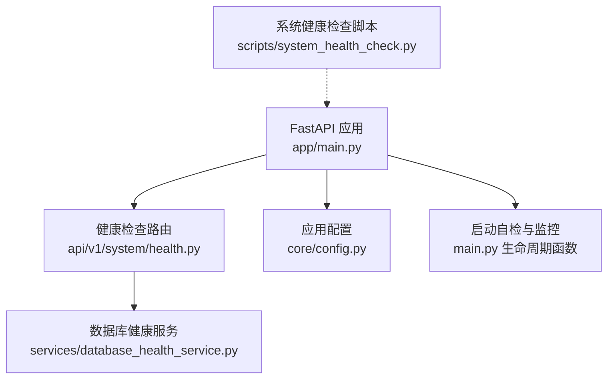
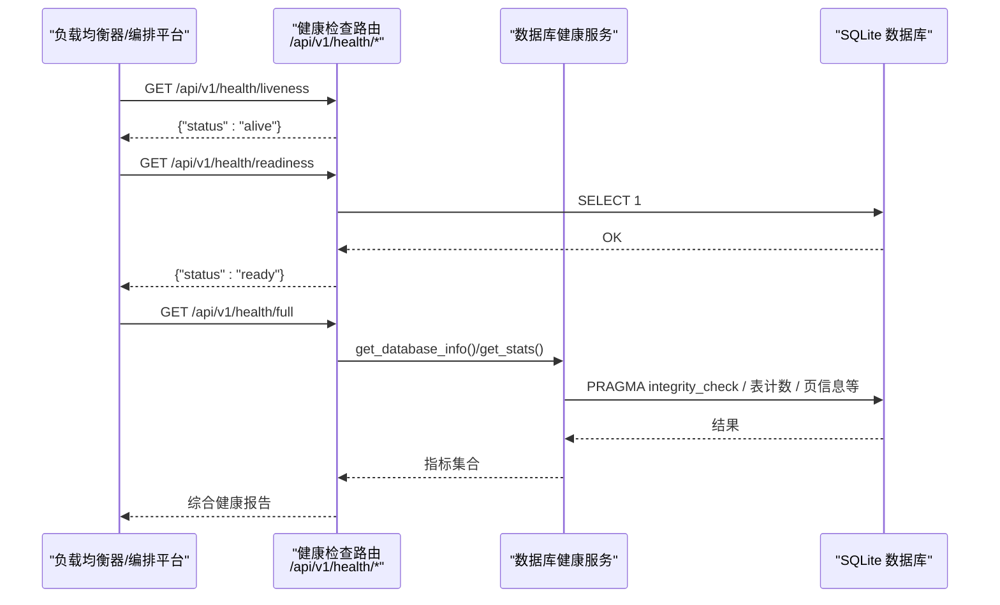
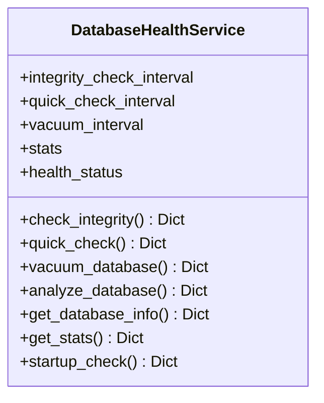
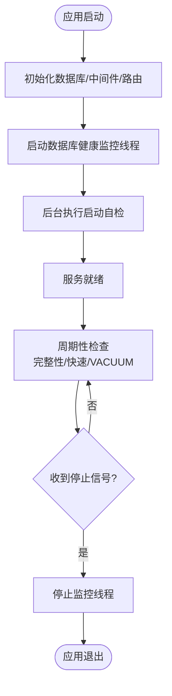
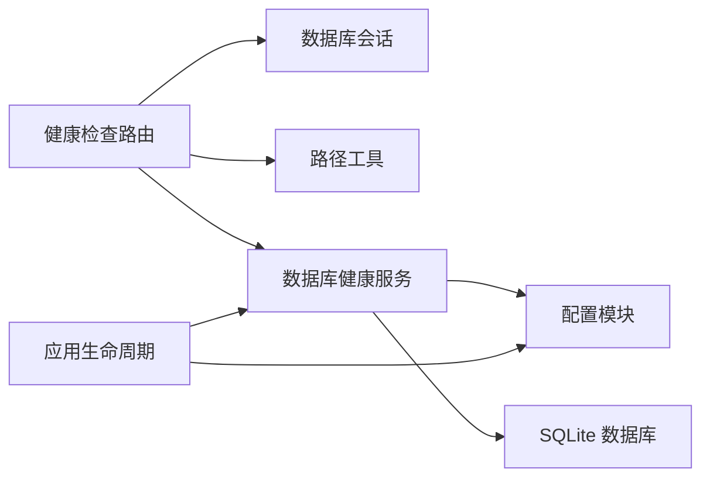

# 健康检查API

<cite>
**本文引用的文件**
- [backend/app/api/v1/system/health.py](file://backend/app/api/v1/system/health.py)
- [backend/app/services/database_health_service.py](file://backend/app/services/database_health_service.py)
- [backend/app/main.py](file://backend/app/main.py)
- [backend/app/core/config.py](file://backend/app/core/config.py)
- [backend/scripts/system_health_check.py](file://backend/scripts/system_health_check.py)
- [backend/tests/unit/test_system_health_api.py](file://backend/tests/unit/test_system_health_api.py)
- [backend/tests/unit/test_api_health_full.py](file://backend/tests/unit/test_api_health_full.py)
- [backend/tests/unit/test_db_startup_check.py](file://backend/tests/unit/test_db_startup_check.py)
</cite>

## 目录
1. [简介](#简介)
2. [项目结构](#项目结构)
3. [核心组件](#核心组件)
4. [架构总览](#架构总览)
5. [详细组件分析](#详细组件分析)
6. [依赖关系分析](#依赖关系分析)
7. [性能考虑](#性能考虑)
8. [故障排查指南](#故障排查指南)
9. [结论](#结论)
10. [附录](#附录)

## 简介
本文件面向运维与平台工程团队，系统化说明系统健康检查API的接口定义、分级标准（存活、就绪、详细状态）、数据库连接测试、依赖服务检查、启动自检流程，以及负载均衡器与容器编排平台的集成方式。文档同时给出自定义健康检查器的扩展方法，便于在现有体系上增加新的检查项。

## 项目结构
健康检查能力集中在后端模块中：
- API路由层：提供HTTP端点，统一返回格式
- 服务层：封装数据库健康检查、统计信息、监控循环等逻辑
- 应用生命周期：启动时注册并运行后台监控与自检任务
- 配置中心：控制是否启用健康检查及默认行为
- 脚本工具：提供离线环境下的系统健康检查脚本

**图表来源**
- [backend/app/main.py:68-97](file://backend/app/main.py#L68-L97)
- [backend/app/api/v1/system/health.py:1-167](file://backend/app/api/v1/system/health.py#L1-L167)
- [backend/app/services/database_health_service.py:16-413](file://backend/app/services/database_health_service.py#L16-L413)
- [backend/app/core/config.py:185-189](file://backend/app/core/config.py#L185-L189)
- [backend/scripts/system_health_check.py:21-221](file://backend/scripts/system_health_check.py#L21-L221)

**章节来源**
- [backend/app/main.py:68-97](file://backend/app/main.py#L68-L97)
- [backend/app/api/v1/system/health.py:1-167](file://backend/app/api/v1/system/health.py#L1-L167)
- [backend/app/services/database_health_service.py:16-413](file://backend/app/services/database_health_service.py#L16-L413)
- [backend/app/core/config.py:185-189](file://backend/app/core/config.py#L185-L189)
- [backend/scripts/system_health_check.py:21-221](file://backend/scripts/system_health_check.py#L21-L221)

## 核心组件
- 健康检查路由组：提供概览、数据库连通性、详细数据库健康、存活探针、就绪探针、综合报告等端点
- 数据库健康服务：负责SQLite完整性检查、快速检查、VACUUM优化、索引检查、统计信息收集与后台监控循环
- 应用生命周期：启动时开启数据库健康监控、执行一次启动自检、停止时优雅关闭监控线程
- 配置开关：通过配置项控制健康检查功能是否启用
- 系统健康检查脚本：用于部署前或离线环境的整体健康诊断

**章节来源**
- [backend/app/api/v1/system/health.py:20-167](file://backend/app/api/v1/system/health.py#L20-L167)
- [backend/app/services/database_health_service.py:16-413](file://backend/app/services/database_health_service.py#L16-L413)
- [backend/app/main.py:68-97](file://backend/app/main.py#L68-L97)
- [backend/app/core/config.py:185-189](file://backend/app/core/config.py#L185-L189)
- [backend/scripts/system_health_check.py:21-221](file://backend/scripts/system_health_check.py#L21-L221)

## 架构总览
健康检查请求从FastAPI路由进入，根据路径分发到具体处理器；部分处理器直接查询数据库，部分调用数据库健康服务获取更丰富的指标；应用启动时自动拉起后台监控线程，周期性执行完整性检查、快速检查与VACUUM优化。

**图表来源**
- [backend/app/api/v1/system/health.py:80-167](file://backend/app/api/v1/system/health.py#L80-L167)
- [backend/app/services/database_health_service.py:135-383](file://backend/app/services/database_health_service.py#L135-L383)

**章节来源**
- [backend/app/api/v1/system/health.py:80-167](file://backend/app/api/v1/system/health.py#L80-L167)
- [backend/app/services/database_health_service.py:135-383](file://backend/app/services/database_health_service.py#L135-L383)

## 详细组件分析

### 健康检查端点清单与响应格式
以下端点均位于路由前缀 /api/v1/health 下，统一以 code/data 包裹业务数据，异常时返回 code 与 message。

- GET /api/v1/health 或 /api/v1/health/overview
  - 作用：系统健康概览（进程运行时长、平台、Python版本、CPU核数）
  - 成功响应示例字段：code=200, data.status="healthy", data.uptime_seconds, data.platform, data.python_version, data.cpu_count
  - 失败：无（概览不访问外部资源）

- GET /api/v1/health/database
  - 作用：数据库连通性与大小检测
  - 成功响应字段：code=200, data.connected=True, data.size_bytes, data.size_mb
  - 失败：code=500, message=异常信息

- GET /api/v1/health/database-health
  - 作用：数据库健康详情（自检结果+统计），供前端提示
  - 成功响应字段：code=200, data.status, data.info, data.stats, data.issues
  - 失败：code=500, message=异常信息, data.status="error"

- GET /api/v1/health/liveness
  - 作用：Kubernetes 风格存活探针
  - 成功响应：{"status":"alive"}

- GET /api/v1/health/readiness
  - 作用：Kubernetes 风格就绪探针（检查数据库）
  - 成功响应：{"status":"ready"}
  - 失败响应：{"status":"not_ready"}

- GET /api/v1/health/full
  - 作用：综合健康报告（数据库统计、备份情况、系统资源、慢查询数量等）
  - 成功响应字段：code=200, data.timestamp, data.app_version, data.build_git_hash, data.build_time, data.python_version, data.platform, data.process_pid, data.db_size_mb, data.wal_size_kb, data.table_count, data.db_integrity_ok, data.total_backups, data.backup_total_size_mb, data.disk_free_gb, data.slow_queries_24h
  - 失败：各子项异常会被捕获并记录为对应字段（如 db_error）

注意：上述路径基于路由前缀 /api/v1/health。若部署网关或反向代理修改了前缀，请相应调整。

**章节来源**
- [backend/app/api/v1/system/health.py:20-167](file://backend/app/api/v1/system/health.py#L20-L167)
- [backend/tests/unit/test_system_health_api.py:21-97](file://backend/tests/unit/test_system_health_api.py#L21-L97)
- [backend/tests/unit/test_api_health_full.py:10-48](file://backend/tests/unit/test_api_health_full.py#L10-L48)

### 健康检查分级标准
- 存活（Liveness）：仅确认进程可响应，不依赖任何外部资源
  - 使用端点：GET /api/v1/health/liveness
  - 判定：返回 status=alive 即认为存活
- 就绪（Readiness）：确认关键依赖可用（当前实现检查数据库）
  - 使用端点：GET /api/v1/health/readiness
  - 判定：返回 status=ready 表示就绪；status=not_ready 表示不可用
- 详细状态（Full/Overview/Database-Health）：提供系统、数据库、备份、资源、慢查询等综合信息
  - 使用端点：GET /api/v1/health/full、/api/v1/health、/api/v1/health/database-health
  - 判定：由上层监控系统根据 data.* 字段进行评分或告警

**章节来源**
- [backend/app/api/v1/system/health.py:80-167](file://backend/app/api/v1/system/health.py#L80-L167)

### 依赖服务检查与数据库连接测试
- 数据库连通性：/api/v1/health/database 通过会话执行简单查询并读取数据库文件大小
- 数据库健康详情：/api/v1/health/database-health 调用数据库健康服务获取详细信息与统计
- 就绪探针：/api/v1/health/readiness 执行 SELECT 1 验证数据库可用性
- 综合报告：/api/v1/health/full 汇总数据库统计、备份数量与大小、磁盘空间、慢查询数量等

**章节来源**
- [backend/app/api/v1/system/health.py:37-167](file://backend/app/api/v1/system/health.py#L37-L167)
- [backend/app/services/database_health_service.py:333-383](file://backend/app/services/database_health_service.py#L333-L383)

### 检查项配置
- 健康检查开关：可通过配置项 HEALTH_CHECK_ENABLED 控制是否启用健康检查相关能力
- 数据库URL：DATABASE_URL 决定数据库位置；服务层会解析 SQLite URL 并定位数据库文件
- 监控间隔：数据库健康服务内部维护完整性检查、快速检查、VACUUM优化的周期（秒）
- 日志级别与输出：通过 LOG_LEVEL、LOG_FILE 等配置控制健康检查相关日志

**章节来源**
- [backend/app/core/config.py:80-104](file://backend/app/core/config.py#L80-L104)
- [backend/app/core/config.py:185-189](file://backend/app/core/config.py#L185-L189)
- [backend/app/services/database_health_service.py:26-46](file://backend/app/services/database_health_service.py#L26-L46)

### 自定义健康检查器的实现方法
可在现有体系内新增检查项，推荐做法：
- 在服务层新增检查方法：参考 DatabaseHealthService 的模式，封装检查逻辑、异常处理与统计更新
- 在路由层新增端点：复用统一返回格式 {code, data/message}，保持与既有端点一致
- 在启动流程中注册：如需后台定时检查，可参考 main.py 中的监控启动与停止模式
- 在配置中暴露开关：将新检查项纳入配置管理，便于按需启用

**图表来源**
- [backend/app/services/database_health_service.py:16-413](file://backend/app/services/database_health_service.py#L16-L413)

**章节来源**
- [backend/app/services/database_health_service.py:16-413](file://backend/app/services/database_health_service.py#L16-L413)
- [backend/app/api/v1/system/health.py:20-167](file://backend/app/api/v1/system/health.py#L20-L167)
- [backend/app/main.py:68-97](file://backend/app/main.py#L68-L97)

### 启动自检与后台监控
- 启动自检：应用启动后异步执行一次数据库快速检查，不阻塞主流程；异常被记录但不抛出
- 后台监控：启动独立守护线程，按周期执行完整性检查、快速检查与VACUUM优化；支持立即停止
- 停止流程：应用退出时优雅停止监控线程，确保资源释放

**图表来源**
- [backend/app/main.py:68-97](file://backend/app/main.py#L68-L97)
- [backend/app/main.py:800-812](file://backend/app/main.py#L800-L812)
- [backend/app/main.py:951-966](file://backend/app/main.py#L951-L966)
- [backend/app/services/database_health_service.py:80-134](file://backend/app/services/database_health_service.py#L80-L134)

**章节来源**
- [backend/app/main.py:68-97](file://backend/app/main.py#L68-L97)
- [backend/app/main.py:800-812](file://backend/app/main.py#L800-L812)
- [backend/app/main.py:951-966](file://backend/app/main.py#L951-L966)
- [backend/app/services/database_health_service.py:80-134](file://backend/app/services/database_health_service.py#L80-L134)

## 依赖关系分析
健康检查模块依赖关系如下：
- 路由层依赖数据库会话与路径工具
- 服务层依赖SQLite与配置模块
- 应用生命周期依赖服务层与配置
- 脚本工具独立于运行时，用于离线诊断

**图表来源**
- [backend/app/api/v1/system/health.py:1-167](file://backend/app/api/v1/system/health.py#L1-L167)
- [backend/app/services/database_health_service.py:16-413](file://backend/app/services/database_health_service.py#L16-L413)
- [backend/app/main.py:68-97](file://backend/app/main.py#L68-L97)

**章节来源**
- [backend/app/api/v1/system/health.py:1-167](file://backend/app/api/v1/system/health.py#L1-L167)
- [backend/app/services/database_health_service.py:16-413](file://backend/app/services/database_health_service.py#L16-L413)
- [backend/app/main.py:68-97](file://backend/app/main.py#L68-L97)

## 性能考虑
- 轻量级探针优先：liveness 与 readiness 应尽可能低开销，避免复杂计算
- 数据库操作最小化：readiness 仅执行简单查询；full 端点包含较多IO，建议降低轮询频率
- 后台监控周期可调：完整性检查、快速检查、VACUUM周期可按部署规模调整
- 异常隔离：各检查项异常被捕获并记录，不影响其他检查项与整体可用性
- 日志与指标：结合 MetricsMiddleware 与日志配置，观察健康检查对系统的影响

[本节为通用指导，无需特定文件引用]

## 故障排查指南
- 数据库不可用：检查 DATABASE_URL 与数据库文件权限；查看 /api/v1/health/readiness 与 /api/v1/health/database 响应
- 数据库损坏：通过 /api/v1/health/database-health 与 /api/v1/health/full 查看完整性检查结果与问题列表
- 启动自检失败：查看应用日志中“数据库启动自检”相关警告；必要时恢复最近备份
- 监控线程未停止：确认应用退出流程调用了停止监控函数；检查日志中“数据库健康监控已停止”
- 离线环境诊断：使用 system_health_check.py 脚本检查Python版本、依赖包、目录权限、端口占用等

**章节来源**
- [backend/app/api/v1/system/health.py:37-167](file://backend/app/api/v1/system/health.py#L37-L167)
- [backend/app/services/database_health_service.py:135-383](file://backend/app/services/database_health_service.py#L135-L383)
- [backend/app/main.py:951-966](file://backend/app/main.py#L951-L966)
- [backend/scripts/system_health_check.py:21-221](file://backend/scripts/system_health_check.py#L21-L221)

## 结论
本系统的健康检查API提供了分层级的健康探测能力：存活探针保障进程可达性，就绪探针验证关键依赖可用性，详细报告提供全面的系统与健康指标。配合启动自检与后台监控，能够在单机与容器化环境中稳定运行。通过配置开关与可扩展的服务层设计，可灵活添加新的检查项以满足不同场景需求。

[本节为总结性内容，无需特定文件引用]

## 附录

### 负载均衡器与容器编排平台集成示例
- Kubernetes Liveness Probe
  - 端点：GET /api/v1/health/liveness
  - 期望：返回 status=alive
  - 建议：短超时、频繁探测
- Kubernetes Readiness Probe
  - 端点：GET /api/v1/health/readiness
  - 期望：返回 status=ready
  - 建议：中等超时、关注数据库可用性
- 健康检查频率
  - liveness：每5-10秒
  - readiness：每10-30秒
  - full：每分钟或更低，避免高频IO

[本节为概念性配置指导，无需特定文件引用]

### 健康检查脚本使用
- 用途：部署前或离线环境下检查Python版本、依赖包、目录权限、数据库、环境变量、端口占用
- 执行：在项目根目录运行脚本，查看输出中的OK/WARN/ERROR信息
- 建议：在CI流水线中加入该脚本作为前置检查

**章节来源**
- [backend/scripts/system_health_check.py:21-221](file://backend/scripts/system_health_check.py#L21-L221)