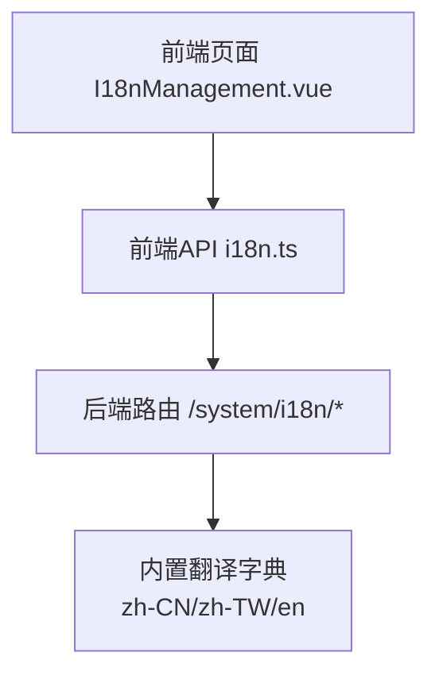
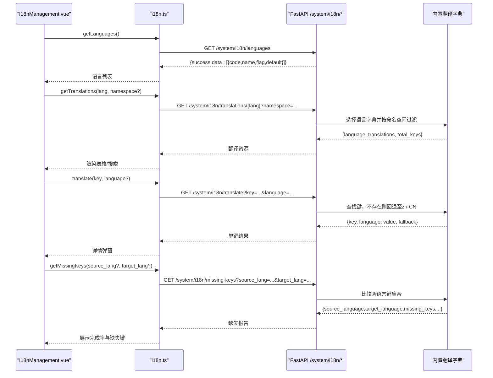
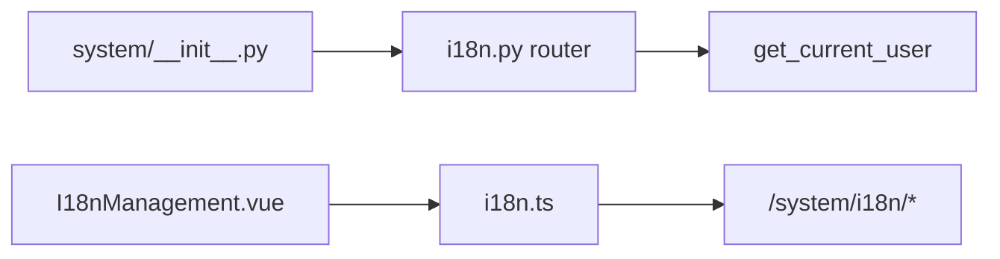

# 国际化管理API

<cite>
**本文引用的文件**
- [backend/app/api/v1/system/i18n.py](file://backend/app/api/v1/system/i18n.py)
- [frontend/src/api/i18n.ts](file://frontend/src/api/i18n.ts)
- [frontend/src/views/system/I18nManagement.vue](file://frontend/src/views/system/I18nManagement.vue)
- [backend/tests/unit/test_system_i18n_cov.py](file://backend/tests/unit/test_system_i18n_cov.py)
- [docs/03-开发文档/03-API文档/API接口文档.md](file://docs/03-开发文档/03-API文档/API接口文档.md)
</cite>

## 目录
1. [简介](#简介)
2. [项目结构](#项目结构)
3. [核心组件](#核心组件)
4. [架构总览](#架构总览)
5. [详细组件分析](#详细组件分析)
6. [依赖关系分析](#依赖关系分析)
7. [性能考虑](#性能考虑)
8. [故障排查指南](#故障排查指南)
9. [结论](#结论)
10. [附录](#附录)

## 简介
本文件面向“国际化管理”能力，系统化说明多语言包管理、翻译文本编辑、语言切换等接口的HTTP方法、URL路径与请求/响应格式；并基于现有实现，梳理翻译键值对的组织结构、命名空间筛选、回退策略、缺失键检测等关键流程。同时给出多语言应用在前端的集成方式与最佳实践建议。

## 项目结构
后端国际化API位于系统模块下的v1路由中，前端提供类型化API封装与管理界面。整体由以下部分组成：
- 后端路由与处理器：定义语言列表、翻译资源获取、单键翻译、缺失键检查、当前语言偏好等端点
- 前端API封装：将后端接口封装为TS函数，并提供类型定义
- 前端管理页面：可视化查看翻译资源、检查缺失键、查看详情等

图表来源
- [frontend/src/views/system/I18nManagement.vue:1-200](file://frontend/src/views/system/I18nManagement.vue#L1-L200)
- [frontend/src/api/i18n.ts:1-104](file://frontend/src/api/i18n.ts#L1-L104)
- [backend/app/api/v1/system/i18n.py:17-295](file://backend/app/api/v1/system/i18n.py#L17-L295)

章节来源
- [backend/app/api/v1/system/i18n.py:17-295](file://backend/app/api/v1/system/i18n.py#L17-L295)
- [frontend/src/api/i18n.ts:1-104](file://frontend/src/api/i18n.ts#L1-L104)
- [frontend/src/views/system/I18nManagement.vue:1-200](file://frontend/src/views/system/I18nManagement.vue#L1-L200)

## 核心组件
- 语言列表接口：返回系统支持的语言及默认语言标识
- 翻译资源接口：按语言或命名空间返回键值对集合
- 单键翻译接口：查询指定键在目标语言的翻译，支持回退到简体中文
- 缺失键检查接口：对比源语言和目标语言的键集合，计算完成率
- 当前语言偏好接口：返回当前用户的语言设置（可扩展为用户配置）

章节来源
- [backend/app/api/v1/system/i18n.py:171-295](file://backend/app/api/v1/system/i18n.py#L171-L295)
- [frontend/src/api/i18n.ts:53-104](file://frontend/src/api/i18n.ts#L53-L104)

## 架构总览
下图展示了从前端到后端的调用链路，以及各端点的职责分工。

图表来源
- [frontend/src/views/system/I18nManagement.vue:1-200](file://frontend/src/views/system/I18nManagement.vue#L1-L200)
- [frontend/src/api/i18n.ts:53-104](file://frontend/src/api/i18n.ts#L53-L104)
- [backend/app/api/v1/system/i18n.py:171-295](file://backend/app/api/v1/system/i18n.py#L171-L295)

## 详细组件分析

### 1) 语言列表接口
- HTTP方法与路径
  - GET /system/i18n/languages
- 功能说明
  - 返回系统支持的语言列表，包含语言代码、名称、旗帜标识与是否默认
- 请求参数
  - 无
- 响应数据
  - success: boolean
  - data: Array<{ code: string; name: string; flag: string; default: boolean }>
- 鉴权
  - 公开或登录均可访问（根据业务策略）
- 错误处理
  - 正常情况返回成功；若扩展为动态加载语言时可能返回未找到等错误码

章节来源
- [backend/app/api/v1/system/i18n.py:171-181](file://backend/app/api/v1/system/i18n.py#L171-L181)
- [frontend/src/api/i18n.ts:53-59](file://frontend/src/api/i18n.ts#L53-L59)
- [docs/03-开发文档/03-API文档/API接口文档.md:1060-1068](file://docs/03-开发文档/03-API文档/API接口文档.md#L1060-L1068)

### 2) 翻译资源接口
- HTTP方法与路径
  - GET /system/i18n/translations/{language}?namespace={namespace}
- 功能说明
  - 获取指定语言的完整翻译资源，或按命名空间前缀筛选（如 nav、action、status）
- 请求参数
  - language: 字符串，如 zh-CN、zh-TW、en
  - namespace: 可选，用于过滤以该命名空间开头的键
- 响应数据
  - success: boolean
  - data: {
      language: string,
      translations: Record<string, string>,
      total_keys: number
    }
- 鉴权
  - 公开或登录均可访问
- 错误处理
  - 不支持的语言返回400错误

章节来源
- [backend/app/api/v1/system/i18n.py:184-212](file://backend/app/api/v1/system/i18n.py#L184-L212)
- [frontend/src/api/i18n.ts:61-67](file://frontend/src/api/i18n.ts#L61-L67)
- [backend/tests/unit/test_system_i18n_cov.py:23-41](file://backend/tests/unit/test_system_i18n_cov.py#L23-L41)

### 3) 单键翻译接口
- HTTP方法与路径
  - GET /system/i18n/translate?key={key}&language={language}
- 功能说明
  - 查询指定键在目标语言的翻译；若目标语言不存在该键，则回退到简体中文；仍不存在则返回键本身
- 请求参数
  - key: 必填，翻译键
  - language: 可选，默认zh-CN
- 响应数据
  - success: boolean
  - data: {
      key: string,
      language: string,
      value: string,
      fallback: boolean
    }
- 鉴权
  - 公开或登录均可访问
- 错误处理
  - 不支持的语言返回400错误

章节来源
- [backend/app/api/v1/system/i18n.py:215-245](file://backend/app/api/v1/system/i18n.py#L215-L245)
- [frontend/src/api/i18n.ts:69-75](file://frontend/src/api/i18n.ts#L69-L75)
- [backend/tests/unit/test_system_i18n_cov.py:44-59](file://backend/tests/unit/test_system_i18n_cov.py#L44-L59)

### 4) 缺失键检查接口
- HTTP方法与路径
  - GET /system/i18n/missing-keys?source_lang={source_lang}&target_lang={target_lang}
- 功能说明
  - 比较源语言与目标语言的键集合，输出缺失键、多余键、完成率等统计信息
- 请求参数
  - source_lang: 可选，默认zh-CN
  - target_lang: 可选，默认en
- 响应数据
  - success: boolean
  - data: {
      source_language: string,
      target_language: string,
      source_count: number,
      target_count: number,
      missing_keys: string[],
      missing_count: number,
      extra_keys: string[],
      completion_rate: number
    }
- 鉴权
  - 需要登录（依赖当前用户）
- 错误处理
  - 不支持的语言返回400错误

章节来源
- [backend/app/api/v1/system/i18n.py:248-282](file://backend/app/api/v1/system/i18n.py#L248-L282)
- [frontend/src/api/i18n.ts:77-86](file://frontend/src/api/i18n.ts#L77-L86)
- [backend/tests/unit/test_system_i18n_cov.py:62-75](file://backend/tests/unit/test_system_i18n_cov.py#L62-L75)

### 5) 当前语言偏好接口
- HTTP方法与路径
  - GET /system/i18n/current
- 功能说明
  - 返回当前用户的语言设置（可后续扩展为读取用户配置）
- 请求参数
  - 无
- 响应数据
  - success: boolean
  - data: { language: string; name: string }
- 鉴权
  - 需要登录（依赖当前用户）

章节来源
- [backend/app/api/v1/system/i18n.py:285-295](file://backend/app/api/v1/system/i18n.py#L285-L295)
- [frontend/src/api/i18n.ts:88-94](file://frontend/src/api/i18n.ts#L88-L94)

### 6) 前端集成与管理界面
- 前端API封装
  - 提供类型化的函数：getLanguages、getTranslations、translateKey、getMissingKeys、getCurrentLanguage
  - 统一通过GET请求调用后端/system/i18n/*接口
- 管理界面
  - 显示当前语言、语言列表选择、刷新翻译资源、检查缺失键、查看翻译详情
  - 支持搜索翻译键或值，展示状态标签（已翻译/缺失）

章节来源
- [frontend/src/api/i18n.ts:1-104](file://frontend/src/api/i18n.ts#L1-L104)
- [frontend/src/views/system/I18nManagement.vue:1-200](file://frontend/src/views/system/I18nManagement.vue#L1-L200)

## 依赖关系分析
- 后端路由注册
  - 系统模块路由聚合器引入i18n路由，挂载到/system/i18n前缀
- 安全依赖
  - 部分接口使用get_current_user进行鉴权（如缺失键检查、当前语言偏好）
- 前端依赖
  - 管理页面依赖i18n.ts提供的API函数，并通过Element Plus组件渲染

图表来源
- [backend/app/api/v1/system/__init__.py:15-115](file://backend/app/api/v1/system/__init__.py#L15-L115)
- [backend/app/api/v1/system/i18n.py:17-295](file://backend/app/api/v1/system/i18n.py#L17-L295)
- [frontend/src/views/system/I18nManagement.vue:1-200](file://frontend/src/views/system/I18nManagement.vue#L1-L200)
- [frontend/src/api/i18n.ts:1-104](file://frontend/src/api/i18n.ts#L1-L104)

章节来源
- [backend/app/api/v1/system/__init__.py:15-115](file://backend/app/api/v1/system/__init__.py#L15-L115)
- [backend/app/api/v1/system/i18n.py:17-295](file://backend/app/api/v1/system/i18n.py#L17-L295)

## 性能考虑
- 命名空间筛选
  - 通过namespace参数仅返回特定命名空间的键，减少传输体积，提升前端渲染性能
- 单键翻译
  - 按需查询单个键，避免全量加载；结合缓存策略可减少重复请求
- 缺失键检查
  - 服务端计算缺失键与完成率，前端直接展示，降低前端计算开销
- 回退机制
  - 当目标语言缺失键时自动回退到简体中文，保证用户体验一致性

[本节为通用性能建议，不直接分析具体文件]

## 故障排查指南
- 不支持的语言
  - 现象：调用翻译资源或单键翻译时返回400错误
  - 原因：传入的language不在支持列表中
  - 处理：校验language参数，确保为zh-CN、zh-TW或en
- 缺失键导致回退
  - 现象：单键翻译返回fallback=true且value等于key
  - 原因：目标语言缺少该键，回退到简体中文后仍不存在
  - 处理：补充对应键的翻译，或使用缺失键检查接口定位问题
- 鉴权失败
  - 现象：缺失键检查或当前语言偏好接口鉴权失败
  - 原因：未登录或权限不足
  - 处理：确保携带有效会话令牌后再调用

章节来源
- [backend/app/api/v1/system/i18n.py:196-197](file://backend/app/api/v1/system/i18n.py#L196-L197)
- [backend/app/api/v1/system/i18n.py:227-228](file://backend/app/api/v1/system/i18n.py#L227-L228)
- [backend/app/api/v1/system/i18n.py:261-262](file://backend/app/api/v1/system/i18n.py#L261-L262)
- [backend/tests/unit/test_system_i18n_cov.py:37-41](file://backend/tests/unit/test_system_i18n_cov.py#L37-L41)
- [backend/tests/unit/test_system_i18n_cov.py:56-59](file://backend/tests/unit/test_system_i18n_cov.py#L56-L59)
- [backend/tests/unit/test_system_i18n_cov.py:71-75](file://backend/tests/unit/test_system_i18n_cov.py#L71-L75)

## 结论
当前国际化管理API提供了完整的语言列表、翻译资源获取、单键翻译、缺失键检查与当前语言偏好能力。键值采用“命名空间.键名”的结构组织，支持按命名空间筛选；翻译缺失时具备回退到简体中文的策略；缺失键检查接口帮助快速定位翻译覆盖缺口。前端通过类型化API封装与管理界面，实现了可视化的多语言资源管理与维护。

[本节为总结性内容，不直接分析具体文件]

## 附录

### A. 翻译键值组织结构
- 命名空间
  - app、nav、action、status、message、validation、label等
- 键名约定
  - 使用点号分隔的层级结构，便于分组与筛选
- 上下文信息
  - 当前实现通过命名空间表达上下文；如需更细粒度上下文，可在命名空间下进一步细分键名
- 复数形式处理
  - 当前实现未内置复数规则；可通过在键名中区分单复数（如 item.count、item.counts）或在业务层扩展

章节来源
- [backend/app/api/v1/system/i18n.py:23-157](file://backend/app/api/v1/system/i18n.py#L23-L157)

### B. 翻译资源导入导出与版本控制
- 导入导出
  - 当前API未提供直接的导入/导出端点；可通过get_translations获取JSON格式的键值对，手动保存为文件；更新后通过新增语言字典或扩展服务实现动态加载
- 版本控制
  - 当前API未内置语言包版本管理；可在上层服务增加版本字段与变更日志，结合缺失键检查进行发布前验证
- 动态语言加载
  - 当前语言字典为内置常量；可扩展为从数据库或文件系统加载，并在运行时热更新

[本节为扩展建议，不直接分析具体文件]

### C. 多语言应用集成与最佳实践
- 前端集成
  - 使用i18n.ts提供的API函数进行语言列表获取、翻译资源加载与单键翻译
  - 管理页面支持搜索、筛选与缺失键检查，便于日常维护
- 最佳实践
  - 使用命名空间组织键，保持语义清晰
  - 优先使用命名空间筛选减少数据传输
  - 利用缺失键检查接口在发布前确保翻译覆盖率
  - 对单键翻译结果进行缓存，减少重复请求
  - 对回退场景进行提示，引导补充翻译

章节来源
- [frontend/src/api/i18n.ts:1-104](file://frontend/src/api/i18n.ts#L1-L104)
- [frontend/src/views/system/I18nManagement.vue:1-200](file://frontend/src/views/system/I18nManagement.vue#L1-L200)