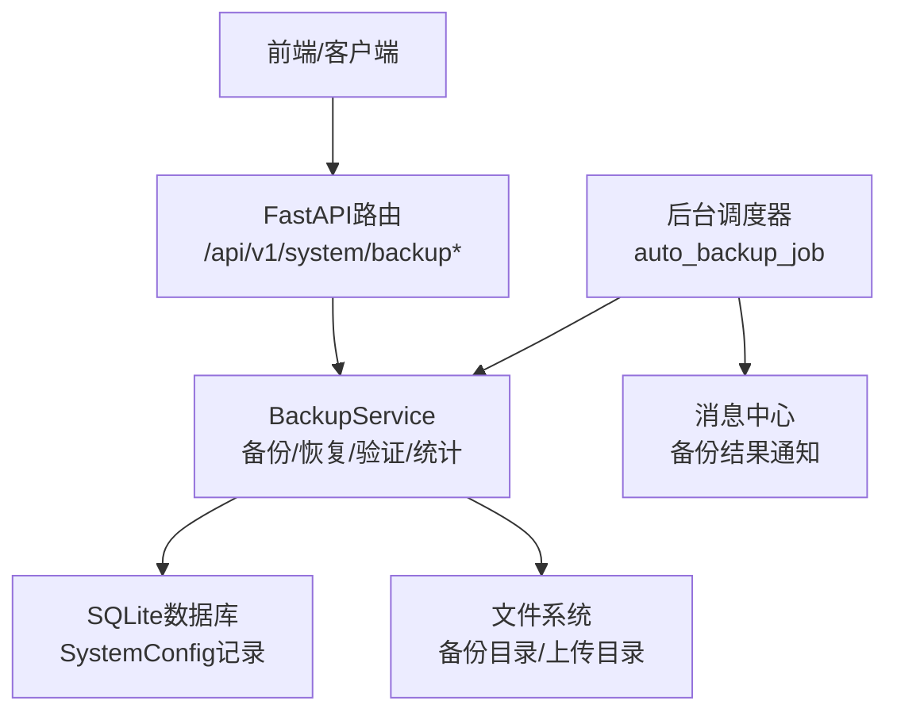
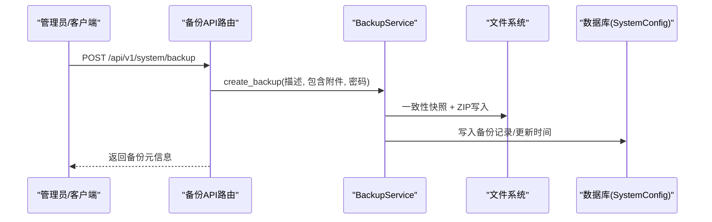
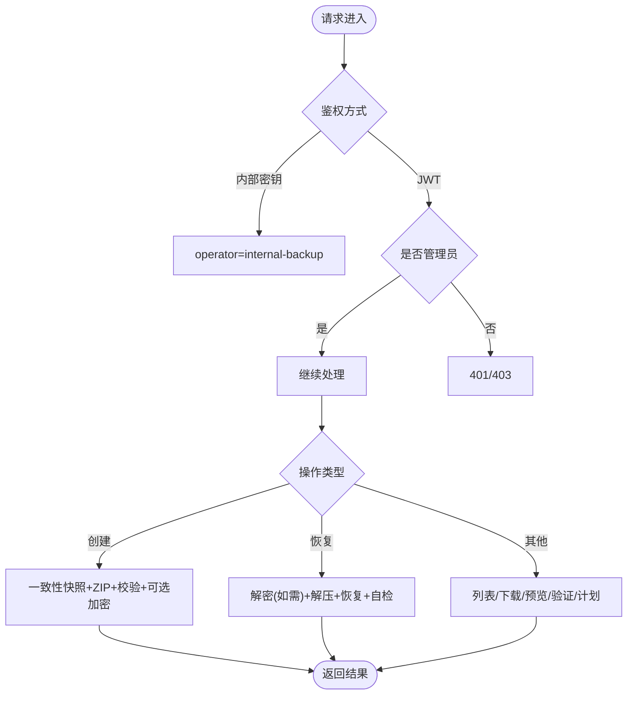
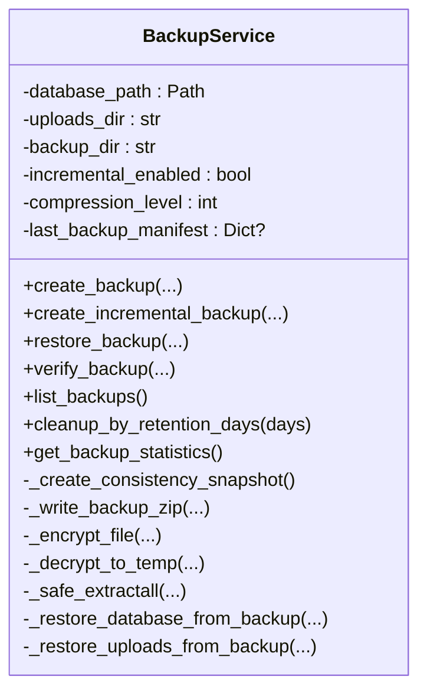
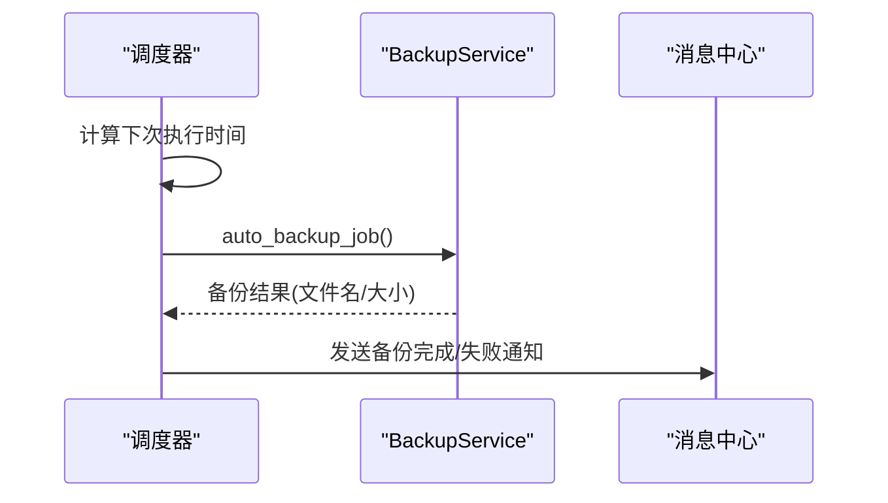
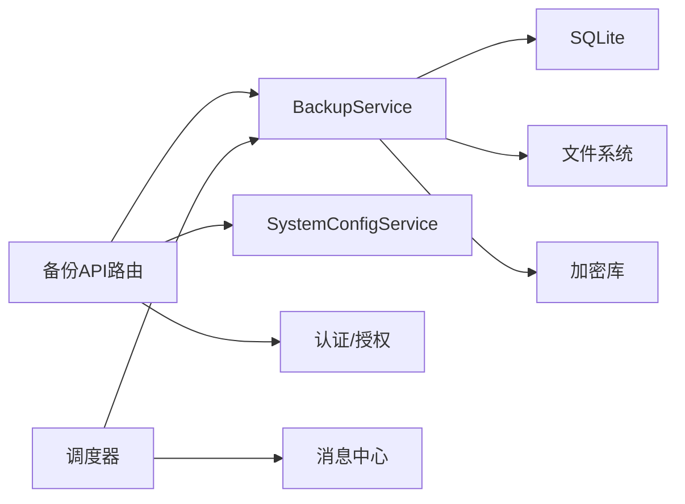

# 备份恢复API

<cite>
**本文引用的文件**
- [backend/app/api/v1/system/backup.py](file://backend/app/api/v1/system/backup.py)
- [backend/app/services/backup_service.py](file://backend/app/services/backup_service.py)
- [backend/app/services/backup_scheduler.py](file://backend/app/services/backup_scheduler.py)
- [backend/app/api/v1/system/admin.py](file://backend/app/api/v1/system/admin.py)
- [docs/02-用户手册/备份管理操作说明.md](file://docs/02-用户手册/备份管理操作说明.md)
</cite>

## 目录
1. [简介](#简介)
2. [项目结构](#项目结构)
3. [核心组件](#核心组件)
4. [架构总览](#架构总览)
5. [详细组件分析](#详细组件分析)
6. [依赖关系分析](#依赖关系分析)
7. [性能与容量规划](#性能与容量规划)
8. [故障排查指南](#故障排查指南)
9. [结论](#结论)
10. [附录：接口规范与调用示例](#附录接口规范与调用示例)

## 简介
本文件面向系统管理员与集成方，提供“备份恢复API”的完整技术文档。内容覆盖数据库备份、文件（上传附件）备份、增量备份、全量备份、加密、压缩、存储策略、定时调度、存储空间管理与灾难恢复流程等。同时给出跨环境迁移、数据迁移与跨环境同步的典型调用场景与注意事项。

## 项目结构
备份能力由三层构成：
- API层：暴露HTTP端点，负责鉴权、参数校验、路径安全与响应封装。
- 服务层：实现备份/恢复的核心逻辑（一致性快照、ZIP打包、加密解密、增量差异、清理策略）。
- 调度层：基于线程定时器按配置周期执行自动备份与保留期清理，并推送消息通知。

图表来源
- [backend/app/api/v1/system/backup.py:173-231](file://backend/app/api/v1/system/backup.py#L173-L231)
- [backend/app/services/backup_service.py:319-395](file://backend/app/services/backup_service.py#L319-L395)
- [backend/app/services/backup_scheduler.py:60-148](file://backend/app/services/backup_scheduler.py#L60-L148)

章节来源
- [backend/app/api/v1/system/backup.py:1-800](file://backend/app/api/v1/system/backup.py#L1-L800)
- [backend/app/services/backup_service.py:1-1149](file://backend/app/services/backup_service.py#L1-L1149)
- [backend/app/services/backup_scheduler.py:1-553](file://backend/app/services/backup_scheduler.py#L1-L553)

## 核心组件
- 备份API路由：提供创建、列表、下载、预览、验证、恢复、上传恢复、目标目录设置、计划配置等端点。
- 备份服务：实现一致性快照、ZIP打包、AES-256(Fernet)加密、增量备份、完整性校验、空间预检、恢复回滚与清理。
- 调度器：按配置每日定时触发自动备份、保留期清理、数据库维护、提醒扫描等任务，并向管理员推送站内消息。
- 兼容接口：admin模块提供历史风格的简单备份/恢复接口（直接复制db），与新备份体系并存但功能更基础。

章节来源
- [backend/app/api/v1/system/backup.py:173-800](file://backend/app/api/v1/system/backup.py#L173-L800)
- [backend/app/services/backup_service.py:319-1149](file://backend/app/services/backup_service.py#L319-L1149)
- [backend/app/services/backup_scheduler.py:60-553](file://backend/app/services/backup_scheduler.py#L60-L553)
- [backend/app/api/v1/system/admin.py:95-216](file://backend/app/api/v1/system/admin.py#L95-L216)

## 架构总览
备份恢复的关键流程如下：
- 创建备份：鉴权 → 解析目标目录 → 一致性快照 → ZIP打包（含数据库与可选上传文件）→ 完整性校验 → 可选加密 → 持久化记录与时间戳。
- 恢复备份：鉴权 → 定位备份文件 → 检测是否加密并解密到临时文件 → 解压 → 数据库与上传文件恢复 → 完整性自检 → 清理临时与快照。
- 增量备份：对比上次清单与当前文件哈希，仅打包变更文件；若未启用或无变更则跳过或降级为全量。
- 定时调度：读取系统配置（开关、Cron、保留天数、目标目录、加密开关），周期性执行自动备份与清理，失败时发送站内消息。

图表来源
- [backend/app/api/v1/system/backup.py:173-231](file://backend/app/api/v1/system/backup.py#L173-L231)
- [backend/app/services/backup_service.py:319-395](file://backend/app/services/backup_service.py#L319-L395)

章节来源
- [backend/app/api/v1/system/backup.py:173-231](file://backend/app/api/v1/system/backup.py#L173-L231)
- [backend/app/services/backup_service.py:319-395](file://backend/app/services/backup_service.py#L319-L395)

## 详细组件分析

### 备份API路由（/api/v1/system/backup*）
- 创建备份：支持选择目标目录、是否包含上传文件、可选AES加密；内部通道（Electron）通过X-Internal-Backup密钥免JWT调用。
- 列表/统计：列出备份、统计总数/大小/类型分布、最近/最早备份时间、调度状态。
- 下载/预览/验证：管理员权限访问；预览返回ZIP内清单与元信息；验证检查ZIP完整性与数据库可打开性。
- 恢复：支持从已有备份恢复或上传ZIP立即恢复；对加密包要求密码（自动兜底运行时密钥）。
- 目标目录与计划：设置备份目标盘符/路径；查询/更新自动备份开关、Cron表达式、保留数量。

图表来源
- [backend/app/api/v1/system/backup.py:98-167](file://backend/app/api/v1/system/backup.py#L98-L167)
- [backend/app/api/v1/system/backup.py:173-800](file://backend/app/api/v1/system/backup.py#L173-L800)

章节来源
- [backend/app/api/v1/system/backup.py:98-800](file://backend/app/api/v1/system/backup.py#L98-L800)

### 备份服务（BackupService）
- 一致性快照：优先使用SQLite Backup API生成一致快照，失败回退WAL checkpoint+裸拷贝。
- 打包与校验：ZIP_DEFLATED压缩；强制包含数据库文件，否则视为失败并删除半成品。
- 加密：PBKDF2派生密钥+Fernet对称加密；文件头标记用于识别加密格式；恢复时解密到临时文件避免破坏原包。
- 增量备份：维护last_manifest.json，比较当前文件哈希，仅打包变更文件；未启用或无变更则跳过/降级。
- 恢复流程：解压前进行zip slip防护；恢复数据库后执行PRAGMA integrity_check；失败回滚到快照；清理临时文件。
- 空间与清理：备份前磁盘空间预检（默认≥500MB）；按保留天数或数量清理旧备份。

图表来源
- [backend/app/services/backup_service.py:74-1149](file://backend/app/services/backup_service.py#L74-L1149)

章节来源
- [backend/app/services/backup_service.py:74-1149](file://backend/app/services/backup_service.py#L74-L1149)

### 定时调度（backup_scheduler）
- 自动备份：每日02:00触发；读取auto_backup开关、backup_interval_days间隔保护、backup_target_dir、backup_encrypt；必要时使用运行时密钥加密。
- 保留期清理：按backup_retention_days清理过期备份。
- 其他任务：KPI预计算、异常检测、待办提醒、周报、消息清理、回收站清理、数据库维护等。
- 通知：成功/失败均向管理员发送站内消息。

图表来源
- [backend/app/services/backup_scheduler.py:60-148](file://backend/app/services/backup_scheduler.py#L60-L148)

章节来源
- [backend/app/services/backup_scheduler.py:60-553](file://backend/app/services/backup_scheduler.py#L60-L553)

### 兼容接口（admin模块）
- 提供简单的数据库备份/恢复/删除接口（直接复制.db），适用于轻量场景或与旧前端兼容。
- 注意：该接口不生成ZIP、不支持加密与增量，建议优先使用新的备份API。

章节来源
- [backend/app/api/v1/system/admin.py:95-216](file://backend/app/api/v1/system/admin.py#L95-L216)

## 依赖关系分析
- API路由依赖：
  - 鉴权：JWT管理员或内部密钥通道。
  - 服务：BackupService（通过工厂函数获取实例）。
  - 配置：SystemConfigService读写备份相关配置。
- 服务依赖：
  - SQLite：一致性快照、完整性检查。
  - 文件系统：ZIP打包/解压、临时文件、备份目录。
  - 加密：cryptography库（PBKDF2+Fernet）。
- 调度依赖：
  - 配置：auto_backup、backup_retention_days、backup_schedule_cron、backup_target_dir、backup_encrypt。
  - 消息：MessageService发送备份结果通知。

图表来源
- [backend/app/api/v1/system/backup.py:173-800](file://backend/app/api/v1/system/backup.py#L173-L800)
- [backend/app/services/backup_service.py:319-1149](file://backend/app/services/backup_service.py#L319-L1149)
- [backend/app/services/backup_scheduler.py:60-148](file://backend/app/services/backup_scheduler.py#L60-L148)

章节来源
- [backend/app/api/v1/system/backup.py:173-800](file://backend/app/api/v1/system/backup.py#L173-L800)
- [backend/app/services/backup_service.py:319-1149](file://backend/app/services/backup_service.py#L319-L1149)
- [backend/app/services/backup_scheduler.py:60-148](file://backend/app/services/backup_scheduler.py#L60-L148)

## 性能与容量规划
- 压缩算法：ZIP_DEFLATED，压缩级别可通过环境变量配置（默认6）。
- 一致性快照：优先SQLite Backup API，失败回退WAL checkpoint+拷贝，保证备份一致性。
- 空间阈值：备份/上传恢复前检查剩余空间（默认≥500MB），不足则拒绝以避免写出损坏文件。
- 增量备份：通过哈希比对仅备份变更文件，减少IO与存储占用；未启用或无变更时跳过。
- 恢复性能：先释放连接池、独占写窗口、恢复后再次释放，确保数据库句柄正确切换。
- 传输协议：HTTP REST（JSON/表单/流式上传），下载为application/zip。

章节来源
- [backend/app/services/backup_service.py:216-395](file://backend/app/services/backup_service.py#L216-L395)
- [backend/app/api/v1/system/backup.py:706-800](file://backend/app/api/v1/system/backup.py#L706-L800)

## 故障排查指南
- 备份失败（完整性校验未通过）：检查数据库路径解析、WAL状态、磁盘空间；查看日志中“备份不完整被中止”提示。
- 恢复失败（密码错误或文件损坏）：确认是否为加密备份并提供正确密码；查看“密码错误或备份文件已损坏”日志。
- 路径穿越/越权访问：所有涉及文件路径的接口均做realpath校验，出现403请检查传入文件名与目标目录。
- 自动备份未执行：检查auto_backup开关、backup_interval_days间隔、目标目录可写性；查看调度器日志。
- 磁盘空间不足：备份/上传恢复前会预检，若不足需扩容或清理旧备份。

章节来源
- [backend/app/api/v1/system/backup.py:222-231](file://backend/app/api/v1/system/backup.py#L222-L231)
- [backend/app/services/backup_service.py:180-213](file://backend/app/services/backup_service.py#L180-L213)
- [backend/app/services/backup_service.py:558-600](file://backend/app/services/backup_service.py#L558-L600)
- [backend/app/services/backup_scheduler.py:60-148](file://backend/app/services/backup_scheduler.py#L60-L148)

## 结论
本备份恢复方案以“一致性快照+ZIP打包+可选加密+增量差异”为核心，结合“空间预检+保留期清理+消息通知”，满足单机与跨环境的数据保护与恢复需求。推荐在生产环境开启自动备份与加密，并将备份目标指向移动介质以降低单点故障风险。

## 附录：接口规范与调用示例

### 接口总览（/api/v1/system/backup）
- 创建备份
  - 方法：POST
  - 路径：/api/v1/system/backup
  - 鉴权：管理员JWT或内部密钥通道（X-Internal-Backup）
  - 请求体：description、include_uploads、password、target_dir
  - 响应：success、message、data（backup_id、file_name、file_path、file_size、description、created_at）
- 申请下载（普通用户）
  - 方法：POST
  - 路径：/api/v1/system/backup/request-download
  - 作用：提交下载申请，通知管理员线下授权
- 列表
  - 方法：GET
  - 路径：/api/v1/system/backup
  - 鉴权：任意登录用户或内部密钥
  - 响应：列表项包含is_encrypted、database_included等
- 统计
  - 方法：GET
  - 路径：/api/v1/system/backup/stats
  - 响应：totalBackups、totalSize、fullBackups、incrementalBackups、scheduleEnabled等
- 目录检测与设置
  - 方法：GET /api/v1/system/backup/dirs
  - 方法：PUT /api/v1/system/backup/target
- 计划配置
  - 方法：GET /api/v1/system/backup/schedule
  - 方法：PUT /api/v1/system/backup/schedule
- 下载/预览/验证
  - 方法：GET /api/v1/system/backup/download/{filename}
  - 方法：GET /api/v1/system/backup/preview/{filename}
  - 方法：POST /api/v1/system/backup/verify/{filename}
- 恢复
  - 方法：POST /api/v1/system/backup/restore
  - 方法：POST /api/v1/system/backup/upload-restore（上传ZIP并立即恢复）
- 删除
  - 方法：DELETE /api/v1/system/backup/{filename}

章节来源
- [backend/app/api/v1/system/backup.py:173-800](file://backend/app/api/v1/system/backup.py#L173-L800)

### 典型调用示例（概念性步骤）
- 手动全量备份（含附件，可选加密）
  - 调用创建备份接口，传入description、include_uploads=true、可选password与target_dir。
  - 成功后记录file_name与file_path，可用于后续下载或迁移。
- 增量备份
  - 首次建议全量；之后开启增量备份（环境变量控制），系统将仅打包变更文件。
- 从备份恢复
  - 若为加密备份，需提供密码；系统会自动尝试运行时密钥兜底。
  - 恢复完成后建议重启应用以回收数据库连接池。
- 跨环境迁移
  - 在源环境导出备份ZIP；在目标环境调用upload-restore上传并恢复。
- 灾难恢复流程
  - 准备：确认备份可用（verify/preview）；评估磁盘空间；准备管理员账号。
  - 执行：调用restore或upload-restore；观察日志与消息通知。
  - 验证：启动后检查关键数据与业务功能；必要时回滚至上一版本备份。

章节来源
- [docs/02-用户手册/备份管理操作说明.md:1-43](file://docs/02-用户手册/备份管理操作说明.md#L1-L43)
- [backend/app/api/v1/system/backup.py:653-800](file://backend/app/api/v1/system/backup.py#L653-L800)

### 备份文件格式与加密
- 备份包：ZIP压缩包，包含数据库文件与可选上传文件，以及backup_info.json元信息。
- 加密格式：文件头标记标识加密；使用PBKDF2派生密钥+Fernet对称加密；恢复时需密码或运行时密钥。
- 压缩算法：ZIP_DEFLATED，压缩级别可配置。
- 传输协议：HTTP REST；下载为application/zip；上传采用分块流式写入，限制最大包大小。

章节来源
- [backend/app/services/backup_service.py:141-213](file://backend/app/services/backup_service.py#L141-L213)
- [backend/app/services/backup_service.py:268-395](file://backend/app/services/backup_service.py#L268-L395)
- [backend/app/api/v1/system/backup.py:706-800](file://backend/app/api/v1/system/backup.py#L706-L800)

### 备份策略与调度
- 自动备份：每日02:00执行；可配置间隔保护（backup_interval_days）、保留天数（backup_retention_days）、目标目录（backup_target_dir）、加密开关（backup_encrypt）。
- 清理策略：按保留天数或数量清理旧备份；失败时发送站内消息。
- 计划配置：通过API查询与更新计划；后端为唯一真相源。

章节来源
- [backend/app/services/backup_scheduler.py:60-148](file://backend/app/services/backup_scheduler.py#L60-L148)
- [backend/app/api/v1/system/backup.py:408-467](file://backend/app/api/v1/system/backup.py#L408-L467)