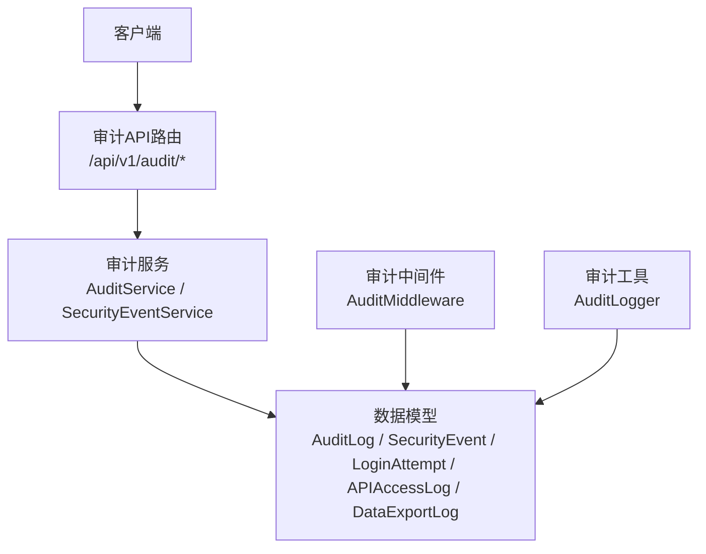
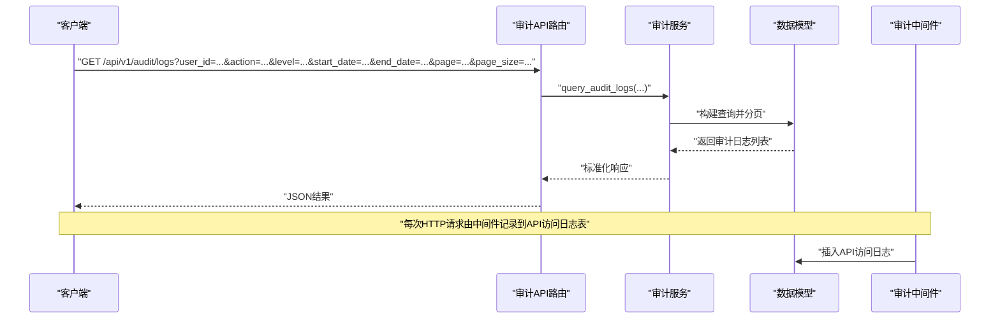
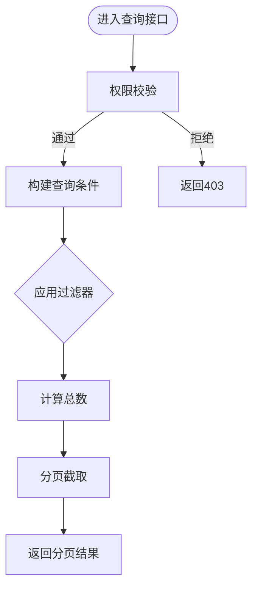
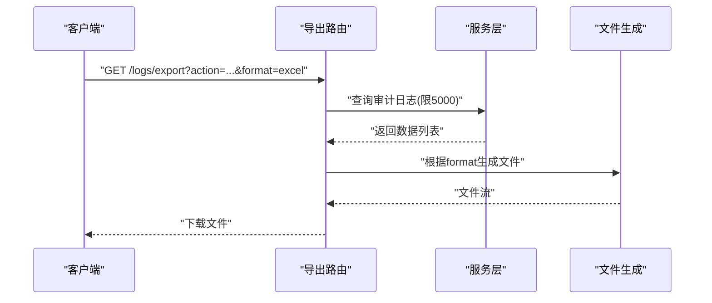
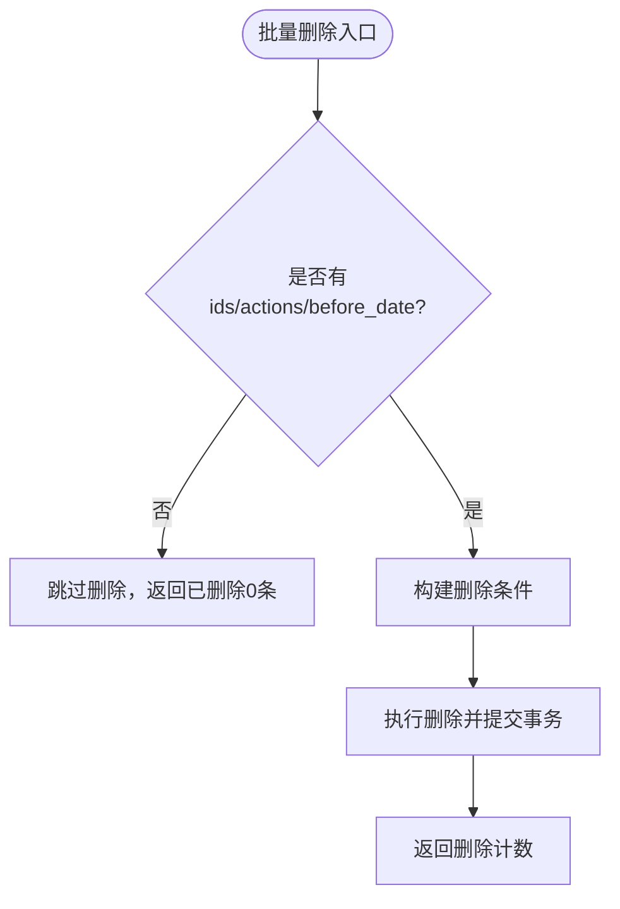
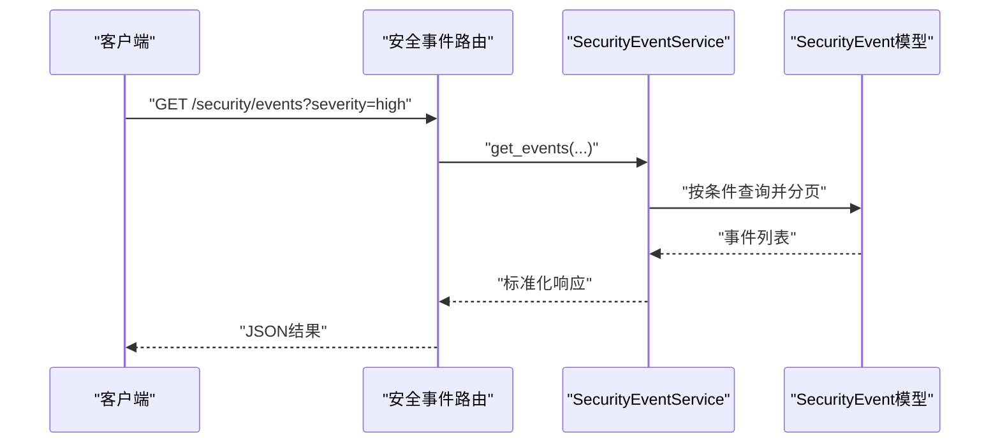
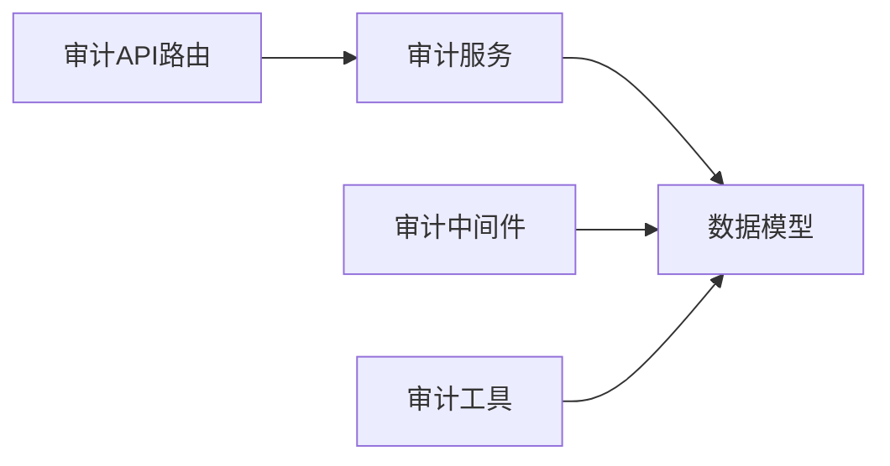

# 审计日志API

<cite>
**本文引用的文件**
- [backend/app/api/v1/system/audit.py](file://backend/app/api/v1/system/audit.py)
- [backend/app/services/audit_service.py](file://backend/app/services/audit_service.py)
- [backend/app/models/audit.py](file://backend/app/models/audit.py)
- [backend/app/core/audit_middleware.py](file://backend/app/core/audit_middleware.py)
- [backend/app/utils/audit_logger.py](file://backend/app/utils/audit_logger.py)
</cite>

## 目录
1. [简介](#简介)
2. [项目结构](#项目结构)
3. [核心组件](#核心组件)
4. [架构总览](#架构总览)
5. [详细组件分析](#详细组件分析)
6. [依赖关系分析](#依赖关系分析)
7. [性能与存储策略](#性能与存储策略)
8. [故障排查指南](#故障排查指南)
9. [结论](#结论)
10. [附录：接口清单与示例](#附录接口清单与示例)

## 简介
本文件为“审计日志API”的完整技术文档，覆盖操作日志查询、审计记录导出、安全事件管理、登录尝试与API访问日志等能力。文档明确每个接口的HTTP方法、URL路径、查询条件、分页参数、权限要求，并说明日志级别过滤、用户操作追踪、敏感操作告警等特性。同时给出数据结构、存储策略、归档机制建议，以及合规性报告与安全事件分析的高级用法示例。

## 项目结构
审计日志相关代码主要分布在以下模块：
- API路由层：提供REST接口（查询、导出、删除、统计、安全事件等）
- 服务层：封装审计日志写入、查询、统计与安全事件处理逻辑
- 数据模型层：定义审计日志、安全事件、登录尝试、API访问日志、数据导出日志等表结构
- 中间件：自动记录每次HTTP请求到API访问日志表
- 工具层：统一审计日志写入入口，兼顾Python日志与数据库持久化

**图表来源**
- [backend/app/api/v1/system/audit.py:19-615](file://backend/app/api/v1/system/audit.py#L19-L615)
- [backend/app/services/audit_service.py:58-510](file://backend/app/services/audit_service.py#L58-L510)
- [backend/app/models/audit.py:53-205](file://backend/app/models/audit.py#L53-L205)
- [backend/app/core/audit_middleware.py:11-109](file://backend/app/core/audit_middleware.py#L11-L109)
- [backend/app/utils/audit_logger.py:60-297](file://backend/app/utils/audit_logger.py#L60-L297)

**章节来源**
- [backend/app/api/v1/system/audit.py:19-615](file://backend/app/api/v1/system/audit.py#L19-L615)
- [backend/app/services/audit_service.py:58-510](file://backend/app/services/audit_service.py#L58-L510)
- [backend/app/models/audit.py:53-205](file://backend/app/models/audit.py#L53-L205)
- [backend/app/core/audit_middleware.py:11-109](file://backend/app/core/audit_middleware.py#L11-L109)
- [backend/app/utils/audit_logger.py:60-297](file://backend/app/utils/audit_logger.py#L60-L297)

## 核心组件
- 审计API路由：提供日志查询、导出、删除、备注更新、统计、安全事件、登录尝试、API访问日志、数据导出日志、用户活动聚合等接口
- 审计服务：实现日志写入、查询、统计；安全事件创建、查询、解决；导出与登录尝试记录
- 数据模型：定义审计日志、安全事件、登录尝试、API访问日志、数据导出日志的字段与索引
- 中间件：自动捕获HTTP请求信息并落库到API访问日志表
- 工具层：统一审计日志写入，支持敏感操作告警级别、权限变更记录、登录成功/失败记录

**章节来源**
- [backend/app/api/v1/system/audit.py:19-615](file://backend/app/api/v1/system/audit.py#L19-L615)
- [backend/app/services/audit_service.py:58-510](file://backend/app/services/audit_service.py#L58-L510)
- [backend/app/models/audit.py:53-205](file://backend/app/models/audit.py#L53-L205)
- [backend/app/core/audit_middleware.py:11-109](file://backend/app/core/audit_middleware.py#L11-L109)
- [backend/app/utils/audit_logger.py:60-297](file://backend/app/utils/audit_logger.py#L60-L297)

## 架构总览
审计日志系统采用分层设计：
- 路由层负责鉴权、参数校验、调用服务层
- 服务层封装业务逻辑与数据访问
- 模型层定义实体与索引，支撑高效查询
- 中间件在请求生命周期中自动记录API访问日志
- 工具层提供统一的审计写入入口，确保日志不丢失且不影响主流程

**图表来源**
- [backend/app/api/v1/system/audit.py:339-377](file://backend/app/api/v1/system/audit.py#L339-L377)
- [backend/app/services/audit_service.py:275-315](file://backend/app/services/audit_service.py#L275-L315)
- [backend/app/models/audit.py:53-96](file://backend/app/models/audit.py#L53-L96)
- [backend/app/core/audit_middleware.py:18-44](file://backend/app/core/audit_middleware.py#L18-L44)

## 详细组件分析

### 审计日志查询接口
- 方法：GET
- 路径：/api/v1/audit/logs
- 权限：管理员或超级管理员
- 查询参数：
  - user_id: 可选，按用户ID过滤
  - action: 可选，按操作类型过滤（枚举值见下方）
  - resource_type: 可选，按资源类型过滤
  - status: 可选，按状态过滤（success/failed/pending）
  - level: 可选，按日志级别过滤（debug/info/warning/error/critical）
  - start_date/end_date: 可选，时间范围过滤
  - page/page_size: 分页参数，默认page=1, page_size=50，最大100
- 返回：包含items、total、page、page_size的标准分页结构

**图表来源**
- [backend/app/api/v1/system/audit.py:339-377](file://backend/app/api/v1/system/audit.py#L339-L377)
- [backend/app/services/audit_service.py:275-315](file://backend/app/services/audit_service.py#L275-L315)

**章节来源**
- [backend/app/api/v1/system/audit.py:339-377](file://backend/app/api/v1/system/audit.py#L339-L377)
- [backend/app/services/audit_service.py:275-315](file://backend/app/services/audit_service.py#L275-L315)

### 审计记录导出接口
- 方法：GET
- 路径：/api/v1/audit/logs/export
- 权限：管理员或超级管理员
- 查询参数：
  - action: 可选，按操作类型过滤
  - start_date/end_date: 可选，时间范围过滤
  - format: 可选，json/excel/csv，默认json
- 行为：
  - json：直接返回JSON数据（最多5000条）
  - excel/csv：生成文件流下载，文件名带时间戳
- 注意：Excel依赖openpyxl，未安装时回退CSV

**图表来源**
- [backend/app/api/v1/system/audit.py:205-337](file://backend/app/api/v1/system/audit.py#L205-L337)

**章节来源**
- [backend/app/api/v1/system/audit.py:205-337](file://backend/app/api/v1/system/audit.py#L205-L337)

### 批量删除与单条删除接口
- 批量删除：DELETE /api/v1/audit/logs/batch
  - 请求体支持ids/actions/action/before_date组合
  - 无有效过滤条件时不会删除任何记录
- 单条删除：DELETE /api/v1/audit/logs/{log_id}
- 权限：管理员或超级管理员

**图表来源**
- [backend/app/api/v1/system/audit.py:80-141](file://backend/app/api/v1/system/audit.py#L80-L141)

**章节来源**
- [backend/app/api/v1/system/audit.py:80-141](file://backend/app/api/v1/system/audit.py#L80-L141)

### 审计日志备注更新接口
- 方法：PATCH
- 路径：/api/v1/audit/logs/{log_id}/remark
- 权限：管理员或超级管理员
- 行为：将备注写入元数据JSON字段metadata_

**章节来源**
- [backend/app/api/v1/system/audit.py:171-202](file://backend/app/api/v1/system/audit.py#L171-L202)

### 审计统计接口
- 方法：GET
- 路径：/api/v1/audit/stats
- 权限：管理员或超级管理员
- 查询参数：start_date/end_date（可选）
- 返回：总数量、按动作/状态/级别分组计数、活跃用户Top10、最近活动、前端兼容字段（今日操作数、警告数等）

**章节来源**
- [backend/app/api/v1/system/audit.py:395-406](file://backend/app/api/v1/system/audit.py#L395-L406)
- [backend/app/services/audit_service.py:317-376](file://backend/app/services/audit_service.py#L317-L376)

### 可用枚举接口
- GET /api/v1/audit/actions：返回所有支持的审计动作枚举
- GET /api/v1/audit/levels：返回所有支持的审计级别枚举

**章节来源**
- [backend/app/api/v1/system/audit.py:409-416](file://backend/app/api/v1/system/audit.py#L409-L416)

### 安全事件管理接口
- 查询事件：GET /api/v1/audit/security/events
  - 参数：severity/event_type/resolved/start_date/end_date/page/page_size
- 事件统计：GET /api/v1/audit/security/stats
- 解决事件：POST /api/v1/audit/security/events/{event_id}/resolve
  - 参数：resolution_notes
- 权限：管理员或超级管理员

**图表来源**
- [backend/app/api/v1/system/audit.py:419-443](file://backend/app/api/v1/system/audit.py#L419-L443)
- [backend/app/services/audit_service.py:455-486](file://backend/app/services/audit_service.py#L455-L486)

**章节来源**
- [backend/app/api/v1/system/audit.py:419-475](file://backend/app/api/v1/system/audit.py#L419-L475)
- [backend/app/services/audit_service.py:379-509](file://backend/app/services/audit_service.py#L379-L509)

### 登录尝试与API访问日志接口
- 登录尝试：GET /api/v1/audit/login-attempts
  - 参数：username/ip_address/start_date/end_date/page/page_size
- API访问日志：GET /api/v1/audit/api-access
  - 参数：user_id/endpoint/start_date/end_date/page/page_size
- 数据导出日志：GET /api/v1/audit/exports
  - 参数：user_id/export_type/start_date/end_date/page/page_size
- 权限：管理员或超级管理员

**章节来源**
- [backend/app/api/v1/system/audit.py:478-574](file://backend/app/api/v1/system/audit.py#L478-L574)

### 用户活动聚合接口
- 方法：GET
- 路径：/api/v1/audit/user-activity/{user_id}
- 参数：days（1-90），默认7
- 权限：管理员或超级管理员，或本人查看
- 返回：周期内操作总数、动作分布、最近活动（最多20条）

**章节来源**
- [backend/app/api/v1/system/audit.py:577-614](file://backend/app/api/v1/system/audit.py#L577-L614)

## 依赖关系分析
- 路由层依赖服务层进行数据查询与统计
- 服务层依赖模型层进行ORM操作
- 中间件独立于路由层，自动记录API访问日志
- 工具层提供统一审计写入入口，保证日志一致性

**图表来源**
- [backend/app/api/v1/system/audit.py:19-615](file://backend/app/api/v1/system/audit.py#L19-L615)
- [backend/app/services/audit_service.py:58-510](file://backend/app/services/audit_service.py#L58-L510)
- [backend/app/models/audit.py:53-205](file://backend/app/models/audit.py#L53-L205)
- [backend/app/core/audit_middleware.py:11-109](file://backend/app/core/audit_middleware.py#L11-L109)
- [backend/app/utils/audit_logger.py:60-297](file://backend/app/utils/audit_logger.py#L60-L297)

**章节来源**
- [backend/app/api/v1/system/audit.py:19-615](file://backend/app/api/v1/system/audit.py#L19-L615)
- [backend/app/services/audit_service.py:58-510](file://backend/app/services/audit_service.py#L58-L510)
- [backend/app/models/audit.py:53-205](file://backend/app/models/audit.py#L53-L205)
- [backend/app/core/audit_middleware.py:11-109](file://backend/app/core/audit_middleware.py#L11-L109)
- [backend/app/utils/audit_logger.py:60-297](file://backend/app/utils/audit_logger.py#L60-L297)

## 性能与存储策略
- 索引优化：审计日志表对user_id、action、created_at、resource_type/resource_id建立复合索引，提升查询效率
- 分页限制：导出接口限制最多5000条，避免大结果集导致内存压力
- 中间件落库：使用独立短会话，失败仅记录警告，不阻塞业务请求
- 建议归档机制：
  - 按时间分表或分区（如按月）
  - 冷数据迁移至对象存储或归档数据库
  - 定期清理过期日志（结合before_date批量删除）
- 建议监控：
  - 审计写入失败率
  - 导出接口耗时与文件大小
  - 安全事件增长趋势

**章节来源**
- [backend/app/models/audit.py:53-96](file://backend/app/models/audit.py#L53-L96)
- [backend/app/core/audit_middleware.py:80-109](file://backend/app/core/audit_middleware.py#L80-L109)
- [backend/app/api/v1/system/audit.py:205-337](file://backend/app/api/v1/system/audit.py#L205-L337)

## 故障排查指南
- 403权限错误：检查当前用户角色是否为admin或super_admin
- 404未找到：确认log_id或event_id存在
- 400参数无效：检查action/status/level等枚举值是否合法
- 导出失败：检查openpyxl是否安装（Excel格式）
- 中间件落库失败：查看警告日志，确认数据库连接与权限

**章节来源**
- [backend/app/api/v1/system/audit.py:80-141](file://backend/app/api/v1/system/audit.py#L80-L141)
- [backend/app/api/v1/system/audit.py:205-337](file://backend/app/api/v1/system/audit.py#L205-L337)
- [backend/app/core/audit_middleware.py:80-109](file://backend/app/core/audit_middleware.py#L80-L109)

## 结论
审计日志API提供了完整的操作审计、安全事件管理与统计分析能力，满足合规性与安全运营需求。通过合理的索引设计与分页限制，系统在大数据量下仍保持良好性能。建议在生产环境实施归档与清理策略，并结合安全事件阈值告警，形成闭环的安全运营体系。

## 附录：接口清单与示例

### 接口清单
- 查询审计日志
  - GET /api/v1/audit/logs
  - 参数：user_id, action, resource_type, status, level, start_date, end_date, page, page_size
- 导出审计日志
  - GET /api/v1/audit/logs/export
  - 参数：action, start_date, end_date, format(json/excel/csv)
- 批量删除审计日志
  - DELETE /api/v1/audit/logs/batch
  - 请求体：ids, actions, action, before_date
- 删除单条审计日志
  - DELETE /api/v1/audit/logs/{log_id}
- 更新审计日志备注
  - PATCH /api/v1/audit/logs/{log_id}/remark
  - 请求体：remark
- 审计统计
  - GET /api/v1/audit/stats
  - 参数：start_date, end_date
- 可用枚举
  - GET /api/v1/audit/actions
  - GET /api/v1/audit/levels
- 安全事件
  - GET /api/v1/audit/security/events
  - GET /api/v1/audit/security/stats
  - POST /api/v1/audit/security/events/{event_id}/resolve
- 登录尝试
  - GET /api/v1/audit/login-attempts
- API访问日志
  - GET /api/v1/audit/api-access
- 数据导出日志
  - GET /api/v1/audit/exports
- 用户活动
  - GET /api/v1/audit/user-activity/{user_id}
  - 参数：days

### 高级功能示例
- 合规性报告生成
  - 步骤：调用导出接口获取指定时间范围的审计日志（format=csv），结合外部报表工具生成合规报告
  - 参考：[导出接口:205-337](file://backend/app/api/v1/system/audit.py#L205-L337)
- 安全事件分析
  - 步骤：查询高严重性未解决事件，结合用户活动与登录尝试进行关联分析
  - 参考：[安全事件查询:419-443](file://backend/app/api/v1/system/audit.py#L419-L443), [登录尝试查询:478-508](file://backend/app/api/v1/system/audit.py#L478-L508)

**章节来源**
- [backend/app/api/v1/system/audit.py:205-614](file://backend/app/api/v1/system/audit.py#L205-L614)