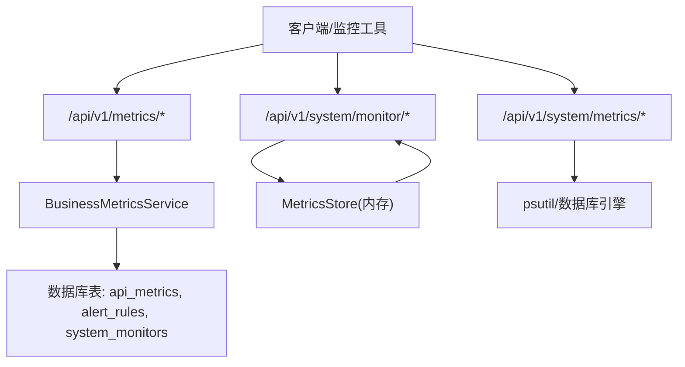
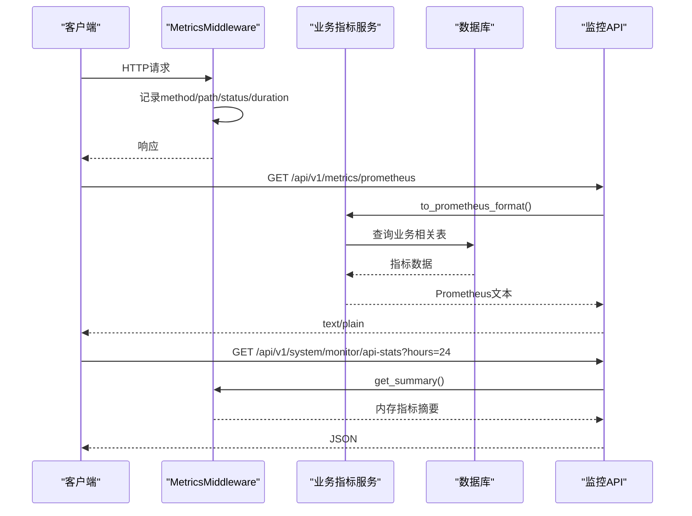
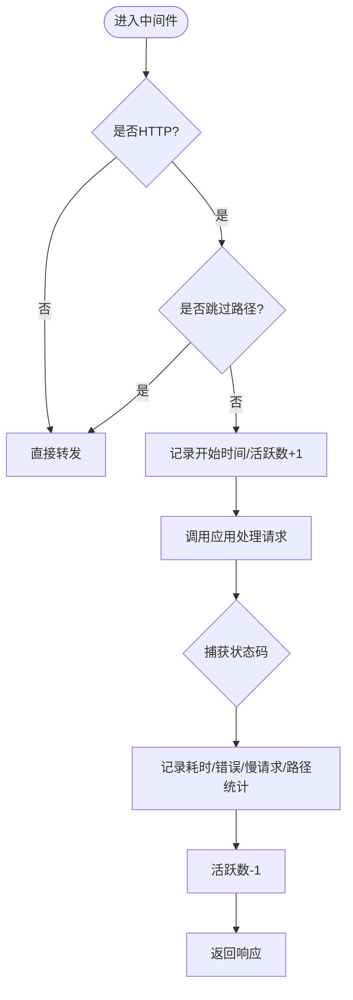
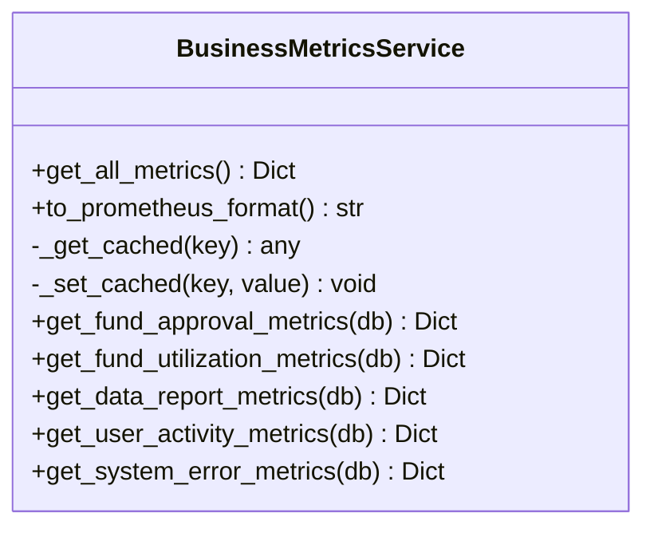
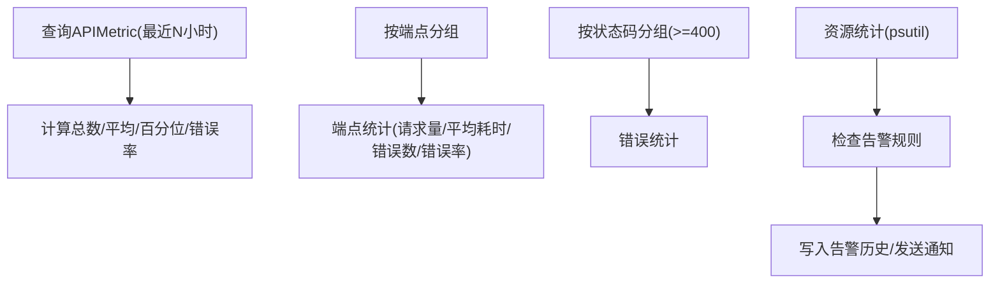
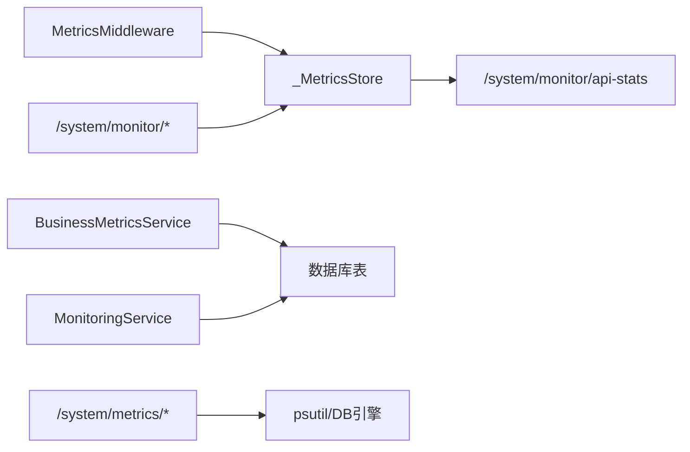

# 监控指标API

<cite>
**本文引用的文件**
- [backend/app/api/v1/monitoring/metrics.py](file://backend/app/api/v1/monitoring/metrics.py)
- [backend/app/api/v1/system/monitor.py](file://backend/app/api/v1/system/monitor.py)
- [backend/app/api/v1/system/metrics.py](file://backend/app/api/v1/system/metrics.py)
- [backend/app/middleware/metrics_middleware.py](file://backend/app/middleware/metrics_middleware.py)
- [backend/app/services/business_metrics_service.py](file://backend/app/services/business_metrics_service.py)
- [backend/app/services/monitoring_service.py](file://backend/app/services/monitoring_service.py)
- [backend/app/models/monitoring.py](file://backend/app/models/monitoring.py)
- [backend/app/models/system_monitor.py](file://backend/app/models/system_monitor.py)
</cite>

## 目录
1. [简介](#简介)
2. [项目结构](#项目结构)
3. [核心组件](#核心组件)
4. [架构总览](#架构总览)
5. [详细组件分析](#详细组件分析)
6. [依赖关系分析](#依赖关系分析)
7. [性能考量](#性能考量)
8. [故障排查指南](#故障排查指南)
9. [结论](#结论)
10. [附录：接口清单与示例](#附录接口清单与示例)

## 简介
本文件面向“监控指标API”，系统化说明系统性能指标、业务指标、资源使用率等监控数据的获取方式。文档覆盖以下要点：
- HTTP方法、URL路径、查询参数、时间范围过滤、指标聚合能力
- Prometheus格式与JSON格式的指标数据示例
- 自定义指标的注册与采集方式
- 与监控系统（如Grafana）的集成方法

## 项目结构
监控相关代码主要分布在以下模块：
- API层：提供对外暴露的HTTP端点，用于查询业务指标、系统指标、性能面板、Prometheus导出等
- 中间件层：ASGI中间件实时采集HTTP请求级指标（计数、耗时、慢请求等）
- 服务层：封装业务指标计算、系统资源统计、告警规则检查等逻辑
- 模型层：持久化API性能指标、告警规则与历史、系统监控记录等

图表来源
- [backend/app/api/v1/monitoring/metrics.py:22-48](file://backend/app/api/v1/monitoring/metrics.py#L22-L48)
- [backend/app/api/v1/system/monitor.py:54-352](file://backend/app/api/v1/system/monitor.py#L54-L352)
- [backend/app/api/v1/system/metrics.py:50-330](file://backend/app/api/v1/system/metrics.py#L50-L330)
- [backend/app/middleware/metrics_middleware.py:26-129](file://backend/app/middleware/metrics_middleware.py#L26-L129)
- [backend/app/services/business_metrics_service.py:22-376](file://backend/app/services/business_metrics_service.py#L22-L376)
- [backend/app/models/monitoring.py:22-84](file://backend/app/models/monitoring.py#L22-L84)
- [backend/app/models/system_monitor.py:11-50](file://backend/app/models/system_monitor.py#L11-L50)

章节来源
- [backend/app/api/v1/monitoring/metrics.py:1-100](file://backend/app/api/v1/monitoring/metrics.py#L1-L100)
- [backend/app/api/v1/system/monitor.py:1-352](file://backend/app/api/v1/system/monitor.py#L1-L352)
- [backend/app/api/v1/system/metrics.py:1-330](file://backend/app/api/v1/system/metrics.py#L1-L330)
- [backend/app/middleware/metrics_middleware.py:1-177](file://backend/app/middleware/metrics_middleware.py#L1-L177)
- [backend/app/services/business_metrics_service.py:1-376](file://backend/app/services/business_metrics_service.py#L1-L376)
- [backend/app/services/monitoring_service.py:1-312](file://backend/app/services/monitoring_service.py#L1-L312)
- [backend/app/models/monitoring.py:1-84](file://backend/app/models/monitoring.py#L1-L84)
- [backend/app/models/system_monitor.py:1-50](file://backend/app/models/system_monitor.py#L1-L50)

## 核心组件
- 指标采集中间件：线程安全的内存计数器，记录请求数、错误数、平均耗时、慢请求、活跃请求数、按方法与状态码的计数、Top端点等
- 业务指标服务：聚合资金审批、资金使用、数据上报、用户活跃度、系统错误率等指标，并支持Prometheus格式导出
- 系统监控API：提供系统快照、资源详情、API调用统计、数据库大小等
- 系统指标API：提供综合系统指标、性能指标列表、数据库指标、历史指标查询
- 监控服务：基于数据库APIMetric进行性能统计、错误统计、资源统计、告警检查与触发

章节来源
- [backend/app/middleware/metrics_middleware.py:26-129](file://backend/app/middleware/metrics_middleware.py#L26-L129)
- [backend/app/services/business_metrics_service.py:22-376](file://backend/app/services/business_metrics_service.py#L22-L376)
- [backend/app/api/v1/system/monitor.py:54-352](file://backend/app/api/v1/system/monitor.py#L54-L352)
- [backend/app/api/v1/system/metrics.py:50-330](file://backend/app/api/v1/system/metrics.py#L50-L330)
- [backend/app/services/monitoring_service.py:26-312](file://backend/app/services/monitoring_service.py#L26-L312)

## 架构总览
监控数据流包含两条主线：
- 实时HTTP指标：由中间件在请求处理前后记录，供系统监控API读取
- 业务指标：由业务指标服务从数据库聚合计算，支持Prometheus导出

图表来源
- [backend/app/middleware/metrics_middleware.py:132-177](file://backend/app/middleware/metrics_middleware.py#L132-L177)
- [backend/app/api/v1/monitoring/metrics.py:38-48](file://backend/app/api/v1/monitoring/metrics.py#L38-L48)
- [backend/app/services/business_metrics_service.py:312-371](file://backend/app/services/business_metrics_service.py#L312-L371)
- [backend/app/api/v1/system/monitor.py:278-324](file://backend/app/api/v1/system/monitor.py#L278-L324)

## 详细组件分析

### 指标采集中间件（MetricsMiddleware）
- 功能：记录每个HTTP请求的方法、路径、状态码、耗时；维护活跃请求数；收集慢请求；生成按方法与状态码的计数；计算平均耗时、错误率、每秒请求数、Top端点等
- 存储：进程内内存计数器，线程安全
- 跳过路径：/health、/metrics、/favicon.ico
- 关键数据结构与方法：_MetricsStore.record/inc_active/dec_active/get_summary

图表来源
- [backend/app/middleware/metrics_middleware.py:132-177](file://backend/app/middleware/metrics_middleware.py#L132-L177)
- [backend/app/middleware/metrics_middleware.py:26-129](file://backend/app/middleware/metrics_middleware.py#L26-L129)

章节来源
- [backend/app/middleware/metrics_middleware.py:1-177](file://backend/app/middleware/metrics_middleware.py#L1-L177)

### 业务指标服务（BusinessMetricsService）
- 指标类别：
  - 资金审批：成功率、待审批数量、平均审批时间
  - 资金使用：拨付率、各状态分布、总额
  - 数据上报：完成率、及时率
  - 用户活跃度：7天活跃用户、30天新增用户、活动率
  - 系统错误：24小时错误率、总请求数
- 缓存：内部字典缓存，TTL为60秒
- Prometheus导出：将上述指标转换为标准Prometheus文本格式

图表来源
- [backend/app/services/business_metrics_service.py:22-376](file://backend/app/services/business_metrics_service.py#L22-L376)

章节来源
- [backend/app/services/business_metrics_service.py:1-376](file://backend/app/services/business_metrics_service.py#L1-L376)

### 监控服务（MonitoringService）
- 功能：
  - API性能统计：总请求数、平均响应时间、P50/P95/P99、错误率
  - 端点统计：按端点分组统计请求量、平均响应时间、错误数、错误率
  - 错误统计：按状态码分组统计错误
  - 资源统计：CPU、内存、磁盘使用率
  - 告警检查：根据规则检查响应时间、错误率、资源使用率并触发告警
- 数据源：数据库表APIMetric、AlertRule、AlertHistory

图表来源
- [backend/app/services/monitoring_service.py:26-312](file://backend/app/services/monitoring_service.py#L26-L312)
- [backend/app/models/monitoring.py:22-84](file://backend/app/models/monitoring.py#L22-L84)

章节来源
- [backend/app/services/monitoring_service.py:1-312](file://backend/app/services/monitoring_service.py#L1-L312)
- [backend/app/models/monitoring.py:1-84](file://backend/app/models/monitoring.py#L1-L84)

### 系统监控API（/api/v1/system/monitor）
- 端点概览：
  - GET /api/v1/system/monitor/snapshot：当前系统快照（CPU、内存、磁盘、网络、进程信息）
  - GET /api/v1/system/monitor/resources：资源使用详情与健康评估
  - GET /api/v1/system/monitor/alerts：告警规则列表（含默认规则）
  - GET /api/v1/system/monitor/alerts/history：告警历史记录（分页、状态筛选）
  - GET /api/v1/system/monitor/api-stats：API调用统计（优先内存指标，支持hours过滤）
  - GET /api/v1/system/monitor/database-size：数据库文件大小
- 权限：多数端点需要认证（get_current_user），部分需管理员权限

章节来源
- [backend/app/api/v1/system/monitor.py:1-352](file://backend/app/api/v1/system/monitor.py#L1-L352)

### 系统指标API（/api/v1/system/metrics）
- 端点概览：
  - GET /api/v1/system/metrics：综合系统指标（资源、运行时间、进程、应用信息、数据库连接池）
  - GET /api/v1/system/metrics/performance：性能指标列表（CPU/内存/磁盘及状态）
  - GET /api/v1/system/metrics/database：数据库指标（文件大小、表数量、关键表行数）
  - GET /api/v1/system/metrics/history：历史指标数据（支持hours与metric_type过滤）
- 权限：需要认证

章节来源
- [backend/app/api/v1/system/metrics.py:1-330](file://backend/app/api/v1/system/metrics.py#L1-L330)

### 业务指标API（/api/v1/metrics）
- 端点概览：
  - GET /api/v1/metrics/business：业务指标JSON（资金审批、资金使用、数据上报、用户活跃度、系统错误）
  - GET /api/v1/metrics/prometheus：Prometheus格式指标文本（用于Grafana/Prometheus抓取）
  - GET /api/v1/metrics/performance-dashboard：性能监控面板（HTTP指标、慢请求、错误率、数据库统计，需管理员）
- 权限：business与performance-dashboard需要认证；prometheus无需认证

章节来源
- [backend/app/api/v1/monitoring/metrics.py:1-100](file://backend/app/api/v1/monitoring/metrics.py#L1-L100)

## 依赖关系分析
- 中间件与API：
  - 中间件负责采集HTTP请求指标，API通过metrics_store.get_summary()读取
- 业务指标与数据库：
  - 业务指标服务从Fund、ApprovalTask、DataReport、User、APIMetric等表聚合计算
- 系统监控与系统指标：
  - 系统监控API读取内存指标或数据库指标；系统指标API读取psutil与数据库引擎池信息
- 告警机制：
  - MonitoringService依据AlertRule检查APIMetric与资源指标，并将结果写入AlertHistory

图表来源
- [backend/app/middleware/metrics_middleware.py:128-177](file://backend/app/middleware/metrics_middleware.py#L128-L177)
- [backend/app/services/business_metrics_service.py:297-371](file://backend/app/services/business_metrics_service.py#L297-L371)
- [backend/app/services/monitoring_service.py:183-312](file://backend/app/services/monitoring_service.py#L183-L312)
- [backend/app/api/v1/system/monitor.py:278-352](file://backend/app/api/v1/system/monitor.py#L278-L352)
- [backend/app/api/v1/system/metrics.py:50-330](file://backend/app/api/v1/system/metrics.py#L50-L330)

章节来源
- [backend/app/middleware/metrics_middleware.py:1-177](file://backend/app/middleware/metrics_middleware.py#L1-L177)
- [backend/app/services/business_metrics_service.py:1-376](file://backend/app/services/business_metrics_service.py#L1-L376)
- [backend/app/services/monitoring_service.py:1-312](file://backend/app/services/monitoring_service.py#L1-L312)
- [backend/app/api/v1/system/monitor.py:1-352](file://backend/app/api/v1/system/monitor.py#L1-L352)
- [backend/app/api/v1/system/metrics.py:1-330](file://backend/app/api/v1/system/metrics.py#L1-L330)

## 性能考量
- 中间件开销：每次请求记录少量计数器与慢请求列表，内存占用可控；慢请求阈值可配置
- 缓存策略：业务指标服务对指标计算结果进行60秒缓存，降低数据库压力
- 数据库查询：历史指标查询限制记录条数（如limit 500），避免大结果集
- 健康降级：当psutil不可用或数据库异常时，接口仍返回可用字段或空集合，保证可用性

[本节为通用指导，不直接分析具体文件]

## 故障排查指南
- 指标缺失或为0：
  - 检查中间件是否正确注册且未被跳过路径拦截
  - 确认请求已到达应用并被记录
- 数据库统计失败：
  - 查看日志中的警告信息（如数据库统计收集失败）
  - 确认数据库连接与权限正常
- 资源指标不可用：
  - 确认psutil已安装并可导入
  - 检查操作系统权限与路径
- 告警未触发：
  - 检查AlertRule是否启用、阈值与持续时间设置
  - 查看AlertHistory是否有记录

章节来源
- [backend/app/api/v1/monitoring/metrics.py:66-90](file://backend/app/api/v1/monitoring/metrics.py#L66-L90)
- [backend/app/api/v1/system/monitor.py:327-352](file://backend/app/api/v1/system/monitor.py#L327-L352)
- [backend/app/api/v1/system/metrics.py:123-145](file://backend/app/api/v1/system/metrics.py#L123-L145)
- [backend/app/services/monitoring_service.py:183-312](file://backend/app/services/monitoring_service.py#L183-L312)

## 结论
本监控指标体系通过中间件实时采集HTTP指标、业务指标服务聚合业务数据、系统监控与系统指标API提供多维度的运行时视图，并结合Prometheus导出能力，便于接入Grafana等可视化平台。建议在生产环境开启中间件、合理配置慢请求阈值与缓存TTL，并定期清理历史指标以控制存储增长。

[本节为总结性内容，不直接分析具体文件]

## 附录：接口清单与示例

### 业务指标API（/api/v1/metrics）
- GET /api/v1/metrics/business
  - 方法：GET
  - 路径：/api/v1/metrics/business
  - 认证：需要
  - 返回：JSON，包含资金审批、资金使用、数据上报、用户活跃度、系统错误等指标
- GET /api/v1/metrics/prometheus
  - 方法：GET
  - 路径：/api/v1/metrics/prometheus
  - 认证：不需要
  - 返回：text/plain，Prometheus格式指标文本
- GET /api/v1/metrics/performance-dashboard
  - 方法：GET
  - 路径：/api/v1/metrics/performance-dashboard
  - 认证：需要（管理员）
  - 返回：JSON，包含HTTP指标、慢请求、错误率、数据库统计

章节来源
- [backend/app/api/v1/monitoring/metrics.py:22-100](file://backend/app/api/v1/monitoring/metrics.py#L22-L100)

### 系统监控API（/api/v1/system/monitor）
- GET /api/v1/system/monitor/snapshot
  - 方法：GET
  - 路径：/api/v1/system/monitor/snapshot
  - 认证：需要
  - 返回：JSON，系统快照（CPU、内存、磁盘、网络、进程）
- GET /api/v1/system/monitor/resources
  - 方法：GET
  - 路径：/api/v1/system/monitor/resources
  - 认证：需要
  - 返回：JSON，资源使用详情与健康评估
- GET /api/v1/system/monitor/alerts
  - 方法：GET
  - 路径：/api/v1/system/monitor/alerts
  - 认证：需要
  - 返回：JSON，告警规则列表（含默认规则）
- GET /api/v1/system/monitor/alerts/history
  - 方法：GET
  - 路径：/api/v1/system/monitor/alerts/history
  - 查询参数：page、page_size、status
  - 认证：需要
  - 返回：JSON，告警历史记录（分页）
- GET /api/v1/system/monitor/api-stats
  - 方法：GET
  - 路径：/api/v1/system/monitor/api-stats
  - 查询参数：hours（1-720）
  - 认证：需要
  - 返回：JSON，API调用统计（请求数、错误数、错误率、平均耗时、每秒请求数、Top端点、慢请求）
- GET /api/v1/system/monitor/database-size
  - 方法：GET
  - 路径：/api/v1/system/monitor/database-size
  - 认证：需要
  - 返回：JSON，数据库文件大小

章节来源
- [backend/app/api/v1/system/monitor.py:54-352](file://backend/app/api/v1/system/monitor.py#L54-L352)

### 系统指标API（/api/v1/system/metrics）
- GET /api/v1/system/metrics
  - 方法：GET
  - 路径：/api/v1/system/metrics
  - 认证：需要
  - 返回：JSON，综合系统指标（资源、运行时间、进程、应用信息、数据库连接池）
- GET /api/v1/system/metrics/performance
  - 方法：GET
  - 路径：/api/v1/system/metrics/performance
  - 认证：需要
  - 返回：JSON，性能指标列表（CPU/内存/磁盘及状态）
- GET /api/v1/system/metrics/database
  - 方法：GET
  - 路径：/api/v1/system/metrics/database
  - 认证：需要
  - 返回：JSON，数据库指标（文件大小、表数量、关键表行数）
- GET /api/v1/system/metrics/history
  - 方法：GET
  - 路径：/api/v1/system/metrics/history
  - 查询参数：hours（1-720）、metric_type（cpu/memory/disk/all）
  - 认证：需要
  - 返回：JSON，历史指标数据（按时间排序）

章节来源
- [backend/app/api/v1/system/metrics.py:50-330](file://backend/app/api/v1/system/metrics.py#L50-L330)

### Prometheus格式指标示例
- 端点：GET /api/v1/metrics/prometheus
- 内容类型：text/plain; charset=utf-8
- 示例片段（来自测试断言与导出逻辑）：
  - fund_approval_success_rate 85.5
  - fund_pending_count 3
  - fund_avg_approval_time_hours 24.0
  - fund_allocation_rate 60.0
  - fund_total_amount 100000.0
  - data_report_completion_rate 90.0
  - data_report_on_time_rate 80.0
  - active_users_7d 15
  - new_users_30d 5
  - system_error_rate 2.5
  - total_requests_24h 1000

章节来源
- [backend/app/services/business_metrics_service.py:312-371](file://backend/app/services/business_metrics_service.py#L312-L371)
- [backend/tests/unit/test_business_metrics_service.py:250-283](file://backend/tests/unit/test_business_metrics_service.py#L250-L283)

### JSON格式指标示例
- 端点：GET /api/v1/metrics/business
- 返回结构（节选）：
  - fund_approval：包含total_approvals_30d、approved_count_30d、rejected_count_30d、pending_count、approval_success_rate、avg_approval_time_hours
  - fund_utilization：包含total_funds、total_amount、completed_funds、completed_amount、allocation_rate、status_distribution
  - data_report：包含expected_reports、completed_reports、report_completion_rate、on_time_reports、on_time_rate
  - user_activity：包含active_users_7d、new_users_30d、total_users、activity_rate
  - system_error：包含total_requests_24h、error_requests_24h、error_rate
  - timestamp：ISO时间戳

章节来源
- [backend/app/services/business_metrics_service.py:42-311](file://backend/app/services/business_metrics_service.py#L42-L311)

### 自定义指标注册与采集方式
- 注册位置：
  - 业务指标：在BusinessMetricsService中扩展新的指标计算方法，并在get_all_metrics中汇总
  - Prometheus导出：在to_prometheus_format中追加新指标的HELP、TYPE与值行
- 采集方式：
  - HTTP请求级指标：由MetricsMiddleware自动采集，无需额外注册
  - 业务指标：通过数据库表（如APIMetric、Fund、ApprovalTask等）聚合计算
  - 系统指标：通过psutil与数据库引擎池信息获取
- 注意事项：
  - 指标命名遵循Prometheus规范（小写、下划线分隔）
  - 避免高频重计算，合理使用缓存TTL
  - 对敏感操作（如SQL拼接）使用白名单或参数化查询

章节来源
- [backend/app/services/business_metrics_service.py:297-371](file://backend/app/services/business_metrics_service.py#L297-L371)
- [backend/app/middleware/metrics_middleware.py:132-177](file://backend/app/middleware/metrics_middleware.py#L132-L177)
- [backend/app/models/monitoring.py:22-84](file://backend/app/models/monitoring.py#L22-L84)

### 与监控系统（Grafana）集成方法
- 数据采集：
  - 配置Prometheus抓取目标指向/api/v1/metrics/prometheus
  - 或使用系统监控API（/api/v1/system/monitor/api-stats）作为外部数据源（需适配）
- 可视化：
  - 在Grafana中添加Prometheus数据源
  - 创建Dashboard展示资金审批成功率、拨付率、上报完成率、用户活跃度、错误率等
- 告警：
  - 结合AlertRule与MonitoringService实现服务端告警
  - 或通过Prometheus/Grafana Alerting对指标阈值进行告警

章节来源
- [backend/app/api/v1/monitoring/metrics.py:38-48](file://backend/app/api/v1/monitoring/metrics.py#L38-L48)
- [backend/app/services/monitoring_service.py:183-312](file://backend/app/services/monitoring_service.py#L183-L312)