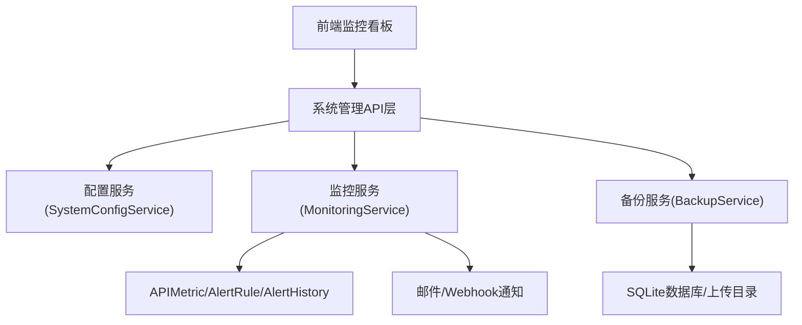
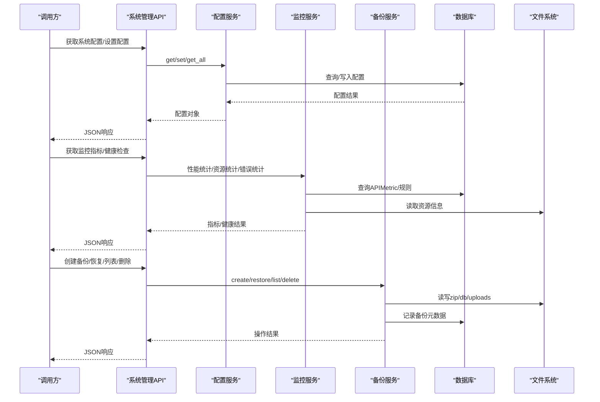
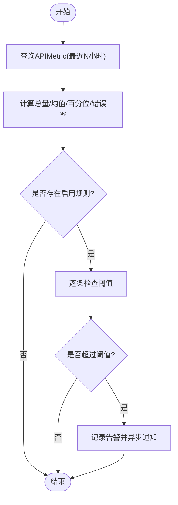
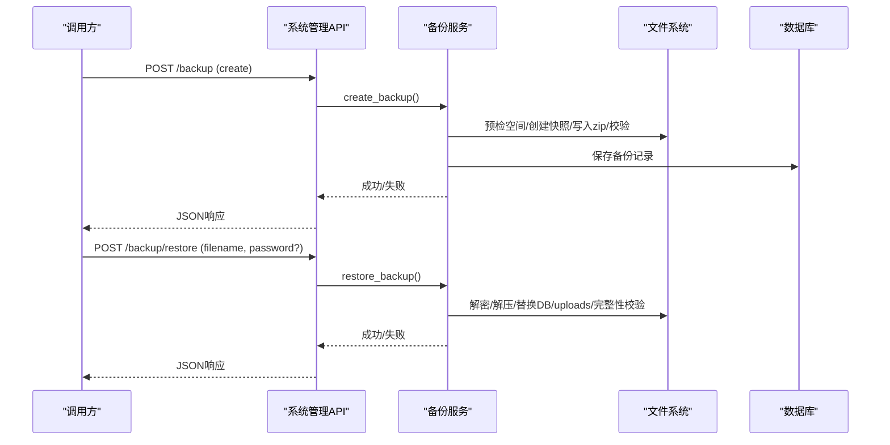
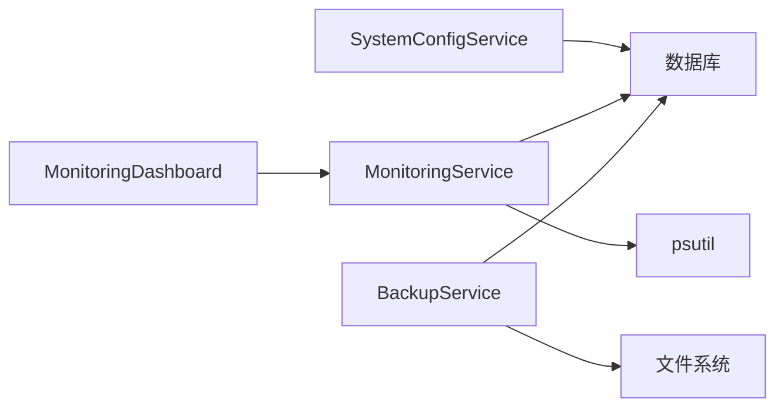

# 系统管理API

<cite>
**本文引用的文件**
- [backend/app/services/system_config_service.py](file://backend/app/services/system_config_service.py)
- [backend/app/services/monitoring_service.py](file://backend/app/services/monitoring_service.py)
- [backend/app/services/backup_service.py](file://backend/app/services/backup_service.py)
- [backend/tests/unit/test_system_admin_api.py](file://backend/tests/unit/test_system_admin_api.py)
- [backend/tests/unit/test_backup.py](file://backend/tests/unit/test_backup.py)
- [backend/tests/unit/test_monitoring_service.py](file://backend/tests/unit/test_monitoring_service.py)
- [frontend/src/views/system/MonitoringDashboard.vue](file://frontend/src/views/system/MonitoringDashboard.vue)
- [docs/02-用户手册/备份管理操作说明.md](file://docs/02-用户手册/备份管理操作说明.md)
</cite>

## 目录
1. [简介](#简介)
2. [项目结构](#项目结构)
3. [核心组件](#核心组件)
4. [架构总览](#架构总览)
5. [详细组件分析](#详细组件分析)
6. [依赖关系分析](#依赖关系分析)
7. [性能考量](#性能考量)
8. [故障排查指南](#故障排查指南)
9. [结论](#结论)
10. [附录：API参考与调用示例](#附录api参考与调用示例)

## 简介
本文件面向运维与开发，系统化梳理“系统管理API”的能力边界与实现要点，覆盖系统配置管理、监控指标、健康检查、备份恢复、日志与告警等运维相关能力。文档基于后端服务代码与测试用例进行归纳，提供接口方法、路径、参数、响应结构与错误处理说明，并给出常用操作的调用示例与集成建议。

## 项目结构
系统管理相关能力主要由以下模块构成：
- 系统配置管理：通过配置服务读写持久化配置项（如自动备份开关、保留策略、打包策略等）。
- 监控与指标：采集API性能、错误率、资源使用率，支持按端点聚合统计与百分位计算。
- 健康检查：结合数据库完整性、磁盘空间、资源使用率等维度评估系统健康度。
- 备份与恢复：支持全量/增量备份、加密备份、一致性快照、安全解压与回滚机制。
- 日志与告警：记录关键操作与异常，触发规则化告警并通过邮件/Webhook通知。

图表来源
- [backend/app/services/system_config_service.py:68-266](file://backend/app/services/system_config_service.py#L68-L266)
- [backend/app/services/monitoring_service.py:26-312](file://backend/app/services/monitoring_service.py#L26-L312)
- [backend/app/services/backup_service.py:74-800](file://backend/app/services/backup_service.py#L74-L800)

章节来源
- [backend/app/services/system_config_service.py:68-266](file://backend/app/services/system_config_service.py#L68-L266)
- [backend/app/services/monitoring_service.py:26-312](file://backend/app/services/monitoring_service.py#L26-L312)
- [backend/app/services/backup_service.py:74-800](file://backend/app/services/backup_service.py#L74-L800)

## 核心组件
- 系统配置服务：提供配置的读取、写入、批量导出导入、默认值初始化与类型转换（字符串/布尔/整数/JSON），支撑自动备份、保留天数、打包策略等运行期开关。
- 监控服务：聚合API请求的响应时间、错误率、端点级统计；采集CPU/内存/磁盘等资源指标；基于规则引擎对阈值越界触发告警并异步发送通知。
- 备份服务：创建一致性快照、压缩打包、可选AES-256加密、校验完整性、安全解压、恢复时建立快照并在失败时回滚；支持按数量或保留天数清理旧备份。

章节来源
- [backend/app/services/system_config_service.py:68-266](file://backend/app/services/system_config_service.py#L68-L266)
- [backend/app/services/monitoring_service.py:26-312](file://backend/app/services/monitoring_service.py#L26-L312)
- [backend/app/services/backup_service.py:74-800](file://backend/app/services/backup_service.py#L74-L800)

## 架构总览
系统管理API由控制器层（路由）调用各服务完成业务逻辑，数据落盘至数据库与文件系统，监控指标与告警通过后台任务异步处理。

图表来源
- [backend/app/services/system_config_service.py:68-266](file://backend/app/services/system_config_service.py#L68-L266)
- [backend/app/services/monitoring_service.py:26-312](file://backend/app/services/monitoring_service.py#L26-L312)
- [backend/app/services/backup_service.py:74-800](file://backend/app/services/backup_service.py#L74-L800)

## 详细组件分析

### 系统配置管理
- 能力概述
  - 读取/写入/删除配置项，支持默认值与类型转换（字符串、布尔、整数、JSON）。
  - 初始化默认配置键（如自动备份开关、保留天数、目标目录、打包策略等）。
  - 导出/导入配置为JSON，便于迁移与审计。
- 典型流程
  - 设置配置：将任意类型值转换为字符串存储，必要时更新描述。
  - 读取配置：优先从数据库读取，不存在则返回内置默认值或传入默认值。
  - 批量操作：get_all返回当前所有配置键值对。
- 错误处理
  - 无数据库会话时，写操作直接忽略，读操作返回默认值。
  - JSON解析失败时返回传入的默认值。
- 与运维的关联
  - 自动备份开关、保留天数、目标目录、是否加密等均由配置驱动。
  - 系统版本、初始化状态、组织ID等用于运行时行为控制。

章节来源
- [backend/app/services/system_config_service.py:68-266](file://backend/app/services/system_config_service.py#L68-L266)

### 监控指标与健康检查
- 能力概述
  - API性能统计：总请求数、平均响应时间、P50/P95/P99、错误率。
  - 端点级统计：按endpoint聚合请求量、平均响应时间、错误数与错误率。
  - 错误统计：按状态码分组统计错误数量。
  - 资源统计：CPU、内存、磁盘使用率与容量。
  - 健康评分：前端根据CPU/内存/磁盘/响应时间/数据库大小等维度计算综合得分。
- 告警机制
  - 支持基于规则的阈值检查（响应时间、错误率、资源使用率）。
  - 触发后记录告警历史，并异步发送邮件/Webhook通知。
- 典型流程
  - 收集指标：查询APIMetric表，计算统计与百分位。
  - 规则检查：遍历启用规则，计算指标并与阈值比较，触发告警。
  - 通知发送：优先使用事件循环后台任务，否则退化为线程池执行。
- 错误处理
  - 资源统计捕获异常并记录日志，返回空字典。
  - 规则检查异常被捕获并记录，不影响其他规则执行。

图表来源
- [backend/app/services/monitoring_service.py:26-312](file://backend/app/services/monitoring_service.py#L26-L312)
- [backend/tests/unit/test_monitoring_service.py:35-295](file://backend/tests/unit/test_monitoring_service.py#L35-L295)

章节来源
- [backend/app/services/monitoring_service.py:26-312](file://backend/app/services/monitoring_service.py#L26-L312)
- [backend/tests/unit/test_monitoring_service.py:35-295](file://backend/tests/unit/test_monitoring_service.py#L35-L295)
- [frontend/src/views/system/MonitoringDashboard.vue:389-434](file://frontend/src/views/system/MonitoringDashboard.vue#L389-L434)

### 备份与恢复
- 能力概述
  - 创建备份：生成一致性快照（SQLite Backup API），压缩打包，可选AES-256加密，校验必须包含数据库文件。
  - 列出/删除备份：仅列出真实存在的.zip条目，删除同时清理文件与记录。
  - 恢复备份：解密（如需）、安全解压、替换数据库与上传目录、完整性校验、失败回滚到快照。
  - 清理策略：按数量或保留天数清理旧备份。
- 安全性
  - 路径校验防止穿越攻击；解压时对成员路径规范化并拒绝绝对路径与“..”。
  - 磁盘空间预检，不足则提前失败避免产生损坏包。
- 典型流程
  - 创建备份：预检空间→一致性快照→写入zip→完整性校验→可选加密→记录元数据。
  - 恢复备份：检测加密→解密到临时文件→创建快照→解压→替换DB与uploads→完整性校验→清理快照与临时文件。
- 错误处理
  - 缺失数据库文件或完整性校验失败视为恢复失败，并回滚到原始状态。
  - 路径穿越或不安全zip成员将被跳过并记录警告。

图表来源
- [backend/app/services/backup_service.py:74-800](file://backend/app/services/backup_service.py#L74-L800)
- [backend/tests/unit/test_backup.py:71-338](file://backend/tests/unit/test_backup.py#L71-L338)
- [backend/tests/unit/test_system_admin_api.py:207-285](file://backend/tests/unit/test_system_admin_api.py#L207-L285)

章节来源
- [backend/app/services/backup_service.py:74-800](file://backend/app/services/backup_service.py#L74-L800)
- [backend/tests/unit/test_backup.py:71-338](file://backend/tests/unit/test_backup.py#L71-L338)
- [backend/tests/unit/test_system_admin_api.py:207-285](file://backend/tests/unit/test_system_admin_api.py#L207-L285)
- [docs/02-用户手册/备份管理操作说明.md:1-31](file://docs/02-用户手册/备份管理操作说明.md#L1-L31)

### 日志与告警
- 日志
  - 关键步骤记录日志（如磁盘空间不足、路径验证失败、完整性校验失败等）。
  - 资源统计失败会记录错误日志并返回空结果。
- 告警
  - 基于规则检查响应时间、错误率、资源使用率，触发后记录告警历史。
  - 异步发送邮件/Webhook通知，失败时记录错误日志。

章节来源
- [backend/app/services/monitoring_service.py:183-312](file://backend/app/services/monitoring_service.py#L183-L312)
- [backend/app/services/backup_service.py:216-318](file://backend/app/services/backup_service.py#L216-L318)

## 依赖关系分析
- 配置服务依赖数据库会话与事务提交工具，提供统一配置访问入口。
- 监控服务依赖APIMetric/AlertRule/AlertHistory模型，以及psutil等系统库。
- 备份服务依赖SQLite、zipfile、cryptography等，路径解析与事务提交工具。
- 前端监控看板依赖后端指标接口，计算健康分数与展示。

图表来源
- [backend/app/services/system_config_service.py:68-266](file://backend/app/services/system_config_service.py#L68-L266)
- [backend/app/services/monitoring_service.py:26-312](file://backend/app/services/monitoring_service.py#L26-L312)
- [backend/app/services/backup_service.py:74-800](file://backend/app/services/backup_service.py#L74-L800)
- [frontend/src/views/system/MonitoringDashboard.vue:389-434](file://frontend/src/views/system/MonitoringDashboard.vue#L389-L434)

章节来源
- [backend/app/services/system_config_service.py:68-266](file://backend/app/services/system_config_service.py#L68-L266)
- [backend/app/services/monitoring_service.py:26-312](file://backend/app/services/monitoring_service.py#L26-L312)
- [backend/app/services/backup_service.py:74-800](file://backend/app/services/backup_service.py#L74-L800)
- [frontend/src/views/system/MonitoringDashboard.vue:389-434](file://frontend/src/views/system/MonitoringDashboard.vue#L389-L434)

## 性能考量
- 监控统计
  - 按小时范围过滤APIMetric，避免全表扫描；端点聚合使用SQL分组与函数优化。
  - 百分位计算在内存中进行，注意大数据集时的排序开销。
- 备份性能
  - 一致性快照减少WAL合并成本；压缩级别可配置以平衡CPU与IO。
  - 磁盘空间预检避免写出大文件导致I/O阻塞。
- 恢复可靠性
  - 恢复前创建快照，失败回滚；完整性校验确保数据库可用。
  - 释放连接池并清理残留WAL/SHM文件，避免句柄冲突。

[本节为通用指导，不直接分析具体文件]

## 故障排查指南
- 备份失败
  - 检查磁盘剩余空间是否满足最低阈值；查看日志中“磁盘剩余空间不足”提示。
  - 若压缩包未包含数据库文件，会抛出“备份不完整”异常并删除半成品。
- 恢复失败
  - 确认备份文件存在且未被篡改；加密备份需提供正确密码。
  - 恢复后完整性校验失败将视为失败并回滚；检查日志中的完整性检查结果。
- 监控指标异常
  - 若资源统计为空，检查系统库可用性；查看错误日志。
  - 告警未触发时，确认规则已启用且阈值合理；检查通知配置（邮箱/Webhook）。
- 路径安全问题
  - 路径穿越或不安全zip成员会被跳过并记录警告；检查日志定位问题文件。

章节来源
- [backend/app/services/backup_service.py:216-318](file://backend/app/services/backup_service.py#L216-L318)
- [backend/app/services/backup_service.py:558-600](file://backend/app/services/backup_service.py#L558-L600)
- [backend/app/services/monitoring_service.py:157-181](file://backend/app/services/monitoring_service.py#L157-L181)
- [backend/app/services/monitoring_service.py:250-312](file://backend/app/services/monitoring_service.py#L250-L312)

## 结论
系统管理API围绕配置、监控、健康检查、备份恢复与告警形成闭环，具备高可靠与可观测性。通过配置驱动的运行策略与规则化的告警机制，可有效支撑日常运维与故障诊断。建议在生产环境开启自动备份与告警通知，并结合监控看板进行持续观察。

[本节为总结性内容，不直接分析具体文件]

## 附录：API参考与调用示例

说明
- 以下接口定义基于测试用例与服务实现归纳，实际路由前缀与鉴权策略以应用启动配置为准。
- 请求/响应格式遵循REST风格，错误响应包含状态码与详细信息。

### 系统配置管理
- 获取配置
  - 方法：GET
  - 路径：/api/v1/system/config
  - 参数：key（可选）
  - 响应：配置对象或指定键的值
  - 错误：400（参数非法）、500（内部错误）
- 设置配置
  - 方法：POST
  - 路径：/api/v1/system/config
  - 参数：{ key, value, description? }
  - 响应：操作结果
  - 错误：400（参数非法）、500（内部错误）
- 删除配置
  - 方法：DELETE
  - 路径：/api/v1/system/config/{key}
  - 响应：操作结果
  - 错误：404（不存在）、500（内部错误）

章节来源
- [backend/app/services/system_config_service.py:68-266](file://backend/app/services/system_config_service.py#L68-L266)

### 监控指标与健康检查
- 获取API性能统计
  - 方法：GET
  - 路径：/api/v1/system/metrics/performance
  - 参数：hours（默认24）、endpoint（可选）
  - 响应：{ total_requests, avg_response_time_ms, p50/p95/p99, error_rate }
  - 错误：500（内部错误）
- 获取端点统计
  - 方法：GET
  - 路径：/api/v1/system/metrics/endpoints
  - 参数：hours（默认24）、limit（默认20）
  - 响应：端点列表（请求量、平均响应时间、错误数、错误率）
  - 错误：500（内部错误）
- 获取错误统计
  - 方法：GET
  - 路径：/api/v1/system/metrics/errors
  - 参数：hours（默认24）
  - 响应：{ total_errors, error_by_code }
  - 错误：500（内部错误）
- 获取资源统计
  - 方法：GET
  - 路径：/api/v1/system/metrics/resources
  - 响应：{ cpu_percent, memory_percent/disk_percent, 容量信息 }
  - 错误：500（内部错误）
- 健康检查
  - 方法：GET
  - 路径：/api/v1/system/health
  - 响应：健康状态与评分（结合数据库完整性、资源使用率等）
  - 错误：500（内部错误）

章节来源
- [backend/app/services/monitoring_service.py:26-312](file://backend/app/services/monitoring_service.py#L26-L312)
- [backend/tests/unit/test_monitoring_service.py:35-295](file://backend/tests/unit/test_monitoring_service.py#L35-L295)
- [frontend/src/views/system/MonitoringDashboard.vue:389-434](file://frontend/src/views/system/MonitoringDashboard.vue#L389-L434)

### 备份与恢复
- 创建备份
  - 方法：POST
  - 路径：/api/v1/system/backup
  - 参数：{ description?, include_uploads?, password? }
  - 响应：备份记录（文件名、大小、时间等）
  - 错误：400（参数非法）、500（磁盘不足/完整性失败）
- 列出备份
  - 方法：GET
  - 路径：/api/v1/system/backup
  - 响应：备份列表（含总数）
  - 错误：500（内部错误）
- 删除备份
  - 方法：DELETE
  - 路径：/api/v1/system/backup/{id}
  - 响应：操作结果
  - 错误：404（不存在）、500（内部错误）
- 恢复备份
  - 方法：POST
  - 路径：/api/v1/system/admin/restore
  - 参数：filename（必需，禁止路径穿越）、password（加密备份必需）
  - 响应：{ success, message, database_restored, uploads_restored }
  - 错误：400（无效文件名）、500（恢复失败/完整性校验失败）

章节来源
- [backend/tests/unit/test_backup.py:71-338](file://backend/tests/unit/test_backup.py#L71-L338)
- [backend/tests/unit/test_system_admin_api.py:207-285](file://backend/tests/unit/test_system_admin_api.py#L207-L285)
- [backend/app/services/backup_service.py:74-800](file://backend/app/services/backup_service.py#L74-L800)
- [docs/02-用户手册/备份管理操作说明.md:1-31](file://docs/02-用户手册/备份管理操作说明.md#L1-L31)

### 日志与告警集成
- 日志
  - 关键操作与异常均记录日志，便于问题定位。
- 告警
  - 规则检查触发后记录告警历史，并异步发送邮件/Webhook。
  - 可通过配置项调整通知收件人与Webhook地址。

章节来源
- [backend/app/services/monitoring_service.py:183-312](file://backend/app/services/monitoring_service.py#L183-L312)