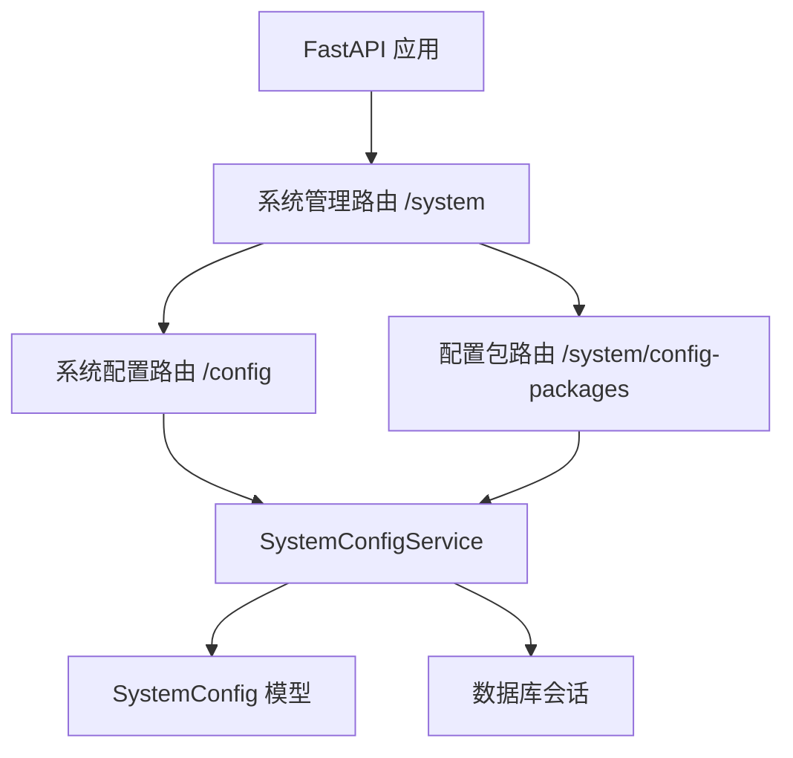
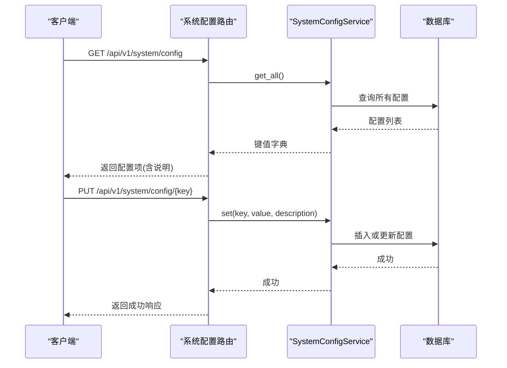
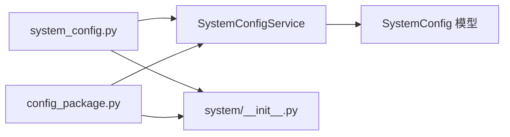

# 系统配置API

<cite>
**本文引用的文件**
- [backend/app/api/v1/system/system_config.py](file://backend/app/api/v1/system/system_config.py)
- [backend/app/api/v1/system/config_package.py](file://backend/app/api/v1/system/config_package.py)
- [backend/app/services/system_config_service.py](file://backend/app/services/system_config_service.py)
- [backend/app/models/system_config.py](file://backend/app/models/system_config.py)
- [backend/app/api/v1/system/__init__.py](file://backend/app/api/v1/system/__init__.py)
- [backend/tests/unit/test_system_config_api_cov.py](file://backend/tests/unit/test_system_config_api_cov.py)
- [backend/tests/unit/test_config_package.py](file://backend/tests/unit/test_config_package.py)
</cite>

## 目录
1. [简介](#简介)
2. [项目结构](#项目结构)
3. [核心组件](#核心组件)
4. [架构总览](#架构总览)
5. [详细组件分析](#详细组件分析)
6. [依赖关系分析](#依赖关系分析)
7. [性能考虑](#性能考虑)
8. [故障排查指南](#故障排查指南)
9. [结论](#结论)
10. [附录：API 规范与示例](#附录api-规范与示例)

## 简介
本文件为“系统配置API”的完整技术文档，覆盖以下能力：
- 系统参数配置：查询、更新、删除、批量更新、导出/导入
- 配置包管理：导出当前配置为包、导入配置包、列出/删除配置包
- 系统初始化配置：默认配置项、初始化标志、版本信息
- 动态配置更新：运行时通过接口即时生效（配合服务层缓存刷新）
- 配置版本管理：以配置包形式记录快照，支持回滚与迁移
- 数据结构、验证规则与安全限制：权限控制、输入校验、错误码
- 高级功能：备份恢复、批量操作的使用指南

## 项目结构
系统配置相关代码主要分布在以下模块：
- API路由层：定义HTTP端点、请求/响应模型、权限校验
- 服务层：封装配置读写、默认值、导入导出、初始化等逻辑
- 数据模型：持久化配置表及更新日志表
- 路由注册：将子路由挂载到统一前缀下

图表来源
- [backend/app/api/v1/system/__init__.py:33-155](file://backend/app/api/v1/system/__init__.py#L33-L155)
- [backend/app/api/v1/system/system_config.py:21-281](file://backend/app/api/v1/system/system_config.py#L21-L281)
- [backend/app/api/v1/system/config_package.py:23-226](file://backend/app/api/v1/system/config_package.py#L23-L226)
- [backend/app/services/system_config_service.py:68-266](file://backend/app/services/system_config_service.py#L68-L266)
- [backend/app/models/system_config.py:11-51](file://backend/app/models/system_config.py#L11-L51)

章节来源
- [backend/app/api/v1/system/__init__.py:33-155](file://backend/app/api/v1/system/__init__.py#L33-L155)

## 核心组件
- SystemConfigService：提供配置的读取、写入、批量导入导出、默认值初始化、布尔/整数/JSON类型转换、是否已初始化判断等。
- SystemConfig 模型：持久化键值对配置，包含创建/更新时间戳。
- system_config 路由：暴露系统参数的CRUD、批量更新、导出/导入、默认值查询。
- config_package 路由：提供配置包的导出、导入、列表、删除。

章节来源
- [backend/app/services/system_config_service.py:68-266](file://backend/app/services/system_config_service.py#L68-L266)
- [backend/app/models/system_config.py:11-51](file://backend/app/models/system_config.py#L11-L51)
- [backend/app/api/v1/system/system_config.py:21-281](file://backend/app/api/v1/system/system_config.py#L21-L281)
- [backend/app/api/v1/system/config_package.py:23-226](file://backend/app/api/v1/system/config_package.py#L23-L226)

## 架构总览
系统配置API采用分层设计：
- 路由层：接收HTTP请求，进行参数校验与权限检查，调用服务层
- 服务层：实现业务逻辑（默认值合并、类型转换、事务提交、导入导出）
- 数据层：通过ORM访问数据库，持久化配置与日志

图表来源
- [backend/app/api/v1/system/system_config.py:46-242](file://backend/app/api/v1/system/system_config.py#L46-L242)
- [backend/app/services/system_config_service.py:100-189](file://backend/app/services/system_config_service.py#L100-L189)

## 详细组件分析

### 系统配置路由（/api/v1/system/config）
- 获取所有配置：GET /config
  - 权限：需登录
  - 响应：包含每个配置的 key、value、description
- 批量更新配置：PUT /config
  - 权限：管理员
  - 请求体：configs 数组，每项包含 key、value、description
  - 响应：返回更新的键列表
- 导出配置为JSON：GET /config/export/json
  - 权限：需登录
  - 响应：JSON字符串形式的配置内容
- 从JSON导入配置：POST /config/import/json
  - 权限：管理员
  - 请求体：data 字段为JSON字符串
  - 响应：导入成功提示
- 获取默认配置：GET /config/defaults
  - 无需鉴权
  - 响应：默认键值与说明
- 获取指定配置：GET /config/{key}
  - 权限：需登录
  - 响应：key、value、description；不存在返回404
- 更新指定配置：PUT /config/{key}?value=...&description=...
  - 权限：管理员
  - 响应：更新成功
- 删除指定配置：DELETE /config/{key}
  - 权限：管理员
  - 行为：不允许删除核心默认配置；不存在返回404

章节来源
- [backend/app/api/v1/system/system_config.py:46-281](file://backend/app/api/v1/system/system_config.py#L46-L281)

### 配置包管理路由（/api/v1/system/config-packages）
- 列出配置包：GET /system/config-packages
  - 权限：需登录
  - 响应：packages 列表与总数
- 导出配置包：POST /system/config-packages/export
  - 权限：管理员
  - 请求体：name、description、include_defaults
  - 行为：生成包含元数据与配置的包，并保存为系统配置项（以特定键命名）
  - 响应：包对象（含 name、version、created_at、created_by、config_count、configs、include_defaults）
- 导入配置包：POST /system/config-packages/import
  - 权限：超级管理员
  - 请求体：data（JSON字符串）、overwrite（是否覆盖已有）
  - 行为：解析包中的 configs，按 overwrite 决定是否跳过已有键
  - 响应：导入数量、跳过数量、包名与版本
- 删除配置包：DELETE /system/config-packages/{package_name}
  - 权限：超级管理员
  - 行为：根据包名删除对应配置项
  - 响应：删除成功提示

章节来源
- [backend/app/api/v1/system/config_package.py:53-226](file://backend/app/api/v1/system/config_package.py#L53-L226)

### 服务层（SystemConfigService）
- 默认配置：内置一组关键系统参数（如系统标识、组织ID、初始化标志、备份策略、异常检测阈值、系统版本等）
- 读取：支持 get/get_int/get_bool/get_json，自动处理类型转换与默认值
- 写入：set 方法统一转换为字符串存储，支持描述更新，使用事务提交
- 初始化：initialize_defaults 在数据库为空时填充默认配置
- 导入导出：export_config 输出JSON字符串；import_config 解析并逐条设置
- 生命周期：reload 用于清理会话缓存

章节来源
- [backend/app/services/system_config_service.py:72-266](file://backend/app/services/system_config_service.py#L72-L266)

### 数据模型
- SystemConfig：id、key（唯一索引）、value（文本）、description、created_at、updated_at
- SystemUpdateLog：id、version、description、updated_by、created_at（用于系统更新日志）

章节来源
- [backend/app/models/system_config.py:11-51](file://backend/app/models/system_config.py#L11-L51)

## 依赖关系分析
- 路由依赖服务层：system_config.py 与 config_package.py 均依赖 SystemConfigService
- 服务层依赖模型与数据库：通过 SQLAlchemy Session 访问 SystemConfig 表
- 路由注册：system/__init__.py 将 system_config 与 config_package 路由挂载到 /system 前缀下

图表来源
- [backend/app/api/v1/system/system_config.py:14-17](file://backend/app/api/v1/system/system_config.py#L14-L17)
- [backend/app/api/v1/system/config_package.py:16-19](file://backend/app/api/v1/system/config_package.py#L16-L19)
- [backend/app/api/v1/system/__init__.py:70-155](file://backend/app/api/v1/system/__init__.py#L70-L155)
- [backend/app/services/system_config_service.py:10-12](file://backend/app/services/system_config_service.py#L10-L12)
- [backend/app/models/system_config.py:8-27](file://backend/app/models/system_config.py#L8-L27)

章节来源
- [backend/app/api/v1/system/__init__.py:70-155](file://backend/app/api/v1/system/__init__.py#L70-L155)

## 性能考虑
- 批量更新：通过一次请求更新多个配置项，减少网络往返与事务开销
- 导入导出：服务层将配置序列化为JSON字符串，避免多次单条写入
- 类型转换：在服务层集中处理布尔/整型/JSON转换，降低路由层复杂度
- 缓存刷新：reload 可清空会话缓存，确保后续读取最新配置

[本节为通用指导，不直接分析具体文件]

## 故障排查指南
- 401 未认证：访问受保护端点需提供有效令牌
- 403 禁止：非管理员尝试修改配置或导入/删除配置包
- 400 参数无效：导入JSON格式错误或缺少必要字段；尝试删除核心默认配置
- 404 资源不存在：查询的配置项不存在；删除的配置包不存在
- 500 服务器错误：数据库或服务层异常，查看日志定位

章节来源
- [backend/tests/unit/test_system_config_api_cov.py:49-137](file://backend/tests/unit/test_system_config_api_cov.py#L49-L137)
- [backend/tests/unit/test_config_package.py:14-253](file://backend/tests/unit/test_config_package.py#L14-L253)

## 结论
系统配置API提供了完整的系统参数管理能力，包括基础CRUD、批量操作、导入导出以及配置包版本化管理。通过严格的权限控制与输入校验，保障配置的安全性与一致性。服务层抽象了默认值、类型转换与事务提交，便于扩展与维护。

[本节为总结性内容，不直接分析具体文件]

## 附录：API 规范与示例

### 端点清单
- GET /api/v1/system/config
  - 描述：获取所有系统配置
  - 权限：登录用户
  - 响应：items 列表，每项包含 key、value、description；total 总数
- PUT /api/v1/system/config
  - 描述：批量更新配置
  - 权限：管理员
  - 请求体：{ "configs": [{ "key": "...", "value": "...", "description": "..." }] }
  - 响应：{ "success": true, "message": "...", "data": { "updated_keys": [...] } }
- GET /api/v1/system/config/export/json
  - 描述：导出配置为JSON字符串
  - 权限：登录用户
  - 响应：{ "success": true, "data": { "format": "json", "content": "..." } }
- POST /api/v1/system/config/import/json
  - 描述：从JSON导入配置
  - 权限：管理员
  - 请求体：{ "data": "{ ... }" }
  - 响应：{ "success": true, "message": "配置导入成功" }
- GET /api/v1/system/config/defaults
  - 描述：获取默认配置项
  - 权限：无需鉴权
  - 响应：{ "success": true, "data": { "defaults": [...], "total": N } }
- GET /api/v1/system/config/{key}
  - 描述：获取指定配置
  - 权限：登录用户
  - 响应：{ "success": true, "data": { "key": "...", "value": "...", "description": "..." } }
- PUT /api/v1/system/config/{key}?value=...&description=...
  - 描述：更新指定配置
  - 权限：管理员
  - 响应：{ "success": true, "message": "配置项 '...' 已更新", "data": { "key": "...", "value": "..." } }
- DELETE /api/v1/system/config/{key}
  - 描述：删除指定配置
  - 权限：管理员
  - 响应：{ "success": true, "message": "配置项 '...' 已删除" }

- GET /api/v1/system/config-packages
  - 描述：列出配置包
  - 权限：登录用户
  - 响应：{ "success": true, "data": { "packages": [...], "total": N } }
- POST /api/v1/system/config-packages/export
  - 描述：导出当前配置为配置包
  - 权限：管理员
  - 请求体：{ "name": "...", "description": "...", "include_defaults": false }
  - 响应：{ "success": true, "message": "...", "data": { "name": "...", "version": "1.0", "created_at": "...", "created_by": "...", "config_count": N, "configs": {...}, "include_defaults": bool } }
- POST /api/v1/system/config-packages/import
  - 描述：导入配置包
  - 权限：超级管理员
  - 请求体：{ "data": "{ ... }", "overwrite": true }
  - 响应：{ "success": true, "message": "配置包导入完成...", "data": { "imported_count": N, "skipped_count": N, "package_name": "...", "package_version": "..." } }
- DELETE /api/v1/system/config-packages/{package_name}
  - 描述：删除配置包
  - 权限：超级管理员
  - 响应：{ "success": true, "message": "配置包 '...' 已删除" }

### 数据结构与验证规则
- 配置项结构：
  - key：字符串，唯一键
  - value：字符串（服务层会转换布尔/整型/JSON为字符串存储）
  - description：可选字符串，配置说明
- 验证规则：
  - 导入JSON必须合法且包含 configs 字段
  - 不允许删除核心默认配置项
  - 批量更新需管理员权限
  - 配置包导入/删除需超级管理员权限
- 安全限制：
  - 敏感操作（写/删/导入/导出包）需要管理员或超级管理员角色
  - 所有写操作记录工作日志，便于审计追踪

章节来源
- [backend/app/api/v1/system/system_config.py:26-41](file://backend/app/api/v1/system/system_config.py#L26-L41)
- [backend/app/api/v1/system/system_config.py:69-159](file://backend/app/api/v1/system/system_config.py#L69-L159)
- [backend/app/api/v1/system/system_config.py:182-281](file://backend/app/api/v1/system/system_config.py#L182-L281)
- [backend/app/api/v1/system/config_package.py:28-48](file://backend/app/api/v1/system/config_package.py#L28-L48)
- [backend/app/api/v1/system/config_package.py:78-226](file://backend/app/api/v1/system/config_package.py#L78-L226)
- [backend/app/services/system_config_service.py:155-189](file://backend/app/services/system_config_service.py#L155-L189)

### 系统初始化配置
- 初始化标志：initialized（布尔），用于判断系统是否已完成初始化
- 系统标识：system_id（字符串），自动生成或手动设置
- 组织标识：organization_id（字符串），关联当前组织
- 系统版本：system_version（字符串），来自应用配置

章节来源
- [backend/app/services/system_config_service.py:72-95](file://backend/app/services/system_config_service.py#L72-L95)
- [backend/app/services/system_config_service.py:220-234](file://backend/app/services/system_config_service.py#L220-L234)

### 动态配置更新
- 通过PUT /config/{key} 或 PUT /config 批量更新后，服务层立即持久化
- 可通过 reload 清理会话缓存，确保后续读取最新值

章节来源
- [backend/app/api/v1/system/system_config.py:207-242](file://backend/app/api/v1/system/system_config.py#L207-L242)
- [backend/app/services/system_config_service.py:246-251](file://backend/app/services/system_config_service.py#L246-L251)

### 配置版本管理（配置包）
- 导出包：包含名称、描述、版本、创建时间、创建人、配置计数、实际配置内容与是否包含默认项
- 导入包：支持覆盖或跳过已有键，返回导入与跳过统计
- 删除包：按包名删除对应配置项

章节来源
- [backend/app/api/v1/system/config_package.py:78-226](file://backend/app/api/v1/system/config_package.py#L78-L226)

### 备份恢复与批量操作指南
- 备份恢复：
  - 使用导出JSON或配置包进行备份
  - 通过导入JSON或配置包进行恢复
- 批量操作：
  - 使用批量更新接口一次性修改多个配置项
  - 注意管理员权限与日志记录

章节来源
- [backend/app/api/v1/system/system_config.py:69-159](file://backend/app/api/v1/system/system_config.py#L69-L159)
- [backend/app/api/v1/system/config_package.py:78-190](file://backend/app/api/v1/system/config_package.py#L78-L190)