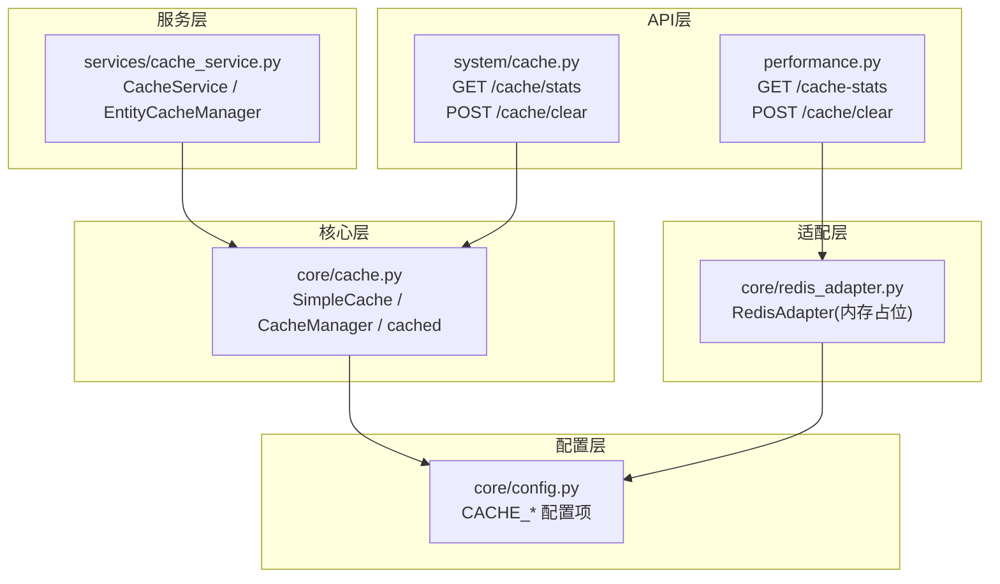
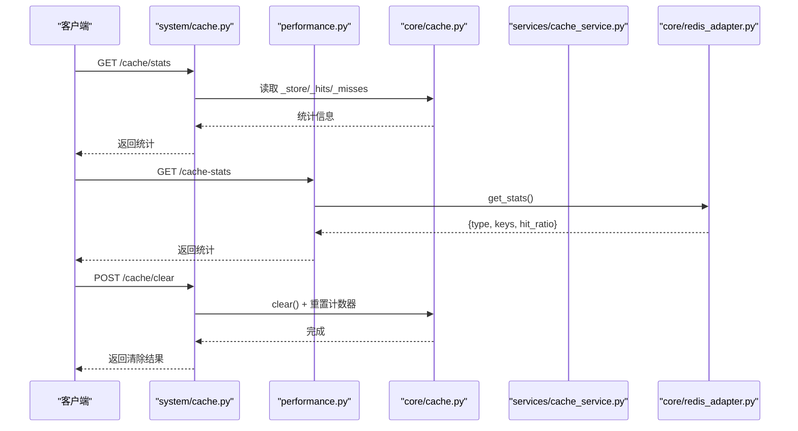
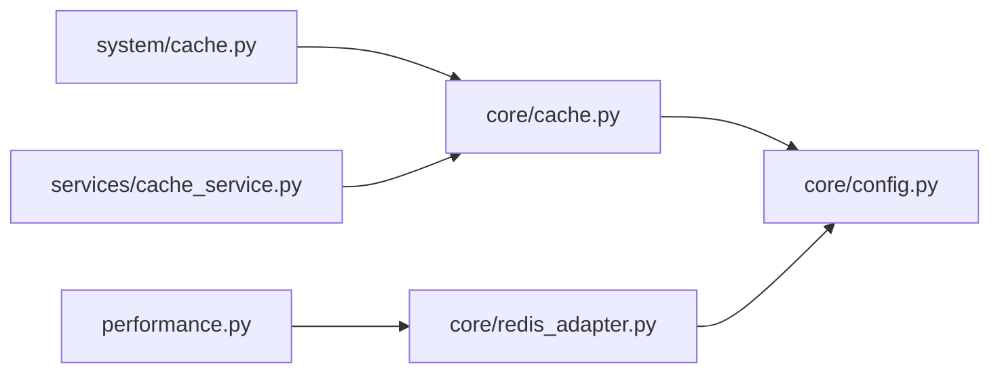

# 缓存管理API

<cite>
**本文引用的文件**
- [backend/app/api/v1/system/cache.py](file://backend/app/api/v1/system/cache.py)
- [backend/app/core/cache.py](file://backend/app/core/cache.py)
- [backend/app/services/cache_service.py](file://backend/app/services/cache_service.py)
- [backend/app/core/redis_adapter.py](file://backend/app/core/redis_adapter.py)
- [backend/app/core/config.py](file://backend/app/core/config.py)
- [backend/app/api/v1/performance.py](file://backend/app/api/v1/performance.py)
</cite>

## 目录
1. [简介](#简介)
2. [项目结构](#项目结构)
3. [核心组件](#核心组件)
4. [架构总览](#架构总览)
5. [详细组件分析](#详细组件分析)
6. [依赖关系分析](#依赖关系分析)
7. [性能考量](#性能考量)
8. [故障排查指南](#故障排查指南)
9. [结论](#结论)
10. [附录：接口规范与最佳实践](#附录接口规范与最佳实践)

## 简介
本文件面向“缓存管理API”的完整说明，覆盖缓存数据查看、清理、预热、统计等操作的接口规范；并给出缓存策略配置、内存使用监控、命中率统计、键命名规范、过期策略、分布式缓存同步机制（当前为单机内存适配器）以及优化建议、故障排查和性能调优实践。

## 项目结构
与缓存相关的代码主要分布在以下模块：
- API层：系统级缓存管理路由、性能监控路由
- 核心层：内存缓存实现、异步包装器、装饰器
- 服务层：高级缓存服务（统计、失效、预热、实体缓存管理器）
- 适配层：Redis适配器（离线模式下的内存占位实现）
- 配置层：缓存开关、默认TTL、最大容量等

图表来源
- [backend/app/api/v1/system/cache.py:23-99](file://backend/app/api/v1/system/cache.py#L23-L99)
- [backend/app/core/cache.py:14-137](file://backend/app/core/cache.py#L14-L137)
- [backend/app/services/cache_service.py:37-477](file://backend/app/services/cache_service.py#L37-L477)
- [backend/app/core/redis_adapter.py:7-43](file://backend/app/core/redis_adapter.py#L7-L43)
- [backend/app/core/config.py:181-183](file://backend/app/core/config.py#L181-L183)

章节来源
- [backend/app/api/v1/system/cache.py:23-99](file://backend/app/api/v1/system/cache.py#L23-L99)
- [backend/app/core/cache.py:14-137](file://backend/app/core/cache.py#L14-L137)
- [backend/app/services/cache_service.py:37-477](file://backend/app/services/cache_service.py#L37-L477)
- [backend/app/core/redis_adapter.py:7-43](file://backend/app/core/redis_adapter.py#L7-L43)
- [backend/app/core/config.py:181-183](file://backend/app/core/config.py#L181-L183)

## 核心组件
- SimpleCache：线程安全的进程内内存缓存，支持按Key的TTL、容量淘汰、前缀删除、清空。
- CacheManager：对SimpleCache的异步封装，提供await风格的get/set/delete/clear等。
- CacheService：业务级缓存服务，提供命中/未命中统计、相关缓存失效、批量预热、装饰器辅助等。
- RedisAdapter：离线部署时的内存占位实现，提供统一接口（get/set/delete/flush/stats/health_check）。
- 配置项：CACHE_ENABLED、CACHE_DEFAULT_TTL、CACHE_MAX_SIZE等。

章节来源
- [backend/app/core/cache.py:14-137](file://backend/app/core/cache.py#L14-L137)
- [backend/app/services/cache_service.py:37-226](file://backend/app/services/cache_service.py#L37-L226)
- [backend/app/core/redis_adapter.py:7-43](file://backend/app/core/redis_adapter.py#L7-L43)
- [backend/app/core/config.py:181-183](file://backend/app/core/config.py#L181-L183)

## 架构总览
系统采用“API层 -> 服务层 -> 核心缓存 -> 适配层”的分层设计。系统级缓存管理API直接操作核心缓存；性能监控API在离线模式下通过RedisAdapter访问内存占位缓存；服务层提供统一的统计、失效、预热能力。

图表来源
- [backend/app/api/v1/system/cache.py:23-99](file://backend/app/api/v1/system/cache.py#L23-L99)
- [backend/app/api/v1/performance.py:80-118](file://backend/app/api/v1/performance.py#L80-L118)
- [backend/app/core/cache.py:72-95](file://backend/app/core/cache.py#L72-L95)
- [backend/app/core/redis_adapter.py:30-40](file://backend/app/core/redis_adapter.py#L30-L40)

## 详细组件分析

### 系统级缓存管理API（/api/v1/cache）
- GET /api/v1/cache/stats
  - 功能：获取内存缓存统计（键数量、最大容量、命中/未命中次数、命中率、估算大小、后端类型）。
  - 权限：登录用户（内部鉴权），管理员可执行更敏感操作。
  - 数据来源：core/cache.py 中的 default_cache._store/_hits/_misses/_max_size。
  - 响应字段：item_count、max_size、hits、misses、total_requests、hit_rate、estimated_size_bytes、estimated_size_mb、backend_type。
- POST /api/v1/cache/clear
  - 功能：清除全部内存缓存并重置命中/未命中计数。
  - 权限：需要管理员权限（require_admin）。
  - 行为：调用 cache_manager.clear()，并将 default_cache._hits/_misses 归零。
  - 响应字段：cleared_keys、timestamp。

章节来源
- [backend/app/api/v1/system/cache.py:23-99](file://backend/app/api/v1/system/cache.py#L23-L99)

### 性能监控缓存API（/api/v1/performance）
- GET /api/v1/performance/cache-stats
  - 功能：获取缓存统计与健康状态（离线模式下由RedisAdapter提供内存指标）。
  - 权限：仅超级管理员。
  - 数据来源：redis_adapter.get_stats()、redis_adapter.health_check()。
- POST /api/v1/performance/cache/clear
  - 功能：清空缓存（离线模式下调用 redis_adapter.clear()/flush）。
  - 权限：仅超级管理员。

章节来源
- [backend/app/api/v1/performance.py:80-118](file://backend/app/api/v1/performance.py#L80-L118)
- [backend/app/core/redis_adapter.py:30-40](file://backend/app/core/redis_adapter.py#L30-L40)

### 核心缓存实现（SimpleCache / CacheManager）
- SimpleCache
  - 线程安全：内部使用锁保护读写。
  - TTL：每个Key独立过期时间，读取时自动清理过期条目。
  - 容量控制：超过最大容量时按插入顺序淘汰最早条目。
  - 前缀删除：delete_by_prefix(prefix) 删除所有以prefix开头的键。
- CacheManager
  - 提供异步方法：get/set/delete/delete_by_prefix/clear/close。
  - 代理到SimpleCache，便于在异步环境中使用。

章节来源
- [backend/app/core/cache.py:14-95](file://backend/app/core/cache.py#L14-L95)

### 高级缓存服务（CacheService / 装饰器 / 实体缓存管理器）
- CacheService
  - 统计：维护 hits/misses/sets/deletes 计数。
  - 失效：invalidate_related_cache(resource_type, resource_id) 批量失效资源相关缓存（单条、列表、统计）。
  - 预热：warm_up_cache(data_loader, keys) 批量预热指定键。
- 装饰器
  - @cached(ttl, key_prefix, key_func)：异步函数缓存。
  - @cache_result(ttl, key_generator)：同步/异步通用结果缓存。
  - @cache_invalidate(resource_type, resource_id_arg)：写操作后自动失效相关缓存。
- EntityCacheManager
  - 统一实体缓存操作：get/set/invalidate/invalidate_all，默认TTL=600秒。

章节来源
- [backend/app/services/cache_service.py:37-477](file://backend/app/services/cache_service.py#L37-L477)

### 配置项（缓存开关、默认TTL、最大容量）
- CACHE_ENABLED：是否启用缓存（默认True）。
- CACHE_DEFAULT_TTL：默认缓存过期时间（秒，默认3600）。
- CACHE_MAX_SIZE：内存缓存最大键数（默认10000）。

章节来源
- [backend/app/core/config.py:181-183](file://backend/app/core/config.py#L181-L183)

## 依赖关系分析
- system/cache.py 依赖 core/cache.py 的 default_cache 与 cache_manager，用于统计与清理。
- performance.py 依赖 core/redis_adapter.py 的 RedisAdapter，用于统计与健康检查。
- services/cache_service.py 依赖 core/cache.py 的 cache_manager，并提供上层业务语义（失效、预热、统计）。
- 所有模块均受 core/config.py 中缓存配置影响。

图表来源
- [backend/app/api/v1/system/cache.py:12-16](file://backend/app/api/v1/system/cache.py#L12-L16)
- [backend/app/api/v1/performance.py:92-110](file://backend/app/api/v1/performance.py#L92-L110)
- [backend/app/services/cache_service.py:13-14](file://backend/app/services/cache_service.py#L13-L14)
- [backend/app/core/cache.py:9-10](file://backend/app/core/cache.py#L9-L10)
- [backend/app/core/redis_adapter.py:1-4](file://backend/app/core/redis_adapter.py#L1-L4)

## 性能考量
- 命中率计算：系统级API基于 hits/(hits+misses) 计算命中率；当无请求时为0%。
- 内存占用估算：通过遍历_store计算键值对象大小之和，得到字节与MB近似值。
- 容量淘汰：达到最大容量时优先淘汰最早插入的键，避免无限增长。
- TTL策略：读路径自动清理过期键，减少无效数据占用。
- 并发安全：SimpleCache使用线程锁保证一致性。
- 预热：通过批量预热降低冷启动或热点数据首次访问延迟。

[本节为通用性能讨论，不直接分析具体文件]

## 故障排查指南
- 无法获取缓存统计
  - 现象：GET /cache/stats 返回错误。
  - 可能原因：后端异常、存储不可用。
  - 处理：检查日志、确认default_cache可用；必要时重启服务。
- 清除缓存失败
  - 现象：POST /cache/clear 报错。
  - 可能原因：权限不足、底层clear失败。
  - 处理：确认管理员权限；重试；检查日志。
- 性能监控API返回空命中率
  - 现象：/performance/cache-stats 中 hit_ratio 为空。
  - 原因：离线模式下RedisAdapter不统计命中。
  - 处理：使用系统级API查看命中率；或接入真实Redis。
- 缓存未生效
  - 现象：接口仍走数据库。
  - 可能原因：TTL过短、键冲突、未设置缓存、装饰器未使用。
  - 处理：检查key生成逻辑、TTL、装饰器使用位置；验证是否存在对应键。

章节来源
- [backend/app/api/v1/system/cache.py:23-99](file://backend/app/api/v1/system/cache.py#L23-L99)
- [backend/app/api/v1/performance.py:80-118](file://backend/app/api/v1/performance.py#L80-L118)
- [backend/app/core/redis_adapter.py:30-40](file://backend/app/core/redis_adapter.py#L30-L40)

## 结论
本缓存体系提供了清晰的API入口、完善的内存缓存实现、业务级统计与失效能力，并在离线场景下通过RedisAdapter保持接口一致。结合合理的键命名、TTL策略与预热机制，可有效提升系统性能与稳定性。生产环境建议接入真实Redis以实现分布式缓存与更丰富的统计能力。

[本节为总结性内容，不直接分析具体文件]

## 附录：接口规范与最佳实践

### 接口清单
- GET /api/v1/cache/stats
  - 描述：获取内存缓存统计（键数、命中率、估算大小等）。
  - 权限：登录用户。
  - 响应：包含 item_count、max_size、hits、misses、total_requests、hit_rate、estimated_size_bytes、estimated_size_mb、backend_type。
- POST /api/v1/cache/clear
  - 描述：清除全部内存缓存并重置统计。
  - 权限：管理员。
  - 响应：包含 cleared_keys、timestamp。
- GET /api/v1/performance/cache-stats
  - 描述：获取缓存统计与健康状态（离线模式由RedisAdapter提供）。
  - 权限：超级管理员。
  - 响应：包含 stats、health。
- POST /api/v1/performance/cache/clear
  - 描述：清空缓存（离线模式调用RedisAdapter flush）。
  - 权限：超级管理员。
  - 响应：成功或错误消息。

章节来源
- [backend/app/api/v1/system/cache.py:23-99](file://backend/app/api/v1/system/cache.py#L23-L99)
- [backend/app/api/v1/performance.py:80-118](file://backend/app/api/v1/performance.py#L80-L118)

### 缓存策略配置
- 开关：CACHE_ENABLED（默认开启）。
- 默认TTL：CACHE_DEFAULT_TTL（默认3600秒）。
- 容量上限：CACHE_MAX_SIZE（默认10000）。
- 实体缓存默认TTL：EntityCacheManager.DEFAULT_TTL（600秒）。

章节来源
- [backend/app/core/config.py:181-183](file://backend/app/core/config.py#L181-L183)
- [backend/app/services/cache_service.py:441-445](file://backend/app/services/cache_service.py#L441-L445)

### 内存使用监控
- 系统级API提供 estimated_size_bytes/MB，便于监控内存占用趋势。
- 性能监控API在离线模式下提供keys数量与健康状态。

章节来源
- [backend/app/api/v1/system/cache.py:40-56](file://backend/app/api/v1/system/cache.py#L40-L56)
- [backend/app/core/redis_adapter.py:30-40](file://backend/app/core/redis_adapter.py#L30-L40)

### 缓存命中率统计
- 系统级API基于 hits/(hits+misses) 计算命中率。
- 性能监控API在离线模式下不提供命中率（hit_ratio为空）。

章节来源
- [backend/app/api/v1/system/cache.py:35-38](file://backend/app/api/v1/system/cache.py#L35-L38)
- [backend/app/core/redis_adapter.py:30-36](file://backend/app/core/redis_adapter.py#L30-L36)

### 缓存键命名规范
- 推荐格式：资源类型:标识[:子维度]
  - 示例：user:123、village:list、data:report:2024、stats:village
- 前缀约定：
  - user:、village:、data:、api:、stats:
- 复杂参数：使用MD5哈希作为参数片段，避免过长或不稳定键。

章节来源
- [backend/app/services/cache_service.py:29-34](file://backend/app/services/cache_service.py#L29-L34)
- [backend/app/services/cache_service.py:229-256](file://backend/app/services/cache_service.py#L229-L256)

### 过期策略
- 单Key TTL：SimpleCache支持按Key设置过期时间，读取时自动清理。
- 默认TTL：未显式设置时使用配置的默认值。
- 容量淘汰：达到上限时淘汰最早插入的键。

章节来源
- [backend/app/core/cache.py:24-42](file://backend/app/core/cache.py#L24-L42)
- [backend/app/core/cache.py:63-69](file://backend/app/core/cache.py#L63-L69)
- [backend/app/core/config.py:181-183](file://backend/app/core/config.py#L181-L183)

### 分布式缓存同步机制
- 当前为单机内存缓存，无跨进程/节点同步。
- 如需分布式缓存，请替换RedisAdapter为真实Redis实现，并确保写操作后失效相关键（可使用cache_invalidate装饰器或手动失效）。

章节来源
- [backend/app/core/redis_adapter.py:7-43](file://backend/app/core/redis_adapter.py#L7-L43)
- [backend/app/services/cache_service.py:362-403](file://backend/app/services/cache_service.py#L362-L403)

### 缓存优化建议
- 合理设置TTL：热点数据使用较长TTL，频繁变化数据使用较短TTL。
- 批量预热：启动或定时任务预热关键键，降低首访延迟。
- 精准失效：写操作后仅失效相关键，避免全量清理。
- 监控命中率：持续观察命中率与内存占用，动态调整TTL与容量。
- 避免大对象：缓存过大对象会显著增加内存压力，考虑分页或序列化压缩。

[本节为通用优化建议，不直接分析具体文件]

### 故障排查方法
- 定位问题：通过系统级API查看命中率与内存占用，结合日志定位异常。
- 权限问题：确认调用者具备相应权限（管理员/超级管理员）。
- 缓存不一致：确保写操作后调用失效逻辑（装饰器或手动失效）。
- 性能回退：检查是否出现大量未命中或缓存穿透，考虑加布隆过滤器或空值缓存。

章节来源
- [backend/app/api/v1/system/cache.py:23-99](file://backend/app/api/v1/system/cache.py#L23-L99)
- [backend/app/services/cache_service.py:150-186](file://backend/app/services/cache_service.py#L150-L186)