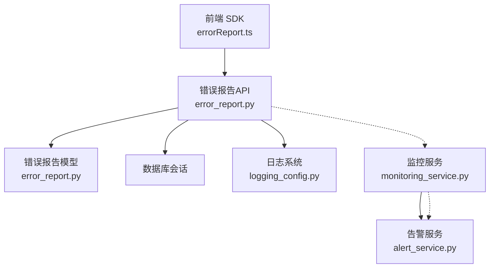
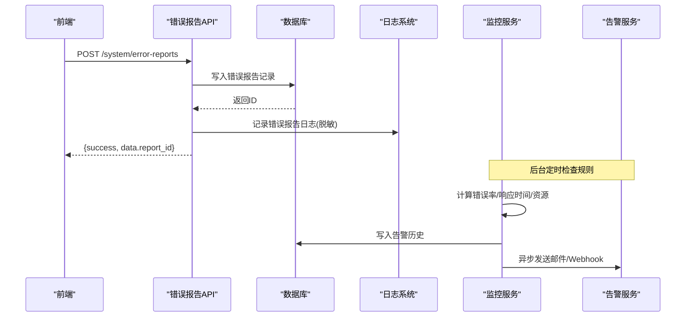
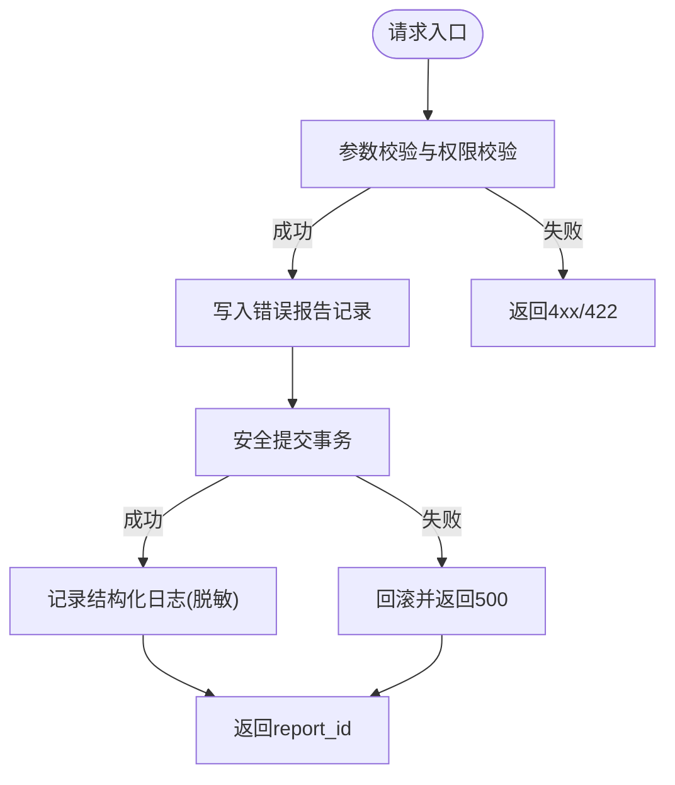
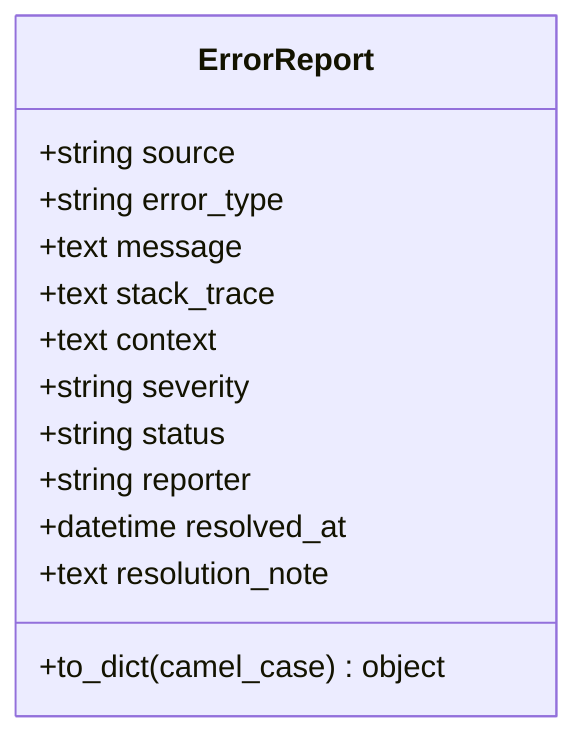
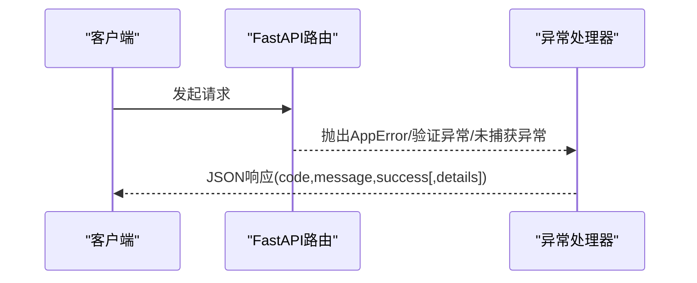
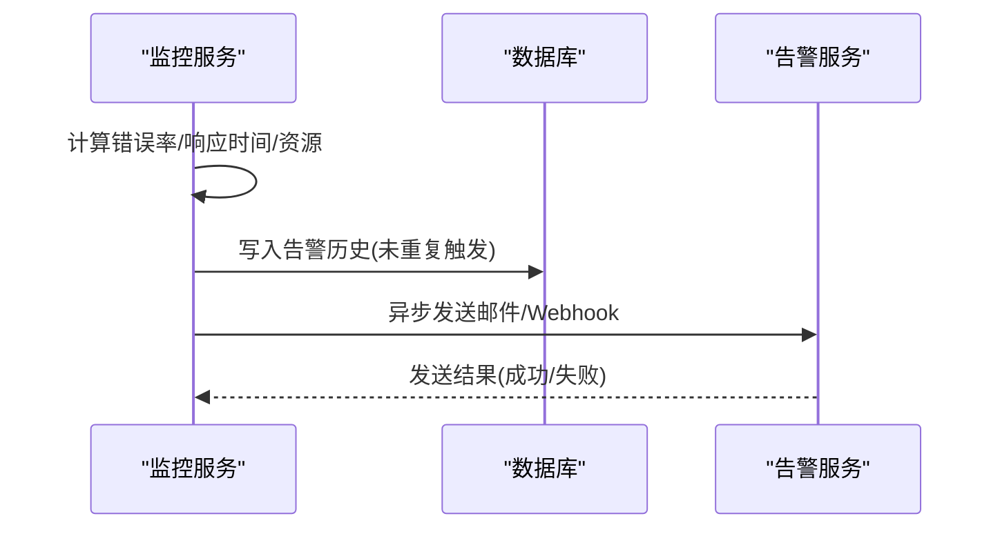
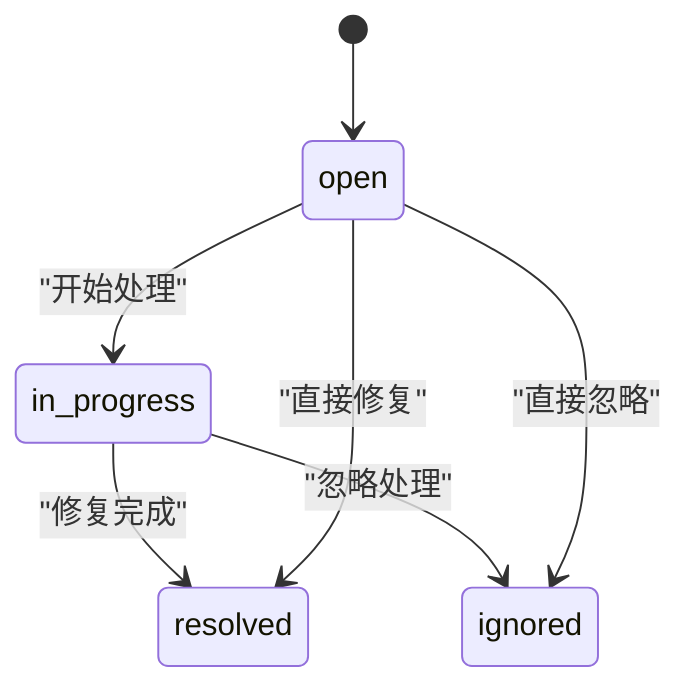
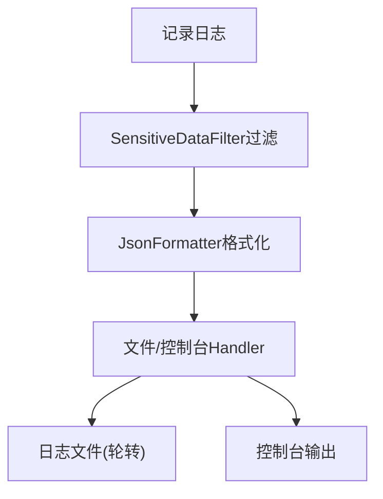
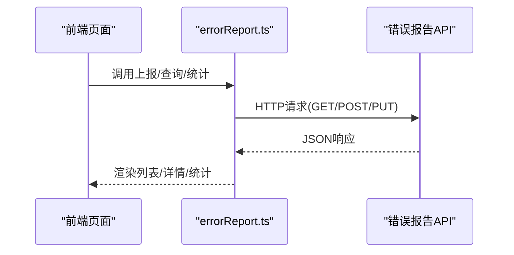
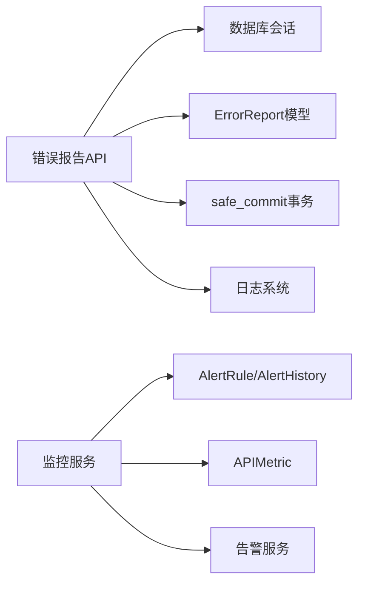

# 错误报告API

<cite>
**本文引用的文件**
- [backend/app/api/v1/system/error_report.py](file://backend/app/api/v1/system/error_report.py)
- [backend/app/models/error_report.py](file://backend/app/models/error_report.py)
- [backend/app/core/exceptions.py](file://backend/app/core/exceptions.py)
- [backend/app/core/errors.py](file://backend/app/core/errors.py)
- [backend/app/core/error_handler.py](file://backend/app/core/error_handler.py)
- [backend/app/services/alert_service.py](file://backend/app/services/alert_service.py)
- [backend/app/services/monitoring_service.py](file://backend/app/services/monitoring_service.py)
- [backend/app/core/logging_config.py](file://backend/app/core/logging_config.py)
- [frontend/src/api/errorReport.ts](file://frontend/src/api/errorReport.ts)
</cite>

## 目录
1. [简介](#简介)
2. [项目结构](#项目结构)
3. [核心组件](#核心组件)
4. [架构总览](#架构总览)
5. [详细组件分析](#详细组件分析)
6. [依赖关系分析](#依赖关系分析)
7. [性能考虑](#性能考虑)
8. [故障排查指南](#故障排查指南)
9. [结论](#结论)
10. [附录](#附录)

## 简介
本文件为“错误报告API”的完整技术文档，覆盖异常捕获、错误上报、堆栈跟踪、错误分类、错误聚合统计、告警通知、错误修复跟踪等能力。文档同时说明结构化日志格式、敏感信息脱敏、严重性分级策略，以及与外部监控系统的集成配置和最佳实践。

## 项目结构
错误报告相关能力由以下模块协作实现：
- API层：提供错误上报、列表查询、详情获取、状态更新、简化异常上报与统计接口
- 数据模型：持久化错误报告记录（来源、类型、消息、堆栈、上下文、严重性、状态、处理备注等）
- 异常与错误码：统一异常类型、错误码定义与全局异常处理器
- 监控与告警：规则检查、阈值触发、邮件/Webhook通知
- 日志系统：结构化JSON日志、轮转、敏感信息脱敏
- 前端SDK：封装错误上报、查询、统计等调用

**图表来源**
- [backend/app/api/v1/system/error_report.py:1-260](file://backend/app/api/v1/system/error_report.py#L1-L260)
- [backend/app/models/error_report.py:1-36](file://backend/app/models/error_report.py#L1-L36)
- [backend/app/services/monitoring_service.py:1-312](file://backend/app/services/monitoring_service.py#L1-L312)
- [backend/app/services/alert_service.py:1-111](file://backend/app/services/alert_service.py#L1-L111)
- [backend/app/core/logging_config.py:1-274](file://backend/app/core/logging_config.py#L1-L274)
- [frontend/src/api/errorReport.ts:1-119](file://frontend/src/api/errorReport.ts#L1-L119)

**章节来源**
- [backend/app/api/v1/system/error_report.py:1-260](file://backend/app/api/v1/system/error_report.py#L1-L260)
- [backend/app/models/error_report.py:1-36](file://backend/app/models/error_report.py#L1-L36)
- [backend/app/core/logging_config.py:1-274](file://backend/app/core/logging_config.py#L1-L274)
- [frontend/src/api/errorReport.ts:1-119](file://frontend/src/api/errorReport.ts#L1-L119)

## 核心组件
- 错误报告API路由：提供POST/GET/PUT端点用于上报、查询、统计、详情与状态更新，以及简化异常上报
- 错误报告模型：定义错误报告实体字段及序列化方法（上下文JSON解析、驼峰转换）
- 异常与错误码：统一业务异常、验证异常、全局异常处理器；集中错误码与人类可读消息
- 监控与告警：按规则检查错误率/响应时间/资源使用，触发告警并发送邮件或Webhook
- 日志系统：结构化JSON输出、文件轮转、控制台彩色输出、敏感信息脱敏过滤器
- 前端SDK：封装错误上报、列表、统计、详情、状态更新与简化异常上报

**章节来源**
- [backend/app/api/v1/system/error_report.py:1-260](file://backend/app/api/v1/system/error_report.py#L1-L260)
- [backend/app/models/error_report.py:1-36](file://backend/app/models/error_report.py#L1-L36)
- [backend/app/core/exceptions.py:1-145](file://backend/app/core/exceptions.py#L1-L145)
- [backend/app/core/errors.py:1-176](file://backend/app/core/errors.py#L1-L176)
- [backend/app/services/monitoring_service.py:1-312](file://backend/app/services/monitoring_service.py#L1-L312)
- [backend/app/services/alert_service.py:1-111](file://backend/app/services/alert_service.py#L1-L111)
- [backend/app/core/logging_config.py:1-274](file://backend/app/core/logging_config.py#L1-L274)
- [frontend/src/api/errorReport.ts:1-119](file://frontend/src/api/errorReport.ts#L1-L119)

## 架构总览
错误报告API采用分层设计：
- 请求进入FastAPI路由，进行参数校验与权限校验
- 通过SQLAlchemy会话写入错误报告记录，并使用安全提交封装事务
- 写入成功后记录结构化日志（含敏感信息脱敏）
- 监控服务周期性检查指标规则，超过阈值时创建告警并异步发送通知
- 前端通过SDK调用后端API完成上报与查询

**图表来源**
- [backend/app/api/v1/system/error_report.py:49-87](file://backend/app/api/v1/system/error_report.py#L49-L87)
- [backend/app/services/monitoring_service.py:184-312](file://backend/app/services/monitoring_service.py#L184-L312)
- [backend/app/services/alert_service.py:23-111](file://backend/app/services/alert_service.py#L23-L111)
- [backend/app/core/logging_config.py:122-140](file://backend/app/core/logging_config.py#L122-L140)

## 详细组件分析

### 错误报告API端点
- 上报系统错误
  - 方法: POST
  - 路径: /system/error-reports
  - 请求体: source, error_type, message, stack_trace?, context?, severity? (默认warning)
  - 响应: success, message, data.report_id
  - 行为: 写入错误报告记录，设置状态open，记录报告人，记录日志，安全提交
- 获取错误报告列表
  - 方法: GET
  - 路径: /system/error-reports
  - 查询参数: source?, severity?, status?(open/resolved/ignored/all), page, page_size
  - 响应: success, data.items[], total, page, page_size
- 获取错误统计
  - 方法: GET
  - 路径: /system/error-reports/stats
  - 响应: success, data.total, open, critical, by_source{}, by_severity{}
- 获取错误报告详情
  - 方法: GET
  - 路径: /system/error-reports/{report_id}
  - 响应: success, data{...}
- 更新错误报告状态
  - 方法: PUT
  - 路径: /system/error-reports/{report_id}
  - 请求体: status(resolved/ignored/in_progress), resolution_note?
  - 响应: success, message
  - 行为: 归属校验（本人或管理员），更新状态与备注，若resolved则记录解决时间
- 简化版异常上报
  - 方法: POST
  - 路径: /system/error-reports/report-exception
  - 查询参数: source, message
  - 响应: success, message, data.report_id
  - 行为: 固定error_type为runtime_exception，severity=error，status=open

**图表来源**
- [backend/app/api/v1/system/error_report.py:49-87](file://backend/app/api/v1/system/error_report.py#L49-L87)
- [backend/app/api/v1/system/error_report.py:184-223](file://backend/app/api/v1/system/error_report.py#L184-L223)
- [backend/app/api/v1/system/error_report.py:226-259](file://backend/app/api/v1/system/error_report.py#L226-L259)

**章节来源**
- [backend/app/api/v1/system/error_report.py:49-87](file://backend/app/api/v1/system/error_report.py#L49-L87)
- [backend/app/api/v1/system/error_report.py:90-128](file://backend/app/api/v1/system/error_report.py#L90-L128)
- [backend/app/api/v1/system/error_report.py:131-165](file://backend/app/api/v1/system/error_report.py#L131-L165)
- [backend/app/api/v1/system/error_report.py:168-181](file://backend/app/api/v1/system/error_report.py#L168-L181)
- [backend/app/api/v1/system/error_report.py:184-223](file://backend/app/api/v1/system/error_report.py#L184-L223)
- [backend/app/api/v1/system/error_report.py:226-259](file://backend/app/api/v1/system/error_report.py#L226-L259)

### 错误报告数据模型
- 表名: error_reports
- 字段:
  - source: 错误来源模块
  - error_type: 错误类型
  - message: 错误消息
  - stack_trace: 堆栈跟踪信息
  - context: 上下文信息(JSON)
  - severity: 严重程度(info/warning/error/critical)，默认warning
  - status: 状态(open/resolved/ignored/in_progress)，默认open
  - reporter: 报告人
  - resolved_at: 解决时间
  - resolution_note: 处理备注
- to_dict: 将context从JSON字符串解析为对象，支持camel_case键名转换

**图表来源**
- [backend/app/models/error_report.py:8-35](file://backend/app/models/error_report.py#L8-L35)

**章节来源**
- [backend/app/models/error_report.py:1-36](file://backend/app/models/error_report.py#L1-L36)

### 异常捕获与错误分类
- 自定义异常基类AppError及其子类：BusinessError、NotFoundError、ConflictError、DatabaseError、InvalidCredentialsError、UserAlreadyExistsError等
- 全局异常处理器：
  - AppError -> 返回{code, message, success:false}
  - Pydantic验证异常 -> 返回422与errors数组
  - 未捕获异常 -> 记录错误日志并返回500
- 错误码枚举ErrorCode：统一HTTP状态码与应用级错误码映射，并提供中文消息

**图表来源**
- [backend/app/core/exceptions.py:11-145](file://backend/app/core/exceptions.py#L11-L145)
- [backend/app/core/errors.py:10-176](file://backend/app/core/errors.py#L10-L176)
- [backend/app/core/error_handler.py:38-108](file://backend/app/core/error_handler.py#L38-L108)

**章节来源**
- [backend/app/core/exceptions.py:1-145](file://backend/app/core/exceptions.py#L1-L145)
- [backend/app/core/errors.py:1-176](file://backend/app/core/errors.py#L1-L176)
- [backend/app/core/error_handler.py:1-108](file://backend/app/core/error_handler.py#L1-L108)

### 错误聚合统计与告警通知
- 错误统计：
  - API层提供/system/error-reports/stats，返回total/open/critical/by_source/by_severity
  - 监控服务提供get_error_stats，按状态码分组统计错误数量
- 告警规则检查：
  - metric_type: response_time、error_rate、resource
  - 当指标超过阈值时，创建AlertHistory记录并异步发送通知
- 告警通知渠道：
  - 邮件：SMTP配置读取，构建MIME邮件发送
  - Webhook：通用/dingtalk/wecom格式，超时控制

**图表来源**
- [backend/app/api/v1/system/error_report.py:131-165](file://backend/app/api/v1/system/error_report.py#L131-L165)
- [backend/app/services/monitoring_service.py:184-312](file://backend/app/services/monitoring_service.py#L184-L312)
- [backend/app/services/alert_service.py:23-111](file://backend/app/services/alert_service.py#L23-L111)

**章节来源**
- [backend/app/api/v1/system/error_report.py:131-165](file://backend/app/api/v1/system/error_report.py#L131-L165)
- [backend/app/services/monitoring_service.py:130-155](file://backend/app/services/monitoring_service.py#L130-L155)
- [backend/app/services/monitoring_service.py:184-312](file://backend/app/services/monitoring_service.py#L184-L312)
- [backend/app/services/alert_service.py:23-111](file://backend/app/services/alert_service.py#L23-L111)

### 错误修复跟踪
- 状态流转：open -> in_progress -> resolved/ignored
- 更新接口：PUT /system/error-reports/{report_id}
  - 仅报告者本人或管理员可修改
  - 若状态为resolved，自动记录resolved_at
  - 支持resolution_note记录处理备注

**图表来源**
- [backend/app/api/v1/system/error_report.py:184-223](file://backend/app/api/v1/system/error_report.py#L184-L223)

**章节来源**
- [backend/app/api/v1/system/error_report.py:184-223](file://backend/app/api/v1/system/error_report.py#L184-L223)

### 结构化日志与敏感信息脱敏
- 结构化日志：JsonFormatter输出包含timestamp、level、logger、message、module、function、line、exception
- 文件轮转：SafeRotatingFileHandler/SafeTimedRotatingFileHandler，支持按大小/按天轮转，Windows兼容重试
- 敏感信息脱敏：SensitiveDataFilter对身份证号、手机号、邮箱、密钥键值对进行替换，防止明文落盘
- 控制台输出：ColoredFormatter在TTY下提供彩色日志

**图表来源**
- [backend/app/core/logging_config.py:75-140](file://backend/app/core/logging_config.py#L75-L140)
- [backend/app/core/logging_config.py:161-253](file://backend/app/core/logging_config.py#L161-L253)

**章节来源**
- [backend/app/core/logging_config.py:75-140](file://backend/app/core/logging_config.py#L75-L140)
- [backend/app/core/logging_config.py:161-253](file://backend/app/core/logging_config.py#L161-L253)

### 前端SDK与调用方式
- 上报错误：submitErrorReport(data)
- 列表查询：listErrorReports(params)
- 统计查询：getErrorStats()
- 详情查询：getErrorReport(reportId)
- 状态更新：updateErrorReport(reportId, data)
- 简化异常上报：reportException(source, message)

**图表来源**
- [frontend/src/api/errorReport.ts:46-119](file://frontend/src/api/errorReport.ts#L46-L119)
- [backend/app/api/v1/system/error_report.py:49-259](file://backend/app/api/v1/system/error_report.py#L49-L259)

**章节来源**
- [frontend/src/api/errorReport.ts:1-119](file://frontend/src/api/errorReport.ts#L1-L119)

## 依赖关系分析
- API层依赖：
  - 数据库会话SessionLocal
  - 安全依赖get_current_user
  - 事务安全提交safe_commit
  - 模型ErrorReport
- 监控与告警：
  - 监控服务依赖AlertRule/AlertHistory/APIMetric模型
  - 告警服务依赖SMTP/Webhook配置
- 日志系统：
  - 注册到root logger，所有handler继承敏感信息脱敏过滤器

**图表来源**
- [backend/app/api/v1/system/error_report.py:18-22](file://backend/app/api/v1/system/error_report.py#L18-L22)
- [backend/app/services/monitoring_service.py:17-21](file://backend/app/services/monitoring_service.py#L17-L21)
- [backend/app/core/logging_config.py:182-253](file://backend/app/core/logging_config.py#L182-L253)

**章节来源**
- [backend/app/api/v1/system/error_report.py:18-22](file://backend/app/api/v1/system/error_report.py#L18-L22)
- [backend/app/services/monitoring_service.py:17-21](file://backend/app/services/monitoring_service.py#L17-L21)
- [backend/app/core/logging_config.py:182-253](file://backend/app/core/logging_config.py#L182-L253)

## 性能考虑
- 列表查询分页：page/page_size限制最大100，避免全表扫描
- 统计查询：使用聚合函数减少内存占用
- 告警通知：异步发送，不阻塞主流程；无事件循环时降级为线程池
- 日志轮转：按大小/时间轮转，避免单文件过大；Windows兼容重试机制降低IO失败影响

[本节为通用指导，无需特定文件引用]

## 故障排查指南
- 写入失败：检查数据库连接与事务提交，确认safe_commit内部回滚与外层回滚逻辑
- 权限问题：更新状态需本人或管理员，否则返回403
- 告警未触发：检查AlertRule是否启用、阈值配置、指标数据是否存在
- 通知失败：检查SMTP/Webhook配置，查看告警服务日志中的错误信息
- 日志缺失：确认日志初始化成功、文件句柄正常、轮转策略配置正确

**章节来源**
- [backend/app/api/v1/system/error_report.py:82-87](file://backend/app/api/v1/system/error_report.py#L82-L87)
- [backend/app/api/v1/system/error_report.py:216-223](file://backend/app/api/v1/system/error_report.py#L216-L223)
- [backend/app/services/monitoring_service.py:250-312](file://backend/app/services/monitoring_service.py#L250-L312)
- [backend/app/core/logging_config.py:182-253](file://backend/app/core/logging_config.py#L182-L253)

## 结论
错误报告API提供了完整的错误收集、存储、查询、统计与告警能力，结合结构化日志与敏感信息脱敏，满足运维监控与合规要求。通过监控服务与告警服务的协同，可实现阈值告警与多渠道通知，提升系统可观测性与稳定性。

[本节为总结性内容，无需特定文件引用]

## 附录

### API定义汇总
- POST /system/error-reports
  - 请求体: source, error_type, message, stack_trace?, context?, severity?
  - 响应: {success, message, data:{report_id}}
- GET /system/error-reports
  - 查询: source?, severity?, status?, page, page_size
  - 响应: {success, data:{items[], total, page, page_size}}
- GET /system/error-reports/stats
  - 响应: {success, data:{total, open, critical, by_source{}, by_severity{}}}
- GET /system/error-reports/{report_id}
  - 响应: {success, data:{...}}
- PUT /system/error-reports/{report_id}
  - 请求体: status, resolution_note?
  - 响应: {success, message}
- POST /system/error-reports/report-exception
  - 查询: source, message
  - 响应: {success, message, data:{report_id}}

**章节来源**
- [backend/app/api/v1/system/error_report.py:49-259](file://backend/app/api/v1/system/error_report.py#L49-L259)

### 错误严重性分级
- info: 一般信息
- warning: 警告（默认）
- error: 错误
- critical: 严重错误

**章节来源**
- [backend/app/models/error_report.py:16](file://backend/app/models/error_report.py#L16)

### 告警通知配置
- 邮件：SMTP_HOST, SMTP_PORT, SMTP_USER, SMTP_PASSWORD, SMTP_FROM
- Webhook：ALERT_WEBHOOK_URL, ALERT_WEBHOOK_TYPE(generic/dingtalk/wecom)
- 接收人：ALERT_EMAIL_RECIPIENTS

**章节来源**
- [backend/app/services/alert_service.py:23-111](file://backend/app/services/alert_service.py#L23-L111)
- [backend/app/services/monitoring_service.py:285-312](file://backend/app/services/monitoring_service.py#L285-L312)

### 最佳实践
- 上报错误时尽量携带source、error_type、message、stack_trace、context，便于定位与分析
- 合理设置severity，critical级别应尽快处理
- 使用告警规则监控错误率与响应时间，及时触发通知
- 利用结构化日志与脱敏过滤器，确保日志安全与可检索性
- 定期清理与归档错误报告，保持系统性能

[本节为通用指导，无需特定文件引用]