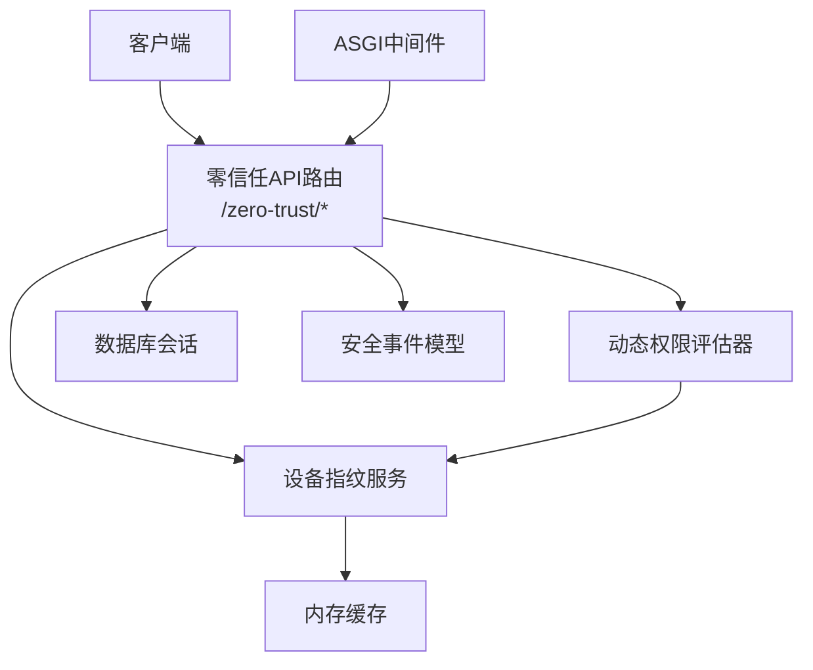
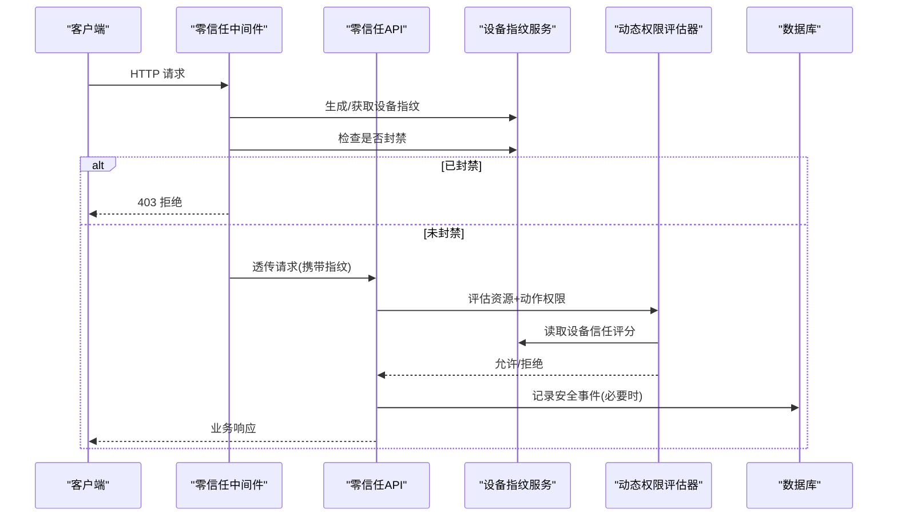
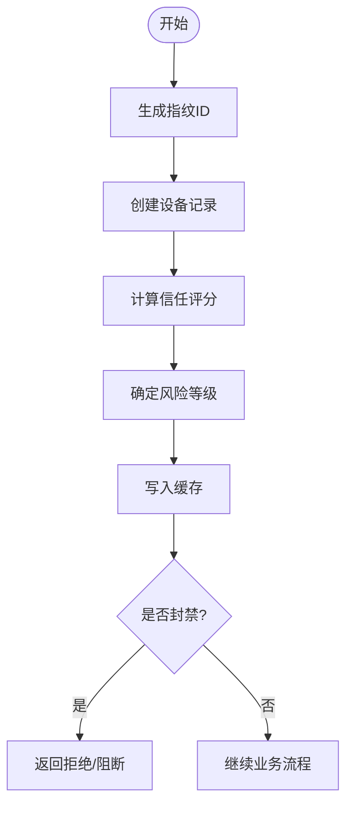
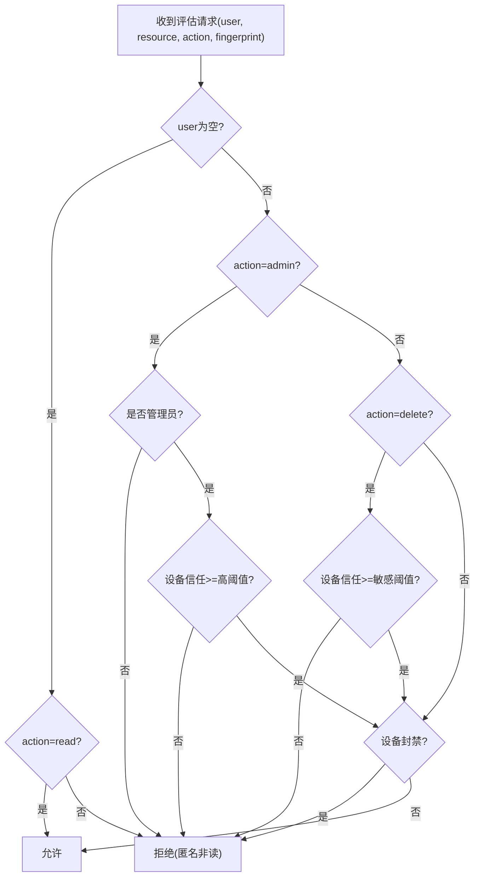
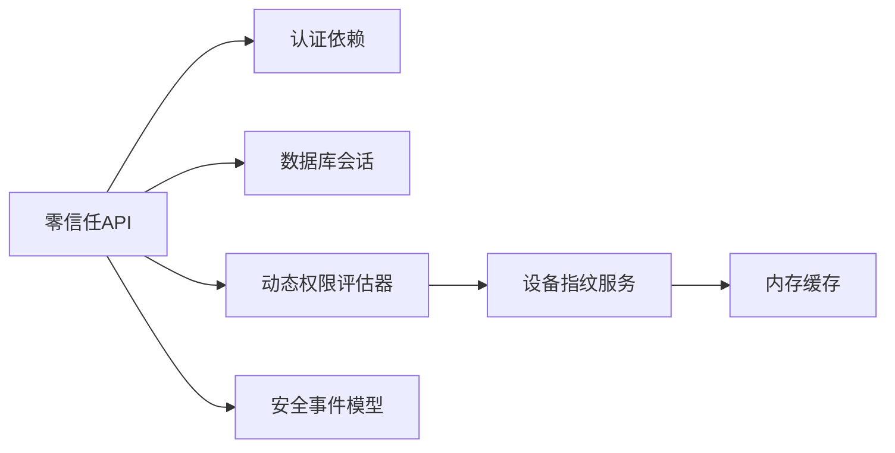

# 零信任安全API

<cite>
**本文引用的文件**
- [backend/app/api/v1/system/zero_trust.py](file://backend/app/api/v1/system/zero_trust.py)
- [backend/app/services/zero_trust/device_fingerprint.py](file://backend/app/services/zero_trust/device_fingerprint.py)
- [backend/app/services/zero_trust/dynamic_permission.py](file://backend/app/services/zero_trust/dynamic_permission.py)
- [backend/app/services/zero_trust/middleware.py](file://backend/app/services/zero_trust/middleware.py)
- [backend/app/models/audit.py](file://backend/app/models/audit.py)
- [backend/app/core/cache.py](file://backend/app/core/cache.py)
- [backend/app/core/security.py](file://backend/app/core/security.py)
- [backend/app/core/database.py](file://backend/app/core/database.py)
- [backend/app/services/compliance_engine.py](file://backend/app/services/compliance_engine.py)
</cite>

## 目录
1. [简介](#简介)
2. [项目结构](#项目结构)
3. [核心组件](#核心组件)
4. [架构总览](#架构总览)
5. [详细组件分析](#详细组件分析)
6. [依赖关系分析](#依赖关系分析)
7. [性能与可扩展性](#性能与可扩展性)
8. [故障排查指南](#故障排查指南)
9. [结论](#结论)
10. [附录：API 参考](#附录api-参考)

## 简介
本文件面向“零信任安全API”的集成与使用，覆盖设备指纹识别、动态权限评估、持续身份验证与安全事件审计等能力。文档说明各接口的HTTP方法、URL路径、安全参数与响应语义，并给出访问策略配置、风险评估模型、威胁检测的实现要点，以及与合规引擎和企业安全系统对接的建议。

## 项目结构
零信任安全能力由三层构成：
- API 层：提供对外REST接口，负责鉴权、入参校验、调用服务层与持久化安全事件。
- 服务层：实现设备指纹、动态权限评估、中间件拦截等核心逻辑。
- 数据与基础设施：通过缓存（内存）与数据库（审计表）进行状态存储与审计记录。

图表来源
- [backend/app/api/v1/system/zero_trust.py:21-538](file://backend/app/api/v1/system/zero_trust.py#L21-L538)
- [backend/app/services/zero_trust/device_fingerprint.py:68-391](file://backend/app/services/zero_trust/device_fingerprint.py#L68-L391)
- [backend/app/services/zero_trust/dynamic_permission.py:38-131](file://backend/app/services/zero_trust/dynamic_permission.py#L38-L131)
- [backend/app/services/zero_trust/middleware.py:27-97](file://backend/app/services/zero_trust/middleware.py#L27-L97)
- [backend/app/models/audit.py:98-126](file://backend/app/models/audit.py#L98-L126)

章节来源
- [backend/app/api/v1/system/zero_trust.py:21-538](file://backend/app/api/v1/system/zero_trust.py#L21-L538)
- [backend/app/services/zero_trust/middleware.py:27-97](file://backend/app/services/zero_trust/middleware.py#L27-L97)

## 核心组件
- 设备指纹识别：基于UA、IP及可选浏览器特征生成唯一指纹，计算信任评分与风险等级，支持封禁与解封。
- 动态权限评估：结合用户角色、设备信任度与操作类型，对敏感/高风险操作实施更严格校验。
- 持续身份验证：在请求链路中注入设备指纹，结合会话与传输安全因子进行综合评估。
- 安全事件审计：将安全事件持久化到数据库，并提供查询与统计接口。

章节来源
- [backend/app/services/zero_trust/device_fingerprint.py:68-391](file://backend/app/services/zero_trust/device_fingerprint.py#L68-L391)
- [backend/app/services/zero_trust/dynamic_permission.py:38-131](file://backend/app/services/zero_trust/dynamic_permission.py#L38-L131)
- [backend/app/api/v1/system/zero_trust.py:62-140](file://backend/app/api/v1/system/zero_trust.py#L62-L140)

## 架构总览
零信任架构在本系统中的体现：
- 不信任任何默认连接，每次访问都需基于上下文（用户、设备、网络、行为）进行动态评估。
- 以设备指纹为锚点，持续更新信任评分；对高风险或异常行为触发额外验证或阻断。
- 通过中间件在请求早期完成设备指纹提取与封禁检查，减少无效业务处理。
- 所有关键安全事件均持久化，便于审计与告警。

图表来源
- [backend/app/services/zero_trust/middleware.py:42-82](file://backend/app/services/zero_trust/middleware.py#L42-L82)
- [backend/app/services/zero_trust/device_fingerprint.py:98-123](file://backend/app/services/zero_trust/device_fingerprint.py#L98-L123)
- [backend/app/services/zero_trust/dynamic_permission.py:45-126](file://backend/app/services/zero_trust/dynamic_permission.py#L45-L126)
- [backend/app/api/v1/system/zero_trust.py:387-437](file://backend/app/api/v1/system/zero_trust.py#L387-L437)

## 详细组件分析

### 设备指纹识别
- 指纹生成：聚合UA、IP与可选浏览器特征（Canvas/WebGL等），哈希后得到稳定ID。
- 信任评分：根据自动化工具、可疑UA模式、平台可信度、特征完整性等加权计算。
- 风险等级：按评分阈值映射为低/中/高/严重。
- 封禁机制：将封禁信息写入缓存，快速拦截后续请求。
- 缓存策略：设备信息与信任评分分别缓存，兼顾一致性与性能。

图表来源
- [backend/app/services/zero_trust/device_fingerprint.py:98-152](file://backend/app/services/zero_trust/device_fingerprint.py#L98-L152)
- [backend/app/services/zero_trust/device_fingerprint.py:154-201](file://backend/app/services/zero_trust/device_fingerprint.py#L154-L201)
- [backend/app/services/zero_trust/device_fingerprint.py:284-307](file://backend/app/services/zero_trust/device_fingerprint.py#L284-L307)

章节来源
- [backend/app/services/zero_trust/device_fingerprint.py:68-391](file://backend/app/services/zero_trust/device_fingerprint.py#L68-L391)

### 动态权限评估
- 评估因子：用户角色/管理员标识、设备信任评分、操作类型（read/write/delete/admin）。
- 规则要点：
  - 匿名用户仅允许读。
  - admin 操作要求管理员且设备信任度达到更高阈值。
  - delete 等敏感操作要求设备信任度达到阈值。
  - 被封禁设备一律拒绝。
- 输出：布尔值表示是否允许，供上层网关或路由守卫使用。

图表来源
- [backend/app/services/zero_trust/dynamic_permission.py:45-126](file://backend/app/services/zero_trust/dynamic_permission.py#L45-L126)
- [backend/app/services/zero_trust/device_fingerprint.py:309-323](file://backend/app/services/zero_trust/device_fingerprint.py#L309-L323)

章节来源
- [backend/app/services/zero_trust/dynamic_permission.py:38-131](file://backend/app/services/zero_trust/dynamic_permission.py#L38-L131)

### ASGI 中间件（持续身份验证前置）
- 职责：从请求头提取UA与IP，生成设备指纹并放入scope；若设备被封禁直接返回403。
- 设计原则：轻量、无阻塞I/O、可插拔注册。
- 日志：对低信任设备访问进行记录，便于后续分析与告警。

章节来源
- [backend/app/services/zero_trust/middleware.py:27-97](file://backend/app/services/zero_trust/middleware.py#L27-L97)

### 安全事件与审计
- 事件记录：敏感操作、管理越权尝试等会记录到数据库，包含类型、来源、严重程度、描述与详情。
- 事件查询：支持按严重程度、事件类型分页查询。
- 事件统计：汇总总数、高危数量、按级别/类型分布及安全态势。

章节来源
- [backend/app/api/v1/system/zero_trust.py:62-140](file://backend/app/api/v1/system/zero_trust.py#L62-L140)
- [backend/app/api/v1/system/zero_trust.py:440-538](file://backend/app/api/v1/system/zero_trust.py#L440-L538)
- [backend/app/models/audit.py:98-126](file://backend/app/models/audit.py#L98-L126)

## 依赖关系分析
- API 依赖：
  - 当前用户解析：依赖认证模块。
  - 数据库会话：用于安全事件持久化与查询。
- 服务依赖：
  - 设备指纹服务：依赖内存缓存（SimpleCache）。
  - 动态权限评估器：依赖设备指纹服务。
- 中间件：
  - 依赖设备指纹服务，用于早期拦截。

图表来源
- [backend/app/api/v1/system/zero_trust.py:15-17](file://backend/app/api/v1/system/zero_trust.py#L15-L17)
- [backend/app/services/zero_trust/dynamic_permission.py:23-25](file://backend/app/services/zero_trust/dynamic_permission.py#L23-L25)
- [backend/app/services/zero_trust/device_fingerprint.py:19](file://backend/app/services/zero_trust/device_fingerprint.py#L19)
- [backend/app/models/audit.py:98-126](file://backend/app/models/audit.py#L98-L126)

章节来源
- [backend/app/api/v1/system/zero_trust.py:15-17](file://backend/app/api/v1/system/zero_trust.py#L15-L17)
- [backend/app/services/zero_trust/device_fingerprint.py:19](file://backend/app/services/zero_trust/device_fingerprint.py#L19)

## 性能与可扩展性
- 缓存优化：设备信息与信任评分采用内存缓存，降低重复计算与IO开销。
- 中间件前置拦截：尽早拒绝封禁设备，减少后端压力。
- 可扩展点：
  - 信任评分模型：可按业务扩展更多因子（地理位置、时间窗口、行为序列）。
  - 策略引擎：可将内置策略迁移至外部策略服务，支持热更新。
  - 审计接入：对接SIEM/SOC系统，实现实时告警与联动处置。

[本节为通用指导，无需特定文件引用]

## 故障排查指南
- 403 被中间件拒绝：
  - 可能原因：设备已被封禁。
  - 排查：检查设备指纹与封禁缓存键，确认封禁原因与有效期。
- 权限评估失败：
  - 可能原因：匿名用户执行写/删/管理操作；设备信任度不足；非管理员尝试admin。
  - 排查：查看评估日志与设备信任评分。
- 安全事件未落库：
  - 可能原因：数据库写入异常或事务回滚。
  - 排查：检查数据库连接、事务提交与异常日志。

章节来源
- [backend/app/services/zero_trust/middleware.py:68-72](file://backend/app/services/zero_trust/middleware.py#L68-L72)
- [backend/app/services/zero_trust/dynamic_permission.py:64-126](file://backend/app/services/zero_trust/dynamic_permission.py#L64-L126)
- [backend/app/api/v1/system/zero_trust.py:97-123](file://backend/app/api/v1/system/zero_trust.py#L97-L123)

## 结论
本零信任安全API通过设备指纹、动态权限评估与持续身份验证，构建了“每次访问均需证明”的安全基线。配合安全事件审计与合规引擎，可实现细粒度的访问控制与可观测性。建议在生产环境中结合企业SIEM、IAM与风控系统，形成闭环的零信任体系。

[本节为总结性内容，无需特定文件引用]

## 附录：API 参考
以下列出零信任安全相关端点、方法与用途。所有端点均位于前缀 /zero-trust 下，需要有效的用户会话（JWT）访问。

- GET /zero-trust/assessment
  - 功能：获取当前会话的信任评估结果（等级、评分、因子与建议）。
  - 安全参数：需有效登录态。
  - 响应字段：level、score、factors、recommendations、assessed_at。

- GET /zero-trust/policies
  - 功能：获取预定义安全策略列表，支持按类别筛选与仅启用项过滤。
  - 查询参数：category、enabled_only。
  - 响应字段：policies、total、enabled_count。

- GET /zero-trust/policies/{policy_id}
  - 功能：获取指定策略详情。
  - 路径参数：policy_id。

- POST /zero-trust/evaluate
  - 功能：评估对某资源的访问请求是否符合零信任策略。
  - 请求体字段：resource、action、context（可选）。
  - 响应字段：result（allowed/denied）、message、evaluated_at。

- GET /zero-trust/events
  - 功能：分页查询安全事件，支持按严重程度与事件类型筛选。
  - 查询参数：severity、event_type、page、page_size。
  - 响应字段：items、total、page、page_size。

- POST /zero-trust/events
  - 功能：手动上报安全事件（供外部安全工具或前端异常检测使用）。
  - 请求体字段：event_type、source、severity、message、details（可选）。

- GET /zero-trust/events/stats
  - 功能：获取安全事件统计（总数、高危数、按级别/类型分布、安全态势）。

章节来源
- [backend/app/api/v1/system/zero_trust.py:243-538](file://backend/app/api/v1/system/zero_trust.py#L243-L538)

## 与企业安全系统集成与第三方认证对接建议
- 统一身份认证（IAM/SSO）：
  - 将现有JWT签发流程与企业IdP对接，确保令牌中包含最小必要声明（用户、角色、组织范围）。
  - 在中间件或网关层增加设备指纹采集与上报，形成“人-机-环境”多维信任评估。
- SIEM/SOC 联动：
  - 将安全事件流式推送至SIEM，设置告警规则（如高频失败登录、非常用地点、高风险操作）。
  - 通过SOAR编排自动封禁设备、强制重新认证或限制权限。
- 风控与威胁情报：
  - 引入外部威胁情报源，对IP、UA、设备指纹进行匹配，提升恶意流量识别率。
  - 将设备信任评分纳入风控决策，动态调整MFA强度或访问范围。
- 合规性检查：
  - 结合合规引擎对经费/项目数据进行偏差与标准匹配检查，作为访问控制的附加条件。
  - 将合规检查结果纳入信任评估因子，影响后续访问授权。

章节来源
- [backend/app/services/compliance_engine.py:23-109](file://backend/app/services/compliance_engine.py#L23-L109)