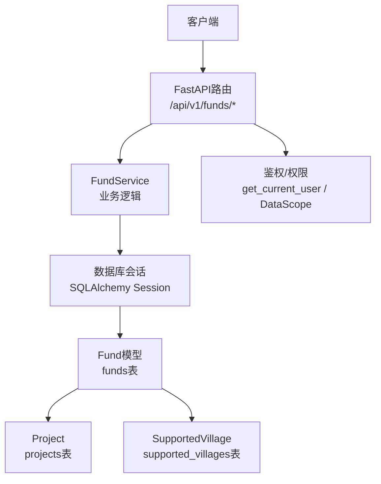
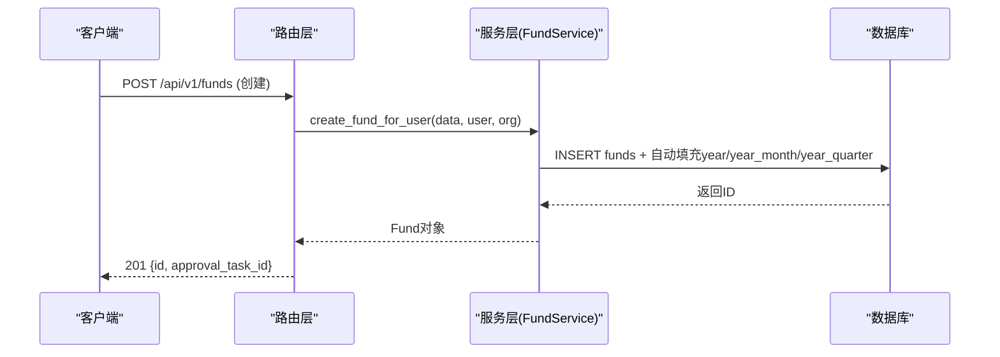
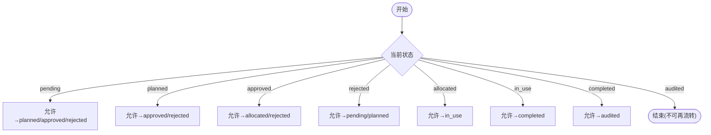
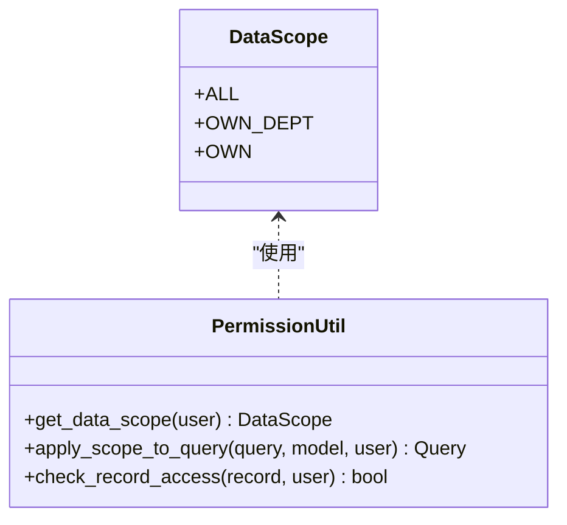
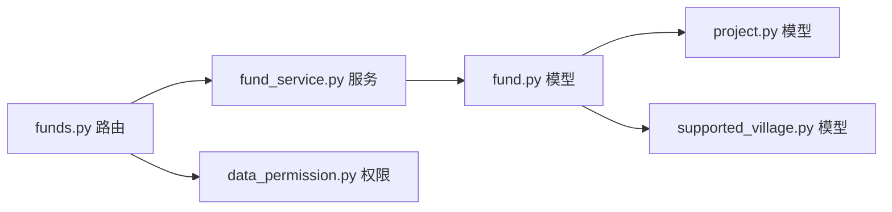

# 经费基础CRUD接口

<cite>
**本文引用的文件**
- [backend/app/api/v1/funds.py](file://backend/app/api/v1/funds.py)
- [backend/app/schemas/fund.py](file://backend/app/schemas/fund.py)
- [backend/app/models/fund.py](file://backend/app/models/fund.py)
- [backend/app/services/fund_service.py](file://backend/app/services/fund_service.py)
- [backend/app/core/data_permission.py](file://backend/app/core/data_permission.py)
- [backend/app/models/project.py](file://backend/app/models/project.py)
- [backend/app/models/supported_village.py](file://backend/app/models/supported_village.py)
</cite>

## 目录
1. [简介](#简介)
2. [项目结构](#项目结构)
3. [核心组件](#核心组件)
4. [架构总览](#架构总览)
5. [详细组件分析](#详细组件分析)
6. [依赖关系分析](#依赖关系分析)
7. [性能考虑](#性能考虑)
8. [故障排查指南](#故障排查指南)
9. [结论](#结论)
10. [附录：API定义与示例](#附录api定义与示例)

## 简介
本文件为“经费基础CRUD接口”的权威技术文档，覆盖经费记录的创建、查询、更新、删除操作；说明经费状态管理（pending、planned、approved、allocated、in_use、completed、audited）、数据权限隔离、软删除机制；并提供标准操作流程与错误处理。同时说明与项目管理、帮扶村等模块的关联关系和数据验证规则。

## 项目结构
经费模块采用分层设计：
- API路由层：FastAPI路由定义请求/响应契约、鉴权、参数校验、统一响应封装。
- 服务层：FundService封装业务逻辑（创建、批量状态流转、金额精度处理等）。
- 模型层：SQLAlchemy ORM定义表结构与索引、生命周期事件、软删字段。
- 权限层：DataScope工具按用户角色与组织范围过滤数据。
- 关联模型：Project、SupportedVillage等通过外键与经费记录关联。

图表来源
- [backend/app/api/v1/funds.py:360-610](file://backend/app/api/v1/funds.py#L360-L610)
- [backend/app/services/fund_service.py:29-215](file://backend/app/services/fund_service.py#L29-L215)
- [backend/app/models/fund.py:61-167](file://backend/app/models/fund.py#L61-L167)
- [backend/app/core/data_permission.py:54-134](file://backend/app/core/data_permission.py#L54-L134)

章节来源
- [backend/app/api/v1/funds.py:1-120](file://backend/app/api/v1/funds.py#L1-L120)
- [backend/app/models/fund.py:1-170](file://backend/app/models/fund.py#L1-L170)

## 核心组件
- Fund模型：定义经费实体、状态枚举、软删标记、统计冗余字段、索引优化、关联关系。
- FundService：提供分页查询、详情获取、创建、更新、删除、批量状态流转等方法，内置金额精度处理与编号生成。
- 路由层：实现RESTful CRUD与审批流端点，集成数据权限、软删过滤、附件管理、统计接口。
- 权限控制：基于DataScope按ALL/OWN_DEPT/OWN三种范围过滤查询结果。
- 关联模型：Project、SupportedVillage通过外键与经费记录建立一对多关系。

章节来源
- [backend/app/models/fund.py:30-167](file://backend/app/models/fund.py#L30-L167)
- [backend/app/services/fund_service.py:29-215](file://backend/app/services/fund_service.py#L29-L215)
- [backend/app/core/data_permission.py:20-134](file://backend/app/core/data_permission.py#L20-L134)
- [backend/app/models/project.py:47-174](file://backend/app/models/project.py#L47-L174)
- [backend/app/models/supported_village.py:42-194](file://backend/app/models/supported_village.py#L42-L194)

## 架构总览
经费模块遵循“路由→服务→ORM→数据库”的分层架构，所有写操作均通过事务提交，读操作使用预加载避免N+1问题，统计接口利用冗余字段与复合索引提升聚合性能。

图表来源
- [backend/app/api/v1/funds.py:483-504](file://backend/app/api/v1/funds.py#L483-L504)
- [backend/app/services/fund_service.py:114-185](file://backend/app/services/fund_service.py#L114-L185)
- [backend/app/models/fund.py:199-226](file://backend/app/models/fund.py#L199-L226)

## 详细组件分析

### 数据模型与状态机
- 经费状态枚举：pending、planned、approved、rejected、allocated、in_use、completed、audited。
- 合法流转白名单由服务层维护，确保状态变更符合业务规则。
- 软删：is_active=false且记录deleted_at时间戳，默认查询排除已软删记录。
- 统计冗余：year、year_month、year_quarter在插入/更新前自动计算，配合复合索引加速聚合。

图表来源
- [backend/app/services/fund_service.py:230-243](file://backend/app/services/fund_service.py#L230-L243)

章节来源
- [backend/app/models/fund.py:49-147](file://backend/app/models/fund.py#L49-L147)
- [backend/app/services/fund_service.py:230-288](file://backend/app/services/fund_service.py#L230-L288)

### 数据权限隔离
- 数据范围：ALL（超级管理员）、OWN_DEPT（本部门/组织）、OWN（仅本人）。
- 列表与详情查询通过apply_scope_filter注入WHERE条件，支持组织树展开。
- 单条记录访问检查：若存在但被权限过滤为空，返回403而非404，便于区分“不存在”和“无权访问”。

图表来源
- [backend/app/core/data_permission.py:20-134](file://backend/app/core/data_permission.py#L20-L134)

章节来源
- [backend/app/core/data_permission.py:54-134](file://backend/app/core/data_permission.py#L54-L134)
- [backend/app/api/v1/funds.py:388-395](file://backend/app/api/v1/funds.py#L388-L395)
- [backend/app/api/v1/funds.py:459-480](file://backend/app/api/v1/funds.py#L459-L480)

### 软删除机制
- 删除接口将is_active置为False并记录deleted_at。
- 列表查询默认隐藏软删记录，管理员可通过include_deleted参数查看。
- 回收站功能挂载于路由末尾，支持恢复与彻底删除。

章节来源
- [backend/app/api/v1/funds.py:593-610](file://backend/app/api/v1/funds.py#L593-L610)
- [backend/app/api/v1/funds.py:391-395](file://backend/app/api/v1/funds.py#L391-L395)
- [backend/app/api/v1/funds.py:1421-1428](file://backend/app/api/v1/funds.py#L1421-L1428)

### 与项目和帮扶村的关联
- 经费记录通过project_id、village_id、school_id与项目、帮扶村、学校建立关联。
- 拨付时可选绑定里程碑，需校验里程碑所属项目且已完成。
- 列表/详情预加载关联数据，避免N+1查询。

章节来源
- [backend/app/models/fund.py:104-110](file://backend/app/models/fund.py#L104-L110)
- [backend/app/models/project.py:79-86](file://backend/app/models/project.py#L79-L86)
- [backend/app/models/supported_village.py:190-194](file://backend/app/models/supported_village.py#L190-L194)
- [backend/app/api/v1/funds.py:908-932](file://backend/app/api/v1/funds.py#L908-L932)

## 依赖关系分析
- 路由依赖：鉴权、数据库会话、数据权限适配器、上传工具、工作日志服务。
- 服务依赖：安全提交、金额精度工具、Fund模型。
- 模型依赖：BaseModel、SQLAlchemy列类型、事件监听器、关系映射。

图表来源
- [backend/app/api/v1/funds.py:31-47](file://backend/app/api/v1/funds.py#L31-L47)
- [backend/app/services/fund_service.py:19-25](file://backend/app/services/fund_service.py#L19-L25)
- [backend/app/models/fund.py:23-27](file://backend/app/models/fund.py#L23-L27)

章节来源
- [backend/app/api/v1/funds.py:31-47](file://backend/app/api/v1/funds.py#L31-L47)
- [backend/app/services/fund_service.py:19-25](file://backend/app/services/fund_service.py#L19-L25)

## 性能考虑
- 列表查询使用selectinload/joinedload预加载关联，避免N+1。
- 统计接口使用冗余字段year/year_month/year_quarter与复合索引，消除全表扫描。
- 批量状态更新使用bulk update，减少循环开销。
- 计数查询分离，先count后取数，提升分页性能。

章节来源
- [backend/app/api/v1/funds.py:380-445](file://backend/app/api/v1/funds.py#L380-L445)
- [backend/app/api/v1/funds.py:617-760](file://backend/app/api/v1/funds.py#L617-L760)
- [backend/app/services/fund_service.py:245-288](file://backend/app/services/fund_service.py#L245-L288)

## 故障排查指南
- 404：记录不存在或无权访问（详情接口会区分不存在与跨组织）。
- 400：非法状态流转、缺少必需附件、日期格式错误、当前状态不允许修改等。
- 403：跨组织访问或无操作权限。
- 常见原因：
  - 状态不在白名单内。
  - 拨付未上传合同/分配令。
  - 日期字段字符串未正确解析。
  - 软删记录默认不显示。

章节来源
- [backend/app/api/v1/funds.py:545-548](file://backend/app/api/v1/funds.py#L545-L548)
- [backend/app/api/v1/funds.py:795-818](file://backend/app/api/v1/funds.py#L795-L818)
- [backend/app/api/v1/funds.py:692-699](file://backend/app/api/v1/funds.py#L692-L699)
- [backend/app/api/v1/funds.py:459-480](file://backend/app/api/v1/funds.py#L459-L480)

## 结论
经费基础CRUD接口提供了完整的经费生命周期管理能力，结合严格的状态机、数据权限隔离、软删除与高性能统计，满足乡村振兴场景下的资金管理与审计需求。建议前端严格遵循状态流转约束，并在关键节点上传必要附件，以确保流程合规与可追溯。

## 附录：API定义与示例

### 通用约定
- 基础路径：/api/v1/funds
- 认证：需要登录用户上下文（get_current_user）
- 响应格式：统一success_response/ok_list封装，包含code、message、data
- 分页：支持offset与keyset两种方式

### 1) 创建经费
- 方法：POST
- 路径：/api/v1/funds
- 权限：具备经费操作角色的用户
- 请求体：参考FundCreate（name、amount、planned_amount、fund_type、fund_source、project_id、village_id、school_id、purpose、source、operator、receiver、usage_description、status、applicant、remarks、date、start_date、end_date等）
- 响应：201，返回{id, approval_task_id}
- 行为：自动创建审批任务，进入待审批板块

章节来源
- [backend/app/api/v1/funds.py:483-504](file://backend/app/api/v1/funds.py#L483-L504)
- [backend/app/schemas/fund.py:41-76](file://backend/app/schemas/fund.py#L41-L76)

### 2) 用户申请经费
- 方法：POST
- 路径：/api/v1/funds/apply
- 权限：所有登录用户
- 请求体：同创建（status强制为pending，自动设置申请人）
- 响应：201，返回{id, approval_task_id}

章节来源
- [backend/app/api/v1/funds.py:507-531](file://backend/app/api/v1/funds.py#L507-L531)

### 3) 查询经费列表
- 方法：GET
- 路径：/api/v1/funds
- 查询参数：page、page_size、keyword、status（别名status_filter）、fund_type、fund_source、project_id、village_id、school_id、cursor、pagination、include_deleted
- 响应：200，{items[], total, page, page_size, next_cursor?, has_more?}
- 行为：应用数据权限过滤，默认隐藏软删记录

章节来源
- [backend/app/api/v1/funds.py:360-445](file://backend/app/api/v1/funds.py#L360-L445)
- [backend/app/core/data_permission.py:83-134](file://backend/app/core/data_permission.py#L83-L134)

### 4) 查询经费详情
- 方法：GET
- 路径：/api/v1/funds/{fund_id}
- 响应：200，返回经费详情及viewableBecause元信息
- 行为：先判断是否存在，再应用数据权限；无权访问返回403

章节来源
- [backend/app/api/v1/funds.py:448-480](file://backend/app/api/v1/funds.py#L448-L480)

### 5) 更新经费
- 方法：PUT
- 路径：/api/v1/funds/{fund_id}
- 权限：具备经费操作角色的用户
- 请求体：部分更新（FundUpdate），金额字段进行精度处理
- 响应：200，成功消息或附带审批任务ID
- 行为：仅允许pending/planned/rejected状态修改；字段变更写入历史

章节来源
- [backend/app/api/v1/funds.py:534-590](file://backend/app/api/v1/funds.py#L534-L590)
- [backend/app/schemas/fund.py:83-113](file://backend/app/schemas/fund.py#L83-L113)

### 6) 删除经费（软删）
- 方法：DELETE
- 路径：/api/v1/funds/{fund_id}
- 权限：具备经费操作角色的用户
- 响应：200，成功消息
- 行为：仅允许pending状态的经费删除；设置is_active=false与deleted_at

章节来源
- [backend/app/api/v1/funds.py:593-610](file://backend/app/api/v1/funds.py#L593-L610)

### 7) 审批通过
- 方法：POST
- 路径：/api/v1/funds/{fund_id}/approve
- 权限：具备经费操作角色的用户
- 响应：200，{fund_id, resolved_tasks}
- 行为：从pending/planned→approved，记录审批人与时间，同步完结审批任务

章节来源
- [backend/app/api/v1/funds.py:863-874](file://backend/app/api/v1/funds.py#L863-L874)

### 8) 审批驳回
- 方法：POST
- 路径：/api/v1/funds/{fund_id}/reject
- 权限：具备经费操作角色的用户
- 请求体：opinion（必填）
- 响应：200，{fund_id, resolved_tasks}
- 行为：从pending/planned→rejected，记录原因，同步驳回审批任务

章节来源
- [backend/app/api/v1/funds.py:877-895](file://backend/app/api/v1/funds.py#L877-L895)

### 9) 拨付经费
- 方法：POST
- 路径：/api/v1/funds/{fund_id}/allocate
- 权限：具备经费操作角色的用户
- 查询参数：milestone_id（可选）
- 响应：200，成功消息
- 行为：从approved→allocated，要求上传合同与分配令；如传入里程碑需属于该项目且已完成

章节来源
- [backend/app/api/v1/funds.py:898-932](file://backend/app/api/v1/funds.py#L898-L932)

### 10) 开始使用
- 方法：POST
- 路径：/api/v1/funds/{fund_id}/start-use
- 权限：具备经费操作角色的用户
- 响应：200，成功消息
- 行为：从allocated→in_use，记录开始时间

章节来源
- [backend/app/api/v1/funds.py:935-942](file://backend/app/api/v1/funds.py#L935-L942)

### 11) 完成使用
- 方法：POST
- 路径：/api/v1/funds/{fund_id}/complete
- 权限：具备经费操作角色的用户
- 响应：200，成功消息
- 行为：从in_use→completed，记录结束时间

章节来源
- [backend/app/api/v1/funds.py:945-952](file://backend/app/api/v1/funds.py#L945-L952)

### 12) 审计归档
- 方法：POST
- 路径：/api/v1/funds/{fund_id}/audit
- 权限：具备经费操作角色的用户
- 响应：200，成功消息
- 行为：从completed→audited，记录审计时间

章节来源
- [backend/app/api/v1/funds.py:955-962](file://backend/app/api/v1/funds.py#L955-L962)

### 13) 附件管理
- 上传：POST /api/v1/funds/{fund_id}/attachments
- 列表：GET /api/v1/funds/{fund_id}/attachments
- 下载：GET /api/v1/funds/attachments/{attachment_id}/download
- 预览：GET /api/v1/funds/attachments/{attachment_id}/preview
- 删除：DELETE /api/v1/funds/attachments/{attachment_id}
- 行为：所有操作均需具备经费访问权限；上传/删除记录操作日志与工作日志

章节来源
- [backend/app/api/v1/funds.py:1248-1419](file://backend/app/api/v1/funds.py#L1248-L1419)

### 14) 统计接口
- 概览：GET /api/v1/funds/statistics/overview
- 多维度：GET /api/v1/funds/statistics/multi-dimension
- 帮扶村汇总：GET /api/v1/funds/supported-village/statistics/by-type、.../yearly-comparison、.../utilization-rate、.../summary
- 村/校汇总：GET /api/v1/funds/village/{village_id}/summary、/api/v1/funds/school/{school_id}/summary
- 行为：应用数据权限过滤，默认排除软删记录

章节来源
- [backend/app/api/v1/funds.py:617-760](file://backend/app/api/v1/funds.py#L617-L760)
- [backend/app/api/v1/funds.py:970-1143](file://backend/app/api/v1/funds.py#L970-L1143)

### 15) 历史记录与审批流程
- 状态历史：GET /api/v1/funds/{fund_id}/history/status
- 字段变更历史：GET /api/v1/funds/{fund_id}/history/fields
- 操作日志：GET /api/v1/funds/{fund_id}/history/operations
- 审批流程：GET /api/v1/funds/{fund_id}/approval-flow
- 行为：展示状态流转、字段变更、操作日志与当前节点

章节来源
- [backend/app/api/v1/funds.py:1146-1240](file://backend/app/api/v1/funds.py#L1146-L1240)

### 标准操作流程示例
- 新建申请：POST /api/v1/funds/apply → 进入pending
- 审批通过：POST /api/v1/funds/{id}/approve → approved
- 上传合同/分配令：POST /api/v1/funds/{id}/attachments
- 拨付：POST /api/v1/funds/{id}/allocate → allocated
- 开始使用：POST /api/v1/funds/{id}/start-use → in_use
- 完成使用：POST /api/v1/funds/{id}/complete → completed
- 审计归档：POST /api/v1/funds/{id}/audit → audited

[本节为概念性流程说明，不直接分析具体代码文件]