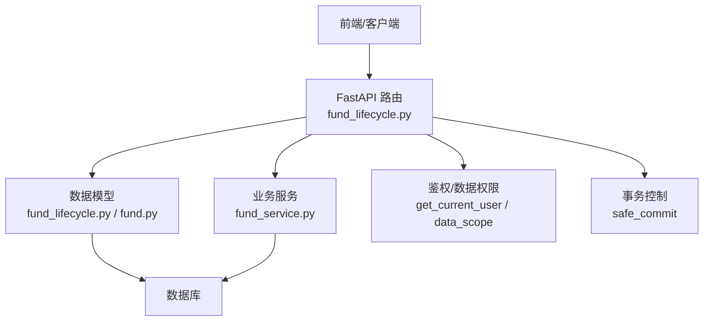
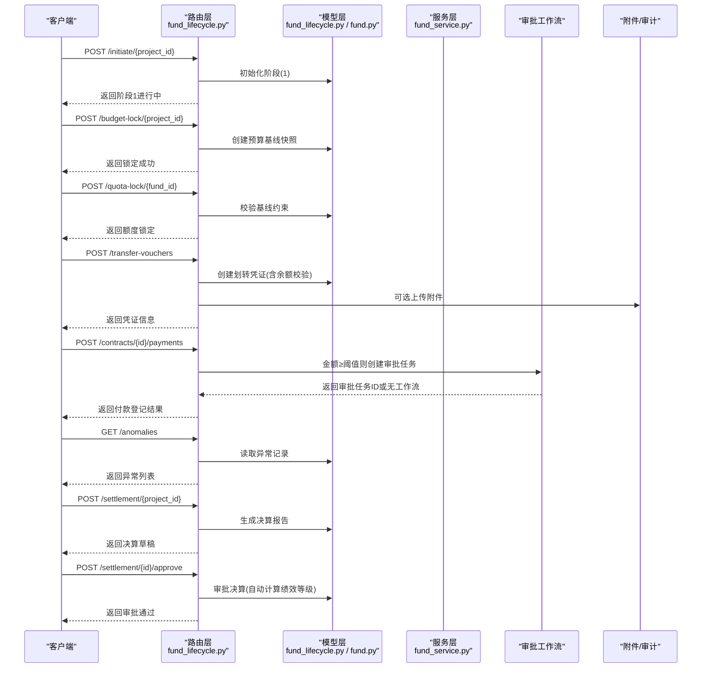
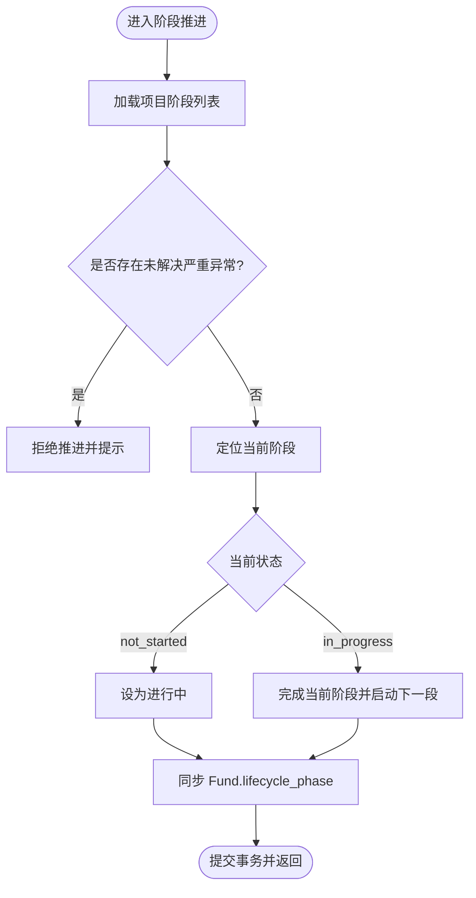
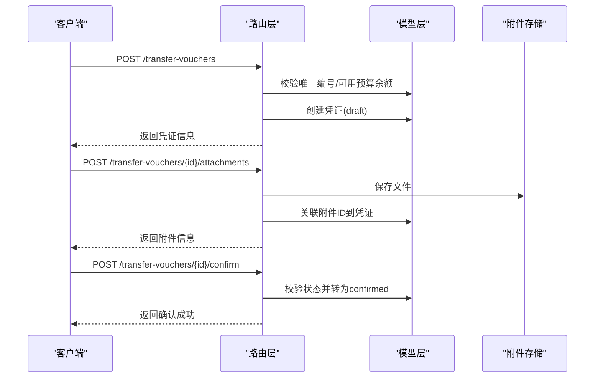
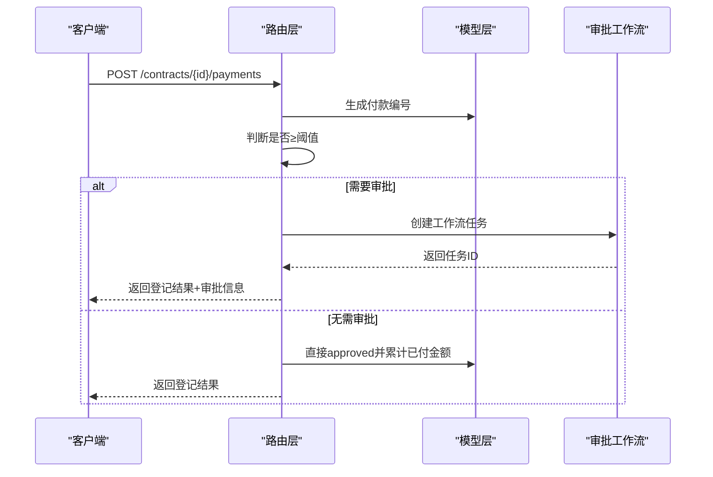
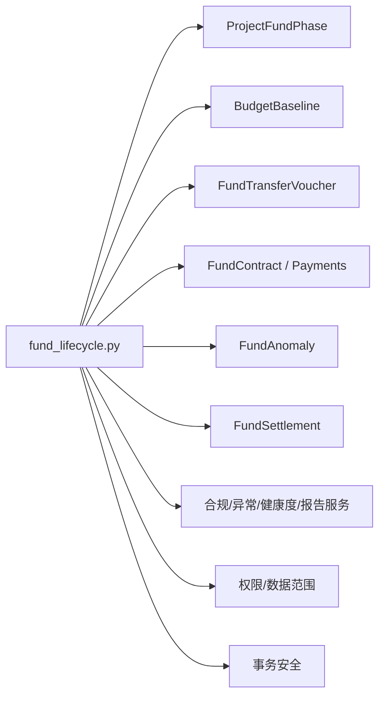

# 经费生命周期接口

<cite>
**本文引用的文件**
- [backend/app/api/v1/fund_lifecycle.py](file://backend/app/api/v1/fund_lifecycle.py)
- [backend/app/models/fund_lifecycle.py](file://backend/app/models/fund_lifecycle.py)
- [backend/app/models/fund.py](file://backend/app/models/fund.py)
- [backend/app/schemas/fund.py](file://backend/app/schemas/fund.py)
- [backend/app/services/fund_service.py](file://backend/app/services/fund_service.py)
</cite>

## 目录
1. [简介](#简介)
2. [项目结构](#项目结构)
3. [核心组件](#核心组件)
4. [架构总览](#架构总览)
5. [详细组件分析](#详细组件分析)
6. [依赖关系分析](#依赖关系分析)
7. [性能考虑](#性能考虑)
8. [故障排查指南](#故障排查指南)
9. [结论](#结论)
10. [附录：API 清单与调用示例](#附录api-清单与调用示例)

## 简介
本文件为“经费全生命周期管理”接口的权威 API 文档，覆盖从论证立项到决算审计的七阶段全流程。重点说明各阶段的 HTTP 方法、URL 路径、请求参数、响应格式、错误处理，以及状态机校验、附件要求检查、审批流程集成、审计日志记录等核心能力。同时给出典型调用序列图，展示经费在各阶段的流转过程，并说明与审批工作流、资产管理等模块的协作关系。

## 项目结构
- 路由层：FastAPI 路由集中在 backend/app/api/v1/fund_lifecycle.py，统一挂载于 /api/v1/fund-lifecycle。
- 数据模型：生命周期相关实体定义在 backend/app/models/fund_lifecycle.py；基础经费实体在 backend/app/models/fund.py。
- 业务服务：经费状态机与批量操作在 backend/app/services/fund_service.py；Pydantic 输入/输出校验在 backend/app/schemas/fund.py。
- 权限与事务：通过 get_current_user、require_funds_operator_role 进行鉴权；使用 safe_commit 保证事务一致性。

**图表来源**
- [backend/app/api/v1/fund_lifecycle.py:1-44](file://backend/app/api/v1/fund_lifecycle.py#L1-L44)
- [backend/app/models/fund_lifecycle.py:119-449](file://backend/app/models/fund_lifecycle.py#L119-L449)
- [backend/app/models/fund.py:61-167](file://backend/app/models/fund.py#L61-L167)
- [backend/app/services/fund_service.py:29-289](file://backend/app/services/fund_service.py#L29-L289)

**章节来源**
- [backend/app/api/v1/fund_lifecycle.py:1-44](file://backend/app/api/v1/fund_lifecycle.py#L1-L44)

## 核心组件
- 阶段管理：查询/推进/退回阶段，自动初始化 7 个阶段，严格状态机校验（not_started/in_progress/completed/skipped）。
- 预算基线：阶段2锁定预算基线，后续拨付不得超基线。
- 资金划转凭证：创建/更新/确认/删除，支持附件上传，额度校验。
- 合同与付款：CRUD 合同，登记付款明细，超阈值自动触发审批工作流。
- 异常检测与处理：列表、触发检测、标记解决，严重异常阻断阶段推进。
- 决算与绩效：生成决算报告、审批决算、自动计算绩效等级。
- 健康度与联动：项目健康度评分、资产联动校验（差异率≤5%视为通过）。
- 拨款指令与额度调整：创建/下达指令；额度调整申请（紧急需 super_admin）。

**章节来源**
- [backend/app/api/v1/fund_lifecycle.py:73-284](file://backend/app/api/v1/fund_lifecycle.py#L73-L284)
- [backend/app/api/v1/fund_lifecycle.py:378-541](file://backend/app/api/v1/fund_lifecycle.py#L378-L541)
- [backend/app/api/v1/fund_lifecycle.py:667-879](file://backend/app/api/v1/fund_lifecycle.py#L667-L879)
- [backend/app/api/v1/fund_lifecycle.py:961-1153](file://backend/app/api/v1/fund_lifecycle.py#L961-L1153)
- [backend/app/api/v1/fund_lifecycle.py:1338-1433](file://backend/app/api/v1/fund_lifecycle.py#L1338-L1433)
- [backend/app/api/v1/fund_lifecycle.py:1445-1595](file://backend/app/api/v1/fund_lifecycle.py#L1445-L1595)
- [backend/app/api/v1/fund_lifecycle.py:1651-1681](file://backend/app/api/v1/fund_lifecycle.py#L1651-L1681)
- [backend/app/api/v1/fund_lifecycle.py:1702-1775](file://backend/app/api/v1/fund_lifecycle.py#L1702-L1775)
- [backend/app/api/v1/fund_lifecycle.py:1799-1848](file://backend/app/api/v1/fund_lifecycle.py#L1799-L1848)
- [backend/app/api/v1/fund_lifecycle.py:1937-1982](file://backend/app/api/v1/fund_lifecycle.py#L1937-L1982)

## 架构总览
下图展示一个完整生命周期关键动作的调用序列：立项→审核→拨付→划转→实施监管→核查→决算。

**图表来源**
- [backend/app/api/v1/fund_lifecycle.py:292-324](file://backend/app/api/v1/fund_lifecycle.py#L292-L324)
- [backend/app/api/v1/fund_lifecycle.py:378-418](file://backend/app/api/v1/fund_lifecycle.py#L378-L418)
- [backend/app/api/v1/fund_lifecycle.py:549-578](file://backend/app/api/v1/fund_lifecycle.py#L549-L578)
- [backend/app/api/v1/fund_lifecycle.py:693-741](file://backend/app/api/v1/fund_lifecycle.py#L693-L741)
- [backend/app/api/v1/fund_lifecycle.py:1094-1153](file://backend/app/api/v1/fund_lifecycle.py#L1094-L1153)
- [backend/app/api/v1/fund_lifecycle.py:1338-1387](file://backend/app/api/v1/fund_lifecycle.py#L1338-L1387)
- [backend/app/api/v1/fund_lifecycle.py:1445-1494](file://backend/app/api/v1/fund_lifecycle.py#L1445-L1494)
- [backend/app/api/v1/fund_lifecycle.py:1538-1595](file://backend/app/api/v1/fund_lifecycle.py#L1538-L1595)

## 详细组件分析

### 阶段管理与状态机
- 获取阶段：GET /phases/{project_id}，若不存在则自动初始化 7 条阶段记录，返回当前阶段与阶段列表。
- 推进阶段：POST /phases/{project_id}/advance，校验未解决的严重异常，完成当前阶段并进入下一阶段，同步 Fund.lifecycle_phase。
- 退回阶段：POST /phases/{project_id}/rollback，仅允许退回到上一阶段，重置当前阶段并恢复上一阶段进行中。

**图表来源**
- [backend/app/api/v1/fund_lifecycle.py:73-123](file://backend/app/api/v1/fund_lifecycle.py#L73-L123)
- [backend/app/api/v1/fund_lifecycle.py:188-228](file://backend/app/api/v1/fund_lifecycle.py#L188-L228)
- [backend/app/api/v1/fund_lifecycle.py:231-284](file://backend/app/api/v1/fund_lifecycle.py#L231-L284)
- [backend/app/models/fund_lifecycle.py:119-154](file://backend/app/models/fund_lifecycle.py#L119-L154)

**章节来源**
- [backend/app/api/v1/fund_lifecycle.py:73-284](file://backend/app/api/v1/fund_lifecycle.py#L73-L284)
- [backend/app/models/fund_lifecycle.py:119-154](file://backend/app/models/fund_lifecycle.py#L119-L154)

### 预算基线与拨付计划
- 锁定预算基线：POST /budget-lock/{project_id}，为每条经费创建基线快照，标记 budget_locked。
- 额度锁定：POST /quota-lock/{fund_id}，必须已锁定基线且拨付额度不超过基线。
- 拨付计划分解：GET /allocation-plan/{project_id}，返回各经费的计划/批准/拨付/基线等信息。

**章节来源**
- [backend/app/api/v1/fund_lifecycle.py:378-418](file://backend/app/api/v1/fund_lifecycle.py#L378-L418)
- [backend/app/api/v1/fund_lifecycle.py:549-578](file://backend/app/api/v1/fund_lifecycle.py#L549-L578)
- [backend/app/api/v1/fund_lifecycle.py:581-621](file://backend/app/api/v1/fund_lifecycle.py#L581-L621)
- [backend/app/models/fund_lifecycle.py:156-189](file://backend/app/models/fund_lifecycle.py#L156-L189)

### 资金划转凭证与附件
- 列表/详情/更新/删除：/transfer-vouchers/*，支持按项目/经费/状态筛选，仅草稿可删除，已确认不可修改。
- 确认凭证：POST /transfer-vouchers/{voucher_id}/confirm，状态机限制（draft/submitted→confirmed），写入审计日志。
- 附件上传：POST /transfer-vouchers/{voucher_id}/attachments，使用统一上传工具保存文件并关联到凭证。

**图表来源**
- [backend/app/api/v1/fund_lifecycle.py:667-799](file://backend/app/api/v1/fund_lifecycle.py#L667-L799)
- [backend/app/api/v1/fund_lifecycle.py:801-879](file://backend/app/api/v1/fund_lifecycle.py#L801-L879)
- [backend/app/models/fund_lifecycle.py:191-238](file://backend/app/models/fund_lifecycle.py#L191-L238)

**章节来源**
- [backend/app/api/v1/fund_lifecycle.py:667-879](file://backend/app/api/v1/fund_lifecycle.py#L667-L879)
- [backend/app/models/fund_lifecycle.py:191-238](file://backend/app/models/fund_lifecycle.py#L191-L238)

### 合同与付款（含审批集成）
- 合同 CRUD：/contracts/*，支持按项目/状态筛选，仅草稿可删除。
- 付款登记：POST /contracts/{contract_id}/payments，自动生成付款编号，超过阈值（默认 50 万元）自动创建审批任务；已批准的付款才累计合同已付金额与进度。
- 审批集成：当存在激活的 fund_payment 工作流时，自动提交审批任务；若无配置，返回 no_workflow 提示人工审核。

**图表来源**
- [backend/app/api/v1/fund_lifecycle.py:961-1153](file://backend/app/api/v1/fund_lifecycle.py#L961-L1153)
- [backend/app/api/v1/fund_lifecycle.py:1155-1199](file://backend/app/api/v1/fund_lifecycle.py#L1155-L1199)
- [backend/app/models/fund_lifecycle.py:240-322](file://backend/app/models/fund_lifecycle.py#L240-L322)

**章节来源**
- [backend/app/api/v1/fund_lifecycle.py:961-1153](file://backend/app/api/v1/fund_lifecycle.py#L961-L1153)
- [backend/app/models/fund_lifecycle.py:240-322](file://backend/app/models/fund_lifecycle.py#L240-L322)

### 异常检测与督查线索
- 异常列表：GET /anomalies，支持按项目/经费/类型/严重程度/解决状态筛选。
- 触发检测：POST /anomalies/detect/{project_id}，调用异常检测服务并持久化新异常。
- 解决异常：POST /anomalies/{id}/resolve，标记已解决并更新经费 has_anomaly 标志。
- 督查线索：GET /inspection-clues/{project_id}，汇总异常并附带建议，用于督查清单。

**章节来源**
- [backend/app/api/v1/fund_lifecycle.py:1338-1433](file://backend/app/api/v1/fund_lifecycle.py#L1338-L1433)
- [backend/app/api/v1/fund_lifecycle.py:1856-1924](file://backend/app/api/v1/fund_lifecycle.py#L1856-L1924)
- [backend/app/models/fund_lifecycle.py:324-362](file://backend/app/models/fund_lifecycle.py#L324-L362)

### 决算与绩效
- 生成决算：POST /settlement/{project_id}，汇总预算/支出/结余，生成决算编号，设置 Fund.settlement_status 为草稿。
- 更新决算：PUT /settlement/{settlement_id}，不允许修改已审批决算。
- 审批决算：POST /settlement/{settlement_id}/approve，幂等守卫，自动计算绩效等级（A/B/C/D），写审计日志。
- 绩效评估：GET /performance/{project_id}，返回决算信息与异常统计。

**章节来源**
- [backend/app/api/v1/fund_lifecycle.py:1445-1595](file://backend/app/api/v1/fund_lifecycle.py#L1445-L1595)
- [backend/app/api/v1/fund_lifecycle.py:1600-1643](file://backend/app/api/v1/fund_lifecycle.py#L1600-L1643)
- [backend/app/models/fund_lifecycle.py:364-409](file://backend/app/models/fund_lifecycle.py#L364-L409)

### 健康度与资产联动
- 健康度：GET /health/{project_id} 与 POST /health/batch，计算项目健康评分。
- 资产联动校验：POST /settlement/{settlement_id}/verify-asset，比较总支出与转固资产价值，差异率≤5%通过，并更新决算 asset_verified 字段。

**章节来源**
- [backend/app/api/v1/fund_lifecycle.py:1651-1681](file://backend/app/api/v1/fund_lifecycle.py#L1651-L1681)
- [backend/app/api/v1/fund_lifecycle.py:1937-1982](file://backend/app/api/v1/fund_lifecycle.py#L1937-L1982)
- [backend/app/models/fund_lifecycle.py:364-409](file://backend/app/models/fund_lifecycle.py#L364-L409)

### 拨款指令与额度调整
- 拨款指令：GET/POST /allocation-orders/*，支持列表、创建、下达（仅草稿可下达），写审计日志。
- 额度调整：PUT /quota-adjust/{fund_id}，记录版本快照；紧急调整需 super_admin，立即生效；普通调整提交待审批。

**章节来源**
- [backend/app/api/v1/fund_lifecycle.py:1702-1775](file://backend/app/api/v1/fund_lifecycle.py#L1702-L1775)
- [backend/app/api/v1/fund_lifecycle.py:1799-1848](file://backend/app/api/v1/fund_lifecycle.py#L1799-L1848)
- [backend/app/models/fund_lifecycle.py:411-449](file://backend/app/models/fund_lifecycle.py#L411-L449)

## 依赖关系分析
- 路由对模型的依赖：fund_lifecycle.py 引入 ProjectFundPhase、BudgetBaseline、FundTransferVoucher、FundContract、FundContractPayment、FundAnomaly、FundSettlement 等模型。
- 路由对服务的依赖：合规检查、异常检测、健康度计算、报告生成等通过 services 层解耦。
- 权限与数据范围：通过 get_current_user 与 apply_data_scope/check_record_access 实现组织级数据隔离。
- 事务：所有写操作通过 safe_commit 提交，确保一致性。

**图表来源**
- [backend/app/api/v1/fund_lifecycle.py:24-41](file://backend/app/api/v1/fund_lifecycle.py#L24-L41)
- [backend/app/models/fund_lifecycle.py:119-449](file://backend/app/models/fund_lifecycle.py#L119-L449)

**章节来源**
- [backend/app/api/v1/fund_lifecycle.py:24-41](file://backend/app/api/v1/fund_lifecycle.py#L24-L41)

## 性能考虑
- 预加载优化：多处使用批量预加载避免 N+1 查询，如拨付计划、资金流穿透、督查线索等。
- 索引设计：模型层对常用过滤字段建立单列与复合索引，提升查询效率。
- 聚合冗余：Fund 模型包含 year/year_month/year_quarter 等时间维度冗余字段，配合事件监听自动填充，加速统计聚合。
- 批量操作：服务层提供批量状态更新，减少循环开销。

**章节来源**
- [backend/app/models/fund.py:66-86](file://backend/app/models/fund.py#L66-L86)
- [backend/app/models/fund.py:156-167](file://backend/app/models/fund.py#L156-L167)
- [backend/app/models/fund.py:199-227](file://backend/app/models/fund.py#L199-L227)
- [backend/app/services/fund_service.py:40-99](file://backend/app/services/fund_service.py#L40-L99)
- [backend/app/services/fund_service.py:245-289](file://backend/app/services/fund_service.py#L245-L289)

## 故障排查指南
- 常见错误码与原因：
  - 400：非法状态推进、重复编号、额度超限、仅草稿可删除/下达等。
  - 403：跨组织访问被拒、紧急额度调整权限不足。
  - 404：项目/经费/凭证/合同/决算不存在。
  - 422：请求体校验失败（如日期为空字符串导致解析异常，已在 Pydantic 中处理）。
- 调试要点：
  - 推进阶段前检查是否存在未解决严重异常。
  - 创建划转凭证前核对可用预算余额（已批准-已使用-已确认凭证）。
  - 付款登记超阈值时确认是否配置了 fund_payment 工作流。
  - 决算审批前确保状态允许（仅草稿/已提交可审批）。

**章节来源**
- [backend/app/api/v1/fund_lifecycle.py:140-156](file://backend/app/api/v1/fund_lifecycle.py#L140-L156)
- [backend/app/api/v1/fund_lifecycle.py:693-741](file://backend/app/api/v1/fund_lifecycle.py#L693-L741)
- [backend/app/api/v1/fund_lifecycle.py:1094-1153](file://backend/app/api/v1/fund_lifecycle.py#L1094-L1153)
- [backend/app/api/v1/fund_lifecycle.py:1538-1595](file://backend/app/api/v1/fund_lifecycle.py#L1538-L1595)

## 结论
本套接口以严格的阶段状态机为核心，贯穿经费从立项到决算的全生命周期，结合预算基线、资金划转、合同付款、异常检测、决算审批与资产联动等能力，形成闭环管理。通过权限控制、事务一致性与审计日志，保障流程合规与可追溯。建议在对接时遵循状态机约束与附件要求，充分利用批量预加载与索引优化，确保系统稳定高效运行。

## 附录：API 清单与调用示例

### 阶段管理
- GET /api/v1/fund-lifecycle/phases/{project_id}
  - 作用：获取项目各阶段状态，若未初始化则自动创建 7 条阶段记录。
  - 响应：包含 project_id、current_phase、phases 列表。
- POST /api/v1/fund-lifecycle/phases/{project_id}/advance
  - 作用：推进到下一阶段（含准入校验）。
  - 请求体：可选 remarks。
  - 响应：message 指示推进到的阶段。
- POST /api/v1/fund-lifecycle/phases/{project_id}/rollback
  - 作用：退回上一阶段。
  - 请求体：可选 remarks。
  - 响应：message 指示退回的阶段。

**章节来源**
- [backend/app/api/v1/fund_lifecycle.py:73-123](file://backend/app/api/v1/fund_lifecycle.py#L73-L123)
- [backend/app/api/v1/fund_lifecycle.py:188-284](file://backend/app/api/v1/fund_lifecycle.py#L188-L284)

### 阶段1：论证立项
- POST /api/v1/fund-lifecycle/initiate/{project_id}
  - 作用：启动论证立项，阶段1设为进行中。
  - 响应：包含 project_id、project_name、budget、phase=1。
- GET /api/v1/fund-lifecycle/report-template/{project_id}
  - 作用：获取论证报告数据（经济指标 + 预算概算）。
  - 响应：包含项目信息与经费汇总。

**章节来源**
- [backend/app/api/v1/fund_lifecycle.py:292-370](file://backend/app/api/v1/fund_lifecycle.py#L292-L370)

### 阶段2：汇总审核
- POST /api/v1/fund-lifecycle/budget-lock/{project_id}
  - 作用：锁定预算基线，为每条经费创建基线快照。
  - 响应：locked_count。
- GET /api/v1/fund-lifecycle/compliance-check/{project_id}
  - 作用：合规性校验（10%预警线/15%否决线 + 费用标准匹配）。
  - 响应：校验结果。

**章节来源**
- [backend/app/api/v1/fund_lifecycle.py:378-432](file://backend/app/api/v1/fund_lifecycle.py#L378-L432)

### 阶段3：计划下达与资金拨付
- POST /api/v1/fund-lifecycle/quota-lock/{fund_id}
  - 作用：额度锁定，校验基线约束。
  - 响应：fund_id、allocated。
- GET /api/v1/fund-lifecycle/allocation-plan/{project_id}
  - 作用：拨付计划分解。
  - 响应：items 列表（含 baseline_amount、budget_locked 等）。

**章节来源**
- [backend/app/api/v1/fund_lifecycle.py:549-621](file://backend/app/api/v1/fund_lifecycle.py#L549-L621)

### 阶段4：对接与资金划转
- GET /api/v1/fund-lifecycle/transfer-vouchers
  - 作用：划转凭证列表（支持 project_id/fund_id/status 筛选）。
- POST /api/v1/fund-lifecycle/transfer-vouchers
  - 作用：创建划转凭证（含预算余额校验）。
  - 请求体：voucher_no、direction、amount、payer_account、payee_account、transfer_date、remarks。
- PUT /api/v1/fund-lifecycle/transfer-vouchers/{voucher_id}
  - 作用：更新凭证（已确认不可修改）。
- DELETE /api/v1/fund-lifecycle/transfer-vouchers/{voucher_id}
  - 作用：删除凭证（仅草稿）。
- POST /api/v1/fund-lifecycle/transfer-vouchers/{voucher_id}/confirm
  - 作用：确认凭证（draft/submitted→confirmed）。
- POST /api/v1/fund-lifecycle/transfer-vouchers/{voucher_id}/attachments
  - 作用：上传附件（银行回单等）。
- GET /api/v1/fund-lifecycle/transfer-ledger/{project_id}
  - 作用：协调台账（汇总军地双向划转）。

**章节来源**
- [backend/app/api/v1/fund_lifecycle.py:667-913](file://backend/app/api/v1/fund_lifecycle.py#L667-L913)

### 阶段5：组织实施与过程监管
- GET /api/v1/fund-lifecycle/contracts
  - 作用：合同列表（支持 project_id/status 筛选）。
- POST /api/v1/fund-lifecycle/contracts
  - 作用：创建合同（唯一 contract_no）。
- GET /api/v1/fund-lifecycle/contracts/{contract_id}
  - 作用：合同详情（含付款明细）。
- PUT /api/v1/fund-lifecycle/contracts/{contract_id}
  - 作用：更新合同。
- DELETE /api/v1/fund-lifecycle/contracts/{contract_id}
  - 作用：删除合同（仅草稿）。
- POST /api/v1/fund-lifecycle/contracts/{contract_id}/payments
  - 作用：登记付款（超阈值自动创建审批任务）。
  - 请求体：amount、payment_date、purpose、voucher_no、operator、wbs_code、task_id、remarks。
- GET /api/v1/fund-lifecycle/monitoring/deviation/{project_id}
  - 作用：进度-支付偏差分析（可选生成报告）。
- GET /api/v1/fund-lifecycle/monitoring/fund-flow/{project_id}
  - 作用：穿透式资金流查询（批量预加载交易与凭证）。

**章节来源**
- [backend/app/api/v1/fund_lifecycle.py:961-1330](file://backend/app/api/v1/fund_lifecycle.py#L961-L1330)

### 阶段6：核查督查与效益评估
- GET /api/v1/fund-lifecycle/anomalies
  - 作用：异常记录列表（支持多条件筛选）。
- POST /api/v1/fund-lifecycle/anomalies/detect/{project_id}
  - 作用：触发智能异常检测。
- POST /api/v1/fund-lifecycle/anomalies/{anomaly_id}/resolve
  - 作用：标记异常已处理。
- GET /api/v1/fund-lifecycle/inspection-clues/{project_id}
  - 作用：标准化督查线索清单。

**章节来源**
- [backend/app/api/v1/fund_lifecycle.py:1338-1433](file://backend/app/api/v1/fund_lifecycle.py#L1338-L1433)
- [backend/app/api/v1/fund_lifecycle.py:1856-1924](file://backend/app/api/v1/fund_lifecycle.py#L1856-L1924)

### 阶段7：常态监管与项目决算
- POST /api/v1/fund-lifecycle/settlement/{project_id}
  - 作用：生成决算报告（汇总预算/支出/结余）。
- PUT /api/v1/fund-lifecycle/settlement/{settlement_id}
  - 作用：更新决算（已审批不可修改）。
- POST /api/v1/fund-lifecycle/settlement/{settlement_id}/approve
  - 作用：审批决算（幂等守卫，自动计算绩效等级）。
- GET /api/v1/fund-lifecycle/performance/{project_id}
  - 作用：绩效评估数据（决算信息与异常统计）。
- POST /api/v1/fund-lifecycle/settlement/{settlement_id}/verify-asset
  - 作用：资产联动校验（差异率≤5%通过）。

**章节来源**
- [backend/app/api/v1/fund_lifecycle.py:1445-1643](file://backend/app/api/v1/fund_lifecycle.py#L1445-L1643)
- [backend/app/api/v1/fund_lifecycle.py:1937-1982](file://backend/app/api/v1/fund_lifecycle.py#L1937-L1982)

### 健康度与拨款指令
- GET /api/v1/fund-lifecycle/health/{project_id}
  - 作用：项目健康度评分。
- POST /api/v1/fund-lifecycle/health/batch
  - 作用：批量获取多项目健康度。
- GET /api/v1/fund-lifecycle/allocation-orders
  - 作用：拨款指令列表。
- POST /api/v1/fund-lifecycle/allocation-orders
  - 作用：创建拨款指令。
- POST /api/v1/fund-lifecycle/allocation-orders/{order_id}/issue
  - 作用：下达拨款指令（仅草稿）。

**章节来源**
- [backend/app/api/v1/fund_lifecycle.py:1651-1775](file://backend/app/api/v1/fund_lifecycle.py#L1651-L1775)

### 额度调整审批
- PUT /api/v1/fund-lifecycle/quota-adjust/{fund_id}
  - 作用：额度调整申请（紧急需 super_admin）。
  - 请求体：new_amount、reason、is_emergency。
  - 响应：根据 is_emergency 决定立即生效或待审批。

**章节来源**
- [backend/app/api/v1/fund_lifecycle.py:1799-1848](file://backend/app/api/v1/fund_lifecycle.py#L1799-L1848)

### 典型调用示例（文本描述）
- 立项→审核→拨付→划转→付款→决算
  - 先调用 /initiate/{project_id} 启动阶段1。
  - 再调用 /budget-lock/{project_id} 锁定预算基线。
  - 调用 /quota-lock/{fund_id} 锁定额度。
  - 创建划转凭证并上传附件，随后确认凭证。
  - 登记合同付款，若金额≥阈值将自动创建审批任务。
  - 生成决算报告并审批，完成绩效评估与资产联动校验。

[以上示例基于上述端点顺序组合，实际调用请依据业务场景选择必要步骤]