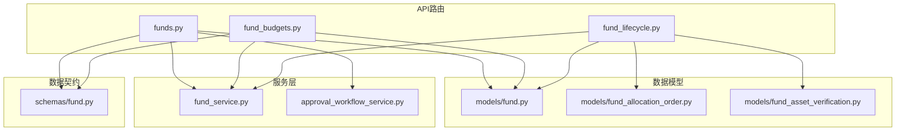
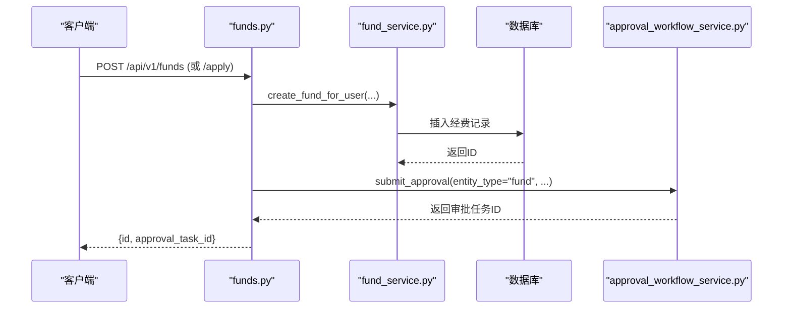
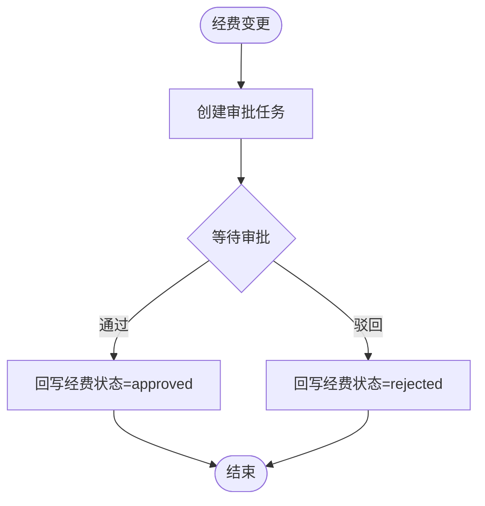
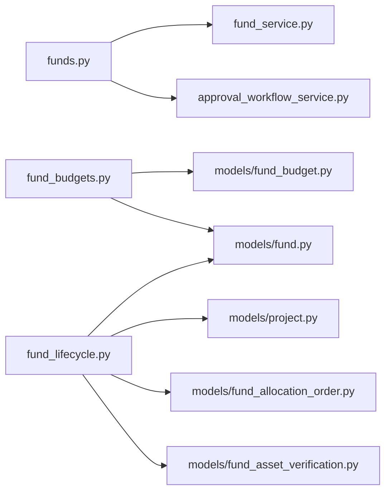

# 经费管理API

<cite>
**本文引用的文件**
- [backend/app/api/v1/funds.py](file://backend/app/api/v1/funds.py)
- [backend/app/api/v1/fund_budgets.py](file://backend/app/api/v1/fund_budgets.py)
- [backend/app/api/v1/fund_lifecycle.py](file://backend/app/api/v1/fund_lifecycle.py)
- [backend/app/models/fund.py](file://backend/app/models/fund.py)
- [backend/app/schemas/fund.py](file://backend/app/schemas/fund.py)
- [backend/app/services/fund_service.py](file://backend/app/services/fund_service.py)
- [backend/app/services/approval_workflow_service.py](file://backend/app/services/approval_workflow_service.py)
- [backend/app/models/fund_allocation_order.py](file://backend/app/models/fund_allocation_order.py)
- [backend/app/models/fund_asset_verification.py](file://backend/app/models/fund_asset_verification.py)
</cite>

## 目录
1. [简介](#简介)
2. [项目结构](#项目结构)
3. [核心组件](#核心组件)
4. [架构总览](#架构总览)
5. [详细组件分析](#详细组件分析)
6. [依赖关系分析](#依赖关系分析)
7. [性能考虑](#性能考虑)
8. [故障排查指南](#故障排查指南)
9. [结论](#结论)
10. [附录：API清单与调用示例](#附录api清单与调用示例)

## 简介
本文件为“经费管理”模块的API文档，覆盖经费CRUD、预算编制与使用明细、资金拨付/划转、资产核查、财务报表统计等能力；同时说明经费状态管理、审批流程集成、数据校验与财务计算等核心业务逻辑。文档以HTTP方法、URL路径、请求参数、响应格式和错误处理为主线，并提供端到端业务流程示例与跨模块（项目管理、审批流程）集成方式。

## 项目结构
经费管理相关代码主要分布在以下位置：
- API路由层：funds.py、fund_budgets.py、fund_lifecycle.py
- 数据模型层：fund.py、fund_allocation_order.py、fund_asset_verification.py
- 服务层：fund_service.py、approval_workflow_service.py
- 数据契约：schemas/fund.py

图表来源
- [backend/app/api/v1/funds.py:1-120](file://backend/app/api/v1/funds.py#L1-L120)
- [backend/app/api/v1/fund_budgets.py:1-60](file://backend/app/api/v1/fund_budgets.py#L1-L60)
- [backend/app/api/v1/fund_lifecycle.py:1-45](file://backend/app/api/v1/fund_lifecycle.py#L1-L45)
- [backend/app/services/fund_service.py:1-40](file://backend/app/services/fund_service.py#L1-L40)
- [backend/app/services/approval_workflow_service.py:1-40](file://backend/app/services/approval_workflow_service.py#L1-L40)
- [backend/app/models/fund.py:61-166](file://backend/app/models/fund.py#L61-L166)
- [backend/app/models/fund_allocation_order.py:23-77](file://backend/app/models/fund_allocation_order.py#L23-L77)
- [backend/app/models/fund_asset_verification.py:22-59](file://backend/app/models/fund_asset_verification.py#L22-L59)
- [backend/app/schemas/fund.py:41-148](file://backend/app/schemas/fund.py#L41-L148)

章节来源
- [backend/app/api/v1/funds.py:1-120](file://backend/app/api/v1/funds.py#L1-L120)
- [backend/app/api/v1/fund_budgets.py:1-60](file://backend/app/api/v1/fund_budgets.py#L1-L60)
- [backend/app/api/v1/fund_lifecycle.py:1-45](file://backend/app/api/v1/fund_lifecycle.py#L1-L45)

## 核心组件
- 经费主数据与生命周期：Fund 模型定义经费字段、状态枚举、时间聚合冗余字段与索引优化；生命周期阶段推进、合规检查、预算锁定等由 fund_lifecycle.py 提供。
- 预算与使用明细：fund_budgets.py 提供预算CRUD、使用明细CRUD、预算汇总与预警。
- 资金拨付与划转：fund_lifecycle.py 提供额度锁定、拨付计划分解、划转凭证CRUD；fund_allocation_order.py 提供拨款指令及明细模型。
- 资产核查：fund_asset_verification.py 提供资产联动校验记录；在 fund_lifecycle.py 中提供核验接口。
- 审批工作流集成：funds.py 通过 ApprovalWorkflowService 自动创建/同步审批任务，并在审批终态回写经费状态。
- 数据契约：schemas/fund.py 定义经费申请/更新/交易等Pydantic模型，统一入参校验与序列化。

章节来源
- [backend/app/models/fund.py:30-166](file://backend/app/models/fund.py#L30-L166)
- [backend/app/api/v1/fund_budgets.py:32-109](file://backend/app/api/v1/fund_budgets.py#L32-L109)
- [backend/app/api/v1/fund_lifecycle.py:549-742](file://backend/app/api/v1/fund_lifecycle.py#L549-L742)
- [backend/app/models/fund_asset_verification.py:22-59](file://backend/app/models/fund_asset_verification.py#L22-L59)
- [backend/app/services/approval_workflow_service.py:30-71](file://backend/app/services/approval_workflow_service.py#L30-L71)
- [backend/app/schemas/fund.py:41-148](file://backend/app/schemas/fund.py#L41-L148)

## 架构总览
经费管理采用“路由-服务-模型”分层设计，结合审批工作流服务实现“业务操作→审批任务→状态回写”的闭环。

图表来源
- [backend/app/api/v1/funds.py:483-531](file://backend/app/api/v1/funds.py#L483-L531)
- [backend/app/services/fund_service.py:132-185](file://backend/app/services/fund_service.py#L132-L185)
- [backend/app/services/approval_workflow_service.py:180-197](file://backend/app/services/approval_workflow_service.py#L180-L197)

## 详细组件分析

### 经费基础CRUD与列表查询
- 列表查询 GET /api/v1/funds
  - 支持分页（offset/keyset）、关键字搜索、按状态/类型/来源/项目/村/学校过滤、组织数据权限隔离、软删过滤。
  - 响应包含 items、total、page、page_size、next_cursor、has_more 等。
- 详情 GET /api/v1/funds/{fund_id}
  - 区分“不存在(404)”与“无权访问(403)”，附带 viewableBecause 元数据。
- 创建 POST /api/v1/funds
  - 需管理员角色；创建后自动提交审批任务。
- 申请 POST /api/v1/funds/apply
  - 登录用户即可提交申请，默认状态 pending，并自动创建审批任务。
- 更新 PUT /api/v1/funds/{fund_id}
  - 仅允许 pending/planned/rejected 状态修改；变更字段落库并记录字段级变更日志；如有变更则自动创建审批任务。
- 删除 DELETE /api/v1/funds/{fund_id}
  - 软删除，仅允许 pending 状态删除。

错误处理要点
- 非法状态修改：400
- 无权限访问：403
- 记录不存在：404
- 日期解析失败：400

章节来源
- [backend/app/api/v1/funds.py:360-445](file://backend/app/api/v1/funds.py#L360-L445)
- [backend/app/api/v1/funds.py:448-480](file://backend/app/api/v1/funds.py#L448-L480)
- [backend/app/api/v1/funds.py:483-531](file://backend/app/api/v1/funds.py#L483-L531)
- [backend/app/api/v1/funds.py:534-590](file://backend/app/api/v1/funds.py#L534-L590)
- [backend/app/api/v1/funds.py:593-609](file://backend/app/api/v1/funds.py#L593-L609)

### 资金统计与报表
- 概览统计 GET /api/v1/funds/statistics/overview
  - 支持按年度过滤；返回总数、金额、各状态计数、已用/已拨金额、预算总额/执行额/剩余/使用率。
- 多维度统计 GET /api/v1/funds/statistics/multi-dimension
  - 支持 period/type/source/status 分组；period 支持 monthly/quarterly/yearly；返回 label、count、金额、利用率等。

注意
- 统计查询利用 year/year_month/year_quarter 冗余字段与复合索引，避免全表扫描。
- 所有统计均排除软删记录。

章节来源
- [backend/app/api/v1/funds.py:617-676](file://backend/app/api/v1/funds.py#L617-L676)
- [backend/app/api/v1/funds.py:679-760](file://backend/app/api/v1/funds.py#L679-L760)
- [backend/app/models/fund.py:66-86](file://backend/app/models/fund.py#L66-L86)

### 预算编制与使用明细
- 预算CRUD
  - 列表 GET /api/v1/fund-budgets
  - 新增 POST /api/v1/fund-budgets
  - 更新 PUT /api/v1/fund-budgets/{budget_id}
  - 删除 DELETE /api/v1/fund-budgets/{budget_id}
- 预算预警 GET /api/v1/fund-budgets/alerts
- 预算汇总 GET /api/v1/fund-budgets/summary
- 使用明细
  - 列表 GET /api/v1/fund-budgets/transactions
  - 新增 POST /api/v1/fund-budgets/transactions
  - 删除 DELETE /api/v1/fund-budgets/transactions/{transaction_id}
- 附件上报
  - 上传 POST /api/v1/fund-budgets/{budget_id}/attachments
  - 列表 GET /api/v1/fund-budgets/{budget_id}/attachments

财务计算与校验
- 新增明细时若关联预算，会预估执行额并禁止超过预算（超100%拒绝）。
- 若关联经费，自动更新 Fund.used_amount 与 remaining_amount。
- 删除明细时反向扣减预算与经费已用金额。

章节来源
- [backend/app/api/v1/fund_budgets.py:114-220](file://backend/app/api/v1/fund_budgets.py#L114-L220)
- [backend/app/api/v1/fund_budgets.py:226-289](file://backend/app/api/v1/fund_budgets.py#L226-L289)
- [backend/app/api/v1/fund_budgets.py:295-406](file://backend/app/api/v1/fund_budgets.py#L295-L406)
- [backend/app/api/v1/fund_budgets.py:412-494](file://backend/app/api/v1/fund_budgets.py#L412-L494)

### 资金拨付与计划下达
- 额度锁定 POST /api/v1/fund-lifecycle/quota-lock/{fund_id}
  - 需先完成阶段2预算基线锁定；校验拨付额度不超过基线。
- 拨付计划分解 GET /api/v1/fund-lifecycle/allocation-plan/{project_id}
  - 返回项目下各经费的计划/批准/拨付/基线等信息。
- 划转凭证
  - 列表 GET /api/v1/fund-lifecycle/transfer-vouchers
  - 新增 POST /api/v1/fund-lifecycle/transfer-vouchers
  - 详情 GET /api/v1/fund-lifecycle/transfer-vouchers/{voucher_id}
  - 更新 PUT /api/v1/fund-lifecycle/transfer-vouchers/{voucher_id}
  - 删除 DELETE /api/v1/fund-lifecycle/transfer-vouchers/{voucher_id}

校验规则
- 新增划转凭证时校验可用预算余额（批准/计划-已用-已确认凭证金额），超限拒绝。
- 已确认凭证不可修改；仅草稿可删除。

章节来源
- [backend/app/api/v1/fund_lifecycle.py:549-621](file://backend/app/api/v1/fund_lifecycle.py#L549-L621)
- [backend/app/api/v1/fund_lifecycle.py:667-798](file://backend/app/api/v1/fund_lifecycle.py#L667-L798)

### 资产核查
- 资产联动校验（与决算联动）
  - 核验接口位于 fund_lifecycle.py（例如 settlement/.../verify-asset），用于将已付款与转固资产价值进行比对，作为销号前置条件。
- 数据模型
  - FundAssetVerification 记录 total_paid、asset_value、difference、difference_rate、status 等。

章节来源
- [backend/app/models/fund_asset_verification.py:22-59](file://backend/app/models/fund_asset_verification.py#L22-L59)
- [backend/tests/unit/test_api_fund_lifecycle_full.py:124-132](file://backend/tests/unit/test_api_fund_lifecycle_full.py#L124-L132)

### 审批流程集成
- 自动创建审批任务
  - 经费新增/申请/变更均自动调用 ApprovalWorkflowService.submit_approval，生成待审批任务。
- 审批终态回写
  - 注册回调 _apply_fund_approval_result：当任务通过/驳回且经费当前为 pending 时，回写经费状态与审批信息，并写入状态历史。
- 直接审批同步
  - 在经费板块直接审批时，同步完结关联的审批任务，保持两端一致。

图表来源
- [backend/app/api/v1/funds.py:75-111](file://backend/app/api/v1/funds.py#L75-L111)
- [backend/app/api/v1/funds.py:114-203](file://backend/app/api/v1/funds.py#L114-L203)
- [backend/app/services/approval_workflow_service.py:30-71](file://backend/app/services/approval_workflow_service.py#L30-L71)

章节来源
- [backend/app/api/v1/funds.py:75-203](file://backend/app/api/v1/funds.py#L75-L203)
- [backend/app/services/approval_workflow_service.py:30-71](file://backend/app/services/approval_workflow_service.py#L30-L71)

### 经费状态管理与流转
- 状态枚举：pending、planned、approved、rejected、allocated、in_use、completed、audited
- 关键约束
  - 非 pending/planned/rejected 不允许随意修改核心字段。
  - 删除仅限 pending。
  - 状态流转通过内部 _transition_status 校验（严格状态机）。
- 审计与留痕
  - 字段级变更记录 FundFieldChange。
  - 状态变更记录 FundStatusHistory。

章节来源
- [backend/app/models/fund.py:49-59](file://backend/app/models/fund.py#L49-L59)
- [backend/app/api/v1/funds.py:534-590](file://backend/app/api/v1/funds.py#L534-L590)
- [backend/app/api/v1/funds.py:593-609](file://backend/app/api/v1/funds.py#L593-L609)

### 与项目管理、审批流程的集成
- 项目管理
  - 经费记录可关联 project_id/project_name；生命周期接口基于 project_id 做权限与数据范围控制。
  - 阶段推进会批量更新项目下所有经费的 lifecycle_phase。
- 审批流程
  - 通过 ApprovalWorkflowService 统一管理流程、节点与任务；支持默认流程自动创建；支持实体变更回写处理器机制。

章节来源
- [backend/app/api/v1/fund_lifecycle.py:51-65](file://backend/app/api/v1/fund_lifecycle.py#L51-L65)
- [backend/app/api/v1/fund_lifecycle.py:188-228](file://backend/app/api/v1/fund_lifecycle.py#L188-L228)
- [backend/app/services/approval_workflow_service.py:180-197](file://backend/app/services/approval_workflow_service.py#L180-L197)

## 依赖关系分析
- funds.py 依赖 fund_service.py 完成经费创建/更新等业务；依赖 approval_workflow_service.py 完成审批任务创建与回写。
- fund_budgets.py 依赖 FundBudget/FundTransaction 模型，并在写入/删除时联动更新 Fund 的金额字段。
- fund_lifecycle.py 依赖 Project、Fund、FundTransferVoucher、FundAllocationOrder、FundAssetVerification 等模型，实现阶段推进、合规检查、预算锁定、划转与资产核验。

图表来源
- [backend/app/api/v1/funds.py:31-45](file://backend/app/api/v1/funds.py#L31-L45)
- [backend/app/api/v1/fund_budgets.py:13-25](file://backend/app/api/v1/fund_budgets.py#L13-L25)
- [backend/app/api/v1/fund_lifecycle.py:18-42](file://backend/app/api/v1/fund_lifecycle.py#L18-L42)
- [backend/app/models/fund_allocation_order.py:23-77](file://backend/app/models/fund_allocation_order.py#L23-L77)
- [backend/app/models/fund_asset_verification.py:22-59](file://backend/app/models/fund_asset_verification.py#L22-L59)

章节来源
- [backend/app/api/v1/funds.py:31-45](file://backend/app/api/v1/funds.py#L31-L45)
- [backend/app/api/v1/fund_budgets.py:13-25](file://backend/app/api/v1/fund_budgets.py#L13-L25)
- [backend/app/api/v1/fund_lifecycle.py:18-42](file://backend/app/api/v1/fund_lifecycle.py#L18-L42)

## 性能考虑
- 统计查询优化：使用 year/year_month/year_quarter 冗余字段与复合索引，避免 strftime 全表扫描。
- N+1 问题规避：列表与详情查询使用 joinedload/selectinload 预加载关联对象。
- 键集分页：支持 keyset 分页，提升大数据量下的列表性能。
- 事务一致性：服务层引入 auto_commit 机制，复杂流程由外层统一控制事务，避免半截子数据。

章节来源
- [backend/app/models/fund.py:66-86](file://backend/app/models/fund.py#L66-L86)
- [backend/app/api/v1/funds.py:380-445](file://backend/app/api/v1/funds.py#L380-L445)
- [backend/app/services/fund_service.py:55-99](file://backend/app/services/fund_service.py#L55-L99)

## 故障排查指南
常见问题与定位建议
- 400 状态码
  - 非法状态流转：检查当前状态是否允许目标状态变更。
  - 预算超额：新增使用明细或划转凭证时，检查预算余额与已确认金额。
  - 日期格式错误：确保 YYYY-MM-DD 或标准 datetime 格式。
- 403 无权限
  - 跨组织访问：检查数据权限隔离策略与当前用户组织范围。
- 404 不存在
  - 经费/预算/凭证/项目不存在时，确认ID是否正确。
- 审批不一致
  - 若出现“任务成功但业务状态未变”，检查审批回写处理器是否执行成功；必要时重试或人工修复。

章节来源
- [backend/app/api/v1/funds.py:534-590](file://backend/app/api/v1/funds.py#L534-L590)
- [backend/app/api/v1/fund_budgets.py:324-376](file://backend/app/api/v1/fund_budgets.py#L324-L376)
- [backend/app/api/v1/fund_lifecycle.py:693-742](file://backend/app/api/v1/fund_lifecycle.py#L693-L742)
- [backend/app/services/approval_workflow_service.py:46-71](file://backend/app/services/approval_workflow_service.py#L46-L71)

## 结论
本模块围绕“经费主数据+预算+拨付+资产+报表+审批”形成完整闭环，具备严格的狀態机校验、完善的审计留痕、高性能统计查询与跨模块集成能力。通过标准化API与服务化封装，既满足前端易用性，也保障后端可扩展性与可维护性。

## 附录：API清单与调用示例

### 经费基础
- GET /api/v1/funds
  - 查询参数：page、page_size、keyword、status、fund_type、fund_source、project_id、village_id、school_id、cursor、pagination、include_deleted
  - 响应：{success, data:{items,total,page,page_size,next_cursor,has_more,pagination}, message}
- GET /api/v1/funds/{fund_id}
  - 响应：{success, data: {...}, message}
- POST /api/v1/funds
  - 请求体：FundCreate（name、amount、planned_amount、approved_amount、allocated_amount、used_amount、remaining_amount、code、type、fund_type、fund_source、project_id、village_id、school_id、purpose、source、operator、receiver、usage_description、status、applicant、remarks、date、start_date、end_date）
  - 响应：{success, data:{id, approval_task_id}, message}
- POST /api/v1/funds/apply
  - 请求体：同 FundCreate
  - 响应：{success, data:{id, approval_task_id}, message}
- PUT /api/v1/funds/{fund_id}
  - 请求体：FundUpdate（可选字段）
  - 响应：{success, data/message}
- DELETE /api/v1/funds/{fund_id}
  - 响应：{success, message}

### 预算与使用明细
- GET /api/v1/fund-budgets
  - 查询参数：year、category、village_id
  - 响应：ok_list(items,total)
- POST /api/v1/fund-budgets
  - 请求体：BudgetCreate
  - 响应：BudgetResponse（含 remaining_amount、execution_rate）
- PUT /api/v1/fund-budgets/{budget_id}
  - 请求体：BudgetUpdate
  - 响应：BudgetResponse
- DELETE /api/v1/fund-budgets/{budget_id}
  - 响应：{success, message}
- GET /api/v1/fund-budgets/alerts
  - 响应：ok_list(items,total)
- GET /api/v1/fund-budgets/summary
  - 响应：{success, data:{year,total_budget,total_executed,total_remaining,execution_rate,by_category[]}}
- GET /api/v1/fund-budgets/transactions
  - 查询参数：fund_id、project_id、village_id、budget_id、page、page_size
  - 响应：List[TransactionResponse]
- POST /api/v1/fund-budgets/transactions
  - 请求体：TransactionCreate
  - 响应：TransactionResponse
- DELETE /api/v1/fund-budgets/transactions/{transaction_id}
  - 响应：{success, message}
- POST /api/v1/fund-budgets/{budget_id}/attachments
  - 表单：file
  - 响应：{success,data:{url,file_name,file_size},message}
- GET /api/v1/fund-budgets/{budget_id}/attachments
  - 响应：ok_list(items,total)

### 资金拨付与划转
- POST /api/v1/fund-lifecycle/quota-lock/{fund_id}
  - 响应：{success, data:{fund_id, allocated}, message}
- GET /api/v1/fund-lifecycle/allocation-plan/{project_id}
  - 响应：{success, data:{project_id, items[]}}
- GET /api/v1/fund-lifecycle/transfer-vouchers
  - 查询参数：project_id、fund_id、status、page、page_size
  - 响应：ok_list(items,total,page,page_size)
- POST /api/v1/fund-lifecycle/transfer-vouchers
  - 请求体：TransferVoucherCreate
  - 响应：{success, data:{...}, message}
- GET /api/v1/fund-lifecycle/transfer-vouchers/{voucher_id}
  - 响应：{success, data:{...}, message}
- PUT /api/v1/fund-lifecycle/transfer-vouchers/{voucher_id}
  - 请求体：TransferVoucherUpdate
  - 响应：{success, data:{...}, message}
- DELETE /api/v1/fund-lifecycle/transfer-vouchers/{voucher_id}
  - 响应：{success, message}

### 资产核查
- POST /api/v1/fund-lifecycle/settlement/{settlement_id}/verify-asset
  - 请求体：{asset_value, opinion}
  - 响应：{success, message}

### 调用示例（JSON）
- 创建经费
  - 方法：POST
  - 路径：/api/v1/funds
  - 请求体示例：
    - {"name":"某帮扶项目经费","amount":100,"planned_amount":120,"fund_type":"project","fund_source":"government","project_id":1,"village_id":10,"purpose":"基础设施改造","applicant":"张三","date":"2026-01-15"}
  - 预期响应：
    - {"success":true,"data":{"id":1,"approval_task_id":10},"message":"创建成功"}
- 申请经费
  - 方法：POST
  - 路径：/api/v1/funds/apply
  - 请求体示例：同创建经费
  - 预期响应：
    - {"success":true,"data":{"id":2,"approval_task_id":11},"message":"申请已提交，等待审批"}
- 新增使用明细
  - 方法：POST
  - 路径：/api/v1/fund-budgets/transactions
  - 请求体示例：
    - {"fund_id":1,"budget_id":5,"amount":20,"purpose":"材料采购","transaction_date":"2026-02-10"}
  - 预期响应：
    - {"id":1,"fund_id":1,"budget_id":5,"amount":20,"purpose":"材料采购","transaction_date":"2026-02-10","status":"submitted",...}
- 创建划转凭证
  - 方法：POST
  - 路径：/api/v1/fund-lifecycle/transfer-vouchers
  - 请求体示例：
    - {"fund_id":1,"voucher_no":"ZB-2026-001","direction":"military_to_local","amount":50,"transfer_date":"2026-03-01"}
  - 预期响应：
    - {"success":true,"data":{"id":1,"voucher_no":"ZB-2026-001",...},"message":"创建成功"}

章节来源
- [backend/app/api/v1/funds.py:360-609](file://backend/app/api/v1/funds.py#L360-L609)
- [backend/app/api/v1/fund_budgets.py:114-494](file://backend/app/api/v1/fund_budgets.py#L114-L494)
- [backend/app/api/v1/fund_lifecycle.py:549-798](file://backend/app/api/v1/fund_lifecycle.py#L549-L798)
- [backend/app/schemas/fund.py:41-148](file://backend/app/schemas/fund.py#L41-L148)