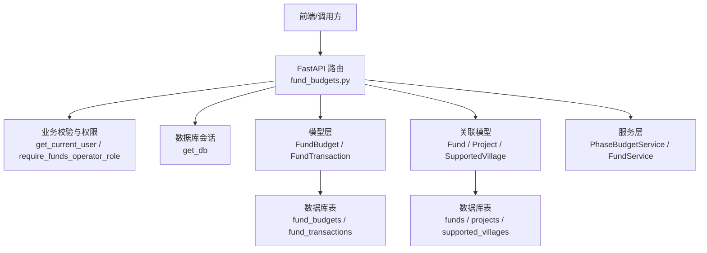
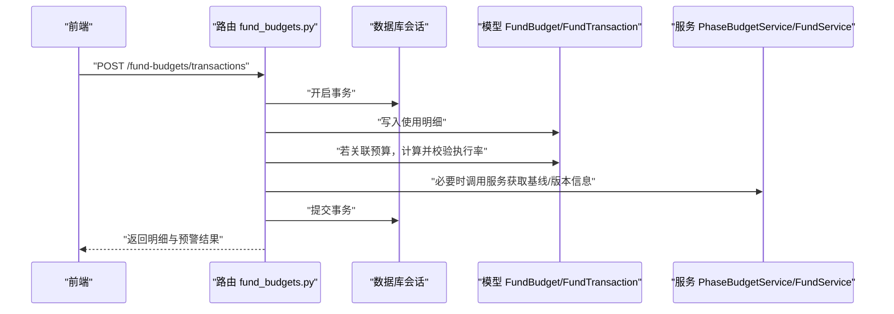
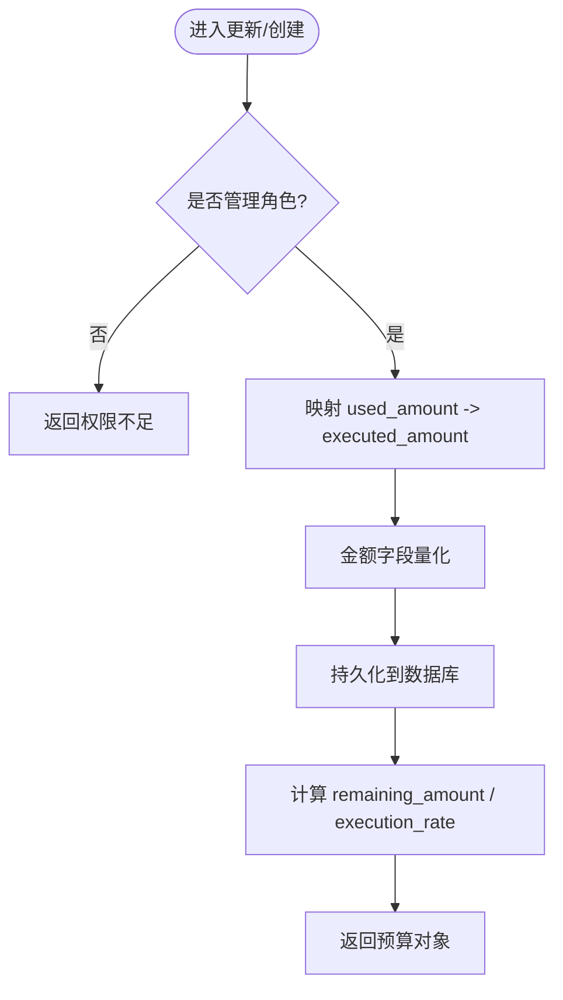
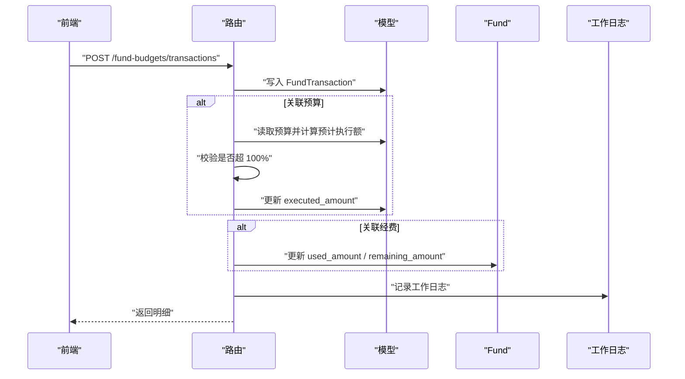
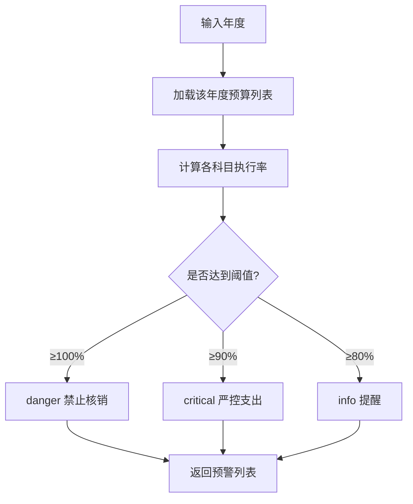
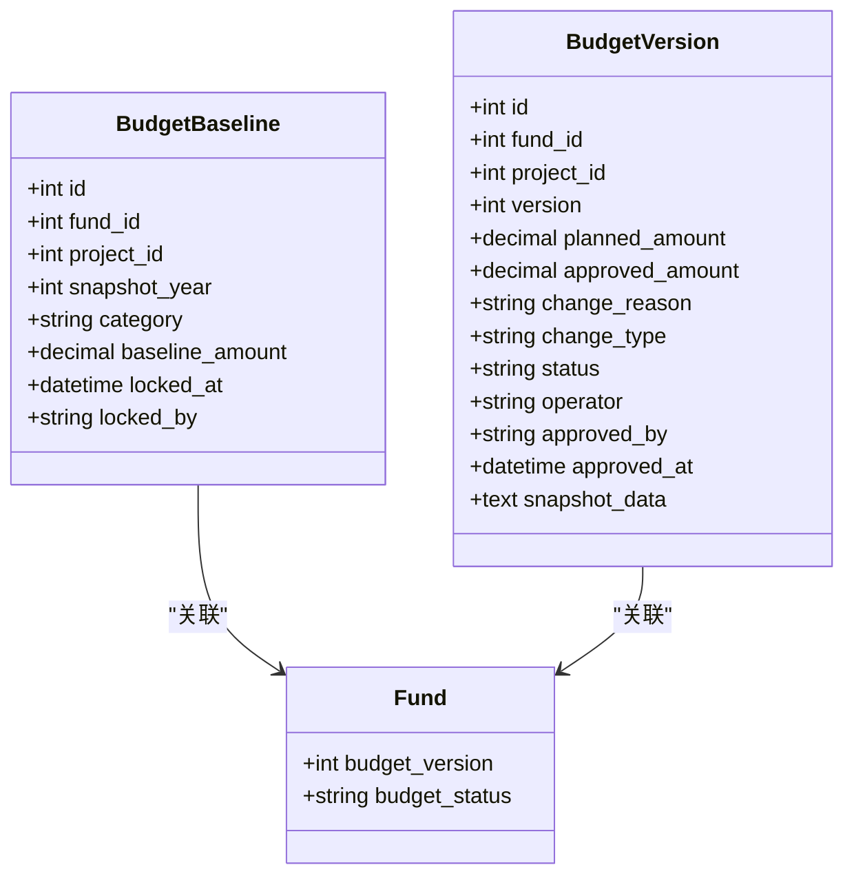
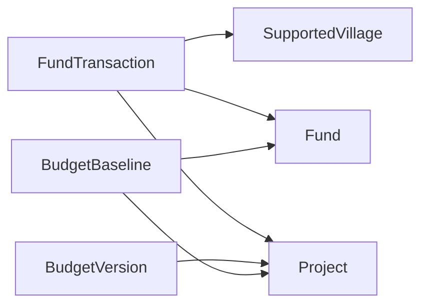
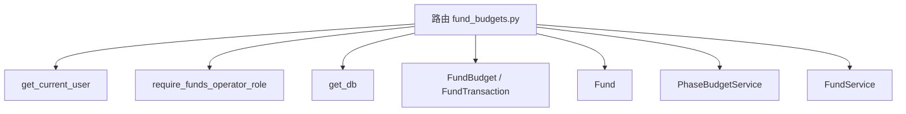

# 预算管理接口

<cite>
**本文引用的文件**
- [backend/app/api/v1/fund_budgets.py](file://backend/app/api/v1/fund_budgets.py)
- [backend/app/models/fund_budget.py](file://backend/app/models/fund_budget.py)
- [backend/app/models/fund_lifecycle.py](file://backend/app/models/fund_lifecycle.py)
- [backend/app/services/funding/phase_budget_service.py](file://backend/app/services/funding/phase_budget_service.py)
- [backend/app/models/fund.py](file://backend/app/models/fund.py)
- [backend/app/services/fund_service.py](file://backend/app/services/fund_service.py)
</cite>

## 目录
1. [简介](#简介)
2. [项目结构](#项目结构)
3. [核心组件](#核心组件)
4. [架构总览](#架构总览)
5. [详细组件分析](#详细组件分析)
6. [依赖关系分析](#依赖关系分析)
7. [性能考虑](#性能考虑)
8. [故障排查指南](#故障排查指南)
9. [结论](#结论)
10. [附录：API 规范与调用示例](#附录api-规范与调用示例)

## 简介
本文件为“预算管理”模块的完整 API 文档，覆盖预算编制、预算调整、预算执行跟踪、预算统计、预算版本管理、预算审批流程、预算执行率计算、预算超支预警以及与经费申请、项目计划等模块的集成方式。文档以实际后端实现为依据，提供 HTTP 方法、URL 路径、请求参数、响应格式、错误处理及典型调用示例，帮助前后端协同开发与联调。

## 项目结构
预算管理相关代码主要分布在以下位置：
- 路由与控制器：backend/app/api/v1/fund_budgets.py
- 数据模型：backend/app/models/fund_budget.py、backend/app/models/fund_lifecycle.py、backend/app/models/fund.py
- 服务层：backend/app/services/funding/phase_budget_service.py、backend/app/services/fund_service.py

图表来源
- [backend/app/api/v1/fund_budgets.py:1-494](file://backend/app/api/v1/fund_budgets.py#L1-L494)
- [backend/app/models/fund_budget.py:1-202](file://backend/app/models/fund_budget.py#L1-L202)
- [backend/app/models/fund.py:1-299](file://backend/app/models/fund.py#L1-L299)
- [backend/app/services/funding/phase_budget_service.py:1-45](file://backend/app/services/funding/phase_budget_service.py#L1-L45)

章节来源
- [backend/app/api/v1/fund_budgets.py:1-494](file://backend/app/api/v1/fund_budgets.py#L1-L494)
- [backend/app/models/fund_budget.py:1-202](file://backend/app/models/fund_budget.py#L1-L202)
- [backend/app/models/fund.py:1-299](file://backend/app/models/fund.py#L1-L299)
- [backend/app/services/funding/phase_budget_service.py:1-45](file://backend/app/services/funding/phase_budget_service.py#L1-L45)

## 核心组件
- 预算实体与明细
  - 年度预算：FundBudget（科目、预算金额、已执行金额、剩余金额、执行率）
  - 使用明细：FundTransaction（关联经费/项目/村/预算，记录支出用途、日期、凭证等）
- 预算预警与统计
  - 阈值：80% 提醒、90% 警告、100% 禁止核销
  - 汇总：按年度、按科目统计预算总额、已执行、剩余、执行率
- 预算基线与版本
  - 预算基线快照：BudgetBaseline（阶段2锁定）
  - 预算版本：BudgetVersion（变更类型 initial/adjust/approve，状态 draft/submitted/approved/rejected）
- 与经费、项目的集成
  - 创建/删除使用明细时联动更新 Fund.used_amount 与 remaining_amount
  - 通过 project_id、village_id 与项目、帮扶村建立关联

章节来源
- [backend/app/models/fund_budget.py:19-141](file://backend/app/models/fund_budget.py#L19-L141)
- [backend/app/models/fund_lifecycle.py:156-188](file://backend/app/models/fund_lifecycle.py#L156-L188)
- [backend/app/models/fund_lifecycle.py:411-449](file://backend/app/models/fund_lifecycle.py#L411-L449)
- [backend/app/models/fund.py:61-166](file://backend/app/models/fund.py#L61-L166)

## 架构总览
预算管理采用分层架构：API 路由负责入参校验、权限控制与事务提交；服务层封装复杂业务逻辑；模型层定义数据表结构与属性计算；通过外键与索引与经费、项目、村庄等模块解耦协作。

图表来源
- [backend/app/api/v1/fund_budgets.py:324-376](file://backend/app/api/v1/fund_budgets.py#L324-L376)
- [backend/app/models/fund_budget.py:143-202](file://backend/app/models/fund_budget.py#L143-L202)
- [backend/app/services/funding/phase_budget_service.py:14-45](file://backend/app/services/funding/phase_budget_service.py#L14-L45)

## 详细组件分析

### 预算 CRUD 与附件
- 列表查询：GET /fund-budgets
  - 查询参数：year、category、village_id
  - 响应：包含 budget、used、remaining_amount、execution_rate 等字段
- 创建预算：POST /fund-budgets
  - 请求体：year、category、budget_amount、executed_amount（或 used_amount）、village_id、organization_id、description、remarks
  - 权限：仅管理角色
  - 响应：预算对象，含剩余金额与执行率
- 更新预算：PUT /fund-budgets/{budget_id}
  - 请求体：budget_amount、executed_amount（或 used_amount）、description、remarks
  - 权限：仅管理角色
- 删除预算：DELETE /fund-budgets/{budget_id}
  - 权限：仅管理角色
- 预算附件
  - 上传：POST /fund-budgets/{budget_id}/attachments
  - 列表：GET /fund-budgets/{budget_id}/attachments
  - 备注：附件记录以 JSON 数组形式追加到 remarks 字段

图表来源
- [backend/app/api/v1/fund_budgets.py:146-204](file://backend/app/api/v1/fund_budgets.py#L146-L204)
- [backend/app/api/v1/fund_budgets.py:412-460](file://backend/app/api/v1/fund_budgets.py#L412-L460)

章节来源
- [backend/app/api/v1/fund_budgets.py:114-220](file://backend/app/api/v1/fund_budgets.py#L114-L220)
- [backend/app/api/v1/fund_budgets.py:412-494](file://backend/app/api/v1/fund_budgets.py#L412-L494)

### 预算执行跟踪（使用明细）
- 明细列表：GET /fund-budgets/transactions
  - 查询参数：fund_id、project_id、village_id、budget_id、page、page_size
- 创建明细：POST /fund-budgets/transactions
  - 请求体：fund_id、project_id、village_id、budget_id、amount、category、purpose、transaction_date、receipt_number、handler、reimbursement_person、remarks
  - 业务规则：
    - 若关联预算，自动累加 executed_amount，并在预计超过预算时拒绝（超 100% 禁止核销）
    - 若关联经费，自动更新 Fund.used_amount 与 remaining_amount
    - 写工作日志
- 删除明细：DELETE /fund-budgets/transactions/{transaction_id}
  - 回滚已执行金额与经费使用金额

图表来源
- [backend/app/api/v1/fund_budgets.py:324-376](file://backend/app/api/v1/fund_budgets.py#L324-L376)
- [backend/app/models/fund_budget.py:78-141](file://backend/app/models/fund_budget.py#L78-L141)
- [backend/app/models/fund.py:61-166](file://backend/app/models/fund.py#L61-L166)

章节来源
- [backend/app/api/v1/fund_budgets.py:295-406](file://backend/app/api/v1/fund_budgets.py#L295-L406)
- [backend/app/models/fund_budget.py:78-141](file://backend/app/models/fund_budget.py#L78-L141)
- [backend/app/models/fund.py:61-166](file://backend/app/models/fund.py#L61-L166)

### 预算预警与统计
- 预警：GET /fund-budgets/alerts
  - 查询参数：year（默认当前年）
  - 返回：按科目输出 level（info/critical/danger）、execution_rate、message
- 汇总：GET /fund-budgets/summary
  - 查询参数：year（默认当前年）
  - 返回：total_budget、total_executed、total_remaining、execution_rate、by_category（每科目预算/执行/剩余/执行率）

图表来源
- [backend/app/api/v1/fund_budgets.py:226-243](file://backend/app/api/v1/fund_budgets.py#L226-L243)
- [backend/app/models/fund_budget.py:143-202](file://backend/app/models/fund_budget.py#L143-L202)

章节来源
- [backend/app/api/v1/fund_budgets.py:226-289](file://backend/app/api/v1/fund_budgets.py#L226-L289)
- [backend/app/models/fund_budget.py:143-202](file://backend/app/models/fund_budget.py#L143-L202)

### 预算版本管理与审批流程
- 预算基线（阶段2锁定）
  - 服务：PhaseBudgetService.list_baselines / create_baseline / get_budget_summary
  - 模型：BudgetBaseline（fund_id、project_id、snapshot_year、baseline_amount、locked_at、locked_by）
- 预算版本（痕迹追踪）
  - 模型：BudgetVersion（version、planned_amount、approved_amount、change_reason、change_type、status、operator、approved_by、approved_at、snapshot_data）
- 审批状态流转
  - 版本状态：draft → submitted → approved / rejected
  - 结合 Fund.budget_version、Fund.budget_status 进行全局版本与状态管理

图表来源
- [backend/app/models/fund_lifecycle.py:156-188](file://backend/app/models/fund_lifecycle.py#L156-L188)
- [backend/app/models/fund_lifecycle.py:411-449](file://backend/app/models/fund_lifecycle.py#L411-L449)
- [backend/app/models/fund.py:134-143](file://backend/app/models/fund.py#L134-L143)
- [backend/app/services/funding/phase_budget_service.py:14-45](file://backend/app/services/funding/phase_budget_service.py#L14-L45)

章节来源
- [backend/app/services/funding/phase_budget_service.py:14-45](file://backend/app/services/funding/phase_budget_service.py#L14-L45)
- [backend/app/models/fund_lifecycle.py:156-188](file://backend/app/models/fund_lifecycle.py#L156-L188)
- [backend/app/models/fund_lifecycle.py:411-449](file://backend/app/models/fund_lifecycle.py#L411-L449)
- [backend/app/models/fund.py:134-143](file://backend/app/models/fund.py#L134-L143)

### 与经费申请、项目计划的集成
- 与经费（Fund）集成
  - 创建/删除使用明细时同步更新 Fund.used_amount 与 remaining_amount
  - 支持按 fund_id、project_id、village_id 过滤明细
- 与项目（Project）集成
  - 明细与版本均支持 project_id 关联，便于按项目维度统计与审计
- 与村庄（SupportedVillage）集成
  - 预算与明细支持 village_id，便于村级预算与执行跟踪

图表来源
- [backend/app/models/fund_budget.py:78-141](file://backend/app/models/fund_budget.py#L78-L141)
- [backend/app/models/fund_lifecycle.py:156-188](file://backend/app/models/fund_lifecycle.py#L156-L188)
- [backend/app/models/fund_lifecycle.py:411-449](file://backend/app/models/fund_lifecycle.py#L411-L449)
- [backend/app/models/fund.py:61-166](file://backend/app/models/fund.py#L61-L166)

章节来源
- [backend/app/api/v1/fund_budgets.py:324-406](file://backend/app/api/v1/fund_budgets.py#L324-L406)
- [backend/app/models/fund_budget.py:78-141](file://backend/app/models/fund_budget.py#L78-L141)
- [backend/app/models/fund.py:61-166](file://backend/app/models/fund.py#L61-L166)

## 依赖关系分析
- 路由依赖
  - 用户认证：get_current_user
  - 权限控制：require_funds_operator_role（管理角色）
  - 数据库会话：get_db
  - 工具：safe_commit、quantize_money_fields、BUDGET_MONEY_FIELDS
- 模型依赖
  - FundBudget、FundTransaction 与 Fund、Project、SupportedVillage 通过外键关联
  - BudgetBaseline、BudgetVersion 与 Fund、Project 关联
- 服务依赖
  - PhaseBudgetService 基于异步 Session 操作 BudgetBaseline
  - FundService 提供经费聚合查询与状态机能力

图表来源
- [backend/app/api/v1/fund_budgets.py:1-27](file://backend/app/api/v1/fund_budgets.py#L1-L27)
- [backend/app/services/funding/phase_budget_service.py:14-45](file://backend/app/services/funding/phase_budget_service.py#L14-L45)
- [backend/app/services/fund_service.py:29-99](file://backend/app/services/fund_service.py#L29-L99)

章节来源
- [backend/app/api/v1/fund_budgets.py:1-27](file://backend/app/api/v1/fund_budgets.py#L1-L27)
- [backend/app/services/funding/phase_budget_service.py:14-45](file://backend/app/services/funding/phase_budget_service.py#L14-L45)
- [backend/app/services/fund_service.py:29-99](file://backend/app/services/fund_service.py#L29-L99)

## 性能考虑
- 索引优化
  - 预算表：year、category、year+category、village_id 复合索引
  - 明细表：fund_id、project_id、village_id、transaction_date、category 索引
  - 经费表：year_month、year_quarter、year 等聚合冗余字段与复合索引，避免全表扫描
- 查询优化
  - 列表分页：offset + limit
  - 预加载：在服务层使用 joinedload/selectinload 减少 N+1
- 数值精度
  - 金额统一量化，避免浮点误差
- 事务一致性
  - 使用 safe_commit 保证多表更新的原子性

[本节为通用性能建议，不直接分析具体文件]

## 故障排查指南
- 常见错误
  - 404 预算不存在：检查预算 ID 是否正确
  - 400 超预算：创建明细时预计执行额超过预算，需先调整预算
  - 权限不足：非管理角色尝试修改预算或明细
- 定位步骤
  - 查看预警接口返回的 level 与 message
  - 核对明细的 budget_id、fund_id 关联是否正确
  - 检查 Fund.used_amount 与 remaining_amount 是否同步更新
- 日志与审计
  - 明细创建会写入工作日志，便于追溯
  - 预算附件上传记录在 remarks 中，可回溯上传轨迹

章节来源
- [backend/app/api/v1/fund_budgets.py:226-243](file://backend/app/api/v1/fund_budgets.py#L226-L243)
- [backend/app/api/v1/fund_budgets.py:324-376](file://backend/app/api/v1/fund_budgets.py#L324-L376)
- [backend/app/api/v1/fund_budgets.py:412-460](file://backend/app/api/v1/fund_budgets.py#L412-L460)

## 结论
本模块围绕“预算—执行—预警—统计—版本—审批”形成闭环，既满足日常预算编制与执行跟踪，又通过基线锁定与版本快照保障变更可追溯。与经费、项目、村庄的深度集成使得跨域统计与审计成为可能。建议在后续迭代中完善预算调整的审批流与批量处理能力，进一步提升系统可用性与可维护性。

[本节为总结性内容，不直接分析具体文件]

## 附录：API 规范与调用示例

### 预算接口
- GET /fund-budgets
  - 查询参数：year、category、village_id
  - 响应：预算列表，包含 budget、used、remaining_amount、execution_rate
- POST /fund-budgets
  - 请求体：year、category、budget_amount、executed_amount（或 used_amount）、village_id、organization_id、description、remarks
  - 响应：预算对象
- PUT /fund-budgets/{budget_id}
  - 请求体：budget_amount、executed_amount（或 used_amount）、description、remarks
  - 响应：预算对象
- DELETE /fund-budgets/{budget_id}
  - 响应：成功消息

章节来源
- [backend/app/api/v1/fund_budgets.py:114-220](file://backend/app/api/v1/fund_budgets.py#L114-L220)

### 预算执行接口
- GET /fund-budgets/transactions
  - 查询参数：fund_id、project_id、village_id、budget_id、page、page_size
- POST /fund-budgets/transactions
  - 请求体：fund_id、project_id、village_id、budget_id、amount、category、purpose、transaction_date、receipt_number、handler、reimbursement_person、remarks
  - 响应：明细对象
- DELETE /fund-budgets/transactions/{transaction_id}
  - 响应：成功消息

章节来源
- [backend/app/api/v1/fund_budgets.py:295-406](file://backend/app/api/v1/fund_budgets.py#L295-L406)

### 预算预警与统计
- GET /fund-budgets/alerts
  - 查询参数：year（默认当前年）
  - 响应：预警列表（level、execution_rate、message）
- GET /fund-budgets/summary
  - 查询参数：year（默认当前年）
  - 响应：年度汇总（total_budget、total_executed、total_remaining、execution_rate、by_category）

章节来源
- [backend/app/api/v1/fund_budgets.py:226-289](file://backend/app/api/v1/fund_budgets.py#L226-L289)

### 预算附件
- POST /fund-budgets/{budget_id}/attachments
  - 表单：file
  - 响应：success、data.url、data.file_name、data.file_size
- GET /fund-budgets/{budget_id}/attachments
  - 响应：附件列表

章节来源
- [backend/app/api/v1/fund_budgets.py:412-460](file://backend/app/api/v1/fund_budgets.py#L412-L460)

### 预算版本与基线（服务层）
- 列出基线：PhaseBudgetService.list_baselines(fund_id)
- 创建基线：PhaseBudgetService.create_baseline(**kwargs)
- 汇总：PhaseBudgetService.get_budget_summary(fund_id)

章节来源
- [backend/app/services/funding/phase_budget_service.py:14-45](file://backend/app/services/funding/phase_budget_service.py#L14-L45)
- [backend/app/models/fund_lifecycle.py:156-188](file://backend/app/models/fund_lifecycle.py#L156-L188)
- [backend/app/models/fund_lifecycle.py:411-449](file://backend/app/models/fund_lifecycle.py#L411-L449)

### 典型业务流程示例
- 预算编制与执行
  1) 创建预算：POST /fund-budgets
  2) 录入使用明细：POST /fund-budgets/transactions（关联预算与经费）
  3) 查看预警：GET /fund-budgets/alerts
  4) 查看汇总：GET /fund-budgets/summary
- 预算调整与版本
  1) 创建预算版本：通过服务层或后续扩展接口创建 BudgetVersion（change_type=adjust）
  2) 提交审批：更新版本状态至 submitted/approved
  3) 锁定基线：创建 BudgetBaseline（阶段2），防止随意变更
- 与项目、村庄联动
  - 在明细与版本中设置 project_id、village_id，便于按维度统计与审计

[本节为流程说明，不直接分析具体文件]