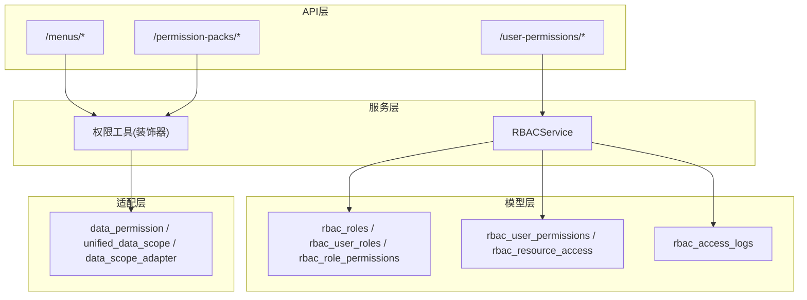
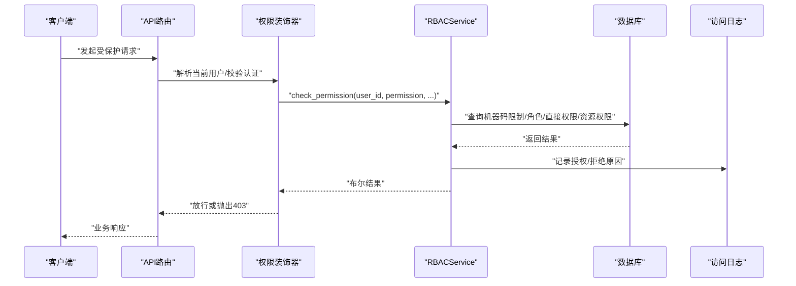
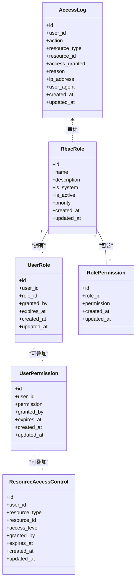
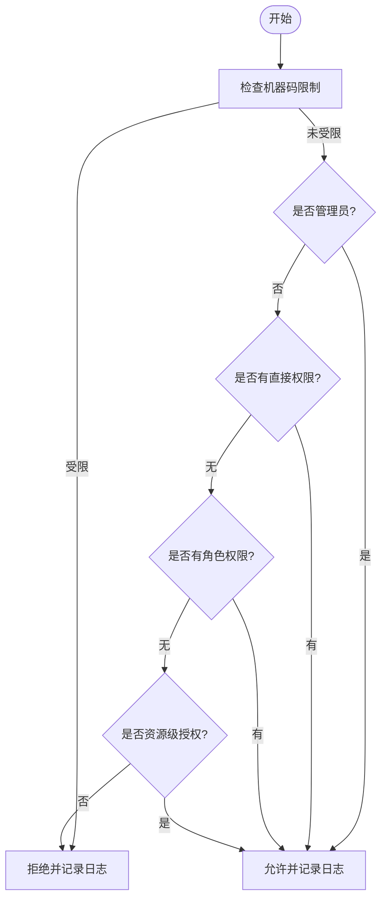
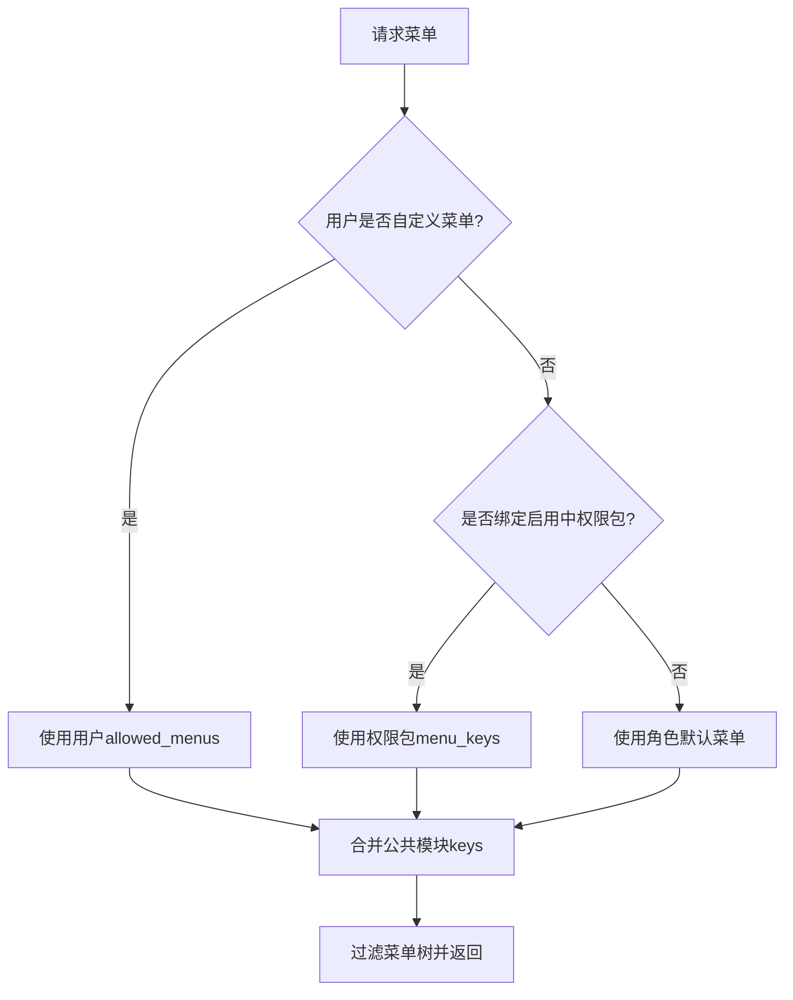
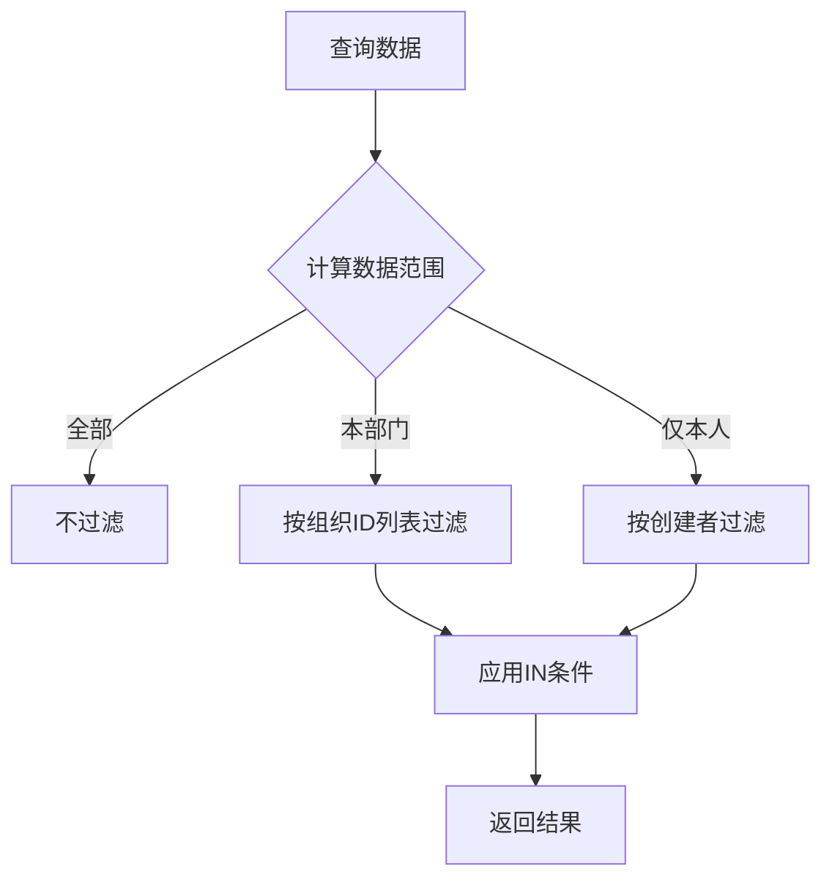
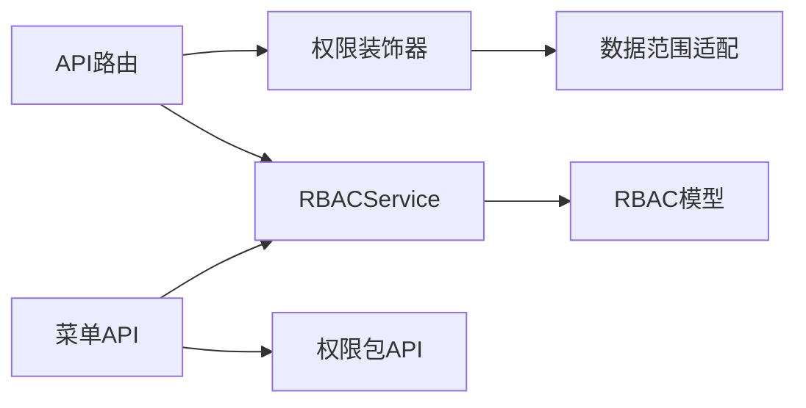

# RBAC权限管理接口

<cite>
**本文引用的文件**
- [backend/app/models/rbac.py](file://backend/app/models/rbac.py)
- [backend/app/services/rbac_service.py](file://backend/app/services/rbac_service.py)
- [backend/app/core/permission_utils.py](file://backend/app/core/permission_utils.py)
- [backend/app/core/data_permission.py](file://backend/app/core/data_permission.py)
- [backend/app/core/unified_data_scope.py](file://backend/app/core/unified_data_scope.py)
- [backend/app/core/data_scope_adapter.py](file://backend/app/core/data_scope_adapter.py)
- [backend/app/api/v1/menus.py](file://backend/app/api/v1/menus.py)
- [backend/app/api/v1/permission_packs.py](file://backend/app/api/v1/permission_packs.py)
- [backend/app/api/v1/user_permissions.py](file://backend/app/api/v1/user_permissions.py)
- [backend/app/models/role.py](file://backend/app/models/role.py)
</cite>

## 目录
1. [简介](#简介)
2. [项目结构](#项目结构)
3. [核心组件](#核心组件)
4. [架构总览](#架构总览)
5. [详细组件分析](#详细组件分析)
6. [依赖关系分析](#依赖关系分析)
7. [性能与缓存](#性能与缓存)
8. [故障排查指南](#故障排查指南)
9. [结论](#结论)
10. [附录：API清单与示例](#附录api清单与示例)

## 简介
本文件面向RBAC（基于角色的访问控制）权限管理，覆盖角色管理、权限分配、菜单权限控制、数据范围隔离等能力。文档聚焦HTTP方法、URL路径、请求参数、响应格式与错误处理，并说明四级角色体系、细粒度权限控制、动态权限验证、数据范围适配器等核心技术细节。同时提供典型调用示例与性能优化建议。

## 项目结构
后端采用分层设计：
- API层：FastAPI路由定义，负责鉴权、入参校验、统一响应封装
- 服务层：RBACService等业务逻辑，实现权限计算、角色/权限分配、资源访问控制
- 模型层：ORM模型定义角色、用户-角色、角色-权限、用户-权限、资源访问控制、访问日志等
- 工具与适配层：权限装饰器、数据范围判定与适配、组织树展开、事务与缓存等

图表来源
- [backend/app/api/v1/menus.py:1-800](file://backend/app/api/v1/menus.py#L1-L800)
- [backend/app/api/v1/permission_packs.py:1-288](file://backend/app/api/v1/permission_packs.py#L1-L288)
- [backend/app/api/v1/user_permissions.py:1-449](file://backend/app/api/v1/user_permissions.py#L1-L449)
- [backend/app/services/rbac_service.py:1-746](file://backend/app/services/rbac_service.py#L1-L746)
- [backend/app/models/rbac.py:1-263](file://backend/app/models/rbac.py#L1-L263)
- [backend/app/core/data_permission.py:1-187](file://backend/app/core/data_permission.py#L1-L187)
- [backend/app/core/unified_data_scope.py:1-343](file://backend/app/core/unified_data_scope.py#L1-L343)
- [backend/app/core/data_scope_adapter.py:1-225](file://backend/app/core/data_scope_adapter.py#L1-L225)

章节来源
- [backend/app/api/v1/menus.py:1-800](file://backend/app/api/v1/menus.py#L1-L800)
- [backend/app/api/v1/permission_packs.py:1-288](file://backend/app/api/v1/permission_packs.py#L1-L288)
- [backend/app/api/v1/user_permissions.py:1-449](file://backend/app/api/v1/user_permissions.py#L1-L449)
- [backend/app/services/rbac_service.py:1-746](file://backend/app/services/rbac_service.py#L1-L746)
- [backend/app/models/rbac.py:1-263](file://backend/app/models/rbac.py#L1-L263)
- [backend/app/core/data_permission.py:1-187](file://backend/app/core/data_permission.py#L1-L187)
- [backend/app/core/unified_data_scope.py:1-343](file://backend/app/core/unified_data_scope.py#L1-L343)
- [backend/app/core/data_scope_adapter.py:1-225](file://backend/app/core/data_scope_adapter.py#L1-L225)

## 核心组件
- RBACService：集中实现权限检查、角色/权限分配、批量授予/撤销、资源访问控制、访问日志记录
- 权限工具：提供管理员校验、组织访问控制、细粒度权限检查装饰器
- 数据范围：统一按角色或组织树进行数据可见性过滤，支持“全部/本部门/仅本人”
- 菜单权限：菜单定义+角色默认+权限包+用户级配置的多级优先级控制
- 权限包：将一组菜单key打包，批量绑定给普通用户，快速控制前端可见功能

章节来源
- [backend/app/services/rbac_service.py:1-746](file://backend/app/services/rbac_service.py#L1-L746)
- [backend/app/core/permission_utils.py:1-360](file://backend/app/core/permission_utils.py#L1-L360)
- [backend/app/core/data_permission.py:1-187](file://backend/app/core/data_permission.py#L1-L187)
- [backend/app/core/unified_data_scope.py:1-343](file://backend/app/core/unified_data_scope.py#L1-L343)
- [backend/app/core/data_scope_adapter.py:1-225](file://backend/app/core/data_scope_adapter.py#L1-L225)
- [backend/app/api/v1/menus.py:1-800](file://backend/app/api/v1/menus.py#L1-L800)
- [backend/app/api/v1/permission_packs.py:1-288](file://backend/app/api/v1/permission_packs.py#L1-L288)

## 架构总览
下图展示一次“权限检查”的完整调用链：API层通过装饰器或显式调用进入RBACService，依次检查机器码限制、管理员特权、直接权限、角色权限、资源权限，并记录访问日志。

图表来源
- [backend/app/services/rbac_service.py:133-222](file://backend/app/services/rbac_service.py#L133-L222)
- [backend/app/core/permission_utils.py:272-309](file://backend/app/core/permission_utils.py#L272-L309)
- [backend/app/models/rbac.py:191-218](file://backend/app/models/rbac.py#L191-L218)

## 详细组件分析

### 角色与权限数据模型
- 角色：RbacRole（名称、描述、是否系统内置、是否启用、优先级、时间戳）
- 用户-角色：UserRole（用户ID、角色ID、授权人、过期时间）
- 角色-权限：RolePermission（角色ID、权限标识）
- 用户-权限：UserPermission（用户ID、权限标识、授权人、过期时间）
- 资源访问控制：ResourceAccessControl（用户ID、资源类型、资源ID、访问级别）
- 访问日志：AccessLog（用户ID、动作、资源、是否授权、原因、IP、UA）

图表来源
- [backend/app/models/rbac.py:31-218](file://backend/app/models/rbac.py#L31-L218)

章节来源
- [backend/app/models/rbac.py:31-218](file://backend/app/models/rbac.py#L31-L218)

### RBACService权限计算流程
- 权限检查顺序：机器码限制 > 管理员特权 > 直接权限 > 角色权限 > 资源权限
- 支持批量授予/撤销权限、原子保存权限集合
- 支持带过期时间的角色/权限分配
- 每次检查均记录访问日志（成功/失败及原因）

图表来源
- [backend/app/services/rbac_service.py:133-222](file://backend/app/services/rbac_service.py#L133-L222)
- [backend/app/services/rbac_service.py:716-741](file://backend/app/services/rbac_service.py#L716-L741)

章节来源
- [backend/app/services/rbac_service.py:133-222](file://backend/app/services/rbac_service.py#L133-L222)
- [backend/app/services/rbac_service.py:716-741](file://backend/app/services/rbac_service.py#L716-L741)

### 菜单权限控制
- 菜单定义集中维护，含key、label、path、icon、order、roles、children
- 可见菜单优先级：用户级allowed_menus > 绑定的启用中权限包 > 角色默认
- 公共模块（政策法规、数据分析相关）对所有角色可见
- 提供获取当前用户可见菜单、管理员获取全量菜单、查看/设置用户菜单配置的接口

图表来源
- [backend/app/api/v1/menus.py:541-607](file://backend/app/api/v1/menus.py#L541-L607)
- [backend/app/api/v1/menus.py:661-695](file://backend/app/api/v1/menus.py#L661-L695)

章节来源
- [backend/app/api/v1/menus.py:50-538](file://backend/app/api/v1/menus.py#L50-L538)
- [backend/app/api/v1/menus.py:541-607](file://backend/app/api/v1/menus.py#L541-L607)
- [backend/app/api/v1/menus.py:661-695](file://backend/app/api/v1/menus.py#L661-L695)

### 权限包管理
- 权限包是一组菜单key的集合，用于批量控制普通用户的可见功能
- 支持创建、更新、删除、批量绑定/解绑用户
- 名称唯一性校验、菜单key合法性校验、绑定用户数统计

章节来源
- [backend/app/api/v1/permission_packs.py:1-288](file://backend/app/api/v1/permission_packs.py#L1-L288)

### 数据范围隔离
- 三级数据范围：全部（super_admin）、本部门（admin）、仅本人（普通用户）
- 支持按组织树展开（包含下级组织），并提供统一适配器兼容新旧两种实现
- 当模型缺少必要字段时，fail-closed降级为仅本人或空集，避免静默放行

图表来源
- [backend/app/core/data_permission.py:20-80](file://backend/app/core/data_permission.py#L20-L80)
- [backend/app/core/data_permission.py:83-134](file://backend/app/core/data_permission.py#L83-L134)
- [backend/app/core/unified_data_scope.py:56-82](file://backend/app/core/unified_data_scope.py#L56-L82)
- [backend/app/core/data_scope_adapter.py:114-183](file://backend/app/core/data_scope_adapter.py#L114-L183)

章节来源
- [backend/app/core/data_permission.py:20-187](file://backend/app/core/data_permission.py#L20-L187)
- [backend/app/core/unified_data_scope.py:56-183](file://backend/app/core/unified_data_scope.py#L56-L183)
- [backend/app/core/data_scope_adapter.py:58-183](file://backend/app/core/data_scope_adapter.py#L58-L183)

## 依赖关系分析
- API路由依赖服务层RBACService与权限工具装饰器
- 服务层依赖ORM模型与机器码权限服务
- 数据范围模块被多个业务模块复用，并通过适配器统一入口
- 菜单权限与权限包共同决定前端可见菜单

图表来源
- [backend/app/api/v1/menus.py:1-800](file://backend/app/api/v1/menus.py#L1-L800)
- [backend/app/api/v1/permission_packs.py:1-288](file://backend/app/api/v1/permission_packs.py#L1-L288)
- [backend/app/services/rbac_service.py:1-746](file://backend/app/services/rbac_service.py#L1-L746)
- [backend/app/core/permission_utils.py:1-360](file://backend/app/core/permission_utils.py#L1-L360)
- [backend/app/core/data_scope_adapter.py:1-225](file://backend/app/core/data_scope_adapter.py#L1-L225)

章节来源
- [backend/app/api/v1/menus.py:1-800](file://backend/app/api/v1/menus.py#L1-L800)
- [backend/app/api/v1/permission_packs.py:1-288](file://backend/app/api/v1/permission_packs.py#L1-L288)
- [backend/app/services/rbac_service.py:1-746](file://backend/app/services/rbac_service.py#L1-L746)
- [backend/app/core/permission_utils.py:1-360](file://backend/app/core/permission_utils.py#L1-L360)
- [backend/app/core/data_scope_adapter.py:1-225](file://backend/app/core/data_scope_adapter.py#L1-L225)

## 性能与缓存
- 请求级权限缓存：在单次请求内缓存机器码限制权限，避免重复查询
- 批量操作优化：预查询已存在权限，减少无效写入；批量INSERT/DELETE降低IO次数
- 菜单缓存：对角色默认菜单键集合使用LRU缓存，减少遍历开销
- 组织树展开：限制递归深度，防止循环引用导致性能问题
- 建议：
  - 高频权限检查可结合Redis缓存用户有效权限集合（TTL策略）
  - 对菜单树渲染结果做短期缓存（如1分钟）
  - 对权限包变更事件触发缓存失效

章节来源
- [backend/app/services/rbac_service.py:45-47](file://backend/app/services/rbac_service.py#L45-L47)
- [backend/app/services/rbac_service.py:224-235](file://backend/app/services/rbac_service.py#L224-L235)
- [backend/app/services/rbac_service.py:407-454](file://backend/app/services/rbac_service.py#L407-L454)
- [backend/app/api/v1/menus.py:541-557](file://backend/app/api/v1/menus.py#L541-L557)
- [backend/app/core/unified_data_scope.py:245-276](file://backend/app/core/unified_data_scope.py#L245-L276)

## 故障排查指南
- 401 未认证：确认请求携带有效令牌，且依赖注入能解析到current_user
- 403 权限不足：
  - 检查机器码限制是否命中
  - 检查是否具备直接权限或角色权限
  - 检查资源级授权是否存在
  - 检查数据范围是否导致结果为空
- 404 资源不存在：角色/权限/用户/权限包不存在或未激活
- 422 参数校验失败：菜单key非法、权限包名称重复、用户角色不合法
- 常见定位步骤：
  - 查看访问日志表，确认授权/拒绝原因
  - 核对用户角色与权限分配是否生效（考虑过期时间）
  - 检查权限包是否启用且正确绑定
  - 检查模型是否具备必要的组织/所有者字段

章节来源
- [backend/app/services/rbac_service.py:133-222](file://backend/app/services/rbac_service.py#L133-L222)
- [backend/app/models/rbac.py:191-218](file://backend/app/models/rbac.py#L191-L218)
- [backend/app/api/v1/permission_packs.py:54-72](file://backend/app/api/v1/permission_packs.py#L54-L72)
- [backend/app/core/data_permission.py:120-134](file://backend/app/core/data_permission.py#L120-L134)

## 结论
本RBAC方案通过“角色+直接权限+资源权限+机器码限制”的组合，实现了细粒度、可扩展的权限控制；配合菜单权限与权限包机制，既能满足后台管理需求，也能灵活控制前端可见功能；数据范围隔离确保多租户/多组织场景下的数据安全。通过请求级缓存、批量操作与菜单缓存等手段，系统在安全性与性能之间取得平衡。

## 附录：API清单与示例

### 角色与权限管理（旧版兼容端点）
- 基础信息
  - 路径：/api/v1/user-permissions
  - 标签：用户权限管理（旧版，v1.6.0后合并至/rbac）
- 主要端点
  - POST /api/v1/user-permissions/assign-role
    - 作用：为用户分配角色
    - 请求体：{ user_id, role_id, expires_at? }
    - 响应：success_response(data={user_id, role_id}, message="角色已分配")
    - 错误：400（业务异常）、403（无权限）
  - DELETE /api/v1/user-permissions/remove-role
    - 作用：移除用户角色
    - 查询参数：user_id, role_id
    - 响应：success_response(message="角色已移除")
    - 错误：404（关联不存在）、403（无权限）
  - GET /api/v1/user-permissions/user-roles/{user_id}
    - 作用：获取用户所有角色
    - 响应：success_response(data=roles, count=len(roles))
    - 错误：403（无权限）
  - POST /api/v1/user-permissions/grant-permission
    - 作用：直接授予用户权限
    - 请求体：{ user_id, permission, expires_at? }
    - 响应：success_response(data={user_id, permission}, message="权限已授予")
    - 错误：400（业务异常）、403（无权限）
  - DELETE /api/v1/user-permissions/revoke-permission
    - 作用：撤销用户权限
    - 查询参数：user_id, permission
    - 响应：success_response(message="权限已撤销")
    - 错误：404（权限不存在）、403（无权限）
  - GET /api/v1/user-permissions/user-permissions/{user_id}
    - 作用：获取用户所有权限
    - 响应：success_response(data=permissions, count=len(permissions))
    - 错误：403（无权限）
  - POST /api/v1/user-permissions/check-permission
    - 作用：检查用户是否拥有指定权限
    - 请求体：{ user_id, permission }
    - 响应：success_response(has_permission=bool)
    - 错误：403（非本人且非管理员）

章节来源
- [backend/app/api/v1/user_permissions.py:185-390](file://backend/app/api/v1/user_permissions.py#L185-L390)

### 菜单权限管理
- 基础信息
  - 路径：/api/v1/menus
  - 标签：菜单权限管理
- 主要端点
  - GET /api/v1/menus/accessible
    - 作用：获取当前用户可见菜单树
    - 响应：{ success: True, data: menus, source: "user|pack|role" }
  - GET /api/v1/menus/all
    - 作用：获取所有菜单定义（管理员）
    - 响应：{ success: True, data: MENU_DEFINITIONS }
    - 错误：403（非管理员）
  - GET /api/v1/menus/user-menus/{user_id}
    - 作用：获取指定用户的菜单权限配置详情（管理员）
    - 响应：{ success: True, data: { user_id, username, full_name, role, mode, menu_keys, is_customized, role_default_keys, all_valid_keys } }
    - 错误：403（非管理员）、404（用户不存在）
  - PUT /api/v1/menus/user-menus/{user_id}
    - 作用：设置用户的菜单权限
    - 请求体：{ menu_keys?: list[str] }
      - None：恢复角色默认
      - []：清空用户菜单
      - ["key1","key2"]：自定义菜单
    - 响应：success_response(message)
    - 错误：400（不能修改自己的菜单权限）、403（非管理员）、404（用户不存在）

章节来源
- [backend/app/api/v1/menus.py:661-800](file://backend/app/api/v1/menus.py#L661-L800)

### 权限包管理
- 基础信息
  - 路径：/api/v1/permission-packs
  - 标签：权限包管理
- 主要端点
  - GET /api/v1/permission-packs
    - 作用：获取全部权限包（含绑定用户数）
    - 响应：success_response(data=[...])
    - 错误：403（非管理员）
  - POST /api/v1/permission-packs
    - 作用：创建权限包
    - 请求体：PackCreate(name, description, menu_keys, is_active)
    - 响应：success_response(data=PackResponse, message="创建成功")
    - 错误：400（名称重复）、422（菜单key非法）、403（非管理员）
  - PUT /api/v1/permission-packs/{pack_id}
    - 作用：更新权限包
    - 请求体：PackUpdate(可选字段)
    - 响应：success_response(data=PackResponse, message="更新成功")
    - 错误：400（名称重复）、422（菜单key非法）、403（非管理员）、404（包不存在）
  - DELETE /api/v1/permission-packs/{pack_id}
    - 作用：删除权限包
    - 响应：success_response(message="删除成功")
    - 错误：400（仍有绑定用户）、403（非管理员）、404（包不存在）
  - POST /api/v1/permission-packs/{pack_id}/bind-users
    - 作用：批量绑定用户
    - 请求体：BindUsersRequest(user_ids)
    - 响应：success_response(data={bound_user_ids}, message)
    - 错误：400（用户不存在/角色不允许）、403（非管理员）、404（包不存在）
  - POST /api/v1/permission-packs/{pack_id}/unbind-users
    - 作用：批量解绑用户
    - 请求体：BindUsersRequest(user_ids)
    - 响应：success_response(data={unbound_user_ids}, message)
    - 错误：400（用户不存在）、403（非管理员）、404（包不存在）

章节来源
- [backend/app/api/v1/permission_packs.py:110-288](file://backend/app/api/v1/permission_packs.py#L110-L288)

### 权限验证与服务侧API（供内部调用）
- 权限检查
  - 方法：async check_permission(user_id, permission, resource_type?, resource_id?, db?)
  - 行为：依次检查机器码限制、管理员、直接权限、角色权限、资源权限，并记录日志
  - 返回：bool
- 获取用户权限
  - 方法：async get_user_permissions(user_id, db) -> Set[str]
  - 行为：合并直接权限与角色权限，考虑白名单与机器码限制
- 批量授予/撤销
  - grant_permissions_batch(user_id, permissions, granted_by, expires_at?, db?) -> {granted, skipped, failed}
  - revoke_permissions_batch(user_id, permissions, db?) -> (revoked, missing)
- 原子保存权限集合
  - save_permissions(user_id, permissions, granted_by, db?, expires_at?) -> {revoked, granted, skipped, failed}
- 角色管理
  - create_role(name, description, permissions, is_system?, db?) -> role_id
  - assign_role(user_id, role_id, granted_by, db?, expires_at?) -> {success, newly_granted}
  - revoke_role(user_id, role_id, db?) -> bool
  - get_user_roles(user_id, db) -> List[Dict]

章节来源
- [backend/app/services/rbac_service.py:133-222](file://backend/app/services/rbac_service.py#L133-L222)
- [backend/app/services/rbac_service.py:237-320](file://backend/app/services/rbac_service.py#L237-L320)
- [backend/app/services/rbac_service.py:322-586](file://backend/app/services/rbac_service.py#L322-L586)
- [backend/app/services/rbac_service.py:588-640](file://backend/app/services/rbac_service.py#L588-L640)

### 典型调用示例（响应案例）
- 创建权限包
  - 请求：POST /api/v1/permission-packs
    - 请求体：{ name: "普通用户套餐", description: "仅开放基础功能", menu_keys: ["dashboard","villages","schools"], is_active: true }
  - 响应：{ success: True, data: { id, name, description, menu_keys, is_active, created_by, created_at, updated_at, bound_user_count }, message: "创建成功" }
- 批量绑定用户
  - 请求：POST /api/v1/permission-packs/{pack_id}/bind-users
    - 请求体：{ user_ids: [1001, 1002] }
  - 响应：{ success: True, data: { bound_user_ids: [1001, 1002] }, message: "已绑定 2 个用户" }
- 获取当前用户可见菜单
  - 请求：GET /api/v1/menus/accessible
  - 响应：{ success: True, data: [...], source: "pack" }
- 检查用户权限（旧版）
  - 请求：POST /api/v1/user-permissions/check-permission
    - 请求体：{ user_id: 1001, permission: "village:write" }
  - 响应：{ success: True, has_permission: true }

章节来源
- [backend/app/api/v1/permission_packs.py:127-248](file://backend/app/api/v1/permission_packs.py#L127-L248)
- [backend/app/api/v1/menus.py:661-695](file://backend/app/api/v1/menus.py#L661-L695)
- [backend/app/api/v1/user_permissions.py:370-390](file://backend/app/api/v1/user_permissions.py#L370-L390)

### 四级角色体系与继承
- 角色层级
  - super_admin：全局可见，不受数据范围限制
  - admin：本部门可见，可管理组织内数据
  - user：仅本人数据可见，具备部分业务操作权限
  - viewer：仅本人数据可见，只读为主
- 继承机制
  - 菜单可见性：用户级配置 > 权限包 > 角色默认
  - 权限计算：直接权限 + 角色权限，再减去机器码限制
  - 数据范围：super_admin全部，admin本部门，user/viewer仅本人
- 向后兼容
  - 历史角色值（manager/approval_leader/operator）映射到当前精简角色，保证数据范围一致

章节来源
- [backend/app/core/unified_data_scope.py:56-82](file://backend/app/core/unified_data_scope.py#L56-L82)
- [backend/app/api/v1/menus.py:541-607](file://backend/app/api/v1/menus.py#L541-L607)
- [backend/app/services/rbac_service.py:237-320](file://backend/app/services/rbac_service.py#L237-L320)