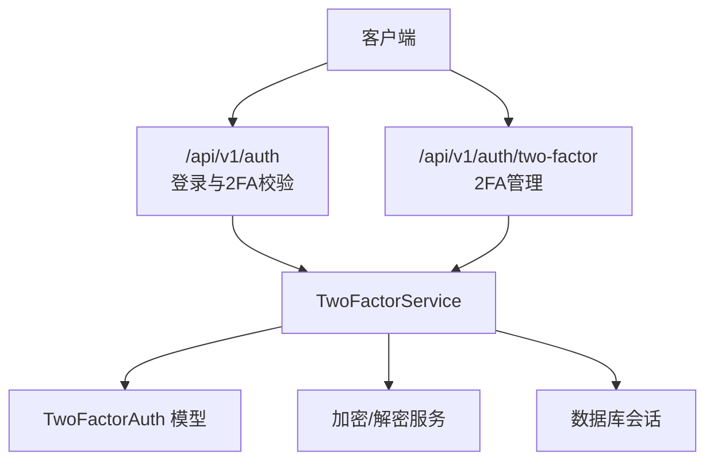
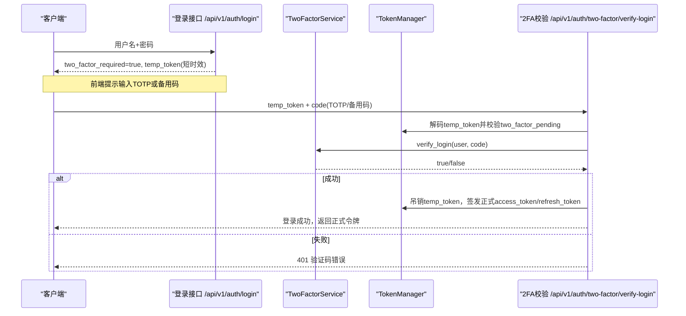
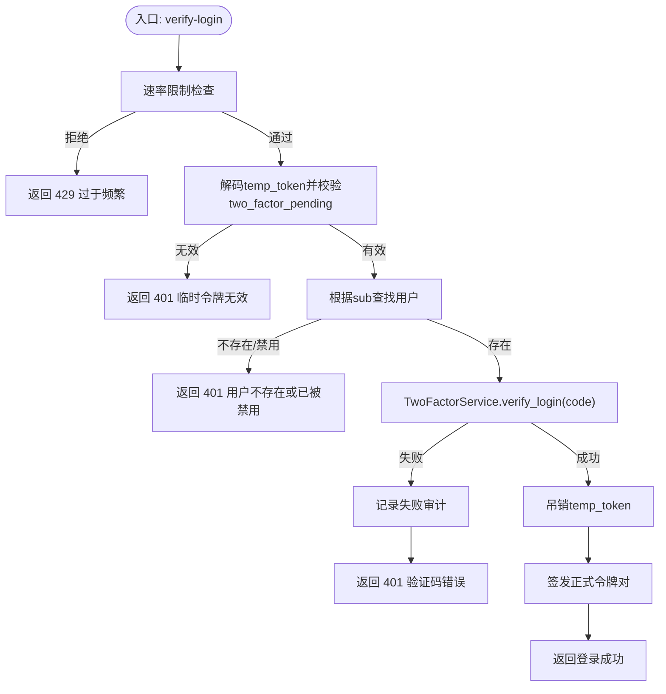
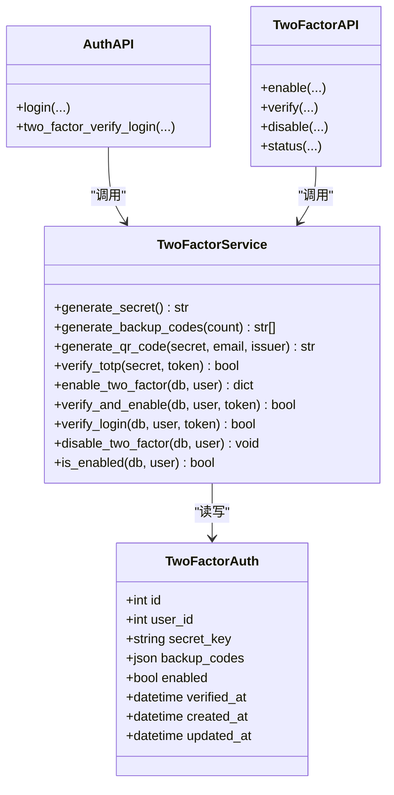

# 双因素认证接口

<cite>
**本文引用的文件**
- [backend/app/api/v1/auth/two_factor.py](file://backend/app/api/v1/auth/two_factor.py)
- [backend/app/services/two_factor_service.py](file://backend/app/services/two_factor_service.py)
- [backend/app/models/two_factor_auth.py](file://backend/app/models/two_factor_auth.py)
- [backend/app/schemas/auth.py](file://backend/app/schemas/auth.py)
- [backend/app/api/v1/auth/auth.py](file://backend/app/api/v1/auth/auth.py)
- [backend/tests/unit/test_auth_2fa_api_cov.py](file://backend/tests/unit/test_auth_2fa_api_cov.py)
</cite>

## 目录
1. [简介](#简介)
2. [项目结构](#项目结构)
3. [核心组件](#核心组件)
4. [架构总览](#架构总览)
5. [详细组件分析](#详细组件分析)
6. [依赖关系分析](#依赖关系分析)
7. [性能与安全考量](#性能与安全考量)
8. [故障排查指南](#故障排查指南)
9. [结论](#结论)
10. [附录：API 参考与示例](#附录api-参考与示例)

## 简介
本文件为“双因素认证（2FA）”接口的完整技术文档，覆盖 TOTP 验证码生成、验证、备份码管理、2FA 开关控制等能力；说明与传统密码认证的配合流程、时间同步机制、验证码有效期控制、备份码安全存储、防暴力破解策略；并提供端到端调用示例与错误处理指引。

## 项目结构
与 2FA 相关的后端代码主要分布在以下位置：
- API 路由层：/api/v1/auth 下的登录与 2FA 校验，以及 /api/v1/auth/two-factor 下的 2FA 管理接口
- 服务层：TwoFactorService 封装 TOTP、二维码、备份码、状态查询等核心逻辑
- 数据模型：TwoFactorAuth 表用于持久化密钥、备份码、启用状态与审计时间戳
- 请求/响应模式：auth.py 中的 Pydantic Schemas 定义登录与 2FA 校验的数据契约

图表来源
- [backend/app/api/v1/auth/auth.py:290-444](file://backend/app/api/v1/auth/auth.py#L290-L444)
- [backend/app/api/v1/auth/two_factor.py:31-87](file://backend/app/api/v1/auth/two_factor.py#L31-L87)
- [backend/app/services/two_factor_service.py:23-251](file://backend/app/services/two_factor_service.py#L23-L251)
- [backend/app/models/two_factor_auth.py:13-39](file://backend/app/models/two_factor_auth.py#L13-L39)

章节来源
- [backend/app/api/v1/auth/auth.py:290-444](file://backend/app/api/v1/auth/auth.py#L290-L444)
- [backend/app/api/v1/auth/two_factor.py:31-87](file://backend/app/api/v1/auth/two_factor.py#L31-L87)
- [backend/app/services/two_factor_service.py:23-251](file://backend/app/services/two_factor_service.py#L23-L251)
- [backend/app/models/two_factor_auth.py:13-39](file://backend/app/models/two_factor_auth.py#L13-L39)

## 核心组件
- TwoFactorService：提供 TOTP 密钥生成、二维码生成、TOTP 验证、备用码生成与使用、启用/禁用/状态查询等能力
- TwoFactorAuth 模型：存储用户 2FA 配置（加密密钥、备用码列表、是否启用、验证时间等）
- 认证路由：
  - POST /api/v1/auth/login：传统密码登录，若启用 2FA，返回临时令牌 temp_token 并标记 two_factor_required
  - POST /api/v1/auth/two-factor/verify-login：使用 temp_token + TOTP/备用码完成二次验证，成功后签发正式令牌
  - POST /api/v1/auth/two-factor/enable：生成密钥、二维码、备用码，进入待验证状态
  - POST /api/v1/auth/two-factor/verify：提交 TOTP 验证码以正式启用 2FA
  - POST /api/v1/auth/two-factor/disable：禁用 2FA
  - GET /api/v1/auth/two-factor/status：查询当前用户 2FA 是否已启用

章节来源
- [backend/app/services/two_factor_service.py:23-251](file://backend/app/services/two_factor_service.py#L23-L251)
- [backend/app/models/two_factor_auth.py:13-39](file://backend/app/models/two_factor_auth.py#L13-L39)
- [backend/app/api/v1/auth/auth.py:290-444](file://backend/app/api/v1/auth/auth.py#L290-L444)
- [backend/app/api/v1/auth/two_factor.py:31-87](file://backend/app/api/v1/auth/two_factor.py#L31-L87)
- [backend/app/schemas/auth.py:53-70](file://backend/app/schemas/auth.py#L53-L70)

## 架构总览
下图展示从密码登录到 2FA 校验再到签发正式令牌的完整时序。

图表来源
- [backend/app/api/v1/auth/auth.py:290-444](file://backend/app/api/v1/auth/auth.py#L290-L444)
- [backend/app/services/two_factor_service.py:180-215](file://backend/app/services/two_factor_service.py#L180-L215)
- [backend/app/schemas/auth.py:53-70](file://backend/app/schemas/auth.py#L53-L70)

## 详细组件分析

### 1) 传统密码登录与 2FA 提示
- 方法/路径：POST /api/v1/auth/login
- 行为：
  - 校验用户名与密码
  - 若用户启用了 2FA，则不直接返回业务令牌，而是返回：
    - two_factor_required: true
    - temp_token: 短时效的临时访问令牌（携带 two_factor_pending 声明）
  - 前端据此引导用户输入 TOTP 或备用码

章节来源
- [backend/app/schemas/auth.py:53-70](file://backend/app/schemas/auth.py#L53-L70)
- [backend/tests/unit/test_auth_2fa_api_cov.py:44-80](file://backend/tests/unit/test_auth_2fa_api_cov.py#L44-L80)

### 2) 2FA 二次校验（TOTP/备用码）
- 方法/路径：POST /api/v1/auth/two-factor/verify-login
- 请求体：
  - temp_token: 登录时返回的临时令牌
  - code: TOTP 验证码（6位数字）或备用码（8位数字）
- 行为：
  - 速率限制：复用登录频率限制，防止暴力破解
  - 校验 temp_token 有效性及 two_factor_pending 标志
  - 查找用户并检查是否激活
  - 调用 TwoFactorService.verify_login 进行 TOTP 或备用码校验
  - 成功：吊销 temp_token，重置失败计数，签发正式 access_token/refresh_token
  - 失败：记录审计日志并返回 401

图表来源
- [backend/app/api/v1/auth/auth.py:290-444](file://backend/app/api/v1/auth/auth.py#L290-L444)
- [backend/app/services/two_factor_service.py:180-215](file://backend/app/services/two_factor_service.py#L180-L215)

章节来源
- [backend/app/api/v1/auth/auth.py:290-444](file://backend/app/api/v1/auth/auth.py#L290-L444)
- [backend/app/services/two_factor_service.py:180-215](file://backend/app/services/two_factor_service.py#L180-L215)
- [backend/tests/unit/test_auth_2fa_api_cov.py:86-211](file://backend/tests/unit/test_auth_2fa_api_cov.py#L86-L211)

### 3) 启用 2FA（生成密钥、二维码、备用码）
- 方法/路径：POST /api/v1/auth/two-factor/enable
- 行为：
  - 生成 TOTP 密钥（Base32）
  - 生成 10 个 8 位数字备用码
  - 将密钥加密后落库，备用码以 JSON 数组形式存储
  - 返回 secret、qr_code（data:image/png;base64）、backup_codes
  - 此时 2FA 处于“待验证”状态（enabled=false），需下一步验证后才真正启用

章节来源
- [backend/app/api/v1/auth/two_factor.py:31-43](file://backend/app/api/v1/auth/two_factor.py#L31-L43)
- [backend/app/services/two_factor_service.py:103-148](file://backend/app/services/two_factor_service.py#L103-L148)
- [backend/app/models/two_factor_auth.py:18-23](file://backend/app/models/two_factor_auth.py#L18-L23)

### 4) 验证 TOTP 并正式启用 2FA
- 方法/路径：POST /api/v1/auth/two-factor/verify
- 请求体：token（6位 TOTP 验证码）
- 行为：
  - 读取用户的加密密钥并解密
  - 使用 TOTP 验证（允许前后一个时间窗口，即约 ±30 秒）
  - 验证通过后设置 enabled=true 并记录 verified_at
  - 返回成功消息

章节来源
- [backend/app/api/v1/auth/two_factor.py:46-66](file://backend/app/api/v1/auth/two_factor.py#L46-L66)
- [backend/app/services/two_factor_service.py:150-177](file://backend/app/services/two_factor_service.py#L150-L177)

### 5) 禁用 2FA
- 方法/路径：POST /api/v1/auth/two-factor/disable
- 行为：删除该用户的 2FA 配置记录，返回成功消息

章节来源
- [backend/app/api/v1/auth/two_factor.py:69-78](file://backend/app/api/v1/auth/two_factor.py#L69-L78)
- [backend/app/services/two_factor_service.py:217-231](file://backend/app/services/two_factor_service.py#L217-L231)

### 6) 查询 2FA 状态
- 方法/路径：GET /api/v1/auth/two-factor/status
- 行为：返回当前用户是否已启用 2FA

章节来源
- [backend/app/api/v1/auth/two_factor.py:81-87](file://backend/app/api/v1/auth/two_factor.py#L81-L87)
- [backend/app/services/two_factor_service.py:232-251](file://backend/app/services/two_factor_service.py#L232-L251)

### 7) 数据模型与存储
- TwoFactorAuth 表字段：
  - user_id：唯一关联用户
  - secret_key：加密存储的 TOTP 密钥
  - backup_codes：JSON 数组，存储备用码
  - enabled：是否已启用
  - verified_at：首次验证通过时间
  - created_at/updated_at：审计时间戳

章节来源
- [backend/app/models/two_factor_auth.py:13-39](file://backend/app/models/two_factor_auth.py#L13-L39)

## 依赖关系分析
- API 路由依赖：
  - auth.py 的登录与 2FA 校验依赖 TokenManager、UserService、AuditLogger、TwoFactorService
  - two_factor.py 的管理接口依赖 TwoFactorService 与数据库会话
- 服务层依赖：
  - TwoFactorService 依赖 pyotp（TOTP 算法）、qrcode（二维码生成）、加密服务、数据库事务
- 模型依赖：
  - TwoFactorAuth 通过外键关联 User，支持级联删除

图表来源
- [backend/app/services/two_factor_service.py:23-251](file://backend/app/services/two_factor_service.py#L23-L251)
- [backend/app/models/two_factor_auth.py:13-39](file://backend/app/models/two_factor_auth.py#L13-L39)
- [backend/app/api/v1/auth/auth.py:290-444](file://backend/app/api/v1/auth/auth.py#L290-L444)
- [backend/app/api/v1/auth/two_factor.py:31-87](file://backend/app/api/v1/auth/two_factor.py#L31-L87)

章节来源
- [backend/app/services/two_factor_service.py:23-251](file://backend/app/services/two_factor_service.py#L23-L251)
- [backend/app/models/two_factor_auth.py:13-39](file://backend/app/models/two_factor_auth.py#L13-L39)
- [backend/app/api/v1/auth/auth.py:290-444](file://backend/app/api/v1/auth/auth.py#L290-L444)
- [backend/app/api/v1/auth/two_factor.py:31-87](file://backend/app/api/v1/auth/two_factor.py#L31-L87)

## 性能与安全考量
- 时间同步与有效期
  - TOTP 验证允许前后一个时间窗口（valid_window=1），对应约 ±30 秒容差，缓解客户端与服务端时钟偏差
  - 临时令牌 temp_token 具有短 TTL（测试中体现为 5 分钟），降低中间人攻击风险
- 验证码有效期控制
  - TOTP 每 30 秒刷新一次；服务端仅接受当前及相邻窗口的值
- 备份码安全存储
  - 备用码以 JSON 数组形式存储在数据库中，建议结合数据库加密或敏感字段加密策略（实现上由加密服务负责）
  - 每次使用备用码会将其从列表中移除，避免重复使用
- 防暴力破解
  - 2FA 校验接口复用登录速率限制，超过阈值返回 429
  - 失败尝试会记录审计日志，便于追踪与风控
- 用户体验优化
  - 登录阶段先返回 temp_token 与 two_factor_required，前端可友好提示“请输入 TOTP 或备用码”
  - 提供二维码 data URL，可直接在浏览器中显示供扫码绑定
- 故障恢复
  - 管理员可通过系统接口重置用户 2FA（如清空备份码或禁用 2FA），确保账户可恢复

章节来源
- [backend/app/services/two_factor_service.py:83-100](file://backend/app/services/two_factor_service.py#L83-L100)
- [backend/app/services/two_factor_service.py:180-215](file://backend/app/services/two_factor_service.py#L180-L215)
- [backend/app/api/v1/auth/auth.py:309-321](file://backend/app/api/v1/auth/auth.py#L309-L321)
- [backend/tests/unit/test_auth_2fa_api_cov.py:44-80](file://backend/tests/unit/test_auth_2fa_api_cov.py#L44-L80)

## 故障排查指南
- 常见问题与定位
  - 401 临时令牌无效或已过期：检查 temp_token 是否来自上一次登录且未过期；确认 two_factor_pending 标志存在
  - 401 验证码错误：检查 TOTP 设备时间是否与服务器接近；确认使用的是最新 6 位码；备用码是否已被使用
  - 429 过于频繁：短时间内多次尝试触发速率限制，等待窗口期后再试
  - 启用失败：检查是否已启用过 2FA；查看数据库记录是否存在异常
- 日志与审计
  - 失败登录与 2FA 失败均会记录审计日志，便于回溯
- 恢复步骤
  - 若丢失备用码或设备：联系管理员重置 2FA（清空备份码或禁用 2FA）

章节来源
- [backend/app/api/v1/auth/auth.py:323-373](file://backend/app/api/v1/auth/auth.py#L323-L373)
- [backend/app/services/two_factor_service.py:180-215](file://backend/app/services/two_factor_service.py#L180-L215)

## 结论
本系统实现了完整的基于 TOTP 的双因素认证流程，涵盖密钥生成、二维码导出、备用码管理与 2FA 开关控制；通过与传统密码认证联动，采用临时令牌与速率限制保障安全性；同时提供友好的前端交互与完善的审计与恢复机制。建议在部署时确保客户端时间同步、妥善保护数据库与密钥材料，并结合企业风控策略持续监控异常登录。

## 附录：API 参考与示例

### 1) 传统密码登录（可能触发 2FA）
- 方法/路径：POST /api/v1/auth/login
- 请求体：
  - username: 字符串
  - password: 字符串
- 响应（需要 2FA 时）：
  - two_factor_required: true
  - temp_token: 字符串（短时效）
  - data: null
  - message: “需要双因素认证”
- 响应（不需要 2FA 时）：
  - data.access_token: 字符串
  - data.token_type: "bearer"
  - data.user: 用户信息对象
  - refresh_token: 字符串
  - must_change_password: 布尔

章节来源
- [backend/app/schemas/auth.py:53-70](file://backend/app/schemas/auth.py#L53-L70)
- [backend/tests/unit/test_auth_2fa_api_cov.py:44-80](file://backend/tests/unit/test_auth_2fa_api_cov.py#L44-L80)

### 2) 2FA 二次校验
- 方法/路径：POST /api/v1/auth/two-factor/verify-login
- 请求体：
  - temp_token: 字符串
  - code: 字符串（6位 TOTP 或 8位备用码）
- 成功响应：
  - data.access_token: 字符串
  - data.token_type: "bearer"
  - data.user: 用户信息对象
  - refresh_token: 字符串
  - must_change_password: 布尔
- 失败响应：
  - 401 验证码错误
  - 401 临时令牌无效或已过期
  - 429 过于频繁

章节来源
- [backend/app/api/v1/auth/auth.py:290-444](file://backend/app/api/v1/auth/auth.py#L290-L444)
- [backend/tests/unit/test_auth_2fa_api_cov.py:86-211](file://backend/tests/unit/test_auth_2fa_api_cov.py#L86-L211)

### 3) 启用 2FA
- 方法/路径：POST /api/v1/auth/two-factor/enable
- 响应：
  - secret: 字符串（Base32）
  - qr_code: data:image/png;base64,...
  - backup_codes: 字符串数组（8位数字）
- 注意：此时 2FA 尚未启用，需下一步验证

章节来源
- [backend/app/api/v1/auth/two_factor.py:31-43](file://backend/app/api/v1/auth/two_factor.py#L31-L43)
- [backend/app/services/two_factor_service.py:103-148](file://backend/app/services/two_factor_service.py#L103-L148)

### 4) 验证 TOTP 并正式启用 2FA
- 方法/路径：POST /api/v1/auth/two-factor/verify
- 请求体：
  - token: 字符串（6位 TOTP）
- 成功响应：
  - message: “双因素认证已启用”
- 失败响应：
  - 400 验证码错误
  - 400 未找到双因素认证配置

章节来源
- [backend/app/api/v1/auth/two_factor.py:46-66](file://backend/app/api/v1/auth/two_factor.py#L46-L66)
- [backend/app/services/two_factor_service.py:150-177](file://backend/app/services/two_factor_service.py#L150-L177)

### 5) 禁用 2FA
- 方法/路径：POST /api/v1/auth/two-factor/disable
- 成功响应：
  - message: “双因素认证已禁用”

章节来源
- [backend/app/api/v1/auth/two_factor.py:69-78](file://backend/app/api/v1/auth/two_factor.py#L69-L78)
- [backend/app/services/two_factor_service.py:217-231](file://backend/app/services/two_factor_service.py#L217-L231)

### 6) 查询 2FA 状态
- 方法/路径：GET /api/v1/auth/two-factor/status
- 成功响应：
  - data.enabled: 布尔

章节来源
- [backend/app/api/v1/auth/two_factor.py:81-87](file://backend/app/api/v1/auth/two_factor.py#L81-L87)
- [backend/app/services/two_factor_service.py:232-251](file://backend/app/services/two_factor_service.py#L232-L251)

### 7) 典型调用示例（文本描述）
- 场景一：启用 2FA
  - 调用 POST /api/v1/auth/two-factor/enable，获取 secret、qr_code、backup_codes
  - 使用 Authenticator App 扫描 qr_code 或手动输入 secret
  - 调用 POST /api/v1/auth/two-factor/verify，传入 token（App 生成的 6 位码）
  - 成功后 2FA 正式启用
- 场景二：传统登录触发 2FA
  - 调用 POST /api/v1/auth/login，若返回 two_factor_required=true 与 temp_token
  - 使用 Authenticator App 生成 6 位码，或从备份码中选择 8 位码
  - 调用 POST /api/v1/auth/two-factor/verify-login，传入 temp_token 与 code
  - 成功后获得正式 access_token 与 refresh_token
- 场景三：备用码登录
  - 当无法获取 TOTP 时，使用任意一个备用码作为 code 调用 verify-login
  - 备用码使用后将被移除，不可再次使用

[本节为概念性示例说明，不直接引用具体代码行]