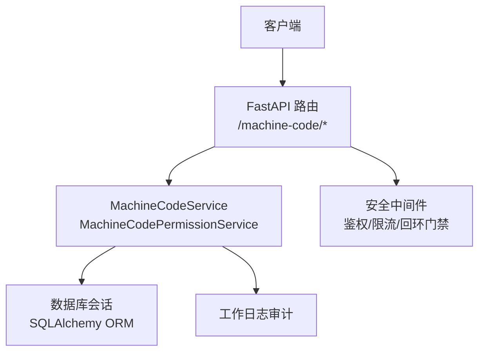
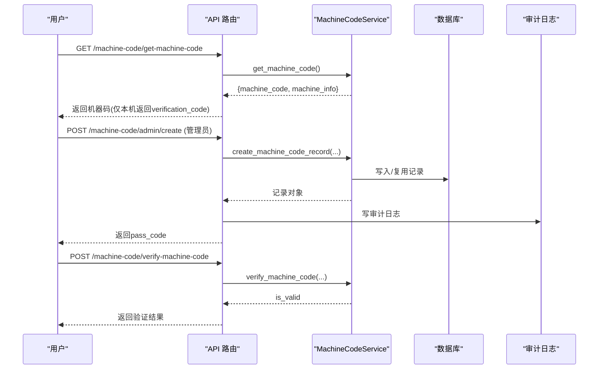
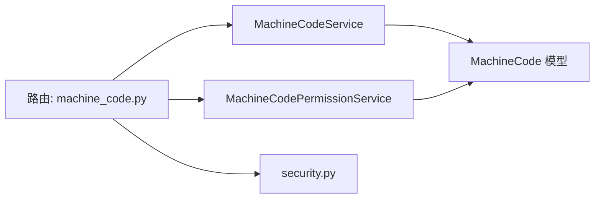

# 机器码管理接口

<cite>
**本文引用的文件**
- [backend/app/api/v1/machine_code.py](file://backend/app/api/v1/machine_code.py)
- [backend/app/services/machine_code_service.py](file://backend/app/services/machine_code_service.py)
- [backend/app/services/machine_code_permission_service.py](file://backend/app/services/machine_code_permission_service.py)
- [backend/app/models/machine_code.py](file://backend/app/models/machine_code.py)
- [backend/app/core/security.py](file://backend/app/core/security.py)
- [backend/tests/unit/test_cov_final_machine_code.py](file://backend/tests/unit/test_cov_final_machine_code.py)
</cite>

## 目录
1. [简介](#简介)
2. [项目结构](#项目结构)
3. [核心组件](#核心组件)
4. [架构总览](#架构总览)
5. [详细组件分析](#详细组件分析)
6. [依赖关系分析](#依赖关系分析)
7. [性能考虑](#性能考虑)
8. [故障排查指南](#故障排查指南)
9. [结论](#结论)
10. [附录：API 规范与示例](#附录api-规范与示例)

## 简介
本文件为“机器码管理”模块的完整 API 文档，覆盖机器码生成、绑定、验证、重置以及组织通行码、权限管理等能力。文档面向开发者与集成方，提供 HTTP 方法、URL、请求参数、响应格式、错误处理与安全机制说明，并给出典型调用示例（申请、绑定确认、异常处理）。同时阐述与用户认证的关系、多设备支持策略及安全防护措施。

## 项目结构
机器码管理由以下层次构成：
- API 层：FastAPI 路由定义与入参/出参校验
- 服务层：机器码生成、验证、绑定、撤销、列表查询、组织通行码等核心逻辑
- 模型层：机器码表结构与关系
- 安全层：鉴权、限流、回环地址门禁、HMAC 自验证、审计日志

图示来源
- [backend/app/api/v1/machine_code.py:1-120](file://backend/app/api/v1/machine_code.py#L1-L120)
- [backend/app/services/machine_code_service.py:1-120](file://backend/app/services/machine_code_service.py#L1-L120)
- [backend/app/core/security.py:1-120](file://backend/app/core/security.py#L1-L120)

章节来源
- [backend/app/api/v1/machine_code.py:1-120](file://backend/app/api/v1/machine_code.py#L1-L120)
- [backend/app/services/machine_code_service.py:1-120](file://backend/app/services/machine_code_service.py#L1-L120)
- [backend/app/core/security.py:1-120](file://backend/app/core/security.py#L1-L120)

## 核心组件
- 机器码服务（MachineCodeService）
  - 机器码采集与缓存、校验码生成、通行码生成与验证（含 HMAC 自验证）、激活/撤销、列表查询、组织通行码相关能力
- 机器码权限服务（MachineCodePermissionService）
  - 基于机器码的功能权限授予/撤销/批量操作、受限权限计算
- 数据模型（MachineCode）
  - 机器码、通行码、状态、绑定用户、组织、权限限制字段与时间戳
- 安全与鉴权
  - 管理员/超级管理员权限校验、回环地址门禁、速率限制、审计日志

章节来源
- [backend/app/services/machine_code_service.py:120-330](file://backend/app/services/machine_code_service.py#L120-L330)
- [backend/app/services/machine_code_permission_service.py:1-120](file://backend/app/services/machine_code_permission_service.py#L1-L120)
- [backend/app/models/machine_code.py:16-77](file://backend/app/models/machine_code.py#L16-L77)
- [backend/app/core/security.py:120-200](file://backend/app/core/security.py#L120-L200)

## 架构总览
机器码管理的端到端流程包括：
- 获取本机机器码与校验码（仅本机可返回校验码）
- 管理员录入机器码并生成通行码
- 用户使用通行码完成注册/绑定
- 登录时进行机器码校验与权限控制
- 管理员撤销/重置/导出/授权等功能

图示来源
- [backend/app/api/v1/machine_code.py:157-240](file://backend/app/api/v1/machine_code.py#L157-L240)
- [backend/app/services/machine_code_service.py:120-190](file://backend/app/services/machine_code_service.py#L120-L190)
- [backend/app/services/machine_code_service.py:325-410](file://backend/app/services/machine_code_service.py#L325-L410)

## 详细组件分析

### 机器码获取与校验
- 获取机器码与机器信息
  - 方法：GET
  - 路径：/machine-code/get-machine-code
  - 认证：公开接口；仅本机（loopback）请求返回 verification_code
  - 响应：包含 machine_code、machine_info，本机请求额外返回 verification_code
  - 错误：服务端异常返回 500
- 机器码与校验码匹配验证
  - 方法：POST
  - 路径：/machine-code/verify-machine-code
  - 请求体：{ machine_code, verification_code }
  - 响应：{ is_valid }
  - 错误：无业务异常；内部异常返回 500

章节来源
- [backend/app/api/v1/machine_code.py:157-192](file://backend/app/api/v1/machine_code.py#L157-L192)
- [backend/app/api/v1/machine_code.py:324-339](file://backend/app/api/v1/machine_code.py#L324-L339)
- [backend/app/services/machine_code_service.py:120-190](file://backend/app/services/machine_code_service.py#L120-L190)

### 管理员录入机器码与生成通行码
- 录入机器码（自动生成或手动指定4位数字通行码）
  - 方法：POST
  - 路径：/machine-code/admin/create
  - 认证：管理员/超级管理员
  - 请求体：{ machine_code, description?, pass_code? }
  - 响应：返回 id、machine_code、pass_code、status、created_at
  - 行为：若该 machine_code 已有记录则复用并重置状态与绑定，重新生成通行码
  - 错误：非管理员 403；参数错误 400；其他 500
- 列表查询
  - 方法：GET
  - 路径：/machine-code/admin/list
  - 认证：管理员/超级管理员
  - 查询参数：status?, skip=0, limit=100
  - 响应：分页列表（items, total）
- 撤销机器码
  - 方法：POST
  - 路径：/machine-code/admin/revoke/{machine_code_id}
  - 认证：管理员/超级管理员
  - 响应：成功消息
  - 错误：不存在 404；其他 500

章节来源
- [backend/app/api/v1/machine_code.py:194-322](file://backend/app/api/v1/machine_code.py#L194-L322)
- [backend/app/services/machine_code_service.py:325-410](file://backend/app/services/machine_code_service.py#L325-L410)
- [backend/app/services/machine_code_service.py:693-733](file://backend/app/services/machine_code_service.py#L693-L733)
- [backend/app/services/machine_code_service.py:608-633](file://backend/app/services/machine_code_service.py#L608-L633)

### 密码重置通道（机器码验证）
- 使用机器码重置普通用户密码
  - 方法：POST
  - 路径：/machine-code/reset-password-with-machine-code
  - 认证：公开接口（受回环门禁与限流保护）
  - 请求体：{ username, machine_code, verification_code }
  - 行为：校验本机、机器码一致、校验码正确；禁止管理员账号自助重置；成功后强制首登改密
  - 响应：返回新密码（仅本机可见）
  - 错误：400/403/404/429/500
- 管理员账号出厂恢复（从未激活的管理员）
  - 方法：POST
  - 路径：/machine-code/recover-admin-factory-password
  - 认证：公开接口（受回环门禁与限流保护）
  - 请求体：同上述重置
  - 行为：仅对从未激活的管理员生效；重置为文档化出厂密码并强制首登改密
  - 错误：400/403/404/429/500

章节来源
- [backend/app/api/v1/machine_code.py:394-492](file://backend/app/api/v1/machine_code.py#L394-L492)
- [backend/app/api/v1/machine_code.py:494-607](file://backend/app/api/v1/machine_code.py#L494-L607)
- [backend/app/core/security.py:151-173](file://backend/app/core/security.py#L151-L173)

### 组织通行码
- 获取组织校验码
  - 方法：GET
  - 路径：/machine-code/organization/{org_id}/verification-code
  - 认证：管理员
  - 响应：返回 organization_id、organization_name、verification_code
- 生成组织通行码
  - 方法：POST
  - 路径：/machine-code/organization/create
  - 认证：管理员
  - 请求体：{ organization_id, verification_code, allow_subordinate_generation?, description? }
  - 响应：返回组织通行码及相关元信息
- 列表查询与导出
  - 方法：GET
  - 路径：/machine-code/organization/list
  - 认证：管理员
  - 查询参数：organization_id?, status?, page, page_size
  - 导出：GET /machine-code/organization/export（Excel 流式下载）
- 删除组织通行码记录
  - 方法：DELETE
  - 路径：/machine-code/organization/{pass_code_id}
  - 认证：管理员
  - 响应：成功消息
  - 错误：不存在 404；非管理员 403

章节来源
- [backend/app/api/v1/machine_code.py:625-737](file://backend/app/api/v1/machine_code.py#L625-L737)
- [backend/app/api/v1/machine_code.py:739-880](file://backend/app/api/v1/machine_code.py#L739-L880)
- [backend/app/api/v1/machine_code.py:882-919](file://backend/app/api/v1/machine_code.py#L882-L919)
- [backend/tests/unit/test_cov_final_machine_code.py:33-38](file://backend/tests/unit/test_cov_final_machine_code.py#L33-L38)

### 机器码权限管理
- 获取机器码权限列表
  - 方法：GET
  - 路径：/machine-code/{machine_code_id}/permissions
  - 认证：管理员/超级管理员
  - 响应：权限项列表
- 批量授予权限
  - 方法：POST
  - 路径：/machine-code/{machine_code_id}/permissions
  - 认证：管理员/超级管理员
  - 请求体：{ permissions[], expires_at? }
  - 响应：返回 granted_count
- 批量撤销权限
  - 方法：DELETE
  - 路径：/machine-code/{machine_code_id}/permissions
  - 认证：管理员/超级管理员
  - 请求体：{ permissions[] }
  - 响应：返回 revoked_count
- 撤销单个权限
  - 方法：DELETE
  - 路径：/machine-code/{machine_code_id}/permissions/{permission}
  - 认证：管理员/超级管理员
  - 响应：成功消息
- 查看用户实际生效权限（含机器码限制）
  - 方法：GET
  - 路径：/machine-code/user/{user_id}/effective-permissions
  - 认证：管理员/超级管理员
  - 响应：effective_permissions、restricted_permissions

章节来源
- [backend/app/api/v1/machine_code.py:951-1115](file://backend/app/api/v1/machine_code.py#L951-L1115)
- [backend/app/services/machine_code_permission_service.py:28-148](file://backend/app/services/machine_code_permission_service.py#L28-L148)
- [backend/app/services/machine_code_permission_service.py:150-288](file://backend/app/services/machine_code_permission_service.py#L150-L288)

### 安全机制与技术细节
- 机器码唯一性保证
  - 数据库层面 machine_code 唯一约束，重复录入会复用并重置记录
- 设备指纹识别
  - 通过 CPU/主板/磁盘序列号、MAC、主机名组合哈希生成稳定机器码；进程级缓存避免重复系统调用
- 安全绑定机制
  - 通行码采用 HMAC-SHA256 生成，支持跨机器自验证；未显式配置密钥时 fail-closed
  - 四级验证优先级：机器特定通行码 > 组织通行码 > 仅凭 pass_code 回退（自动改绑并留痕）> HMAC 自验证
- 防篡改验证
  - 通行码比较使用常量时间比较，避免时序侧信道
  - 敏感参数走请求体不入 URL；回环地址门禁防止远程滥用
- 限流与审计
  - 密码重置类接口具备 IP 维度的速率限制
  - 关键操作写入工作日志，便于审计追溯

章节来源
- [backend/app/models/machine_code.py:26-34](file://backend/app/models/machine_code.py#L26-L34)
- [backend/app/services/machine_code_service.py:55-153](file://backend/app/services/machine_code_service.py#L55-L153)
- [backend/app/services/machine_code_service.py:267-324](file://backend/app/services/machine_code_service.py#L267-L324)
- [backend/app/services/machine_code_service.py:411-585](file://backend/app/services/machine_code_service.py#L411-L585)
- [backend/app/api/v1/machine_code.py:145-155](file://backend/app/api/v1/machine_code.py#L145-L155)
- [backend/app/api/v1/machine_code.py:414-422](file://backend/app/api/v1/machine_code.py#L414-L422)

## 依赖关系分析
- API 路由依赖服务层实现，服务层依赖数据库会话与模型
- 权限管理依赖 RBAC 服务与机器码权限服务
- 安全模块提供鉴权、限流、密码工具等

图示来源
- [backend/app/api/v1/machine_code.py:1-32](file://backend/app/api/v1/machine_code.py#L1-L32)
- [backend/app/services/machine_code_service.py:1-25](file://backend/app/services/machine_code_service.py#L1-L25)
- [backend/app/services/machine_code_permission_service.py:1-20](file://backend/app/services/machine_code_permission_service.py#L1-L20)
- [backend/app/models/machine_code.py:16-25](file://backend/app/models/machine_code.py#L16-L25)
- [backend/app/core/security.py:1-20](file://backend/app/core/security.py#L1-L20)

章节来源
- [backend/app/api/v1/machine_code.py:1-32](file://backend/app/api/v1/machine_code.py#L1-L32)
- [backend/app/services/machine_code_service.py:1-25](file://backend/app/services/machine_code_service.py#L1-L25)
- [backend/app/services/machine_code_permission_service.py:1-20](file://backend/app/services/machine_code_permission_service.py#L1-L20)
- [backend/app/models/machine_code.py:16-25](file://backend/app/models/machine_code.py#L16-L25)
- [backend/app/core/security.py:1-20](file://backend/app/core/security.py#L1-L20)

## 性能考虑
- 机器码采集进程级缓存，减少 wmic/系统调用开销
- 列表查询使用 joinedload 预加载关联，避免 N+1 问题
- 通行码验证快路径优先原文精确匹配，失败再归一化重试
- 导出接口限制最大条数，避免大结果集拖垮服务

章节来源
- [backend/app/services/machine_code_service.py:52-54](file://backend/app/services/machine_code_service.py#L52-L54)
- [backend/app/services/machine_code_service.py:720-733](file://backend/app/services/machine_code_service.py#L720-L733)
- [backend/app/services/machine_code_service.py:441-452](file://backend/app/services/machine_code_service.py#L441-L452)
- [backend/app/api/v1/machine_code.py:832-838](file://backend/app/api/v1/machine_code.py#L832-L838)

## 故障排查指南
- 通行码无效
  - 检查是否处于 pending/active(未绑定) 状态；确认输入是否带/不带连字符；核对是否为组织通行码
  - 参考：四级验证流程与回退改绑逻辑
- 无法获取校验码
  - 确认请求来自本机（loopback），否则不会返回 verification_code
- 密码重置失败
  - 检查限流计数、机器码一致性、校验码正确性；管理员账号不可自助重置
- 权限管理失败
  - 确认管理员权限；检查权限标识符是否正确；批量操作注意事务回滚

章节来源
- [backend/app/services/machine_code_service.py:411-585](file://backend/app/services/machine_code_service.py#L411-L585)
- [backend/app/api/v1/machine_code.py:157-192](file://backend/app/api/v1/machine_code.py#L157-L192)
- [backend/app/api/v1/machine_code.py:394-492](file://backend/app/api/v1/machine_code.py#L394-L492)
- [backend/app/services/machine_code_permission_service.py:181-231](file://backend/app/services/machine_code_permission_service.py#L181-L231)

## 结论
机器码管理模块提供了从设备指纹到通行码、从绑定到权限控制的完整闭环，兼顾了离线单机部署的安全性与易用性。通过 HMAC 自验证、回环门禁、限流与审计等手段，有效防范伪造与滥用。建议在生产环境显式配置通行码密钥，并严格遵循管理员操作流程。

## 附录：API 规范与示例

### 通用约定
- 基础路径：/api/v1/machine-code
- 统一响应结构：{ code, success, data, message }
- 认证方式：部分接口需管理员/超级管理员；部分公开接口受回环门禁与限流保护

### 接口清单与示例

- 获取机器码与机器信息
  - 方法：GET
  - 路径：/api/v1/machine-code/get-machine-code
  - 认证：公开（仅本机返回 verification_code）
  - 请求参数：无
  - 响应示例：
    - 成功：{ code: 200, success: true, data: { machine_code, machine_info, verification_code? }, message: "机器码获取成功" }
  - 错误：500 服务器异常

- 验证机器码与校验码
  - 方法：POST
  - 路径：/api/v1/machine-code/verify-machine-code
  - 请求体：{ machine_code, verification_code }
  - 响应示例：{ code: 200, success: true, data: { is_valid: true/false }, message: "验证成功/失败" }

- 管理员录入机器码并生成通行码
  - 方法：POST
  - 路径：/api/v1/machine-code/admin/create
  - 认证：管理员/超级管理员
  - 请求体：{ machine_code, description?, pass_code? }
  - 响应示例：{ code: 200, success: true, data: { id, machine_code, pass_code, status, created_at }, message: "机器码录入成功，通行码已生成" }
  - 错误：403 非管理员；400 参数错误；500 服务器异常

- 管理员查询机器码列表
  - 方法：GET
  - 路径：/api/v1/machine-code/admin/list
  - 认证：管理员/超级管理员
  - 查询参数：status?, skip=0, limit=100
  - 响应示例：{ code: 200, success: true, data: { items: [...], total: N }, message: "查询成功" }

- 管理员撤销机器码
  - 方法：POST
  - 路径：/api/v1/machine-code/admin/revoke/{machine_code_id}
  - 认证：管理员/超级管理员
  - 响应示例：{ code: 200, success: true, message: "机器码已撤销" }
  - 错误：404 不存在；500 服务器异常

- 使用机器码重置普通用户密码
  - 方法：POST
  - 路径：/api/v1/machine-code/reset-password-with-machine-code
  - 认证：公开（限流 + 回环门禁）
  - 请求体：{ username, machine_code, verification_code }
  - 响应示例：{ code: 200, success: true, data: { username, new_password }, message: "密码重置成功，请首次登录后立即修改" }
  - 错误：400 参数不匹配；403 非本机或管理员账号；404 用户不存在；429 限流；500 服务器异常

- 管理员账号出厂恢复（从未激活）
  - 方法：POST
  - 路径：/api/v1/machine-code/recover-admin-factory-password
  - 认证：公开（限流 + 回环门禁）
  - 请求体：同上述重置
  - 响应示例：{ code: 200, success: true, data: { username, factory_password }, message: "已恢复出厂密码，请立即登录并修改" }
  - 错误：400/403/404/429/500

- 组织校验码与通行码
  - 获取组织校验码：GET /api/v1/machine-code/organization/{org_id}/verification-code（管理员）
  - 生成组织通行码：POST /api/v1/machine-code/organization/create（管理员）
  - 列表查询：GET /api/v1/machine-code/organization/list（管理员）
  - 导出 Excel：GET /api/v1/machine-code/organization/export（管理员）
  - 删除记录：DELETE /api/v1/machine-code/organization/{pass_code_id}（管理员）

- 机器码权限管理
  - 获取权限：GET /api/v1/machine-code/{machine_code_id}/permissions（管理员）
  - 批量授予：POST /api/v1/machine-code/{machine_code_id}/permissions（管理员）
  - 批量撤销：DELETE /api/v1/machine-code/{machine_code_id}/permissions（管理员）
  - 撤销单个：DELETE /api/v1/machine-code/{machine_code_id}/permissions/{permission}（管理员）
  - 用户实际权限：GET /api/v1/machine-code/user/{user_id}/effective-permissions（管理员）

### 典型调用场景示例

- 申请机器码
  - 调用：GET /api/v1/machine-code/get-machine-code
  - 预期：返回 machine_code 与 machine_info；本机请求额外返回 verification_code
  - 用途：将 machine_code 提交给管理员用于录入

- 绑定确认（管理员录入后用户注册）
  - 调用：POST /api/v1/machine-code/admin/create
  - 预期：返回 pass_code；用户使用该 pass_code 完成注册/绑定
  - 备注：同一 machine_code 多次录入会复用记录并重置状态

- 异常处理
  - 403：非管理员访问管理接口；非本机访问敏感接口
  - 400：参数不合法或机器码/校验码不匹配
  - 404：资源不存在
  - 429：频率过高
  - 500：服务器内部错误

章节来源
- [backend/app/api/v1/machine_code.py:157-607](file://backend/app/api/v1/machine_code.py#L157-L607)
- [backend/app/api/v1/machine_code.py:625-919](file://backend/app/api/v1/machine_code.py#L625-L919)
- [backend/app/api/v1/machine_code.py:951-1115](file://backend/app/api/v1/machine_code.py#L951-L1115)