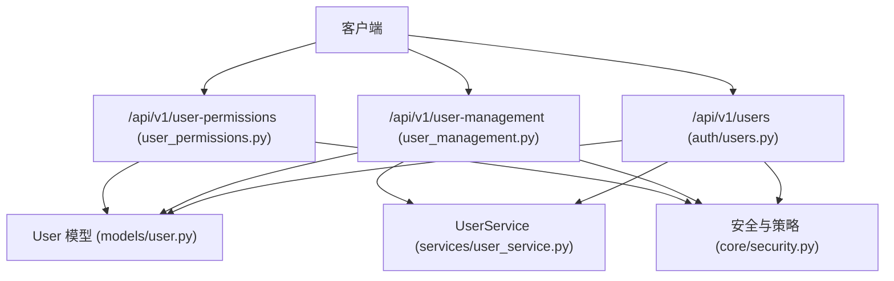
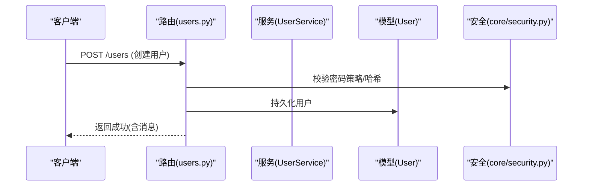
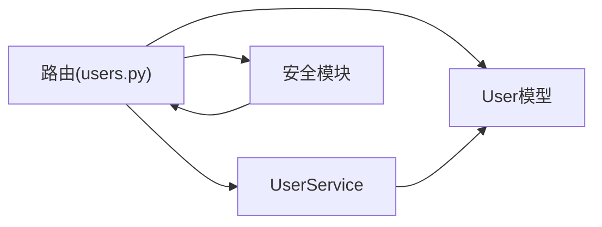

# 用户管理接口

<cite>
**本文引用的文件**
- [backend/app/api/v1/auth/users.py](file://backend/app/api/v1/auth/users.py)
- [backend/app/api/v1/auth/user_management.py](file://backend/app/api/v1/auth/user_management.py)
- [backend/app/api/v1/user_permissions.py](file://backend/app/api/v1/user_permissions.py)
- [backend/app/models/user.py](file://backend/app/models/user.py)
- [backend/app/schemas/user.py](file://backend/app/schemas/user.py)
- [backend/app/services/user_service.py](file://backend/app/services/user_service.py)
- [backend/app/core/security.py](file://backend/app/core/security.py)
</cite>

## 目录
1. [简介](#简介)
2. [项目结构](#项目结构)
3. [核心组件](#核心组件)
4. [架构总览](#架构总览)
5. [详细组件分析](#详细组件分析)
6. [依赖关系分析](#依赖关系分析)
7. [性能考虑](#性能考虑)
8. [故障排查指南](#故障排查指南)
9. [结论](#结论)
10. [附录](#附录)

## 简介
本文件为“用户管理”模块的API文档，覆盖用户CRUD、状态管理、权限与数据范围控制、搜索与分页、批量操作（导入/导出）、头像上传、密码管理等能力。文档包含HTTP方法、URL路径、请求参数、响应格式、错误处理、安全与合规要求（敏感信息保护、审计、数据范围控制），并提供调用示例与常见问题排查建议。

## 项目结构
用户管理相关代码主要位于后端FastAPI路由层、模型层与服务层：
- API路由：用户管理主路由集中在 auth/users.py 与 user_management.py；权限与组织相关在 user_permissions.py
- 数据模型：用户实体定义在 models/user.py
- 数据校验：Pydantic Schema 在 schemas/user.py
- 服务层：通用用户服务在 services/user_service.py
- 安全与认证：密码策略、Token、脱敏等在 core/security.py

图表来源
- [backend/app/api/v1/auth/users.py:1-120](file://backend/app/api/v1/auth/users.py#L1-L120)
- [backend/app/api/v1/auth/user_management.py:1-120](file://backend/app/api/v1/auth/user_management.py#L1-L120)
- [backend/app/api/v1/user_permissions.py:1-120](file://backend/app/api/v1/user_permissions.py#L1-L120)
- [backend/app/models/user.py:26-85](file://backend/app/models/user.py#L26-L85)
- [backend/app/core/security.py:120-173](file://backend/app/core/security.py#L120-L173)

章节来源
- [backend/app/api/v1/auth/users.py:1-120](file://backend/app/api/v1/auth/users.py#L1-L120)
- [backend/app/api/v1/auth/user_management.py:1-120](file://backend/app/api/v1/auth/user_management.py#L1-L120)
- [backend/app/api/v1/user_permissions.py:1-120](file://backend/app/api/v1/user_permissions.py#L1-L120)
- [backend/app/models/user.py:26-85](file://backend/app/models/user.py#L26-L85)
- [backend/app/core/security.py:120-173](file://backend/app/core/security.py#L120-L173)

## 核心组件
- 用户模型 User：包含用户名、邮箱、角色、数据范围、组织关联、设备绑定、菜单白名单等字段，提供权限列表解析与令牌失效方法
- 用户Schema：定义创建、更新、响应的数据结构与校验规则
- 用户服务 UserService：提供基础查询、创建、更新、删除等能力
- 安全模块：密码哈希/验证、随机密码生成、日志脱敏、JWT相关常量

章节来源
- [backend/app/models/user.py:26-152](file://backend/app/models/user.py#L26-L152)
- [backend/app/schemas/user.py:9-53](file://backend/app/schemas/user.py#L9-L53)
- [backend/app/services/user_service.py:20-124](file://backend/app/services/user_service.py#L20-L124)
- [backend/app/core/security.py:120-173](file://backend/app/core/security.py#L120-L173)

## 架构总览
用户管理采用分层架构：
- 路由层：接收HTTP请求，进行鉴权、参数校验、业务编排
- 服务层：封装领域逻辑（如用户CRUD、权限分配）
- 模型层：ORM映射到数据库表
- 安全层：统一密码策略、Token、脱敏与异常处理

图表来源
- [backend/app/api/v1/auth/users.py:431-520](file://backend/app/api/v1/auth/users.py#L431-L520)
- [backend/app/core/security.py:130-148](file://backend/app/core/security.py#L130-L148)
- [backend/app/models/user.py:26-85](file://backend/app/models/user.py#L26-L85)

## 详细组件分析

### 用户基本信息与个人资料
- 获取当前用户资料
  - 方法/路径：GET /api/v1/users/me
  - 鉴权：已登录用户
  - 响应：包含用户基本信息、角色显示名、状态、最后登录时间、可见菜单等
- 更新当前用户资料
  - 方法/路径：PUT /api/v1/users/me/profile
  - 鉴权：已登录用户
  - 请求体：允许更新的个人信息字段集合
  - 响应：更新后的基本信息

章节来源
- [backend/app/api/v1/auth/users.py:136-207](file://backend/app/api/v1/auth/users.py#L136-L207)

### 用户列表与搜索
- 用户列表
  - 方法/路径：GET /api/v1/users
  - 鉴权：管理员
  - 查询参数：page, page_size, keyword, is_active, organization_id, role
  - 行为：非超级管理员仅能查看本组织及下级组织用户；支持关键字模糊匹配用户名/姓名/邮箱；按状态、组织、角色过滤；分页返回
- 待审核用户列表
  - 方法/路径：GET /api/v1/users/pending/list
  - 鉴权：管理员
  - 行为：返回未激活用户
- 人员列表（公开）
  - 方法/路径：GET /api/v1/users/staff-list
  - 鉴权：已登录用户
  - 行为：根据数据范围限制返回活跃用户，用于任务分配等场景

章节来源
- [backend/app/api/v1/auth/users.py:213-382](file://backend/app/api/v1/auth/users.py#L213-L382)

### 用户详情、创建、更新、删除
- 获取用户详情
  - 方法/路径：GET /api/v1/users/{user_id}
  - 鉴权：本人或管理员
  - 响应：完整用户信息与组织、权限、数据范围等
- 创建用户
  - 方法/路径：POST /api/v1/users
  - 鉴权：管理员
  - 请求体：username, password, email, full_name, role, organization_id, data_scope, permissions/allowed_permissions, department, position, phone, is_active
  - 校验：用户名唯一、邮箱唯一、组织存在性、角色有效性、数据范围有效性、密码策略
  - 响应：创建结果与提示信息（是否需激活）
- 更新用户
  - 方法/路径：PUT /api/v1/users/{user_id}
  - 鉴权：管理员
  - 请求体：可更新的基本信息与部分权限字段（受保护字段不可改）
  - 校验：组织存在性、角色有效性、数据范围有效性
- 删除用户
  - 方法/路径：DELETE /api/v1/users/{user_id}
  - 鉴权：管理员
  - 行为：禁止删除当前登录用户；实际删除通过事务提交

章节来源
- [backend/app/api/v1/auth/users.py:388-589](file://backend/app/api/v1/auth/users.py#L388-L589)

### 权限与角色管理
- 分配/修改用户权限
  - 方法/路径：PUT /api/v1/users/{user_id}/permissions
  - 鉴权：管理员
  - 请求体：role, organization_id, data_scope, permissions, is_active, department, position, machine_binding_required, allowed_permissions
  - 行为：支持审核新用户、调整角色、分配组织、设置数据范围、分配具体权限
- 角色选项
  - 方法/路径：GET /api/v1/users/roles/options
  - 鉴权：管理员
  - 行为：返回可用角色列表（缓存）
- 数据范围选项
  - 方法/路径：GET /api/v1/users/data-scopes/options
  - 鉴权：管理员
  - 行为：返回数据范围选项（缓存）
- 权限选项
  - 方法/路径：GET /api/v1/users/permissions/options
  - 鉴权：管理员
  - 行为：返回系统/数据/操作/审批等权限分类（缓存）

章节来源
- [backend/app/api/v1/auth/users.py:592-727](file://backend/app/api/v1/auth/users.py#L592-L727)

### 密码管理
- 管理员重置用户密码
  - 方法/路径：POST /api/v1/users/{user_id}/admin-reset-password
  - 鉴权：管理员
  - 请求体：new_password
  - 行为：校验密码策略、重置并强制首次登录修改密码、使旧Token失效
- 修改密码
  - 方法/路径：PUT /api/v1/users/{user_id}/password
  - 鉴权：本人或管理员
  - 请求体：old_password, new_password
  - 行为：校验旧密码、新密码策略、重置并强制修改标记、使旧Token失效、清理临时文件、记录审计日志

章节来源
- [backend/app/api/v1/auth/users.py:729-826](file://backend/app/api/v1/auth/users.py#L729-L826)
- [backend/app/core/security.py:130-148](file://backend/app/core/security.py#L130-L148)

### 头像上传
- 上传用户头像
  - 方法/路径：POST /api/v1/users/{user_id}/avatar
  - 鉴权：本人或管理员
  - 请求体：multipart/form-data，字段 avatar
  - 校验：允许的图片类型、大小限制（最大2MB）
  - 行为：保存至uploads/avatars目录，更新用户头像URL

章节来源
- [backend/app/api/v1/auth/users.py:829-885](file://backend/app/api/v1/auth/users.py#L829-L885)

### 用户管理（兼容路由）
- 生成随机密码
  - 方法/路径：GET /api/v1/user-management/generate-password
  - 鉴权：已登录用户
  - 行为：返回符合策略的随机密码
- 角色列表
  - 方法/路径：GET /api/v1/user-management/roles
  - 鉴权：管理员
  - 行为：返回内置角色与用户数统计
- 用户列表（兼容）
  - 方法/路径：GET /api/v1/user-management
  - 鉴权：管理员
  - 查询参数：page, page_size, username, name, role, status
  - 行为：支持用户名/姓名模糊匹配、状态过滤、分页
- 创建用户（兼容）
  - 方法/路径：POST /api/v1/user-management
  - 鉴权：管理员
  - 请求体：username, full_name, password(可选), email, phone, department, role, is_active, organization_id
  - 行为：用户名唯一性检查、密码策略校验、创建并返回生成的密码
- 更新用户（兼容）
  - 方法/路径：PUT /api/v1/user-management/{user_id}
  - 鉴权：管理员
  - 请求体：full_name/name, email, phone, department, role, is_active/status, organization_id
  - 行为：兼容name/full_name、status映射、角色归一化
- 删除用户（兼容）
  - 方法/路径：DELETE /api/v1/user-management/{user_id}
  - 鉴权：管理员
  - 行为：禁止删除系统管理员账户与当前用户；使用级联删除服务
- 重置密码（兼容）
  - 方法/路径：POST /api/v1/user-management/{user_id}/reset-password
  - 鉴权：管理员
  - 请求体：new_password(可选)
  - 行为：自动生成或使用指定密码、策略校验、写入数据库
- 分配角色（兼容）
  - 方法/路径：POST /api/v1/user-management/{user_id}/assign-role?role_code=...
  - 鉴权：管理员
  - 行为：更新角色与超级管理员标记

章节来源
- [backend/app/api/v1/auth/user_management.py:79-412](file://backend/app/api/v1/auth/user_management.py#L79-L412)

### 用户权限与组织（旧版，计划合并）
- 分配用户到组织
  - 方法/路径：POST /api/v1/user-permissions/assign-organization
  - 鉴权：具备 user:assign_org 或管理员
  - 请求体：user_id, organization_id, role, is_primary
- 从组织移除用户
  - 方法/路径：DELETE /api/v1/user-permissions/remove-organization
  - 鉴权：具备 user:remove_org 或管理员
- 获取用户所属组织
  - 方法/路径：GET /api/v1/user-permissions/user-organizations/{user_id}
  - 鉴权：本人或具备 user:view
- 获取组织下用户
  - 方法/路径：GET /api/v1/user-permissions/organization-users/{organization_id}?include_children=false
  - 鉴权：具备 org:view_users 或数据范围覆盖
- 角色与权限管理
  - 分配/移除角色：POST/DELETE /api/v1/user-permissions/assign-role, remove-role
  - 授予/撤销权限：POST/DELETE /api/v1/user-permissions/grant-permission, revoke-permission
  - 查询用户角色/权限：GET /api/v1/user-permissions/user-roles/{user_id}, user-permissions/{user_id}
  - 检查权限：POST /api/v1/user-permissions/check-permission
- 组织树与可访问组织
  - 获取组织树：GET /api/v1/user-permissions/organization-tree?parent_id=...
  - 获取可访问组织ID：GET /api/v1/user-permissions/accessible-organizations
  - 根路径：GET /api/v1/user-permissions

章节来源
- [backend/app/api/v1/user_permissions.py:68-449](file://backend/app/api/v1/user_permissions.py#L68-L449)

### 数据模型与校验
- 用户模型字段与索引
  - 关键字段：username, email, hashed_password, role, is_active, organization_id, data_scope, permissions, allowed_permissions, allowed_menus, token_version, must_change_password, failed_login_count, locked_until, last_login, created_at, updated_at
  - 索引：角色+状态、部门、组织ID
  - 关系：组织、二次认证
- Pydantic Schema
  - 基础模型：username, email, full_name, phone_number, is_active, is_superuser, role_id
  - 创建/更新/响应：分别定义必填与可选字段，密码最小长度等约束

章节来源
- [backend/app/models/user.py:26-152](file://backend/app/models/user.py#L26-L152)
- [backend/app/schemas/user.py:9-53](file://backend/app/schemas/user.py#L9-L53)

### 安全与合规
- 敏感信息保护
  - 密码存储：bcrypt哈希，长度截断兼容
  - 日志脱敏：对常见敏感字段进行清洗
  - 头像上传：类型与大小校验，避免恶意文件
- 操作审计
  - 密码修改：成功后记录工作日志（失败不阻断主流程）
- 数据范围控制
  - 列表查询：非超级管理员仅能查看本组织及下级组织用户
  - 人员列表：基于数据范围（own/own_dept/all）限制
- 权限系统集成
  - 角色与权限：通过角色与权限包（permission_pack_id）控制菜单与功能
  - 白名单权限：allowed_permissions(JSON数组)精确控制
  - 可见菜单：allowed_menus(JSON数组)控制菜单展示

章节来源
- [backend/app/core/security.py:120-200](file://backend/app/core/security.py#L120-L200)
- [backend/app/api/v1/auth/users.py:213-296](file://backend/app/api/v1/auth/users.py#L213-L296)
- [backend/app/api/v1/auth/users.py:729-826](file://backend/app/api/v1/auth/users.py#L729-L826)
- [backend/app/models/user.py:57-85](file://backend/app/models/user.py#L57-L85)

## 依赖关系分析
- 路由依赖
  - 认证：get_current_user
  - 数据库：get_db
  - 权限：require_admin/is_superuser
  - 事务：safe_commit
  - 响应：success_response/ok_list
- 服务与模型
  - UserService 提供基础CRUD
  - User 模型承载用户实体与关系
- 安全模块
  - 密码策略、哈希、随机密码生成、日志脱敏

图表来源
- [backend/app/api/v1/auth/users.py:1-23](file://backend/app/api/v1/auth/users.py#L1-L23)
- [backend/app/services/user_service.py:20-124](file://backend/app/services/user_service.py#L20-L124)
- [backend/app/models/user.py:26-85](file://backend/app/models/user.py#L26-L85)
- [backend/app/core/security.py:120-173](file://backend/app/core/security.py#L120-L173)

章节来源
- [backend/app/api/v1/auth/users.py:1-23](file://backend/app/api/v1/auth/users.py#L1-L23)
- [backend/app/services/user_service.py:20-124](file://backend/app/services/user_service.py#L20-L124)
- [backend/app/models/user.py:26-85](file://backend/app/models/user.py#L26-L85)
- [backend/app/core/security.py:120-173](file://backend/app/core/security.py#L120-L173)

## 性能考虑
- 分页与索引
  - 列表接口使用分页与数据库索引（角色+状态、部门、组织ID）提升查询效率
- 缓存
  - 角色/数据范围/权限选项使用缓存（TTL=3600秒）减少重复计算
- 批量查询
  - 用户列表时批量查询机器码绑定信息，避免N+1问题
- 文件大小限制
  - 头像上传限制2MB，防止大文件影响性能

章节来源
- [backend/app/api/v1/auth/users.py:257-296](file://backend/app/api/v1/auth/users.py#L257-L296)
- [backend/app/api/v1/auth/users.py:658-727](file://backend/app/api/v1/auth/users.py#L658-L727)
- [backend/app/api/v1/auth/users.py:857-861](file://backend/app/api/v1/auth/users.py#L857-L861)

## 故障排查指南
- 常见错误
  - 用户名/邮箱重复：创建时返回400
  - 无效角色/数据范围：创建/更新时返回400
  - 无权操作：非管理员访问管理接口返回403
  - 用户不存在：详情/更新/删除时返回404
  - 密码策略不满足：重置/修改密码时返回400
- 调试建议
  - 检查请求头是否携带有效Token
  - 确认当前用户角色与权限
  - 核对组织ID是否存在
  - 查看审计日志与错误日志定位问题

章节来源
- [backend/app/api/v1/auth/users.py:448-478](file://backend/app/api/v1/auth/users.py#L448-L478)
- [backend/app/api/v1/auth/users.py:548-566](file://backend/app/api/v1/auth/users.py#L548-L566)
- [backend/app/api/v1/auth/users.py:743-757](file://backend/app/api/v1/auth/users.py#L743-L757)
- [backend/app/api/v1/auth/users.py:776-791](file://backend/app/api/v1/auth/users.py#L776-L791)

## 结论
用户管理接口提供了完整的CRUD、状态与权限管理、搜索与分页、批量操作、头像上传与密码管理等功能，并通过安全模块保障敏感信息与合规要求。建议在集成时严格遵循鉴权与数据范围控制，结合审计日志进行问题追踪与合规审计。

## 附录

### API调用示例（响应案例）
- 创建用户
  - 请求：POST /api/v1/users
  - 响应：包含用户id、username、role、organization_id、data_scope、is_active与消息
  - 参考：[创建用户实现:431-520](file://backend/app/api/v1/auth/users.py#L431-L520)
- 更新用户
  - 请求：PUT /api/v1/users/{user_id}
  - 响应：包含code、message与updated_fields
  - 参考：[更新用户实现:523-572](file://backend/app/api/v1/auth/users.py#L523-L572)
- 删除用户
  - 请求：DELETE /api/v1/users/{user_id}
  - 响应：包含code、message
  - 参考：[删除用户实现:575-589](file://backend/app/api/v1/auth/users.py#L575-L589)
- 管理员重置密码
  - 请求：POST /api/v1/users/{user_id}/admin-reset-password
  - 响应：包含code、message
  - 参考：[管理员重置密码实现:729-757](file://backend/app/api/v1/auth/users.py#L729-L757)
- 修改密码
  - 请求：PUT /api/v1/users/{user_id}/password
  - 响应：包含code、message
  - 参考：[修改密码实现:760-826](file://backend/app/api/v1/auth/users.py#L760-L826)
- 上传头像
  - 请求：POST /api/v1/users/{user_id}/avatar
  - 响应：包含code、message与avatar_url
  - 参考：[头像上传实现:829-885](file://backend/app/api/v1/auth/users.py#L829-L885)

### 用户生命周期与数据隐私
- 生命周期
  - 创建→激活/待审核→使用→权限调整→锁定/解锁→删除
- 数据隐私
  - 电话等敏感字段透明加密存储
  - 日志中敏感字段脱敏
  - Token版本控制确保密码变更后旧Token失效

章节来源
- [backend/app/models/user.py:49-85](file://backend/app/models/user.py#L49-L85)
- [backend/app/core/security.py:180-200](file://backend/app/core/security.py#L180-L200)
- [backend/app/api/v1/auth/users.py:729-826](file://backend/app/api/v1/auth/users.py#L729-L826)