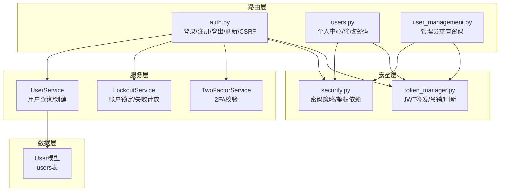
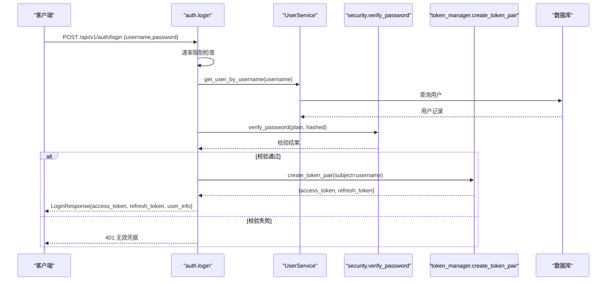
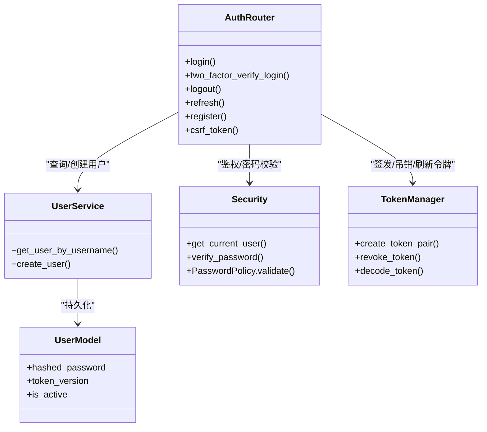

# 用户认证接口

<cite>
**本文引用的文件**
- [backend/app/api/v1/auth/auth.py](file://backend/app/api/v1/auth/auth.py)
- [backend/app/schemas/auth.py](file://backend/app/schemas/auth.py)
- [backend/app/core/security.py](file://backend/app/core/security.py)
- [backend/app/core/token_manager.py](file://backend/app/core/token_manager.py)
- [backend/app/models/user.py](file://backend/app/models/user.py)
- [backend/app/services/user_service.py](file://backend/app/services/user_service.py)
- [backend/app/api/v1/auth/users.py](file://backend/app/api/v1/auth/users.py)
- [backend/app/api/v1/auth/user_management.py](file://backend/app/api/v1/auth/user_management.py)
</cite>

## 目录
1. [简介](#简介)
2. [项目结构](#项目结构)
3. [核心组件](#核心组件)
4. [架构总览](#架构总览)
5. [详细组件分析](#详细组件分析)
6. [依赖关系分析](#依赖关系分析)
7. [性能与安全考虑](#性能与安全考虑)
8. [故障排查指南](#故障排查指南)
9. [结论](#结论)
10. [附录：API 规范与示例](#附录api-规范与示例)

## 简介
本文件面向前端与后端开发者，提供“用户认证”相关接口的完整 API 文档。覆盖登录、注册、密码重置、会话管理（登出、刷新令牌）、双因素认证等核心能力；并说明 JWT 生成与验证、密码加密存储、会话状态维护、错误处理与最佳实践，以及前后端集成建议（令牌刷新、自动登出等）。

## 项目结构
认证能力由以下模块协作完成：
- 路由层：FastAPI 路由定义认证相关 HTTP 接口
- 服务层：用户查询、权限校验、速率限制、审计日志
- 安全层：密码哈希/校验、JWT 签发与校验、黑名单与版本控制
- 数据层：用户模型与数据库持久化

图表来源
- [backend/app/api/v1/auth/auth.py:101-287](file://backend/app/api/v1/auth/auth.py#L101-L287)
- [backend/app/api/v1/auth/users.py:729-796](file://backend/app/api/v1/auth/users.py#L729-L796)
- [backend/app/api/v1/auth/user_management.py:348-384](file://backend/app/api/v1/auth/user_management.py#L348-L384)
- [backend/app/core/security.py:243-336](file://backend/app/core/security.py#L243-L336)
- [backend/app/core/token_manager.py:64-127](file://backend/app/core/token_manager.py#L64-L127)
- [backend/app/models/user.py:26-85](file://backend/app/models/user.py#L26-L85)

章节来源
- [backend/app/api/v1/auth/auth.py:101-287](file://backend/app/api/v1/auth/auth.py#L101-L287)
- [backend/app/core/security.py:243-336](file://backend/app/core/security.py#L243-L336)
- [backend/app/core/token_manager.py:64-127](file://backend/app/core/token_manager.py#L64-L127)
- [backend/app/models/user.py:26-85](file://backend/app/models/user.py#L26-L85)

## 核心组件
- 认证路由（auth.py）
  - POST /api/v1/auth/login：用户名+密码登录，返回 access_token + refresh_token，支持 2FA 临时令牌流程
  - POST /api/v1/auth/two-factor/verify-login：使用 temp_token + TOTP 验证码换取正式令牌
  - GET /api/v1/auth/me：获取当前用户信息
  - POST /api/v1/auth/logout：登出（吊销当前 token，递增 token_version 使该用户所有旧令牌失效）
  - POST /api/v1/auth/refresh：用 refresh_token 轮换获得新令牌对
  - GET /api/v1/auth/csrf-token：获取 CSRF token（用于跨站请求保护）
  - POST /api/v1/auth/register：通过通行码注册新用户
- 安全与鉴权（security.py）
  - get_current_user：从 Authorization: Bearer 解析 JWT，校验类型、黑名单、token_version
  - PasswordPolicy：密码强度策略（长度、复杂度、弱口令检查）
  - check_rate_limit：基于滑动窗口的速率限制（登录/注册/刷新/CSRF 均有限制）
- 令牌管理（token_manager.py）
  - create_token_pair：签发 access_token 与 refresh_token（含 jti、type、exp）
  - revoke_token：将 token 的 jti 加入黑名单（内存+数据库持久化）
  - decode_token：解码并校验类型与黑名单
- 用户服务（user_service.py）
  - get_user_by_username：按用户名查询用户
- 用户模型（user.py）
  - User：包含 hashed_password、role、is_active、token_version、failed_login_count、locked_until 等字段

章节来源
- [backend/app/api/v1/auth/auth.py:101-287](file://backend/app/api/v1/auth/auth.py#L101-L287)
- [backend/app/core/security.py:243-336](file://backend/app/core/security.py#L243-L336)
- [backend/app/core/token_manager.py:64-127](file://backend/app/core/token_manager.py#L64-L127)
- [backend/app/services/user_service.py:26-32](file://backend/app/services/user_service.py#L26-L32)
- [backend/app/models/user.py:26-85](file://backend/app/models/user.py#L26-L85)

## 架构总览
下图展示一次“成功登录”的核心调用链：客户端提交凭据 -> 路由层校验与限流 -> 服务层查用户与校验 -> 安全层校验密码与策略 -> 令牌管理签发令牌 -> 返回响应。

图表来源
- [backend/app/api/v1/auth/auth.py:101-287](file://backend/app/api/v1/auth/auth.py#L101-L287)
- [backend/app/core/security.py:140-148](file://backend/app/core/security.py#L140-L148)
- [backend/app/core/token_manager.py:64-127](file://backend/app/core/token_manager.py#L64-L127)
- [backend/app/services/user_service.py:26-32](file://backend/app/services/user_service.py#L26-L32)

## 详细组件分析

### 登录（POST /api/v1/auth/login）
- 功能：验证用户名与密码，必要时进入 2FA 流程，成功后返回访问令牌与刷新令牌
- 请求体：LoginRequest（username, password）
- 成功响应：LoginResponse（code=200, data=LoginData{access_token, token_type, user}, message, must_change_password, refresh_token）
- 错误处理：
  - 429：登录频率过高
  - 401：用户名或密码错误
  - 403：未激活或机器码未授权
  - 需要 2FA：two_factor_required=true，temp_token 用于后续验证
- 关键逻辑：
  - 速率限制：同一 IP 每分钟最多 5 次
  - 账户锁定：连续失败达到阈值后锁定一段时间
  - 机器码绑定校验（如启用）
  - 2FA：若启用则返回临时令牌，需二次验证
  - 密码过期：根据配置强制首次登录修改密码

章节来源
- [backend/app/api/v1/auth/auth.py:101-287](file://backend/app/api/v1/auth/auth.py#L101-L287)
- [backend/app/schemas/auth.py:8-13](file://backend/app/schemas/auth.py#L8-L13)
- [backend/app/schemas/auth.py:45-62](file://backend/app/schemas/auth.py#L45-L62)

### 双因素认证登录验证（POST /api/v1/auth/two-factor/verify-login）
- 功能：使用登录时返回的 temp_token 与 TOTP 验证码换取正式令牌
- 请求体：TwoFactorLoginVerifyRequest（temp_token, code）
- 成功响应：同登录成功响应（access_token, refresh_token）
- 错误处理：
  - 401：临时令牌无效/过期、验证码错误
  - 429：验证频率过高

章节来源
- [backend/app/api/v1/auth/auth.py:290-444](file://backend/app/api/v1/auth/auth.py#L290-L444)
- [backend/app/schemas/auth.py:65-69](file://backend/app/schemas/auth.py#L65-L69)

### 获取当前用户信息（GET /api/v1/auth/me）
- 功能：返回当前登录用户的基本信息与权限
- 鉴权：需要有效的 access_token（Bearer）
- 响应：包含 id、username、email、role、permissions、allowed_menus 等

章节来源
- [backend/app/api/v1/auth/auth.py:473-505](file://backend/app/api/v1/auth/auth.py#L473-L505)
- [backend/app/core/security.py:243-336](file://backend/app/core/security.py#L243-L336)

### 登出（POST /api/v1/auth/logout）
- 功能：吊销当前 access_token，可选吊销请求中的 refresh_token；递增 token_version 使该用户所有现存 JWT 立即失效
- 鉴权：可选携带 Bearer token（尽力而为）
- 响应：code=200，message="登出成功"

章节来源
- [backend/app/api/v1/auth/auth.py:570-591](file://backend/app/api/v1/auth/auth.py#L570-L591)
- [backend/app/core/token_manager.py:176-210](file://backend/app/core/token_manager.py#L176-L210)

### 刷新令牌（POST /api/v1/auth/refresh）
- 功能：使用 refresh_token 轮换获得新的 access_token 与 refresh_token
- 请求体：{ token: refresh_token }
- 成功响应：新的令牌对与用户信息
- 错误处理：
  - 401：无效的刷新令牌、用户不存在/被禁用
  - 429：刷新频率过高

章节来源
- [backend/app/api/v1/auth/auth.py:594-689](file://backend/app/api/v1/auth/auth.py#L594-L689)
- [backend/app/core/token_manager.py:218-240](file://backend/app/core/token_manager.py#L218-L240)

### 获取 CSRF Token（GET /api/v1/auth/csrf-token）
- 功能：为跨站请求提供 CSRF token，并在响应中设置 Cookie
- 速率限制：同一 IP 每分钟最多 30 次
- 响应：包含 csrf_token 与 csrf_signed_token

章节来源
- [backend/app/api/v1/auth/auth.py:692-747](file://backend/app/api/v1/auth/auth.py#L692-L747)

### 注册（POST /api/v1/auth/register）
- 功能：通过通行码注册新用户，成功后可立即登录
- 请求参数：username, password, pass_code, full_name?, email?
- 速率限制：同一 IP 每分钟最多 3 次
- 错误处理：
  - 429：注册频率过高
  - 400：用户名不符合策略或已存在
  - 其他业务错误（如通行码无效）

章节来源
- [backend/app/api/v1/auth/auth.py:750-800](file://backend/app/api/v1/auth/auth.py#L750-L800)
- [backend/app/core/security.py:524-590](file://backend/app/core/security.py#L524-L590)

### 修改密码（PUT /api/v1/users/{user_id}/password）
- 功能：用户修改自身密码（需旧密码校验），成功后强制令旧令牌失效
- 鉴权：需要有效 access_token，且仅允许本人或管理员
- 请求体：ChangePasswordBody（old_password, new_password）
- 错误处理：
  - 400：旧密码错误或新密码不满足策略
  - 404：用户不存在
  - 401/403：无权限

章节来源
- [backend/app/api/v1/auth/users.py:760-796](file://backend/app/api/v1/auth/users.py#L760-L796)
- [backend/app/schemas/auth.py:72-77](file://backend/app/schemas/auth.py#L72-L77)

### 管理员重置密码（POST /api/v1/users/{user_id}/admin-reset-password）
- 功能：管理员直接重置用户密码，无需旧密码；成功后强制令旧令牌失效并标记必须修改
- 鉴权：管理员权限
- 请求体：AdminResetPasswordBody（new_password）
- 错误处理：
  - 400：新密码不满足策略
  - 404：用户不存在

章节来源
- [backend/app/api/v1/auth/users.py:729-757](file://backend/app/api/v1/auth/users.py#L729-L757)

### 管理员重置密码（POST /api/v1/user-management/{user_id}/reset-password）
- 功能：管理员重置指定用户密码（可选择自动生成或使用提供的密码）
- 鉴权：管理员权限
- 请求体：PasswordReset（new_password?）
- 错误处理：
  - 400：新密码不满足策略
  - 404：用户不存在

章节来源
- [backend/app/api/v1/auth/user_management.py:348-384](file://backend/app/api/v1/auth/user_management.py#L348-L384)

## 依赖关系分析
- 路由依赖：
  - login/refresh/logout 依赖 security.get_current_user 进行鉴权（部分接口为可选）
  - 所有写操作均依赖数据库会话（get_db）
- 服务依赖：
  - UserService 负责用户查询与创建
  - LockoutService 负责账户锁定与失败计数
  - TwoFactorService 负责 2FA 校验
- 安全依赖：
  - security.PasswordPolicy 统一密码策略
  - token_manager 统一 JWT 生命周期管理
- 数据依赖：
  - User 模型承载用户信息与令牌版本控制

图表来源
- [backend/app/api/v1/auth/auth.py:101-287](file://backend/app/api/v1/auth/auth.py#L101-L287)
- [backend/app/core/security.py:243-336](file://backend/app/core/security.py#L243-L336)
- [backend/app/core/token_manager.py:64-127](file://backend/app/core/token_manager.py#L64-L127)
- [backend/app/models/user.py:26-85](file://backend/app/models/user.py#L26-L85)

章节来源
- [backend/app/api/v1/auth/auth.py:101-287](file://backend/app/api/v1/auth/auth.py#L101-L287)
- [backend/app/core/security.py:243-336](file://backend/app/core/security.py#L243-L336)
- [backend/app/core/token_manager.py:64-127](file://backend/app/core/token_manager.py#L64-L127)
- [backend/app/models/user.py:26-85](file://backend/app/models/user.py#L26-L85)

## 性能与安全考虑
- 速率限制：登录、注册、刷新、CSRF 均具备滑动窗口限流，防止暴力破解与滥用
- 账户锁定：连续失败达到阈值后自动锁定，降低爆破风险
- 密码策略：最小长度、复杂度、弱口令检查、禁止包含用户名
- 令牌安全：
  - 使用 HS256 算法与强密钥
  - 支持黑名单与 token_version 强制下线
  - refresh_token 轮换机制，防止重放攻击
- 安全头：中间件注入 X-Content-Type-Options、X-Frame-Options 等安全响应头
- 审计日志：登录成功/失败、登出等操作均记录审计日志，便于追踪

章节来源
- [backend/app/core/security.py:439-488](file://backend/app/core/security.py#L439-L488)
- [backend/app/core/security.py:598-636](file://backend/app/core/security.py#L598-L636)
- [backend/app/core/token_manager.py:176-210](file://backend/app/core/token_manager.py#L176-L210)

## 故障排查指南
- 登录失败
  - 检查用户名是否存在、是否激活、是否被锁定
  - 查看审计日志中的 failure_reason（用户不存在/未激活/密码错误/未授权机器）
- 令牌无效
  - 确认是否为 access_token（refresh_token 不可用于鉴权）
  - 检查是否已被吊销（登出或强制下线）
  - 核对 token_version 是否匹配
- 刷新失败
  - 确认传入的是 refresh_token
  - 检查刷新频率限制
- 密码修改失败
  - 旧密码是否正确
  - 新密码是否符合策略（长度、复杂度、弱口令）

章节来源
- [backend/app/api/v1/auth/auth.py:101-287](file://backend/app/api/v1/auth/auth.py#L101-L287)
- [backend/app/api/v1/auth/users.py:760-796](file://backend/app/api/v1/auth/users.py#L760-L796)
- [backend/app/core/security.py:243-336](file://backend/app/core/security.py#L243-L336)

## 结论
本认证体系以 FastAPI 路由为核心，结合安全策略、令牌管理与用户服务，提供了完整的登录、注册、密码重置与会话管理能力。通过速率限制、账户锁定、密码策略、令牌黑名单与版本控制等手段，兼顾了安全性与可用性。前端应遵循令牌刷新与自动登出最佳实践，确保用户体验与系统安全。

## 附录：API 规范与示例

### 通用约定
- 基础路径：/api/v1
- 认证方式：Authorization: Bearer <access_token>
- 统一响应格式：LoginResponse（code, data, message, ...）

### 登录
- 方法：POST
- 路径：/api/v1/auth/login
- 请求体：
  - username: string（必填）
  - password: string（必填）
- 成功响应：
  - code: 200
  - data: { access_token, token_type, user }
  - message: "登录成功" 或 "首次登录请修改密码"
  - must_change_password: boolean
  - refresh_token: string
- 错误响应：
  - 401：无效凭据
  - 403：未激活或未授权机器
  - 429：频率过高
  - two_factor_required=true：需要 2FA 验证（附带 temp_token）

章节来源
- [backend/app/api/v1/auth/auth.py:101-287](file://backend/app/api/v1/auth/auth.py#L101-L287)
- [backend/app/schemas/auth.py:8-13](file://backend/app/schemas/auth.py#L8-L13)
- [backend/app/schemas/auth.py:45-62](file://backend/app/schemas/auth.py#L45-L62)

### 双因素认证验证
- 方法：POST
- 路径：/api/v1/auth/two-factor/verify-login
- 请求体：
  - temp_token: string（登录时返回）
  - code: string（TOTP 验证码或备用码）
- 成功响应：同登录成功响应
- 错误响应：
  - 401：临时令牌无效/过期、验证码错误
  - 429：频率过高

章节来源
- [backend/app/api/v1/auth/auth.py:290-444](file://backend/app/api/v1/auth/auth.py#L290-L444)
- [backend/app/schemas/auth.py:65-69](file://backend/app/schemas/auth.py#L65-L69)

### 获取当前用户
- 方法：GET
- 路径：/api/v1/auth/me
- 鉴权：需要 access_token
- 响应：包含用户基本信息与权限列表

章节来源
- [backend/app/api/v1/auth/auth.py:473-505](file://backend/app/api/v1/auth/auth.py#L473-L505)

### 登出
- 方法：POST
- 路径：/api/v1/auth/logout
- 鉴权：可选携带 Bearer token
- 响应：code=200，message="登出成功"

章节来源
- [backend/app/api/v1/auth/auth.py:570-591](file://backend/app/api/v1/auth/auth.py#L570-L591)

### 刷新令牌
- 方法：POST
- 路径：/api/v1/auth/refresh
- 请求体：
  - token: string（refresh_token）
- 成功响应：新的 access_token 与 refresh_token
- 错误响应：
  - 401：无效刷新令牌、用户不存在/被禁用
  - 429：频率过高

章节来源
- [backend/app/api/v1/auth/auth.py:594-689](file://backend/app/api/v1/auth/auth.py#L594-L689)

### 获取 CSRF Token
- 方法：GET
- 路径：/api/v1/auth/csrf-token
- 响应：包含 csrf_token 与 csrf_signed_token，并在响应中设置 Cookie

章节来源
- [backend/app/api/v1/auth/auth.py:692-747](file://backend/app/api/v1/auth/auth.py#L692-L747)

### 注册
- 方法：POST
- 路径：/api/v1/auth/register
- 请求体：
  - username: string
  - password: string
  - pass_code: string（通行码）
  - full_name?: string
  - email?: string
- 错误响应：
  - 429：频率过高
  - 400：用户名不符合策略或已存在

章节来源
- [backend/app/api/v1/auth/auth.py:750-800](file://backend/app/api/v1/auth/auth.py#L750-L800)

### 修改密码
- 方法：PUT
- 路径：/api/v1/users/{user_id}/password
- 请求体：
  - old_password: string
  - new_password: string
- 错误响应：
  - 400：旧密码错误或新密码不满足策略
  - 404：用户不存在

章节来源
- [backend/app/api/v1/auth/users.py:760-796](file://backend/app/api/v1/auth/users.py#L760-L796)

### 管理员重置密码
- 方法：POST
- 路径：/api/v1/users/{user_id}/admin-reset-password
- 请求体：
  - new_password: string
- 错误响应：
  - 400：新密码不满足策略
  - 404：用户不存在

章节来源
- [backend/app/api/v1/auth/users.py:729-757](file://backend/app/api/v1/auth/users.py#L729-L757)

### 管理员重置密码（另一入口）
- 方法：POST
- 路径：/api/v1/user-management/{user_id}/reset-password
- 请求体：
  - new_password?: string（不提供则自动生成）
- 错误响应：
  - 400：新密码不满足策略
  - 404：用户不存在

章节来源
- [backend/app/api/v1/auth/user_management.py:348-384](file://backend/app/api/v1/auth/user_management.py#L348-L384)

### 前端集成最佳实践
- 登录流程
  - 调用 /api/v1/auth/login，保存 access_token 与 refresh_token
  - 若 two_factor_required=true，调用 /api/v1/auth/two-factor/verify-login 完成 2FA
- 令牌刷新
  - 在 access_token 过期前，使用 /api/v1/auth/refresh 轮换新令牌
  - 刷新成功后更新本地存储的令牌
- 自动登出
  - 收到 401/403 时，清理本地令牌并跳转登录页
  - 主动登出调用 /api/v1/auth/logout，服务端会吊销令牌并递增 token_version
- 密码策略
  - 前端校验密码强度，与后端保持一致，减少无效请求
- CSRF 保护
  - 发起状态变更请求前，先获取 CSRF token 并在请求头中携带

章节来源
- [backend/app/api/v1/auth/auth.py:101-287](file://backend/app/api/v1/auth/auth.py#L101-L287)
- [backend/app/api/v1/auth/auth.py:594-689](file://backend/app/api/v1/auth/auth.py#L594-L689)
- [backend/app/api/v1/auth/auth.py:692-747](file://backend/app/api/v1/auth/auth.py#L692-L747)