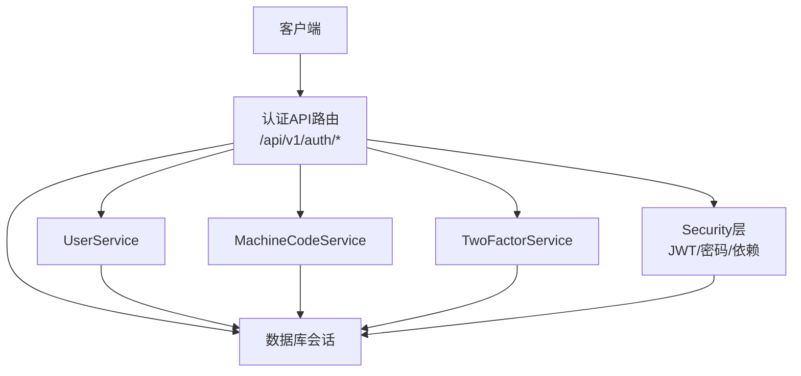
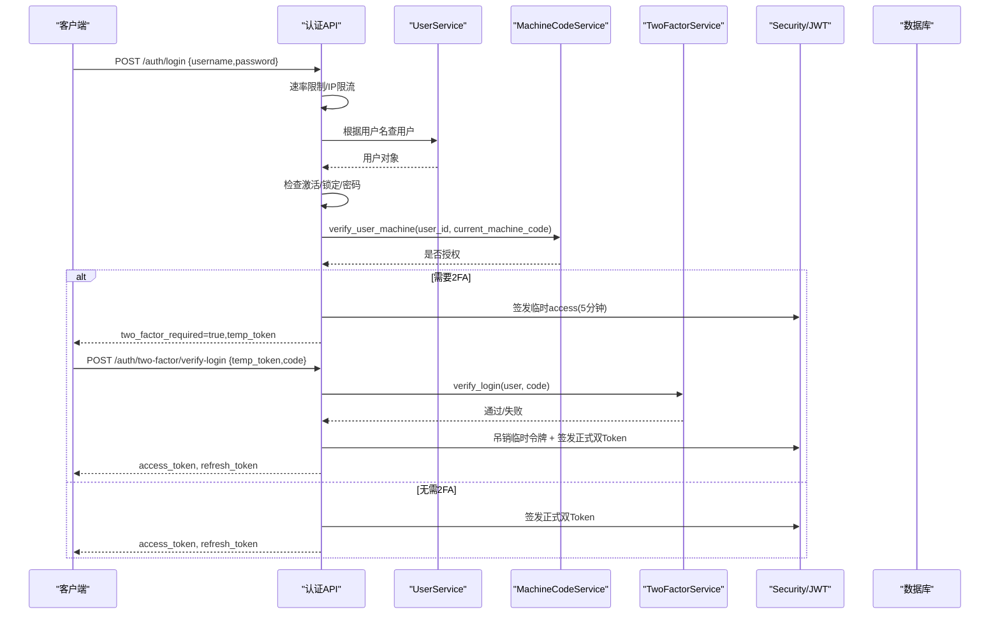
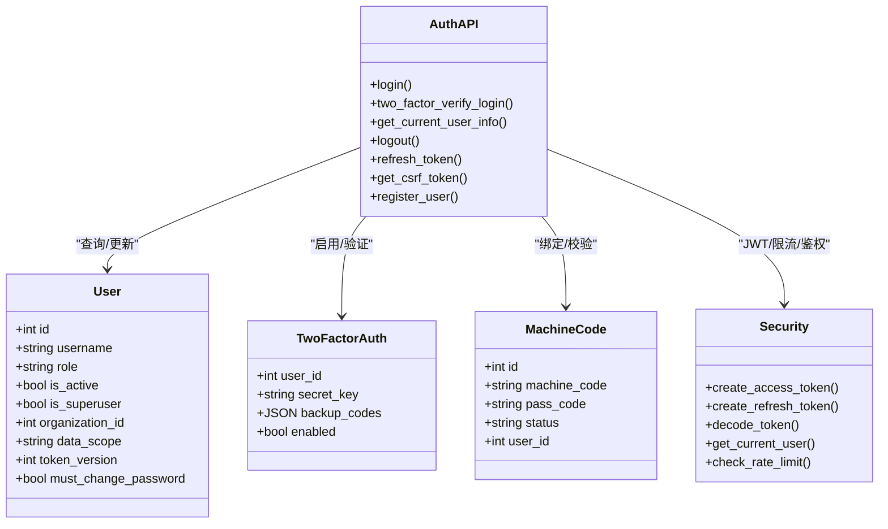

# 认证授权API

<cite>
**本文引用的文件**
- [backend/app/api/v1/auth/auth.py](file://backend/app/api/v1/auth/auth.py)
- [backend/app/api/v1/auth/two_factor.py](file://backend/app/api/v1/auth/two_factor.py)
- [backend/app/schemas/auth.py](file://backend/app/schemas/auth.py)
- [backend/app/core/security.py](file://backend/app/core/security.py)
- [backend/app/models/user.py](file://backend/app/models/user.py)
- [backend/app/models/two_factor_auth.py](file://backend/app/models/two_factor_auth.py)
- [backend/app/services/machine_code_service.py](file://backend/app/services/machine_code_service.py)
</cite>

## 目录
1. [简介](#简介)
2. [项目结构](#项目结构)
3. [核心组件](#核心组件)
4. [架构总览](#架构总览)
5. [详细组件分析](#详细组件分析)
6. [依赖关系分析](#依赖关系分析)
7. [性能与安全考量](#性能与安全考量)
8. [故障排查指南](#故障排查指南)
9. [结论](#结论)
10. [附录：前端集成与最佳实践](#附录：前端集成与最佳实践)

## 简介
本文件面向后端认证授权子系统，系统化说明用户登录、注册、密码管理、JWT令牌生成与验证、机器码绑定、双因素认证（2FA）等接口的HTTP方法、URL路径、请求参数、响应格式与错误处理；并阐述权限验证机制、数据范围控制、会话管理等安全细节。文档同时提供前后端集成的调用流程与最佳实践，帮助开发者快速对接。

## 项目结构
认证授权能力由以下模块协同实现：
- API路由层：定义HTTP接口，负责参数校验、速率限制、审计日志、业务编排
- 服务层：封装用户、机器码、2FA等业务逻辑
- 安全层：JWT签发/校验、密码哈希、访问控制依赖、速率限制、CSRF
- 模型层：用户、2FA、机器码等持久化实体

图表来源
- [backend/app/api/v1/auth/auth.py:101-287](file://backend/app/api/v1/auth/auth.py#L101-L287)
- [backend/app/api/v1/auth/two_factor.py:31-87](file://backend/app/api/v1/auth/two_factor.py#L31-L87)
- [backend/app/core/security.py:210-336](file://backend/app/core/security.py#L210-L336)
- [backend/app/services/machine_code_service.py:121-152](file://backend/app/services/machine_code_service.py#L121-L152)

章节来源
- [backend/app/api/v1/auth/auth.py:101-287](file://backend/app/api/v1/auth/auth.py#L101-L287)
- [backend/app/api/v1/auth/two_factor.py:31-87](file://backend/app/api/v1/auth/two_factor.py#L31-L87)
- [backend/app/core/security.py:210-336](file://backend/app/core/security.py#L210-L336)
- [backend/app/services/machine_code_service.py:121-152](file://backend/app/services/machine_code_service.py#L121-L152)

## 核心组件
- 认证路由与接口：登录、2FA校验、获取当前用户、登出、刷新令牌、获取CSRF Token、注册
- 安全中间件与依赖：Bearer鉴权、黑名单校验、token版本校验、角色/活跃状态检查
- 密码策略：长度、复杂度、弱口令检测、用户名校验
- 机器码服务：本机机器码计算、通行码生成与验证、用户机器绑定校验
- 双因素认证：启用、验证、禁用、状态查询
- 数据模型：用户、2FA配置、机器码记录

章节来源
- [backend/app/api/v1/auth/auth.py:101-800](file://backend/app/api/v1/auth/auth.py#L101-L800)
- [backend/app/core/security.py:120-336](file://backend/app/core/security.py#L120-L336)
- [backend/app/services/machine_code_service.py:121-152](file://backend/app/services/machine_code_service.py#L121-L152)
- [backend/app/models/user.py:26-85](file://backend/app/models/user.py#L26-L85)
- [backend/app/models/two_factor_auth.py:13-35](file://backend/app/models/two_factor_auth.py#L13-L35)

## 架构总览
认证流程关键路径如下：
- 登录：速率限制 → 用户查找 → 激活状态 → 账户锁定检查 → 密码校验 → 机器码校验 → 2FA判断 → 签发双Token（含token_version）
- 2FA校验：校验临时令牌 → TOTP/备用码验证 → 吊销临时令牌 → 签发正式双Token
- 刷新令牌：仅接受refresh_token → 校验用户 → 吊销旧refresh → 签发新双Token
- 登出：吊销请求携带的access/refresh → 递增token_version使全部会话失效 → 审计日志

图表来源
- [backend/app/api/v1/auth/auth.py:101-287](file://backend/app/api/v1/auth/auth.py#L101-L287)
- [backend/app/api/v1/auth/auth.py:290-444](file://backend/app/api/v1/auth/auth.py#L290-L444)
- [backend/app/services/machine_code_service.py:661-691](file://backend/app/services/machine_code_service.py#L661-L691)
- [backend/app/core/security.py:210-336](file://backend/app/core/security.py#L210-L336)

## 详细组件分析

### 登录接口
- 方法/路径：POST /api/v1/auth/login
- 请求体：包含用户名和密码（遵循LoginRequest schema）
- 成功响应：返回统一包装的登录响应，包含access_token、refresh_token、用户信息、是否需改密、是否需要2FA及临时令牌
- 失败处理：
  - 429：登录频率过高
  - 401：凭据无效或用户不存在
  - 403：未激活或机器码未授权
  - 400：其他业务校验失败
- 安全要点：
  - 基于IP的速率限制
  - 账户锁定策略（连续失败次数达到阈值自动锁定）
  - 机器码绑定校验（如已绑定）
  - 2FA流程（若启用则先返回临时令牌）

章节来源
- [backend/app/api/v1/auth/auth.py:101-287](file://backend/app/api/v1/auth/auth.py#L101-L287)
- [backend/app/schemas/auth.py:8-19](file://backend/app/schemas/auth.py#L8-L19)
- [backend/app/schemas/auth.py:53-63](file://backend/app/schemas/auth.py#L53-L63)
- [backend/app/services/machine_code_service.py:661-691](file://backend/app/services/machine_code_service.py#L661-L691)

### 双因素认证登录校验
- 方法/路径：POST /api/v1/auth/two-factor/verify-login
- 请求体：临时令牌与验证码（TOTP或备用码）
- 成功响应：正式access_token与refresh_token
- 失败处理：
  - 401：临时令牌无效/过期、2FA验证码错误
  - 429：验证频率过高
- 安全要点：
  - 临时令牌短期有效且可吊销
  - 验证通过后立即吊销临时令牌
  - 重置失败计数与锁定状态

章节来源
- [backend/app/api/v1/auth/auth.py:290-444](file://backend/app/api/v1/auth/auth.py#L290-L444)
- [backend/app/schemas/auth.py:65-70](file://backend/app/schemas/auth.py#L65-L70)

### 获取当前用户信息
- 方法/路径：GET /api/v1/auth/me
- 鉴权：需要有效的Bearer token
- 响应：当前用户基本信息（ID、用户名、邮箱、角色、组织信息等）
- 失败处理：401 未认证或用户不存在

章节来源
- [backend/app/api/v1/auth/auth.py:473-505](file://backend/app/api/v1/auth/auth.py#L473-L505)
- [backend/app/core/security.py:243-336](file://backend/app/core/security.py#L243-L336)

### 登出接口
- 方法/路径：POST /api/v1/auth/logout
- 行为：
  - 吊销本次请求携带的access/refresh令牌
  - 递增用户token_version，使该用户所有现存JWT立即失效
  - 记录登出审计日志
- 响应：登出成功

章节来源
- [backend/app/api/v1/auth/auth.py:570-591](file://backend/app/api/v1/auth/auth.py#L570-L591)
- [backend/app/core/security.py:243-336](file://backend/app/core/security.py#L243-L336)

### 刷新令牌
- 方法/路径：POST /api/v1/auth/refresh
- 请求体：refresh_token
- 成功响应：新的access_token与refresh_token
- 失败处理：
  - 401：无效的刷新令牌、用户不存在或被禁用
  - 429：刷新频率过高
- 安全要点：
  - 仅接受refresh_token
  - 旧refresh_token立即吊销（轮换）
  - 重新签发时携带最新token_version

章节来源
- [backend/app/api/v1/auth/auth.py:594-689](file://backend/app/api/v1/auth/auth.py#L594-L689)

### 获取CSRF Token
- 方法/路径：GET /api/v1/auth/csrf-token
- 行为：
  - 在响应体中返回csrf_token
  - 设置Cookie（httponly=False以便JS读取），用于Double Submit Cookie模式
  - 后续状态变更请求需在X-CSRF-Token头携带原始token
- 失败处理：429 请求过于频繁

章节来源
- [backend/app/api/v1/auth/auth.py:692-747](file://backend/app/api/v1/auth/auth.py#L692-L747)

### 用户注册
- 方法/路径：POST /api/v1/auth/register
- 请求体：用户名、密码、通行码（可选姓名、邮箱）
- 成功响应：登录响应（包含access_token、refresh_token、用户信息）
- 失败处理：
  - 429：注册频率过高
  - 400：用户名不符合策略、通行码无效
  - 401/403：其他业务校验失败
- 安全要点：
  - 基于IP的速率限制
  - 用户名与密码策略校验
  - 通行码验证（支持HMAC自验证与数据库匹配）

章节来源
- [backend/app/api/v1/auth/auth.py:750-800](file://backend/app/api/v1/auth/auth.py#L750-L800)
- [backend/app/services/machine_code_service.py:267-323](file://backend/app/services/machine_code_service.py#L267-L323)

### 双因素认证管理
- 启用：POST /api/v1/auth/two-factor/enable
  - 返回密钥、二维码、备用码
- 验证并启用：POST /api/v1/auth/two-factor/verify
  - 传入TOTP令牌进行验证，成功后启用
- 禁用：POST /api/v1/auth/two-factor/disable
- 状态：GET /api/v1/auth/two-factor/status
  - 返回是否启用

章节来源
- [backend/app/api/v1/auth/two_factor.py:31-87](file://backend/app/api/v1/auth/two_factor.py#L31-L87)

### 密码管理
- 密码策略：最小长度、大小写、数字、特殊字符、弱口令前缀、禁止包含用户名片段
- 修改密码：建议通过用户管理接口（不在本节详述），修改后应递增token_version以强制下线旧会话
- 安全要点：
  - bcrypt哈希存储
  - 超长密码截断兼容
  - 审计日志记录

章节来源
- [backend/app/core/security.py:120-173](file://backend/app/core/security.py#L120-L173)
- [backend/app/core/security.py:524-590](file://backend/app/core/security.py#L524-L590)
- [backend/app/models/user.py:78-85](file://backend/app/models/user.py#L78-L85)

## 依赖关系分析
- 认证API依赖：
  - UserService：用户查询与更新
  - MachineCodeService：机器码计算与验证
  - TwoFactorService：2FA启用/验证/禁用/状态
  - Security层：JWT签发/解码、黑名单、token版本校验、速率限制、CSRF
- 数据模型依赖：
  - User：用户信息与权限、数据范围、token版本
  - TwoFactorAuth：2FA密钥、备用码、启用状态
  - MachineCode：机器码记录、通行码、状态

图表来源
- [backend/app/models/user.py:26-85](file://backend/app/models/user.py#L26-L85)
- [backend/app/models/two_factor_auth.py:13-35](file://backend/app/models/two_factor_auth.py#L13-L35)
- [backend/app/api/v1/auth/auth.py:101-800](file://backend/app/api/v1/auth/auth.py#L101-L800)
- [backend/app/core/security.py:210-336](file://backend/app/core/security.py#L210-L336)

章节来源
- [backend/app/models/user.py:26-85](file://backend/app/models/user.py#L26-L85)
- [backend/app/models/two_factor_auth.py:13-35](file://backend/app/models/two_factor_auth.py#L13-L35)
- [backend/app/api/v1/auth/auth.py:101-800](file://backend/app/api/v1/auth/auth.py#L101-L800)
- [backend/app/core/security.py:210-336](file://backend/app/core/security.py#L210-L336)

## 性能与安全考量
- 性能
  - 机器码计算进程级缓存，避免重复子进程开销
  - 速率限制采用滑动窗口算法，定期清理过期键防止内存泄漏
  - JWT解码使用统一token_manager，内置黑名单与LRU缓存
- 安全
  - Bearer鉴权入口统一，拒绝非access类型令牌
  - 黑名单与token_version双重失效机制，支持强制下线
  - 密码策略严格，bcrypt哈希存储，敏感字段脱敏日志
  - CSRF Double Submit Cookie模式，生产环境secure Cookie
  - 账户锁定与登录失败审计，防暴力破解

章节来源
- [backend/app/services/machine_code_service.py:52-152](file://backend/app/services/machine_code_service.py#L52-L152)
- [backend/app/core/security.py:414-517](file://backend/app/core/security.py#L414-L517)
- [backend/app/core/security.py:243-336](file://backend/app/core/security.py#L243-L336)
- [backend/app/api/v1/auth/auth.py:692-747](file://backend/app/api/v1/auth/auth.py#L692-L747)

## 故障排查指南
- 登录失败
  - 检查用户名是否存在、是否激活、是否被锁定
  - 查看速率限制日志与失败计数
  - 确认机器码绑定是否匹配
- 2FA失败
  - 检查临时令牌是否有效且为pending类型
  - 验证码是否正确（TOTP或备用码）
- 刷新令牌失败
  - 确认传入的是refresh_token而非access_token
  - 检查用户是否仍活跃且未被锁定
- 登出不生效
  - 确认已吊销请求中的access/refresh
  - 检查token_version是否递增成功

章节来源
- [backend/app/api/v1/auth/auth.py:101-287](file://backend/app/api/v1/auth/auth.py#L101-L287)
- [backend/app/api/v1/auth/auth.py:290-444](file://backend/app/api/v1/auth/auth.py#L290-L444)
- [backend/app/api/v1/auth/auth.py:594-689](file://backend/app/api/v1/auth/auth.py#L594-L689)
- [backend/app/api/v1/auth/auth.py:570-591](file://backend/app/api/v1/auth/auth.py#L570-L591)

## 结论
本认证授权子系统通过统一的鉴权依赖、严格的密码策略、完善的速率限制与审计、以及机器码绑定与2FA增强，构建了健壮的认证体系。结合token_version与黑名单机制，实现了真正的会话管理与强制下线能力。前端可按本文档的流程集成，确保安全性与用户体验。

## 附录：前端集成与最佳实践
- 登录流程
  - 调用POST /api/v1/auth/login，携带用户名与密码
  - 若响应two_factor_required为true，保存temp_token并引导用户输入验证码
  - 调用POST /api/v1/auth/two-factor/verify-login，提交temp_token与验证码
  - 成功后保存access_token与refresh_token，并在后续请求Header中携带Authorization: Bearer <access_token>
- 刷新令牌
  - 当access_token过期时，调用POST /api/v1/auth/refresh，传入refresh_token
  - 成功后替换本地存储的access_token与refresh_token
- CSRF保护
  - 发起状态变更请求前，调用GET /api/v1/auth/csrf-token获取csrf_token
  - 将原始token放入X-CSRF-Token请求头
- 登出
  - 调用POST /api/v1/auth/logout，服务端会吊销令牌并递增token_version
- 最佳实践
  - 始终使用HTTPS传输
  - 不将token持久化到localStorage（建议使用内存或httpOnly Cookie）
  - 对敏感操作增加二次确认与审计
  - 合理设置令牌过期时间，及时刷新
  - 遇到异常统一提示“请重新登录”并清空本地凭证

章节来源
- [backend/app/api/v1/auth/auth.py:101-287](file://backend/app/api/v1/auth/auth.py#L101-L287)
- [backend/app/api/v1/auth/auth.py:290-444](file://backend/app/api/v1/auth/auth.py#L290-L444)
- [backend/app/api/v1/auth/auth.py:594-689](file://backend/app/api/v1/auth/auth.py#L594-L689)
- [backend/app/api/v1/auth/auth.py:692-747](file://backend/app/api/v1/auth/auth.py#L692-L747)
- [backend/app/api/v1/auth/auth.py:570-591](file://backend/app/api/v1/auth/auth.py#L570-L591)