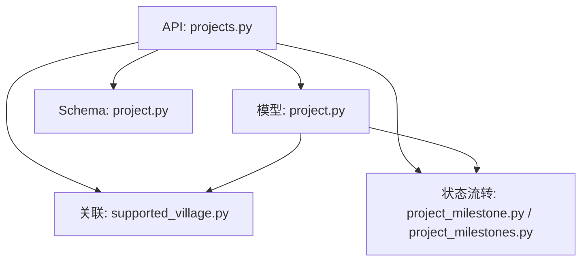
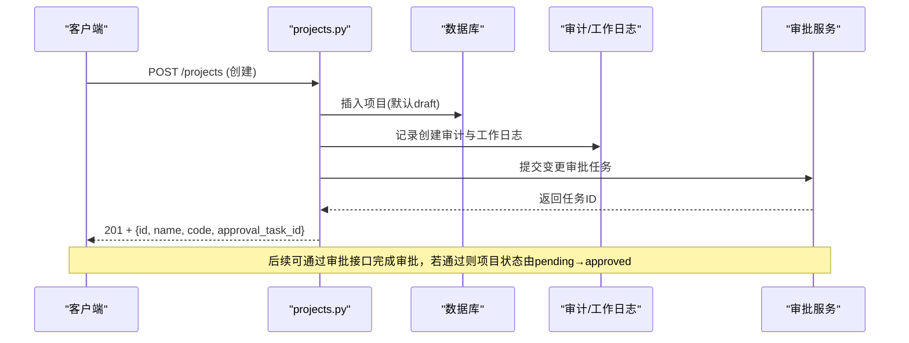
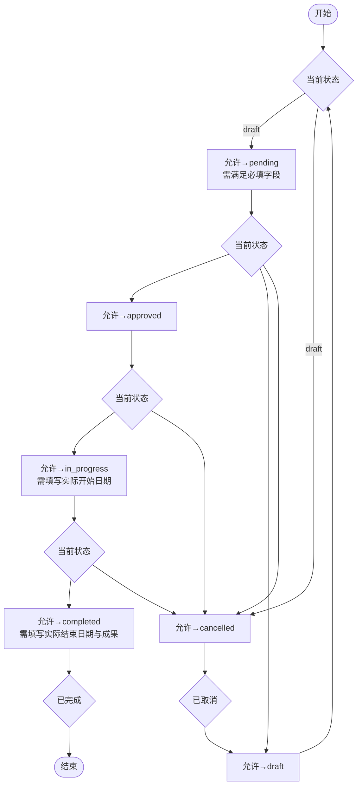
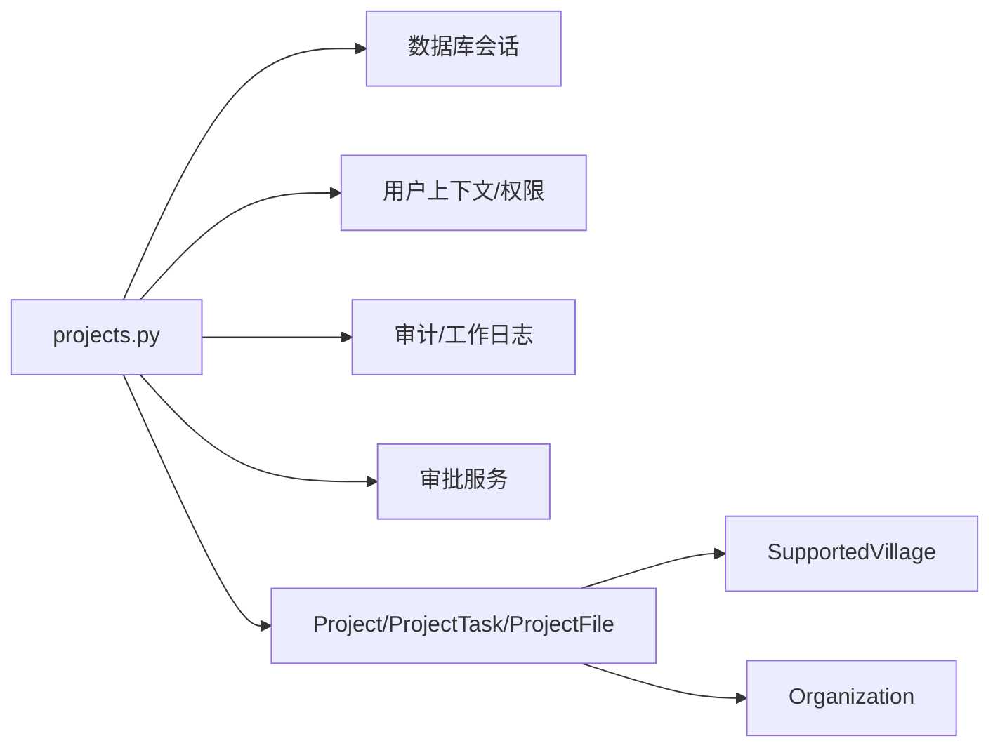

# 项目CRUD接口

<cite>
**本文引用的文件**
- [backend/app/api/v1/projects.py](file://backend/app/api/v1/projects.py)
- [backend/app/models/project.py](file://backend/app/models/project.py)
- [backend/app/schemas/project.py](file://backend/app/schemas/project.py)
- [backend/app/models/supported_village.py](file://backend/app/models/supported_village.py)
- [backend/app/models/project_milestone.py](file://backend/app/models/project_milestone.py)
- [backend/app/api/v1/project_milestones.py](file://backend/app/api/v1/project_milestones.py)
</cite>

## 目录
1. [简介](#简介)
2. [项目结构](#项目结构)
3. [核心组件](#核心组件)
4. [架构总览](#架构总览)
5. [详细组件分析](#详细组件分析)
6. [依赖关系分析](#依赖关系分析)
7. [性能考虑](#性能考虑)
8. [故障排查指南](#故障排查指南)
9. [结论](#结论)
10. [附录：API参考与调用示例](#附录api参考与调用示例)

## 简介
本文件面向“乡村振兴系统”中的项目管理模块，提供完整的项目CRUD接口文档。内容涵盖HTTP方法、URL路径、请求参数、响应格式、错误处理、状态流转（草稿、待审批、已批准、进行中、已完成、已取消）、数据验证规则、权限控制逻辑，以及与帮扶村、组织等实体的关联关系说明。同时给出全生命周期管理的端到端调用示例，帮助前端或第三方系统快速集成。

## 项目结构
本项目后端采用FastAPI路由+Pydantic校验+SQLAlchemy模型的分层设计：
- API层：位于 backend/app/api/v1/projects.py，定义项目的CRUD、统计、导出、任务、经费等接口。
- 模型层：位于 backend/app/models/project.py，定义项目、任务、附件等ORM模型及状态枚举。
- Schema层：位于 backend/app/schemas/project.py，定义通用数据结构（部分用于历史兼容）。
- 关联实体：帮扶村模型在 backend/app/models/supported_village.py；项目状态流转规则在 backend/app/models/project_milestone.py 与 backend/app/api/v1/project_milestones.py。

图表来源
- [backend/app/api/v1/projects.py:54-112](file://backend/app/api/v1/projects.py#L54-L112)
- [backend/app/models/project.py:25-174](file://backend/app/models/project.py#L25-L174)
- [backend/app/models/supported_village.py:42-127](file://backend/app/models/supported_village.py#L42-L127)
- [backend/app/models/project_milestone.py:110-141](file://backend/app/models/project_milestone.py#L110-L141)
- [backend/app/api/v1/project_milestones.py:236-272](file://backend/app/api/v1/project_milestones.py#L236-L272)

章节来源
- [backend/app/api/v1/projects.py:54-112](file://backend/app/api/v1/projects.py#L54-L112)
- [backend/app/models/project.py:25-174](file://backend/app/models/project.py#L25-L174)

## 核心组件
- 项目模型 Project：包含基础信息、时间、预算、负责人、资金信息等字段，并维护软删除标记与创建/更新时间。
- 项目状态枚举 ProjectStatus：支持 draft/pending/approved/in_progress/completed/cancelled。
- 项目任务 ProjectTask：项目下的子任务，含优先级、截止日期等。
- 项目附件 ProjectFile：按阶段分类的附件记录。
- 帮扶村 SupportedVillage：项目通过 village_id 关联到帮扶村，支持地区筛选。
- 组织 Organization：项目可归属组织，用于数据权限隔离。

章节来源
- [backend/app/models/project.py:47-174](file://backend/app/models/project.py#L47-L174)
- [backend/app/models/project.py:239-320](file://backend/app/models/project.py#L239-L320)
- [backend/app/models/supported_village.py:42-127](file://backend/app/models/supported_village.py#L42-L127)

## 架构总览
项目CRUD流程遵循“鉴权→校验→业务处理→审计/工作日志→审批联动→缓存失效→返回结果”的标准链路。关键特性：
- 统一数据权限过滤：列表/详情均应用组织/人员范围过滤。
- 软删除：删除操作将状态置为 cancelled 并标记 is_active=False。
- 审批联动：新增/更新/删除项目自动提交变更审批任务；审批通过后回写项目状态（pending→approved）。
- Diff留痕：关键字段变更记录审计日志与工作日志。

图表来源
- [backend/app/api/v1/projects.py:790-920](file://backend/app/api/v1/projects.py#L790-L920)
- [backend/app/api/v1/projects.py:100-112](file://backend/app/api/v1/projects.py#L100-L112)

## 详细组件分析

### 项目CRUD接口
- 获取项目列表
  - 方法/路径：GET /api/v1/projects
  - 查询参数：page、page_size、keyword、project_type、status、village_id、region、year、sort_by、sort_order、include_cancelled、include_deleted
  - 权限：需登录；列表应用数据权限过滤（组织/人员范围）
  - 响应：分页对象，包含 items 与 total
  - 错误：无权限/参数非法时返回对应错误码

- 获取项目详情
  - 方法/路径：GET /api/v1/projects/{project_id}
  - 权限：需登录；跨组织访问受控
  - 响应：项目详情对象，包含关联经费数量、任务数量、可见性元数据
  - 错误：404（不存在）、403（无权访问）

- 创建项目
  - 方法/路径：POST /api/v1/projects
  - 请求体：ProjectCreate（名称、类型、帮扶村、描述、预算、进度、起止日期、负责人、联系方式、紧急程度、合同编号、资金信息等）
  - 校验：日期格式YYYY-MM-DD；结束日期不早于开始日期；预算≥0；项目编号唯一（未提供则自动生成）
  - 权限：需登录；自动设置 created_by、organization_id
  - 响应：201 + {id, name, code, approval_task_id}
  - 副作用：写入审计与工作日志；提交变更审批任务；刷新仪表盘缓存

- 更新项目
  - 方法/路径：PUT /api/v1/projects/{project_id}
  - 请求体：ProjectUpdate（可选字段）
  - 校验：日期格式；状态值必须为合法枚举；结束日期不早于开始日期
  - 权限：仅管理员或项目创建者可更新
  - 响应：200 + 更新后的项目对象（含approval_task_id）
  - 副作用：若状态变化触发经费阶段联动事件；记录审计/工作日志；提交变更审批任务；刷新缓存

- 删除项目
  - 方法/路径：DELETE /api/v1/projects/{project_id}
  - 权限：仅管理员或项目创建者
  - 行为：软删除（status=cancelled，is_active=False，记录deleted_at）
  - 响应：200 + {id, approval_task_id}
  - 副作用：记录审计/工作日志；提交变更审批任务；刷新缓存

- 项目统计
  - 方法/路径：GET /api/v1/projects/stats
  - 响应：各状态计数、预算汇总、已投入汇总

- 导出项目列表
  - 方法/路径：GET /api/v1/projects/export
  - 参数：keyword、project_type、status
  - 响应：Excel或CSV流式下载

章节来源
- [backend/app/api/v1/projects.py:513-549](file://backend/app/api/v1/projects.py#L513-L549)
- [backend/app/api/v1/projects.py:555-651](file://backend/app/api/v1/projects.py#L555-L651)
- [backend/app/api/v1/projects.py:657-753](file://backend/app/api/v1/projects.py#L657-L753)
- [backend/app/api/v1/projects.py:756-787](file://backend/app/api/v1/projects.py#L756-L787)
- [backend/app/api/v1/projects.py:790-920](file://backend/app/api/v1/projects.py#L790-L920)
- [backend/app/api/v1/projects.py:1030-1088](file://backend/app/api/v1/projects.py#L1030-L1088)
- [backend/app/api/v1/projects.py:1091-1181](file://backend/app/api/v1/projects.py#L1091-L1181)

### 项目任务管理
- 获取任务列表：GET /api/v1/projects/{project_id}/tasks
- 创建任务：POST /api/v1/projects/{project_id}/tasks
- 更新任务：PUT /api/v1/projects/{project_id}/tasks/{task_id}
- 删除任务：DELETE /api/v1/projects/{project_id}/tasks/{task_id}

章节来源
- [backend/app/api/v1/projects.py:1285-1395](file://backend/app/api/v1/projects.py#L1285-L1395)

### 项目经费管理
- 获取经费列表：GET /api/v1/projects/{project_id}/funds
- 添加经费：POST /api/v1/projects/{project_id}/funds

章节来源
- [backend/app/api/v1/projects.py:1200-1279](file://backend/app/api/v1/projects.py#L1200-L1279)

### 项目状态流转
- 状态枚举：draft、pending、approved、in_progress、completed、cancelled
- 合法流转：
  - draft → pending/cancelled
  - pending → approved/draft/cancelled
  - approved → in_progress/cancelled
  - in_progress → completed/cancelled
  - completed → 不可变更
  - cancelled → draft（可恢复）
- 准入条件：
  - draft→pending：需填写名称、类型、预算、起止日期、负责人
  - approved→in_progress：需填写实际开始日期
  - in_progress→completed：需填写实际结束日期与成果
- 审批联动：当审批任务通过且项目当前状态为pending时，自动回写为approved

图表来源
- [backend/app/models/project_milestone.py:110-141](file://backend/app/models/project_milestone.py#L110-L141)
- [backend/app/api/v1/project_milestones.py:236-272](file://backend/app/api/v1/project_milestones.py#L236-L272)
- [backend/app/api/v1/projects.py:100-112](file://backend/app/api/v1/projects.py#L100-L112)

章节来源
- [backend/app/models/project_milestone.py:110-141](file://backend/app/models/project_milestone.py#L110-L141)
- [backend/app/api/v1/project_milestones.py:236-272](file://backend/app/api/v1/project_milestones.py#L236-L272)
- [backend/app/api/v1/projects.py:100-112](file://backend/app/api/v1/projects.py#L100-L112)

### 数据验证规则
- 日期格式：YYYY-MM-DD；结束日期不早于开始日期
- 预算：非负数
- 进度：0-100
- 状态：仅限枚举值
- 项目编号：全局唯一（未提供则自动生成）
- 必填字段：根据状态流转的准入条件动态校验

章节来源
- [backend/app/api/v1/projects.py:188-203](file://backend/app/api/v1/projects.py#L188-L203)
- [backend/app/api/v1/projects.py:241-257](file://backend/app/api/v1/projects.py#L241-L257)
- [backend/app/models/project_milestone.py:120-141](file://backend/app/models/project_milestone.py#L120-L141)

### 权限控制逻辑
- 列表/详情：应用数据权限过滤（组织/人员范围），非管理员仅可查看本组织数据
- 修改/删除：仅管理员或项目创建者可执行
- 跨组织访问：详情接口进行二次校验，越权返回403

章节来源
- [backend/app/api/v1/projects.py:118-146](file://backend/app/api/v1/projects.py#L118-L146)
- [backend/app/api/v1/projects.py:657-700](file://backend/app/api/v1/projects.py#L657-L700)
- [backend/app/api/v1/projects.py:756-787](file://backend/app/api/v1/projects.py#L756-L787)
- [backend/app/api/v1/projects.py:1091-1105](file://backend/app/api/v1/projects.py#L1091-L1105)

### 与帮扶村、组织的关联关系
- 项目通过 village_id 关联到帮扶村（supported_villages.id），支持按地区（county）筛选
- 项目通过 organization_id 归属组织，用于数据权限隔离与列表过滤
- 详情返回列表中会附带帮扶村名称与组织名称（如已预加载）

章节来源
- [backend/app/models/project.py:79-92](file://backend/app/models/project.py#L79-L92)
- [backend/app/models/project.py:167-174](file://backend/app/models/project.py#L167-L174)
- [backend/app/models/supported_village.py:42-127](file://backend/app/models/supported_village.py#L42-L127)
- [backend/app/api/v1/projects.py:680-713](file://backend/app/api/v1/projects.py#L680-L713)
- [backend/app/api/v1/projects.py:410-492](file://backend/app/api/v1/projects.py#L410-L492)

## 依赖关系分析
- API层依赖：
  - 数据库会话（get_db）
  - 安全与用户上下文（get_current_user）
  - 数据权限（require_data_permission、apply_scope_filter）
  - 审计与服务（AuditLogService、AuditEnhancementService、write_work_log）
  - 审批服务（submit_entity_change_approval、ApprovalWorkflowService）
- 模型层依赖：
  - 项目与任务、附件、经费的多对一/一对多关系
  - 项目与帮扶村、组织的外键约束

图表来源
- [backend/app/api/v1/projects.py:14-50](file://backend/app/api/v1/projects.py#L14-L50)
- [backend/app/models/project.py:167-174](file://backend/app/models/project.py#L167-L174)

章节来源
- [backend/app/api/v1/projects.py:14-50](file://backend/app/api/v1/projects.py#L14-L50)
- [backend/app/models/project.py:167-174](file://backend/app/models/project.py#L167-L174)

## 性能考虑
- 列表查询使用 selectinload 预加载关联（任务、经费、帮扶村、组织），避免N+1问题
- 批量计算经费健康度指标，减少重复查询
- 导出限制上限10000条，防止内存溢出
- 索引优化：针对状态、类型、村庄、组织、创建人、日期等多列建立索引

章节来源
- [backend/app/api/v1/projects.py:680-713](file://backend/app/api/v1/projects.py#L680-L713)
- [backend/app/api/v1/projects.py:312-404](file://backend/app/api/v1/projects.py#L312-L404)
- [backend/app/api/v1/projects.py:555-651](file://backend/app/api/v1/projects.py#L555-L651)
- [backend/app/models/project.py:52-68](file://backend/app/models/project.py#L52-L68)

## 故障排查指南
- 404 项目不存在：检查项目ID是否存在且未被软删除
- 403 无权访问：确认当前用户是否属于项目所属组织或为创建者
- 400 无效状态/日期：检查状态枚举与日期格式、起止日期顺序
- 500 内部错误：查看日志中关于经费阶段联动、审批任务提交的异常堆栈
- 软删除后仍可见：确认 include_deleted 参数与列表过滤逻辑

章节来源
- [backend/app/api/v1/projects.py:127-146](file://backend/app/api/v1/projects.py#L127-L146)
- [backend/app/api/v1/projects.py:1091-1181](file://backend/app/api/v1/projects.py#L1091-L1181)
- [backend/app/api/v1/projects.py:1030-1088](file://backend/app/api/v1/projects.py#L1030-L1088)

## 结论
本项目CRUD接口提供了完善的项目管理能力，覆盖从创建、查询、更新到删除的全生命周期，并通过严格的校验、权限控制、审计留痕与审批联动确保数据一致性与合规性。结合帮扶村与组织关联，可实现精细化的数据隔离与区域化筛选。建议在前端集成时严格遵循状态流转规则与准入条件，并在关键操作处提示审批任务状态。

## 附录：API参考与调用示例

### 接口清单
- GET /api/v1/projects：获取项目列表
- GET /api/v1/projects/{project_id}：获取项目详情
- POST /api/v1/projects：创建项目
- PUT /api/v1/projects/{project_id}：更新项目
- DELETE /api/v1/projects/{project_id}：删除项目
- GET /api/v1/projects/stats：项目统计概览
- GET /api/v1/projects/export：导出项目列表
- GET /api/v1/projects/{project_id}/tasks：获取任务列表
- POST /api/v1/projects/{project_id}/tasks：创建任务
- PUT /api/v1/projects/{project_id}/tasks/{task_id}：更新任务
- DELETE /api/v1/projects/{project_id}/tasks/{task_id}：删除任务
- GET /api/v1/projects/{project_id}/funds：获取经费列表
- POST /api/v1/projects/{project_id}/funds：添加经费

### 典型调用示例（全生命周期）
- 创建项目
  - 方法：POST
  - 路径：/api/v1/projects
  - 请求体要点：name、type、budget、start_date、end_date、responsible_person、village_id（可选）
  - 响应：{id, name, code, approval_task_id}
  - 说明：未提供code则自动生成；默认状态为draft；自动提交变更审批任务

- 提交审批（将项目置为pending并进入审批）
  - 方法：PUT
  - 路径：/api/v1/projects/{project_id}
  - 请求体：status=pending（需满足准入字段）
  - 响应：{... , approval_task_id}

- 审批通过（通过审批接口）
  - 方法：POST
  - 路径：/api/v1/approval/tasks/{task_id}/approve
  - 响应：成功
  - 效果：项目状态由pending→approved（审批回调）

- 启动项目
  - 方法：PUT
  - 路径：/api/v1/projects/{project_id}
  - 请求体：status=in_progress，actual_start_date（必填）
  - 效果：进入进行中阶段

- 完成项目
  - 方法：PUT
  - 路径：/api/v1/projects/{project_id}
  - 请求体：status=completed，actual_end_date、achievements（必填）
  - 效果：项目完成

- 删除项目
  - 方法：DELETE
  - 路径：/api/v1/projects/{project_id}
  - 效果：软删除（status=cancelled，is_active=False）

章节来源
- [backend/app/api/v1/projects.py:790-920](file://backend/app/api/v1/projects.py#L790-L920)
- [backend/app/api/v1/projects.py:1030-1088](file://backend/app/api/v1/projects.py#L1030-L1088)
- [backend/app/api/v1/projects.py:1091-1181](file://backend/app/api/v1/projects.py#L1091-L1181)
- [backend/app/api/v1/projects.py:100-112](file://backend/app/api/v1/projects.py#L100-L112)