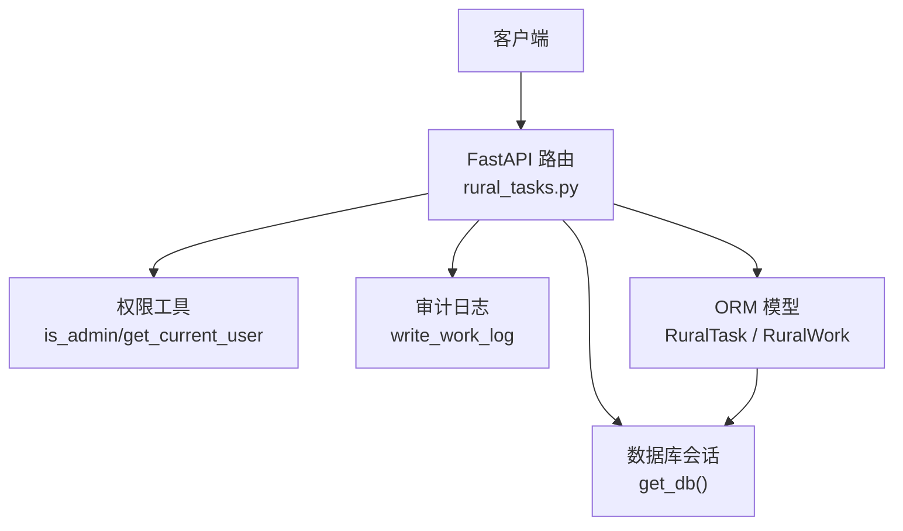
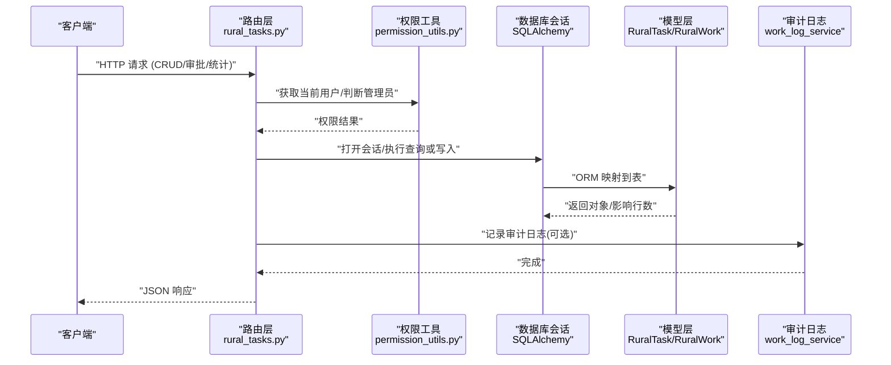
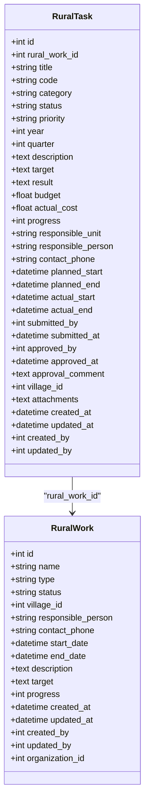
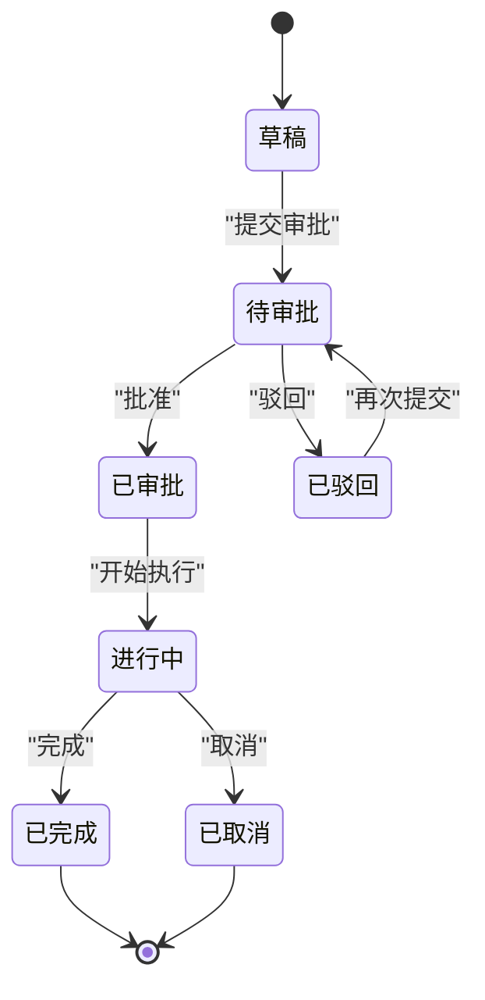
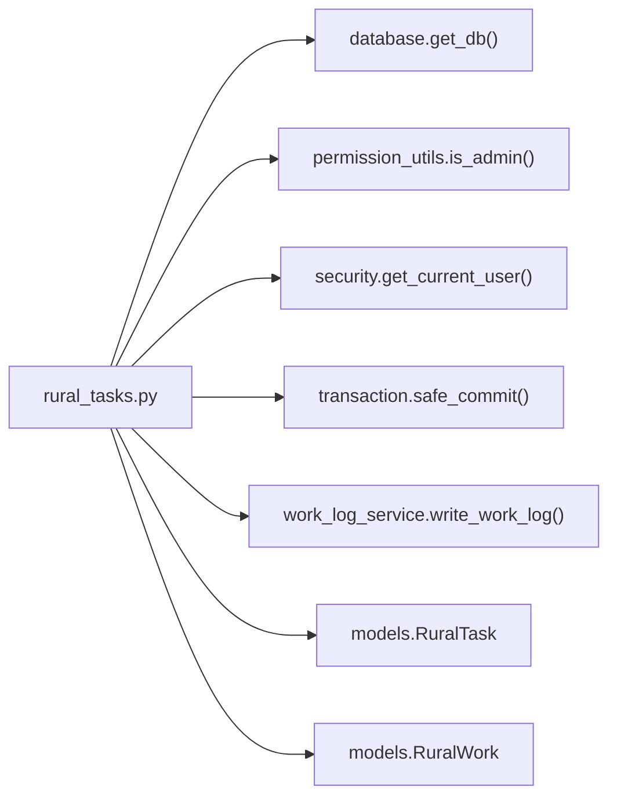
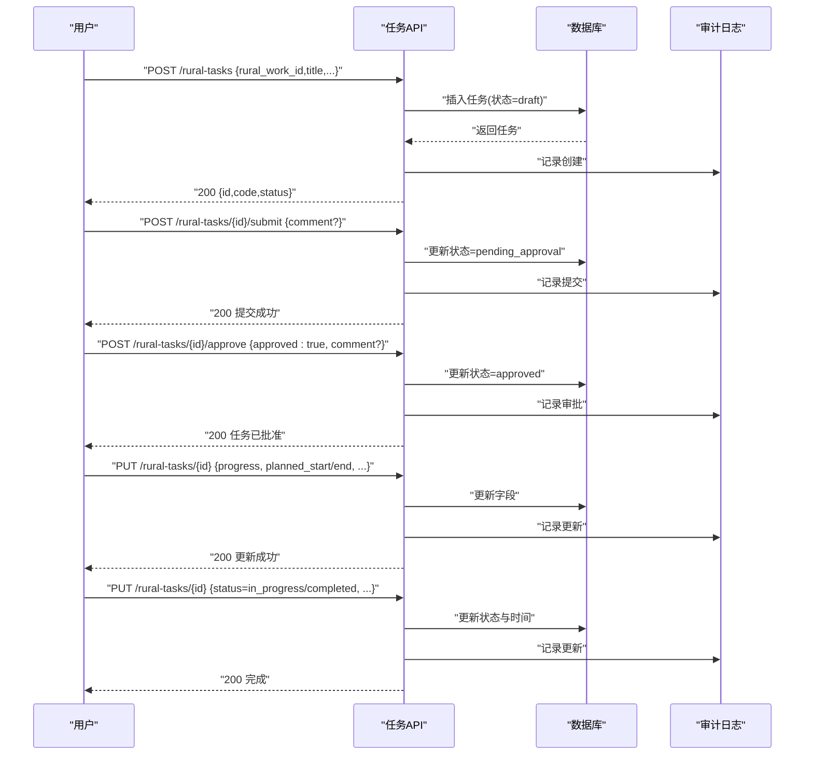

# 项目任务管理接口

<cite>
**本文引用的文件**
- [backend/app/api/v1/rural_tasks.py](file://backend/app/api/v1/rural_tasks.py)
- [backend/app/models/rural_task.py](file://backend/app/models/rural_task.py)
- [backend/app/schemas/rural_task.py](file://backend/app/schemas/rural_task.py)
- [backend/app/models/rural_work.py](file://backend/app/models/rural_work.py)
- [backend/app/core/permission_utils.py](file://backend/app/core/permission_utils.py)
- [backend/tests/unit/test_api_rural_tasks_full.py](file://backend/tests/unit/test_api_rural_tasks_full.py)
</cite>

## 目录
1. [简介](#简介)
2. [项目结构](#项目结构)
3. [核心组件](#核心组件)
4. [架构总览](#架构总览)
5. [详细组件分析](#详细组件分析)
6. [依赖关系分析](#依赖关系分析)
7. [性能考虑](#性能考虑)
8. [故障排查指南](#故障排查指南)
9. [结论](#结论)
10. [附录：API 参考与调用示例](#附录api-参考与调用示例)

## 简介
本文件面向“乡村振兴工作任务”模块的任务管理接口，覆盖任务的创建、查询、更新、删除、提交审批、审批处理、批量删除以及统计查询等能力。文档说明每个接口的 HTTP 方法、URL 路径、请求参数、响应格式与错误处理；并阐述任务状态流转（草稿、待审批、已审批、进行中、已完成、已驳回、已取消）、优先级设置、负责人分配、截止日期管理等业务逻辑；同时说明任务与乡村工作（项目）的关联关系与数据隔离机制。

## 项目结构
该模块采用 FastAPI 路由 + Pydantic Schema + SQLAlchemy 模型的分层组织方式：
- API 路由层：定义 RESTful 端点、参数校验、权限控制、事务提交与审计日志记录
- 数据模型层：定义任务实体、枚举类型、索引与关系
- 模式层：定义创建、更新、列表、统计等请求/响应数据结构
- 权限工具：提供管理员判断与组织归属辅助函数
- 测试用例：覆盖主要 CRUD 与流程断言

图表来源
- [backend/app/api/v1/rural_tasks.py:1-366](file://backend/app/api/v1/rural_tasks.py#L1-L366)
- [backend/app/models/rural_task.py:56-133](file://backend/app/models/rural_task.py#L56-L133)
- [backend/app/models/rural_work.py:34-76](file://backend/app/models/rural_work.py#L34-L76)
- [backend/app/core/permission_utils.py:40-58](file://backend/app/core/permission_utils.py#L40-L58)

章节来源
- [backend/app/api/v1/rural_tasks.py:1-366](file://backend/app/api/v1/rural_tasks.py#L1-L366)
- [backend/app/models/rural_task.py:1-133](file://backend/app/models/rural_task.py#L1-L133)
- [backend/app/schemas/rural_task.py:1-130](file://backend/app/schemas/rural_task.py#L1-L130)
- [backend/app/models/rural_work.py:1-76](file://backend/app/models/rural_work.py#L1-L76)
- [backend/app/core/permission_utils.py:1-200](file://backend/app/core/permission_utils.py#L1-L200)

## 核心组件
- 路由与控制器：统一前缀 /api/v1/rural-tasks，提供列表、详情、创建、更新、删除、提交审批、审批、批量删除、统计等端点
- 数据模型：RuralTask（任务）、RuralWork（乡村工作/项目），包含分类、状态、优先级、时间、预算、责任人、帮扶村等字段及索引
- 模式定义：创建/更新/列表/统计/提交/审批等 Pydantic 模型，用于入参与出参校验与序列化
- 权限与隔离：非管理员仅能访问自己创建的任务；管理员可访问全部；列表与详情均做属主校验
- 审计留痕：关键操作（创建、更新、删除、提交、审批、批量删除）写入工作日志

章节来源
- [backend/app/api/v1/rural_tasks.py:72-366](file://backend/app/api/v1/rural_tasks.py#L72-L366)
- [backend/app/models/rural_task.py:21-133](file://backend/app/models/rural_task.py#L21-L133)
- [backend/app/schemas/rural_task.py:9-130](file://backend/app/schemas/rural_task.py#L9-L130)
- [backend/app/core/permission_utils.py:40-58](file://backend/app/core/permission_utils.py#L40-L58)

## 架构总览
下图展示了任务管理的整体交互流程：客户端通过 FastAPI 路由发起请求，路由层进行参数校验、权限检查、数据隔离过滤，随后读写数据库模型，并在关键节点记录审计日志。

图表来源
- [backend/app/api/v1/rural_tasks.py:72-366](file://backend/app/api/v1/rural_tasks.py#L72-L366)
- [backend/app/core/permission_utils.py:40-58](file://backend/app/core/permission_utils.py#L40-L58)
- [backend/app/models/rural_task.py:56-133](file://backend/app/models/rural_task.py#L56-L133)

## 详细组件分析

### 数据模型与枚举
- 任务分类：基础设施、产业帮扶、教育帮扶、医疗帮扶、环境改善、党建帮扶、消费帮扶、就业帮扶、其他
- 任务状态：草稿、待审批、已审批、已驳回、进行中、已完成、已取消
- 优先级：低、中、高、紧急
- 关键字段：标题、编号、年度、季度、描述、目标、成果、预算、实际花费、进度、责任单位、负责人、联系电话（加密存储）、计划开始/结束、实际开始/结束、提交人/时间、审批人/时间/意见、帮扶村、附件（JSON）、审计字段（创建/更新时间、创建/更新人）
- 索引：按工作ID+年度、状态、分类、帮扶村、年度建立索引以优化查询

图表来源
- [backend/app/models/rural_task.py:56-133](file://backend/app/models/rural_task.py#L56-L133)
- [backend/app/models/rural_work.py:34-76](file://backend/app/models/rural_work.py#L34-L76)

章节来源
- [backend/app/models/rural_task.py:21-133](file://backend/app/models/rural_task.py#L21-L133)
- [backend/app/models/rural_work.py:18-76](file://backend/app/models/rural_work.py#L18-L76)

### 请求与响应模式
- 创建：RuralTaskCreate，必填 rural_work_id、title；可选分类、优先级、年度、季度、描述、目标、预算、责任单位、负责人、联系电话、计划起止、帮扶村
- 更新：RuralTaskUpdate，支持部分更新，含状态、进度、预算、实际花费、结果、时间等
- 列表：RuralTaskListResponse，包含 total、items、skip、limit
- 统计：RuralTaskStatistics，包含总数、各状态计数、分类计数、预算与实际花费合计、完成率
- 提交审批：TaskSubmitRequest，可选 comment
- 审批：TaskApproveRequest，required approved，可选 comment

章节来源
- [backend/app/schemas/rural_task.py:9-130](file://backend/app/schemas/rural_task.py#L9-L130)

### 权限与数据隔离
- 列表与详情：非管理员仅能查看自己创建的任务；管理员可查看所有
- 写操作（更新/删除/提交/审批/批量删除）：需具备对应任务的所有权（非管理员）或管理员身份
- 组织维度：RuralWork 含 organization_id 字段用于组织级数据隔离；任务通过所属工作间接关联组织

章节来源
- [backend/app/api/v1/rural_tasks.py:88-90](file://backend/app/api/v1/rural_tasks.py#L88-L90)
- [backend/app/api/v1/rural_tasks.py:55-66](file://backend/app/api/v1/rural_tasks.py#L55-L66)
- [backend/app/models/rural_work.py:62-65](file://backend/app/models/rural_work.py#L62-L65)
- [backend/app/core/permission_utils.py:40-58](file://backend/app/core/permission_utils.py#L40-L58)

### 业务流程与状态机
- 任务生命周期：草稿 → 待审批 → 已审批/已驳回 → 进行中 → 已完成；也可从草稿/已驳回重新提交；支持取消
- 提交审批：仅草稿或被驳回的任务可提交；提交后标记提交人与时间
- 审批：仅待审批的任务可审批；批准则状态为已审批，否则为已驳回；记录审批人与时间、意见
- 进度与时间：支持计划起止与实际起止；进度 0-100；预算与实际花费可累计

图表来源
- [backend/app/models/rural_task.py:35-54](file://backend/app/models/rural_task.py#L35-L54)
- [backend/app/api/v1/rural_tasks.py:276-333](file://backend/app/api/v1/rural_tasks.py#L276-L333)

### 审计与日志
- 所有关键写操作（创建、更新、删除、提交、审批、批量删除）均尝试写入工作日志，便于追溯
- 审计失败不影响主流程（异常被捕获忽略）

章节来源
- [backend/app/api/v1/rural_tasks.py:214-222](file://backend/app/api/v1/rural_tasks.py#L214-L222)
- [backend/app/api/v1/rural_tasks.py:243-249](file://backend/app/api/v1/rural_tasks.py#L243-L249)
- [backend/app/api/v1/rural_tasks.py:263-269](file://backend/app/api/v1/rural_tasks.py#L263-L269)
- [backend/app/api/v1/rural_tasks.py:292-298](file://backend/app/api/v1/rural_tasks.py#L292-L298)
- [backend/app/api/v1/rural_tasks.py:325-332](file://backend/app/api/v1/rural_tasks.py#L325-L332)
- [backend/app/api/v1/rural_tasks.py:358-364](file://backend/app/api/v1/rural_tasks.py#L358-L364)

## 依赖关系分析
- 路由依赖：数据库会话、当前用户、管理员判断、事务提交、审计日志服务
- 模型依赖：RuralTask 依赖 RuralWork（外键 rural_work_id）、Village、User
- 权限依赖：基于角色/超级管理员标志判断是否管理员
- 测试依赖：对主要端点进行基础可用性断言

图表来源
- [backend/app/api/v1/rural_tasks.py:11-26](file://backend/app/api/v1/rural_tasks.py#L11-L26)
- [backend/app/models/rural_task.py:16-18](file://backend/app/models/rural_task.py#L16-L18)
- [backend/app/models/rural_work.py:13-15](file://backend/app/models/rural_work.py#L13-L15)

章节来源
- [backend/app/api/v1/rural_tasks.py:11-26](file://backend/app/api/v1/rural_tasks.py#L11-L26)
- [backend/tests/unit/test_api_rural_tasks_full.py:12-62](file://backend/tests/unit/test_api_rural_tasks_full.py#L12-L62)

## 性能考虑
- 列表查询使用分页 skip/limit，默认 limit=10，最大 100
- 常用筛选条件（工作ID、状态、分类、年度、帮扶村）均有索引支持
- 排序支持多字段，默认按创建时间倒序
- 统计接口在内存聚合，适合中小规模数据集；大数据量建议增加服务端聚合或缓存

[本节为通用指导，不直接分析具体文件]

## 故障排查指南
- 404 任务不存在：检查任务 ID 是否存在
- 403 无权访问：非管理员访问他人任务；确认 created_by 是否为当前用户
- 400 状态非法：提交/审批时任务状态不符合要求；检查当前状态
- 422 参数校验失败：检查必填字段、类型与范围（如季度 1-4、进度 0-100、预算非负）
- 审计日志未写入：可能因外部依赖异常被捕获，不影响主流程

章节来源
- [backend/app/api/v1/rural_tasks.py:55-66](file://backend/app/api/v1/rural_tasks.py#L55-L66)
- [backend/app/api/v1/rural_tasks.py:283-299](file://backend/app/api/v1/rural_tasks.py#L283-L299)
- [backend/app/api/v1/rural_tasks.py:309-333](file://backend/app/api/v1/rural_tasks.py#L309-L333)
- [backend/app/schemas/rural_task.py:9-52](file://backend/app/schemas/rural_task.py#L9-L52)

## 结论
该任务管理接口提供了完整的 CRUD、审批流与统计分析能力，结合严格的权限与数据隔离策略，确保任务数据在多用户场景下的安全与一致性。通过清晰的枚举与索引设计，系统具备良好的可扩展性与查询性能。建议在大规模数据场景下进一步优化统计接口与分页策略。

[本节为总结性内容，不直接分析具体文件]

## 附录：API 参考与调用示例

### 通用约定
- 基础路径：/api/v1/rural-tasks
- 认证：需要登录态（通过 get_current_user）
- 响应包装：统一 ResponseModel(code, data, message)
- 分页：GET 列表支持 skip、limit

### 列表查询
- 方法：GET
- 路径：/api/v1/rural-tasks
- 查询参数：
  - skip: int >= 0
  - limit: int 1..100
  - rural_work_id: int?
  - status: string?
  - category: string?
  - year: int?
  - village_id: int?
  - search: string?
  - order_by: string?（默认 created_at）
  - order_desc: bool?（默认 True）
- 响应：RuralTaskListResponse（total, items, skip, limit）
- 错误：401/403（未认证/无权限）

章节来源
- [backend/app/api/v1/rural_tasks.py:72-114](file://backend/app/api/v1/rural_tasks.py#L72-L114)
- [backend/app/schemas/rural_task.py:94-100](file://backend/app/schemas/rural_task.py#L94-L100)

### 统计查询
- 方法：GET
- 路径：/api/v1/rural-tasks/statistics
- 查询参数：year?, rural_work_id?
- 响应：ResponseModel(data=RuralTaskStatistics)
- 错误：401/403

章节来源
- [backend/app/api/v1/rural_tasks.py:117-161](file://backend/app/api/v1/rural_tasks.py#L117-L161)
- [backend/app/schemas/rural_task.py:103-117](file://backend/app/schemas/rural_task.py#L103-L117)

### 详情查询
- 方法：GET
- 路径：/api/v1/rural-tasks/{task_id}
- 响应：ResponseModel(data=任务详情)
- 错误：404 不存在；403 非属主且非管理员

章节来源
- [backend/app/api/v1/rural_tasks.py:164-172](file://backend/app/api/v1/rural_tasks.py#L164-L172)
- [backend/app/api/v1/rural_tasks.py:55-66](file://backend/app/api/v1/rural_tasks.py#L55-L66)

### 创建任务
- 方法：POST
- 路径：/api/v1/rural-tasks
- 请求体：RuralTaskCreate
- 行为：校验关联工作存在；生成编号 TASK-YYYY-NNN；默认状态 draft；记录创建人
- 响应：ResponseModel(data=任务详情)
- 错误：404 关联工作不存在；422 参数校验失败

章节来源
- [backend/app/api/v1/rural_tasks.py:175-222](file://backend/app/api/v1/rural_tasks.py#L175-L222)
- [backend/app/schemas/rural_task.py:9-27](file://backend/app/schemas/rural_task.py#L9-L27)

### 更新任务
- 方法：PUT
- 路径：/api/v1/rural-tasks/{task_id}
- 请求体：RuralTaskUpdate（部分更新）
- 行为：更新字段；记录更新人；审计日志
- 响应：ResponseModel(data=任务详情)
- 错误：404/403/422

章节来源
- [backend/app/api/v1/rural_tasks.py:225-250](file://backend/app/api/v1/rural_tasks.py#L225-L250)
- [backend/app/schemas/rural_task.py:29-52](file://backend/app/schemas/rural_task.py#L29-L52)

### 删除任务
- 方法：DELETE
- 路径：/api/v1/rural-tasks/{task_id}
- 行为：删除任务；审计日志
- 响应：ResponseModel(message)
- 错误：404/403

章节来源
- [backend/app/api/v1/rural_tasks.py:253-270](file://backend/app/api/v1/rural_tasks.py#L253-L270)

### 提交审批
- 方法：POST
- 路径：/api/v1/rural-tasks/{task_id}/submit
- 请求体：TaskSubmitRequest（comment?）
- 行为：仅草稿/已驳回可提交；设置 pending_approval；记录提交人与时间；审计日志
- 响应：ResponseModel(message)
- 错误：400 状态不允许；404/403

章节来源
- [backend/app/api/v1/rural_tasks.py:276-299](file://backend/app/api/v1/rural_tasks.py#L276-L299)
- [backend/app/schemas/rural_task.py:119-123](file://backend/app/schemas/rural_task.py#L119-L123)

### 审批任务
- 方法：POST
- 路径：/api/v1/rural-tasks/{task_id}/approve
- 请求体：TaskApproveRequest（approved: bool, comment?）
- 行为：仅待审批可审批；批准→已审批；驳回→已驳回；记录审批人与时间、意见；审计日志
- 响应：ResponseModel(message)
- 错误：400 状态不允许；404/403

章节来源
- [backend/app/api/v1/rural_tasks.py:302-333](file://backend/app/api/v1/rural_tasks.py#L302-L333)
- [backend/app/schemas/rural_task.py:125-130](file://backend/app/schemas/rural_task.py#L125-L130)

### 批量删除
- 方法：POST
- 路径：/api/v1/rural-tasks/batch-delete
- 请求体：{ids: [int...]}
- 行为：非管理员仅能删除自己创建的任务；批量删除；审计日志
- 响应：ResponseModel(data={deleted})
- 错误：400/422 参数校验失败

章节来源
- [backend/app/api/v1/rural_tasks.py:336-366](file://backend/app/api/v1/rural_tasks.py#L336-L366)

### 完整管理流程示例（端到端）
以下示例展示在一个项目中创建任务、提交审批、审批通过、更新进度与完成的典型流程。注意：以下为概念性步骤，实际字段与返回值以接口定义为准。

图表来源
- [backend/app/api/v1/rural_tasks.py:175-333](file://backend/app/api/v1/rural_tasks.py#L175-L333)

### 任务与项目的关联与数据隔离
- 关联关系：任务通过 rural_work_id 关联乡村工作（项目）；列表可按 rural_work_id 筛选
- 数据隔离：非管理员仅能访问自己创建的任务；RuralWork 含 organization_id 用于组织级隔离；任务通过工作间接继承组织上下文

章节来源
- [backend/app/api/v1/rural_tasks.py:88-90](file://backend/app/api/v1/rural_tasks.py#L88-L90)
- [backend/app/models/rural_work.py:62-65](file://backend/app/models/rural_work.py#L62-L65)