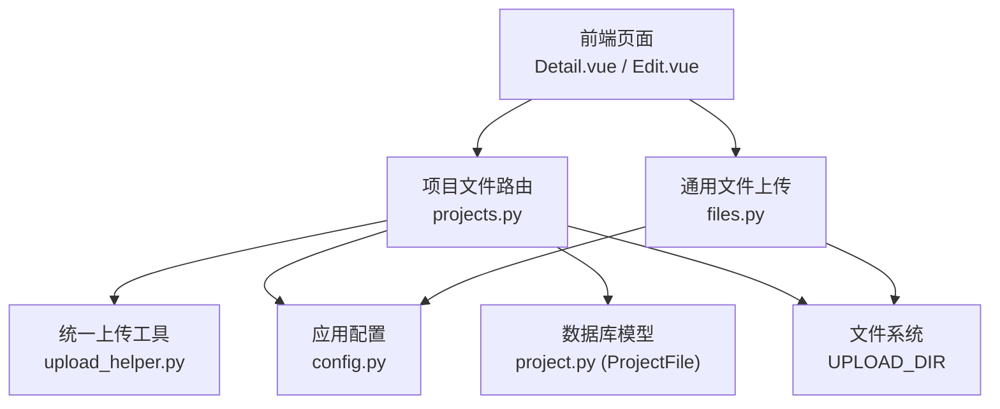
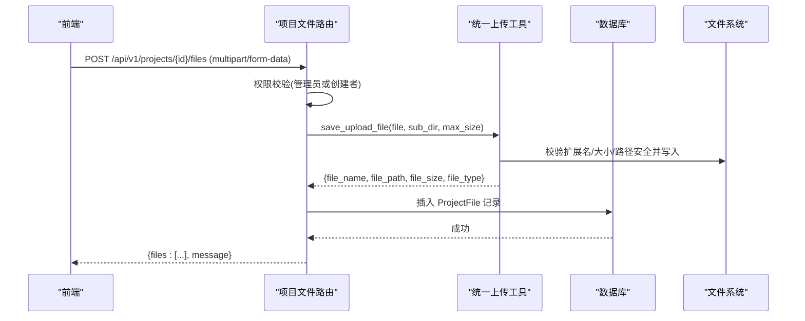
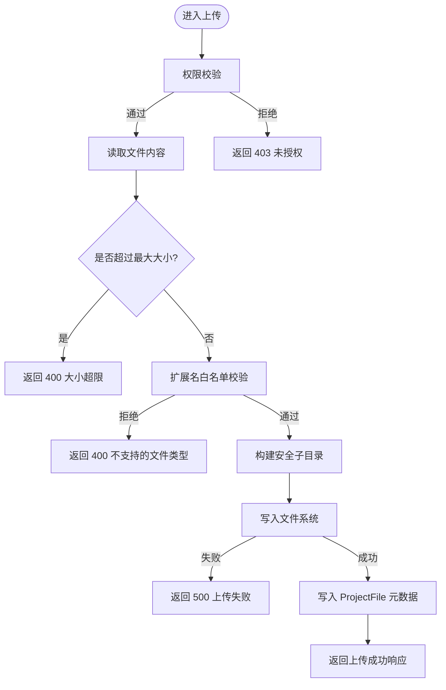
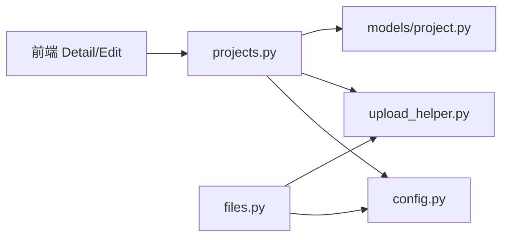

# 项目文件管理接口

<cite>
**本文引用的文件**
- [backend/app/api/v1/projects.py](file://backend/app/api/v1/projects.py)
- [backend/app/api/v1/files.py](file://backend/app/api/v1/files.py)
- [backend/app/utils/upload_helper.py](file://backend/app/utils/upload_helper.py)
- [backend/app/core/config.py](file://backend/app/core/config.py)
- [backend/app/models/project.py](file://backend/app/models/project.py)
- [backend/app/services/chunked_upload_service.py](file://backend/app/services/chunked_upload_service.py)
- [frontend/src/views/projects/Detail.vue](file://frontend/src/views/projects/Detail.vue)
- [frontend/src/views/projects/Edit.vue](file://frontend/src/views/projects/Edit.vue)
- [frontend/src/api/__tests__/projects.spec.ts](file://frontend/src/api/__tests__/projects.spec.ts)
</cite>

## 目录
1. [简介](#简介)
2. [项目结构](#项目结构)
3. [核心组件](#核心组件)
4. [架构总览](#架构总览)
5. [详细组件分析](#详细组件分析)
6. [依赖关系分析](#依赖关系分析)
7. [性能考虑](#性能考虑)
8. [故障排查指南](#故障排查指南)
9. [结论](#结论)
10. [附录：API 规范与调用示例](#附录api-规范与调用示例)

## 简介
本文件面向“项目附件”的上传、下载、删除等全生命周期管理，覆盖 HTTP 方法、URL 路径、请求参数、响应格式、错误处理、文件类型验证、大小限制、安全扫描、存储策略、访问控制与版本管理机制。文档同时给出前后端交互流程与可操作的 API 调用示例，帮助开发者快速集成与排错。

## 项目结构
后端采用 FastAPI 模块化路由组织，项目附件相关能力集中在项目模块路由中；通用文件上传提供独立路由；统一上传工具封装了校验、落盘与下载响应；配置集中管理文件大小、允许类型与存储根目录；数据模型定义项目附件表结构与索引。

图表来源
- [backend/app/api/v1/projects.py:1950-2096](file://backend/app/api/v1/projects.py#L1950-L2096)
- [backend/app/api/v1/files.py:39-126](file://backend/app/api/v1/files.py#L39-L126)
- [backend/app/utils/upload_helper.py:42-156](file://backend/app/utils/upload_helper.py#L42-L156)
- [backend/app/core/config.py:170-176](file://backend/app/core/config.py#L170-L176)
- [backend/app/models/project.py:278-319](file://backend/app/models/project.py#L278-L319)

章节来源
- [backend/app/api/v1/projects.py:1950-2096](file://backend/app/api/v1/projects.py#L1950-L2096)
- [backend/app/api/v1/files.py:39-126](file://backend/app/api/v1/files.py#L39-L126)
- [backend/app/utils/upload_helper.py:42-156](file://backend/app/utils/upload_helper.py#L42-L156)
- [backend/app/core/config.py:170-176](file://backend/app/core/config.py#L170-L176)
- [backend/app/models/project.py:278-319](file://backend/app/models/project.py#L278-L319)

## 核心组件
- 项目文件路由（上传/列表/删除/下载/预览）：负责权限校验、分类白名单、调用统一上传工具、持久化元数据到数据库并返回结构化结果。
- 通用文件上传路由：提供无业务绑定的文件上传，返回可通过静态资源访问的 URL。
- 统一上传工具：实现大小限制、扩展名白名单、路径安全、唯一文件名生成、写入失败保护、下载响应构造与文件删除。
- 配置中心：集中管理 UPLOAD_DIR、MAX_FILE_SIZE、ALLOWED_FILE_TYPES 等关键参数。
- 数据模型：ProjectFile 记录项目附件元信息（项目ID、分类、原始文件名、存储路径、大小、上传者、时间），并提供按项目与分类的索引。

章节来源
- [backend/app/api/v1/projects.py:1950-2096](file://backend/app/api/v1/projects.py#L1950-L2096)
- [backend/app/api/v1/files.py:39-126](file://backend/app/api/v1/files.py#L39-L126)
- [backend/app/utils/upload_helper.py:42-156](file://backend/app/utils/upload_helper.py#L42-L156)
- [backend/app/core/config.py:170-176](file://backend/app/core/config.py#L170-L176)
- [backend/app/models/project.py:278-319](file://backend/app/models/project.py#L278-L319)

## 架构总览
下图展示一次“项目附件上传”的端到端调用链：前端发起 multipart/form-data 请求，后端进行权限与参数校验，调用统一上传工具完成安全校验与落盘，写入数据库后返回成功响应。

图表来源
- [backend/app/api/v1/projects.py:1950-1989](file://backend/app/api/v1/projects.py#L1950-L1989)
- [backend/app/utils/upload_helper.py:42-111](file://backend/app/utils/upload_helper.py#L42-L111)
- [backend/app/models/project.py:278-319](file://backend/app/models/project.py#L278-L319)

## 详细组件分析

### 项目文件路由（上传/列表/删除/下载/预览）
- 上传
  - 方法/路径：POST /api/v1/projects/{project_id}/files
  - 请求体：multipart/form-data，字段 files（多文件）、category（分类，需为后端白名单值）
  - 权限：仅管理员或项目创建者可上传
  - 校验：文件大小上限（来自配置）、扩展名白名单（来自配置+默认集合）、路径安全、唯一文件名
  - 存储：子目录 projects/{project_id}/{category}
  - 响应：包含已上传文件的元信息数组与消息
- 列表
  - 方法/路径：GET /api/v1/projects/{project_id}/files?category=...
  - 权限：需登录且具备项目访问权限
  - 响应：files 数组与 grouped 分组（按 category）
- 删除
  - 方法/路径：DELETE /api/v1/projects/{project_id}/files/{file_id}
  - 权限：仅管理员或项目创建者可删除
  - 行为：删除磁盘文件（若存在）并移除数据库记录
  - 响应：成功消息
- 下载
  - 方法/路径：GET /api/v1/projects/{project_id}/files/{file_id}/download
  - 权限：需登录且具备项目访问权限
  - 响应：二进制流下载，Content-Type 由系统推断
- 在线预览
  - 方法/路径：GET /api/v1/projects/{project_id}/files/{file_id}/preview
  - 权限：需登录且具备项目访问权限
  - 响应：浏览器内联预览（图片/PDF 等）

图表来源
- [backend/app/api/v1/projects.py:1950-1989](file://backend/app/api/v1/projects.py#L1950-L1989)
- [backend/app/utils/upload_helper.py:42-111](file://backend/app/utils/upload_helper.py#L42-L111)

章节来源
- [backend/app/api/v1/projects.py:1950-2096](file://backend/app/api/v1/projects.py#L1950-L2096)

### 通用文件上传路由
- 方法/路径：POST /api/v1/files/upload
- 请求体：multipart/form-data，字段 file、可选 category（用于归类子目录）
- 校验：大小限制、扩展名白名单、图片头魔数校验（防改名绕过）
- 存储：uploads/generic[/category]，生成唯一文件名
- 响应：返回可直接通过 /uploads/... 访问的相对 URL 及文件元信息

章节来源
- [backend/app/api/v1/files.py:39-126](file://backend/app/api/v1/files.py#L39-L126)

### 统一上传工具
- 功能：统一实现大小限制、扩展名白名单、路径安全、唯一文件名、写入异常保护、下载响应构造、文件删除。
- 关键点：
  - 大小限制：使用配置项 MAX_FILE_SIZE 或传入参数
  - 类型校验：合并配置允许的扩展名与默认集合
  - 路径安全：基于绝对路径拼接，防止路径穿越
  - 唯一性：UUID + 原始文件名片段
  - 下载响应：自动推断 MIME 类型，支持 inline 模式

章节来源
- [backend/app/utils/upload_helper.py:42-175](file://backend/app/utils/upload_helper.py#L42-L175)

### 配置与存储策略
- 存储根目录：UPLOAD_DIR（默认 ./uploads）
- 单文件大小限制：MAX_FILE_SIZE（默认 50MB）
- 允许的文件类型：ALLOWED_FILE_TYPES（逗号分隔字符串）
- 分片上传服务：提供大文件分片上传与会话管理（临时目录 chunks，最终目录 files）

章节来源
- [backend/app/core/config.py:170-176](file://backend/app/core/config.py#L170-L176)
- [backend/app/services/chunked_upload_service.py:124-202](file://backend/app/services/chunked_upload_service.py#L124-L202)

### 数据模型与索引
- 表：project_files
- 关键字段：project_id、category、filename、filepath、file_size、uploaded_by、created_at
- 索引：project_id、category，提升按项目与分类查询效率
- 关系：与 Project 一对多，与 User 多对一（可空）

章节来源
- [backend/app/models/project.py:278-319](file://backend/app/models/project.py#L278-L319)

### 前端交互与调用
- 上传：Detail.vue 调用上传接口，成功后刷新列表；Edit.vue 加载项目文件并按分类分组显示。
- 下载：Detail.vue 通过获取下载 URL 并携带 Authorization 头下载 Blob，触发浏览器下载。
- 测试用例：验证上传使用 FormData、列表与删除接口路径正确。

章节来源
- [frontend/src/views/projects/Detail.vue:590-627](file://frontend/src/views/projects/Detail.vue#L590-L627)
- [frontend/src/views/projects/Edit.vue:1007-1024](file://frontend/src/views/projects/Edit.vue#L1007-L1024)
- [frontend/src/api/__tests__/projects.spec.ts:87-119](file://frontend/src/api/__tests__/projects.spec.ts#L87-L119)

## 依赖关系分析
- 路由层依赖：
  - 权限与用户上下文：get_current_user
  - 配置：settings（MAX_FILE_SIZE、UPLOAD_DIR、ALLOWED_FILE_TYPES）
  - 工具：save_upload_file、get_attachment_response
  - 模型：ProjectFile（ORM）
- 工具层依赖：
  - 配置：settings
  - 标准库：os、uuid、mimetypes
- 前端依赖：
  - 视图组件：Detail.vue、Edit.vue
  - 测试：projects.spec.ts 验证接口契约

图表来源
- [backend/app/api/v1/projects.py:1950-2096](file://backend/app/api/v1/projects.py#L1950-L2096)
- [backend/app/api/v1/files.py:39-126](file://backend/app/api/v1/files.py#L39-L126)
- [backend/app/utils/upload_helper.py:42-156](file://backend/app/utils/upload_helper.py#L42-L156)
- [backend/app/core/config.py:170-176](file://backend/app/core/config.py#L170-L176)
- [backend/app/models/project.py:278-319](file://backend/app/models/project.py#L278-L319)

章节来源
- [backend/app/api/v1/projects.py:1950-2096](file://backend/app/api/v1/projects.py#L1950-L2096)
- [backend/app/api/v1/files.py:39-126](file://backend/app/api/v1/files.py#L39-L126)
- [backend/app/utils/upload_helper.py:42-156](file://backend/app/utils/upload_helper.py#L42-L156)
- [backend/app/core/config.py:170-176](file://backend/app/core/config.py#L170-L176)
- [backend/app/models/project.py:278-319](file://backend/app/models/project.py#L278-L319)

## 性能考虑
- 上传前预检文件大小，避免无效传输。
- 使用唯一文件名与子目录隔离，降低冲突与查找成本。
- 数据库索引优化：按 project_id 与 category 建立索引，加速列表与筛选。
- 大文件建议采用分片上传服务，减少单次请求压力与超时风险。
- 下载与预览使用 FileResponse，直接流式输出，避免内存占用过高。

[本节为通用指导，不直接分析具体文件]

## 故障排查指南
- 400 错误
  - 文件大小超限：检查 settings.MAX_FILE_SIZE 与客户端上传大小
  - 不支持的文件类型：检查 ALLOWED_FILE_TYPES 与 upload_helper 默认集合
  - 图片头不匹配：确认文件内容与扩展名一致
- 403 错误
  - 权限不足：确认当前用户为管理员或项目创建者
- 404 错误
  - 文件或记录不存在：检查 file_id 与 project_id 对应关系，确认磁盘文件是否存在
- 500 错误
  - 文件写入失败：检查文件系统权限与磁盘空间
- 日志定位
  - 查看上传成功/失败的日志输出，关注 user、file、url、size 等信息

章节来源
- [backend/app/api/v1/files.py:54-83](file://backend/app/api/v1/files.py#L54-L83)
- [backend/app/utils/upload_helper.py:66-104](file://backend/app/utils/upload_helper.py#L66-L104)
- [backend/app/api/v1/projects.py:1950-2096](file://backend/app/api/v1/projects.py#L1950-L2096)

## 结论
本项目文件管理接口围绕“安全、可控、可追溯”的原则设计：通过统一的上传工具实现一致的校验与落盘逻辑；通过权限控制确保只有授权用户可操作项目附件；通过数据库模型与索引保障查询效率；通过配置集中管理大小与类型限制。结合前端调用与测试用例，形成了完整的附件管理闭环。对于超大文件场景，推荐启用分片上传服务以提升稳定性与用户体验。

[本节为总结性内容，不直接分析具体文件]

## 附录：API 规范与调用示例

### 接口清单
- 上传项目附件
  - 方法：POST
  - 路径：/api/v1/projects/{project_id}/files
  - 请求：multipart/form-data，字段 files（多文件）、category（白名单值）
  - 响应：{ files: [...], message }
- 列出项目附件
  - 方法：GET
  - 路径：/api/v1/projects/{project_id}/files?category=...
  - 响应：{ files: [...], grouped: {...} }
- 删除项目附件
  - 方法：DELETE
  - 路径：/api/v1/projects/{project_id}/files/{file_id}
  - 响应：{ message }
- 下载项目附件
  - 方法：GET
  - 路径：/api/v1/projects/{project_id}/files/{file_id}/download
  - 响应：二进制流
- 在线预览项目附件
  - 方法：GET
  - 路径：/api/v1/projects/{project_id}/files/{file_id}/preview
  - 响应：浏览器内联预览

章节来源
- [backend/app/api/v1/projects.py:1950-2096](file://backend/app/api/v1/projects.py#L1950-L2096)

### 通用文件上传
- 方法：POST
- 路径：/api/v1/files/upload
- 请求：multipart/form-data，字段 file、可选 category
- 响应：{ url, file_name, file_size, file_type }

章节来源
- [backend/app/api/v1/files.py:39-126](file://backend/app/api/v1/files.py#L39-L126)

### 调用示例（概念性）
- 上传
  - 前端构造 FormData，附加 files 与 category，调用 POST /api/v1/projects/{id}/files
  - 成功后刷新附件列表
- 下载
  - 前端获取下载 URL，携带 Authorization 头发起 GET，接收 Blob 并触发下载
- 删除
  - 前端调用 DELETE /api/v1/projects/{id}/files/{file_id}，成功后刷新列表

章节来源
- [frontend/src/views/projects/Detail.vue:590-627](file://frontend/src/views/projects/Detail.vue#L590-L627)
- [frontend/src/views/projects/Edit.vue:1007-1024](file://frontend/src/views/projects/Edit.vue#L1007-L1024)
- [frontend/src/api/__tests__/projects.spec.ts:87-119](file://frontend/src/api/__tests__/projects.spec.ts#L87-L119)

### 业务规则与安全要点
- 文件类型验证：扩展名白名单 + 图片头魔数校验（通用上传）
- 大小限制：全局配置 MAX_FILE_SIZE，上传前预检
- 安全扫描：路径安全（禁止穿越）、唯一文件名、写入异常保护
- 访问控制：仅管理员或项目创建者可上传/删除；下载/预览需具备项目访问权限
- 存储策略：项目附件按 projects/{project_id}/{category} 组织；通用附件按 uploads/generic[/category]
- 版本管理：当前实现以“新增附件”为主，未内置版本化机制；如需版本化，可在 ProjectFile 增加 version 字段并在上传时递增

章节来源
- [backend/app/api/v1/files.py:63-83](file://backend/app/api/v1/files.py#L63-L83)
- [backend/app/utils/upload_helper.py:66-111](file://backend/app/utils/upload_helper.py#L66-L111)
- [backend/app/core/config.py:170-176](file://backend/app/core/config.py#L170-L176)
- [backend/app/models/project.py:278-319](file://backend/app/models/project.py#L278-L319)