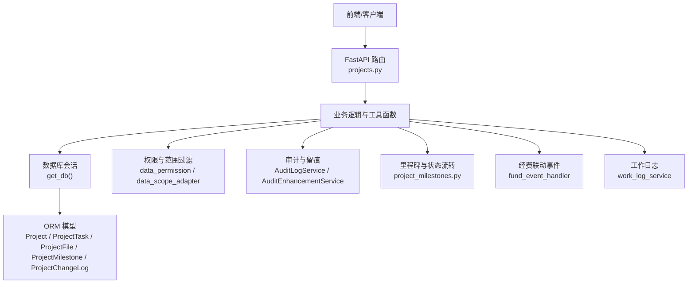
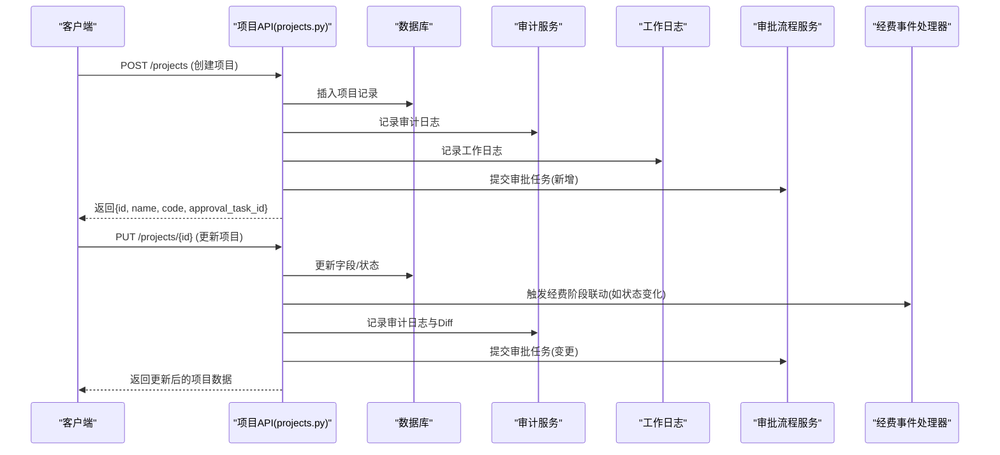
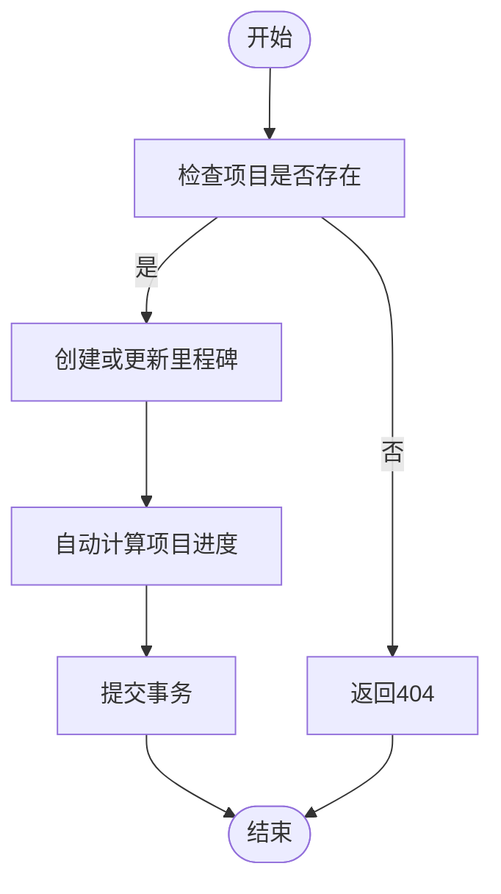
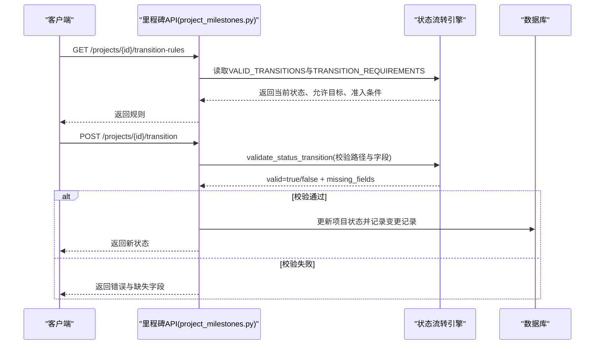
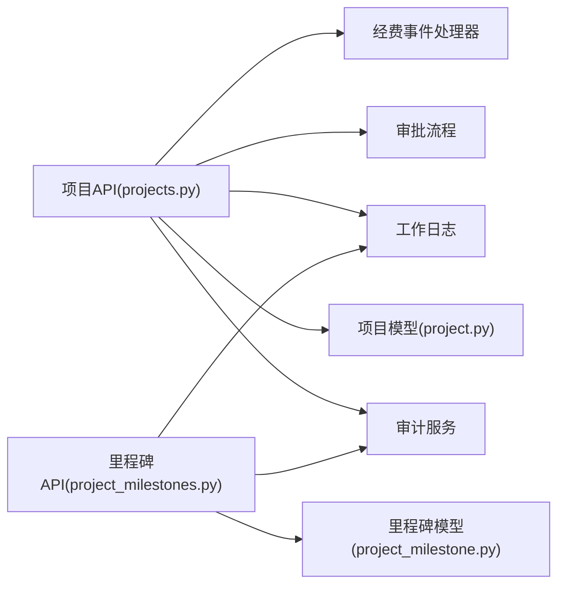

# 项目管理API

<cite>
**本文引用的文件**
- [backend/app/api/v1/projects.py](file://backend/app/api/v1/projects.py)
- [backend/app/api/v1/project_milestones.py](file://backend/app/api/v1/project_milestones.py)
- [backend/app/models/project.py](file://backend/app/models/project.py)
- [backend/app/models/project_milestone.py](file://backend/app/models/project_milestone.py)
- [backend/app/schemas/project.py](file://backend/app/schemas/project.py)
</cite>

## 目录
1. [简介](#简介)
2. [项目结构](#项目结构)
3. [核心组件](#核心组件)
4. [架构总览](#架构总览)
5. [详细组件分析](#详细组件分析)
6. [依赖关系分析](#依赖关系分析)
7. [性能考虑](#性能考虑)
8. [故障排查指南](#故障排查指南)
9. [结论](#结论)
10. [附录：接口清单与调用示例](#附录接口清单与调用示例)

## 简介
本文件面向“项目管理”模块的API，覆盖项目全生命周期管理（CRUD）、里程碑管理、进度跟踪、文档附件管理、状态流转与审批联动、数据验证与权限控制，以及与经费管理、乡村工作等模块的数据关联。文档以HTTP方法、URL路径、请求参数、响应格式和错误处理为主线，并提供端到端调用示例，帮助快速理解并集成该模块。

## 项目结构
后端采用FastAPI路由分层组织，项目相关能力集中在以下文件：
- 项目主API：CRUD、统计、导出、任务、经费健康度、审计留痕、审批联动
- 里程碑与状态流转API：里程碑增删改查、状态流转校验、变更记录、仪表板即将到期/逾期里程碑
- 数据模型：项目、项目任务、项目附件、里程碑、变更记录
- 数据校验：Pydantic Schema（部分用于其他模块或历史兼容）

图表来源
- [backend/app/api/v1/projects.py:1-55](file://backend/app/api/v1/projects.py#L1-L55)
- [backend/app/api/v1/project_milestones.py:1-28](file://backend/app/api/v1/project_milestones.py#L1-L28)
- [backend/app/models/project.py:47-175](file://backend/app/models/project.py#L47-L175)
- [backend/app/models/project_milestone.py:12-105](file://backend/app/models/project_milestone.py#L12-L105)

章节来源
- [backend/app/api/v1/projects.py:1-120](file://backend/app/api/v1/projects.py#L1-L120)
- [backend/app/api/v1/project_milestones.py:1-120](file://backend/app/api/v1/project_milestones.py#L1-L120)
- [backend/app/models/project.py:47-175](file://backend/app/models/project.py#L47-L175)
- [backend/app/models/project_milestone.py:12-105](file://backend/app/models/project_milestone.py#L12-L105)

## 核心组件
- 项目模型与枚举
  - 项目状态：草稿、待审批、已批准、进行中、已完成、已取消
  - 项目类型：基础设施、教育、医疗、农业、工业、其他
  - 项目字段涵盖预算、实际花费、投资额、起止日期、进度、负责人、联系方式、资金来源、拨款/收款账户信息、延期标记与原因、预期效益、成果、标签、备注等
  - 软删除：is_active、deleted_at
  - 关联：帮扶村、负责单位、创建人、任务、经费
- 里程碑与变更记录
  - 里程碑：名称、描述、计划完成日期、实际完成日期、负责人、状态、排序
  - 变更记录：变更类型、字段名、旧值、新值、原因、操作人、时间
  - 状态流转规则与准入条件定义，以及根据里程碑完成情况自动计算项目进度
- API层
  - 项目CRUD、列表分页、详情、统计、导出Excel/CSV
  - 里程碑CRUD、状态流转、变更记录查询、即将到期与逾期里程碑
  - 项目任务CRUD
  - 项目经费健康度指标（预算执行率、支付偏差率、健康分）
  - 审计日志与Diff留痕、工作日志记录
  - 审批流程联动：新增/修改/删除项目自动提交审批任务；审批通过后回写项目状态

章节来源
- [backend/app/models/project.py:25-175](file://backend/app/models/project.py#L25-L175)
- [backend/app/models/project_milestone.py:12-105](file://backend/app/models/project_milestone.py#L12-L105)
- [backend/app/models/project_milestone.py:107-187](file://backend/app/models/project_milestone.py#L107-L187)
- [backend/app/api/v1/projects.py:513-753](file://backend/app/api/v1/projects.py#L513-L753)
- [backend/app/api/v1/project_milestones.py:105-213](file://backend/app/api/v1/project_milestones.py#L105-L213)
- [backend/app/api/v1/project_milestones.py:218-336](file://backend/app/api/v1/project_milestones.py#L218-L336)

## 架构总览
项目API通过FastAPI路由暴露RESTful接口，内部使用SQLAlchemy ORM访问数据库，结合权限与数据范围过滤确保多组织隔离。关键流程包括：
- 创建项目：自动生成编号、写入项目、审计留痕、工作日志、触发审批任务
- 更新项目：字段转换与校验、状态变更联动经费阶段、审计与Diff留痕、触发审批任务
- 删除项目：软删除、审计留痕、触发审批任务
- 里程碑管理：创建/更新/删除里程碑，自动计算项目进度
- 状态流转：基于合法流转路径与准入条件校验，记录变更记录
- 统计与导出：按状态聚合统计、导出Excel/CSV
- 数据关联：与帮扶村、负责单位、经费、任务、工作日志、审批流程等模块联动

图表来源
- [backend/app/api/v1/projects.py:790-920](file://backend/app/api/v1/projects.py#L790-L920)
- [backend/app/api/v1/projects.py:1030-1088](file://backend/app/api/v1/projects.py#L1030-L1088)
- [backend/app/api/v1/projects.py:1091-1181](file://backend/app/api/v1/projects.py#L1091-L1181)

## 详细组件分析

### 项目CRUD与列表/详情/统计/导出
- 列表获取
  - 方法：GET
  - 路径：/projects
  - 查询参数：page、page_size、keyword、project_type、status、village_id、region、year、sort_by、sort_order、include_cancelled、include_deleted
  - 功能：分页查询项目列表，支持关键词、类型、状态、帮扶村、地区、年份筛选；默认排除已取消；支持管理员包含已软删；应用数据范围过滤；批量预加载关联数据；批量计算经费健康度指标
  - 响应：统一列表封装，含items与total
- 详情获取
  - 方法：GET
  - 路径：/projects/{project_id}
  - 功能：获取项目详情，包含关联经费数量、任务数量；权限校验；管理员可见性元数据
  - 响应：统一成功封装，data为项目完整字段
- 创建项目
  - 方法：POST
  - 路径：/projects
  - 请求体：项目名称、编号（可选）、类型、帮扶村ID、描述、预算、进度、起止日期、负责单位/人、联系方式、紧急程度、合同编号、资金负责人、资金使用计划、资金来源、拨款/收款账户信息等
  - 功能：编号唯一性校验、日期格式与顺序校验、预算非负、写入项目、审计日志、Diff留痕、工作日志、自动提交审批任务
  - 响应：返回id、name、code、approval_task_id
- 更新项目
  - 方法：PUT
  - 路径：/projects/{project_id}
  - 请求体：可更新字段集合（名称、类型、描述、预算、进度、状态、起止日期、负责人、联系方式、紧急程度、合同编号、资金负责人、资金使用计划、资金来源、拨款/收款账户信息、延期标记与原因、预期效益、成果、标签、备注）
  - 功能：日期与预算转换、日期交叉校验、状态变更联动经费阶段、审计与Diff留痕、工作日志、自动提交审批任务
  - 响应：返回更新后的项目数据及可能的审批任务ID
- 删除项目
  - 方法：DELETE
  - 路径：/projects/{project_id}
  - 功能：仅管理员或创建者可删除；软删除（状态置为已取消、is_active=false、记录删除时间）；审计日志与Diff留痕；工作日志；自动提交审批任务
  - 响应：返回id与approval_task_id
- 统计概览
  - 方法：GET
  - 路径：/projects/stats
  - 功能：按状态统计项目数量与预算汇总、总投资额汇总；应用数据范围过滤
  - 响应：统一成功封装，data为统计对象
- 导出
  - 方法：GET
  - 路径：/projects/export
  - 查询参数：keyword、project_type、status
  - 功能：导出项目列表为Excel（优先）或CSV兜底；限制最大条数防止内存溢出
  - 响应：文件流下载

章节来源
- [backend/app/api/v1/projects.py:513-753](file://backend/app/api/v1/projects.py#L513-L753)
- [backend/app/api/v1/projects.py:756-787](file://backend/app/api/v1/projects.py#L756-L787)
- [backend/app/api/v1/projects.py:790-920](file://backend/app/api/v1/projects.py#L790-L920)
- [backend/app/api/v1/projects.py:1030-1088](file://backend/app/api/v1/projects.py#L1030-L1088)
- [backend/app/api/v1/projects.py:1091-1181](file://backend/app/api/v1/projects.py#L1091-L1181)
- [backend/app/api/v1/projects.py:555-651](file://backend/app/api/v1/projects.py#L555-L651)

### 里程碑管理与进度跟踪
- 里程碑列表
  - 方法：GET
  - 路径：/projects/{project_id}/milestones
  - 功能：按排序与计划日期返回里程碑列表
- 创建里程碑
  - 方法：POST
  - 路径：/projects/{project_id}/milestones
  - 请求体：名称、描述、计划完成日期、负责人、排序序号
  - 功能：校验项目存在、写入里程碑、记录工作日志、自动更新项目进度
- 更新里程碑
  - 方法：PUT
  - 路径：/projects/{project_id}/milestones/{milestone_id}
  - 请求体：可更新字段（名称、描述、计划/实际完成日期、负责人、状态、排序序号）
  - 功能：若标记完成且未设置实际日期则自动填充；记录工作日志；自动更新项目进度
- 删除里程碑
  - 方法：DELETE
  - 路径：/projects/{project_id}/milestones/{milestone_id}
  - 功能：校验存在、删除、记录工作日志、自动更新项目进度
- 即将到期里程碑（仪表板）
  - 方法：GET
  - 路径：/projects/dashboard/upcoming-milestones
  - 查询参数：days（未来N天内）
  - 功能：查询当前用户数据范围内即将到期的里程碑，附带剩余天数与是否逾期
- 逾期里程碑（仪表板）
  - 方法：GET
  - 路径：/projects/dashboard/overdue-milestones
  - 功能：查询当前用户数据范围内已逾期的里程碑，附带逾期天数
- 自动进度计算
  - 逻辑：根据里程碑完成比例计算项目进度百分比，并在里程碑更新/删除时自动回写项目progress字段

图表来源
- [backend/app/api/v1/project_milestones.py:105-213](file://backend/app/api/v1/project_milestones.py#L105-L213)
- [backend/app/api/v1/project_milestones.py:458-465](file://backend/app/api/v1/project_milestones.py#L458-L465)
- [backend/app/models/project_milestone.py:181-187](file://backend/app/models/project_milestone.py#L181-L187)

章节来源
- [backend/app/api/v1/project_milestones.py:105-213](file://backend/app/api/v1/project_milestones.py#L105-L213)
- [backend/app/api/v1/project_milestones.py:342-452](file://backend/app/api/v1/project_milestones.py#L342-L452)
- [backend/app/models/project_milestone.py:181-187](file://backend/app/models/project_milestone.py#L181-L187)

### 状态流转与审批流程
- 获取流转规则
  - 方法：GET
  - 路径：/projects/{project_id}/transition-rules
  - 功能：返回当前状态、允许的目标状态、各目标状态的准入条件
- 执行状态流转
  - 方法：POST
  - 路径：/projects/{project_id}/transition
  - 请求体：new_status、reason、actual_start_date、actual_end_date、achievements
  - 功能：将请求中的必要字段写入项目以满足准入条件；校验流转合法性；记录变更记录；提交事务
- 变更记录查询
  - 方法：GET
  - 路径：/projects/{project_id}/change-logs
  - 查询参数：change_type、page、page_size
  - 功能：按项目维度查询变更记录，支持类型过滤与分页；应用数据范围过滤
- 审批联动
  - 新增项目：自动提交审批任务，审批通过后回写项目状态为已批准
  - 更新项目：自动提交审批任务（含变更对比）
  - 删除项目：自动提交审批任务（含删除前快照）

图表来源
- [backend/app/api/v1/project_milestones.py:218-336](file://backend/app/api/v1/project_milestones.py#L218-L336)
- [backend/app/models/project_milestone.py:107-179](file://backend/app/models/project_milestone.py#L107-L179)

章节来源
- [backend/app/api/v1/project_milestones.py:218-336](file://backend/app/api/v1/project_milestones.py#L218-L336)
- [backend/app/models/project_milestone.py:107-179](file://backend/app/models/project_milestone.py#L107-L179)

### 项目任务管理
- 创建任务
  - 方法：POST
  - 路径：/projects/{project_id}/tasks
  - 请求体：名称、描述、状态、优先级、负责人、截止日期
  - 功能：日期格式校验、写入任务
- 更新任务
  - 方法：PUT
  - 路径：/projects/{project_id}/tasks/{task_id}
  - 请求体：可更新字段（名称、描述、状态、优先级、负责人、截止日期）
- 删除任务
  - 方法：DELETE
  - 路径：/projects/{project_id}/tasks/{task_id}
- 任务列表
  - 方法：GET
  - 路径：/projects/{project_id}/tasks
  - 功能：按项目维度列出任务

章节来源
- [backend/app/api/v1/projects.py:277-307](file://backend/app/api/v1/projects.py#L277-L307)
- [backend/app/models/project.py:239-276](file://backend/app/models/project.py#L239-L276)

### 文档附件管理
- 模型说明
  - 项目附件表：按阶段分类存储（research/implementation/acceptance/photo），记录原始文件名、存储路径、文件大小、上传人、上传时间
- 典型操作（概念）
  - 上传附件：POST /projects/{project_id}/files（需实现上传与安全校验）
  - 列出附件：GET /projects/{project_id}/files?category=...
  - 下载附件：GET /projects/{project_id}/files/{file_id}
  - 删除附件：DELETE /projects/{project_id}/files/{file_id}
- 注意：当前仓库中未见具体附件API实现，但模型已就绪，可按上述约定扩展

章节来源
- [backend/app/models/project.py:278-320](file://backend/app/models/project.py#L278-L320)

### 数据验证与权限控制
- 数据验证
  - 日期格式：YYYY-MM-DD
  - 日期顺序：结束日期不早于开始日期
  - 预算与金额：非负
  - 状态枚举：仅限模型定义的状态值
  - 必填字段：创建/更新/流转时的关键字段校验
- 权限控制
  - 数据范围过滤：统一通过data_scope_adapter与filter_by_data_scope应用组织级数据隔离
  - 记录访问校验：跨组织访问时拒绝（403）
  - 修改权限：仅管理员或项目创建者可修改/删除项目
  - 软删除可见性：管理员可通过include_deleted查看已软删记录

章节来源
- [backend/app/api/v1/projects.py:118-146](file://backend/app/api/v1/projects.py#L118-L146)
- [backend/app/api/v1/projects.py:657-753](file://backend/app/api/v1/projects.py#L657-L753)
- [backend/app/api/v1/project_milestones.py:312-336](file://backend/app/api/v1/project_milestones.py#L312-L336)

### 与经费管理、乡村工作等模块的关联
- 经费管理
  - 项目经费健康度：预算执行率、支付偏差率、健康分在列表与详情中返回
  - 状态变更联动：项目状态变化触发经费阶段事件（如立项、拨付、结算等）
  - 关联查询：项目与经费一对多关系，列表批量计算避免N+1
- 乡村工作
  - 工作日志：项目创建/更新/删除、里程碑操作均记录工作日志，便于乡村工作台账
  - 帮扶村关联：项目关联supported_villages，支持按地区筛选
- 审批流程
  - 新增/修改/删除项目自动提交审批任务；审批通过后回写项目状态（pending→approved）

章节来源
- [backend/app/api/v1/projects.py:312-404](file://backend/app/api/v1/projects.py#L312-L404)
- [backend/app/api/v1/projects.py:961-967](file://backend/app/api/v1/projects.py#L961-L967)
- [backend/app/api/v1/projects.py:100-112](file://backend/app/api/v1/projects.py#L100-L112)
- [backend/app/models/project.py:167-175](file://backend/app/models/project.py#L167-L175)

## 依赖关系分析
- 路由与模型
  - projects.py依赖Project、ProjectTask、ProjectFile、Fund等模型
  - project_milestones.py依赖ProjectMilestone、ProjectChangeLog及状态流转引擎
- 外部服务
  - 审计服务：记录操作日志与Diff留痕
  - 工作日志服务：记录工作台账
  - 审批流程服务：提交审批任务与状态回写
  - 经费事件处理器：状态变更联动经费阶段
- 数据范围与权限
  - 统一数据范围过滤与记录访问校验，保障多组织隔离

图表来源
- [backend/app/api/v1/projects.py:1-55](file://backend/app/api/v1/projects.py#L1-L55)
- [backend/app/api/v1/project_milestones.py:1-28](file://backend/app/api/v1/project_milestones.py#L1-L28)
- [backend/app/models/project.py:47-175](file://backend/app/models/project.py#L47-L175)
- [backend/app/models/project_milestone.py:12-105](file://backend/app/models/project_milestone.py#L12-L105)

章节来源
- [backend/app/api/v1/projects.py:1-120](file://backend/app/api/v1/projects.py#L1-L120)
- [backend/app/api/v1/project_milestones.py:1-120](file://backend/app/api/v1/project_milestones.py#L1-L120)

## 性能考虑
- N+1优化：列表接口使用selectinload预加载关联数据；批量计算经费健康度指标
- 索引优化：项目表与里程碑表建立多列索引，提升常见查询性能
- 导出限制：导出上限10000条，防止内存溢出
- 缓存失效：项目变更时尝试失效仪表盘缓存，保证数据一致性

章节来源
- [backend/app/api/v1/projects.py:680-731](file://backend/app/api/v1/projects.py#L680-L731)
- [backend/app/models/project.py:52-68](file://backend/app/models/project.py#L52-L68)
- [backend/app/models/project_milestone.py:17-21](file://backend/app/models/project_milestone.py#L17-L21)
- [backend/app/api/v1/projects.py:555-651](file://backend/app/api/v1/projects.py#L555-L651)

## 故障排查指南
- 常见错误
  - 404：项目或里程碑不存在
  - 403：无权访问（跨组织或未授权）
  - 400：日期格式错误或顺序不合法、状态枚举无效、重复编号
  - 500：经费阶段联动异常（内部错误，仅日志保留细节）
- 排查建议
  - 检查请求体字段是否符合Schema与业务约束
  - 确认用户角色与数据范围权限
  - 查看审计日志与工作日志定位问题
  - 关注经费事件处理器的异常日志

章节来源
- [backend/app/api/v1/projects.py:1054-1062](file://backend/app/api/v1/projects.py#L1054-L1062)
- [backend/app/api/v1/project_milestones.py:129-131](file://backend/app/api/v1/project_milestones.py#L129-L131)
- [backend/app/api/v1/project_milestones.py:159-161](file://backend/app/api/v1/project_milestones.py#L159-L161)

## 结论
项目管理API提供了完整的项目全生命周期管理能力，涵盖CRUD、里程碑、进度、附件、状态流转与审批联动，并与经费管理、乡村工作等模块深度集成。通过严格的数据验证、权限控制与性能优化，保障了系统的稳定性与可扩展性。建议在实际使用中遵循接口规范与最佳实践，充分利用统计与导出能力，并结合审计与工作日志进行运维与合规管理。

## 附录：接口清单与调用示例

### 项目接口
- 列表：GET /projects?page=1&page_size=20&keyword=&project_type=&status=&village_id=&region=&year=&sort_by=&sort_order=desc&include_cancelled=false&include_deleted=false
- 详情：GET /projects/{project_id}
- 创建：POST /projects {name, code?, type?, village_id?, description?, budget?, progress?, start_date, end_date?, responsible_unit?, responsible_person?, contact_phone?, urgency_level?, contract_number?, fund_manager?, fund_usage_plan?, fund_source?, payer_*, payee_*?, is_delayed?, delay_reason?, expected_benefits?, achievements?, tags?, remarks?}
- 更新：PUT /projects/{project_id} {字段集合}
- 删除：DELETE /projects/{project_id}
- 统计：GET /projects/stats
- 导出：GET /projects/export?keyword=&project_type=&status=

### 里程碑接口
- 列表：GET /projects/{project_id}/milestones
- 创建：POST /projects/{project_id}/milestones {name, description?, planned_date, responsible_person?, sort_order?}
- 更新：PUT /projects/{project_id}/milestones/{milestone_id} {字段集合}
- 删除：DELETE /projects/{project_id}/milestones/{milestone_id}
- 即将到期：GET /projects/dashboard/upcoming-milestones?days=7
- 逾期：GET /projects/dashboard/overdue-milestones

### 状态流转接口
- 规则：GET /projects/{project_id}/transition-rules
- 执行：POST /projects/{project_id}/transition {new_status, reason?, actual_start_date?, actual_end_date?, achievements?}
- 变更记录：GET /projects/{project_id}/change-logs?change_type=&page=1&page_size=50

### 任务接口
- 列表：GET /projects/{project_id}/tasks
- 创建：POST /projects/{project_id}/tasks {name, description?, status?, priority?, assignee?, due_date?}
- 更新：PUT /projects/{project_id}/tasks/{task_id} {字段集合}
- 删除：DELETE /projects/{project_id}/tasks/{task_id}

### 附件接口（概念）
- 上传：POST /projects/{project_id}/files
- 列表：GET /projects/{project_id}/files?category=research|implementation|acceptance|photo
- 下载：GET /projects/{project_id}/files/{file_id}
- 删除：DELETE /projects/{project_id}/files/{file_id}

章节来源
- [backend/app/api/v1/projects.py:513-753](file://backend/app/api/v1/projects.py#L513-L753)
- [backend/app/api/v1/projects.py:756-787](file://backend/app/api/v1/projects.py#L756-L787)
- [backend/app/api/v1/projects.py:790-920](file://backend/app/api/v1/projects.py#L790-L920)
- [backend/app/api/v1/projects.py:1030-1088](file://backend/app/api/v1/projects.py#L1030-L1088)
- [backend/app/api/v1/projects.py:1091-1181](file://backend/app/api/v1/projects.py#L1091-L1181)
- [backend/app/api/v1/project_milestones.py:105-213](file://backend/app/api/v1/project_milestones.py#L105-L213)
- [backend/app/api/v1/project_milestones.py:218-336](file://backend/app/api/v1/project_milestones.py#L218-L336)
- [backend/app/models/project.py:278-320](file://backend/app/models/project.py#L278-L320)