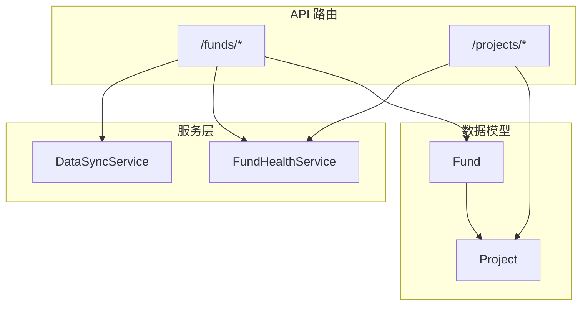
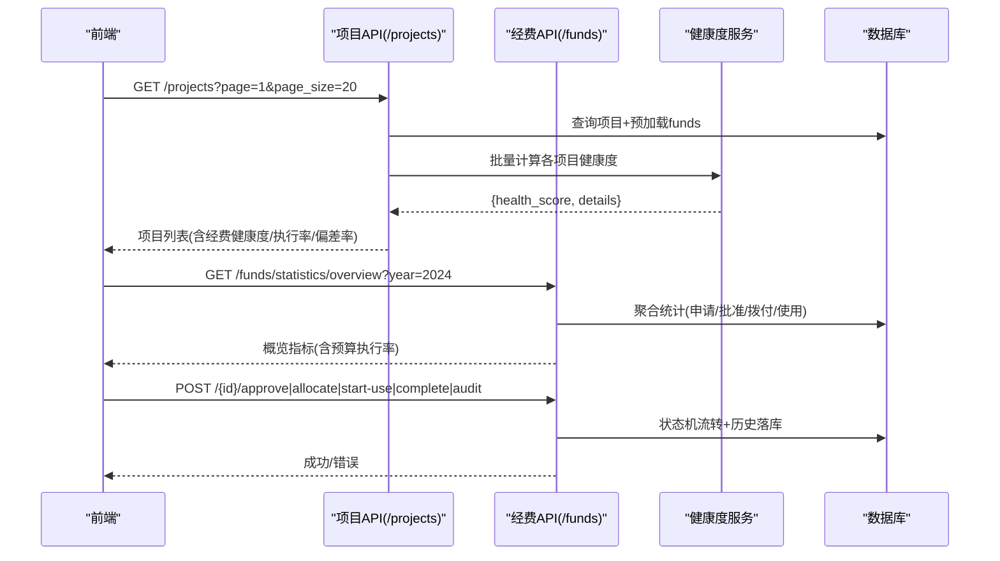
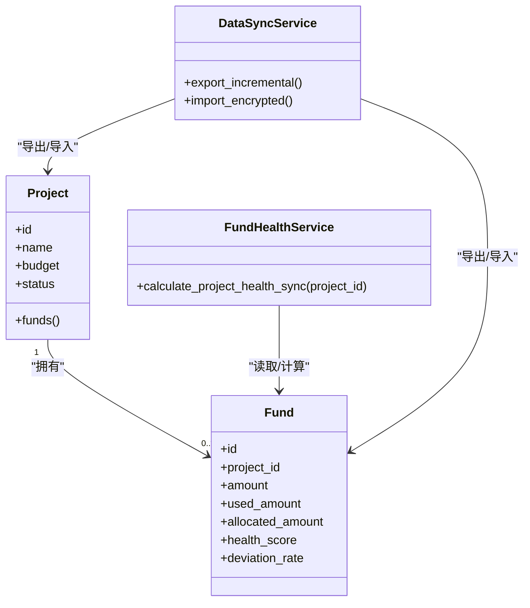
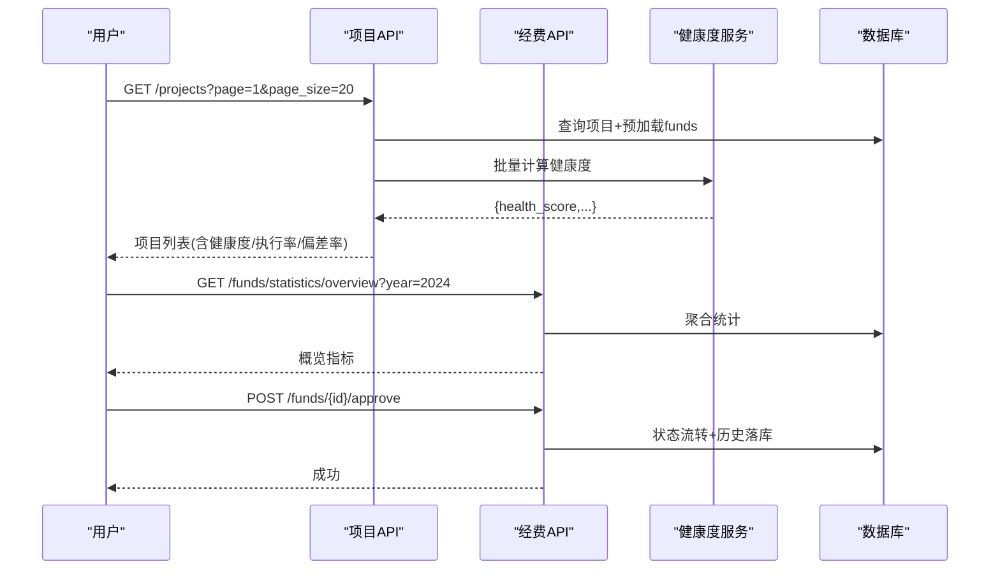

# 项目经费关联接口

<cite>
**本文引用的文件**
- [backend/app/api/v1/funds.py](file://backend/app/api/v1/funds.py)
- [backend/app/api/v1/projects.py](file://backend/app/api/v1/projects.py)
- [backend/app/models/fund.py](file://backend/app/models/fund.py)
- [backend/app/models/project.py](file://backend/app/models/project.py)
- [backend/app/schemas/fund.py](file://backend/app/schemas/fund.py)
- [backend/app/services/fund_health_service.py](file://backend/app/services/fund_health_service.py)
- [backend/app/services/data_sync_service.py](file://backend/app/services/data_sync_service.py)
</cite>

## 目录
1. [简介](#简介)
2. [项目结构](#项目结构)
3. [核心组件](#核心组件)
4. [架构总览](#架构总览)
5. [详细组件分析](#详细组件分析)
6. [依赖关系分析](#依赖关系分析)
7. [性能考虑](#性能考虑)
8. [故障排查指南](#故障排查指南)
9. [结论](#结论)
10. [附录：API 契约与调用示例](#附录api-契约与调用示例)

## 简介
本文件面向“项目-经费”关联场景，系统化说明以下能力：
- 项目与经费的数据关联操作（创建、查询、统计、审批流转）
- 经费健康度计算、预算执行率统计、支付偏差率分析等指标的计算与返回
- 各接口的 HTTP 方法、URL 路径、请求参数、响应格式与错误处理
- 完整的项目经费监控流程示例
- 与经费管理模块的数据同步机制与一致性保证

## 项目结构
本项目采用 FastAPI 路由 + SQLAlchemy ORM + Pydantic Schema 的分层架构。与“项目-经费”关联相关的关键位置如下：
- API 路由层：funds.py、projects.py
- 数据模型层：fund.py、project.py
- 校验与序列化：schemas/fund.py
- 业务服务层：fund_health_service.py（健康度）、data_sync_service.py（数据同步）

图表来源
- [backend/app/api/v1/funds.py:360-445](file://backend/app/api/v1/funds.py#L360-L445)
- [backend/app/api/v1/projects.py:657-753](file://backend/app/api/v1/projects.py#L657-L753)
- [backend/app/models/fund.py:61-167](file://backend/app/models/fund.py#L61-L167)
- [backend/app/models/project.py:47-175](file://backend/app/models/project.py#L47-L175)

章节来源
- [backend/app/api/v1/funds.py:360-445](file://backend/app/api/v1/funds.py#L360-L445)
- [backend/app/api/v1/projects.py:657-753](file://backend/app/api/v1/projects.py#L657-L753)
- [backend/app/models/fund.py:61-167](file://backend/app/models/fund.py#L61-L167)
- [backend/app/models/project.py:47-175](file://backend/app/models/project.py#L47-L175)

## 核心组件
- 经费模型 Fund：包含金额、状态、时间聚合冗余字段（year/year_month/year_quarter）、健康度与健康标记、偏差率等，并建立与 Project/Village/School/Organization 的关联。
- 项目模型 Project：包含预算、进度、资金信息、软删标记等，并通过 funds 关系与经费关联。
- 经费 API：提供 CRUD、统计概览、多维度统计、审批流转、附件管理等。
- 项目 API：提供项目列表/详情导出、并在列表项中批量注入“经费健康度、预算执行率、支付偏差率”。
- 健康度服务：按项目维度聚合 Fund 记录，结合异常、凭证完整性、拨付及时性等计算健康评分。
- 数据同步服务：提供加密/非加密数据包导入导出，支持白名单表（含 funds、projects），保障跨系统数据一致性与可追溯性。

章节来源
- [backend/app/models/fund.py:61-167](file://backend/app/models/fund.py#L61-L167)
- [backend/app/models/project.py:47-175](file://backend/app/models/project.py#L47-L175)
- [backend/app/api/v1/funds.py:617-760](file://backend/app/api/v1/funds.py#L617-L760)
- [backend/app/api/v1/projects.py:312-404](file://backend/app/api/v1/projects.py#L312-L404)
- [backend/app/services/fund_health_service.py:142-193](file://backend/app/services/fund_health_service.py#L142-L193)
- [backend/app/services/data_sync_service.py:27-44](file://backend/app/services/data_sync_service.py#L27-L44)

## 架构总览
下图展示“项目-经费”关联在系统中的关键交互：前端通过项目列表接口获取经费健康指标；经费侧提供统计与审批接口；健康度服务按项目聚合计算；数据同步服务负责跨端数据交换。

图表来源
- [backend/app/api/v1/projects.py:657-753](file://backend/app/api/v1/projects.py#L657-L753)
- [backend/app/api/v1/funds.py:617-760](file://backend/app/api/v1/funds.py#L617-L760)
- [backend/app/api/v1/funds.py:863-962](file://backend/app/api/v1/funds.py#L863-L962)
- [backend/app/services/fund_health_service.py:142-193](file://backend/app/services/fund_health_service.py#L142-L193)

## 详细组件分析

### 项目-经费关联：列表与详情
- 项目列表
  - 方法/路径：GET /projects
  - 关键参数：page、page_size、keyword、project_type、status、village_id、region、year、sort_by、sort_order、include_cancelled、include_deleted
  - 行为：分页查询项目，预加载 funds/village/organization；对每个项目批量注入 fund_health_score、budget_execution_rate、payment_deviation_rate
  - 响应：统一信封 ok_list，包含 items、total、page、page_size
- 项目详情
  - 方法/路径：GET /projects/{project_id}
  - 行为：权限校验后返回项目详情，附带 funds_count、tasks_count、viewableBecause

章节来源
- [backend/app/api/v1/projects.py:657-753](file://backend/app/api/v1/projects.py#L657-L753)
- [backend/app/api/v1/projects.py:756-787](file://backend/app/api/v1/projects.py#L756-L787)

### 经费基础 CRUD 与审批流转
- 经费列表
  - 方法/路径：GET /funds
  - 关键参数：page、page_size、keyword、status(alias)、fund_type、fund_source、project_id、village_id、school_id、cursor、pagination、include_deleted
  - 行为：支持 offset/keyset 分页，应用数据权限过滤，软删默认隐藏
- 经费详情
  - 方法/路径：GET /funds/{fund_id}
  - 行为：区分不存在与无权访问，返回 viewableBecause
- 创建/申请
  - 方法/路径：POST /funds、POST /funds/apply
  - 行为：创建经费并自动提交审批任务（若工作流未配置则创建默认流程）
- 更新/删除
  - 方法/路径：PUT /funds/{fund_id}、DELETE /funds/{fund_id}
  - 行为：字段变更留痕；仅 pending 可软删
- 审批流转
  - 方法/路径：POST /funds/{fund_id}/approve|reject|allocate|start-use|complete|audit
  - 行为：严格状态机校验，必填附件校验，写入状态历史与操作日志，必要时联动里程碑完成状态

章节来源
- [backend/app/api/v1/funds.py:360-445](file://backend/app/api/v1/funds.py#L360-L445)
- [backend/app/api/v1/funds.py:448-480](file://backend/app/api/v1/funds.py#L448-L480)
- [backend/app/api/v1/funds.py:483-531](file://backend/app/api/v1/funds.py#L483-L531)
- [backend/app/api/v1/funds.py:534-609](file://backend/app/api/v1/funds.py#L534-L609)
- [backend/app/api/v1/funds.py:863-962](file://backend/app/api/v1/funds.py#L863-L962)

### 经费统计与指标
- 概览统计
  - 方法/路径：GET /funds/statistics/overview?year={int}
  - 行为：单次聚合查询，返回总数、金额、状态计数、已用/已拨、预算总额/执行额/剩余/执行率
- 多维度统计
  - 方法/路径：GET /funds/statistics/multi-dimension?group_by={period/type/source/status}&period_type={monthly/quarterly/yearly}&start_date&end_date
  - 行为：基于 year/year_month/year_quarter 冗余字段分组，避免全表扫描
- 帮扶村/学校汇总
  - 方法/路径：GET /funds/supported-village/statistics/*、GET /funds/village/{village_id}/summary、GET /funds/school/{school_id}/summary
  - 行为：按年度或累计统计计划/批准/拨付/使用金额及剩余

章节来源
- [backend/app/api/v1/funds.py:617-760](file://backend/app/api/v1/funds.py#L617-L760)
- [backend/app/api/v1/funds.py:970-1143](file://backend/app/api/v1/funds.py#L970-L1143)

### 经费健康度计算
- 单项目健康度
  - 入口：calculate_project_health_sync(db, project_id)
  - 维度：预算执行、支付及时性、凭证完整性、异常数量、合同履约、决算阶段完成度
  - 输出：health_score、status、details（含权重与子分数）
- 列表注入
  - 项目列表通过 _batch_get_fund_health_fields 批量计算并注入 fund_health_score、budget_execution_rate、payment_deviation_rate

章节来源
- [backend/app/services/fund_health_service.py:142-193](file://backend/app/services/fund_health_service.py#L142-L193)
- [backend/app/api/v1/projects.py:312-404](file://backend/app/api/v1/projects.py#L312-L404)

### 数据同步与一致性
- 同步范围：允许表包含 funds、projects 等核心业务表
- 导出/导入：支持明文与加密（.rrs）两种模式，记录同步日志、冲突策略（skip/overwrite/merge/manual）
- 一致性保障：
  - 白名单表名与列名校验，防止注入
  - 事务边界由 safe_commit 控制，失败回滚
  - 导入过程逐表记录成功/失败/冲突明细，便于审计与修复

章节来源
- [backend/app/services/data_sync_service.py:27-44](file://backend/app/services/data_sync_service.py#L27-L44)
- [backend/app/services/data_sync_service.py:128-233](file://backend/app/services/data_sync_service.py#L128-L233)
- [backend/app/services/data_sync_service.py:304-395](file://backend/app/services/data_sync_service.py#L304-L395)
- [backend/app/services/data_sync_service.py:576-704](file://backend/app/services/data_sync_service.py#L576-L704)

## 依赖关系分析
- 模型关系
  - Fund.project_id → Project.id（一对多）
  - Fund.village_id → SupportedVillage.id
  - Fund.school_id → School.id
  - Fund.organization_id → Organization.id
- API 依赖
  - projects.py 依赖 Fund 模型进行健康度与执行率计算
  - funds.py 依赖 Fund/FundAttachment/FundStatusHistory/FundOperationLog 等模型
  - fund_health_service.py 依赖 Fund 与 FundAnomaly/ProjectFundPhase 等模型
  - data_sync_service.py 通过白名单表名与 SQL 文本操作实现跨表同步

图表来源
- [backend/app/models/project.py:47-175](file://backend/app/models/project.py#L47-L175)
- [backend/app/models/fund.py:61-167](file://backend/app/models/fund.py#L61-L167)
- [backend/app/services/fund_health_service.py:142-193](file://backend/app/services/fund_health_service.py#L142-L193)
- [backend/app/services/data_sync_service.py:27-44](file://backend/app/services/data_sync_service.py#L27-L44)

## 性能考虑
- 统计优化：利用 year/year_month/year_quarter 冗余字段与复合索引，避免 strftime 全表扫描
- N+1 优化：项目列表批量计算健康度，避免逐条查询
- 分页优化：支持 keyset 分页，减少大偏移量开销
- 事务与锁：状态流转与历史落库在同一事务内，确保一致性

[本节为通用指导，不直接分析具体文件]

## 故障排查指南
- 常见错误
  - 404：经费/项目不存在
  - 403：跨组织访问无权限
  - 400：非法状态流转、缺少必需附件、日期格式错误、驳回原因为空
- 定位建议
  - 查看状态历史：GET /funds/{fund_id}/history/status
  - 查看字段变更：GET /funds/{fund_id}/history/fields
  - 查看操作日志：GET /funds/{fund_id}/history/operations
  - 检查附件：GET /funds/{fund_id}/attachments
- 同步问题
  - 查看同步日志与冲突：通过 DataSyncService 导出的 sync_log 与 conflicts 列表定位

章节来源
- [backend/app/api/v1/funds.py:1146-1240](file://backend/app/api/v1/funds.py#L1146-L1240)
- [backend/app/services/data_sync_service.py:515-574](file://backend/app/services/data_sync_service.py#L515-L574)

## 结论
本项目通过清晰的模型关联、严格的审批状态机、高性能的统计查询与完善的健康度指标体系，实现了“项目-经费”的全链路监控与管理。配合数据同步服务，可在多端间安全、一致地共享经费数据，满足复杂业务场景下的可视化与决策需求。

## 附录：API 契约与调用示例

### 项目列表（含经费健康度）
- 方法/路径：GET /projects?page=1&page_size=20
- 关键参数：keyword、project_type、status、village_id、region、year、sort_by、sort_order、include_cancelled、include_deleted
- 响应要点：items 中每项包含 fund_health_score、budget_execution_rate、payment_deviation_rate
- 示例
  - 请求：GET /projects?page=1&page_size=20&status=approved
  - 响应：ok_list 包裹的 {items:[...], total:N, page:1, page_size:20}

章节来源
- [backend/app/api/v1/projects.py:657-753](file://backend/app/api/v1/projects.py#L657-L753)

### 经费概览统计
- 方法/路径：GET /funds/statistics/overview?year=2024
- 响应要点：total_count、total_amount、pending/approved/allocated/in_use/completed 计数、used_amount、allocated_amount、budget_total/budget_executed/budget_remaining/usage_rate
- 示例
  - 请求：GET /funds/statistics/overview?year=2024
  - 响应：success_response({year:2024, ...})

章节来源
- [backend/app/api/v1/funds.py:617-676](file://backend/app/api/v1/funds.py#L617-L676)

### 多维度统计
- 方法/路径：GET /funds/statistics/multi-dimension?group_by=type&period_type=monthly&start_date=2024-01-01&end_date=2024-12-31
- 响应要点：label、count、total_amount、total_allocated、total_used、utilization_rate
- 示例
  - 请求：GET /funds/statistics/multi-dimension?group_by=source&period_type=quarterly
  - 响应：success_response([ {...}, ... ])

章节来源
- [backend/app/api/v1/funds.py:679-760](file://backend/app/api/v1/funds.py#L679-L760)

### 经费审批流转
- 方法/路径：
  - POST /funds/{fund_id}/approve
  - POST /funds/{fund_id}/reject (body: opinion)
  - POST /funds/{fund_id}/allocate
  - POST /funds/{fund_id}/start-use
  - POST /funds/{fund_id}/complete
  - POST /funds/{fund_id}/audit
- 行为：状态机校验、附件校验、写入历史与操作日志
- 示例
  - 请求：POST /funds/123/allocate
  - 响应：success_response({message:"经费已拨付"})

章节来源
- [backend/app/api/v1/funds.py:863-962](file://backend/app/api/v1/funds.py#L863-L962)

### 项目经费监控完整流程（序列图）

图表来源
- [backend/app/api/v1/projects.py:657-753](file://backend/app/api/v1/projects.py#L657-L753)
- [backend/app/api/v1/funds.py:617-760](file://backend/app/api/v1/funds.py#L617-L760)
- [backend/app/api/v1/funds.py:863-962](file://backend/app/api/v1/funds.py#L863-L962)
- [backend/app/services/fund_health_service.py:142-193](file://backend/app/services/fund_health_service.py#L142-L193)

### 数据同步机制（导出/导入）
- 导出增量：DataSyncService.export_incremental(config)
- 导入加密包：DataSyncService.import_encrypted(package_path, password, strategy)
- 一致性：白名单表、列名校验、事务提交、冲突记录与解决

章节来源
- [backend/app/services/data_sync_service.py:128-233](file://backend/app/services/data_sync_service.py#L128-L233)
- [backend/app/services/data_sync_service.py:576-704](file://backend/app/services/data_sync_service.py#L576-L704)