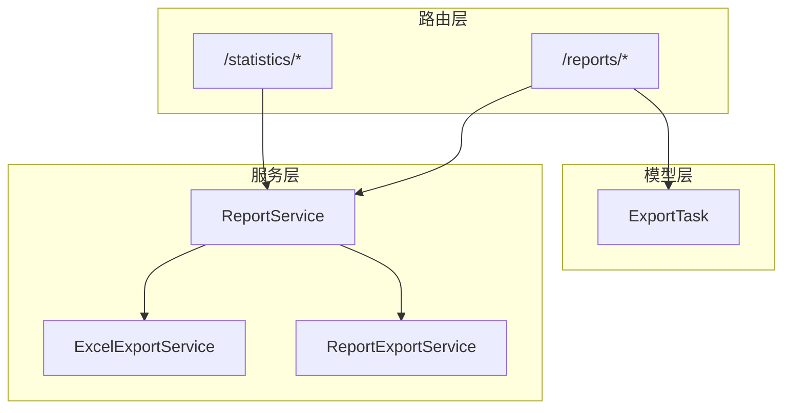
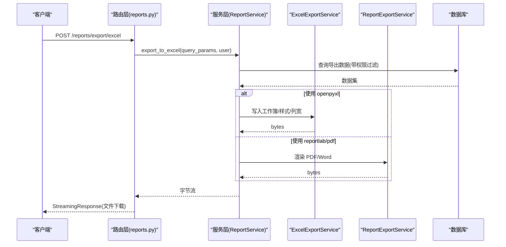
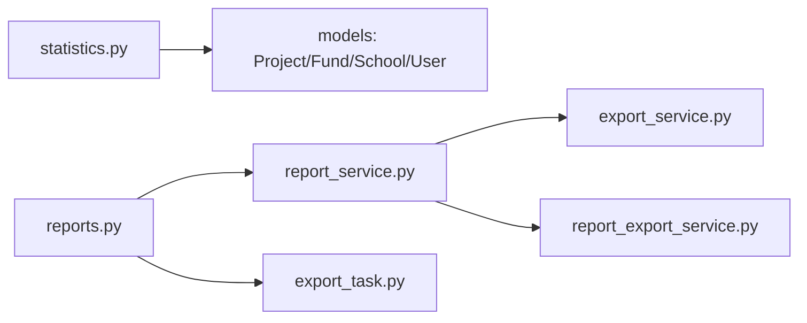

# 项目统计导出接口

<cite>
**本文引用的文件**
- [statistics.py](file://backend/app/api/v1/data/data/statistics.py)
- [reports.py](file://backend/app/api/v1/data/data/reports.py)
- [report_service.py](file://backend/app/services/report_service.py)
- [export_service.py](file://backend/app/services/export_service.py)
- [report_export_service.py](file://backend/app/services/report_export_service.py)
- [export_task.py](file://backend/app/models/export_task.py)
- [__init__.py](file://backend/app/api/v1/data/data/__init__.py)
</cite>

## 目录
1. [简介](#简介)
2. [项目结构](#项目结构)
3. [核心组件](#核心组件)
4. [架构总览](#架构总览)
5. [详细组件分析](#详细组件分析)
6. [依赖关系分析](#依赖关系分析)
7. [性能考虑](#性能考虑)
8. [故障排查指南](#故障排查指南)
9. [结论](#结论)
10. [附录：API 调用示例与流程](#附录api-调用示例与流程)

## 简介
本文件面向“项目统计导出”能力，覆盖以下目标：
- 项目统计概览与 Excel/PDF/综合报表导出的 HTTP 方法、URL、请求参数、响应格式与错误处理。
- 统计数据计算逻辑（项目状态/类型/预算/投资进度等）。
- 导出文件格式与命名策略。
- 大数据量下的分页机制与内存优化方案。
- 完整的 API 调用示例，展示从数据查询到报表生成的端到端流程。

## 项目结构
本项目后端采用 FastAPI 路由 + 服务层 + 模型的分层设计。与项目统计导出相关的关键路径如下：
- 路由层：位于 data/data 子模块，提供统计分析、报表导出等 HTTP 接口。
- 服务层：封装导出与报表生成逻辑，包含 Excel/PDF/Word 渲染与数据组装。
- 模型层：导出任务持久化与状态跟踪。

图表来源
- [statistics.py:105-170](file://backend/app/api/v1/data/data/statistics.py#L105-L170)
- [reports.py:54-156](file://backend/app/api/v1/data/data/reports.py#L54-L156)
- [report_service.py:27-166](file://backend/app/services/report_service.py#L27-L166)
- [export_service.py:10-189](file://backend/app/services/export_service.py#L10-L189)
- [report_export_service.py:46-448](file://backend/app/services/report_export_service.py#L46-L448)
- [export_task.py:28-121](file://backend/app/models/export_task.py#L28-L121)

章节来源
- [statistics.py:105-170](file://backend/app/api/v1/data/data/statistics.py#L105-L170)
- [reports.py:54-156](file://backend/app/api/v1/data/data/reports.py#L54-L156)
- [__init__.py:11-20](file://backend/app/api/v1/data/data/__init__.py#L11-L20)

## 核心组件
- 统计分析路由：提供系统概览、项目统计、经费统计、学校统计与分析聚合数据。
- 报表导出路由：提供 Excel/PDF/综合报表导出，以及报表订阅与下载。
- 导出服务：
  - ReportService：统一导出入口，负责数据获取与文件流返回。
  - ExcelExportService：通用 Excel 工作簿构建与多 sheet 综合报表。
  - ReportExportService：Word/PDF 公文报告渲染（标题、段落、表格）。
- 导出任务模型：记录异步导出任务的状态、文件信息、过期时间等。

章节来源
- [statistics.py:172-424](file://backend/app/api/v1/data/data/statistics.py#L172-L424)
- [reports.py:54-156](file://backend/app/api/v1/data/data/reports.py#L54-L156)
- [report_service.py:27-166](file://backend/app/services/report_service.py#L27-L166)
- [export_service.py:10-189](file://backend/app/services/export_service.py#L10-L189)
- [report_export_service.py:46-448](file://backend/app/services/report_export_service.py#L46-L448)
- [export_task.py:28-121](file://backend/app/models/export_task.py#L28-L121)

## 架构总览
下图展示了“项目统计导出”的端到端调用链：客户端发起导出请求，路由层校验并调用服务层，服务层根据类型选择 Excel/PDF/Word 渲染器，必要时读取数据库并返回文件流或 JSON。

图表来源
- [reports.py:54-86](file://backend/app/api/v1/data/data/reports.py#L54-L86)
- [report_service.py:27-166](file://backend/app/services/report_service.py#L27-L166)
- [export_service.py:24-66](file://backend/app/services/export_service.py#L24-L66)
- [report_export_service.py:318-443](file://backend/app/services/report_export_service.py#L318-L443)

## 详细组件分析

### 项目统计概览接口
- 方法/路径：GET /statistics/overview
- 功能：返回各模块概况、最后更新时间、健康评分、近7天趋势、最近操作记录等。
- 关键计算：
  - 模块计数：帮扶村、项目、学校、经费、用户。
  - 资金总额：已批准且有效的经费金额合计。
  - 数据完整率：基于帮扶村关键字段填写情况（基本信息、坐标、人口、收入）计算百分比。
  - 健康评分：综合各模块数据量与完整率的加权评分。
  - 近7天趋势：按日分组统计审计日志数量。
- 缓存：概览接口内部通过 _get_overview_impl 实现，可结合缓存策略提升性能。
- 错误处理：异常时记录日志并返回 500 错误。

章节来源
- [statistics.py:172-311](file://backend/app/api/v1/data/data/statistics.py#L172-L311)

### 项目统计详情接口
- 方法/路径：GET /statistics/projects/statistics
- 功能：返回项目按状态/类型分布、总预算、总投资额、平均进度、最近项目列表。
- 计算要点：
  - 按 status/type 分组计数。
  - 预算与投资额求和。
  - 平均进度取平均值。
- 错误处理：异常时记录日志并返回 500 错误。

章节来源
- [statistics.py:369-424](file://backend/app/api/v1/data/data/statistics.py#L369-L424)

### Excel 导出接口
- 方法/路径：POST /reports/export/excel
- 请求体：ExportQuery（year、village_ids、include_sections 等）
- 响应：application/vnd.openxmlformats-officedocument.spreadsheetml.sheet 文件流
- 处理流程：
  - 解析 ExportQuery 为字典。
  - 调用 ReportService.export_to_excel 生成字节流。
  - 动态生成文件名，返回 StreamingResponse。
- 错误处理：捕获异常并返回 500。

章节来源
- [reports.py:54-86](file://backend/app/api/v1/data/data/reports.py#L54-L86)
- [report_service.py:27-66](file://backend/app/services/report_service.py#L27-L66)

### PDF 导出接口
- 方法/路径：POST /reports/export/pdf
- 请求体：ExportQuery（强制 format=pdf）
- 响应：application/pdf 文件流
- 处理流程：
  - 设置 format=pdf。
  - 调用 ReportService.export_to_pdf 生成字节流。
  - 若缺少依赖则返回 501。
- 错误处理：参数错误或导入失败分别返回 400/501；其他异常返回 500。

章节来源
- [reports.py:88-119](file://backend/app/api/v1/data/data/reports.py#L88-L119)
- [report_service.py:74-133](file://backend/app/services/report_service.py#L74-L133)

### 综合报表导出接口
- 方法/路径：GET /reports/export/comprehensive/{year}
- 查询参数：village_ids（逗号分隔）
- 响应：Excel 文件流（多 sheet：汇总、村庄、项目、经费）
- 处理流程：
  - 解析 village_ids。
  - 调用 ReportService.export_comprehensive_report。
  - 生成带时间戳的文件名并返回文件流。
- 错误处理：异常时返回 500。

章节来源
- [reports.py:122-156](file://backend/app/api/v1/data/data/reports.py#L122-L156)
- [report_service.py:135-152](file://backend/app/services/report_service.py#L135-L152)
- [export_service.py:134-186](file://backend/app/services/export_service.py#L134-L186)

### 报表生成与下载接口
- 方法/路径：
  - POST /reports/generate：生成报表数据（JSON），支持 report_type、year、village_ids、include_sections、format。
  - GET /reports/{report_id}/download：根据 report_id 下载对应格式文件（excel/pdf/json）。
- 功能说明：
  - generate：根据订阅或请求参数组装报表数据，返回结构化 JSON。
  - download：若存在订阅记录，按配置重新生成文件；否则返回基础 JSON。
- 错误处理：异常时返回 500。

章节来源
- [reports.py:617-779](file://backend/app/api/v1/data/data/reports.py#L617-L779)

### 数据分析与筛选接口（辅助）
- 方法/路径：
  - GET /reports/analytics/filter-options：获取筛选选项。
  - POST /reports/analytics/filter：多维度筛选帮扶村，支持分页 page/page_size。
  - POST /reports/analytics/drill-down：钻取查询。
  - POST /reports/analytics/compare-villages：对比多个帮扶村。
  - GET /reports/analytics/compare-years/{village_id}：同村多年对比。
  - GET /reports/analytics/summary：汇总统计。
- 功能说明：为导出与报表提供数据准备与筛选能力。

章节来源
- [reports.py:161-339](file://backend/app/api/v1/data/data/reports.py#L161-L339)

## 依赖关系分析
- 路由层依赖服务层：
  - statistics.py 直接访问数据库模型进行统计计算。
  - reports.py 依赖 ReportService 完成导出。
- 服务层依赖渲染器：
  - ReportService 在导出时可选择 openpyxl 或 reportlab。
  - ExcelExportService 提供通用 Excel 构建能力。
  - ReportExportService 提供 Word/PDF 公文报告渲染。
- 模型层支撑：
  - ExportTask 用于异步导出任务的状态管理与文件生命周期控制。

图表来源
- [statistics.py:105-424](file://backend/app/api/v1/data/data/statistics.py#L105-L424)
- [reports.py:54-156](file://backend/app/api/v1/data/data/reports.py#L54-L156)
- [report_service.py:27-166](file://backend/app/services/report_service.py#L27-L166)
- [export_service.py:10-189](file://backend/app/services/export_service.py#L10-L189)
- [report_export_service.py:46-448](file://backend/app/services/report_export_service.py#L46-L448)
- [export_task.py:28-121](file://backend/app/models/export_task.py#L28-L121)

章节来源
- [statistics.py:105-424](file://backend/app/api/v1/data/data/statistics.py#L105-L424)
- [reports.py:54-156](file://backend/app/api/v1/data/data/reports.py#L54-L156)
- [report_service.py:27-166](file://backend/app/services/report_service.py#L27-L166)
- [export_service.py:10-189](file://backend/app/services/export_service.py#L10-L189)
- [report_export_service.py:46-448](file://backend/app/services/report_export_service.py#L46-L448)
- [export_task.py:28-121](file://backend/app/models/export_task.py#L28-L121)

## 性能考虑
- 缓存策略：
  - 统计概览与分析数据可使用缓存（TTL 约 5 分钟），减少重复查询压力。
- 查询优化：
  - 使用 GROUP BY 与聚合函数一次性获取多维统计，避免 N+1 查询。
  - 对大表增加索引（如 created_at、status、type 等）以提升查询效率。
- 分页机制：
  - 筛选与列表接口支持 page/page_size，限制单次返回行数，降低内存占用。
  - 导出时可按条件分批拉取数据，避免一次性加载全部结果。
- 内存优化：
  - 使用 StreamingResponse 流式返回文件，避免将大文件整体载入内存。
  - 在 PDF 导出中限制每页行数，自动翻页，控制单页渲染开销。
  - 使用 openpyxl 的 Workbook 增量写入，及时释放中间对象。
- 并发与超时：
  - 对耗时导出建议引入异步任务队列（ExportTask 状态机），前端轮询任务状态。
  - 设置合理的请求超时与文件大小限制，防止资源耗尽。

[本节为通用性能指导，不直接分析具体代码文件]

## 故障排查指南
- 常见错误码：
  - 400：参数格式错误（如年份范围、指标列表格式）。
  - 404：订阅不存在。
  - 501：PDF 导出功能未启用（缺少依赖库）。
  - 500：服务器内部错误（数据库查询失败、渲染异常等）。
- 日志定位：
  - 路由层与服务层均记录详细日志，包含异常堆栈与上下文。
  - 关注“导出失败”“查询失败”等关键词。
- 数据一致性：
  - 确保软删除字段（is_active）正确过滤，避免无效数据参与统计。
  - 检查数据权限过滤是否生效，避免越权导出。
- 依赖问题：
  - 确认 openpyxl、reportlab、python-docx 等依赖已安装。
  - 若缺失依赖，导出将降级或返回 501。

章节来源
- [reports.py:88-119](file://backend/app/api/v1/data/data/reports.py#L88-L119)
- [report_service.py:67-133](file://backend/app/services/report_service.py#L67-L133)
- [report_export_service.py:140-146](file://backend/app/services/report_export_service.py#L140-L146)

## 结论
本项目统计导出能力以清晰的分层架构实现，覆盖统计概览、项目统计详情与多种格式的报表导出。通过缓存、聚合查询、分页与流式输出等手段，兼顾了性能与用户体验。建议在大数据量场景下引入异步任务与批处理，进一步提升稳定性与可扩展性。

[本节为总结性内容，不直接分析具体代码文件]

## 附录：API 调用示例与流程

### 项目统计概览
- 方法：GET
- 路径：/statistics/overview
- 请求头：需携带认证令牌
- 响应：包含模块计数、资金总额、完整率、健康评分、趋势与最近操作记录
- 错误：500（查询失败）

章节来源
- [statistics.py:172-311](file://backend/app/api/v1/data/data/statistics.py#L172-L311)

### 项目统计详情
- 方法：GET
- 路径：/statistics/projects/statistics
- 响应：按状态/类型分布、总预算、总投资额、平均进度、最近项目
- 错误：500（查询失败）

章节来源
- [statistics.py:369-424](file://backend/app/api/v1/data/data/statistics.py#L369-L424)

### Excel 导出
- 方法：POST
- 路径：/reports/export/excel
- 请求体：ExportQuery（year、village_ids、include_sections）
- 响应：Excel 文件流
- 错误：500（导出失败）

章节来源
- [reports.py:54-86](file://backend/app/api/v1/data/data/reports.py#L54-L86)
- [report_service.py:27-66](file://backend/app/services/report_service.py#L27-L66)

### PDF 导出
- 方法：POST
- 路径：/reports/export/pdf
- 请求体：ExportQuery（强制 format=pdf）
- 响应：PDF 文件流
- 错误：400（参数错误）、501（未启用）、500（导出失败）

章节来源
- [reports.py:88-119](file://backend/app/api/v1/data/data/reports.py#L88-L119)
- [report_service.py:74-133](file://backend/app/services/report_service.py#L74-L133)

### 综合报表导出
- 方法：GET
- 路径：/reports/export/comprehensive/{year}
- 查询参数：village_ids（逗号分隔）
- 响应：Excel 文件流（多 sheet）
- 错误：500（导出失败）

章节来源
- [reports.py:122-156](file://backend/backend/app/api/v1/data/data/reports.py#L122-L156)
- [report_service.py:135-152](file://backend/app/services/report_service.py#L135-L152)
- [export_service.py:134-186](file://backend/app/services/export_service.py#L134-L186)

### 报表生成与下载
- 方法：POST /reports/generate
- 请求体：report_type、year、village_ids、include_sections、format
- 响应：JSON 报表数据
- 方法：GET /reports/{report_id}/download
- 查询参数：format（excel/pdf/json）
- 响应：对应格式文件流或 JSON
- 错误：500（生成/下载失败）

章节来源
- [reports.py:617-779](file://backend/app/api/v1/data/data/reports.py#L617-L779)

### 数据统计分析页面聚合接口
- 方法：GET /statistics/analysis
- 功能：返回投入趋势、帮扶分类统计、地区分布等聚合数据
- 错误：500（查询失败）

章节来源
- [statistics.py:526-779](file://backend/app/api/v1/data/data/statistics.py#L526-L779)