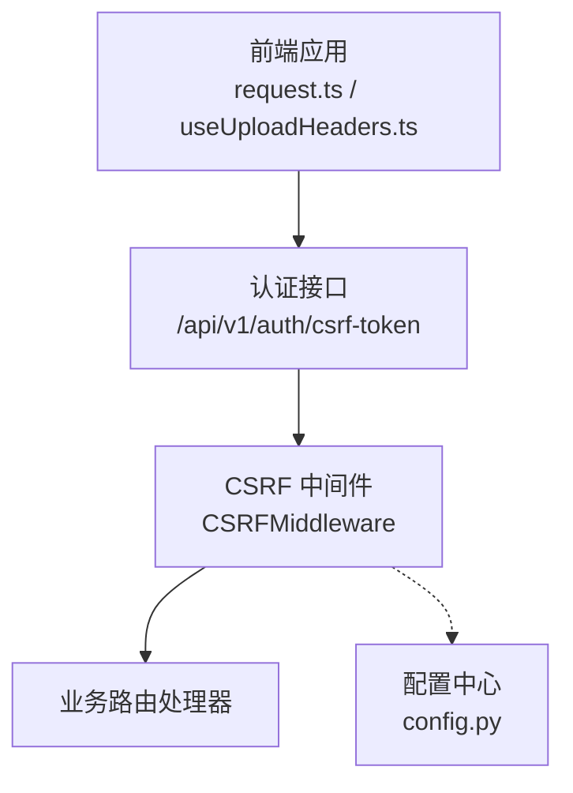
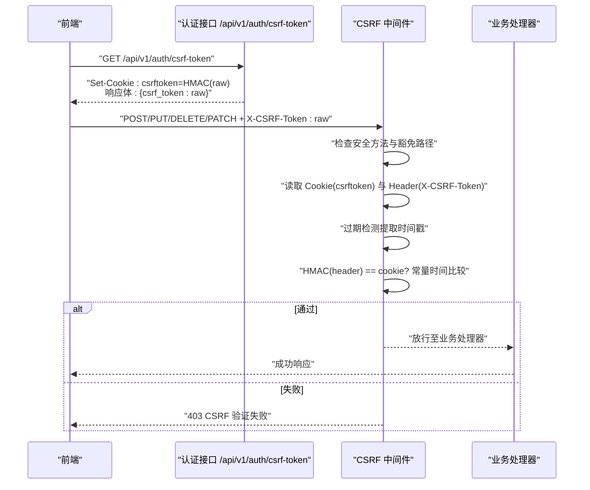
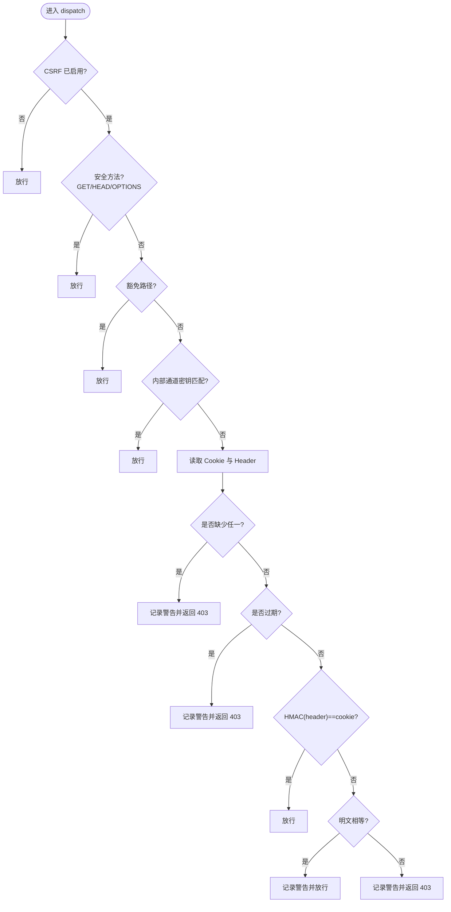
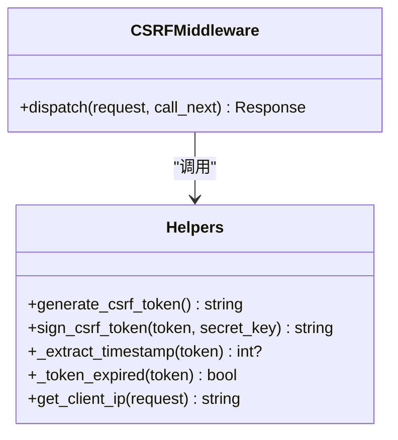
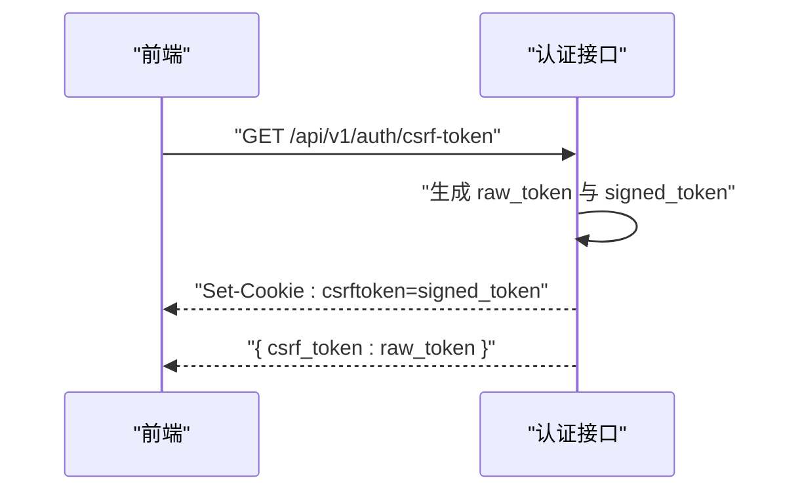
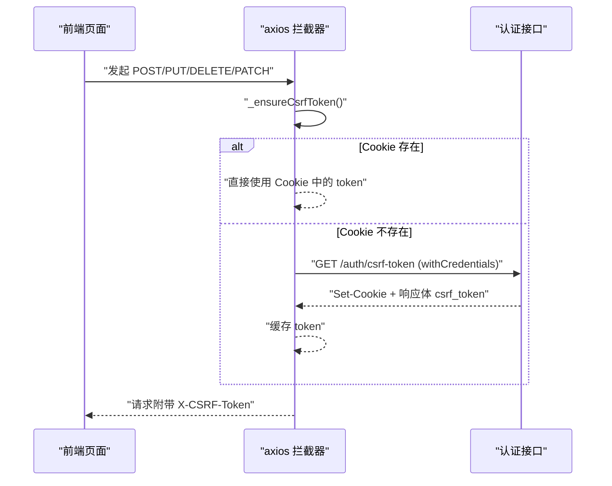
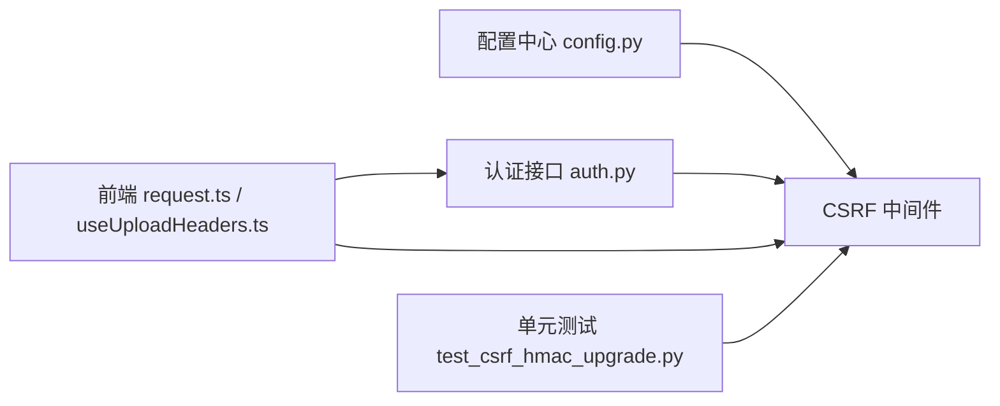

# CSRF防护中间件

<cite>
**本文引用的文件**
- [backend/app/middleware/csrf_middleware.py](file://backend/app/middleware/csrf_middleware.py)
- [backend/app/api/v1/auth/auth.py](file://backend/app/api/v1/auth/auth.py)
- [backend/app/core/config.py](file://backend/app/core/config.py)
- [frontend/src/api/request.ts](file://frontend/src/api/request.ts)
- [frontend/src/composables/useUploadHeaders.ts](file://frontend/src/composables/useUploadHeaders.ts)
- [backend/tests/unit/test_csrf_hmac_upgrade.py](file://backend/tests/unit/test_csrf_hmac_upgrade.py)
</cite>

## 目录
1. [简介](#简介)
2. [项目结构](#项目结构)
3. [核心组件](#核心组件)
4. [架构总览](#架构总览)
5. [详细组件分析](#详细组件分析)
6. [依赖关系分析](#依赖关系分析)
7. [性能考虑](#性能考虑)
8. [故障排查指南](#故障排查指南)
9. [结论](#结论)
10. [附录：前端集成示例与最佳实践](#附录：前端集成示例与最佳实践)

## 简介
本中间件实现基于 Double Submit Cookie 模式的 CSRF 防护，并引入 HMAC-SHA256 签名增强。其核心流程为：
- 前端先调用 GET /api/v1/auth/csrf-token 获取原始 token（raw_token）。
- 服务端设置 csrftoken Cookie 为 raw_token 的 HMAC-SHA256 签名值。
- 后续写操作请求在 X-CSRF-Token 请求头中携带 raw_token。
- 服务端验证 HMAC(header_value) == cookie_value，并进行过期检测。
同时提供向后兼容：若检测到明文比对（旧版），会降级并通过警告日志提示升级。

## 项目结构
CSRF 相关代码主要分布在以下位置：
- 后端中间件：实现令牌生成、HMAC 签名、过期校验、豁免路径与安全方法放行等逻辑。
- 认证接口：提供获取 CSRF token 的端点，负责设置 Cookie 与返回原始 token。
- 配置中心：集中管理 CSRF 开关、密钥、有效期等参数。
- 前端拦截器：自动为不安全方法回填 X-CSRF-Token，并在需要时懒加载 token。
- 上传组件：原生上传不走拦截器，需手动注入 Authorization 与 X-CSRF-Token。

**图表来源**
- [backend/app/middleware/csrf_middleware.py:177-284](file://backend/app/middleware/csrf_middleware.py#L177-L284)
- [backend/app/api/v1/auth/auth.py:700-747](file://backend/app/api/v1/auth/auth.py#L700-L747)
- [backend/app/core/config.py:150-155](file://backend/app/core/config.py#L150-L155)
- [frontend/src/api/request.ts:103-164](file://frontend/src/api/request.ts#L103-L164)
- [frontend/src/composables/useUploadHeaders.ts:1-32](file://frontend/src/composables/useUploadHeaders.ts#L1-L32)

**章节来源**
- [backend/app/middleware/csrf_middleware.py:1-284](file://backend/app/middleware/csrf_middleware.py#L1-L284)
- [backend/app/api/v1/auth/auth.py:700-747](file://backend/app/api/v1/auth/auth.py#L700-L747)
- [backend/app/core/config.py:150-155](file://backend/app/core/config.py#L150-L155)
- [frontend/src/api/request.ts:103-164](file://frontend/src/api/request.ts#L103-L164)
- [frontend/src/composables/useUploadHeaders.ts:1-32](file://frontend/src/composables/useUploadHeaders.ts#L1-L32)

## 核心组件
- CSRF 中间件类：封装完整请求生命周期中的 CSRF 校验流程，包括安全方法放行、豁免路径、内部通道豁免、缺失 token 处理、过期检测、HMAC 签名校验与明文回退。
- Token 生成与签名：
  - generate_csrf_token：生成包含时间戳与随机数的原始 token。
  - sign_csrf_token：使用 HMAC-SHA256 对原始 token 签名，密钥优先使用 CSRF_SECRET_KEY，否则回退到 SECRET_KEY。
- 过期检测：从 token 中提取时间戳并与当前时间比较，超过 CSRF_TOKEN_EXPIRY 即拒绝。
- 可信代理 IP 透传：根据 TRUSTED_PROXIES 决定是否信任 X-Forwarded-For 首段作为真实客户端 IP。
- 认证接口：GET /api/v1/auth/csrf-token 返回原始 token，并设置 csrftoken Cookie 为签名值。
- 前端集成：axios 请求拦截器在不安全方法上自动回填 X-CSRF-Token；el-upload 通过 composable 注入头部。

**章节来源**
- [backend/app/middleware/csrf_middleware.py:65-124](file://backend/app/middleware/csrf_middleware.py#L65-L124)
- [backend/app/middleware/csrf_middleware.py:135-174](file://backend/app/middleware/csrf_middleware.py#L135-L174)
- [backend/app/middleware/csrf_middleware.py:177-284](file://backend/app/middleware/csrf_middleware.py#L177-L284)
- [backend/app/api/v1/auth/auth.py:700-747](file://backend/app/api/v1/auth/auth.py#L700-L747)
- [frontend/src/api/request.ts:103-164](file://frontend/src/api/request.ts#L103-L164)
- [frontend/src/composables/useUploadHeaders.ts:1-32](file://frontend/src/composables/useUploadHeaders.ts#L1-L32)

## 架构总览
下图展示了从前端发起写请求到后端中间件校验的完整序列：

**图表来源**
- [backend/app/api/v1/auth/auth.py:700-747](file://backend/app/api/v1/auth/auth.py#L700-L747)
- [backend/app/middleware/csrf_middleware.py:177-284](file://backend/app/middleware/csrf_middleware.py#L177-L284)

## 详细组件分析

### CSRF 中间件（CSRFMiddleware）
职责与行为：
- 支持全局开关：当 CSRF_ENABLED 为 False 时直接放行。
- 安全方法放行：GET/HEAD/OPTIONS 不校验。
- 豁免路径：如 /api/v1/auth/csrf-token、/health、/docs 等无需校验。
- 内部通道豁免：匹配 X-Internal-Backup 密钥的请求放行（用于 Electron 自动备份等内部场景）。
- 缺失 token：记录警告日志并返回 403。
- 过期检测：token 内嵌时间戳，超过 CSRF_TOKEN_EXPIRY 拒绝。
- HMAC 校验：cookie 存储签名值，header 携带原始值，进行常量时间比较。
- 明文回退：若 cookie 与 header 明文相等，降级通过并记录警告日志，提示升级前端。

**图表来源**
- [backend/app/middleware/csrf_middleware.py:177-284](file://backend/app/middleware/csrf_middleware.py#L177-L284)

**章节来源**
- [backend/app/middleware/csrf_middleware.py:177-284](file://backend/app/middleware/csrf_middleware.py#L177-L284)

### Token 生成与签名
- 生成：generate_csrf_token 输出格式为“时间戳.随机十六进制”，便于过期检测与唯一性。
- 签名：sign_csrf_token 使用 HMAC-SHA256，密钥来源为 settings.CSRF_SECRET_KEY，未配置则回退到 SECRET_KEY。
- 过期：_extract_timestamp 解析时间戳前缀；_token_expired 判断是否超出 CSRF_TOKEN_EXPIRY。

**图表来源**
- [backend/app/middleware/csrf_middleware.py:65-124](file://backend/app/middleware/csrf_middleware.py#L65-L124)
- [backend/app/middleware/csrf_middleware.py:135-174](file://backend/app/middleware/csrf_middleware.py#L135-L174)
- [backend/app/middleware/csrf_middleware.py:177-284](file://backend/app/middleware/csrf_middleware.py#L177-L284)

**章节来源**
- [backend/app/middleware/csrf_middleware.py:65-124](file://backend/app/middleware/csrf_middleware.py#L65-L124)
- [backend/app/middleware/csrf_middleware.py:135-174](file://backend/app/middleware/csrf_middleware.py#L135-L174)

### 认证接口（获取 CSRF Token）
- 端点：GET /api/v1/auth/csrf-token
- 行为：
  - 速率限制：按客户端 IP 限流，防止滥用。
  - 生成原始 token 与签名值。
  - 设置 csrftoken Cookie 为签名值，max_age 为 CSRF_TOKEN_EXPIRY，SameSite=Strict，生产环境启用 Secure。
  - 响应体返回原始 token（供前端放入 X-CSRF-Token 头）。

**图表来源**
- [backend/app/api/v1/auth/auth.py:700-747](file://backend/app/api/v1/auth/auth.py#L700-L747)

**章节来源**
- [backend/app/api/v1/auth/auth.py:700-747](file://backend/app/api/v1/auth/auth.py#L700-L747)

### 前端集成（axios 拦截器与上传组件）
- axios 拦截器：
  - 识别不安全方法（post/put/delete/patch）。
  - 懒加载 CSRF token：优先从 Cookie 读取，缺失时在非测试环境下发起 GET /auth/csrf-token。
  - 将原始 token 写入 X-CSRF-Token 请求头。
- 上传组件：
  - el-upload 原生请求不走拦截器，需通过 useUploadHeaders 注入 Authorization 与 X-CSRF-Token。

**图表来源**
- [frontend/src/api/request.ts:103-164](file://frontend/src/api/request.ts#L103-L164)
- [frontend/src/api/request.ts:172-204](file://frontend/src/api/request.ts#L172-L204)
- [frontend/src/composables/useUploadHeaders.ts:1-32](file://frontend/src/composables/useUploadHeaders.ts#L1-L32)

**章节来源**
- [frontend/src/api/request.ts:103-164](file://frontend/src/api/request.ts#L103-L164)
- [frontend/src/api/request.ts:172-204](file://frontend/src/api/request.ts#L172-L204)
- [frontend/src/composables/useUploadHeaders.ts:1-32](file://frontend/src/composables/useUploadHeaders.ts#L1-L32)

## 依赖关系分析
- 中间件依赖配置中心以读取 CSRF_ENABLED、CSRF_SECRET_KEY、SECRET_KEY 等。
- 认证接口依赖中间件的常量与函数以生成 token 与签名。
- 前端依赖后端接口与 Cookie 策略以正确回填请求头。
- 测试覆盖关键路径：HMAC 验证、明文回退、过期拒绝、安全方法放行、可信代理透传。

**图表来源**
- [backend/app/core/config.py:150-155](file://backend/app/core/config.py#L150-L155)
- [backend/app/middleware/csrf_middleware.py:177-284](file://backend/app/middleware/csrf_middleware.py#L177-L284)
- [backend/app/api/v1/auth/auth.py:700-747](file://backend/app/api/v1/auth/auth.py#L700-L747)
- [frontend/src/api/request.ts:103-164](file://frontend/src/api/request.ts#L103-L164)
- [backend/tests/unit/test_csrf_hmac_upgrade.py:1-261](file://backend/tests/unit/test_csrf_hmac_upgrade.py#L1-L261)

**章节来源**
- [backend/app/core/config.py:150-155](file://backend/app/core/config.py#L150-L155)
- [backend/app/middleware/csrf_middleware.py:177-284](file://backend/app/middleware/csrf_middleware.py#L177-L284)
- [backend/app/api/v1/auth/auth.py:700-747](file://backend/app/api/v1/auth/auth.py#L700-L747)
- [frontend/src/api/request.ts:103-164](file://frontend/src/api/request.ts#L103-L164)
- [backend/tests/unit/test_csrf_hmac_upgrade.py:1-261](file://backend/tests/unit/test_csrf_hmac_upgrade.py#L1-L261)

## 性能考虑
- 常量时间比较：使用 hmac.compare_digest 避免时序攻击，同时保持 O(1) 比较开销。
- 延迟导入：中间件在 dispatch 中延迟导入配置，避免循环依赖与启动开销。
- 豁免路径与快速路径：安全方法与豁免路径直接放行，减少不必要的计算。
- 过期检测轻量：仅解析时间戳前缀并进行一次数值比较。
- 前端懒加载：仅在首次或不安全方法时获取 token，避免多余网络请求。

[本节为通用性能建议，不直接分析具体文件]

## 故障排查指南
常见错误与解决方案：
- 403 CSRF 验证失败（缺少 token）
  - 现象：Cookie 或 Header 缺失。
  - 原因：前端未调用 /api/v1/auth/csrf-token 或未回填 X-CSRF-Token。
  - 解决：确保首次访问后 Cookie 存在，并在所有写请求中携带 X-CSRF-Token。
- 403 token 已过期
  - 现象：token 内嵌时间戳超过 CSRF_TOKEN_EXPIRY。
  - 原因：长时间未刷新 token。
  - 解决：重新调用 /api/v1/auth/csrf-token 获取新 token。
- 403 token 无效或已过期（HMAC 不匹配）
  - 现象：HMAC(header) != cookie。
  - 原因：前端传递了错误的原始 token 或 Cookie 被篡改/不同步。
  - 解决：清理 Cookie 并重新获取；检查跨域与 SameSite 配置。
- 明文回退警告
  - 现象：日志中出现退化路径警告。
  - 原因：前端仍使用明文模式。
  - 解决：升级前端至签名模式，确保 Cookie 为 HMAC 签名值，Header 为原始 token。
- 可信代理导致 IP 异常
  - 现象：日志记录的客户端 IP 不符合预期。
  - 原因：TRUSTED_PROXIES 配置不当或 X-Forwarded-For 伪造。
  - 解决：仅信任可信代理网段；不可信时降级为直连 IP。

**章节来源**
- [backend/app/middleware/csrf_middleware.py:211-284](file://backend/app/middleware/csrf_middleware.py#L211-L284)
- [backend/tests/unit/test_csrf_hmac_upgrade.py:128-223](file://backend/tests/unit/test_csrf_hmac_upgrade.py#L128-L223)
- [backend/tests/unit/test_csrf_hmac_upgrade.py:225-261](file://backend/tests/unit/test_csrf_hmac_upgrade.py#L225-L261)

## 结论
该 CSRF 中间件采用 Double Submit Cookie 模式并结合 HMAC-SHA256 签名，提供了强化的防篡改能力与清晰的过期控制。通过安全方法放行、豁免路径、内部通道豁免与可信代理透传机制，兼顾安全性与可用性。前端集成通过 axios 拦截器与上传组件统一处理，确保写请求均携带正确的 X-CSRF-Token。配合完善的测试覆盖与日志告警，可在生产环境中稳定运行并提供可观测性。

[本节为总结性内容，不直接分析具体文件]

## 附录：前端集成示例与最佳实践
- 基本流程
  - 首次访问后调用 GET /api/v1/auth/csrf-token，接收响应体中的原始 token。
  - 将原始 token 放入 X-CSRF-Token 请求头；服务端会在 Set-Cookie 中设置 csrftoken 为签名值。
  - 所有写请求（POST/PUT/DELETE/PATCH）均需携带 X-CSRF-Token。
- 懒加载与并发保护
  - 前端在首次需要时懒加载 token，并对并发请求去重，避免重复网络请求。
- 上传组件
  - el-upload 原生请求需手动注入 Authorization 与 X-CSRF-Token，可通过 useUploadHeaders 统一管理。
- 安全建议
  - 生产环境启用 Secure Cookie（由后端根据环境自动设置）。
  - 合理配置 SameSite=Strict，避免跨站携带 Cookie。
  - 定期轮换 CSRF_SECRET_KEY，降低长期密钥泄露风险。
  - 监控日志中的退化路径警告，及时升级前端至签名模式。

**章节来源**
- [frontend/src/api/request.ts:103-164](file://frontend/src/api/request.ts#L103-L164)
- [frontend/src/api/request.ts:172-204](file://frontend/src/api/request.ts#L172-L204)
- [frontend/src/composables/useUploadHeaders.ts:1-32](file://frontend/src/composables/useUploadHeaders.ts#L1-L32)
- [backend/app/api/v1/auth/auth.py:700-747](file://backend/app/api/v1/auth/auth.py#L700-L747)