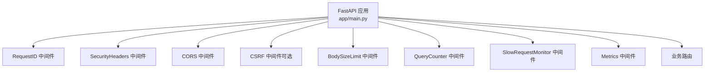
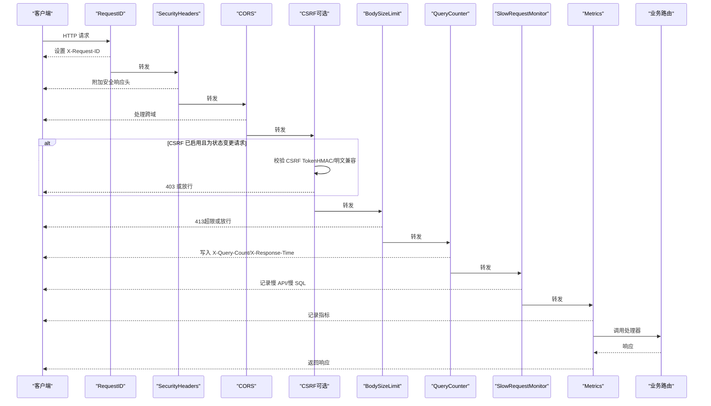
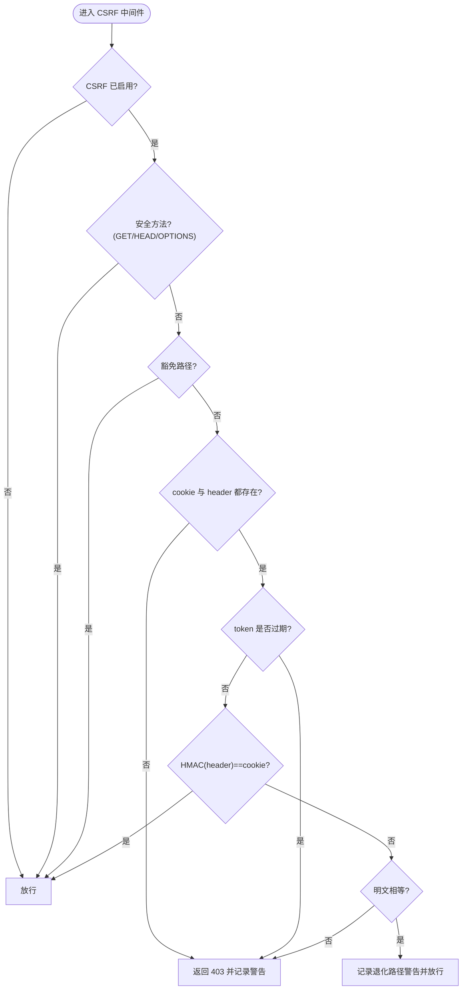
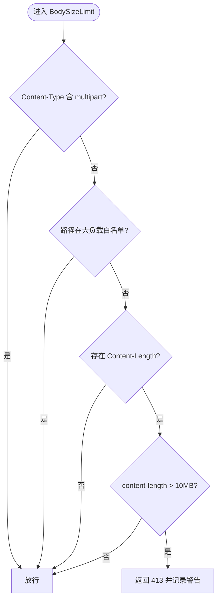
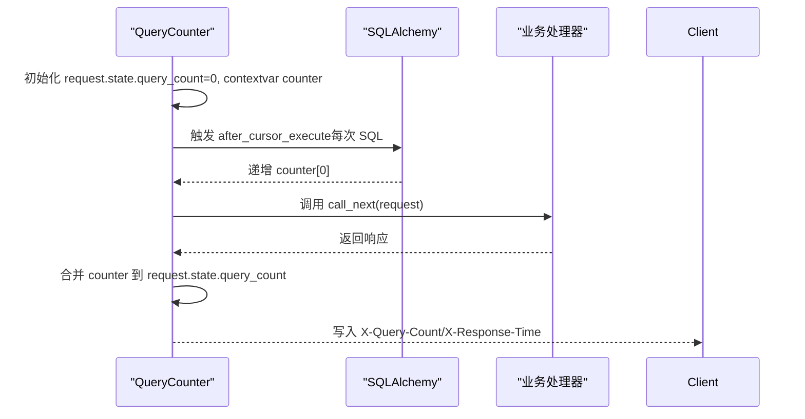
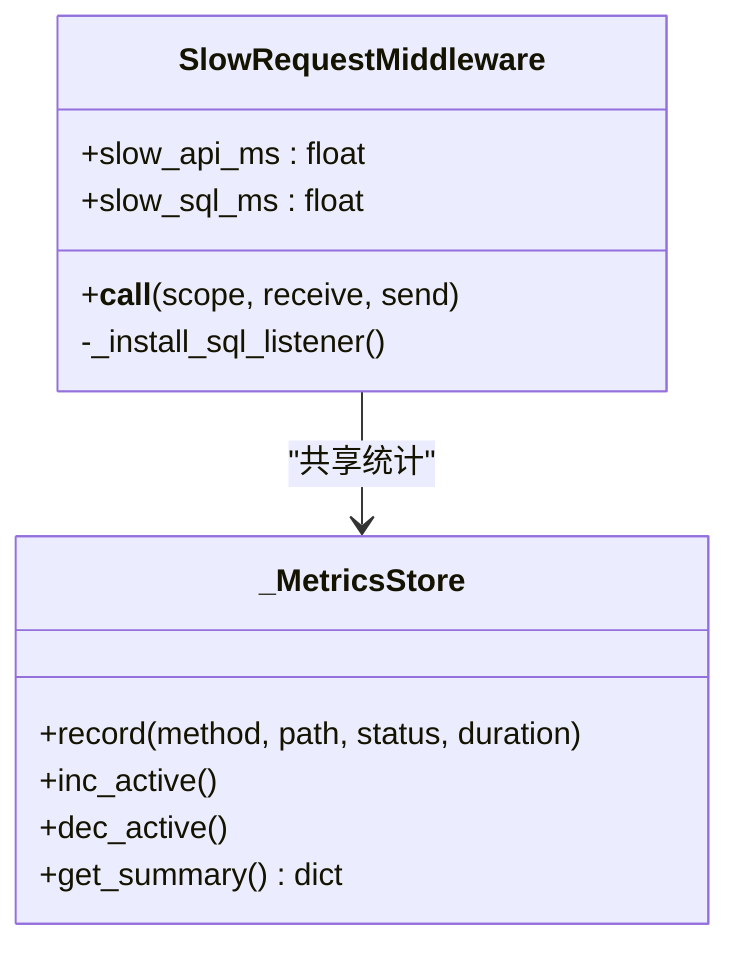
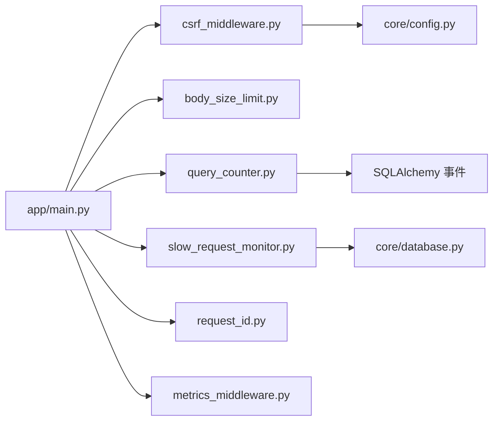

# 安全中间件

<cite>
**本文引用的文件**
- [backend/app/middleware/csrf_middleware.py](file://backend/app/middleware/csrf_middleware.py)
- [backend/app/middleware/body_size_limit.py](file://backend/app/middleware/body_size_limit.py)
- [backend/app/middleware/query_counter.py](file://backend/app/middleware/query_counter.py)
- [backend/app/middleware/slow_request_monitor.py](file://backend/app/middleware/slow_request_monitor.py)
- [backend/app/middleware/request_id.py](file://backend/app/middleware/request_id.py)
- [backend/app/middleware/audit_context.py](file://backend/app/middleware/audit_context.py)
- [backend/app/middleware/metrics_middleware.py](file://backend/app/middleware/metrics_middleware.py)
- [backend/app/core/security.py](file://backend/app/core/security.py)
- [backend/app/core/config.py](file://backend/app/core/config.py)
- [backend/app/main.py](file://backend/app/main.py)
</cite>

## 目录
1. [简介](#简介)
2. [项目结构](#项目结构)
3. [核心组件](#核心组件)
4. [架构总览](#架构总览)
5. [详细组件分析](#详细组件分析)
6. [依赖关系分析](#依赖关系分析)
7. [性能考量](#性能考量)
8. [故障排查指南](#故障排查指南)
9. [结论](#结论)
10. [附录：配置与最佳实践](#附录：配置与最佳实践)

## 简介
本文件聚焦后端安全中间件体系，覆盖 CSRF 防护、请求体大小限制、SQL 查询计数、慢请求监控等关键能力。文档说明各中间件的功能、执行顺序、错误处理机制、性能影响、配置参数、自定义开发指南以及组合使用最佳实践，帮助开发者在生产环境中正确启用与调优。

## 项目结构
安全相关中间件集中在 backend/app/middleware 目录下，应用入口在 backend/app/main.py 中统一注册。核心安全能力（如安全响应头、速率限制、客户端 IP 获取）位于 backend/app/core/security.py；全局配置位于 backend/app/core/config.py。

图表来源
- [backend/app/main.py:113-165](file://backend/app/main.py#L113-L165)

章节来源
- [backend/app/main.py:113-165](file://backend/app/main.py#L113-L165)

## 核心组件
- CSRF 保护中间件：基于 Double Submit Cookie + HMAC 签名校验，支持过期检测与豁免路径。
- 请求体大小限制中间件：非文件上传请求默认限制为 10MB，对特定大负载路径放行。
- SQL 查询计数中间件：通过 SQLAlchemy 事件统计每个请求的 SQL 数量，输出到响应头并告警。
- 慢请求监控中间件：记录超过阈值的 API 和 SQL，提供最近慢请求查询接口。
- 请求 ID 追踪中间件：生成/透传 X-Request-ID，注入日志上下文，支持慢请求告警。
- 指标采集中间件：收集请求计数、耗时、活跃数等指标，供 /metrics 端点查询。
- 审计上下文：维护当前用户与请求 ID 的上下文变量，便于审计与追踪。

章节来源
- [backend/app/middleware/csrf_middleware.py:1-284](file://backend/app/middleware/csrf_middleware.py#L1-L284)
- [backend/app/middleware/body_size_limit.py:1-79](file://backend/app/middleware/body_size_limit.py#L1-L79)
- [backend/app/middleware/query_counter.py:1-88](file://backend/app/middleware/query_counter.py#L1-L88)
- [backend/app/middleware/slow_request_monitor.py:1-132](file://backend/app/middleware/slow_request_monitor.py#L1-L132)
- [backend/app/middleware/request_id.py:1-128](file://backend/app/middleware/request_id.py#L1-L128)
- [backend/app/middleware/metrics_middleware.py:1-177](file://backend/app/middleware/metrics_middleware.py#L1-L177)
- [backend/app/middleware/audit_context.py:1-58](file://backend/app/middleware/audit_context.py#L1-L58)

## 架构总览
中间件注册顺序（Starlette/FastAPI 按添加逆序执行），实际请求进入顺序如下：
- RequestID → SecurityHeaders → CORS → CSRF（可选）→ BodySizeLimit → QueryCounter → SlowRequestMonitor → Metrics → 业务路由

图表来源
- [backend/app/main.py:113-165](file://backend/app/main.py#L113-L165)
- [backend/app/middleware/csrf_middleware.py:177-284](file://backend/app/middleware/csrf_middleware.py#L177-L284)
- [backend/app/middleware/body_size_limit.py:48-79](file://backend/app/middleware/body_size_limit.py#L48-L79)
- [backend/app/middleware/query_counter.py:39-78](file://backend/app/middleware/query_counter.py#L39-L78)
- [backend/app/middleware/slow_request_monitor.py:55-132](file://backend/app/middleware/slow_request_monitor.py#L55-L132)
- [backend/app/middleware/metrics_middleware.py:132-177](file://backend/app/middleware/metrics_middleware.py#L132-L177)

## 详细组件分析

### CSRF 保护中间件
- 功能要点
  - 双提交 Cookie：服务端设置 csrftoken Cookie 为 HMAC-SHA256(raw_token)，前端在 X-CSRF-Token 携带 raw_token。
  - 常量时间比较：使用 hmac.compare_digest 防止时序攻击。
  - 过期检测：token 内嵌时间戳 {ts}.{random}，超过 CSRF_TOKEN_EXPIRY 拒绝。
  - 豁免路径：认证、健康检查、文档等路径无需验证。
  - 代理信任：TRUSTED_PROXIES 控制是否信任 X-Forwarded-For。
  - 内部通道豁免：Electron 自动备份通过 X-Internal-Backup 密钥绕过。
- 执行流程
  - 若未启用则直接放行。
  - GET/HEAD/OPTIONS 直接放行。
  - 豁免路径直接放行。
  - 状态变更请求需同时具备 cookie 与 header，否则返回 403。
  - 优先 HMAC 验证，失败回退明文比对（带警告日志）。
  - 两种均失败返回 403。
- 错误处理
  - 缺失 token：记录警告并返回 403。
  - 过期：记录警告并返回 403。
  - 不匹配：记录警告并返回 403。
- 性能影响
  - HMAC 计算开销较小；常量时间比较避免侧信道风险。
  - 仅在启用时注册，避免不必要的开销。

图表来源
- [backend/app/middleware/csrf_middleware.py:177-284](file://backend/app/middleware/csrf_middleware.py#L177-L284)

章节来源
- [backend/app/middleware/csrf_middleware.py:1-284](file://backend/app/middleware/csrf_middleware.py#L1-L284)
- [backend/app/core/config.py:148-155](file://backend/app/core/config.py#L148-L155)

### 请求体大小限制中间件
- 功能要点
  - 非 multipart/form-data 且不在大负载路径前缀的请求，超过 10MB 返回 413。
  - 文件上传（multipart）由 MAX_FILE_SIZE 单独控制，此处放行。
  - 大负载路径前缀包含导入导出、批量操作、系统管理等。
- 错误处理
  - content-length 非法时忽略并放行，避免崩溃。
  - 超限返回 413 并记录警告。
- 性能影响
  - 仅读取请求头，无额外内存分配，开销极低。

图表来源
- [backend/app/middleware/body_size_limit.py:48-79](file://backend/app/middleware/body_size_limit.py#L48-L79)

章节来源
- [backend/app/middleware/body_size_limit.py:1-79](file://backend/app/middleware/body_size_limit.py#L1-L79)

### SQL 查询计数中间件
- 功能要点
  - 通过 SQLAlchemy after_cursor_execute 事件递增计数器，结合 contextvar 桥接异步上下文。
  - 将查询计数写入 request.state 与响应头 X-Query-Count，同时输出 X-Response-Time。
  - 超过阈值（默认 50）记录警告，辅助发现 N+1 问题。
- 错误处理
  - 兼容旧接口 increment_query_count，若无 state 或 query_count 字段不会报错。
- 性能影响
  - 事件监听轻量；contextvar 切换开销低；仅在结束时写响应头。

图表来源
- [backend/app/middleware/query_counter.py:39-88](file://backend/app/middleware/query_counter.py#L39-L88)

章节来源
- [backend/app/middleware/query_counter.py:1-88](file://backend/app/middleware/query_counter.py#L1-L88)

### 慢请求监控中间件
- 功能要点
  - 记录超过阈值的 API 请求与 SQL 查询，保留最近 N 条记录。
  - 通过 SQLAlchemy before/after_cursor_execute 捕获慢 SQL。
  - 提供 get_slow_api_records/get_slow_sql_records/get_slow_stats 查询接口。
- 错误处理
  - 安装监听器失败（数据库未初始化）时记录调试日志，不影响启动。
- 性能影响
  - 环形缓冲区固定容量，内存占用可控；仅超阈值时记录。

图表来源
- [backend/app/middleware/slow_request_monitor.py:55-132](file://backend/app/middleware/slow_request_monitor.py#L55-L132)
- [backend/app/middleware/metrics_middleware.py:26-129](file://backend/app/middleware/metrics_middleware.py#L26-L129)

章节来源
- [backend/app/middleware/slow_request_monitor.py:1-132](file://backend/app/middleware/slow_request_monitor.py#L1-L132)
- [backend/app/middleware/metrics_middleware.py:1-177](file://backend/app/middleware/metrics_middleware.py#L1-L177)

### 请求 ID 追踪中间件
- 功能要点
  - 生成或接受客户端传入的 X-Request-ID（格式校验），写入响应头。
  - 通过 ContextVar 传递 request_id，便于日志注入。
  - 记录慢请求与异常，提升可观测性。
- 错误处理
  - 客户端连接断开时返回空响应，避免 RuntimeError。
- 性能影响
  - 仅字符串处理与少量上下文切换，开销极低。

章节来源
- [backend/app/middleware/request_id.py:1-128](file://backend/app/middleware/request_id.py#L1-L128)

### 审计上下文
- 功能要点
  - 使用 ContextVar 存储当前用户 ID 与请求 ID，供审计服务与事件处理器使用。
- 使用场景
  - 认证成功后设置当前用户，审计事件在 commit/flush 时读取进行归因。

章节来源
- [backend/app/middleware/audit_context.py:1-58](file://backend/app/middleware/audit_context.py#L1-L58)
- [backend/app/core/security.py:324-334](file://backend/app/core/security.py#L324-L334)

## 依赖关系分析
- 中间件注册顺序决定执行顺序，main.py 中明确注释了“添加顺序”与“执行顺序”。
- CSRF 中间件仅在 settings.CSRF_ENABLED=True 时注册，避免 BaseHTTPMiddleware 在某些环境下的协议错误。
- QueryCounter 与 SlowRequestMonitor 都依赖 SQLAlchemy 事件，前者统计次数，后者记录慢 SQL。
- Metrics 中间件独立于其他中间件，收集整体指标。

图表来源
- [backend/app/main.py:113-165](file://backend/app/main.py#L113-L165)
- [backend/app/middleware/csrf_middleware.py:177-284](file://backend/app/middleware/csrf_middleware.py#L177-L284)
- [backend/app/middleware/slow_request_monitor.py:70-101](file://backend/app/middleware/slow_request_monitor.py#L70-L101)
- [backend/app/middleware/query_counter.py:30-37](file://backend/app/middleware/query_counter.py#L30-L37)

章节来源
- [backend/app/main.py:113-165](file://backend/app/main.py#L113-L165)

## 性能考量
- CSRF 中间件
  - HMAC 计算与常量时间比较开销小；建议生产环境始终启用。
  - 豁免路径应最小化，避免误放敏感接口。
- 请求体大小限制
  - 仅读取请求头，几乎零开销；合理配置大负载路径前缀，避免误放行。
- 查询计数
  - 事件监听轻量；阈值可根据业务调整，过高可能掩盖 N+1 问题。
- 慢请求监控
  - 环形缓冲区固定容量，内存稳定；阈值建议根据 SLA 设定。
- 指标采集
  - 线程锁保护，适合高并发；跳过健康检查与指标端点，减少噪声。

## 故障排查指南
- CSRF 验证失败
  - 现象：POST/PUT/DELETE/PATCH 返回 403。
  - 排查：确认前端先调用 /api/v1/auth/csrf-token 获取 token，并在 X-CSRF-Token 携带；检查 csrftoken Cookie 是否为 HMAC 签名；检查 CSRF_SECRET_KEY 与 SECRET_KEY 配置。
  - 日志：查看“CSRF 验证失败”警告，关注 method/path/ip。
- 请求体过大
  - 现象：返回 413。
  - 排查：检查 Content-Type 是否为 multipart/form-data；确认路径是否在 LARGE_PAYLOAD_PATH_PREFIXES；调整 max_body_size。
- 慢查询告警
  - 现象：日志出现“慢查询警告”，X-Query-Count 较高。
  - 排查：定位对应接口，优化 SQL 或引入缓存；检查 N+1 查询。
- 慢 API/慢 SQL
  - 现象：慢请求记录增多。
  - 排查：使用 get_slow_api_records/get_slow_sql_records 查看最近记录；结合慢 SQL 参数定位热点语句。
- 请求 ID 缺失
  - 现象：日志缺少 request_id。
  - 排查：确认 RequestIDMiddleware 已注册；检查客户端是否传入非法 X-Request-ID。

章节来源
- [backend/app/middleware/csrf_middleware.py:211-284](file://backend/app/middleware/csrf_middleware.py#L211-L284)
- [backend/app/middleware/body_size_limit.py:53-79](file://backend/app/middleware/body_size_limit.py#L53-L79)
- [backend/app/middleware/query_counter.py:61-78](file://backend/app/middleware/query_counter.py#L61-L78)
- [backend/app/middleware/slow_request_monitor.py:103-132](file://backend/app/middleware/slow_request_monitor.py#L103-L132)
- [backend/app/middleware/request_id.py:50-119](file://backend/app/middleware/request_id.py#L50-L119)

## 结论
该安全中间件体系以最小侵入方式提供了 CSRF 防护、请求体限制、SQL 查询计数与慢请求监控等关键能力。通过合理的执行顺序与配置，可在保障安全的同时保持良好性能。建议生产环境默认启用 CSRF 与慢请求监控，并根据业务特点调整阈值与大负载路径白名单。

## 附录：配置与最佳实践
- 配置参数
  - CSRF_ENABLED：是否启用 CSRF 保护（默认开启）。
  - CSRF_SECRET_KEY：CSRF 签名密钥（留空时使用 SECRET_KEY）。
  - TRUSTED_PROXIES：可信代理 IP/CIDR，用于透传真实客户端 IP。
  - max_body_size：请求体大小限制（默认 10MB）。
  - QUERY_COUNT_WARNING_THRESHOLD：查询计数告警阈值（默认 50）。
  - slow_api_ms/slow_sql_ms：慢请求/慢 SQL 阈值。
- 中间件组合最佳实践
  - 将 RequestID 置于最外层，确保所有日志可关联。
  - SecurityHeaders 紧随其后，保证所有响应附带安全头。
  - CORS 在 CSRF 之前，避免预检请求被拦截。
  - CSRF 仅在需要时启用，豁免路径尽量精简。
  - BodySizeLimit 放在 CSRF 之后，避免对超大请求做无用处理。
  - QueryCounter 与 SlowRequestMonitor 配合，既统计次数又记录慢查询。
  - Metrics 置于较外层，收集端到端指标。
- 自定义中间件开发指南
  - 继承 BaseHTTPMiddleware 或使用 ASGI __call__ 实现。
  - 使用 request.state 传递上下文，避免全局变量污染。
  - 对异常进行兜底处理，确保主流程不被阻断。
  - 记录必要日志，便于问题定位。
  - 在 main.py 中按顺序注册，注意 Starlette 的逆序执行特性。

章节来源
- [backend/app/core/config.py:126-155](file://backend/app/core/config.py#L126-L155)
- [backend/app/main.py:113-165](file://backend/app/main.py#L113-L165)
- [backend/app/middleware/csrf_middleware.py:177-284](file://backend/app/middleware/csrf_middleware.py#L177-L284)
- [backend/app/middleware/body_size_limit.py:48-79](file://backend/app/middleware/body_size_limit.py#L48-L79)
- [backend/app/middleware/query_counter.py:39-88](file://backend/app/middleware/query_counter.py#L39-L88)
- [backend/app/middleware/slow_request_monitor.py:55-132](file://backend/app/middleware/slow_request_monitor.py#L55-L132)
- [backend/app/middleware/request_id.py:40-119](file://backend/app/middleware/request_id.py#L40-L119)
- [backend/app/middleware/metrics_middleware.py:132-177](file://backend/app/middleware/metrics_middleware.py#L132-L177)