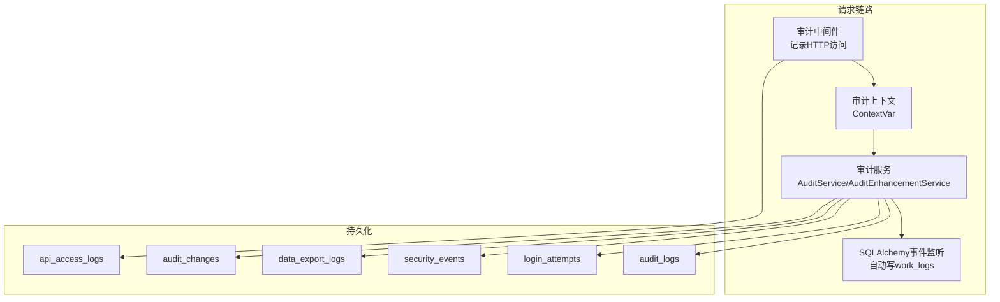
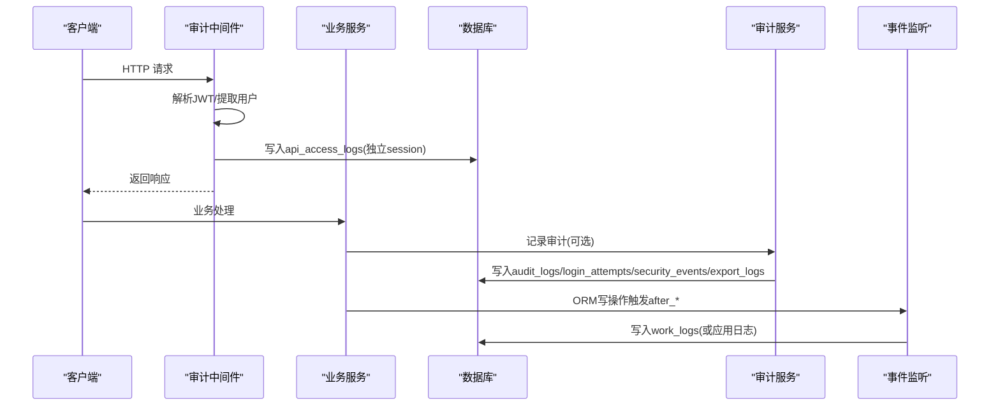
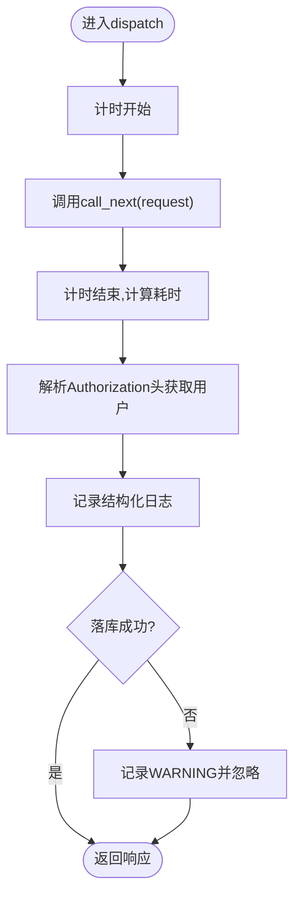
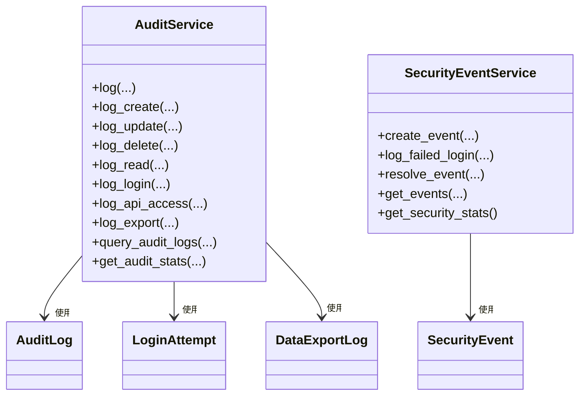
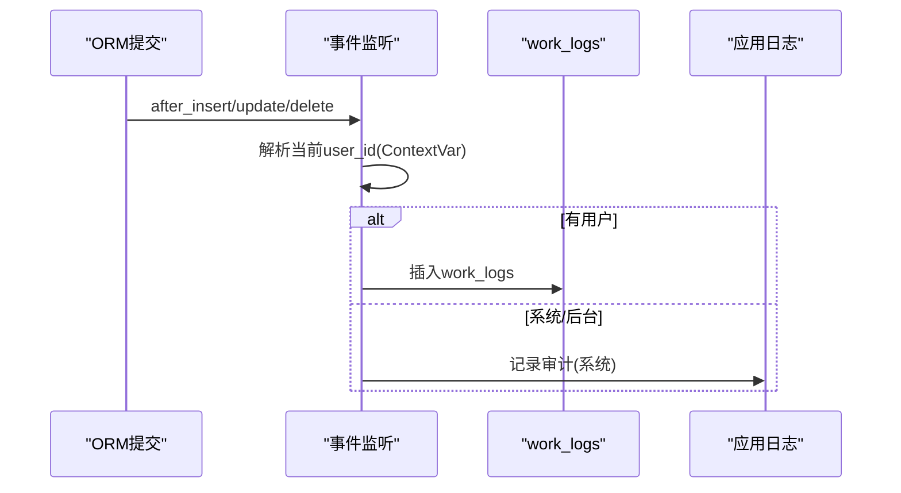
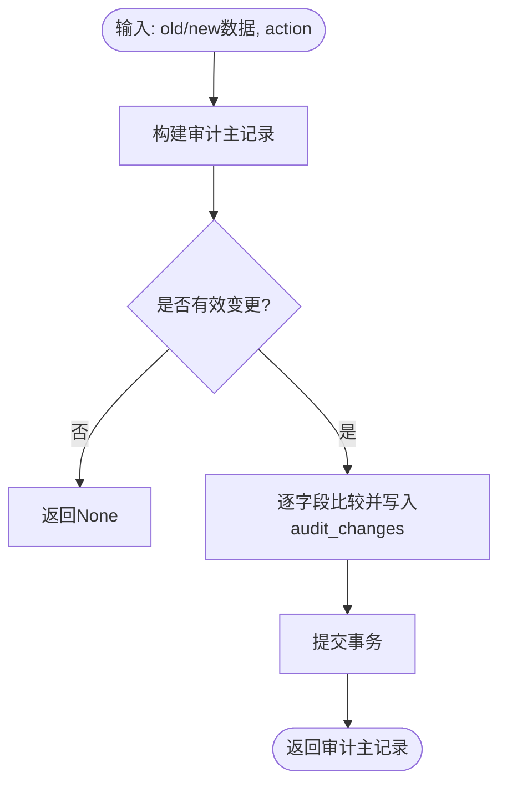
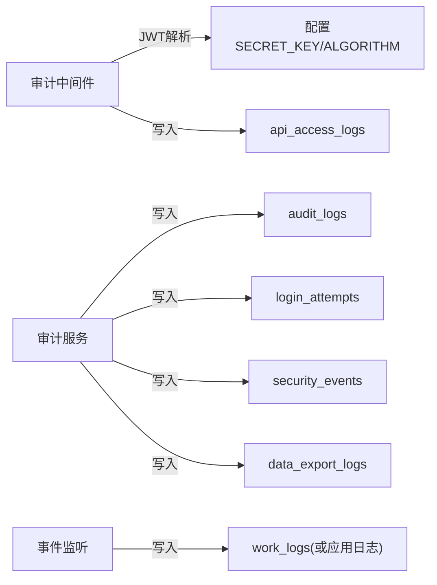

# 审计中间件

<cite>
**本文引用的文件**
- [backend/app/core/audit_middleware.py](file://backend/app/core/audit_middleware.py)
- [backend/app/middleware/audit_context.py](file://backend/app/middleware/audit_context.py)
- [backend/app/models/audit.py](file://backend/app/models/audit.py)
- [backend/app/models/audit_change.py](file://backend/app/models/audit_change.py)
- [backend/app/services/audit_service.py](file://backend/app/services/audit_service.py)
- [backend/app/services/audit_event_handler.py](file://backend/app/services/audit_event_handler.py)
- [backend/app/services/audit_enhancement_service.py](file://backend/app/services/audit_enhancement_service.py)
- [backend/app/api/v1/system/audit.py](file://backend/app/api/v1/system/audit.py)
- [backend/app/utils/audit_logger.py](file://backend/app/utils/audit_logger.py)
- [backend/app/core/pii_crypto.py](file://backend/app/core/pii_crypto.py)
- [backend/app/core/config.py](file://backend/app/core/config.py)
</cite>

## 目录
1. [简介](#简介)
2. [项目结构](#项目结构)
3. [核心组件](#核心组件)
4. [架构总览](#架构总览)
5. [详细组件分析](#详细组件分析)
6. [依赖关系分析](#依赖关系分析)
7. [性能考量](#性能考量)
8. [故障排查指南](#故障排查指南)
9. [结论](#结论)
10. [附录](#附录)

## 简介
本文件面向“审计中间件”与相关审计能力，系统性说明：
- 操作审计日志的记录机制（用户行为追踪、数据变更审计、安全事件记录）
- 审计上下文管理、结构化格式、敏感信息脱敏策略
- 审计规则配置、自定义审计事件、审计数据的查询与分析
- 存储策略、性能影响评估、合规性要求
- 数据分析方法、异常行为检测、安全事件响应流程

## 项目结构
后端围绕 FastAPI 构建，审计能力由“中间件 + 服务 + 模型 + API + 工具”分层实现：
- 中间件层：请求级访问日志、审计上下文注入
- 服务层：统一审计写入、字段级变更 Diff、SQLAlchemy 事件自动审计、安全事件处理
- 模型层：审计主表、变更记录、登录尝试、API 访问、导出日志等
- API 层：审计日志与安全事件的查询、导出、删除、统计
- 工具层：通用审计日志工具、PII 加密、配置项

图表来源
- [backend/app/core/audit_middleware.py:11-44](file://backend/app/core/audit_middleware.py#L11-L44)
- [backend/app/middleware/audit_context.py:15-58](file://backend/app/middleware/audit_context.py#L15-L58)
- [backend/app/services/audit_service.py:58-229](file://backend/app/services/audit_service.py#L58-L229)
- [backend/app/services/audit_event_handler.py:132-175](file://backend/app/services/audit_event_handler.py#L132-L175)
- [backend/app/models/audit.py:53-205](file://backend/app/models/audit.py#L53-L205)
- [backend/app/models/audit_change.py:13-33](file://backend/app/models/audit_change.py#L13-L33)

章节来源
- [backend/app/core/audit_middleware.py:11-44](file://backend/app/core/audit_middleware.py#L11-L44)
- [backend/app/middleware/audit_context.py:15-58](file://backend/app/middleware/audit_context.py#L15-L58)
- [backend/app/services/audit_service.py:58-229](file://backend/app/services/audit_service.py#L58-L229)
- [backend/app/services/audit_event_handler.py:132-175](file://backend/app/services/audit_event_handler.py#L132-L175)
- [backend/app/models/audit.py:53-205](file://backend/app/models/audit.py#L53-L205)
- [backend/app/models/audit_change.py:13-33](file://backend/app/models/audit_change.py#L13-L33)

## 核心组件
- 审计中间件：捕获每次 HTTP 请求的元数据（方法、路径、状态码、耗时、用户身份、IP、UA），并落库到 api_access_logs。失败不破坏业务请求。
- 审计上下文：通过 ContextVar 维护当前请求的用户ID与请求ID，供后续服务与事件处理器归因。
- 审计服务：提供统一的审计写入接口（创建/更新/删除/读取/登录/API调用/导出），以及登录尝试、安全事件、统计与查询。
- SQLAlchemy 事件监听：在应用启动时注册 after_insert/update/delete 监听器，自动为关键实体写工作日志（work_logs），系统/后台任务走应用日志避免外键约束问题。
- 审计增强服务：对关键实体进行字段级 Diff 留痕，生成 audit_changes 明细。
- 审计 API：提供审计日志与安全事件的查询、导出、删除、统计、登录尝试查看等管理员接口。
- 审计工具：通用审计日志工具，同时写入 Python 日志与数据库；支持敏感操作标记级别。
- PII 加密：对敏感字段采用确定性加密（AES-SIV），以密文前缀识别，保障等值查询与跨机一致性。

章节来源
- [backend/app/core/audit_middleware.py:11-109](file://backend/app/core/audit_middleware.py#L11-L109)
- [backend/app/middleware/audit_context.py:15-58](file://backend/app/middleware/audit_context.py#L15-L58)
- [backend/app/services/audit_service.py:58-510](file://backend/app/services/audit_service.py#L58-L510)
- [backend/app/services/audit_event_handler.py:22-175](file://backend/app/services/audit_event_handler.py#L22-L175)
- [backend/app/services/audit_enhancement_service.py:20-215](file://backend/app/services/audit_enhancement_service.py#L20-L215)
- [backend/app/api/v1/system/audit.py:19-615](file://backend/app/api/v1/system/audit.py#L19-L615)
- [backend/app/utils/audit_logger.py:60-297](file://backend/app/utils/audit_logger.py#L60-L297)
- [backend/app/core/pii_crypto.py:1-94](file://backend/app/core/pii_crypto.py#L1-L94)

## 架构总览
审计体系遵循“无侵入式采集 + 集中式写入 + 可观测可查询”的设计：
- 请求入口：中间件拦截所有 HTTP 请求，提取用户身份（JWT），记录访问日志并落库。
- 业务侧：服务层提供标准审计写入接口；关键实体变更通过 SQLAlchemy 事件自动写 work_logs；增强服务记录字段级变更。
- 安全侧：登录失败、暴力破解等安全事件统一写入 security_events，并提供解决与统计。
- 查询与导出：管理员 API 提供多维度查询、导出（JSON/Excel/CSV）、批量删除、统计面板。

图表来源
- [backend/app/core/audit_middleware.py:18-44](file://backend/app/core/audit_middleware.py#L18-L44)
- [backend/app/services/audit_service.py:62-229](file://backend/app/services/audit_service.py#L62-L229)
- [backend/app/services/audit_event_handler.py:120-175](file://backend/app/services/audit_event_handler.py#L120-L175)
- [backend/app/models/audit.py:53-205](file://backend/app/models/audit.py#L53-L205)

## 详细组件分析

### 审计中间件（HTTP 访问审计）
- 功能要点
  - 记录请求方法、路径、状态码、耗时、用户身份（从 Authorization Bearer 中解析 JWT）、IP、UA。
  - 使用独立短会话将访问日志写入 api_access_logs，失败仅记录警告，不影响业务。
  - 解析 JWT 时关闭过期校验，确保审计可记录未认证或过期请求。
- 关键流程
  - 计算耗时 → 提取用户 → 记录日志 → 落库 → 返回响应。
- 错误处理
  - 任何异常均被捕获并记录 WARNING，保证业务高可用。

图表来源
- [backend/app/core/audit_middleware.py:18-109](file://backend/app/core/audit_middleware.py#L18-L109)

章节来源
- [backend/app/core/audit_middleware.py:11-109](file://backend/app/core/audit_middleware.py#L11-L109)

### 审计上下文（ContextVar）
- 作用
  - 在当前请求上下文中保存 user_id 与 request_id，供后续服务与事件处理器归因。
- 使用方式
  - 通过 set_current_user/set_request_id 设置，get_current_user/get_request_id 读取。
  - 事件处理器在 after_* 回调中读取当前用户，若为空则判定为系统/后台任务。

章节来源
- [backend/app/middleware/audit_context.py:15-58](file://backend/app/middleware/audit_context.py#L15-L58)
- [backend/app/services/audit_event_handler.py:22-39](file://backend/app/services/audit_event_handler.py#L22-L39)

### 审计服务（统一写入与查询）
- 主要能力
  - 通用 log() 及便捷方法：log_create/log_update/log_delete/log_read/log_login/log_api_access/log_export。
  - 登录尝试记录：同时写入 login_attempts 与 audit_logs。
  - 安全事件：创建、按严重等级分类、批量查询、统计、解决。
  - 审计统计：按动作/状态/级别聚合、活跃用户、近期活动、今日操作数等。
- 数据结构
  - AuditLog、LoginAttempt、SecurityEvent、DataExportLog、APIAccessLog。
- 查询与分页
  - 支持按用户、动作、资源类型、时间范围、状态、级别过滤，分页返回。

图表来源
- [backend/app/services/audit_service.py:58-510](file://backend/app/services/audit_service.py#L58-L510)
- [backend/app/models/audit.py:53-205](file://backend/app/models/audit.py#L53-L205)

章节来源
- [backend/app/services/audit_service.py:58-510](file://backend/app/services/audit_service.py#L58-L510)
- [backend/app/models/audit.py:53-205](file://backend/app/models/audit.py#L53-L205)

### SQLAlchemy 事件监听（自动审计）
- 机制
  - 应用启动时注册 after_insert/update/delete 监听器，覆盖多个核心模型。
  - 根据 ContextVar 解析当前操作人；系统/后台任务无法写入 work_logs（外键 NOT NULL）时降级为应用日志。
- 价值
  - 无需在每个端点手动写日志，降低遗漏风险，提升一致性。

图表来源
- [backend/app/services/audit_event_handler.py:120-175](file://backend/app/services/audit_event_handler.py#L120-L175)
- [backend/app/middleware/audit_context.py:22-58](file://backend/app/middleware/audit_context.py#L22-L58)

章节来源
- [backend/app/services/audit_event_handler.py:22-175](file://backend/app/services/audit_event_handler.py#L22-L175)

### 审计增强服务（字段级变更 Diff）
- 能力
  - 一键记录实体变更：创建审计主记录 + 字段级差异明细（audit_changes）。
  - 支持 create/update/delete 三种场景，自动过滤 id/created_at/updated_at 等无关字段。
  - 提供变更历史查询接口，按资源类型与 ID 拉取最近 N 条记录及其字段变化。
- 序列化
  - 将 datetime、list/dict 等序列化为 JSON 兼容格式，便于存储与展示。

图表来源
- [backend/app/services/audit_enhancement_service.py:20-215](file://backend/app/services/audit_enhancement_service.py#L20-L215)
- [backend/app/models/audit_change.py:13-33](file://backend/app/models/audit_change.py#L13-L33)

章节来源
- [backend/app/services/audit_enhancement_service.py:20-215](file://backend/app/services/audit_enhancement_service.py#L20-L215)
- [backend/app/models/audit_change.py:13-33](file://backend/app/models/audit_change.py#L13-L33)

### 审计 API（查询、导出、管理）
- 能力
  - 审计日志：分页查询、详情、备注更新、批量删除、导出（JSON/Excel/CSV）。
  - 安全事件：查询、解决、统计。
  - 登录尝试：按用户名/IP/时间范围查询。
  - API 访问日志：按用户/端点/时间范围查询。
  - 导出日志：按用户/类型/时间范围查询。
  - 用户活动：指定用户近 N 天活动统计。
- 权限控制
  - 多数接口需管理员角色（admin/super_admin），部分接口允许本人查看自身活动。

章节来源
- [backend/app/api/v1/system/audit.py:19-615](file://backend/app/api/v1/system/audit.py#L19-L615)

### 审计工具（通用审计日志）
- 能力
  - 同时写入 Python 日志与数据库（audit_logs、login_attempts）。
  - 提供便捷方法：登录、数据变更、敏感操作、权限变更。
  - 独立 session 持久化，失败回滚并记录错误，不影响主流程。

章节来源
- [backend/app/utils/audit_logger.py:60-297](file://backend/app/utils/audit_logger.py#L60-L297)

### 敏感信息脱敏与加密
- 策略
  - 审计日志中的敏感字段建议通过上层服务进行脱敏后再写入。
  - 针对 PII 字段采用确定性加密（AES-SIV），密文带前缀标识，支持等值查询与跨机一致。
  - 解密失败时原样返回并记录错误，避免阻断流程。
- 配置
  - 可通过 ENCRYPTION_KEY 或运行时密钥存储加载密钥；默认使用 PBKDF2 派生。

章节来源
- [backend/app/core/pii_crypto.py:1-94](file://backend/app/core/pii_crypto.py#L1-L94)
- [backend/app/core/config.py:88-93](file://backend/app/core/config.py#L88-L93)

## 依赖关系分析
- 中间件依赖
  - 从 Authorization 头解析 JWT，依赖 SECRET_KEY 与 ALGORITHM。
  - 使用独立 SessionLocal 写入 api_access_logs，失败不抛错。
- 服务依赖
  - 统一使用 safe_commit 提交事务，确保审计写入与业务解耦。
  - 事件监听依赖 ContextVar 提供的当前用户归属。
- 模型依赖
  - 多张审计表通过索引优化查询（用户、时间、动作、资源等）。
- API 依赖
  - 路由层负责参数校验、权限检查，调用服务完成查询与导出。

图表来源
- [backend/app/core/audit_middleware.py:46-109](file://backend/app/core/audit_middleware.py#L46-L109)
- [backend/app/services/audit_service.py:62-229](file://backend/app/services/audit_service.py#L62-L229)
- [backend/app/services/audit_event_handler.py:132-175](file://backend/app/services/audit_event_handler.py#L132-L175)
- [backend/app/models/audit.py:53-205](file://backend/app/models/audit.py#L53-L205)

章节来源
- [backend/app/core/audit_middleware.py:46-109](file://backend/app/core/audit_middleware.py#L46-L109)
- [backend/app/services/audit_service.py:62-229](file://backend/app/services/audit_service.py#L62-L229)
- [backend/app/services/audit_event_handler.py:132-175](file://backend/app/services/audit_event_handler.py#L132-L175)
- [backend/app/models/audit.py:53-205](file://backend/app/models/audit.py#L53-L205)

## 性能考量
- 中间件落库
  - 使用独立短会话，失败不阻塞业务；在高并发下建议关注数据库写入吞吐与连接池配置。
- 事件监听
  - 自动写 work_logs 可能带来额外 I/O；对于高频写模型需评估索引与写入放大。
- 查询与导出
  - 审计日志导出限制最大行数（如 5000），避免大结果集拖慢接口；分页查询配合索引提升性能。
- 配置参考
  - 连接池大小、超时、回收周期等可在配置中调整，结合压测确定合理阈值。

[本节为通用指导，不直接分析具体文件]

## 故障排查指南
- 审计中间件落库失败
  - 现象：日志中出现 WARNING 提示 api_access_logs 落库失败。
  - 排查：检查数据库连接、表结构、权限；确认独立 session 正常关闭。
- 事件监听写入失败
  - 现象：系统/后台任务审计未落入 work_logs。
  - 排查：确认 ContextVar 是否为空；若为空会降级为应用日志；检查外键约束与目标表结构。
- 审计 API 权限错误
  - 现象：403 禁止访问。
  - 排查：确认当前用户角色为 admin/super_admin；检查路由注册顺序（静态路由需在动态路由之前）。
- 登录失败安全事件
  - 现象：频繁出现 multiple_failed_logins 或 brute_force_attempt。
  - 排查：结合 IP 与用户名定位来源；必要时封禁或加强验证码。

章节来源
- [backend/app/core/audit_middleware.py:80-109](file://backend/app/core/audit_middleware.py#L80-L109)
- [backend/app/services/audit_event_handler.py:93-118](file://backend/app/services/audit_event_handler.py#L93-L118)
- [backend/app/api/v1/system/audit.py:80-170](file://backend/app/api/v1/system/audit.py#L80-L170)
- [backend/app/services/audit_service.py:411-443](file://backend/app/services/audit_service.py#L411-L443)

## 结论
该审计体系通过中间件、服务、事件监听与 API 形成闭环：
- 无侵入采集：中间件与事件监听确保全量访问与关键变更可追溯。
- 结构化记录：统一模型与枚举，便于查询、统计与合规审计。
- 安全与合规：敏感字段加密、登录失败告警、安全事件闭环管理。
- 可扩展：支持自定义审计事件与增强 Diff，满足复杂业务需求。

[本节为总结，不直接分析具体文件]

## 附录

### 审计日志结构与字段说明
- 审计主表（audit_logs）
  - 关键字段：用户ID/用户名/IP/UA、动作、资源类型/ID、旧值/新值、状态、级别、请求路径/方法/状态码、耗时、元数据、会话ID、追踪ID、时间戳。
- API 访问日志（api_access_logs）
  - 关键字段：用户ID/用户名、端点、方法、请求参数/体、响应状态码、耗时、IP/UA、会话ID、时间戳。
- 登录尝试（login_attempts）
  - 关键字段：用户名、IP、UA、是否成功、失败原因、尝试时间。
- 安全事件（security_events）
  - 关键字段：事件类型、严重等级、来源IP、用户、描述、详情、受影响资源、是否解决、解决时间与人员、解决备注、时间戳。
- 导出日志（data_export_logs）
  - 关键字段：用户ID/用户名、导出类型、数据类型、过滤器、文件格式、记录数、文件大小、文件路径、状态、错误信息、时间戳。
- 变更记录（audit_changes）
  - 关键字段：关联审计日志ID、字段名、旧值/新值、变更类型、时间戳。

章节来源
- [backend/app/models/audit.py:53-205](file://backend/app/models/audit.py#L53-L205)
- [backend/app/models/audit_change.py:13-33](file://backend/app/models/audit_change.py#L13-L33)

### 审计规则与自定义事件
- 规则配置
  - 通过服务层的 log_* 方法定义动作、资源、上下文、级别等；事件监听覆盖核心模型，减少遗漏。
- 自定义事件
  - 可在业务中调用 AuditService.log() 或工具类 AuditLogger.log() 记录自定义审计事件；安全事件通过 SecurityEventService.create_event() 记录。
- 级别与状态
  - 使用统一枚举（AuditAction/AuditLevel/AuditStatus）规范记录，便于前端展示与后端统计。

章节来源
- [backend/app/services/audit_service.py:62-229](file://backend/app/services/audit_service.py#L62-L229)
- [backend/app/utils/audit_logger.py:60-297](file://backend/app/utils/audit_logger.py#L60-L297)
- [backend/app/services/audit_event_handler.py:132-175](file://backend/app/services/audit_event_handler.py#L132-L175)

### 存储策略与合规性
- 存储策略
  - 访问日志与审计日志分离，分别用于性能分析与合规审计；导出日志单独记录以便追踪数据外发。
- 合规性
  - 登录失败与安全事件记录满足安全基线；PII 字段加密满足隐私保护；审计不可篡改（建议结合外部日志归档与只读存储）。
- 保留与清理
  - 可通过 API 批量删除历史日志；建议结合定时任务与归档策略，平衡成本与合规。

章节来源
- [backend/app/models/audit.py:53-205](file://backend/app/models/audit.py#L53-L205)
- [backend/app/api/v1/system/audit.py:80-170](file://backend/app/api/v1/system/audit.py#L80-L170)
- [backend/app/core/pii_crypto.py:1-94](file://backend/app/core/pii_crypto.py#L1-L94)

### 数据分析方法与异常检测
- 分析方法
  - 按动作/状态/级别聚合统计；按用户维度统计活跃度；按端点统计访问热度；按时间趋势观察异常峰值。
- 异常检测
  - 登录失败频率超过阈值触发安全事件；同一 IP/用户短时间多次失败视为暴力破解；导出量突增需关注数据泄露风险。
- 响应流程
  - 安全事件创建后，管理员可查询并标记解决，记录解决备注；必要时联动封禁策略或告警通知。

章节来源
- [backend/app/services/audit_service.py:317-510](file://backend/app/services/audit_service.py#L317-L510)
- [backend/app/api/v1/system/audit.py:395-476](file://backend/app/api/v1/system/audit.py#L395-L476)