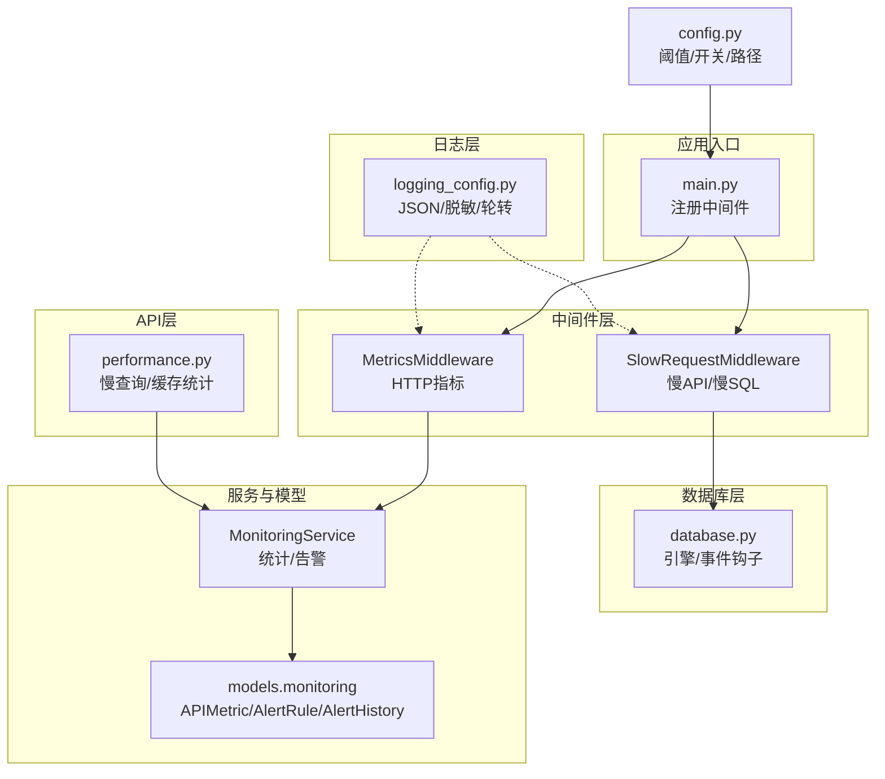
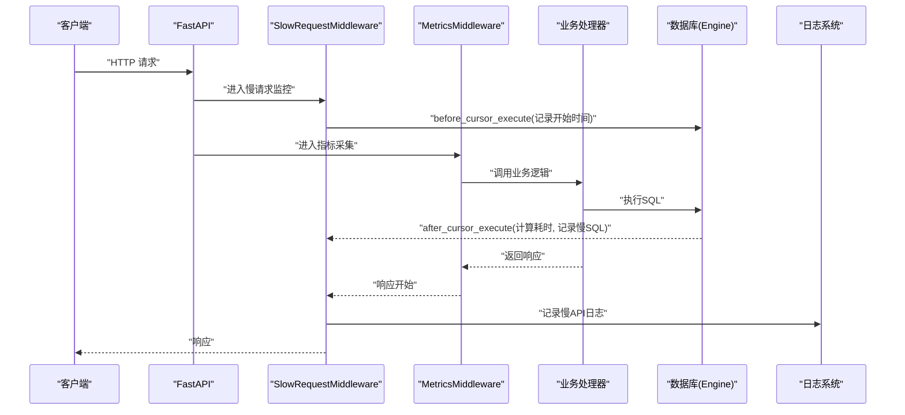
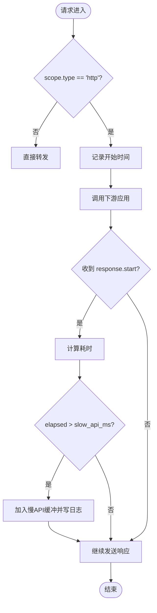
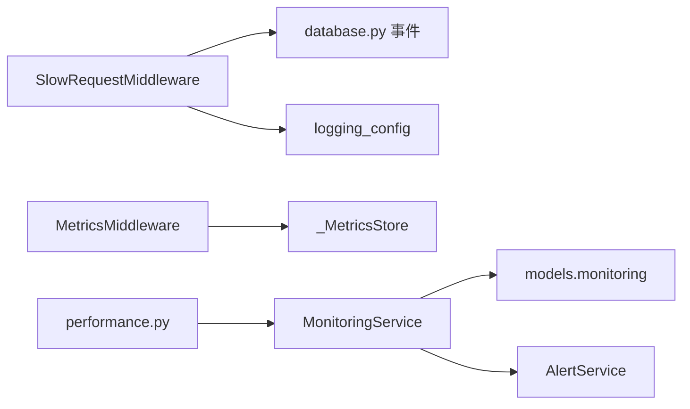

# 慢请求监控中间件

<cite>
**本文引用的文件**
- [slow_request_monitor.py](file://backend/app/middleware/slow_request_monitor.py)
- [metrics_middleware.py](file://backend/app/middleware/metrics_middleware.py)
- [logging_config.py](file://backend/app/core/logging_config.py)
- [config.py](file://backend/app/core/config.py)
- [main.py](file://backend/app/main.py)
- [monitoring.py](file://backend/app/models/monitoring.py)
- [monitoring_service.py](file://backend/app/services/monitoring_service.py)
- [performance.py](file://backend/app/api/v1/performance.py)
- [database.py](file://backend/app/core/database.py)
</cite>

## 目录
1. [简介](#简介)
2. [项目结构](#项目结构)
3. [核心组件](#核心组件)
4. [架构总览](#架构总览)
5. [详细组件分析](#详细组件分析)
6. [依赖关系分析](#依赖关系分析)
7. [性能考量](#性能考量)
8. [故障排查指南](#故障排查指南)
9. [结论](#结论)
10. [附录](#附录)

## 简介
本文件面向“慢请求监控中间件”的完整实现与使用，覆盖以下目标：
- 如何检测并记录慢请求（API 与 SQL）
- 响应时间阈值配置、请求链路追踪、性能瓶颈识别
- 慢请求分类统计、告警机制、日志记录格式
- 结合 APM 进行性能分析与根因定位、优化建议
- 指标收集方式、数据存储策略、可视化报表生成
- 性能调优指南与常见问题排查方法

## 项目结构
围绕慢请求监控的关键代码分布在中间件层、配置层、日志层、模型与服务层以及 API 暴露层。整体组织遵循“中间件采集 + 服务聚合 + 持久化存储 + 接口暴露”的分层模式。

图表来源
- [main.py:113-165](file://backend/app/main.py#L113-L165)
- [slow_request_monitor.py:55-131](file://backend/app/middleware/slow_request_monitor.py#L55-L131)
- [metrics_middleware.py:128-177](file://backend/app/middleware/metrics_middleware.py#L128-L177)
- [database.py:70-76](file://backend/app/core/database.py#L70-L76)
- [monitoring_service.py:26-312](file://backend/app/services/monitoring_service.py#L26-L312)
- [monitoring.py:22-84](file://backend/app/models/monitoring.py#L22-L84)
- [performance.py:16-118](file://backend/app/api/v1/performance.py#L16-L118)
- [logging_config.py:161-274](file://backend/app/core/logging_config.py#L161-L274)

章节来源
- [main.py:113-165](file://backend/app/main.py#L113-L165)
- [config.py:161-199](file://backend/app/core/config.py#L161-L199)

## 核心组件
- 慢请求监控中间件（SlowRequestMiddleware）
  - 职责：拦截 HTTP 响应开始阶段，计算耗时；通过 SQLAlchemy 事件捕获慢 SQL；超过阈值的记录入内存环形缓冲并写日志。
  - 关键能力：可配置 slow_api_ms、slow_sql_ms；最近 N 条慢记录查询；基础计数器。
- 指标采集中间件（MetricsMiddleware）
  - 职责：统一采集 HTTP 请求计数、错误率、活跃请求数、按端点耗时、慢请求列表等指标。
  - 关键能力：线程安全存储、跳过健康/指标自身路径、提供汇总摘要。
- 监控服务（MonitoringService）
  - 职责：基于 APIMetric 表做历史统计（平均、P50/P95/P99、错误率）、端点排行、资源统计、规则检查与告警触发。
  - 关键能力：支持邮件/Webhook 通知；后台任务发送避免阻塞主流程。
- 数据模型（APIMetric/AlertRule/AlertHistory）
  - 职责：持久化 API 指标、告警规则与告警历史。
- 日志系统（logging_config）
  - 职责：统一初始化 JSON/文本日志、敏感信息脱敏、按天/大小轮转。
- 配置（config）
  - 职责：提供日志、监控、告警、数据库等全局配置项。

章节来源
- [slow_request_monitor.py:1-132](file://backend/app/middleware/slow_request_monitor.py#L1-L132)
- [metrics_middleware.py:1-177](file://backend/app/middleware/metrics_middleware.py#L1-L177)
- [monitoring_service.py:1-312](file://backend/app/services/monitoring_service.py#L1-L312)
- [monitoring.py:1-84](file://backend/app/models/monitoring.py#L1-L84)
- [logging_config.py:1-274](file://backend/app/core/logging_config.py#L1-L274)
- [config.py:1-383](file://backend/app/core/config.py#L1-L383)

## 架构总览
慢请求监控的整体流程如下：
- 请求进入 FastAPI，依次经过各中间件（包括慢请求监控与指标采集）。
- SlowRequestMiddleware 在响应开始时计算耗时，若超过 slow_api_ms 则记录慢 API；同时通过 SQLAlchemy before/after_cursor_execute 事件捕获慢 SQL。
- MetricsMiddleware 记录总体指标与慢请求列表。
- MonitoringService 定时或按需读取 APIMetric 表进行统计与告警判定，并通过 AlertService 发送邮件/Webhook。
- 日志由 logging_config 统一输出，包含结构化 JSON 与敏感信息脱敏。

图表来源
- [slow_request_monitor.py:70-101](file://backend/app/middleware/slow_request_monitor.py#L70-L101)
- [slow_request_monitor.py:103-131](file://backend/app/middleware/slow_request_monitor.py#L103-L131)
- [metrics_middleware.py:142-177](file://backend/app/middleware/metrics_middleware.py#L142-L177)
- [database.py:70-76](file://backend/app/core/database.py#L70-L76)

## 详细组件分析

### 慢请求监控中间件（SlowRequestMiddleware）
- 功能要点
  - 通过 ASGI __call__ 包装 send，在 http.response.start 时计算 elapsed_ms，超过 slow_api_ms 即记录到内存环形缓冲并写日志。
  - 通过 SQLAlchemy event 监听 before_cursor_execute/after_cursor_execute，计算 SQL 耗时，超过 slow_sql_ms 记录慢 SQL。
  - 提供 get_slow_api_records/get_slow_sql_records/get_slow_stats 用于查询最近记录与统计摘要。
- 数据结构与复杂度
  - 使用 deque(maxlen=200) 作为环形缓冲，追加 O(1)，取前 N 条 O(N)。
  - 计数器为简单字典，更新 O(1)。
- 依赖链
  - 依赖 app.core.database.engine 以安装事件监听；依赖 logging.getLogger("performance.slow") 输出日志。
- 错误处理
  - 安装 SQLAlchemy 监听器失败时仅记录 debug 日志，不影响启动。
- 性能影响
  - 仅在响应开始阶段与 SQL 执行前后有轻量计算与写入，对正常路径开销极小。

图表来源
- [slow_request_monitor.py:103-131](file://backend/app/middleware/slow_request_monitor.py#L103-L131)

章节来源
- [slow_request_monitor.py:1-132](file://backend/app/middleware/slow_request_monitor.py#L1-L132)

### 指标采集中间件（MetricsMiddleware）
- 功能要点
  - 记录请求计数、错误计数、活跃请求数、总耗时、按端点耗时、慢请求列表（默认阈值 1s）。
  - 提供 _MetricsStore.get_summary() 获取汇总数据，供 /metrics 或内部消费。
- 线程安全
  - 使用 threading.Lock 保护共享状态。
- 性能影响
  - 每次请求仅做少量加法与字典操作，开销极低。

章节来源
- [metrics_middleware.py:1-177](file://backend/app/middleware/metrics_middleware.py#L1-L177)

### 监控服务（MonitoringService）
- 功能要点
  - 从 APIMetric 表统计过去 N 小时的平均响应时间、百分位、错误率、端点排行。
  - 检查 AlertRule 规则（响应时间、错误率、资源），触发告警并记录 AlertHistory。
  - 通过 AlertService 发送邮件/Webhook，异步发送不阻塞主流程。
- 数据模型
  - APIMetric：endpoint/method/response_time_ms/status_code/timestamp/user_id/error_message
  - AlertRule：name/metric_type/threshold/duration_seconds/channels/webhook_url/email_recipients/enabled
  - AlertHistory：rule_id/triggered_at/resolved_at/message/metric_value/status
- 性能考虑
  - 统计查询使用 GROUP BY 与时间范围过滤，建议在 timestamp/endpoint/status_code 上建立索引以提升性能。

章节来源
- [monitoring_service.py:1-312](file://backend/app/services/monitoring_service.py#L1-L312)
- [monitoring.py:1-84](file://backend/app/models/monitoring.py#L1-L84)

### 日志系统（logging_config）
- 功能要点
  - 统一初始化日志级别、格式（JSON/文本）、文件轮转（按天/按大小）。
  - 内置敏感信息脱敏过滤器（身份证、手机号、邮箱、口令/令牌键值对）。
  - Windows 下 SafeTimedRotatingFileHandler/SafeRotatingFileHandler 重试避免 WinError 32。
- 与慢请求的关系
  - SlowRequestMiddleware 与 MetricsMiddleware 的日志均受此配置管理，确保结构化与脱敏。

章节来源
- [logging_config.py:1-274](file://backend/app/core/logging_config.py#L1-L274)

### 配置（config）
- 相关配置项
  - LOG_LEVEL/LOG_FORMAT/LOG_FILE/LOG_ROTATION/LOG_MAX_SIZE_MB/LOG_BACKUP_COUNT：控制日志行为。
  - METRICS_ENABLED/METRICS_PORT：是否启用指标与端口（具体暴露由路由决定）。
  - ALERT_EMAIL_RECIPIENTS/ALERT_WEBHOOK_URL/ALERT_WEBHOOK_TYPE：告警通道配置。
  - SLOW_QUERY_THRESHOLD_MS：慢查询阈值（脚本与基准测试使用）。
- 生产环境安全基线
  - 强制关闭 DB_ECHO，防止敏感 SQL 落入日志。

章节来源
- [config.py:161-199](file://backend/app/core/config.py#L161-L199)
- [config.py:301-310](file://backend/app/core/config.py#L301-L310)

### 数据库事件与慢 SQL 捕获
- 通过 database.py 中的 after_cursor_execute 事件将 SQL 执行回调给 query_counter 中间件；SlowRequestMiddleware 也通过 engine.sync_engine 的事件监听捕获慢 SQL。
- SQLite PRAGMA 调优（WAL、mmap_size、cache_size、busy_timeout）有助于降低慢 SQL 概率。

章节来源
- [database.py:70-76](file://backend/app/core/database.py#L70-L76)
- [database.py:78-157](file://backend/app/core/database.py#L78-L157)

### 性能监控 API
- performance.py 提供慢查询列表、查询统计、缓存统计与清空缓存等接口，需管理员权限。
- 这些接口便于运维人员快速查看与分析慢请求与缓存状态。

章节来源
- [performance.py:16-118](file://backend/app/api/v1/performance.py#L16-L118)

## 依赖关系分析
- 中间件耦合度
  - SlowRequestMiddleware 与 database.py 通过 SQLAlchemy 事件低耦合集成；与 logging_config 通过 logger 解耦。
  - MetricsMiddleware 独立于业务，仅维护内存指标。
- 外部依赖
  - psutil（资源统计）、AlertService（邮件/Webhook）、SQLAlchemy（数据库事件）。
- 潜在循环依赖
  - 无直接循环导入；模块内延迟导入避免启动期循环。

图表来源
- [slow_request_monitor.py:70-101](file://backend/app/middleware/slow_request_monitor.py#L70-L101)
- [metrics_middleware.py:26-129](file://backend/app/middleware/metrics_middleware.py#L26-L129)
- [monitoring_service.py:18-21](file://backend/app/services/monitoring_service.py#L18-L21)
- [monitoring.py:22-84](file://backend/app/models/monitoring.py#L22-L84)
- [performance.py:16-118](file://backend/app/api/v1/performance.py#L16-L118)

章节来源
- [slow_request_monitor.py:1-132](file://backend/app/middleware/slow_request_monitor.py#L1-L132)
- [metrics_middleware.py:1-177](file://backend/app/middleware/metrics_middleware.py#L1-L177)
- [monitoring_service.py:1-312](file://backend/app/services/monitoring_service.py#L1-L312)
- [monitoring.py:1-84](file://backend/app/models/monitoring.py#L1-L84)
- [performance.py:16-118](file://backend/app/api/v1/performance.py#L16-L118)

## 性能考量
- 中间件开销
  - 仅在最外层与响应开始阶段做轻量计时与计数，环形缓冲固定容量，避免无限增长。
- 数据库层面
  - WAL 模式、合理 busy_timeout、mmap_size/cache_size 提升并发与吞吐。
  - 建议为 APIMetric.timestamp、endpoint、status_code 建立索引，加速历史统计查询。
- 告警与通知
  - 告警发送走后台任务，避免阻塞主请求链路。
- 日志轮转
  - 按天/大小轮转，配合脱敏过滤器，减少 I/O 与安全风险。

[本节为通用指导，无需特定文件引用]

## 故障排查指南
- 现象：未捕获到慢 SQL
  - 可能原因：数据库尚未初始化导致事件监听安装失败。
  - 处理：确认数据库已就绪；查看调试日志中关于“SQLAlchemy 慢 SQL 监听器安装失败”的记录。
- 现象：日志过大或磁盘占用高
  - 调整：设置 LOG_ROTATION、LOG_MAX_SIZE_MB、LOG_BACKUP_COUNT；确认轮转生效。
- 现象：慢请求阈值不合理
  - 调整：根据业务 SLA 调整 slow_api_ms、slow_sql_ms；参考 SLOW_QUERY_THRESHOLD_MS 用于基准测试对比。
- 现象：告警未触发
  - 检查：AlertRule 是否启用、duration_seconds 与 metric_type 是否正确；确认 AlertService 邮件/Webhook 配置有效。
- 现象：Windows 下日志轮转失败
  - 说明：SafeTimedRotatingFileHandler/SafeRotatingFileHandler 已内置重试逻辑；如仍失败，检查杀毒软件/索引器占用。

章节来源
- [slow_request_monitor.py:70-101](file://backend/app/middleware/slow_request_monitor.py#L70-L101)
- [logging_config.py:21-73](file://backend/app/core/logging_config.py#L21-L73)
- [config.py:161-168](file://backend/app/core/config.py#L161-L168)
- [monitoring_service.py:183-312](file://backend/app/services/monitoring_service.py#L183-L312)

## 结论
本系统通过“中间件采集 + 服务聚合 + 持久化存储 + 接口暴露”的架构，实现了零侵入的慢请求监控与告警。借助结构化日志与敏感信息脱敏，既保障可观测性又兼顾安全性。结合数据库层面的 WAL 与 PRAGMA 调优，可有效降低慢请求比例。通过性能 API 与告警机制，能够快速定位瓶颈并进行持续优化。

[本节为总结性内容，无需特定文件引用]

## 附录

### 阈值与配置清单
- 慢请求阈值
  - slow_api_ms：API 响应时间阈值（毫秒）
  - slow_sql_ms：SQL 执行时间阈值（毫秒）
  - SLOW_QUERY_THRESHOLD_MS：基准测试与脚本使用的慢查询阈值
- 日志配置
  - LOG_LEVEL/LOG_FORMAT/LOG_FILE/LOG_ROTATION/LOG_MAX_SIZE_MB/LOG_BACKUP_COUNT
- 告警配置
  - ALERT_EMAIL_RECIPIENTS/SMTP_* /ALERT_WEBHOOK_URL/ALERT_WEBHOOK_TYPE

章节来源
- [config.py:161-199](file://backend/app/core/config.py#L161-L199)
- [config.py:301-310](file://backend/app/core/config.py#L301-L310)

### 监控指标与存储
- 内存指标（MetricsMiddleware）
  - 请求计数、错误计数、活跃请求数、总耗时、按端点耗时、慢请求列表
- 持久化指标（APIMetric）
  - endpoint/method/response_time_ms/status_code/timestamp/user_id/error_message
- 告警规则与历史（AlertRule/AlertHistory）
  - 规则类型：response_time/error_rate/resource
  - 历史状态：triggered/resolved

章节来源
- [metrics_middleware.py:26-129](file://backend/app/middleware/metrics_middleware.py#L26-L129)
- [monitoring.py:22-84](file://backend/app/models/monitoring.py#L22-L84)

### 可视化与报表
- 通过 performance.py 提供的接口获取慢查询与缓存统计，结合前端或 BI 工具进行可视化展示。
- 可基于 APIMetric 表构建历史趋势图、端点排行、错误率曲线等报表。

章节来源
- [performance.py:16-118](file://backend/app/api/v1/performance.py#L16-L118)

### 与 APM 集成建议
- 链路追踪
  - 利用 RequestIDMiddleware 生成的请求 ID，关联日志与 APM 追踪，便于跨层定位。
- 指标对接
  - 将 MetricsMiddleware 的汇总数据导出至 Prometheus/Grafana 或企业监控平台。
- 根因定位
  - 结合慢 SQL 日志与数据库执行计划，定位热点查询与缺失索引。
- 优化建议
  - 针对高频慢端点进行 SQL 优化、引入缓存、分页优化（Keyset 分页替代深 OFFSET）。

[本节为概念性指导，无需特定文件引用]