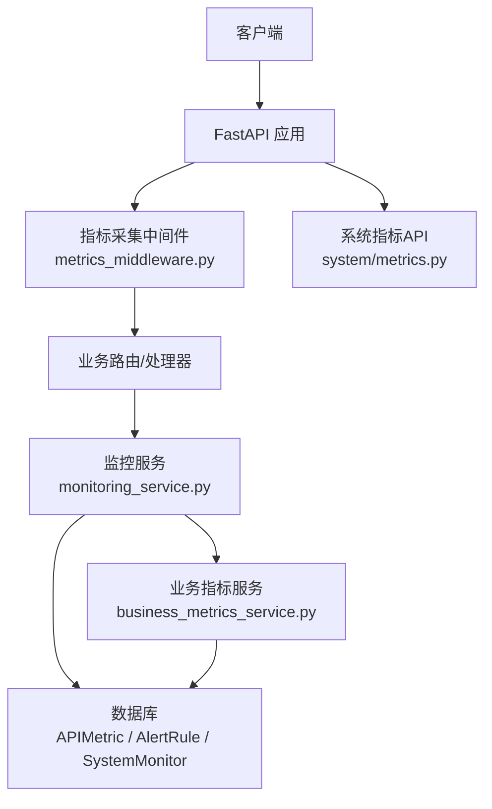
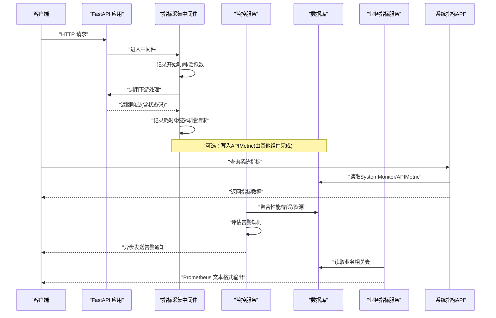
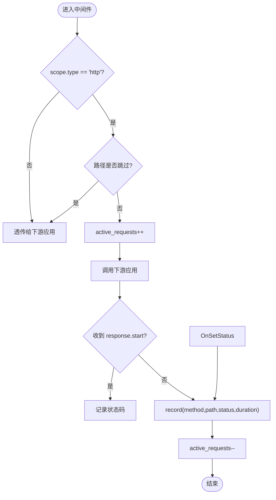
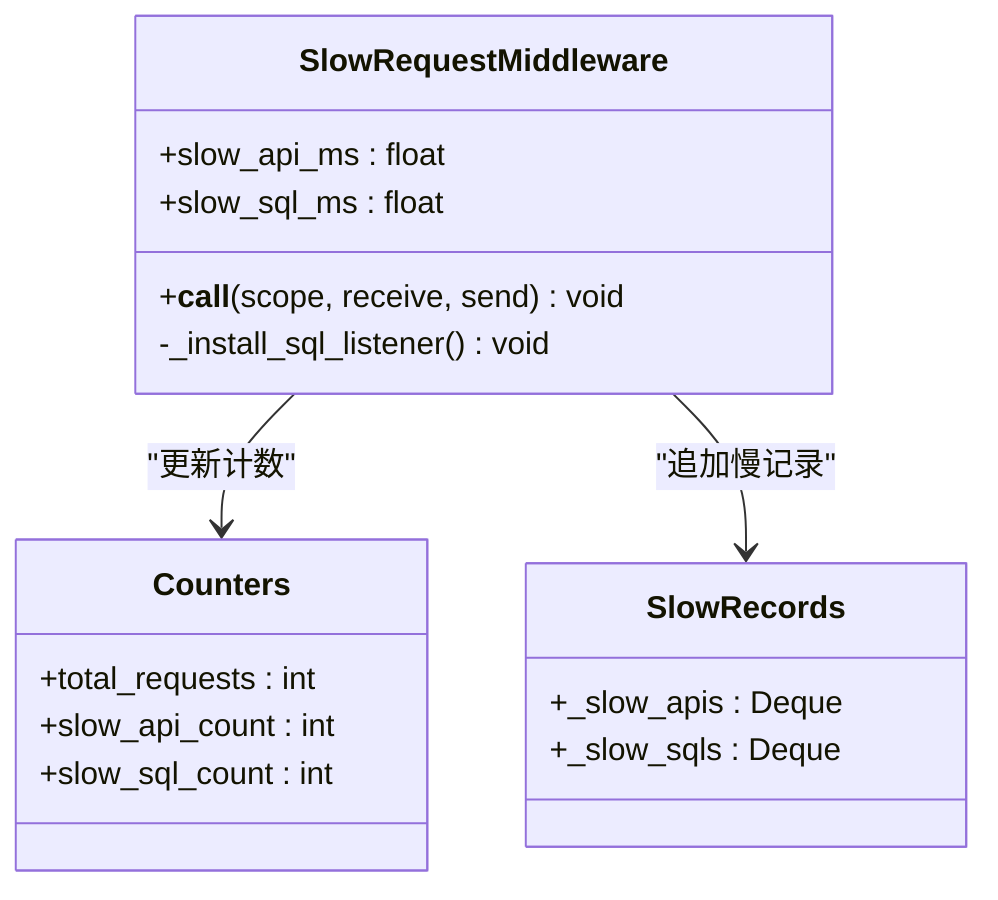
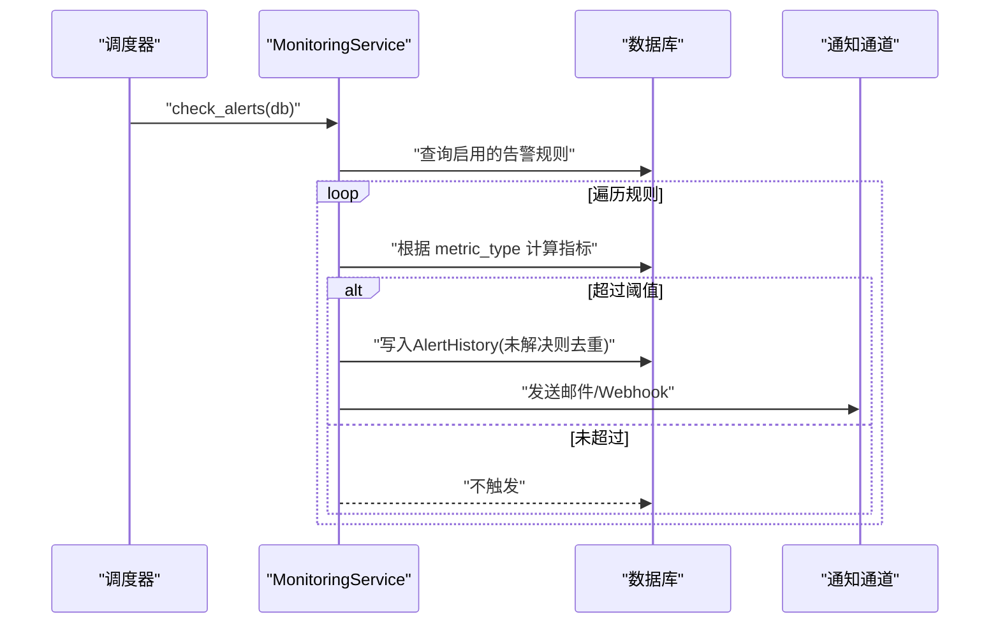
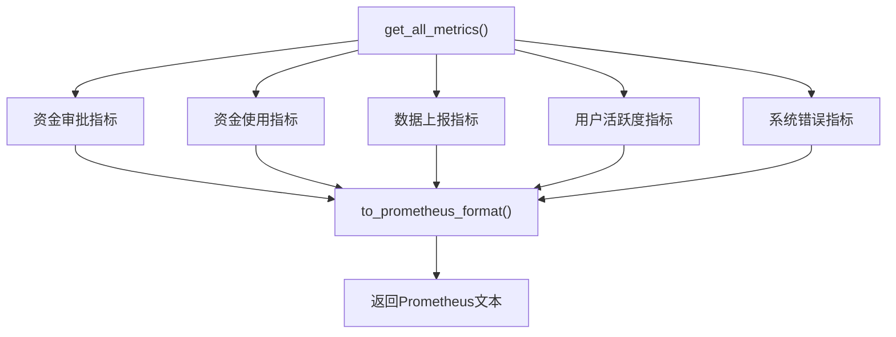
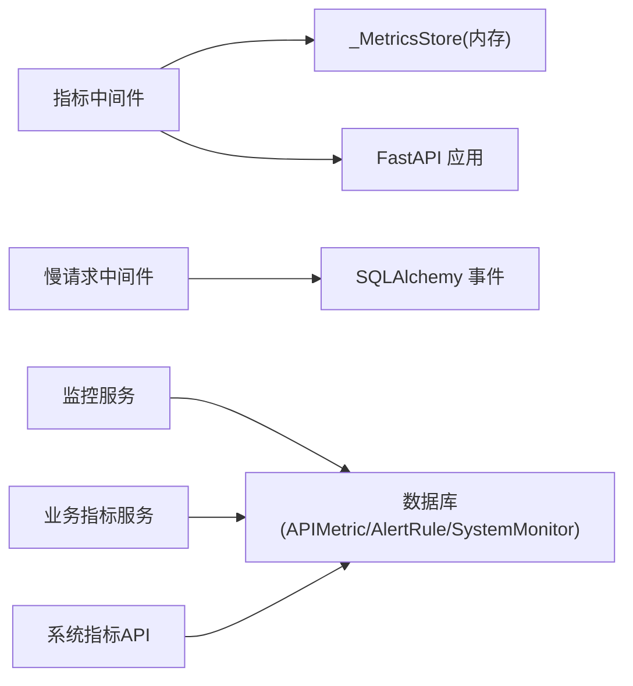

# 指标收集中间件

<cite>
**本文引用的文件**
- [backend/app/middleware/metrics_middleware.py](file://backend/app/middleware/metrics_middleware.py)
- [backend/app/middleware/slow_request_monitor.py](file://backend/app/middleware/slow_request_monitor.py)
- [backend/app/services/monitoring_service.py](file://backend/app/services/monitoring_service.py)
- [backend/app/services/business_metrics_service.py](file://backend/app/services/business_metrics_service.py)
- [backend/app/models/monitoring.py](file://backend/app/models/monitoring.py)
- [backend/app/models/system_monitor.py](file://backend/app/models/system_monitor.py)
- [backend/app/api/v1/system/metrics.py](file://backend/app/api/v1/system/metrics.py)
- [backend/app/core/config.py](file://backend/app/core/config.py)
- [backend/tests/unit/test_cov_final_metrics_middleware.py](file://backend/tests/unit/test_cov_final_metrics_middleware.py)
- [backend/tests/unit/test_monitoring_service.py](file://backend/tests/unit/test_monitoring_service.py)
- [backend/tests/unit/test_system_metrics_api.py](file://backend/tests/unit/test_system_metrics_api.py)
</cite>

## 目录
1. [简介](#简介)
2. [项目结构](#项目结构)
3. [核心组件](#核心组件)
4. [架构总览](#架构总览)
5. [详细组件分析](#详细组件分析)
6. [依赖关系分析](#依赖关系分析)
7. [性能考量](#性能考量)
8. [故障排查指南](#故障排查指南)
9. [结论](#结论)
10. [附录](#附录)

## 简介
本文件面向“指标收集中间件”的完整说明，覆盖请求量统计、响应时间监控、错误率计算、资源使用率跟踪；解释 Prometheus 指标格式与自定义指标定义、标签管理；说明如何配置采集频率、数据保留策略、告警规则设置；并提供可视化展示、趋势分析、容量规划建议，以及性能基准测试、指标解读方法与系统健康监控最佳实践。

## 项目结构
后端采用 ASGI 中间件在请求链路中无侵入地采集 HTTP 指标，并通过服务层聚合业务与系统指标，最终暴露 API 供前端或外部系统消费。关键路径：
- 中间件层：HTTP 请求进入时记录耗时、状态码、活跃数、慢请求等
- 服务层：从数据库读取历史指标并计算百分位、错误率、资源使用率；导出 Prometheus 文本格式
- 模型层：持久化 API 指标、告警规则与历史；系统监控表用于长期历史查询
- API 层：提供系统综合指标、性能指标、数据库指标、历史指标查询

图表来源
- [backend/app/middleware/metrics_middleware.py:1-177](file://backend/app/middleware/metrics_middleware.py#L1-L177)
- [backend/app/services/monitoring_service.py:1-312](file://backend/app/services/monitoring_service.py#L1-L312)
- [backend/app/services/business_metrics_service.py:1-376](file://backend/app/services/business_metrics_service.py#L1-L376)
- [backend/app/models/monitoring.py:1-84](file://backend/app/models/monitoring.py#L1-L84)
- [backend/app/models/system_monitor.py:1-50](file://backend/app/models/system_monitor.py#L1-L50)
- [backend/app/api/v1/system/metrics.py:1-330](file://backend/app/api/v1/system/metrics.py#L1-L330)

章节来源
- [backend/app/middleware/metrics_middleware.py:1-177](file://backend/app/middleware/metrics_middleware.py#L1-L177)
- [backend/app/api/v1/system/metrics.py:1-330](file://backend/app/api/v1/system/metrics.py#L1-L330)

## 核心组件
- 指标采集中间件（ASGI）
  - 职责：拦截 HTTP 请求，记录方法、路径、状态码、耗时、活跃请求数；跳过健康检查与指标端点；捕获异常并记录为错误
  - 存储：线程安全的内存计数器，支持按方法+状态码分组计数、按路径累计耗时与最大值、慢请求环形缓冲
- 慢请求与慢 SQL 监控中间件
  - 职责：记录超过阈值的 API 请求与 SQL 查询，维护最近 N 条慢记录与统计摘要
  - 机制：通过 SQLAlchemy 事件钩子捕获 before/after cursor execute 计算 SQL 耗时
- 监控服务
  - 职责：从 APIMetric 表聚合性能统计（平均/百分位/错误率）、错误分布、资源使用率；评估告警规则并触发通知
- 业务指标服务
  - 职责：聚合资金审批、资金使用、数据上报、用户活跃度、系统错误等业务指标；导出 Prometheus 文本格式
- 系统指标 API
  - 职责：提供系统综合指标、性能指标、数据库指标、历史指标查询

章节来源
- [backend/app/middleware/metrics_middleware.py:26-129](file://backend/app/middleware/metrics_middleware.py#L26-L129)
- [backend/app/middleware/slow_request_monitor.py:1-132](file://backend/app/middleware/slow_request_monitor.py#L1-L132)
- [backend/app/services/monitoring_service.py:26-183](file://backend/app/services/monitoring_service.py#L26-L183)
- [backend/app/services/business_metrics_service.py:22-376](file://backend/app/services/business_metrics_service.py#L22-L376)
- [backend/app/api/v1/system/metrics.py:24-330](file://backend/app/api/v1/system/metrics.py#L24-L330)

## 架构总览
下图展示了从请求进入到指标采集、聚合、持久化与导出的整体流程，包括告警评估与通知通道。

图表来源
- [backend/app/middleware/metrics_middleware.py:132-177](file://backend/app/middleware/metrics_middleware.py#L132-L177)
- [backend/app/services/monitoring_service.py:184-312](file://backend/app/services/monitoring_service.py#L184-L312)
- [backend/app/services/business_metrics_service.py:297-371](file://backend/app/services/business_metrics_service.py#L297-L371)
- [backend/app/api/v1/system/metrics.py:50-330](file://backend/app/api/v1/system/metrics.py#L50-L330)

## 详细组件分析

### 指标采集中间件（ASGI）
- 功能要点
  - 仅对 HTTP scope 生效，非 HTTP（如 websocket/lifespan）直接透传
  - 跳过健康检查与指标端点前缀，避免自采样
  - 记录方法、路径、状态码、耗时；维护活跃请求数
  - 慢请求阈值与最大保留条数可配置；异常路径统一记为 500
- 数据结构
  - 线程安全计数器：请求总数、错误数、活跃数、总耗时、按方法+状态码计数、按路径累计耗时与最大值、慢请求列表
- 复杂度
  - 每次请求 O(1) 更新；慢请求列表截断为常数级
- 错误处理
  - 捕获异常并记录为错误；finally 确保活跃数递减

图表来源
- [backend/app/middleware/metrics_middleware.py:142-177](file://backend/app/middleware/metrics_middleware.py#L142-L177)
- [backend/app/middleware/metrics_middleware.py:26-129](file://backend/app/middleware/metrics_middleware.py#L26-L129)

章节来源
- [backend/app/middleware/metrics_middleware.py:18-177](file://backend/app/middleware/metrics_middleware.py#L18-L177)
- [backend/tests/unit/test_cov_final_metrics_middleware.py:1-33](file://backend/tests/unit/test_cov_final_metrics_middleware.py#L1-L33)

### 慢请求与慢 SQL 监控中间件
- 功能要点
  - 记录超过阈值的 API 请求，维护最近 N 条慢 API 记录
  - 通过 SQLAlchemy 事件监听器捕获慢 SQL，记录语句片段与参数摘要
  - 提供统计摘要接口（慢请求数量、峰值、近 N 条平均值）
- 复杂度
  - 每个请求与 SQL 执行 O(1)；环形缓冲区固定容量

图表来源
- [backend/app/middleware/slow_request_monitor.py:55-132](file://backend/app/middleware/slow_request_monitor.py#L55-L132)

章节来源
- [backend/app/middleware/slow_request_monitor.py:1-132](file://backend/app/middleware/slow_request_monitor.py#L1-L132)

### 监控服务（性能、错误、资源、告警）
- 功能要点
  - 聚合 APIMetric 表：总请求数、平均响应时间、P50/P95/P99、错误率
  - 端点维度统计：按 endpoint 分组求请求数、平均耗时、错误数与错误率
  - 错误分布：按状态码分组统计
  - 资源使用率：CPU、内存、磁盘百分比与用量
  - 告警规则评估：基于 response_time/error_rate/resource 三类指标，支持持续时间窗口
  - 告警通知：邮件与 Webhook，异步发送，避免阻塞主流程
- 复杂度
  - 聚合查询 O(N)；百分位排序 O(N log N)；告警评估 O(R) 其中 R 为规则数

图表来源
- [backend/app/services/monitoring_service.py:184-312](file://backend/app/services/monitoring_service.py#L184-L312)
- [backend/app/models/monitoring.py:37-84](file://backend/app/models/monitoring.py#L37-L84)

章节来源
- [backend/app/services/monitoring_service.py:26-183](file://backend/app/services/monitoring_service.py#L26-L183)
- [backend/tests/unit/test_monitoring_service.py:196-345](file://backend/tests/unit/test_monitoring_service.py#L196-L345)

### 业务指标服务（Prometheus 导出）
- 功能要点
  - 聚合业务指标：资金审批成功率、待审批数、平均审批时间；资金拨付率、总额；数据上报完成率与及时率；7日活跃用户、30日新增用户；系统错误率与24小时总请求
  - 缓存：内部 TTL 缓存减少重复查询
  - 导出：to_prometheus_format() 生成标准 Prometheus 文本格式（HELP/TYPE/指标行）
- 复杂度
  - 各指标聚合 O(N)；缓存命中后 O(1)

图表来源
- [backend/app/services/business_metrics_service.py:42-371](file://backend/app/services/business_metrics_service.py#L42-L371)

章节来源
- [backend/app/services/business_metrics_service.py:22-376](file://backend/app/services/business_metrics_service.py#L22-L376)
- [backend/tests/unit/test_business_metrics_service.py:250-283](file://backend/tests/unit/test_business_metrics_service.py#L250-L283)

### 系统指标 API
- 功能要点
  - GET /api/v1/system/metrics：系统综合指标（资源、进程、应用信息、数据库连接池）
  - GET /api/v1/system/metrics/performance：关键性能指标（CPU/内存/磁盘使用率及状态）
  - GET /api/v1/system/metrics/database：数据库文件大小、表数量、关键表行数（白名单防护）
  - GET /api/v1/system/metrics/history：历史监控指标（支持按类型过滤）
- 安全与健壮性
  - 关键表名白名单防止 SQL 注入
  - 异常分支返回可用状态与错误消息

章节来源
- [backend/app/api/v1/system/metrics.py:24-330](file://backend/app/api/v1/system/metrics.py#L24-L330)
- [backend/tests/unit/test_system_metrics_api.py:231-266](file://backend/tests/unit/test_system_metrics_api.py#L231-L266)

## 依赖关系分析
- 中间件依赖
  - metrics_middleware 依赖线程锁与时间函数，维护内存指标存储
  - slow_request_monitor 依赖 SQLAlchemy 事件与引擎实例
- 服务依赖
  - monitoring_service 依赖数据库会话、psutil、SQLAlchemy 聚合函数
  - business_metrics_service 依赖多个业务模型与 SessionLocal
- 模型依赖
  - APIMetric、AlertRule、AlertHistory、SystemMonitor 作为指标与告警的数据载体
- API 依赖
  - system/metrics 依赖数据库引擎、psutil、路径工具与安全白名单

图表来源
- [backend/app/middleware/metrics_middleware.py:26-129](file://backend/app/middleware/metrics_middleware.py#L26-L129)
- [backend/app/middleware/slow_request_monitor.py:70-101](file://backend/app/middleware/slow_request_monitor.py#L70-L101)
- [backend/app/services/monitoring_service.py:13-21](file://backend/app/services/monitoring_service.py#L13-L21)
- [backend/app/services/business_metrics_service.py:11-19](file://backend/app/services/business_metrics_service.py#L11-L19)
- [backend/app/models/monitoring.py:22-84](file://backend/app/models/monitoring.py#L22-L84)
- [backend/app/models/system_monitor.py:11-50](file://backend/app/models/system_monitor.py#L11-L50)

章节来源
- [backend/app/middleware/metrics_middleware.py:1-177](file://backend/app/middleware/metrics_middleware.py#L1-L177)
- [backend/app/middleware/slow_request_monitor.py:1-132](file://backend/app/middleware/slow_request_monitor.py#L1-L132)
- [backend/app/services/monitoring_service.py:1-312](file://backend/app/services/monitoring_service.py#L1-L312)
- [backend/app/services/business_metrics_service.py:1-376](file://backend/app/services/business_metrics_service.py#L1-L376)
- [backend/app/models/monitoring.py:1-84](file://backend/app/models/monitoring.py#L1-L84)
- [backend/app/models/system_monitor.py:1-50](file://backend/app/models/system_monitor.py#L1-L50)

## 性能考量
- 采集开销
  - 中间件每请求 O(1) 更新，内存计数器无 IO 开销；慢请求环形缓冲限制大小，避免无限增长
- 聚合成本
  - 百分位计算需排序，建议在定时任务或限流访问下执行；大表查询应加索引（timestamp、status_code、endpoint）
- 资源监控
  - psutil 调用有短暂阻塞，建议控制采样间隔；数据库连接池参数可调以平衡并发与资源占用
- 缓存策略
  - 业务指标服务内置 TTL 缓存，降低重复查询压力
- 日志与保留
  - 日志轮转与保留天数可通过配置调整；慢请求与慢 SQL 记录保持最近 N 条

[本节为通用指导，无需特定文件引用]

## 故障排查指南
- 常见问题
  - 指标缺失：确认中间件已注册且未跳过目标路径；检查非 HTTP scope 透传逻辑
  - 慢请求过多：调高慢阈值或优化热点接口/SQL；查看慢 SQL 记录定位瓶颈
  - 告警风暴：检查是否有未解决的告警导致重复触发；合理设置 duration_seconds
  - 资源指标不可用：确认 psutil 安装与环境权限；数据库监控不可用时回退到空结果
- 定位步骤
  - 通过系统指标 API 查看 CPU/内存/磁盘与数据库连接池状态
  - 查询历史指标，结合慢请求与慢 SQL 记录进行根因分析
  - 检查告警规则与通知通道配置（邮箱、Webhook）

章节来源
- [backend/app/api/v1/system/metrics.py:50-330](file://backend/app/api/v1/system/metrics.py#L50-L330)
- [backend/app/middleware/slow_request_monitor.py:32-52](file://backend/app/middleware/slow_request_monitor.py#L32-L52)
- [backend/app/services/monitoring_service.py:184-312](file://backend/app/services/monitoring_service.py#L184-L312)

## 结论
该指标收集中间件以 ASGI 原生实现，具备低开销、可扩展与易集成的特点；配合监控服务与业务指标服务，形成从采集、聚合、持久化到导出与告警的完整闭环。通过合理的配置与优化，可实现稳定的性能监控与运维自动化。

[本节为总结，无需特定文件引用]

## 附录

### Prometheus 指标格式与自定义指标
- 格式规范
  - HELP：指标描述
  - TYPE：指标类型（counter/gauge/histogram/summary）
  - 指标行：name{labels}=value 或 name=value
- 本项目导出示例
  - 业务指标服务 to_prometheus_format() 输出多类 gauge/counter，涵盖审批成功率、待审批数、拨付率、上报完成率、活跃用户、错误率与总请求数
- 自定义指标扩展
  - 在业务指标服务中添加新的指标字段，并在 to_prometheus_format() 中追加 HELP/TYPE/指标行
  - 如需标签，可在指标名后添加 {label="value"} 形式

章节来源
- [backend/app/services/business_metrics_service.py:312-371](file://backend/app/services/business_metrics_service.py#L312-L371)

### 指标标签管理
- 当前实现
  - 内存指标按 method+status 分组计数；路径维度按 (method, path) 累计耗时
  - 慢请求记录包含 method、path、duration、timestamp
- 扩展建议
  - 在 record() 中增加更多标签（如 region、tenant），并在 get_summary() 中聚合展示
  - 注意标签基数控制，避免高基数导致存储与查询压力

章节来源
- [backend/app/middleware/metrics_middleware.py:35-125](file://backend/app/middleware/metrics_middleware.py#L35-L125)

### 配置项（采集频率、保留策略、告警）
- 采集开关与端口
  - METRICS_ENABLED、METRICS_PORT：启用指标与独立端口（若部署独立采集服务）
- 慢请求阈值
  - 中间件内 _slow_threshold 与 _max_slow 控制慢请求判定与保留数量
- 日志保留
  - LOG_ROTATION、LOG_RETENTION、LOG_MAX_SIZE_MB、LOG_BACKUP_COUNT：日志轮转与保留策略
- 告警通道
  - ALERT_EMAIL_RECIPIENTS、SMTP_*、ALERT_WEBHOOK_URL、ALERT_WEBHOOK_TYPE：邮件与 Webhook 通知配置
- 数据库连接池
  - DB_POOL_SIZE、DB_MAX_OVERFLOW、DB_POOL_TIMEOUT、DB_POOL_RECYCLE、DB_POOL_PRE_PING：影响并发与稳定性

章节来源
- [backend/app/core/config.py:185-199](file://backend/app/core/config.py#L185-L199)
- [backend/app/middleware/metrics_middleware.py:37-39](file://backend/app/middleware/metrics_middleware.py#L37-L39)
- [backend/app/middleware/slow_request_monitor.py:19-29](file://backend/app/middleware/slow_request_monitor.py#L19-L29)

### 可视化展示、趋势分析与容量规划
- 可视化
  - 使用系统指标 API 获取实时资源与数据库状态；结合 Prometheus/Grafana 展示业务指标
- 趋势分析
  - 通过历史指标 API 拉取 CPU/内存/磁盘序列；结合慢请求与慢 SQL 记录识别退化趋势
- 容量规划
  - 依据 P95/P99 响应时间与错误率设定扩容阈值；关注连接池使用率与磁盘增长速率

[本节为通用指导，无需特定文件引用]

### 性能基准测试与指标解读
- 基准环境
  - 参考性能需求文档中的硬件与数据规模要求，使用 JMeter/Locust/Gatling 压测
- 指标解读
  - 响应时间：关注 P95/P99；错误率：关注 5xx 比例；资源：CPU/内存/磁盘接近阈值需预警
- 最佳实践
  - 建立基线；定期评审目标；将告警阈值与容量阈值联动

章节来源
- [docs/03-开发文档/05-性能优化/性能需求.md:1-49](file://docs/03-开发文档/05-性能优化/性能需求.md#L1-L49)

### 系统健康监控最佳实践
- 中间件层面
  - 跳过健康检查与指标端点，避免自采样干扰
  - 严格记录异常并统一状态码，便于错误率统计
- 服务层面
  - 聚合指标时做分页与限流；百分位计算在后台任务执行
  - 告警规则去重与冷却，避免风暴
- 数据层面
  - 为 timestamp、status_code、endpoint 建索引；定期归档冷数据
- 运维层面
  - 配置日志轮转与保留；监控磁盘与连接池；定期演练告警通道

章节来源
- [backend/app/middleware/metrics_middleware.py:18-23](file://backend/app/middleware/metrics_middleware.py#L18-L23)
- [backend/app/services/monitoring_service.py:184-312](file://backend/app/services/monitoring_service.py#L184-L312)
- [backend/app/models/monitoring.py:22-84](file://backend/app/models/monitoring.py#L22-L84)
- [backend/app/models/system_monitor.py:11-50](file://backend/app/models/system_monitor.py#L11-L50)