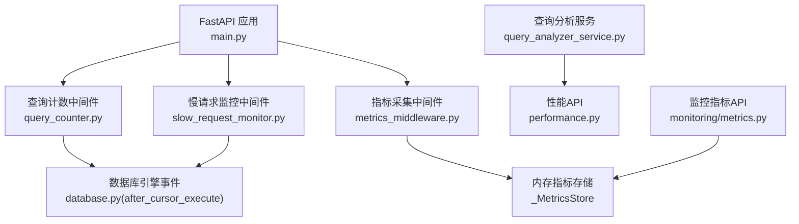
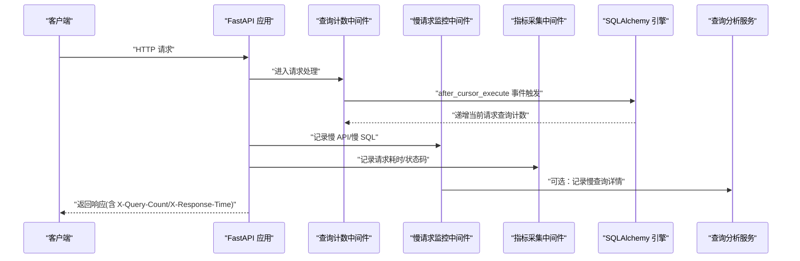
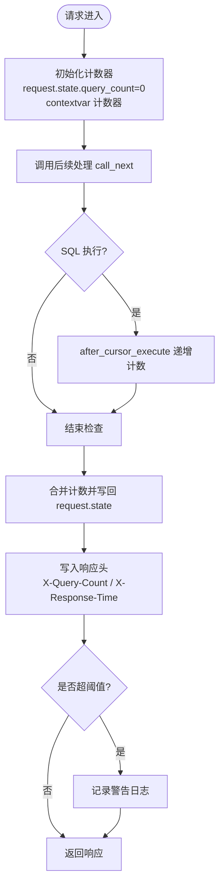
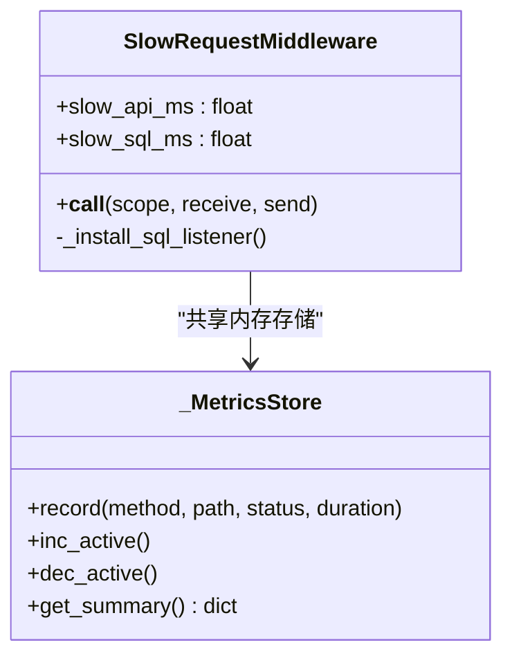
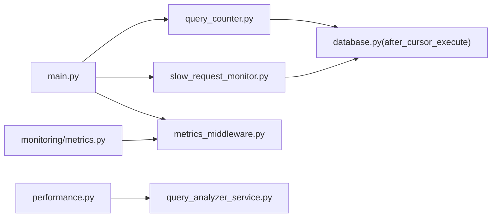

# 查询计数器中间件

<cite>
**本文引用的文件**
- [backend/app/middleware/query_counter.py](file://backend/app/middleware/query_counter.py)
- [backend/app/core/database.py](file://backend/app/core/database.py)
- [backend/app/middleware/slow_request_monitor.py](file://backend/app/middleware/slow_request_monitor.py)
- [backend/app/middleware/metrics_middleware.py](file://backend/app/middleware/metrics_middleware.py)
- [backend/app/core/query_optimizer.py](file://backend/app/core/query_optimizer.py)
- [backend/app/api/v1/monitoring/metrics.py](file://backend/app/api/v1/monitoring/metrics.py)
- [backend/app/api/v1/performance.py](file://backend/app/api/v1/performance.py)
- [backend/app/services/query_analyzer_service.py](file://backend/app/services/query_analyzer_service.py)
- [backend/app/main.py](file://backend/app/main.py)
- [backend/app/core/config.py](file://backend/app/core/config.py)
</cite>

## 目录
1. [简介](#简介)
2. [项目结构](#项目结构)
3. [核心组件](#核心组件)
4. [架构总览](#架构总览)
5. [详细组件分析](#详细组件分析)
6. [依赖关系分析](#依赖关系分析)
7. [性能考量](#性能考量)
8. [故障诊断指南](#故障诊断指南)
9. [结论](#结论)
10. [附录](#附录)

## 简介
本文件面向“查询计数器中间件”的监控与统计能力，覆盖以下目标：
- 数据库查询次数统计、慢查询检测、性能指标收集
- 配置选项、阈值设置、告警机制
- N+1 查询识别、重复查询优化、查询性能分析
- 监控数据存储方式、API 接口、可视化展示方案
- 性能优化建议、查询优化技巧、故障诊断方法

该中间件通过 SQLAlchemy 事件钩子与 ASGI 中间件协作，实现零侵入式的全链路 SQL 执行计数与慢请求/慢 SQL 监控，并通过内置 API 暴露指标，便于集成到前端面板或外部监控系统。

## 项目结构
围绕查询计数器与相关监控能力的核心文件分布如下：
- 中间件层：查询计数、慢请求监控、通用指标采集
- 数据层：SQLAlchemy 引擎与事件注册（连接 PRAGMA 调优、N+1 计数桥接）
- 服务层：查询分析器（慢查询记录、N+1 检测、查询计划分析）
- API 层：监控指标与性能分析接口
- 应用入口：中间件注册顺序与启动流程

图表来源
- [backend/app/main.py:113-165](file://backend/app/main.py#L113-L165)
- [backend/app/middleware/query_counter.py:39-77](file://backend/app/middleware/query_counter.py#L39-L77)
- [backend/app/middleware/slow_request_monitor.py:55-132](file://backend/app/middleware/slow_request_monitor.py#L55-L132)
- [backend/app/middleware/metrics_middleware.py:132-177](file://backend/app/middleware/metrics_middleware.py#L132-L177)
- [backend/app/core/database.py:70-76](file://backend/app/core/database.py#L70-L76)
- [backend/app/services/query_analyzer_service.py:17-153](file://backend/app/services/query_analyzer_service.py#L17-L153)
- [backend/app/api/v1/performance.py:19-77](file://backend/app/api/v1/performance.py#L19-L77)
- [backend/app/api/v1/monitoring/metrics.py:22-99](file://backend/app/api/v1/monitoring/metrics.py#L22-L99)

章节来源
- [backend/app/main.py:113-165](file://backend/app/main.py#L113-L165)

## 核心组件
- 查询计数器中间件：在每个请求中初始化并维护当前请求的 SQL 查询计数，将结果写入响应头，并在超过阈值时输出警告日志。
- 慢请求监控中间件：记录超过阈值的 API 请求与慢 SQL，使用环形缓冲区保存最近记录，并提供统计摘要。
- 指标采集中间件：采集 HTTP 请求计数、错误率、活跃请求数、按路径耗时等指标，提供汇总查询。
- 数据库事件桥接：在 SQLAlchemy after_cursor_execute 事件中调用查询计数回调，实现与中间件的上下文桥接。
- 查询分析服务：记录慢查询、计算百分位、检测 N+1 模式、生成查询计划（SQLite）。
- 监控与性能 API：暴露慢查询列表、查询统计、缓存统计、Prometheus 格式指标、性能面板数据。

章节来源
- [backend/app/middleware/query_counter.py:39-88](file://backend/app/middleware/query_counter.py#L39-L88)
- [backend/app/middleware/slow_request_monitor.py:19-53](file://backend/app/middleware/slow_request_monitor.py#L19-L53)
- [backend/app/middleware/metrics_middleware.py:26-129](file://backend/app/middleware/metrics_middleware.py#L26-L129)
- [backend/app/core/database.py:70-76](file://backend/app/core/database.py#L70-L76)
- [backend/app/services/query_analyzer_service.py:17-153](file://backend/app/services/query_analyzer_service.py#L17-L153)
- [backend/app/api/v1/performance.py:19-118](file://backend/app/api/v1/performance.py#L19-L118)
- [backend/app/api/v1/monitoring/metrics.py:22-99](file://backend/app/api/v1/monitoring/metrics.py#L22-L99)

## 架构总览
查询计数器与慢监控的整体工作流如下：

图表来源
- [backend/app/middleware/query_counter.py:47-77](file://backend/app/middleware/query_counter.py#L47-L77)
- [backend/app/core/database.py:70-76](file://backend/app/core/database.py#L70-L76)
- [backend/app/middleware/slow_request_monitor.py:70-132](file://backend/app/middleware/slow_request_monitor.py#L70-L132)
- [backend/app/middleware/metrics_middleware.py:142-177](file://backend/app/middleware/metrics_middleware.py#L142-L177)
- [backend/app/services/query_analyzer_service.py:25-60](file://backend/app/services/query_analyzer_service.py#L25-L60)

## 详细组件分析

### 查询计数器中间件（QueryCounterMiddleware）
- 功能要点
  - 每个请求开始时初始化 request.state.query_count 与 contextvar 计数器
  - 通过 SQLAlchemy after_cursor_execute 事件递增计数
  - 请求结束时合并显式递增与事件计数，写入响应头 X-Query-Count 与 X-Response-Time
  - 超过阈值时输出警告日志（默认阈值 50）
- 关键设计
  - 使用 contextvars 桥接 SQLAlchemy 事件与请求上下文
  - 兼容旧接口 increment_query_count，支持手动递增
- 适用场景
  - 快速定位高查询次数的端点
  - 辅助发现 N+1 问题（结合服务层装饰器）

图表来源
- [backend/app/middleware/query_counter.py:47-77](file://backend/app/middleware/query_counter.py#L47-L77)
- [backend/app/core/database.py:70-76](file://backend/app/core/database.py#L70-L76)

章节来源
- [backend/app/middleware/query_counter.py:21-88](file://backend/app/middleware/query_counter.py#L21-L88)
- [backend/app/core/database.py:70-76](file://backend/app/core/database.py#L70-L76)

### 慢请求监控中间件（SlowRequestMiddleware）
- 功能要点
  - 记录超过阈值的 API 请求与慢 SQL
  - 使用环形缓冲区保存最近 N 条慢记录（默认 200）
  - 提供统计摘要与查询函数（get_slow_api_records、get_slow_sql_records、get_slow_stats）
- 关键设计
  - 通过 before_cursor_execute/after_cursor_execute 捕获单条 SQL 耗时
  - 对 API 请求整体耗时进行阈值判断并记录
- 适用场景
  - 定位慢接口与慢 SQL
  - 为性能面板提供数据源

图表来源
- [backend/app/middleware/slow_request_monitor.py:55-132](file://backend/app/middleware/slow_request_monitor.py#L55-L132)
- [backend/app/middleware/metrics_middleware.py:26-129](file://backend/app/middleware/metrics_middleware.py#L26-L129)

章节来源
- [backend/app/middleware/slow_request_monitor.py:19-132](file://backend/app/middleware/slow_request_monitor.py#L19-L132)

### 指标采集中间件（MetricsMiddleware）
- 功能要点
  - 采集请求计数、错误计数、活跃请求数、总耗时、按路径耗时、慢请求列表
  - 线程安全的内存存储（_MetricsStore），避免并发竞争
  - 跳过健康检查与指标自身路径，减少噪声
- 适用场景
  - 构建系统级性能面板
  - 导出 Prometheus 格式指标（由上层 API 封装）

章节来源
- [backend/app/middleware/metrics_middleware.py:26-177](file://backend/app/middleware/metrics_middleware.py#L26-L177)

### 数据库事件桥接与 SQLite 调优
- 事件桥接
  - database.py 在 after_cursor_execute 中调用 query_counter 的回调，实现跨模块计数
- SQLite 调优
  - WAL 模式、外键约束、同步策略、busy_timeout、cache_size、mmap_size、临时存储、自动索引、WAL checkpoint、optimize
- 适用场景
  - 提升 SQLite 在高并发下的读写性能
  - 保障数据一致性与安全性

章节来源
- [backend/app/core/database.py:70-171](file://backend/app/core/database.py#L70-L171)

### 查询分析服务（QueryAnalyzer）
- 功能要点
  - 记录慢查询（限制长度与数量）
  - 计算慢查询统计（平均、最大、最小、百分位）
  - 简易 N+1 检测（基于查询签名与时间窗口）
  - SQLite 查询计划分析（EXPLAIN QUERY PLAN）
- 适用场景
  - 定位重复执行的相似查询
  - 为优化提供依据（索引、查询改写）

章节来源
- [backend/app/services/query_analyzer_service.py:17-153](file://backend/app/services/query_analyzer_service.py#L17-L153)

### 监控与性能 API
- 监控指标 API
  - GET /api/v1/metrics/business：业务指标
  - GET /api/v1/metrics/prometheus：Prometheus 格式
  - GET /api/v1/metrics/performance-dashboard：综合面板（HTTP 指标 + 数据库统计）
- 性能 API
  - GET /api/v1/performance/slow-queries：慢查询列表（管理员）
  - GET /api/v1/performance/query-stats：查询统计（管理员）
  - DELETE /api/v1/performance/slow-queries：清空慢查询记录（管理员）
  - GET /api/v1/performance/cache-stats：缓存统计（管理员）
  - POST /api/v1/performance/cache/clear：清空缓存（管理员）

章节来源
- [backend/app/api/v1/monitoring/metrics.py:22-99](file://backend/app/api/v1/monitoring/metrics.py#L22-L99)
- [backend/app/api/v1/performance.py:19-118](file://backend/app/api/v1/performance.py#L19-L118)

## 依赖关系分析
- 中间件注册顺序（从外层到内层）：
  - RequestID → SecurityHeaders → CORS → CamelToSnake → CSRF → RequestLogger → Audit → Metrics → 慢请求监控 → 查询计数
- 事件依赖：
  - database.py 的 after_cursor_execute 依赖 query_counter 的回调
  - slow_request_monitor 依赖 SQLAlchemy engine 的事件监听
- 服务依赖：
  - performance API 依赖 query_analyzer_service
  - monitoring metrics API 依赖 metrics_store

图表来源
- [backend/app/main.py:113-165](file://backend/app/main.py#L113-L165)
- [backend/app/core/database.py:70-76](file://backend/app/core/database.py#L70-L76)
- [backend/app/api/v1/performance.py:19-77](file://backend/app/api/v1/performance.py#L19-L77)
- [backend/app/api/v1/monitoring/metrics.py:22-99](file://backend/app/api/v1/monitoring/metrics.py#L22-L99)

章节来源
- [backend/app/main.py:113-165](file://backend/app/main.py#L113-L165)

## 性能考量
- 查询计数开销
  - 使用 contextvars 与轻量计数器，开销极低；适合高频请求
- 慢查询阈值
  - 默认 API 慢阈值 500ms、SQL 慢阈值 200ms；可通过中间件参数调整
- 内存占用
  - 环形缓冲区限制记录数量，防止无限增长
- 并发安全
  - 指标存储使用线程锁保证一致性
- 数据库优化
  - SQLite WAL、PRAGMA 调优、连接池参数（pool_size、max_overflow、pre_ping、recycle、timeout）

章节来源
- [backend/app/middleware/slow_request_monitor.py:58-66](file://backend/app/middleware/slow_request_monitor.py#L58-L66)
- [backend/app/middleware/metrics_middleware.py:26-40](file://backend/app/middleware/metrics_middleware.py#L26-L40)
- [backend/app/core/database.py:55-65](file://backend/app/core/database.py#L55-L65)
- [backend/app/core/database.py:133-157](file://backend/app/core/database.py#L133-L157)

## 故障诊断指南
- 常见问题
  - 查询计数不更新：确认 after_cursor_execute 事件已注册且 contextvar 正确设置
  - 慢查询未记录：检查阈值配置与日志级别；确认慢请求监控中间件已注册
  - 指标缺失：确认未命中跳过路径前缀（/health、/metrics、/favicon.ico）
- 诊断步骤
  - 查看响应头 X-Query-Count 与 X-Response-Time
  - 调用 /api/v1/performance/slow-queries 获取慢查询列表
  - 调用 /api/v1/metrics/performance-dashboard 查看综合面板
  - 使用 analyze_n_plus_one 装饰器定位潜在 N+1 问题
- 优化建议
  - 使用 eager loading 减少 N+1
  - 添加合适索引，避免全表扫描
  - 分页与限页大小，避免大结果集
  - 缓存热点数据，降低重复查询

章节来源
- [backend/app/middleware/query_counter.py:47-77](file://backend/app/middleware/query_counter.py#L47-L77)
- [backend/app/middleware/slow_request_monitor.py:70-132](file://backend/app/middleware/slow_request_monitor.py#L70-L132)
- [backend/app/core/query_optimizer.py:137-177](file://backend/app/core/query_optimizer.py#L137-L177)
- [backend/app/api/v1/performance.py:19-77](file://backend/app/api/v1/performance.py#L19-L77)
- [backend/app/api/v1/monitoring/metrics.py:51-99](file://backend/app/api/v1/monitoring/metrics.py#L51-L99)

## 结论
查询计数器中间件与慢请求监控、指标采集共同构成了完整的数据库查询监控体系。通过事件钩子与 ASGI 中间件的协作，实现了零侵入式的计数、慢查询检测与性能指标收集。配合查询分析服务与 API，可快速定位性能瓶颈、识别 N+1 问题并进行优化。建议在开发阶段启用慢查询与 N+1 检测，在生产环境合理设置阈值并结合外部监控系统进行长期观测。

## 附录

### 配置选项与阈值
- 慢请求阈值
  - API 慢阈值：默认 500ms（可通过 SlowRequestMiddleware 参数调整）
  - SQL 慢阈值：默认 200ms（可通过 SlowRequestMiddleware 参数调整）
- 查询计数阈值
  - 默认 50 条 SQL（超过则记录警告）
- 数据库连接池
  - pool_size、max_overflow、pool_pre_ping、pool_recycle、pool_timeout
- SQLite PRAGMA
  - journal_mode=WAL、synchronous=NORMAL、busy_timeout=10000、cache_size、mmap_size、temp_store=MEMORY、automatic_index=ON、wal_autocheckpoint=1000

章节来源
- [backend/app/middleware/slow_request_monitor.py:58-66](file://backend/app/middleware/slow_request_monitor.py#L58-L66)
- [backend/app/middleware/query_counter.py:21-22](file://backend/app/middleware/query_counter.py#L21-L22)
- [backend/app/core/database.py:55-65](file://backend/app/core/database.py#L55-L65)
- [backend/app/core/database.py:133-157](file://backend/app/core/database.py#L133-L157)

### 监控数据存储与可视化
- 存储方式
  - 内存环形缓冲区（慢 API/慢 SQL）
  - 线程安全内存计数器（HTTP 指标）
- API 接口
  - /api/v1/metrics/business、/api/v1/metrics/prometheus、/api/v1/metrics/performance-dashboard
  - /api/v1/performance/slow-queries、/api/v1/performance/query-stats、/api/v1/performance/cache-stats
- 可视化方案
  - 前端面板：使用 performance-dashboard 聚合 HTTP 指标与数据库统计
  - 外部监控：Prometheus 格式指标对接 Grafana

章节来源
- [backend/app/middleware/slow_request_monitor.py:19-53](file://backend/app/middleware/slow_request_monitor.py#L19-L53)
- [backend/app/middleware/metrics_middleware.py:26-129](file://backend/app/middleware/metrics_middleware.py#L26-L129)
- [backend/app/api/v1/monitoring/metrics.py:22-99](file://backend/app/api/v1/monitoring/metrics.py#L22-L99)
- [backend/app/api/v1/performance.py:19-118](file://backend/app/api/v1/performance.py#L19-L118)

### N+1 查询识别与优化技巧
- 识别方法
  - 使用 analyze_n_plus_one 装饰器标记服务方法，超过阈值时发出警告
  - 观察慢查询列表中重复执行的相似查询
- 优化技巧
  - 使用 eager loading（joinedload/subqueryload）
  - 批量查询与 IN 条件替代循环查询
  - 增加索引与查询改写，减少扫描行数
  - 引入缓存减少重复查询

章节来源
- [backend/app/core/query_optimizer.py:137-177](file://backend/app/core/query_optimizer.py#L137-L177)
- [backend/app/services/query_analyzer_service.py:95-128](file://backend/app/services/query_analyzer_service.py#L95-L128)