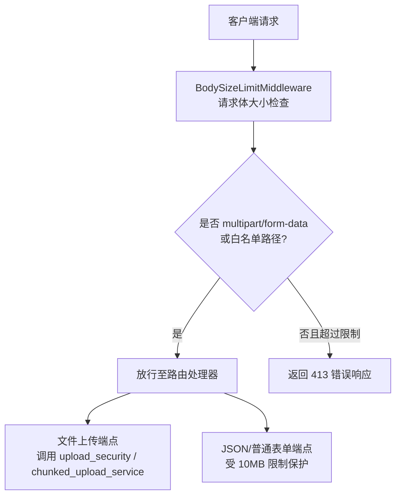
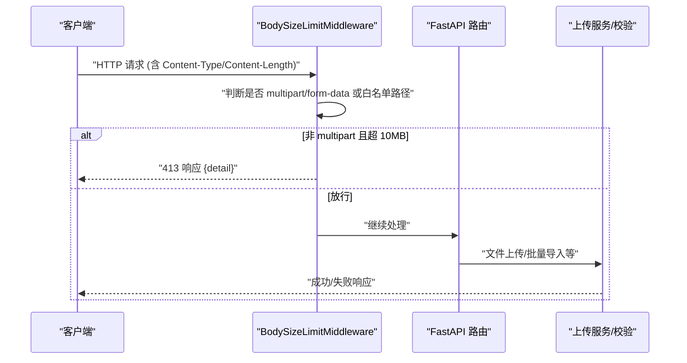
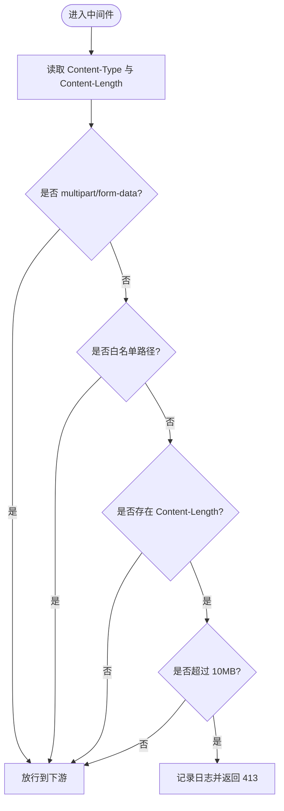
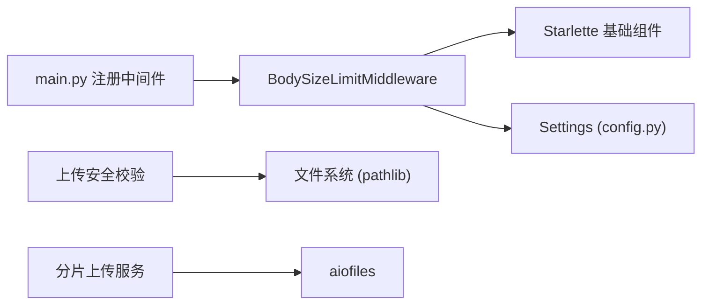

# 请求体大小限制中间件

<cite>
**本文引用的文件**
- [backend/app/middleware/body_size_limit.py](file://backend/app/middleware/body_size_limit.py)
- [backend/app/main.py](file://backend/app/main.py)
- [backend/app/core/config.py](file://backend/app/core/config.py)
- [backend/app/core/upload_security.py](file://backend/app/core/upload_security.py)
- [backend/app/services/chunked_upload_service.py](file://backend/app/services/chunked_upload_service.py)
- [backend/app/api/v1/files.py](file://backend/app/api/v1/files.py)
- [backend/app/core/error_handler.py](file://backend/app/core/error_handler.py)
</cite>

## 目录
1. [简介](#简介)
2. [项目结构](#项目结构)
3. [核心组件](#核心组件)
4. [架构总览](#架构总览)
5. [详细组件分析](#详细组件分析)
6. [依赖关系分析](#依赖关系分析)
7. [性能考量](#性能考量)
8. [故障排查指南](#故障排查指南)
9. [结论](#结论)
10. [附录：配置与集成清单](#附录配置与集成清单)

## 简介
本中间件用于防止大文件上传攻击与资源耗尽攻击，通过“全局请求体大小限制 + 分片上传 + 内容安全校验”的组合策略，保障系统在多种内容类型（multipart/form-data、application/json 等）下的稳定性与安全性。其核心目标包括：
- 控制内存占用，避免一次性加载超大请求体到内存
- 对非文件上传的 JSON/表单请求实施严格的大小限制
- 为文件上传提供分片上传能力，支持大文件稳定传输
- 统一错误响应格式与日志记录，便于监控与排障
- 提供可配置的阈值与白名单路径，兼顾业务需求与安全基线

## 项目结构
该功能涉及以下关键位置：
- 中间件实现：body_size_limit.py
- 应用注册：main.py
- 配置中心：config.py（MAX_FILE_SIZE 等）
- 上传安全校验：upload_security.py（扩展于文件上传场景）
- 分片上传服务：chunked_upload_service.py（大文件流式处理）
- API 层使用：files.py（示例端点中引用 MAX_FILE_SIZE）
- 错误响应工具：error_handler.py（统一错误体结构）

图表来源
- [backend/app/middleware/body_size_limit.py:48-78](file://backend/app/middleware/body_size_limit.py#L48-L78)
- [backend/app/main.py:160-162](file://backend/app/main.py#L160-L162)

章节来源
- [backend/app/middleware/body_size_limit.py:1-79](file://backend/app/middleware/body_size_limit.py#L1-L79)
- [backend/app/main.py:113-165](file://backend/app/main.py#L113-L165)

## 核心组件
- BodySizeLimitMiddleware：基于 Content-Length 进行早期拦截，针对非 multipart/form-data 且不在白名单路径的请求，若超出最大请求体则直接返回 413；对 multipart/form-data 一律放行，交由端点级逻辑控制。
- 配置项：
  - MAX_FILE_SIZE：文件上传上限（默认 50MB），在 config.py 中定义，被多个端点引用。
  - 中间件默认限制：10MB（在 main.py 注册时传入）。
- 上传安全校验：upload_security.py 提供扩展校验（扩展名、MIME、内容安全、文件大小等），适用于文件上传场景。
- 分片上传服务：chunked_upload_service.py 提供分片创建、上传、合并、过期清理等能力，支持大文件流式写入磁盘，降低内存峰值。

章节来源
- [backend/app/middleware/body_size_limit.py:20-78](file://backend/app/middleware/body_size_limit.py#L20-L78)
- [backend/app/core/config.py:170-176](file://backend/app/core/config.py#L170-L176)
- [backend/app/core/upload_security.py:19-127](file://backend/app/core/upload_security.py#L19-L127)
- [backend/app/services/chunked_upload_service.py:105-122](file://backend/app/services/chunked_upload_service.py#L105-L122)

## 架构总览
请求进入应用后的处理链路如下：
- 中间件链顺序（由添加顺序决定执行逆序）：RequestID → SecurityHeaders → CORS → CamelToSnake → CSRF → RequestLogger → Audit → Metrics → QueryCounter → SlowRequestMonitor
- BodySizeLimitMiddleware 在 CORS 之后、安全头之前注册，确保跨域与头部策略生效后再做请求体大小检查。
- 对于 multipart/form-data 或白名单路径的请求，中间件放行，后续由具体端点与上传服务处理。
- 对于 application/json 等非 multipart 请求，若 Content-Length 超过 10MB，立即返回 413，避免解析与内存分配。

图表来源
- [backend/app/middleware/body_size_limit.py:53-78](file://backend/app/middleware/body_size_limit.py#L53-L78)
- [backend/app/main.py:146-165](file://backend/app/main.py#L146-L165)

## 详细组件分析

### BodySizeLimitMiddleware（请求体大小限制）
- 策略
  - multipart/form-data 请求一律放行，由端点级 MAX_FILE_SIZE 控制。
  - 白名单路径前缀（如 /api/v1/import、/api/v1/batch 等）放行，以支持大批量数据导入或文件上传。
  - 其他非 multipart 请求，若 Content-Length 超过 10MB，返回 413。
- 内存与性能
  - 仅读取请求头中的 Content-Length，不读取请求体，避免额外内存开销。
  - 异常捕获（ValueError/TypeError）保证非法 header 值不会导致崩溃。
- 日志
  - 拒绝请求时记录警告日志，包含方法、路径与字节数，便于审计与告警。
- 错误响应
  - 返回 413，JSON 体包含 detail 字段，说明超过限制的具体 MB 数。

图表来源
- [backend/app/middleware/body_size_limit.py:53-78](file://backend/app/middleware/body_size_limit.py#L53-L78)

章节来源
- [backend/app/middleware/body_size_limit.py:1-79](file://backend/app/middleware/body_size_limit.py#L1-L79)

### 配置项与阈值
- 全局请求体限制：10MB（在 main.py 注册中间件时指定）。
- 文件上传限制：MAX_FILE_SIZE = 50MB（config.py），被多个端点引用。
- 分片上传限制：ChunkedUploadConfig.MAX_FILE_SIZE = 2GB（chunked_upload_service.py），适合超大文件场景。
- 建议
  - 生产环境可根据服务器内存与带宽调整 MAX_FILE_SIZE。
  - 对高频 JSON 接口保持较小限制（如 10MB），避免恶意大 JSON 攻击。
  - 对白名单路径谨慎维护，避免误放危险端点。

章节来源
- [backend/app/main.py:160-162](file://backend/app/main.py#L160-L162)
- [backend/app/core/config.py:170-176](file://backend/app/core/config.py#L170-L176)
- [backend/app/services/chunked_upload_service.py:105-122](file://backend/app/services/chunked_upload_service.py#L105-L122)

### 不同内容类型的处理策略
- multipart/form-data（文件上传）
  - 中间件放行，由端点级逻辑与 upload_security.py 进行扩展名、MIME、内容安全检查与大小限制。
  - 大文件推荐使用分片上传服务，流式写入临时目录，合并后落盘，降低内存峰值。
- application/json（批量数据/表单）
  - 受 10MB 限制保护，防止超大 JSON 导致内存耗尽。
  - 若业务需要更大 JSON 负载，应评估改为分片或分批提交，并在白名单路径中谨慎放开。
- 其他类型
  - 未显式处理的类型遵循“非 multipart 且超限即拒绝”的策略。

章节来源
- [backend/app/middleware/body_size_limit.py:20-78](file://backend/app/middleware/body_size_limit.py#L20-L78)
- [backend/app/core/upload_security.py:19-127](file://backend/app/core/upload_security.py#L19-L127)

### 超时处理
- 当前中间件未实现请求超时控制。建议在网关层（如 Nginx）或反向代理设置合理的 client_max_body_size、proxy_read_timeout、proxy_send_timeout。
- 对于长连接的大文件上传，结合分片上传服务的会话过期时间（默认 24 小时）与清理机制，避免长期占用资源。

[本节为通用指导，不直接分析具体文件]

### 错误响应格式
- 413 响应体包含 detail 字段，描述超过限制的具体 MB 数。
- 其他错误可通过 error_handler.py 提供的统一错误体构建函数生成，保持一致的结构（code、message、success、details）。

章节来源
- [backend/app/middleware/body_size_limit.py:65-74](file://backend/app/middleware/body_size_limit.py#L65-L74)
- [backend/app/core/error_handler.py:38-60](file://backend/app/core/error_handler.py#L38-L60)

### 日志记录机制
- 中间件在拒绝请求时记录警告日志，包含 HTTP 方法、路径与字节数。
- 分片上传服务在创建会话、上传分片、合并文件、清理过期会话等关键步骤记录日志，便于追踪与审计。
- 建议将日志级别调整为 INFO/DEBUG 以便问题定位，生产环境注意脱敏与保留策略。

章节来源
- [backend/app/middleware/body_size_limit.py:65-70](file://backend/app/middleware/body_size_limit.py#L65-L70)
- [backend/app/services/chunked_upload_service.py:276-278](file://backend/app/services/chunked_upload_service.py#L276-L278)
- [backend/app/services/chunked_upload_service.py:469-479](file://backend/app/services/chunked_upload_service.py#L469-L479)

### 与文件上传功能的集成方式
- 端点级大小限制：files.py 等端点在接收文件时检查 content 长度与 settings.MAX_FILE_SIZE，超限返回 413。
- 分片上传：通过 ChunkedUploadService 创建会话、上传分片、合并文件，支持进度查询与过期清理。
- 安全校验：upload_security.py 提供扩展名白名单、MIME 校验、内容安全扫描（检测可执行签名与脚本模式）、文件名清洗等。

章节来源
- [backend/app/api/v1/files.py:57-60](file://backend/app/api/v1/files.py#L57-L60)
- [backend/app/services/chunked_upload_service.py:207-280](file://backend/app/services/chunked_upload_service.py#L207-L280)
- [backend/app/core/upload_security.py:57-127](file://backend/app/core/upload_security.py#L57-L127)

## 依赖关系分析
- 中间件依赖 Starlette 的 BaseHTTPMiddleware、Request、JSONResponse。
- 配置依赖 Settings（pydantic-settings），从环境变量或 .env 加载。
- 上传安全校验依赖标准库与 pathlib，无外部重型依赖。
- 分片上传服务依赖 aiofiles 进行异步文件 I/O，提升大文件处理性能。

图表来源
- [backend/app/middleware/body_size_limit.py:12-18](file://backend/app/middleware/body_size_limit.py#L12-L18)
- [backend/app/core/config.py:54-62](file://backend/app/core/config.py#L54-L62)
- [backend/app/services/chunked_upload_service.py:10-21](file://backend/app/services/chunked_upload_service.py#L10-L21)
- [backend/app/main.py:160-162](file://backend/app/main.py#L160-L162)

章节来源
- [backend/app/middleware/body_size_limit.py:12-18](file://backend/app/middleware/body_size_limit.py#L12-L18)
- [backend/app/core/config.py:54-62](file://backend/app/core/config.py#L54-L62)
- [backend/app/services/chunked_upload_service.py:10-21](file://backend/app/services/chunked_upload_service.py#L10-L21)
- [backend/app/main.py:160-162](file://backend/app/main.py#L160-L162)

## 性能考量
- 中间件仅在请求头层面进行判断，不读取请求体，开销极低。
- 对 multipart/form-data 放行，避免对文件上传造成额外阻塞。
- 分片上传将大文件切分为小块，逐块写入磁盘，显著降低内存峰值与 GC 压力。
- 建议：
  - 合理设置 MAX_FILE_SIZE，避免过大导致磁盘与内存压力。
  - 对高并发场景启用分片上传，减少单次请求体积。
  - 定期清理过期会话与临时文件，释放磁盘空间。

[本节为通用指导，不直接分析具体文件]

## 故障排查指南
- 常见问题
  - 413 错误频繁出现：检查请求 Content-Length 是否超过 10MB；确认是否为 multipart/form-data 或白名单路径。
  - 文件上传失败：检查扩展名与 MIME 是否在允许列表；确认文件大小不超过 MAX_FILE_SIZE；查看分片上传会话状态与缺失分片。
  - 内存占用过高：确认是否使用了分片上传；检查是否有超大 JSON 请求绕过限制。
- 日志定位
  - 中间件拒绝请求时会记录警告日志，包含方法与路径，便于快速定位。
  - 分片上传服务在关键步骤记录日志，可用于追踪上传进度与错误原因。
- 配置核对
  - 确认 main.py 中 BodySizeLimitMiddleware 的 max_body_size 参数是否符合预期。
  - 确认 config.py 中 MAX_FILE_SIZE 与 ALLOWED_FILE_TYPES 是否满足业务需求。

章节来源
- [backend/app/middleware/body_size_limit.py:65-74](file://backend/app/middleware/body_size_limit.py#L65-L74)
- [backend/app/services/chunked_upload_service.py:469-479](file://backend/app/services/chunked_upload_service.py#L469-L479)
- [backend/app/core/config.py:170-176](file://backend/app/core/config.py#L170-L176)

## 结论
本中间件通过“请求头级大小检查 + 白名单路径放行 + 分片上传 + 内容安全校验”的组合，有效防止大文件上传攻击与资源耗尽攻击。其设计兼顾了安全性与性能，适用于多种内容类型与业务场景。建议在生产环境中结合网关超时、日志监控与定期清理策略，持续优化系统稳定性与可观测性。

[本节为总结，不直接分析具体文件]

## 附录：配置与集成清单
- 配置参数
  - 全局请求体限制：10MB（main.py 注册中间件时传入）
  - 文件上传限制：MAX_FILE_SIZE = 50MB（config.py）
  - 分片上传限制：MAX_FILE_SIZE = 2GB（chunked_upload_service.py）
  - 允许的文件类型：ALLOWED_FILE_TYPES（config.py）
- 集成方式
  - 在 main.py 中注册 BodySizeLimitMiddleware
  - 在文件上传端点中引用 settings.MAX_FILE_SIZE 进行端点级校验
  - 使用 ChunkedUploadService 实现分片上传流程
  - 使用 upload_security.py 进行扩展名、MIME、内容安全检查
- 调优建议
  - 根据业务需求调整白名单路径，避免误放危险端点
  - 对高并发大文件上传启用分片上传，降低内存与网络压力
  - 定期清理过期会话与临时文件，释放磁盘空间
  - 在网关层设置合理的超时与大小限制，形成多层防护

章节来源
- [backend/app/main.py:160-162](file://backend/app/main.py#L160-L162)
- [backend/app/core/config.py:170-176](file://backend/app/core/config.py#L170-L176)
- [backend/app/services/chunked_upload_service.py:105-122](file://backend/app/services/chunked_upload_service.py#L105-L122)
- [backend/app/core/upload_security.py:19-127](file://backend/app/core/upload_security.py#L19-L127)