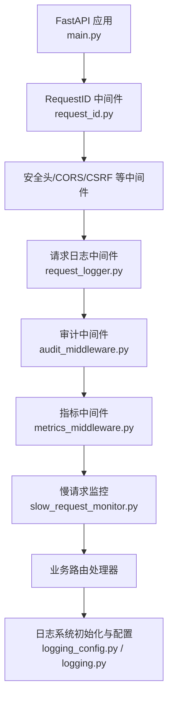
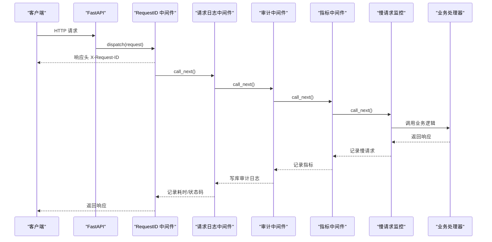
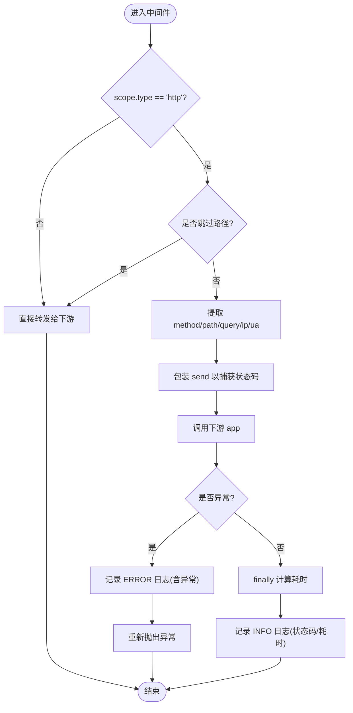
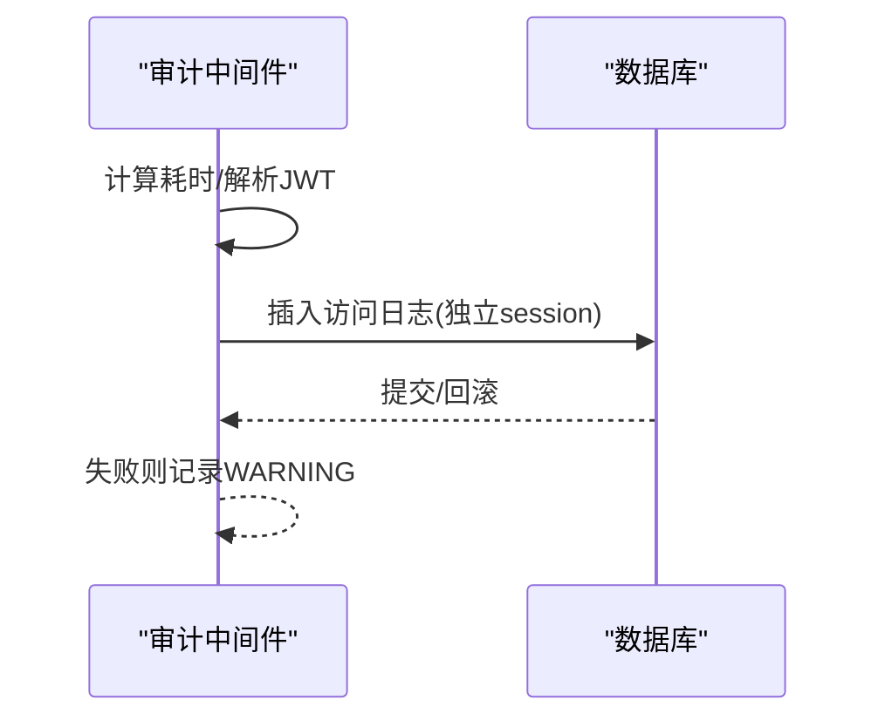
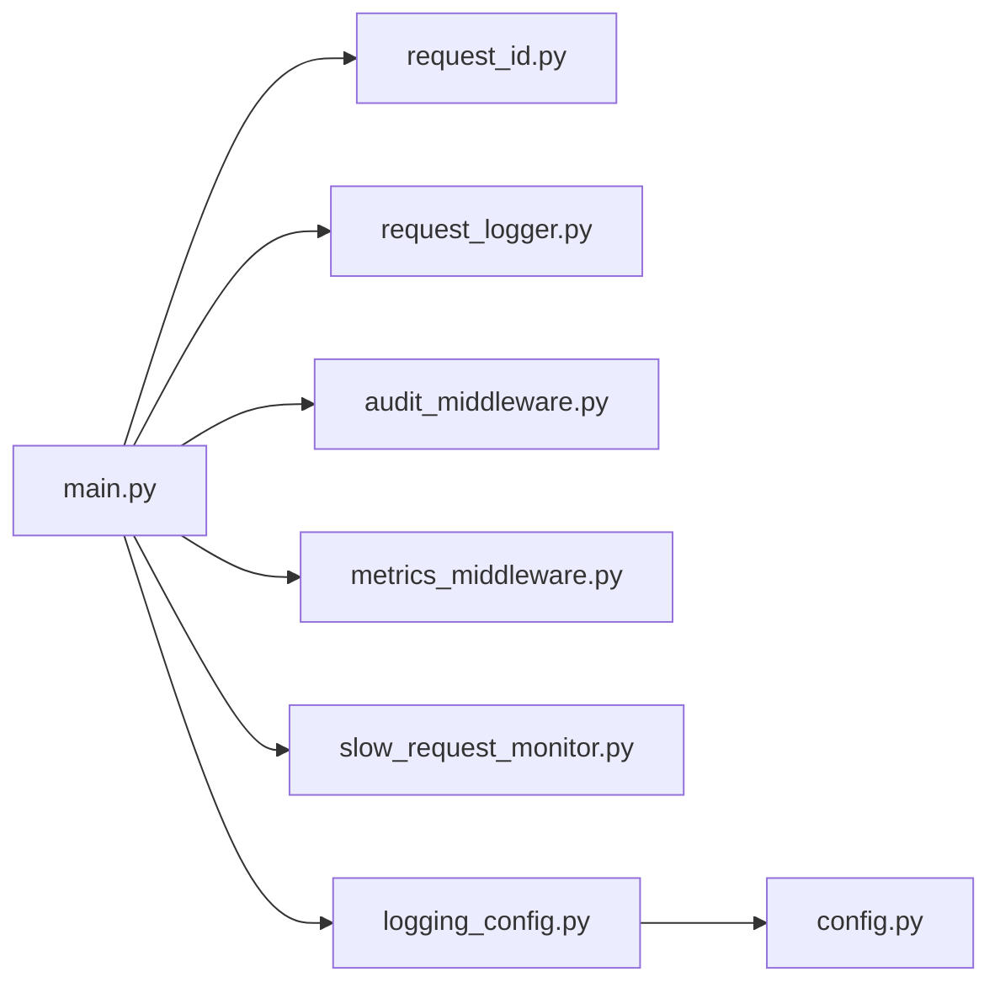

# 请求日志中间件

<cite>
**本文引用的文件**
- [backend/app/middleware/request_logger.py](file://backend/app/middleware/request_logger.py)
- [backend/app/core/logging_config.py](file://backend/app/core/logging_config.py)
- [backend/app/core/logging.py](file://backend/app/core/logging.py)
- [backend/app/middleware/request_id.py](file://backend/app/middleware/request_id.py)
- [backend/app/middleware/audit_middleware.py](file://backend/app/core/audit_middleware.py)
- [backend/app/middleware/metrics_middleware.py](file://backend/app/middleware/metrics_middleware.py)
- [backend/app/middleware/slow_request_monitor.py](file://backend/app/middleware/slow_request_monitor.py)
- [backend/app/core/config.py](file://backend/app/core/config.py)
- [backend/app/main.py](file://backend/app/main.py)
</cite>

## 目录
1. [简介](#简介)
2. [项目结构](#项目结构)
3. [核心组件](#核心组件)
4. [架构总览](#架构总览)
5. [详细组件分析](#详细组件分析)
6. [依赖关系分析](#依赖关系分析)
7. [性能考量](#性能考量)
8. [故障排查指南](#故障排查指南)
9. [结论](#结论)
10. [附录](#附录)

## 简介
本文件面向“请求日志中间件”的完整实现与使用，覆盖以下目标：
- HTTP 请求与响应的结构化日志记录机制（方法、路径、查询参数、客户端 IP、User-Agent、状态码、耗时）
- 错误堆栈跟踪与异常路径记录
- 日志格式标准化（JSON/文本）、敏感信息过滤、日志级别控制
- 日志输出目标配置、日志轮转策略（按大小/按时间）
- 结构化日志的查询与分析、日志聚合方案、监控告警集成
- 调试技巧、性能分析方法、故障排查指南

## 项目结构
后端采用 ASGI 中间件链对请求进行统一处理。与请求日志相关的核心位置如下：
- 应用入口注册中间件顺序与初始化日志系统
- 请求日志中间件：捕获请求/响应关键信息并落盘
- 审计中间件：结合认证用户信息持久化访问日志
- 指标中间件：统计请求计数、错误率、慢请求等
- 慢请求监控：记录慢 API 与慢 SQL
- 请求 ID 链路追踪：为每条请求注入唯一 ID，便于跨层关联
- 日志配置：统一初始化、格式化、脱敏、轮转

**图表来源**
- [backend/app/main.py:113-165](file://backend/app/main.py#L113-L165)
- [backend/app/middleware/request_logger.py:52-114](file://backend/app/middleware/request_logger.py#L52-L114)
- [backend/app/core/audit_middleware.py:11-44](file://backend/app/core/audit_middleware.py#L11-L44)
- [backend/app/middleware/metrics_middleware.py:132-177](file://backend/app/middleware/metrics_middleware.py#L132-L177)
- [backend/app/middleware/slow_request_monitor.py:55-132](file://backend/app/middleware/slow_request_monitor.py#L55-L132)
- [backend/app/core/logging_config.py:161-253](file://backend/app/core/logging_config.py#L161-L253)

**章节来源**
- [backend/app/main.py:113-165](file://backend/app/main.py#L113-L165)

## 核心组件
- 请求日志中间件：记录每个 HTTP 请求的方法、路径、查询串、客户端 IP、User-Agent、响应状态码、耗时；跳过健康检查、指标、静态资源等路径。
- 审计中间件：解析 JWT 获取用户身份，记录访问日志到数据库（失败不破坏业务）。
- 指标中间件：内存计数器统计请求数、错误数、活跃请求、平均耗时、慢请求列表等。
- 慢请求监控：记录超过阈值的 API 与 SQL，提供最近 N 条慢记录与统计摘要。
- 请求 ID 链路追踪：生成/校验 X-Request-ID，注入上下文变量，自动在日志中携带。
- 日志配置：统一初始化根 logger，设置控制台/文件 handler，JSON/文本格式，敏感信息脱敏，按大小或按时间轮转。

**章节来源**
- [backend/app/middleware/request_logger.py:1-114](file://backend/app/middleware/request_logger.py#L1-L114)
- [backend/app/core/audit_middleware.py:1-109](file://backend/app/core/audit_middleware.py#L1-L109)
- [backend/app/middleware/metrics_middleware.py:1-177](file://backend/app/middleware/metrics_middleware.py#L1-L177)
- [backend/app/middleware/slow_request_monitor.py:1-132](file://backend/app/middleware/slow_request_monitor.py#L1-L132)
- [backend/app/middleware/request_id.py:1-128](file://backend/app/middleware/request_id.py#L1-L128)
- [backend/app/core/logging_config.py:1-274](file://backend/app/core/logging_config.py#L1-L274)

## 架构总览
请求进入 FastAPI 后，依次经过多个中间件，最终到达业务处理器。期间：
- RequestID 中间件在最外层执行，负责生成/透传请求 ID，并在响应头返回 X-Request-ID。
- 请求日志中间件在较内层记录请求/响应关键信息与耗时。
- 审计中间件将访问日志写入数据库（独立短事务，失败仅警告）。
- 指标中间件统计请求计数、错误率、慢请求等。
- 慢请求监控通过 SQLAlchemy 事件钩子捕获慢 SQL，同时记录慢 API。
- 所有日志经 logging_config 统一格式化、脱敏、轮转。

**图表来源**
- [backend/app/middleware/request_id.py:50-119](file://backend/app/middleware/request_id.py#L50-L119)
- [backend/app/middleware/request_logger.py:62-114](file://backend/app/middleware/request_logger.py#L62-L114)
- [backend/app/core/audit_middleware.py:18-44](file://backend/app/core/audit_middleware.py#L18-L44)
- [backend/app/middleware/metrics_middleware.py:142-177](file://backend/app/middleware/metrics_middleware.py#L142-L177)
- [backend/app/middleware/slow_request_monitor.py:103-132](file://backend/app/middleware/slow_request_monitor.py#L103-L132)

## 详细组件分析

### 请求日志中间件（RequestLoggerMiddleware）
- 功能要点
  - 仅处理 HTTP 类型请求，跳过健康检查、指标、静态资源等前缀路径。
  - 从 ASGI scope 提取方法、路径、查询串、客户端 IP、User-Agent。
  - 通过包装 send 捕获响应状态码，计算耗时并记录 INFO/ERROR 日志。
  - 异常路径记录错误堆栈并重新抛出，保证上层异常处理生效。
- 数据流
  - 进入时记录 start_time，send_wrapper 捕获 http.response.start 的状态码。
  - finally 块计算 duration 并输出结构化日志。
- 可观测性
  - 日志包含 method、path、query_string、status_code、duration、client_ip、user_agent。
  - 可通过日志级别控制输出量级。

**图表来源**
- [backend/app/middleware/request_logger.py:62-114](file://backend/app/middleware/request_logger.py#L62-L114)

**章节来源**
- [backend/app/middleware/request_logger.py:1-114](file://backend/app/middleware/request_logger.py#L1-L114)

### 审计中间件（AuditMiddleware）
- 功能要点
  - 解析 Authorization 头中的 JWT，提取 user_id 与 username。
  - 记录请求方法、路径、状态码、耗时、用户标识。
  - 将访问日志写入数据库（独立 session，失败仅 WARNING，不影响业务）。
- 数据流
  - dispatch 中计算耗时，解析用户身份，记录日志并落库。
  - 落库失败不中断请求流程。

**图表来源**
- [backend/app/core/audit_middleware.py:18-109](file://backend/app/core/audit_middleware.py#L18-L109)

**章节来源**
- [backend/app/core/audit_middleware.py:1-109](file://backend/app/core/audit_middleware.py#L1-L109)

### 指标中间件（MetricsMiddleware）
- 功能要点
  - 线程安全的内存指标存储，记录请求计数、错误计数、活跃请求、总耗时、按路径耗时统计、慢请求列表。
  - 跳过健康检查、指标、favicon 等路径。
  - 暴露 get_summary 供外部查询（如 /metrics 端点）。
- 数据流
  - 进入时 inc_active，send_wrapper 捕获状态码，finally dec_active 并 record。

**章节来源**
- [backend/app/middleware/metrics_middleware.py:1-177](file://backend/app/middleware/metrics_middleware.py#L1-L177)

### 慢请求监控（SlowRequestMiddleware）
- 功能要点
  - 记录超过阈值的 API 请求与 SQL 查询。
  - 通过 SQLAlchemy before/after_cursor_execute 监听慢 SQL。
  - 维护环形缓冲区保存最近 N 条慢记录，并提供统计摘要。
- 数据流
  - 进入时记录开始时间，响应开始时计算耗时并判断是否慢请求。
  - SQL 监听器在 after 事件中计算耗时并记录慢 SQL。

**章节来源**
- [backend/app/middleware/slow_request_monitor.py:1-132](file://backend/app/middleware/slow_request_monitor.py#L1-L132)

### 请求 ID 链路追踪（RequestIDMiddleware）
- 功能要点
  - 优先使用客户端传入的 X-Request-ID（需合法），否则生成 UUID。
  - 将 request_id 注入 request.state 与 contextvars，供日志过滤器使用。
  - 在响应头返回 X-Request-ID，记录慢请求与完成日志。
- 数据流
  - 进入时设置上下文变量，完成后重置；异常时记录错误并返回特定状态。

**章节来源**
- [backend/app/middleware/request_id.py:1-128](file://backend/app/middleware/request_id.py#L1-L128)

### 日志配置与脱敏（logging_config）
- 功能要点
  - 统一初始化根 logger，设置控制台与文件 handler。
  - 支持 JSON 与文本两种格式；文件支持按大小或按时间轮转。
  - 全局敏感信息脱敏过滤器（身份证、手机号、邮箱、口令/令牌键值对）。
  - Windows 下安全轮转（重试避免 WinError 32）。
- 配置项
  - LOG_LEVEL、LOG_FORMAT、LOG_FILE、LOG_MAX_SIZE_MB、LOG_BACKUP_COUNT、LOG_ROTATION。
- 数据流
  - init_logging 读取 settings 配置并调用 configure_logging。
  - 所有 handler 附加 SensitiveDataFilter，确保消息输出前脱敏。

**章节来源**
- [backend/app/core/logging_config.py:1-274](file://backend/app/core/logging_config.py#L1-L274)
- [backend/app/core/logging.py:1-24](file://backend/app/core/logging.py#L1-L24)
- [backend/app/core/config.py:161-168](file://backend/app/core/config.py#L161-L168)

## 依赖关系分析
- 中间件注册顺序（由 main.py 决定）：
  - 最外层：RequestID（最先执行）
  - 安全头/CORS/CSRF
  - 请求日志中间件
  - 审计中间件
  - 指标中间件
  - 慢请求监控
  - 业务处理器
- 日志系统依赖：
  - 所有模块通过 logging.getLogger(__name__) 获取 logger。
  - 统一通过 logging_config.init_logging() 初始化。
  - 脱敏过滤器作用于所有 handler。

**图表来源**
- [backend/app/main.py:113-165](file://backend/app/main.py#L113-L165)
- [backend/app/core/logging_config.py:256-274](file://backend/app/core/logging_config.py#L256-L274)
- [backend/app/core/config.py:161-168](file://backend/app/core/config.py#L161-L168)

**章节来源**
- [backend/app/main.py:113-165](file://backend/app/main.py#L113-L165)

## 性能考量
- 中间件开销
  - RequestID：轻量，仅设置上下文与响应头。
  - RequestLogger：仅记录必要字段，跳过健康/指标/静态路径。
  - Audit：数据库写入失败不阻塞主流程，建议异步化或批量写入以降低影响。
  - Metrics：内存计数器，线程安全锁粒度小，开销低。
  - SlowRequest：SQL 监听器仅在慢查询时记录，环形缓冲限制内存占用。
- 日志轮转
  - 按大小：RotatingFileHandler，避免单文件过大。
  - 按时间：TimedRotatingFileHandler，按天轮转，Windows 下安全重试。
- 脱敏成本
  - 正则替换在日志输出前执行，建议在 DEBUG 环境下谨慎开启高频率日志。
- 建议
  - 生产环境关闭不必要的 DEBUG 日志。
  - 合理设置 LOG_MAX_SIZE_MB 与 LOG_BACKUP_COUNT。
  - 对高频接口考虑跳过审计落库或异步落库。

[本节为通用指导，无需具体文件引用]

## 故障排查指南
- 无法看到请求日志
  - 确认已调用 init_logging() 且 LOG_FILE 配置正确。
  - 检查日志级别是否高于当前输出阈值。
  - 确认路径未被跳过（/health、/metrics、/static 等）。
- 日志未脱敏
  - 确认 SensitiveDataFilter 已添加到所有 handler。
  - 检查日志格式是否为 JSON/文本，脱敏在 format 前执行。
- 轮转失败（Windows）
  - SafeTimedRotatingFileHandler/SafeRotatingFileHandler 已内置重试逻辑，若仍失败会记录 stderr 并继续写入原文件。
- 慢请求定位
  - 查看 slow_request_monitor 提供的慢 API/SQL 记录与统计摘要。
  - 结合 RequestID 在日志中追踪整条链路。
- 审计落库失败
  - 审计中间件失败仅记录 WARNING，不影响业务；检查数据库连接与权限。

**章节来源**
- [backend/app/core/logging_config.py:21-73](file://backend/app/core/logging_config.py#L21-L73)
- [backend/app/middleware/slow_request_monitor.py:32-52](file://backend/app/middleware/slow_request_monitor.py#L32-L52)
- [backend/app/core/audit_middleware.py:80-109](file://backend/app/core/audit_middleware.py#L80-L109)

## 结论
本项目通过多层中间件实现了完整的请求日志体系：
- 请求日志中间件提供基础的可观测性（方法、路径、状态码、耗时、IP、UA）。
- 审计中间件将访问日志持久化，便于合规与回溯。
- 指标与慢请求监控提供性能视角，辅助容量规划与瓶颈定位。
- 请求 ID 贯穿全链路，提升问题定位效率。
- 日志配置统一格式化、脱敏与轮转，保障安全与可维护性。

[本节为总结，无需具体文件引用]

## 附录

### 配置项说明（日志相关）
- LOG_LEVEL：日志级别（DEBUG/INFO/WARNING/ERROR）
- LOG_FORMAT：日志格式（json/text）
- LOG_FILE：日志文件路径
- LOG_MAX_SIZE_MB：单文件最大大小（MB）
- LOG_BACKUP_COUNT：保留备份数量
- LOG_ROTATION：时间轮转策略（如“midnight”）

**章节来源**
- [backend/app/core/config.py:161-168](file://backend/app/core/config.py#L161-L168)
- [backend/app/core/logging_config.py:161-253](file://backend/app/core/logging_config.py#L161-L253)

### 结构化日志查询与分析
- JSON 格式便于被日志采集器（如 ELK/Loki）解析。
- 关键字段：timestamp、level、logger、message、module、function、line、exception。
- 建议索引：method、path、status_code、duration、client_ip、request_id。

**章节来源**
- [backend/app/core/logging_config.py:122-140](file://backend/app/core/logging_config.py#L122-L140)

### 日志聚合与监控告警集成
- 聚合：将 stdout 或文件日志接入集中式日志平台。
- 监控：基于 metrics_middleware 的 get_summary 暴露 /metrics 端点。
- 告警：对错误率、慢请求比例、慢 SQL 数量设置阈值告警。

[本节为通用指导，无需具体文件引用]

### 调试技巧与性能分析方法
- 启用 DEBUG 级别观察详细日志（注意生产环境慎用）。
- 使用 RequestID 在日志中串联一次请求的全链路。
- 通过慢请求监控定位热点接口与慢 SQL。
- 结合指标中间件的 top_endpoints 与 slow_requests 进行分析。

**章节来源**
- [backend/app/middleware/request_id.py:50-119](file://backend/app/middleware/request_id.py#L50-L119)
- [backend/app/middleware/metrics_middleware.py:75-125](file://backend/app/middleware/metrics_middleware.py#L75-L125)
- [backend/app/middleware/slow_request_monitor.py:32-52](file://backend/app/middleware/slow_request_monitor.py#L32-L52)