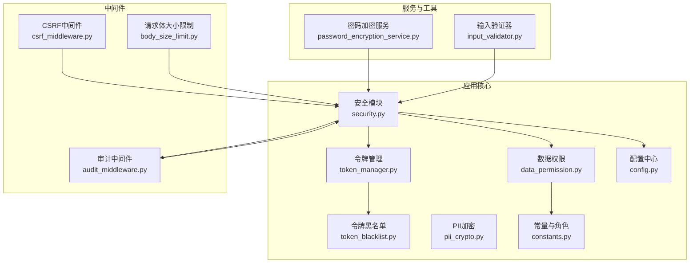
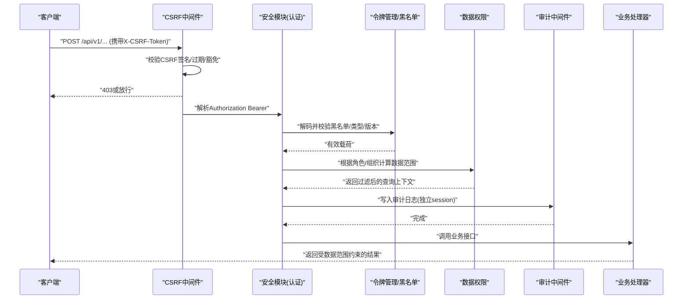
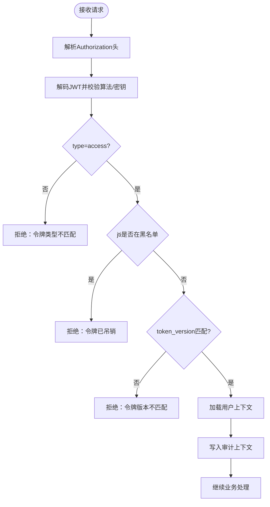
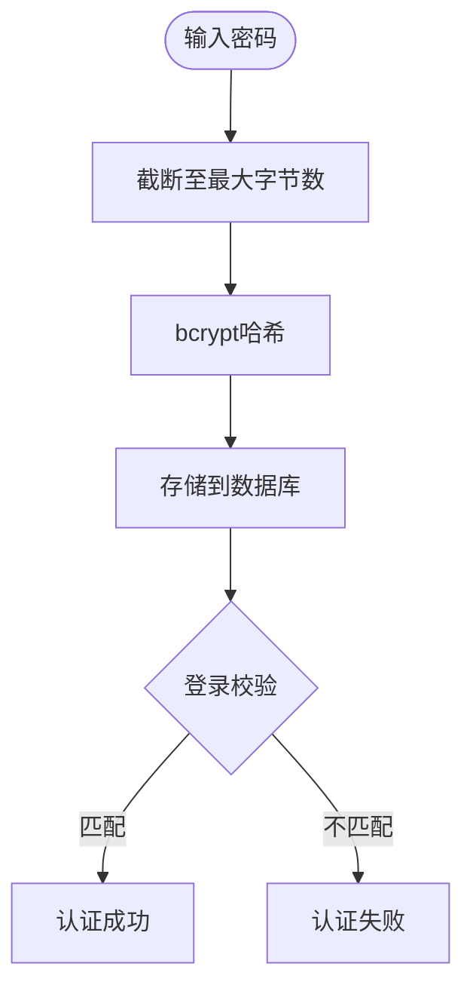
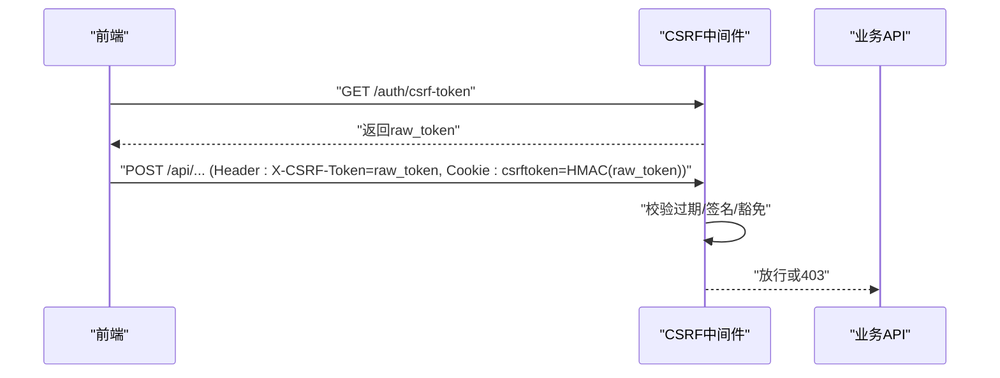
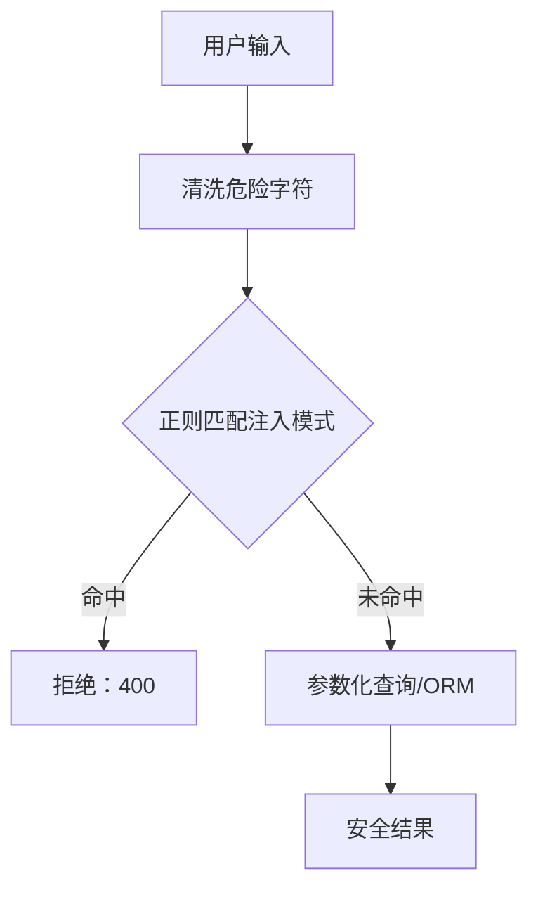
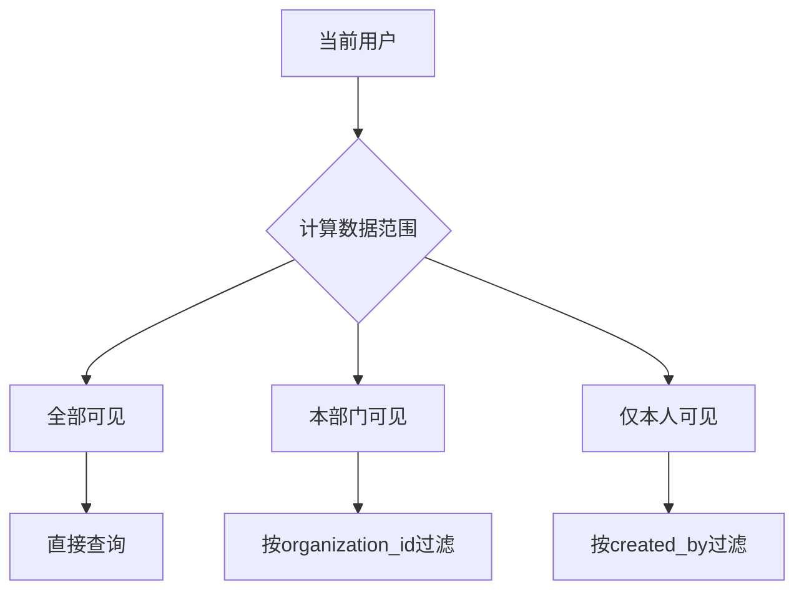
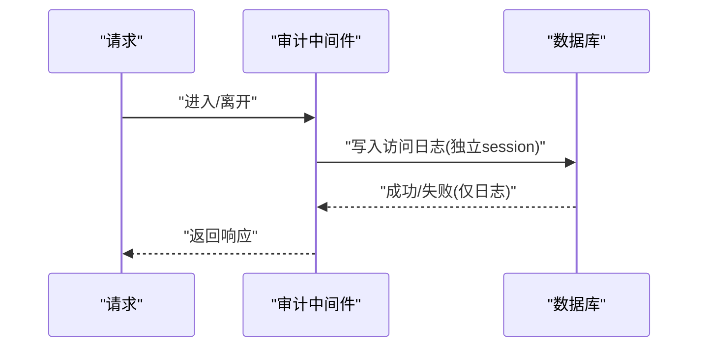
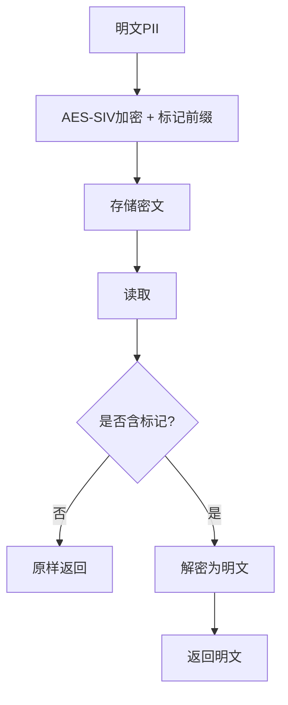
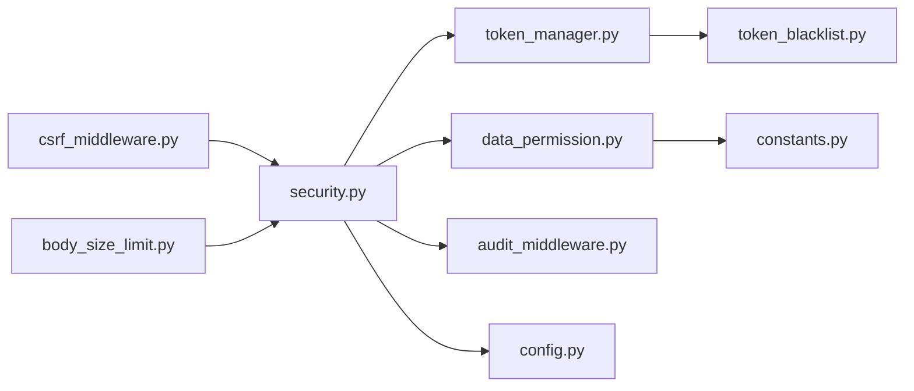

# 安全设计

<cite>
**本文引用的文件**
- [security.py](file://backend/app/core/security.py)
- [csrf_middleware.py](file://backend/app/middleware/csrf_middleware.py)
- [token_manager.py](file://backend/app/core/token_manager.py)
- [data_permission.py](file://backend/app/core/data_permission.py)
- [password_encryption_service.py](file://backend/app/services/password_encryption_service.py)
- [token_blacklist.py](file://backend/app/core/token_blacklist.py)
- [audit_middleware.py](file://backend/app/core/audit_middleware.py)
- [pii_crypto.py](file://backend/app/core/pii_crypto.py)
- [body_size_limit.py](file://backend/app/middleware/body_size_limit.py)
- [input_validator.py](file://backend/app/utils/input_validator.py)
- [config.py](file://backend/app/core/config.py)
- [constants.py](file://backend/app/core/constants.py)
</cite>

## 目录
1. [简介](#简介)
2. [项目结构](#项目结构)
3. [核心组件](#核心组件)
4. [架构总览](#架构总览)
5. [详细组件分析](#详细组件分析)
6. [依赖关系分析](#依赖关系分析)
7. [性能与安全权衡](#性能与安全权衡)
8. [故障排查指南](#故障排查指南)
9. [结论](#结论)
10. [附录：配置与测试清单](#附录配置与测试清单)

## 简介
本文件面向系统安全设计，覆盖认证鉴权、密码与敏感数据加密、跨站请求伪造防护、SQL注入防护、数据范围隔离、权限控制、审计日志、输入验证与输出过滤、速率限制与请求体大小限制等关键安全能力。文档同时给出安全配置项说明与漏洞扫描/安全测试方法建议，帮助团队在开发与运维中持续保障系统安全性与合规性。

## 项目结构
后端安全相关代码主要分布在以下模块：
- 核心安全能力：JWT令牌、密码哈希、安全中间件、审计日志、PII字段加密、黑名单机制
- 中间件层：CSRF保护、请求体大小限制、审计记录
- 服务层：基于密码的对称加密（PBKDF2+Fernet）
- 工具层：输入校验、常量与角色归一化
- 配置中心：统一的安全开关与参数（如CSRF启用、CORS、速率限制、密钥策略）

图表来源
- [security.py:1-713](file://backend/app/core/security.py#L1-L713)
- [csrf_middleware.py:1-284](file://backend/app/middleware/csrf_middleware.py#L1-L284)
- [token_manager.py:1-283](file://backend/app/core/token_manager.py#L1-L283)
- [token_blacklist.py:1-163](file://backend/app/core/token_blacklist.py#L1-L163)
- [data_permission.py:1-187](file://backend/app/core/data_permission.py#L1-L187)
- [pii_crypto.py:1-94](file://backend/app/core/pii_crypto.py#L1-L94)
- [body_size_limit.py:1-79](file://backend/app/middleware/body_size_limit.py#L1-L79)
- [input_validator.py:1-124](file://backend/app/utils/input_validator.py#L1-L124)
- [config.py:1-200](file://backend/app/core/config.py#L1-L200)
- [constants.py:1-87](file://backend/app/core/constants.py#L1-L87)

章节来源
- [security.py:1-713](file://backend/app/core/security.py#L1-L713)
- [config.py:1-200](file://backend/app/core/config.py#L1-L200)

## 核心组件
- JWT令牌认证：生成/解码access与refresh token，支持吊销与版本控制，强制类型校验与黑名单检查
- 密码加密存储：bcrypt哈希，兼容长度限制与异常处理；提供随机密码生成与策略校验
- CSRF防护：HMAC签名增强Double Submit Cookie模式，支持过期检测与降级兼容
- SQL注入防护：输入清洗与模式匹配，结合ORM参数化查询最佳实践
- 数据范围隔离：按用户角色与组织维度自动过滤查询结果
- 权限控制：管理员/超级管理员判定与资源访问校验
- 审计日志：请求级访问日志与操作审计落库，失败不阻断主流程
- 敏感数据加密：PII字段确定性加密（AES-SIV），支持透明读写与迁移兼容
- 输入验证与输出过滤：XSS/SQL注入模式检测、格式校验、响应头安全加固
- 速率限制与请求体大小限制：滑动窗口限流与超大请求拦截

章节来源
- [security.py:107-336](file://backend/app/core/security.py#L107-L336)
- [security.py:379-412](file://backend/app/core/security.py#L379-L412)
- [security.py:598-702](file://backend/app/core/security.py#L598-L702)
- [csrf_middleware.py:1-284](file://backend/app/middleware/csrf_middleware.py#L1-L284)
- [data_permission.py:20-187](file://backend/app/core/data_permission.py#L20-L187)
- [audit_middleware.py:1-109](file://backend/app/core/audit_middleware.py#L1-L109)
- [pii_crypto.py:1-94](file://backend/app/core/pii_crypto.py#L1-L94)
- [input_validator.py:1-124](file://backend/app/utils/input_validator.py#L1-L124)
- [body_size_limit.py:1-79](file://backend/app/middleware/body_size_limit.py#L1-L79)

## 架构总览
下图展示一次受保护的API请求从进入中间件到鉴权、权限、审计的完整链路。

图表来源
- [csrf_middleware.py:177-284](file://backend/app/middleware/csrf_middleware.py#L177-L284)
- [security.py:243-336](file://backend/app/core/security.py#L243-L336)
- [token_manager.py:135-169](file://backend/app/core/token_manager.py#L135-L169)
- [token_blacklist.py:60-70](file://backend/app/core/token_blacklist.py#L60-L70)
- [data_permission.py:83-134](file://backend/app/core/data_permission.py#L83-L134)
- [audit_middleware.py:18-44](file://backend/app/core/audit_middleware.py#L18-L44)

## 详细组件分析

### JWT令牌认证与会话管理
- 令牌生成与校验：access与refresh token分别设置过期时间，包含jti与type声明；校验时进行类型匹配与黑名单检查
- 会话吊销：通过黑名单持久化（内存+数据库）实现即时失效；支持token_version强制下线所有会话
- 当前用户提取：从Bearer头解析并加载用户上下文，将用户ID写入审计上下文变量，便于写操作可追责

图表来源
- [security.py:210-336](file://backend/app/core/security.py#L210-L336)
- [token_manager.py:135-169](file://backend/app/core/token_manager.py#L135-L169)
- [token_blacklist.py:60-70](file://backend/app/core/token_blacklist.py#L60-L70)

章节来源
- [security.py:210-336](file://backend/app/core/security.py#L210-L336)
- [token_manager.py:64-127](file://backend/app/core/token_manager.py#L64-L127)
- [token_blacklist.py:27-70](file://backend/app/core/token_blacklist.py#L27-L70)

### 密码加密存储与策略
- 密码哈希：使用bcrypt，对超长密码进行截断以兼容不同版本；提供哈希与校验函数
- 随机密码生成：强制复杂度要求（大小写、数字、特殊字符）
- 密码策略：最小长度、复杂度、弱口令前缀、用户名包含检查

图表来源
- [security.py:122-149](file://backend/app/core/security.py#L122-L149)
- [security.py:151-173](file://backend/app/core/security.py#L151-L173)
- [security.py:524-590](file://backend/app/core/security.py#L524-L590)

章节来源
- [security.py:122-173](file://backend/app/core/security.py#L122-L173)
- [security.py:524-590](file://backend/app/core/security.py#L524-L590)

### CSRF防护
- 双提交Cookie增强：前端获取raw_token，服务端设置HMAC签名的csrftoken Cookie；请求头携带raw_token，服务端用hmac.compare_digest比较
- 过期检测：token内嵌时间戳，超过阈值拒绝
- 豁免路径：健康检查、文档、登录注册等无需CSRF
- 代理信任：仅在可信代理IP透传真实客户端IP

图表来源
- [csrf_middleware.py:65-124](file://backend/app/middleware/csrf_middleware.py#L65-L124)
- [csrf_middleware.py:177-284](file://backend/app/middleware/csrf_middleware.py#L177-L284)

章节来源
- [csrf_middleware.py:1-284](file://backend/app/middleware/csrf_middleware.py#L1-L284)

### SQL注入防护与输入验证
- 输入清洗：移除危险字符（分号、注释符等）
- 模式检测：正则匹配常见SQL注入片段，触发400错误
- 建议：始终使用ORM参数化查询，避免字符串拼接

图表来源
- [security.py:379-412](file://backend/app/core/security.py#L379-L412)
- [input_validator.py:12-71](file://backend/app/utils/input_validator.py#L12-L71)

章节来源
- [security.py:379-412](file://backend/app/core/security.py#L379-L412)
- [input_validator.py:12-71](file://backend/app/utils/input_validator.py#L12-L71)

### 数据范围隔离与权限控制
- 数据范围：ALL（超级管理员）、OWN_DEPT（本部门）、OWN（仅本人）
- 查询过滤：根据用户角色与组织字段动态追加过滤器
- 单条记录访问：按归属与组织判断是否允许访问
- 管理员判定：兼容历史角色归一化

图表来源
- [data_permission.py:20-81](file://backend/app/core/data_permission.py#L20-L81)
- [data_permission.py:83-134](file://backend/app/core/data_permission.py#L83-L134)
- [constants.py:27-74](file://backend/app/core/constants.py#L27-L74)

章节来源
- [data_permission.py:20-187](file://backend/app/core/data_permission.py#L20-L187)
- [constants.py:27-74](file://backend/app/core/constants.py#L27-L74)

### 审计日志
- 请求级审计：记录方法、路径、状态码、耗时、用户标识与UA/IP
- 操作审计：记录动作、资源、元数据与IP
- 容错：落库失败仅记录警告，不影响主流程

图表来源
- [audit_middleware.py:18-44](file://backend/app/core/audit_middleware.py#L18-L44)
- [audit_middleware.py:80-109](file://backend/app/core/audit_middleware.py#L80-L109)
- [security.py:644-687](file://backend/app/core/security.py#L644-L687)

章节来源
- [audit_middleware.py:1-109](file://backend/app/core/audit_middleware.py#L1-L109)
- [security.py:644-687](file://backend/app/core/security.py#L644-L687)

### 敏感数据加密（PII）
- 确定性加密：AES-SIV，同一明文恒得同一密文，支持等值查询
- 标记兼容：密文带前缀“enc.v1:”，读取侧识别并解密，历史明文原样返回
- 密钥来源：显式ENCRYPTION_KEY或运行时密钥存储，多机同步需一致密钥

图表来源
- [pii_crypto.py:30-87](file://backend/app/core/pii_crypto.py#L30-L87)

章节来源
- [pii_crypto.py:1-94](file://backend/app/core/pii_crypto.py#L1-L94)

### 基于密码的对称加密服务
- 密钥派生：PBKDF2-HMAC-SHA256，默认迭代次数满足OWASP建议
- 对称加密：Fernet（AES-128-CBC），用于数据/文件加解密
- 错误处理：密码错误抛出业务异常

章节来源
- [password_encryption_service.py:1-206](file://backend/app/services/password_encryption_service.py#L1-L206)

### 速率限制与请求体大小限制
- 速率限制：滑动窗口算法，默认60次/分钟，支持清理过期键防止内存泄漏
- 请求体大小限制：非multipart且非白名单路径的请求超过阈值返回413

章节来源
- [security.py:414-488](file://backend/app/core/security.py#L414-L488)
- [body_size_limit.py:1-79](file://backend/app/middleware/body_size_limit.py#L1-L79)

## 依赖关系分析
- 认证链：security.get_current_user依赖token_manager.validate与token_blacklist.is_blacklisted
- 权限链：data_permission.apply_scope_to_query依赖constants.normalize_role与用户属性
- 审计链：audit_middleware独立session写入API访问日志，security.AuditLogService写入操作审计
- 配置依赖：config集中管理CSRF、CORS、速率限制、加密后端等开关

图表来源
- [security.py:243-336](file://backend/app/core/security.py#L243-L336)
- [token_manager.py:135-169](file://backend/app/core/token_manager.py#L135-L169)
- [data_permission.py:83-134](file://backend/app/core/data_permission.py#L83-L134)
- [audit_middleware.py:18-44](file://backend/app/core/audit_middleware.py#L18-L44)
- [config.py:126-159](file://backend/app/core/config.py#L126-L159)

章节来源
- [security.py:243-336](file://backend/app/core/security.py#L243-L336)
- [config.py:126-159](file://backend/app/core/config.py#L126-L159)

## 性能与安全权衡
- bcrypt强度与延迟：bcrypt轮次越高越安全但验证更慢，需平衡用户体验与安全性
- 速率限制粒度：过严可能影响批量导入/导出，应针对特定路径放宽或采用分级限流
- 审计落库：独立短事务降低对主流程的影响，但仍需关注高并发下的写入压力
- PII确定性加密：支持等值查询但暴露相等关系，适用于无范围查询需求的字段（身份证、电话）

[本节为通用指导，不直接分析具体文件]

## 故障排查指南
- 认证失败：检查JWT密钥与算法配置、令牌类型与版本、黑名单状态
- CSRF失败：确认前端是否正确获取并携带raw_token与HMAC签名Cookie，检查豁免路径与过期时间
- 权限不足：核对用户角色归一化、组织字段与模型字段映射
- 审计缺失：检查数据库连接与表结构，确认审计中间件是否生效
- 输入被拒：查看输入验证规则与正则匹配，调整白名单或放宽限制

章节来源
- [security.py:243-336](file://backend/app/core/security.py#L243-L336)
- [csrf_middleware.py:177-284](file://backend/app/middleware/csrf_middleware.py#L177-L284)
- [data_permission.py:83-134](file://backend/app/core/data_permission.py#L83-L134)
- [audit_middleware.py:80-109](file://backend/app/core/audit_middleware.py#L80-L109)

## 结论
本系统通过多层安全机制构建了完整的防护体系：JWT认证与会话吊销、CSRF HMAC签名、输入清洗与SQL注入防护、数据范围隔离与权限控制、审计日志与敏感数据加密、速率限制与请求体大小限制。配合统一的配置管理与严格的中间件链，可在单机与离线部署场景下提供稳健的安全基线。建议在CI/CD中集成静态扫描与安全测试，持续验证安全策略的有效性。

[本节为总结，不直接分析具体文件]

## 附录：配置与测试清单

### 安全配置选项（节选）
- 令牌与认证
  - ACCESS_TOKEN_EXPIRE_MINUTES：访问令牌有效期（分钟）
  - REFRESH_TOKEN_EXPIRE_DAYS：刷新令牌有效期（天）
  - SECRET_KEY/ALGORITHM：JWT签名密钥与算法
- CSRF
  - CSRF_ENABLED：是否启用CSRF保护
  - CSRF_SECRET_KEY：CSRF签名密钥（留空则回退到SECRET_KEY）
- CORS
  - CORS_ORIGINS/CORS_ALLOW_CREDENTIALS/CORS_ALLOW_METHODS/CORS_ALLOW_HEADERS
- 速率限制
  - RATE_LIMIT_ENABLED/RATE_LIMIT_PER_MINUTE/RATE_LIMIT_PER_HOUR
- 加密
  - ENCRYPTION_KEY/ENCRYPTION_BACKEND/ENCRYPTION_KEY_DERIVATION
  - DB_ENCRYPTION_ENABLED/DB_ENCRYPTION_KEY_PATH
- 其他
  - TRUST_PROXY_HEADERS：是否信任代理头（直连场景默认关闭）
  - MAX_FILE_SIZE/ALLOWED_FILE_TYPES：上传限制

章节来源
- [config.py:126-175](file://backend/app/core/config.py#L126-L175)

### 漏洞扫描与安全测试建议
- 静态扫描
  - 使用安全扫描工具（如Bandit）检查硬编码密钥、弱加密、不安全函数调用
  - 定期运行脚本进行PII泄露扫描与敏感信息检测
- 单元测试
  - 覆盖认证链路（令牌签发/校验/吊销）、CSRF流程、输入验证、权限过滤
  - 验证审计日志写入与失败降级行为
- 集成测试
  - 模拟跨站请求、注入攻击、超大请求体、高频请求等场景
  - 验证数据范围隔离在不同角色与组织下的正确性
- 渗透测试
  - 针对认证绕过、令牌重放、CSRF绕过、SQL注入、XSS等进行专项测试
  - 验证生产环境安全头与缓存策略

章节来源
- [input_validator.py:12-71](file://backend/app/utils/input_validator.py#L12-L71)
- [security.py:598-702](file://backend/app/core/security.py#L598-L702)
- [body_size_limit.py:1-79](file://backend/app/middleware/body_size_limit.py#L1-L79)
- [audit_middleware.py:18-44](file://backend/app/core/audit_middleware.py#L18-L44)