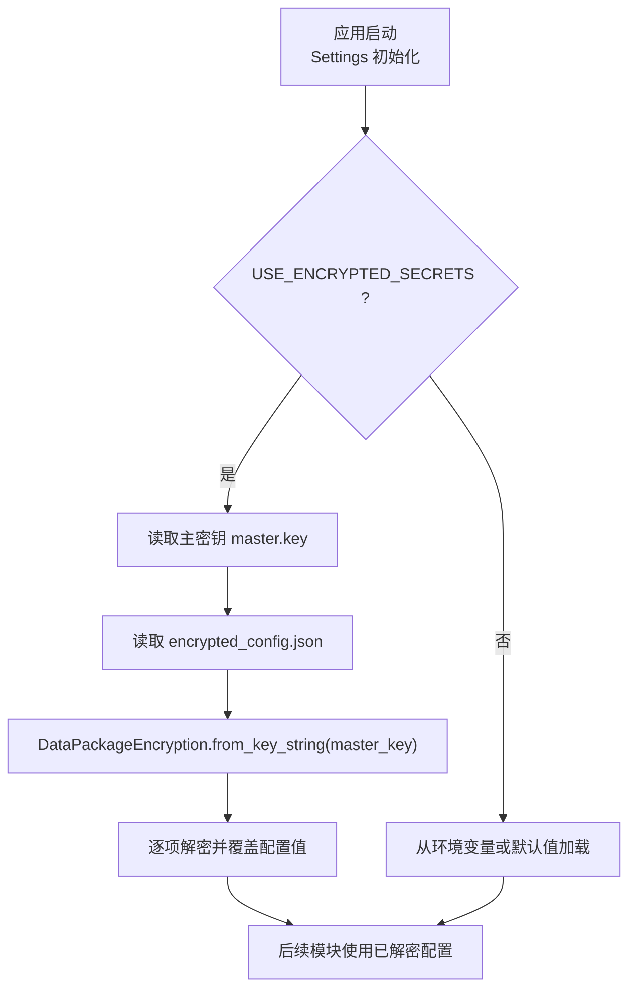
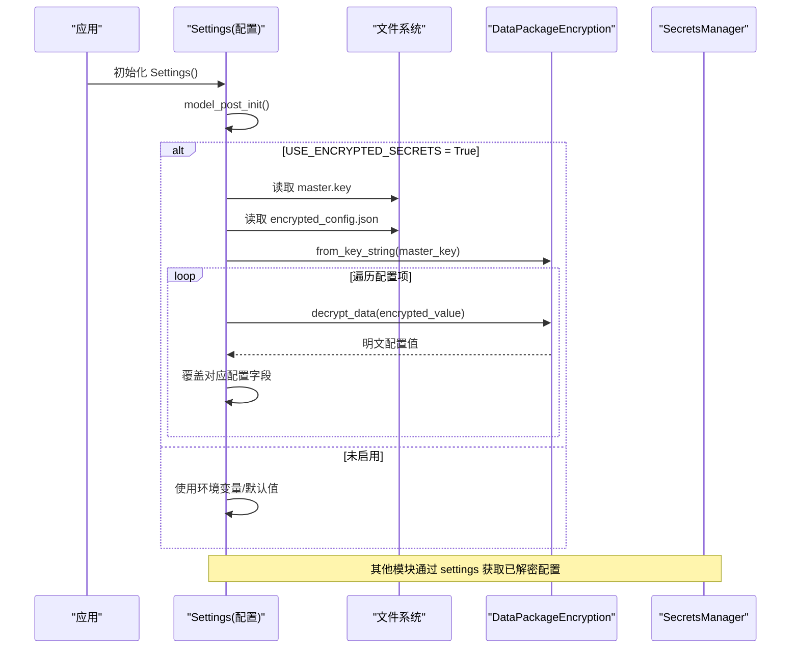
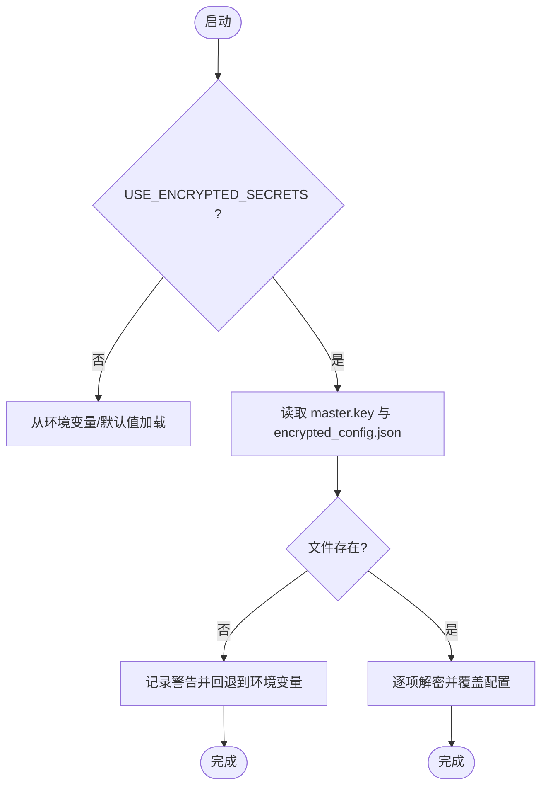
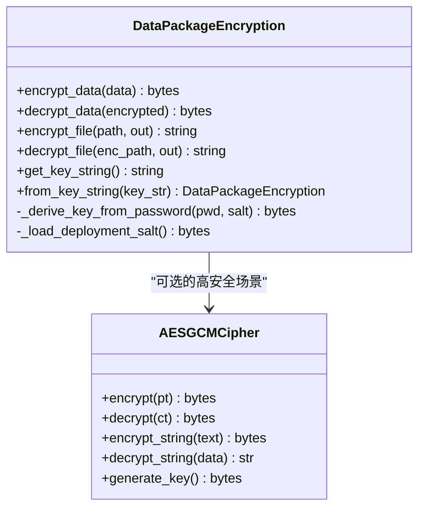
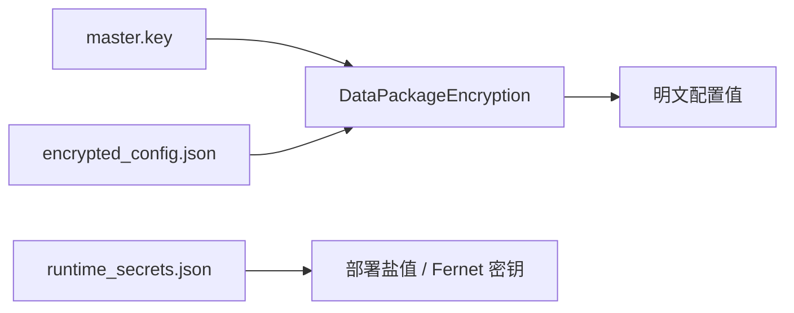
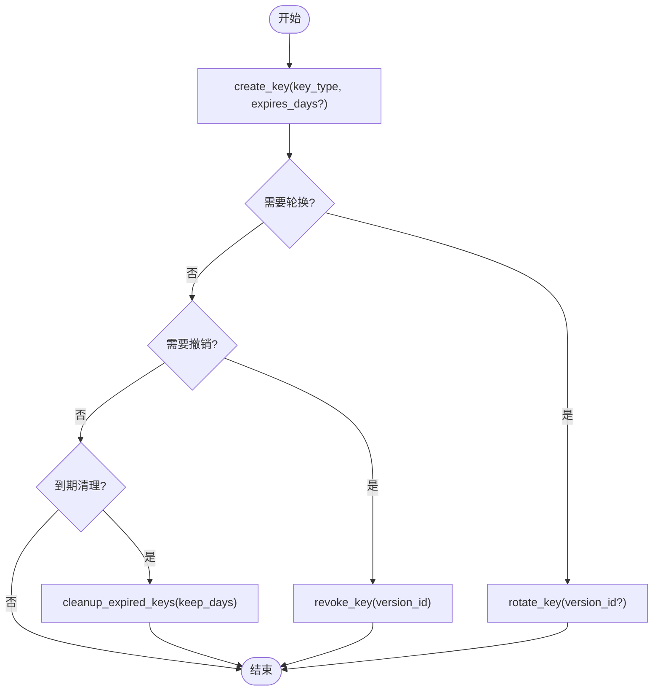
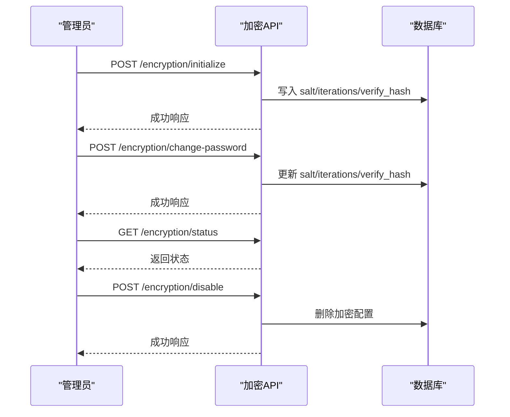
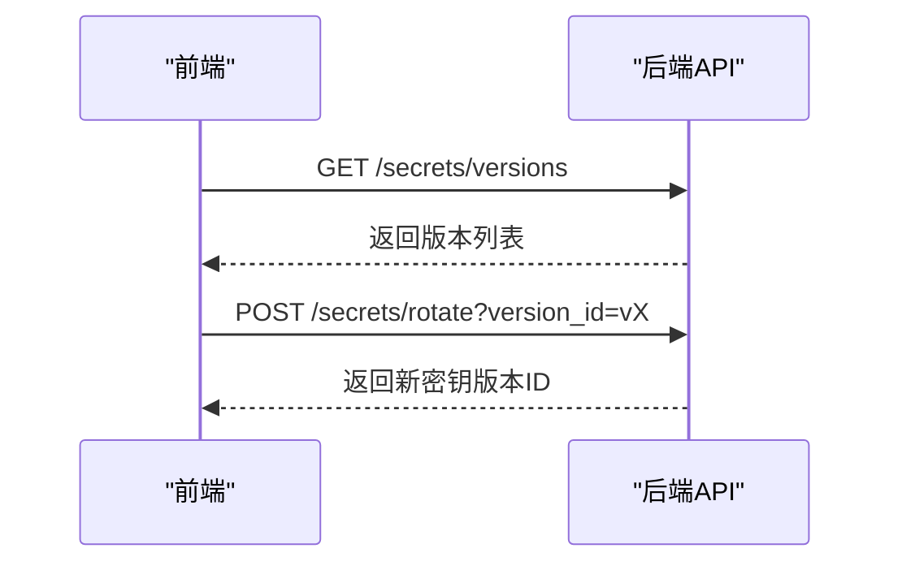
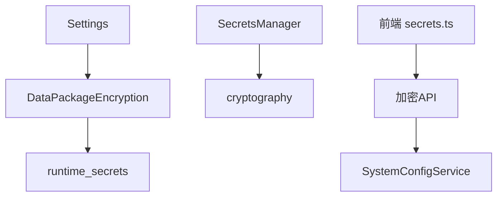
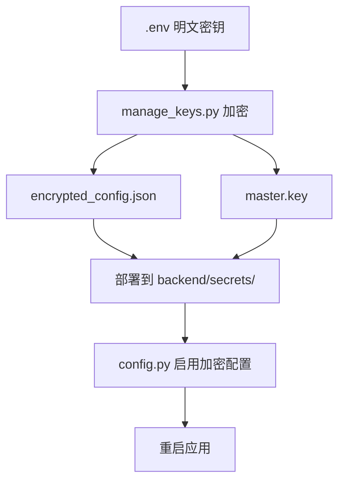

# 加密配置管理

<cite>
**本文引用的文件**
- [backend/app/core/config.py](file://backend/app/core/config.py)
- [backend/app/utils/encryption.py](file://backend/app/utils/encryption.py)
- [backend/app/services/aes_gcm_cipher.py](file://backend/app/services/aes_gcm_cipher.py)
- [backend/app/services/secrets_manager.py](file://backend/app/services/secrets_manager.py)
- [backend/app/api/v1/encryption.py](file://backend/app/api/v1/encryption.py)
- [backend/scripts/manage_keys.py](file://backend/scripts/manage_keys.py)
- [backend/tests/unit/test_runtime_secrets.py](file://backend/tests/unit/test_runtime_secrets.py)
- [frontend/src/api/secrets.ts](file://frontend/src/api/secrets.ts)
</cite>

## 目录
1. [简介](#简介)
2. [项目结构](#项目结构)
3. [核心组件](#核心组件)
4. [架构总览](#架构总览)
5. [详细组件分析](#详细组件分析)
6. [依赖关系分析](#依赖关系分析)
7. [性能与安全考量](#性能与安全考量)
8. [故障排查指南](#故障排查指南)
9. [结论](#结论)
10. [附录：热更新、版本兼容与迁移工具](#附录热更新版本兼容与迁移工具)

## 简介
本文件面向“USE_ENCRYPTED_SECRETS”模式下的加密配置管理，系统性说明主密钥管理、配置文件加密/解密流程、加密算法选择、密钥派生方式、安全存储策略，以及热更新、版本兼容性与迁移工具的使用。目标是帮助运维与开发人员在单机离线环境中安全地启用、轮换与维护敏感配置（如 SECRET_KEY、CSRF_SECRET_KEY、SMTP_PASSWORD、DB_ENCRYPTION_KEY 等）。

## 项目结构
围绕加密配置管理的核心代码分布在以下位置：
- 配置加载与开关：backend/app/core/config.py
- 数据包加密工具（Fernet + PBKDF2）：backend/app/utils/encryption.py
- 高安全 AES-256-GCM 加解密密钥服务：backend/app/services/aes_gcm_cipher.py
- 运行时密钥存储（持久化到本地 JSON）：backend/app/utils/runtime_secrets.py（通过测试文件引用）
- 密钥管理服务（版本化、轮换、撤销、清理）：backend/app/services/secrets_manager.py
- 数据库加密管理 API（初始化/改密/禁用/状态）：backend/app/api/v1/encryption.py
- 迁移与生成工具（将 .env 中的敏感项加密为配置文件）：backend/scripts/manage_keys.py
- 前端密钥管理 API 调用封装：frontend/src/api/secrets.ts

**图表来源**
- [backend/app/core/config.py:243-299](file://backend/app/core/config.py#L243-L299)
- [backend/app/utils/encryption.py:167-178](file://backend/app/utils/encryption.py#L167-L178)

**章节来源**
- [backend/app/core/config.py:54-94](file://backend/app/core/config.py#L54-L94)
- [backend/app/core/config.py:243-299](file://backend/app/core/config.py#L243-L299)

## 核心组件
- 配置中心 Settings：提供 USE_ENCRYPTED_SECRETS、SECRETS_FILE_PATH、MASTER_KEY_PATH、ENCRYPTION_BACKEND、ENCRYPTION_KEY_DERIVATION 等开关与路径；在 model_post_init 中根据开关决定是否加载加密配置。
- 数据加密器 DataPackageEncryption：基于 Fernet 的对称加密，支持从密码派生密钥（PBKDF2-SHA256），并提供 key 字符串序列化与反序列化。
- AES-256-GCM 加解密密钥服务：提供更高强度的 AEAD 加密能力，用于字段级或文件级高安全场景。
- 密钥管理服务 SecretsManager：维护密钥版本、轮换、撤销与过期清理，支持 fernet/aes 等多种类型。
- 运行时密钥存储：将临时/持久化密钥（如 ENCRYPTION_FERNET_KEY、部署盐值）保存在本地 JSON 文件中，避免重启丢失。
- 数据库加密管理 API：提供初始化、修改密码、禁用、状态查询等管理能力。
- 迁移工具 manage_keys.py：将明文敏感配置加密为 encrypted_config.json，并输出启用步骤。

**章节来源**
- [backend/app/core/config.py:75-94](file://backend/app/core/config.py#L75-L94)
- [backend/app/utils/encryption.py:17-81](file://backend/app/utils/encryption.py#L17-L81)
- [backend/app/services/aes_gcm_cipher.py:13-59](file://backend/app/services/aes_gcm_cipher.py#L13-L59)
- [backend/app/services/secrets_manager.py:13-188](file://backend/app/services/secrets_manager.py#L13-L188)
- [backend/tests/unit/test_runtime_secrets.py:163-243](file://backend/tests/unit/test_runtime_secrets.py#L163-L243)
- [backend/app/api/v1/encryption.py:67-196](file://backend/app/api/v1/encryption.py#L67-L196)
- [backend/scripts/manage_keys.py:101-139](file://backend/scripts/manage_keys.py#L101-L139)

## 架构总览
下图展示了在启用加密配置后，系统启动时如何加载主密钥、解密配置文件，并将结果注入到全局配置对象中，供后续模块使用。

**图表来源**
- [backend/app/core/config.py:243-299](file://backend/app/core/config.py#L243-L299)
- [backend/app/utils/encryption.py:167-178](file://backend/app/utils/encryption.py#L167-L178)

## 详细组件分析

### 配置加载与主密钥管理（USE_ENCRYPTED_SECRETS）
- 开关与路径
  - USE_ENCRYPTED_SECRETS：是否启用加密配置加载。
  - SECRETS_FILE_PATH：加密配置文件路径。
  - MASTER_KEY_PATH：主密钥文件路径。
- 加载流程
  - 若任一文件不存在，记录警告并回退到环境变量。
  - 读取主密钥后，构造 DataPackageEncryption 实例。
  - 逐项解密并覆盖配置值（SECRET_KEY、CSRF_SECRET_KEY、SMTP_PASSWORD、DB_ENCRYPTION_KEY）。
- 错误处理
  - 单个键解密失败会记录错误并继续处理其他键。
  - 整体加载失败会记录错误并回退到环境变量。

**图表来源**
- [backend/app/core/config.py:243-299](file://backend/app/core/config.py#L243-L299)

**章节来源**
- [backend/app/core/config.py:75-94](file://backend/app/core/config.py#L75-L94)
- [backend/app/core/config.py:243-299](file://backend/app/core/config.py#L243-L299)

### 加密算法与密钥派生
- 数据包加密（Fernet）
  - 使用 cryptography.fernet.Fernet 进行对称加密。
  - 支持从密码派生密钥：PBKDF2-HMAC-SHA256，迭代次数≥600,000（OWASP 基线）。
  - 部署唯一盐值：从运行时密钥存储加载或生成，确保跨进程一致且可恢复。
- 高安全 AES-256-GCM
  - 每个操作使用随机 12 字节 nonce，密文格式包含认证标签，防篡改。
  - 适用于对安全性要求更高的字段或文件加密场景。
- 密钥派生方式
  - ENCRYPTION_KEY_DERIVATION：pbkdf2（推荐）或 raw（直接使用密钥）。
  - ENCRYPTION_BACKEND：aes256（AES-256-GCM，高安全）或 fernet（兼容旧版）。

**图表来源**
- [backend/app/utils/encryption.py:17-81](file://backend/app/utils/encryption.py#L17-L81)
- [backend/app/services/aes_gcm_cipher.py:13-59](file://backend/app/services/aes_gcm_cipher.py#L13-L59)

**章节来源**
- [backend/app/utils/encryption.py:17-81](file://backend/app/utils/encryption.py#L17-L81)
- [backend/app/services/aes_gcm_cipher.py:13-59](file://backend/app/services/aes_gcm_cipher.py#L13-L59)

### 配置文件格式与安全存储
- 配置文件格式
  - encrypted_config.json：JSON 对象，键为配置项名，值为 Base64 编码的密文字符串。
  - master.key：主密钥字符串（Fernet 密钥）。
- 安全存储策略
  - 主密钥文件权限应严格限制（仅所有者可读）。
  - 运行时密钥存储（runtime_secrets.json）用于保存部署盐值、Fernet 密钥等，避免重启丢失。
  - 生产环境强制关闭 DB_ECHO，防止敏感信息进入日志。

**图表来源**
- [backend/app/core/config.py:243-299](file://backend/app/core/config.py#L243-L299)
- [backend/tests/unit/test_runtime_secrets.py:163-243](file://backend/tests/unit/test_runtime_secrets.py#L163-L243)

**章节来源**
- [backend/app/core/config.py:243-299](file://backend/app/core/config.py#L243-L299)
- [backend/tests/unit/test_runtime_secrets.py:163-243](file://backend/tests/unit/test_runtime_secrets.py#L163-L243)

### 密钥生命周期管理（版本化、轮换、撤销、清理）
- 版本化
  - 每次创建或轮转会生成新的 version_id，并记录 key_type、created_at、is_active、expires_at（可选）。
- 轮换
  - rotate_key(version_id=None)：停用所有其他版本，激活新版本。
  - rotate_key(version_id="vX")：仅停用指定版本。
- 撤销
  - revoke_key(version_id)：标记为不可用并记录撤销时间。
- 清理
  - cleanup_expired_keys(keep_days=90)：删除超过保留期的非活跃版本及其密钥。

**图表来源**
- [backend/app/services/secrets_manager.py:71-188](file://backend/app/services/secrets_manager.py#L71-L188)

**章节来源**
- [backend/app/services/secrets_manager.py:71-188](file://backend/app/services/secrets_manager.py#L71-L188)

### 数据库加密管理 API
- 初始化：生成盐值与验证哈希，写入系统配置，启用数据库加密。
- 修改密码：验证旧密码后重新生成盐值与验证哈希。
- 禁用：验证密码后清除加密相关配置。
- 状态：返回是否启用、是否有盐值、迭代次数等信息。

**图表来源**
- [backend/app/api/v1/encryption.py:67-196](file://backend/app/api/v1/encryption.py#L67-L196)

**章节来源**
- [backend/app/api/v1/encryption.py:67-196](file://backend/app/api/v1/encryption.py#L67-L196)

### 前端密钥管理接口
- 列出密钥版本：GET /secrets/versions
- 轮换密钥：POST /secrets/rotate?version_id=...

**图表来源**
- [frontend/src/api/secrets.ts:46-57](file://frontend/src/api/secrets.ts#L46-L57)

**章节来源**
- [frontend/src/api/secrets.ts:46-57](file://frontend/src/api/secrets.ts#L46-L57)

## 依赖关系分析
- 配置层依赖加密工具：Settings 在启用加密配置时依赖 DataPackageEncryption。
- 加密工具依赖运行时密钥存储：部署盐值与 Fernet 密钥通过 runtime_secrets 持久化。
- 密钥管理服务独立于配置加载：SecretsManager 负责密钥版本化与生命周期管理。
- 数据库加密 API 与系统配置服务交互：通过 SystemConfigService 读写加密参数。
- 前端通过 API 与后端交互：实现密钥版本管理与轮换。

**图表来源**
- [backend/app/core/config.py:243-299](file://backend/app/core/config.py#L243-L299)
- [backend/app/utils/encryption.py:17-81](file://backend/app/utils/encryption.py#L17-L81)
- [backend/app/services/secrets_manager.py:13-188](file://backend/app/services/secrets_manager.py#L13-L188)
- [backend/app/api/v1/encryption.py:67-196](file://backend/app/api/v1/encryption.py#L67-L196)
- [frontend/src/api/secrets.ts:46-57](file://frontend/src/api/secrets.ts#L46-L57)

**章节来源**
- [backend/app/core/config.py:243-299](file://backend/app/core/config.py#L243-L299)
- [backend/app/utils/encryption.py:17-81](file://backend/app/utils/encryption.py#L17-L81)
- [backend/app/services/secrets_manager.py:13-188](file://backend/app/services/secrets_manager.py#L13-L188)
- [backend/app/api/v1/encryption.py:67-196](file://backend/app/api/v1/encryption.py#L67-L196)
- [frontend/src/api/secrets.ts:46-57](file://frontend/src/api/secrets.ts#L46-L57)

## 性能与安全考量
- 性能
  - PBKDF2 迭代次数较高（≥600,000），会增加密钥派生开销；建议仅在必要时使用密码派生，优先使用直接密钥。
  - AES-256-GCM 提供高效 AEAD 加密，适合高频字段加密。
  - 运行时密钥存储采用 JSON 文件，注意磁盘 I/O 与并发写入保护（原子写入）。
- 安全
  - 主密钥文件权限严格控制（仅所有者可读）。
  - 生产环境强制关闭 DB_ECHO，避免敏感信息泄露到日志。
  - 部署盐值持久化，保证同一部署内密钥一致性；若无法持久化则降级为随机盐，可能影响历史数据解密。
  - 密钥轮换与撤销机制降低密钥泄露风险；过期清理减少冗余密钥占用。

[本节为通用指导，不直接分析具体文件]

## 故障排查指南
- 加密配置加载失败
  - 检查 master.key 与 encrypted_config.json 是否存在且路径正确。
  - 查看日志中的警告与错误信息，确认是否回退到环境变量。
- 解密失败
  - 确认主密钥是否正确；尝试使用迁移工具重新生成加密配置。
  - 检查运行时密钥存储文件权限与完整性。
- 数据库加密问题
  - 使用 /encryption/status 查询当前状态。
  - 如需禁用，请先验证密码再执行禁用操作。
- 密钥版本管理
  - 使用 /secrets/versions 查看版本列表。
  - 使用 /secrets/rotate 进行轮换；必要时使用 revoke_key 撤销旧版本。
  - 定期执行 cleanup_expired_keys 清理过期密钥。

**章节来源**
- [backend/app/core/config.py:243-299](file://backend/app/core/config.py#L243-L299)
- [backend/app/api/v1/encryption.py:151-196](file://backend/app/api/v1/encryption.py#L151-L196)
- [backend/app/services/secrets_manager.py:159-188](file://backend/app/services/secrets_manager.py#L159-L188)
- [frontend/src/api/secrets.ts:46-57](file://frontend/src/api/secrets.ts#L46-L57)

## 结论
在 USE_ENCRYPTED_SECRETS 模式下，系统通过主密钥与加密配置文件实现敏感配置的集中化管理与动态加载。结合 PBKDF2 密钥派生、Fernet/AES-256-GCM 加密算法、运行时密钥存储与密钥版本化管理，提供了高安全、可运维的配置管理体系。配合迁移工具与前端 API，可实现平滑的密钥轮换与生命周期管理，满足单机离线环境的安全基线要求。

[本节为总结性内容，不直接分析具体文件]

## 附录：热更新、版本兼容与迁移工具
- 热更新
  - 配置加载发生在应用启动阶段；如需热更新，需重启应用以重新加载加密配置。
  - 密钥版本管理支持运行时轮换与撤销，但配置值的生效仍依赖启动加载。
- 版本兼容性
  - 支持 fernet 与 aes256 两种后端；建议在新场景中优先使用 aes256。
  - 密钥版本记录包含 key_type、created_at、expires_at，便于兼容不同算法与生命周期管理。
- 迁移工具
  - 使用 manage_keys.py 将 .env 中的敏感项加密为 encrypted_config.json，并生成启用步骤。
  - 将 master.key 与 encrypted_config.json 放置到指定目录，设置 USE_ENCRYPTED_SECRETS=True 后重启应用。

**图表来源**
- [backend/scripts/manage_keys.py:101-139](file://backend/scripts/manage_keys.py#L101-L139)
- [backend/app/core/config.py:75-94](file://backend/app/core/config.py#L75-L94)

**章节来源**
- [backend/scripts/manage_keys.py:101-139](file://backend/scripts/manage_keys.py#L101-L139)
- [backend/app/core/config.py:75-94](file://backend/app/core/config.py#L75-L94)