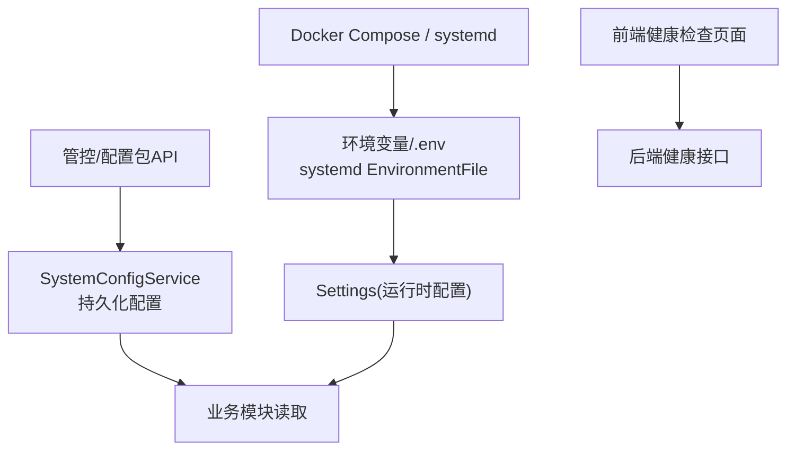
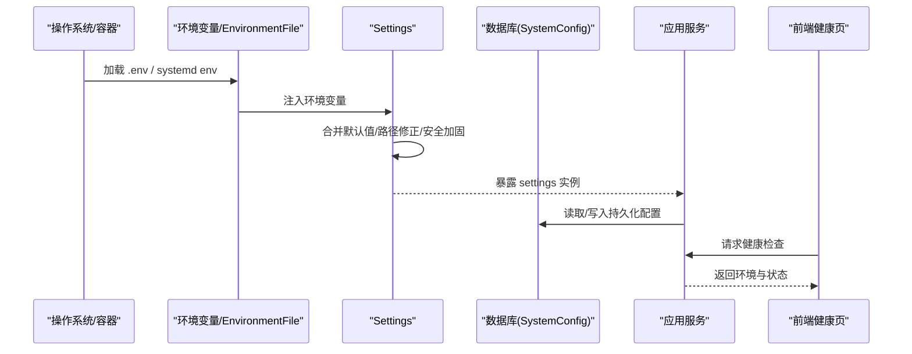
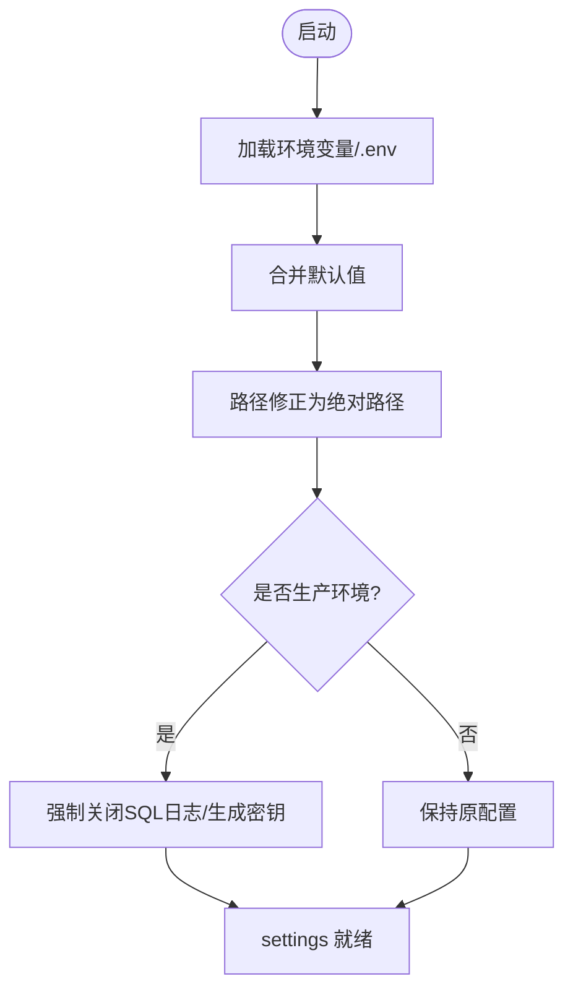
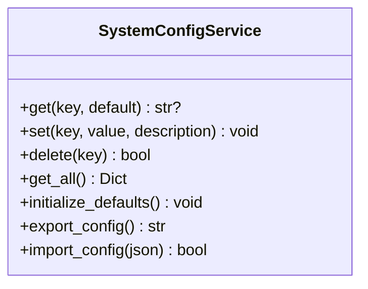
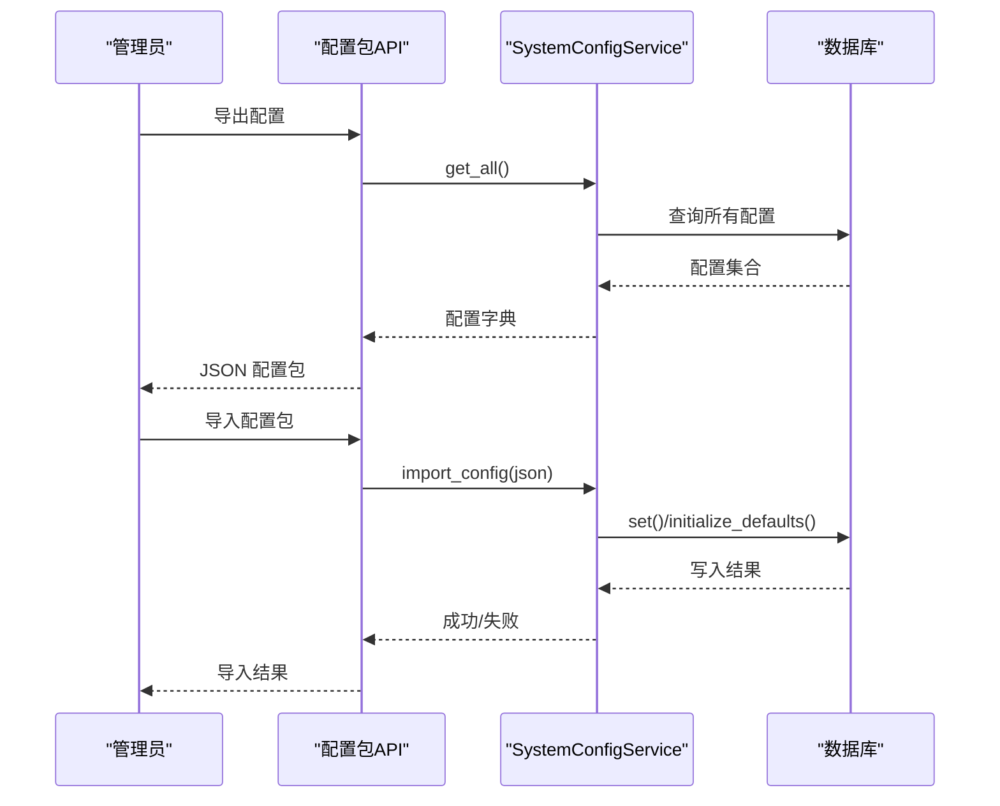
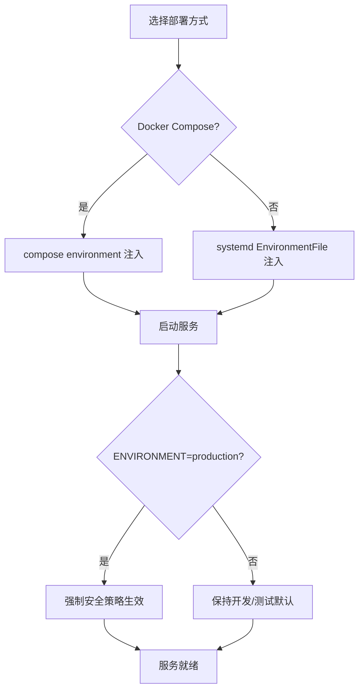

# 多环境配置管理

<cite>
**本文引用的文件**
- [backend/app/core/config.py](file://backend/app/core/config.py)
- [deploy/kylin/config/kylin.env](file://deploy/kylin/config/kylin.env)
- [docker-compose.yml](file://docker-compose.yml)
- [docker/Dockerfile.kylin-standalone](file://docker/Dockerfile.kylin-standalone)
- [deploy/kylin/scripts/start-kylin.sh](file://deploy/kylin/scripts/start-kylin.sh)
- [backend/app/services/system_config_service.py](file://backend/app/services/system_config_service.py)
- [backend/app/api/v1/system/config_package.py](file://backend/app/api/v1/system/config_package.py)
- [backend/app/api/v1/control_package.py](file://backend/app/api/v1/control_package.py)
- [backend/app/main.py](file://backend/app/main.py)
- [frontend/src/views/system/EnvCheck.vue](file://frontend/src/views/system/EnvCheck.vue)
- [frontend/src/views/system/About.vue](file://frontend/src/views/system/About.vue)
</cite>

## 目录
1. [简介](#简介)
2. [项目结构](#项目结构)
3. [核心组件](#核心组件)
4. [架构总览](#架构总览)
5. [详细组件分析](#详细组件分析)
6. [依赖关系分析](#依赖关系分析)
7. [性能与安全调优](#性能与安全调优)
8. [故障排查指南](#故障排查指南)
9. [结论](#结论)
10. [附录](#附录)

## 简介
本文件面向开发、测试、生产等多环境的配置隔离与管理，覆盖以下主题：
- 环境变量优先级与继承覆盖机制
- 环境特定安全策略（如 CSRF、CORS、Token 有效期）
- 性能调优参数（数据库连接池、日志级别等）
- 监控与健康检查配置
- 环境切换工具与验证方法
- 部署自动化脚本与环境注入方式

## 项目结构
系统采用“运行时配置 + 持久化配置”的双层设计：
- 运行时配置：通过环境变量与 .env 文件加载，由 Settings 类统一解析并应用默认值、路径修正与安全加固。
- 持久化配置：通过 SystemConfigService 将业务可热更新的配置项持久化到数据库，支持导出/导入与管控包下发。

图表来源
- [backend/app/core/config.py:54-104](file://backend/app/core/config.py#L54-L104)
- [backend/app/services/system_config_service.py:68-95](file://backend/app/services/system_config_service.py#L68-L95)
- [docker-compose.yml:32-50](file://docker-compose.yml#L32-L50)
- [deploy/kylin/config/kylin.env:6-44](file://deploy/kylin/config/kylin.env#L6-L44)

章节来源
- [backend/app/core/config.py:54-104](file://backend/app/core/config.py#L54-L104)
- [docker-compose.yml:32-50](file://docker-compose.yml#L32-L50)
- [deploy/kylin/config/kylin.env:6-44](file://deploy/kylin/config/kylin.env#L6-L44)

## 核心组件
- Settings（运行时配置）：集中定义所有运行期可调参数，支持从多个 .env 源加载，提供类型校验、默认值、路径动态修正与安全强制策略。
- SystemConfigService（持久化配置）：维护系统级键值配置，支持默认值、类型转换、导入导出与初始化。
- 配置包 API：提供系统配置的打包导出与导入能力，便于跨环境迁移与批量下发。
- 部署注入器：Docker Compose 与 systemd EnvironmentFile 负责在不同环境注入环境变量。

章节来源
- [backend/app/core/config.py:54-104](file://backend/app/core/config.py#L54-L104)
- [backend/app/services/system_config_service.py:68-95](file://backend/app/services/system_config_service.py#L68-L95)
- [backend/app/api/v1/system/config_package.py:28-41](file://backend/app/api/v1/system/config_package.py#L28-L41)

## 架构总览
下图展示多环境配置在启动与运行时的流转：

图表来源
- [backend/app/core/config.py:54-104](file://backend/app/core/config.py#L54-L104)
- [backend/app/services/system_config_service.py:100-126](file://backend/app/services/system_config_service.py#L100-L126)
- [docker-compose.yml:32-50](file://docker-compose.yml#L32-L50)
- [deploy/kylin/config/kylin.env:6-44](file://deploy/kylin/config/kylin.env#L6-L44)

## 详细组件分析

### 运行时配置（Settings）
- 配置来源与优先级
  - 按 pydantic-settings 规则加载多个 .env 文件，随后被进程环境变量覆盖。
  - Docker Compose 通过 environment 字段注入；麒麟桌面版通过 systemd EnvironmentFile 注入。
- 默认值与路径修正
  - 数据库 URL、缓存/上传/导出/日志目录在未显式设置时自动计算为绝对路径，避免权限问题。
- 安全加固
  - 生产环境强制关闭 SQL echo，防止敏感信息进入日志。
  - 生产环境若未配置加密密钥，则自动生成并持久化到运行时密钥存储。
  - Token 有效期、CSRF、CORS 等安全开关可按环境调整。
- 性能相关
  - 数据库连接池大小、超时、回收策略、慢查询阈值等均可配置。
- 监控与健康
  - 指标端口、健康检查开关等可配置。

图表来源
- [backend/app/core/config.py:54-104](file://backend/app/core/config.py#L54-L104)
- [backend/app/core/config.py:296-364](file://backend/app/core/config.py#L296-L364)

章节来源
- [backend/app/core/config.py:54-104](file://backend/app/core/config.py#L54-L104)
- [backend/app/core/config.py:296-364](file://backend/app/core/config.py#L296-L364)

### 持久化配置（SystemConfigService）
- 职责
  - 提供键值型系统配置的增删改查、类型转换、导入导出与初始化。
  - 作为业务逻辑中“可热更新”的配置中心。
- 默认配置
  - 内置多项默认键（如备份策略、数据保留天数、异常检测阈值等），首次启动或无库时可回退到默认值。
- 使用场景
  - 运维可在不重启服务的情况下调整行为（如备份间隔、保留天数、自动打包开关）。

图表来源
- [backend/app/services/system_config_service.py:68-95](file://backend/app/services/system_config_service.py#L68-L95)
- [backend/app/services/system_config_service.py:100-126](file://backend/app/services/system_config_service.py#L100-L126)
- [backend/app/services/system_config_service.py:155-189](file://backend/app/services/system_config_service.py#L155-L189)
- [backend/app/services/system_config_service.py:203-218](file://backend/app/services/system_config_service.py#L203-L218)
- [backend/app/services/system_config_service.py:252-265](file://backend/app/services/system_config_service.py#L252-L265)

章节来源
- [backend/app/services/system_config_service.py:68-95](file://backend/app/services/system_config_service.py#L68-L95)
- [backend/app/services/system_config_service.py:100-126](file://backend/app/services/system_config_service.py#L100-L126)
- [backend/app/services/system_config_service.py:155-189](file://backend/app/services/system_config_service.py#L155-L189)
- [backend/app/services/system_config_service.py:203-218](file://backend/app/services/system_config_service.py#L203-L218)
- [backend/app/services/system_config_service.py:252-265](file://backend/app/services/system_config_service.py#L252-L265)

### 配置包与管控包
- 系统配置包
  - 提供导出/导入 JSON 的能力，用于跨环境迁移或批量下发。
- 管控包
  - 可将系统配置与策略打包分发，并在目标端应用，实现集中治理。

图表来源
- [backend/app/api/v1/system/config_package.py:28-41](file://backend/app/api/v1/system/config_package.py#L28-L41)
- [backend/app/api/v1/control_package.py:77-107](file://backend/app/api/v1/control_package.py#L77-L107)
- [backend/app/api/v1/control_package.py:232-260](file://backend/app/api/v1/control_package.py#L232-L260)
- [backend/app/services/system_config_service.py:252-265](file://backend/app/services/system_config_service.py#L252-L265)

章节来源
- [backend/app/api/v1/system/config_package.py:28-41](file://backend/app/api/v1/system/config_package.py#L28-L41)
- [backend/app/api/v1/control_package.py:77-107](file://backend/app/api/v1/control_package.py#L77-L107)
- [backend/app/api/v1/control_package.py:232-260](file://backend/app/api/v1/control_package.py#L232-L260)
- [backend/app/services/system_config_service.py:252-265](file://backend/app/services/system_config_service.py#L252-L265)

### 部署注入与环境切换
- Docker Compose
  - 通过 environment 注入关键变量（版本、数据库、密钥、日志级别等），并挂载数据与日志卷。
- 麒麟桌面版
  - systemd EnvironmentFile 注入生产环境专用配置（数据库路径、目录、安全开关等）。
  - 启动脚本负责健康检查与服务拉起，必要时降级到用户目录以避免权限问题。
- 环境切换
  - 通过修改环境变量或替换 EnvironmentFile 完成环境切换；Settings 会在启动时根据 ENVIRONMENT 执行安全加固。

图表来源
- [docker-compose.yml:32-50](file://docker-compose.yml#L32-L50)
- [deploy/kylin/config/kylin.env:6-44](file://deploy/kylin/config/kylin.env#L6-L44)
- [deploy/kylin/scripts/start-kylin.sh:78-136](file://deploy/kylin/scripts/start-kylin.sh#L78-L136)
- [backend/app/core/config.py:296-364](file://backend/app/core/config.py#L296-L364)

章节来源
- [docker-compose.yml:32-50](file://docker-compose.yml#L32-L50)
- [deploy/kylin/config/kylin.env:6-44](file://deploy/kylin/config/kylin.env#L6-L44)
- [deploy/kylin/scripts/start-kylin.sh:78-136](file://deploy/kylin/scripts/start-kylin.sh#L78-L136)
- [backend/app/core/config.py:296-364](file://backend/app/core/config.py#L296-L364)

### 前端环境感知与健康检查
- 前端提供“环境检查”与“关于”页面，展示当前运行模式、依赖完整性等信息，辅助定位环境问题。
- 健康检查由后端提供，启动脚本会轮询直至服务就绪。

章节来源
- [frontend/src/views/system/EnvCheck.vue:138-172](file://frontend/src/views/system/EnvCheck.vue#L138-L172)
- [frontend/src/views/system/About.vue:116-132](file://frontend/src/views/system/About.vue#L116-L132)
- [deploy/kylin/scripts/start-kylin.sh:30-40](file://deploy/kylin/scripts/start-kylin.sh#L30-L40)

## 依赖关系分析
- Settings 依赖 pydantic-settings 进行配置解析，并通过运行时密钥工具确保密钥可用性。
- SystemConfigService 依赖数据库会话读写持久化配置。
- 部署层（Compose/systemd）仅负责注入环境变量，不直接耦合业务逻辑。

图表来源
- [backend/app/core/config.py:54-104](file://backend/app/core/config.py#L54-L104)
- [backend/app/services/system_config_service.py:68-95](file://backend/app/services/system_config_service.py#L68-L95)

章节来源
- [backend/app/core/config.py:54-104](file://backend/app/core/config.py#L54-L104)
- [backend/app/services/system_config_service.py:68-95](file://backend/app/services/system_config_service.py#L68-L95)

## 性能与安全调优
- 性能调优
  - 数据库连接池：根据并发规模调整连接数、溢出、超时与回收策略。
  - 慢查询阈值：降低以更快发现瓶颈。
  - 日志级别：生产建议 INFO，调试阶段可临时提高至 DEBUG。
  - 缓存：启用本地缓存并设置合理 TTL 与上限。
- 安全策略
  - 生产环境强制关闭 SQL echo，避免敏感信息入日志。
  - 生产环境强制生成并持久化加密密钥，避免使用默认或空密钥。
  - CORS 限制为可信来源；CSRF 在生产或离线单机按需开启/关闭。
  - Token 有效期与密码策略按环境收紧或放宽。
- 监控与健康
  - 指标端口与健康检查开关可按需启用；启动脚本包含健康探测与超时处理。

章节来源
- [backend/app/core/config.py:95-104](file://backend/app/core/config.py#L95-L104)
- [backend/app/core/config.py:126-159](file://backend/app/core/config.py#L126-L159)
- [backend/app/core/config.py:185-188](file://backend/app/core/config.py#L185-L188)
- [backend/app/core/config.py:296-364](file://backend/app/core/config.py#L296-L364)
- [deploy/kylin/scripts/start-kylin.sh:30-40](file://deploy/kylin/scripts/start-kylin.sh#L30-L40)

## 故障排查指南
- 启动失败或服务崩溃
  - 检查 systemd 日志或应用日志目录；确认健康检查是否通过。
  - 确认环境变量是否正确注入（DATABASE_URL、SECRET_KEY、LOG_LEVEL 等）。
- 权限问题
  - 当系统目录不可写时，启动脚本会自动降级到用户目录，避免 SQLite/日志打开失败。
- 配置不一致
  - 使用配置包导出/导入核对各环境差异；必要时通过管控包统一下发。
- 安全告警
  - 生产环境若出现 SQL echo 或空密钥，应检查 ENVIRONMENT 与 Settings 的强制策略是否生效。

章节来源
- [deploy/kylin/scripts/start-kylin.sh:78-136](file://deploy/kylin/scripts/start-kylin.sh#L78-L136)
- [backend/app/core/config.py:296-364](file://backend/app/core/config.py#L296-L364)
- [backend/app/api/v1/system/config_package.py:28-41](file://backend/app/api/v1/system/config_package.py#L28-L41)

## 结论
本方案通过“运行时配置 + 持久化配置”的双层体系，实现了多环境下的灵活隔离与统一管理：
- 环境变量与 .env 提供灵活的运行时覆盖；
- SystemConfigService 提供可热更新的持久化配置；
- 部署层（Compose/systemd）保证不同环境的一致注入；
- 安全与性能策略在启动时按环境自动强化；
- 配置包与管控包简化跨环境迁移与治理。

## 附录
- 常用环境变量清单（示例）
  - 运行环境：ENVIRONMENT、DEBUG
  - 服务绑定：HOST、PORT
  - 数据库：DATABASE_URL、DB_POOL_*
  - 安全：ACCESS_TOKEN_EXPIRE_MINUTES、REFRESH_TOKEN_EXPIRE_DAYS、CSRF_ENABLED、CORS_ORIGINS
  - 日志：LOG_LEVEL、LOG_DIR、LOG_FILE
  - 缓存：CACHE_ENABLED、CACHE_DEFAULT_TTL
  - 监控：METRICS_ENABLED、HEALTH_CHECK_ENABLED
- 环境切换建议
  - 开发：开启 DEBUG、适度放宽 CORS、提高日志级别
  - 测试：关闭 CSRF（如需）、固定数据库与缓存路径
  - 生产：严格 CORS、开启安全加固、收紧 Token 有效期、关闭 SQL echo