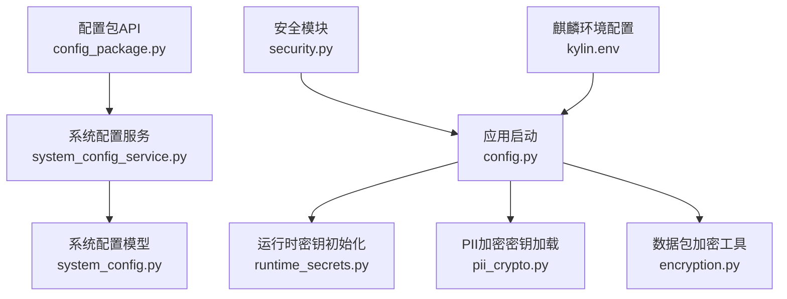
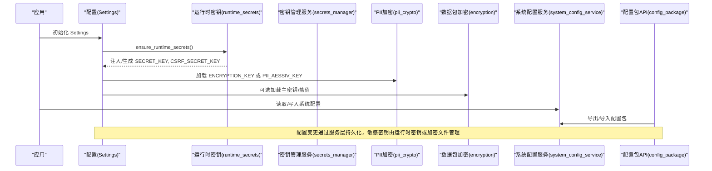
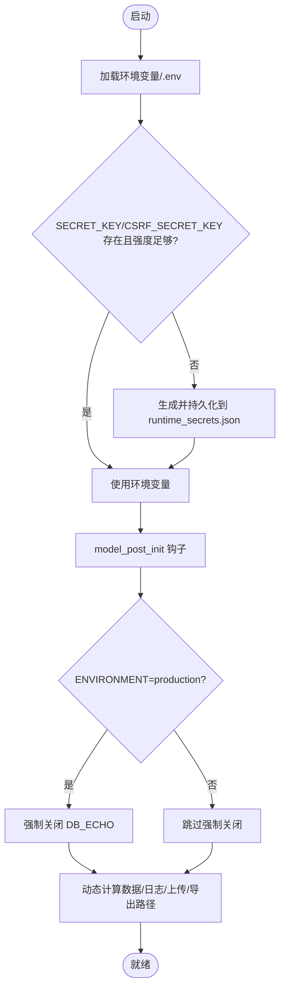
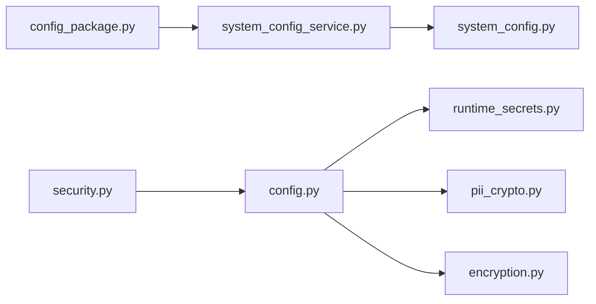

# 安全配置管理

<cite>
**本文引用的文件**
- [backend/app/core/config.py](file://backend/app/core/config.py)
- [backend/app/utils/runtime_secrets.py](file://backend/app/utils/runtime_secrets.py)
- [backend/app/services/secrets_manager.py](file://backend/app/services/secrets_manager.py)
- [backend/app/core/pii_crypto.py](file://backend/app/core/pii_crypto.py)
- [backend/app/models/system_config.py](file://backend/app/models/system_config.py)
- [backend/app/services/system_config_service.py](file://backend/app/services/system_config_service.py)
- [backend/app/api/v1/system/config_package.py](file://backend/app/api/v1/system/config_package.py)
- [backend/app/utils/encryption.py](file://backend/app/utils/encryption.py)
- [backend/app/core/security.py](file://backend/app/core/security.py)
- [deploy/kylin/config/kylin.env](file://deploy/kylin/config/kylin.env)
- [backend/scripts/update_env_security.py](file://backend/scripts/update_env_security.py)
</cite>

## 目录
1. [简介](#简介)
2. [项目结构](#项目结构)
3. [核心组件](#核心组件)
4. [架构总览](#架构总览)
5. [详细组件分析](#详细组件分析)
6. [依赖关系分析](#依赖关系分析)
7. [性能与安全性考量](#性能与安全性考量)
8. [故障排查指南](#故障排查指南)
9. [结论](#结论)
10. [附录：模板、迁移与自动化示例](#附录模板迁移与自动化示例)

## 简介
本文件面向“安全配置管理”，围绕环境变量配置、运行时密钥管理、配置文件安全、敏感数据加密存储、配置热更新、多环境配置管理、配置审计与回滚等主题，结合代码库中的实现进行系统化说明。目标是帮助读者在不深入源码的前提下，理解系统如何保障配置与密钥的安全性与可运维性，并给出最佳实践与落地建议。

## 项目结构
与安全配置相关的核心位置如下：
- 应用配置加载与默认值：backend/app/core/config.py
- 运行时密钥持久化与自动兜底：backend/app/utils/runtime_secrets.py
- 密钥版本管理与轮换：backend/app/services/secrets_manager.py
- PII字段透明加密（确定性AES-SIV）：backend/app/core/pii_crypto.py
- 数据包与文件级加密工具：backend/app/utils/encryption.py
- 系统配置模型与服务（键值型配置）：backend/app/models/system_config.py、backend/app/services/system_config_service.py
- 配置包导出/导入API（用于迁移与回滚）：backend/app/api/v1/system/config_package.py
- 安全中间件与认证相关常量：backend/app/core/security.py
- 部署环境示例与环境变量：deploy/kylin/config/kylin.env
- .env 安全修复脚本：backend/scripts/update_env_security.py

图表来源
- [backend/app/core/config.py:54-383](file://backend/app/core/config.py#L54-L383)
- [backend/app/utils/runtime_secrets.py:20-143](file://backend/app/utils/runtime_secrets.py#L20-L143)
- [backend/app/core/pii_crypto.py:30-64](file://backend/app/core/pii_crypto.py#L30-L64)
- [backend/app/utils/encryption.py:17-179](file://backend/app/utils/encryption.py#L17-L179)
- [backend/app/services/system_config_service.py:68-266](file://backend/app/services/system_config_service.py#L68-L266)
- [backend/app/models/system_config.py:11-51](file://backend/app/models/system_config.py#L11-L51)
- [backend/app/api/v1/system/config_package.py:50-84](file://backend/app/api/v1/system/config_package.py#L50-L84)
- [backend/app/core/security.py:61-90](file://backend/app/core/security.py#L61-L90)
- [deploy/kylin/config/kylin.env:1-49](file://deploy/kylin/config/kylin.env#L1-L49)

章节来源
- [backend/app/core/config.py:54-383](file://backend/app/core/config.py#L54-L383)
- [backend/app/utils/runtime_secrets.py:20-143](file://backend/app/utils/runtime_secrets.py#L20-L143)
- [backend/app/core/pii_crypto.py:30-64](file://backend/app/core/pii_crypto.py#L30-L64)
- [backend/app/utils/encryption.py:17-179](file://backend/app/utils/encryption.py#L17-L179)
- [backend/app/services/system_config_service.py:68-266](file://backend/app/services/system_config_service.py#L68-L266)
- [backend/app/models/system_config.py:11-51](file://backend/app/models/system_config.py#L11-L51)
- [backend/app/api/v1/system/config_package.py:50-84](file://backend/app/api/v1/system/config_package.py#L50-L84)
- [backend/app/core/security.py:61-90](file://backend/app/core/security.py#L61-L90)
- [deploy/kylin/config/kylin.env:1-49](file://deploy/kylin/config/kylin.env#L1-L49)

## 核心组件
- 应用配置中心（Settings）：集中定义所有运行期配置项，支持从环境变量、.env 文件读取，并提供默认值与路径动态计算；生产环境强制关闭 SQL 日志输出，防止敏感信息泄露。
- 运行时密钥管理：确保 SECRET_KEY、CSRF_SECRET_KEY 可用，若缺失则自动生成并原子落盘到 runtime_secrets.json，避免进程重启后失效。
- 密钥版本与轮换：提供密钥版本记录、轮换、撤销与过期清理能力，便于密钥生命周期管理。
- PII 字段透明加密：对敏感字段采用确定性 AES-SIV 加密，支持等值查询与历史明文兼容。
- 数据包/文件加密：基于 Fernet + PBKDF2 的强派生，支持文件加解密与校验和验证。
- 系统配置服务：以键值形式持久化非敏感业务配置，支持默认值、类型转换、导入导出。
- 配置包 API：提供配置的导出与导入接口，支撑环境迁移与回滚。
- 安全中间件与认证：JWT 签发与校验、密码策略、速率限制、安全响应头等。

章节来源
- [backend/app/core/config.py:54-383](file://backend/app/core/config.py#L54-L383)
- [backend/app/utils/runtime_secrets.py:20-143](file://backend/app/utils/runtime_secrets.py#L20-L143)
- [backend/app/services/secrets_manager.py:13-193](file://backend/app/services/secrets_manager.py#L13-L193)
- [backend/app/core/pii_crypto.py:30-94](file://backend/app/core/pii_crypto.py#L30-L94)
- [backend/app/utils/encryption.py:17-252](file://backend/app/utils/encryption.py#L17-L252)
- [backend/app/services/system_config_service.py:68-266](file://backend/app/services/system_config_service.py#L68-L266)
- [backend/app/api/v1/system/config_package.py:50-84](file://backend/app/api/v1/system/config_package.py#L50-L84)
- [backend/app/core/security.py:61-713](file://backend/app/core/security.py#L61-L713)

## 架构总览
下图展示了配置与密钥在启动与运行期的关键交互：

图表来源
- [backend/app/core/config.py:243-383](file://backend/app/core/config.py#L243-L383)
- [backend/app/utils/runtime_secrets.py:20-143](file://backend/app/utils/runtime_secrets.py#L20-L143)
- [backend/app/core/pii_crypto.py:30-64](file://backend/app/core/pii_crypto.py#L30-L64)
- [backend/app/utils/encryption.py:40-82](file://backend/app/utils/encryption.py#L40-L82)
- [backend/app/services/system_config_service.py:68-266](file://backend/app/services/system_config_service.py#L68-L266)
- [backend/app/api/v1/system/config_package.py:50-84](file://backend/app/api/v1/system/config_package.py#L50-L84)

## 详细组件分析

### 环境变量与配置加载（Settings）
- 支持从多个 .env 路径加载，忽略多余字段，大小写不敏感。
- 关键安全项：
  - SECRET_KEY、CSRF_SECRET_KEY：留空时由运行时密钥模块自动生成并持久化。
  - DB_ECHO：生产环境强制关闭，避免 SQL 日志泄露敏感数据。
  - ACCESS_TOKEN_EXPIRE_MINUTES、REFRESH_TOKEN_EXPIRE_DAYS：按基线设置有效期。
  - CORS_ORIGINS、TRUST_PROXY_HEADERS：严格限制跨域与代理信任。
- 路径动态化：数据库、缓存、上传、导出等目录根据平台与安装方式转换为绝对路径，避免权限问题。
- 可选加密配置：支持从加密文件加载密钥（需主密钥文件）。

图表来源
- [backend/app/core/config.py:54-383](file://backend/app/core/config.py#L54-L383)
- [backend/app/utils/runtime_secrets.py:20-143](file://backend/app/utils/runtime_secrets.py#L20-L143)

章节来源
- [backend/app/core/config.py:54-383](file://backend/app/core/config.py#L54-L383)

### 运行时密钥管理（runtime_secrets）
- 目标：保证 JWT 签名密钥与 CSRF 密钥始终可用。
- 策略：
  - 优先使用环境变量；
  - 其次读取 runtime_secrets.json；
  - 仍不存在则生成并原子写入该文件，同时注入到环境变量。
- 通用 get_or_create_secret：为任意密钥（如 PII_AESSIV_KEY、ENCRYPTION_SALT）提供持久化与自动生成能力。
- 安全特性：
  - 弱密钥检测（长度不足视为无效）；
  - 原子写入与 Unix 下 0o600 权限限制；
  - 失败降级到进程内随机密钥并告警。

章节来源
- [backend/app/utils/runtime_secrets.py:20-179](file://backend/app/utils/runtime_secrets.py#L20-L179)

### 密钥版本与轮换（secrets_manager）
- 功能：
  - 获取/设置/删除密钥；
  - 列出密钥版本；
  - 轮换密钥（支持指定版本或当前活跃版本）；
  - 创建新密钥（支持过期时间）；
  - 撤销密钥；
  - 清理过期/已撤销密钥。
- 用途：适用于需要密钥版本管理的场景（例如批量数据重加密、灰度切换）。

章节来源
- [backend/app/services/secrets_manager.py:13-193](file://backend/app/services/secrets_manager.py#L13-L193)

### PII 字段透明加密（pii_crypto）
- 算法：确定性 AES-SIV（RFC 5297），同一明文恒得同一密文，支持等值查询。
- 兼容：密文带标记前缀，未标记的历史明文直接返回，避免二次加密。
- 密钥来源：
  - 显式 ENCRYPTION_KEY（SHA-512 派生 64 字节 AESSIV 密钥）；
  - 或运行时密钥存储中的 PII_AESSIV_KEY（单机自动生成，跨重启保持）。
- 错误处理：解密失败记录日志并原样返回，避免阻断流程。

章节来源
- [backend/app/core/pii_crypto.py:30-94](file://backend/app/core/pii_crypto.py#L30-L94)

### 数据包与文件加密（encryption）
- 算法：Fernet + PBKDF2HMAC（≥600,000 迭代，OWASP 推荐）。
- 部署唯一盐值：从运行时密钥存储加载或生成，增强不同部署间的隔离。
- 能力：内存数据加解密、文件加解密、文件校验和计算与验证。
- 适用场景：数据包打包、备份加密、传输完整性校验。

章节来源
- [backend/app/utils/encryption.py:17-252](file://backend/app/utils/encryption.py#L17-L252)

### 系统配置服务与模型（system_config_service / system_config）
- 模型：键值对存储（key/value/description），附带创建/更新时间。
- 服务：
  - 默认配置集：包含系统标识、备份策略、异常检测阈值等；
  - 类型转换：get_int/get_bool/get_json；
  - 初始化默认配置；
  - 导入/导出 JSON 配置包；
  - 重新加载（刷新 ORM 缓存）。
- 用途：管理非敏感业务开关与参数，支持运行时修改与持久化。

章节来源
- [backend/app/models/system_config.py:11-51](file://backend/app/models/system_config.py#L11-L51)
- [backend/app/services/system_config_service.py:68-266](file://backend/app/services/system_config_service.py#L68-L266)

### 配置包 API（config_package）
- 端点：
  - 获取配置包列表；
  - 导出当前系统配置为配置包；
  - 导入配置包；
  - 删除配置包。
- 鉴权：需登录/管理员权限（由上层路由与依赖控制）。
- 用途：环境迁移、配置回滚、批量下发。

章节来源
- [backend/app/api/v1/system/config_package.py:50-84](file://backend/app/api/v1/system/config_package.py#L50-L84)

### 安全中间件与认证（security）
- JWT：签发与解码，支持黑名单与 token_version 强制下线。
- 密码策略：复杂度、弱口令检查、用户名格式校验。
- 速率限制：滑动窗口限流，防暴力破解与滥用。
- 安全头：X-Content-Type-Options、X-Frame-Options、Referrer-Policy 等。
- 审计日志：记录操作行为，支持资源与元数据。

章节来源
- [backend/app/core/security.py:61-713](file://backend/app/core/security.py#L61-L713)

## 依赖关系分析
- config.py 依赖 runtime_secrets.py 完成密钥兜底；依赖 pii_crypto.py 与 encryption.py 完成敏感数据加密；依赖 paths 工具完成路径解析。
- system_config_service.py 依赖 system_config 模型与事务封装 safe_commit。
- config_package API 依赖 system_config_service 实现配置包的导出/导入。
- security.py 依赖 settings 获取签名密钥与算法，依赖 token_blacklist 与 audit_context 实现吊销与审计。

图表来源
- [backend/app/core/config.py:243-383](file://backend/app/core/config.py#L243-L383)
- [backend/app/utils/runtime_secrets.py:20-143](file://backend/app/utils/runtime_secrets.py#L20-L143)
- [backend/app/core/pii_crypto.py:30-64](file://backend/app/core/pii_crypto.py#L30-L64)
- [backend/app/utils/encryption.py:17-179](file://backend/app/utils/encryption.py#L17-L179)
- [backend/app/services/system_config_service.py:68-266](file://backend/app/services/system_config_service.py#L68-L266)
- [backend/app/models/system_config.py:11-51](file://backend/app/models/system_config.py#L11-L51)
- [backend/app/api/v1/system/config_package.py:50-84](file://backend/app/api/v1/system/config_package.py#L50-L84)
- [backend/app/core/security.py:61-90](file://backend/app/core/security.py#L61-L90)

## 性能与安全性考量
- 性能
  - 数据库连接池与 WAL 模式提升 SQLite 并发读性能；慢查询阈值可调。
  - 本地缓存目录与大小限制，避免磁盘膨胀。
  - 速率限制保护后端免受滥用。
- 安全性
  - 生产环境强制关闭 SQL 日志输出，避免敏感信息泄露。
  - 运行时密钥自动兜底与原子落盘，降低密钥丢失风险。
  - PII 确定性加密兼顾查询效率与隐私保护。
  - 数据包加密采用高迭代 PBKDF2，抵御离线破解。
  - CORS、CSRF、安全响应头、令牌吊销与版本校验等多层防护。

[本节为通用指导，无需特定文件引用]

## 故障排查指南
- 启动时报错“缺少密钥”
  - 检查环境变量是否设置；若为空，确认 runtime_secrets.json 是否存在且可读；必要时允许自动生成。
  - 参考：[backend/app/utils/runtime_secrets.py:20-143](file://backend/app/utils/runtime_secrets.py#L20-L143)
- 生产环境日志仍出现 SQL 语句
  - 确认 ENVIRONMENT=production 且 DB_ECHO 被强制关闭；检查是否有覆盖逻辑。
  - 参考：[backend/app/core/config.py:301-310](file://backend/app/core/config.py#L301-L310)
- PII 解密失败
  - 检查 ENCRYPTION_KEY 或 PII_AESSIV_KEY 是否一致；确认密文是否带有标记前缀。
  - 参考：[backend/app/core/pii_crypto.py:70-87](file://backend/app/core/pii_crypto.py#L70-L87)
- 数据包加解密失败
  - 检查主密钥或盐值是否正确；确认文件完整性（校验和）。
  - 参考：[backend/app/utils/encryption.py:40-82](file://backend/app/utils/encryption.py#L40-L82), [backend/app/utils/encryption.py:215-240](file://backend/app/utils/encryption.py#L215-L240)
- 配置导入/导出失败
  - 检查 JSON 格式与权限；确认系统配置服务会话正常。
  - 参考：[backend/app/services/system_config_service.py:252-266](file://backend/app/services/system_config_service.py#L252-L266)

章节来源
- [backend/app/utils/runtime_secrets.py:20-143](file://backend/app/utils/runtime_secrets.py#L20-L143)
- [backend/app/core/config.py:301-310](file://backend/app/core/config.py#L301-L310)
- [backend/app/core/pii_crypto.py:70-87](file://backend/app/core/pii_crypto.py#L70-L87)
- [backend/app/utils/encryption.py:40-82](file://backend/app/utils/encryption.py#L40-L82)
- [backend/app/utils/encryption.py:215-240](file://backend/app/utils/encryption.py#L215-L240)
- [backend/app/services/system_config_service.py:252-266](file://backend/app/services/system_config_service.py#L252-L266)

## 结论
本系统通过“环境变量 + 运行时密钥 + 加密存储 + 配置服务 + 配置包 API”的组合，实现了安全、可运维的配置与密钥管理体系。生产环境默认遵循最小暴露原则，关键密钥具备自动兜底与持久化能力，敏感数据采用强加密与兼容性设计，配置变更可通过服务层持久化并以配置包形式迁移与回滚。配合安全中间件与审计机制，形成端到端的配置安全管理闭环。

[本节为总结，无需特定文件引用]

## 附录：模板、迁移与自动化示例

- 环境变量模板（麒麟环境示例）
  - 参考：[deploy/kylin/config/kylin.env:1-49](file://deploy/kylin/config/kylin.env#L1-L49)
  - 要点：仅允许本机回环源、关闭 CSRF（离线单机）、延长访问令牌有效期、指定数据与日志目录。

- .env 安全修复脚本
  - 功能：备份 .env、移除不安全 CORS 源、添加安全警告注释。
  - 参考：[backend/scripts/update_env_security.py:1-111](file://backend/scripts/update_env_security.py#L1-L111)

- 配置迁移与回滚
  - 导出：调用配置包导出接口，将当前系统配置导出为 JSON 包。
  - 导入：调用配置包导入接口，将 JSON 包恢复为目标环境。
  - 参考：
    - [backend/app/api/v1/system/config_package.py:50-84](file://backend/app/api/v1/system/config_package.py#L50-L84)
    - [backend/app/services/system_config_service.py:252-266](file://backend/app/services/system_config_service.py#L252-L266)

- 密钥轮换与版本管理
  - 使用密钥管理服务进行轮换、撤销与过期清理，配合配置包导出，实现平滑过渡。
  - 参考：[backend/app/services/secrets_manager.py:71-188](file://backend/app/services/secrets_manager.py#L71-L188)

- 敏感数据加密策略
  - PII 字段：确定性 AES-SIV，支持等值查询与历史兼容。
  - 数据包/文件：Fernet + PBKDF2，支持校验和验证。
  - 参考：
    - [backend/app/core/pii_crypto.py:30-94](file://backend/app/core/pii_crypto.py#L30-L94)
    - [backend/app/utils/encryption.py:17-252](file://backend/app/utils/encryption.py#L17-L252)

- 自动化部署集成
  - 将 kylin.env 作为 systemd EnvironmentFile 加载；容器镜像中复制配置与脚本。
  - 参考：
    - [deploy/kylin/config/kylin.env:1-49](file://deploy/kylin/config/kylin.env#L1-L49)
    - [docker/Dockerfile.kylin-standalone:158-186](file://docker/Dockerfile.kylin-standalone#L158-L186)

章节来源
- [deploy/kylin/config/kylin.env:1-49](file://deploy/kylin/config/kylin.env#L1-L49)
- [backend/scripts/update_env_security.py:1-111](file://backend/scripts/update_env_security.py#L1-L111)
- [backend/app/api/v1/system/config_package.py:50-84](file://backend/app/api/v1/system/config_package.py#L50-L84)
- [backend/app/services/system_config_service.py:252-266](file://backend/app/services/system_config_service.py#L252-L266)
- [backend/app/services/secrets_manager.py:71-188](file://backend/app/services/secrets_manager.py#L71-L188)
- [backend/app/core/pii_crypto.py:30-94](file://backend/app/core/pii_crypto.py#L30-L94)
- [backend/app/utils/encryption.py:17-252](file://backend/app/utils/encryption.py#L17-L252)
- [docker/Dockerfile.kylin-standalone:158-186](file://docker/Dockerfile.kylin-standalone#L158-L186)