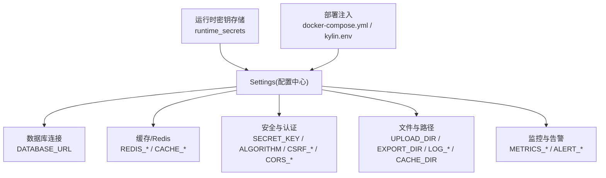
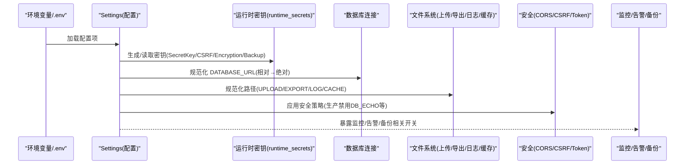
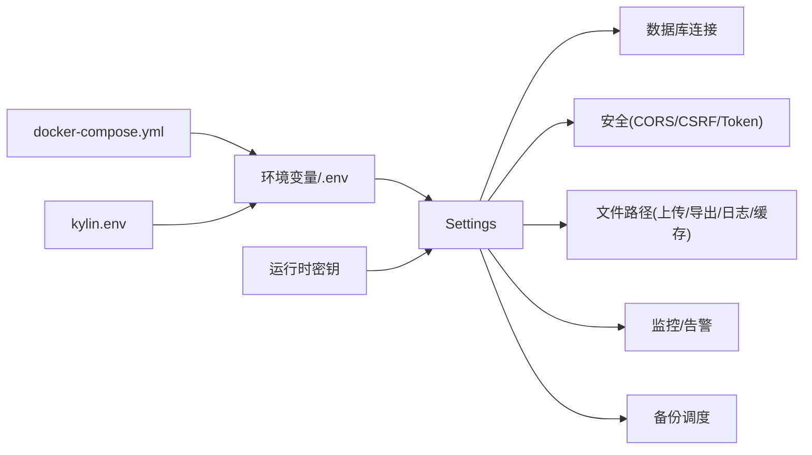

# 环境变量配置

<cite>
**本文引用的文件**
- [backend/app/core/config.py](file://backend/app/core/config.py)
- [deploy/kylin/config/kylin.env](file://deploy/kylin/config/kylin.env)
- [docker-compose.yml](file://docker-compose.yml)
- [backend/app/api/v1/system/backup.py](file://backend/app/api/v1/system/backup.py)
- [backend/app/services/backup_scheduler.py](file://backend/app/services/backup_scheduler.py)
- [backend/app/utils/runtime_secrets.py](file://backend/app/utils/runtime_secrets.py)
- [backend/app/main.py](file://backend/app/main.py)
- [backend/app/core/static_files.py](file://backend/app/core/static_files.py)
- [backend/app/api/v1/map.py](file://backend/app/api/v1/map.py)
</cite>

## 目录
1. [简介](#简介)
2. [项目结构](#项目结构)
3. [核心组件](#核心组件)
4. [架构总览](#架构总览)
5. [详细组件分析](#详细组件分析)
6. [依赖关系分析](#依赖关系分析)
7. [性能考量](#性能考量)
8. [故障排查指南](#故障排查指南)
9. [结论](#结论)
10. [附录：环境差异与最佳实践](#附录：环境差异与最佳实践)

## 简介
本文件系统化说明本项目的“环境变量配置”，覆盖数据库连接、缓存、安全、文件路径、日志、CORS/CSRF、监控告警、备份调度等。文档提供每个配置项的作用、默认值、取值范围与示例，并给出开发、测试、生产环境的差异与最佳实践；同时说明配置文件模板与环境变量验证机制。

## 项目结构
- 应用配置集中定义在 Settings（基于 pydantic-settings），从 .env 或环境变量加载，并在初始化时进行路径与安全策略的规范化处理。
- 部署示例包含 Docker Compose 与麒麟系统 systemd 环境文件，展示不同运行环境的环境变量注入方式。
- 部分功能直接读取环境变量（如地图瓦片目录、前端静态目录、内部备份密钥、自动备份开关等）。

图表来源
- [backend/app/core/config.py:54-383](file://backend/app/core/config.py#L54-L383)
- [docker-compose.yml:32-49](file://docker-compose.yml#L32-L49)
- [deploy/kylin/config/kylin.env:6-48](file://deploy/kylin/config/kylin.env#L6-L48)

章节来源
- [backend/app/core/config.py:54-383](file://backend/app/core/config.py#L54-L383)
- [docker-compose.yml:32-49](file://docker-compose.yml#L32-L49)
- [deploy/kylin/config/kylin.env:6-48](file://deploy/kylin/config/kylin.env#L6-L48)

## 核心组件
- 配置中心：Settings 类集中声明所有可配置项，支持从 .env 和环境变量加载，并提供属性解析与默认值。
- 运行时密钥：SECRET_KEY、CSRF_SECRET_KEY、ENCRYPTION_KEY、BACKUP_ENCRYPTION_KEY 等通过 runtime_secrets 自动生成与持久化，避免硬编码。
- 路径规范化：启动时将相对路径转换为绝对路径，确保跨平台（尤其是 Windows）稳定运行。
- 安全基线：生产环境强制关闭 DB_ECHO，限制敏感信息泄露；对字段加密密钥进行强制校验与自动填充。

章节来源
- [backend/app/core/config.py:54-383](file://backend/app/core/config.py#L54-L383)
- [backend/app/utils/runtime_secrets.py](file://backend/app/utils/runtime_secrets.py)

## 架构总览
下图展示了环境变量如何被加载、校验与使用，以及关键子系统对配置的依赖关系。

图表来源
- [backend/app/core/config.py:54-383](file://backend/app/core/config.py#L54-L383)
- [backend/app/utils/runtime_secrets.py](file://backend/app/utils/runtime_secrets.py)

## 详细组件分析

### 数据库与连接池
- DATABASE_URL：SQLite 默认动态计算为绝对路径；若为空则使用内置默认；支持 sqlite:///./... 相对路径转绝对。
- 连接池参数：DB_POOL_SIZE、DB_MAX_OVERFLOW、DB_POOL_TIMEOUT、DB_POOL_RECYCLE、DB_POOL_PRE_PING、DB_ECHO、SLOW_QUERY_THRESHOLD_MS。
- 数据库加密：DB_ENCRYPTION_ENABLED、DB_ENCRYPTION_KEY_PATH（需配合 sqlcipher3）。

建议
- 单机版优先使用 SQLite；如需多机共享，请切换至 PostgreSQL 并通过 docker-compose 注入 POSTGRES_* 环境变量。
- 生产环境务必关闭 DB_ECHO，避免 SQL 语句与敏感数据落入日志。

章节来源
- [backend/app/core/config.py:75-104](file://backend/app/core/config.py#L75-L104)
- [backend/app/core/config.py:331-364](file://backend/app/core/config.py#L331-L364)
- [docker-compose.yml:84-119](file://docker-compose.yml#L84-L119)

### 缓存与 Redis
- 本地缓存：CACHE_DIR、CACHE_SIZE_LIMIT、CACHE_ENABLED、CACHE_DEFAULT_TTL、CACHE_MAX_SIZE。
- Redis（可选）：REDIS_ENABLED、REDIS_HOST、REDIS_PORT、REDIS_DB、REDIS_PASSWORD、REDIS_MAX_CONNECTIONS。

建议
- 单机离线场景使用本地缓存即可；分布式或多实例部署再启用 Redis。
- 合理设置 TTL 与最大容量，避免内存膨胀。

章节来源
- [backend/app/core/config.py:114-183](file://backend/app/core/config.py#L114-L183)
- [docker-compose.yml:121-154](file://docker-compose.yml#L121-L154)

### 安全与认证
- 密钥与算法：SECRET_KEY、ALGORITHM。
- Token 有效期：ACCESS_TOKEN_EXPIRE_MINUTES、REFRESH_TOKEN_EXPIRE_DAYS。
- 密码策略：BCRYPT_ROUNDS、PASSWORD_EXPIRE_DAYS、MAX_FAILED_LOGIN_ATTEMPTS、ACCOUNT_LOCKOUT_MINUTES。
- CORS：CORS_ORIGINS、CORS_ALLOW_CREDENTIALS、CORS_ALLOW_METHODS、CORS_ALLOW_HEADERS。
- CSRF：CSRF_ENABLED、CSRF_SECRET_KEY。
- 代理信任：TRUST_PROXY_HEADERS（仅在可信反向代理后开启）。

注意
- SECRET_KEY、CSRF_SECRET_KEY 留空将自动生成并持久化到运行时密钥存储。
- 生产环境禁止宽松 CORS 源；仅允许必要域名。
- 单机离线模式可按需关闭 CSRF（见麒麟环境示例）。

章节来源
- [backend/app/core/config.py:64-154](file://backend/app/core/config.py#L64-L154)
- [backend/app/core/config.py:296-329](file://backend/app/core/config.py#L296-L329)
- [deploy/kylin/config/kylin.env:35-44](file://deploy/kylin/config/kylin.env#L35-L44)

### 文件路径与存储
- 上传/导出/日志/缓存：UPLOAD_DIR、EXPORT_DIR、LOG_DIR、LOG_FILE、LOG_LEVEL、LOG_FORMAT、LOG_ROTATION、LOG_RETENTION、LOG_MAX_SIZE_MB、LOG_BACKUP_COUNT、CACHE_DIR。
- 前端静态目录：FRONTEND_DIST_PATH（用于后端托管前端资源）。
- 地图瓦片目录：MAP_TILES_DIR（由 map API 直接读取环境变量）。

行为
- 启动时会将相对路径替换为绝对路径，确保写入用户数据目录，避免权限问题。

章节来源
- [backend/app/core/config.py:170-183](file://backend/app/core/config.py#L170-L183)
- [backend/app/core/config.py:331-364](file://backend/app/core/config.py#L331-L364)
- [backend/app/core/static_files.py:17](file://backend/app/core/static_files.py#L17)
- [backend/app/api/v1/map.py:82](file://backend/app/api/v1/map.py#L82)

### 监控、告警与审计
- 指标与端口：METRICS_ENABLED、METRICS_PORT。
- 健康检查：HEALTH_CHECK_ENABLED。
- 邮件告警：ALERT_EMAIL_RECIPIENTS、SMTP_HOST、SMTP_PORT、SMTP_USER、SMTP_PASSWORD、SMTP_FROM。
- Webhook 告警：ALERT_WEBHOOK_URL、ALERT_WEBHOOK_TYPE。
- 慢查询阈值：SLOW_QUERY_THRESHOLD_MS。

建议
- 生产环境开启指标与健康检查；根据负载调整 METRICS_PORT 与日志轮转策略。

章节来源
- [backend/app/core/config.py:185-198](file://backend/app/core/config.py#L185-L198)
- [backend/app/core/config.py:104](file://backend/app/core/config.py#L104)

### 备份与调度
- 自动备份开关：AUTO_BACKUP_ENABLED（由备份统计接口读取）。
- 默认备份目录：BACKUP_DEFAULT_DIR（供前端选择目标时回显）。
- 内部通道密钥：INTERNAL_BACKUP_KEY（Electron 与后端内部调用时使用）。
- 加密口令：BACKUP_ENCRYPTION_KEY（运行时生成并持久化，避免硬编码）。

流程
- 调度器按 SystemConfig 中的 cron 执行备份，必要时加密并清理旧备份。

章节来源
- [backend/app/api/v1/system/backup.py:76-103](file://backend/app/api/v1/system/backup.py#L76-L103)
- [backend/app/api/v1/system/backup.py:320-378](file://backend/app/api/v1/system/backup.py#L320-L378)
- [backend/app/services/backup_scheduler.py:100-123](file://backend/app/services/backup_scheduler.py#L100-L123)

### 管理员种子与首次登录
- 默认管理员用户名：DEFAULT_ADMIN_USERNAME。
- 默认管理员密码：DEFAULT_ADMIN_PASSWORD（未设置时使用出厂默认，首次登录强制修改）。

章节来源
- [backend/app/main.py:668-737](file://backend/app/main.py#L668-L737)
- [deploy/kylin/config/kylin.env:46-48](file://deploy/kylin/config/kylin.env#L46-L48)

## 依赖关系分析
- Settings 是单一真相源，其他模块通过 settings 访问配置；部分模块直接读取环境变量以简化耦合。
- runtime_secrets 负责密钥生命周期管理，避免明文落盘。
- 部署层通过 docker-compose 或 systemd EnvironmentFile 注入环境变量，影响运行时行为。

图表来源
- [backend/app/core/config.py:54-383](file://backend/app/core/config.py#L54-L383)
- [docker-compose.yml:32-49](file://docker-compose.yml#L32-L49)
- [deploy/kylin/config/kylin.env:6-48](file://deploy/kylin/config/kylin.env#L6-L48)

章节来源
- [backend/app/core/config.py:54-383](file://backend/app/core/config.py#L54-L383)
- [docker-compose.yml:32-49](file://docker-compose.yml#L32-L49)
- [deploy/kylin/config/kylin.env:6-48](file://deploy/kylin/config/kylin.env#L6-L48)

## 性能考量
- 连接池大小与超时：在高并发下适当增大 DB_POOL_SIZE 与 DB_MAX_OVERFLOW，并设置合理的超时与回收周期。
- 日志轮转：控制单文件大小与保留数量，避免磁盘占满。
- 缓存 TTL：根据业务热点数据设置合适的过期时间，减少重复计算与 IO。
- 慢查询阈值：结合监控定位瓶颈，优化索引与查询。

[本节为通用指导，不直接分析具体文件]

## 故障排查指南
- 启动失败且提示缺少密钥：确认 SECRET_KEY、CSRF_SECRET_KEY、ENCRYPTION_KEY 是否已自动生成或正确配置；查看运行时密钥存储文件。
- 数据库无法写入：检查 DATABASE_URL 指向的路径是否存在且可写；确认相对路径已被转换为绝对路径。
- 上传/导出失败：核对 UPLOAD_DIR、EXPORT_DIR 是否为绝对路径且有写入权限。
- 前端静态资源 404：检查 FRONTEND_DIST_PATH 是否正确指向构建产物目录。
- 备份异常：检查 AUTO_BACKUP_ENABLED、BACKUP_DEFAULT_DIR、INTERNAL_BACKUP_KEY 及磁盘空间；查看备份统计接口返回。

章节来源
- [backend/app/core/config.py:296-364](file://backend/app/core/config.py#L296-L364)
- [backend/app/api/v1/system/backup.py:320-378](file://backend/app/api/v1/system/backup.py#L320-L378)
- [backend/app/core/static_files.py:17](file://backend/app/core/static_files.py#L17)

## 结论
本项目通过统一的 Settings 集中管理环境变量，并结合运行时密钥与路径规范化，确保在不同环境与部署方式下的稳定性与安全性。遵循本文的配置规范与环境差异建议，可有效降低运维风险并提升系统可靠性。

[本节为总结性内容，不直接分析具体文件]

## 附录：环境差异与最佳实践

### 环境变量清单与说明
- 基础与运行
  - PROJECT_NAME、PROJECT_VERSION、API_PREFIX、DEBUG、ENVIRONMENT、HOST、PORT、TRUST_PROXY_HEADERS
- 数据库
  - DATABASE_URL、DB_ENCRYPTION_ENABLED、DB_ENCRYPTION_KEY_PATH、DB_POOL_SIZE、DB_MAX_OVERFLOW、DB_POOL_TIMEOUT、DB_POOL_RECYCLE、DB_POOL_PRE_PING、DB_ECHO、SLOW_QUERY_THRESHOLD_MS
- 缓存
  - CACHE_DIR、CACHE_SIZE_LIMIT、CACHE_ENABLED、CACHE_DEFAULT_TTL、CACHE_MAX_SIZE
  - REDIS_ENABLED、REDIS_HOST、REDIS_PORT、REDIS_DB、REDIS_PASSWORD、REDIS_MAX_CONNECTIONS
- 安全
  - SECRET_KEY、ALGORITHM、ACCESS_TOKEN_EXPIRE_MINUTES、REFRESH_TOKEN_EXPIRE_DAYS、BCRYPT_ROUNDS、PASSWORD_EXPIRE_DAYS、MAX_FAILED_LOGIN_ATTEMPTS、ACCOUNT_LOCKOUT_MINUTES
  - CORS_ORIGINS、CORS_ALLOW_CREDENTIALS、CORS_ALLOW_METHODS、CORS_ALLOW_HEADERS
  - CSRF_ENABLED、CSRF_SECRET_KEY
- 文件与路径
  - UPLOAD_DIR、EXPORT_DIR、LOG_DIR、LOG_FILE、LOG_LEVEL、LOG_FORMAT、LOG_ROTATION、LOG_RETENTION、LOG_MAX_SIZE_MB、LOG_BACKUP_COUNT、CACHE_DIR
  - FRONTEND_DIST_PATH、MAP_TILES_DIR
- 监控与告警
  - METRICS_ENABLED、METRICS_PORT、HEALTH_CHECK_ENABLED
  - ALERT_EMAIL_RECIPIENTS、SMTP_HOST、SMTP_PORT、SMTP_USER、SMTP_PASSWORD、SMTP_FROM
  - ALERT_WEBHOOK_URL、ALERT_WEBHOOK_TYPE
- 备份
  - AUTO_BACKUP_ENABLED、BACKUP_DEFAULT_DIR、INTERNAL_BACKUP_KEY、BACKUP_ENCRYPTION_KEY
- 管理员种子
  - DEFAULT_ADMIN_USERNAME、DEFAULT_ADMIN_PASSWORD

章节来源
- [backend/app/core/config.py:64-198](file://backend/app/core/config.py#L64-L198)
- [backend/app/api/v1/system/backup.py:76-103](file://backend/app/api/v1/system/backup.py#L76-L103)
- [backend/app/api/v1/system/backup.py:320-378](file://backend/app/api/v1/system/backup.py#L320-L378)
- [backend/app/core/static_files.py:17](file://backend/app/core/static_files.py#L17)
- [backend/app/api/v1/map.py:82](file://backend/app/api/v1/map.py#L82)
- [backend/app/main.py:668-737](file://backend/app/main.py#L668-L737)

### 环境差异与示例
- 开发环境
  - DEBUG=true，CORS 允许本机与 Vite 开发服务器地址，CSRF 可保持开启。
  - 可使用 SQLite 默认路径；日志级别 INFO/DEBUG。
- 测试环境
  - 关闭不必要的外部服务（如 Redis），聚焦核心流程；保留适度日志。
- 生产环境
  - ENVIRONMENT=production，严格 CORS 白名单，关闭 DB_ECHO，启用指标与健康检查。
  - 使用绝对路径并确保权限；启用自动备份与保留策略；使用强密码与最小权限原则。

示例参考
- Docker Compose 注入：[docker-compose.yml:32-49](file://docker-compose.yml#L32-L49)
- 麒麟系统环境文件：[deploy/kylin/config/kylin.env:6-48](file://deploy/kylin/config/kylin.env#L6-L48)

章节来源
- [docker-compose.yml:32-49](file://docker-compose.yml#L32-L49)
- [deploy/kylin/config/kylin.env:6-48](file://deploy/kylin/config/kylin.env#L6-L48)

### 配置文件模板
- 根级 .env（优先级低于环境变量）：
  - 包含 DATABASE_URL、SECRET_KEY、DEBUG、LOG_LEVEL、CORS_ORIGINS、CSRF_ENABLED、FRONTEND_DIST_PATH 等常用项。
- Docker Compose：
  - 通过 environment 注入必要变量，并使用 volumes 持久化 data/logs/backups。
- 麒麟 systemd：
  - 通过 EnvironmentFile 加载 kylin.env，集中管理路径与安全策略。

章节来源
- [backend/app/core/config.py:57-62](file://backend/app/core/config.py#L57-L62)
- [docker-compose.yml:32-49](file://docker-compose.yml#L32-L49)
- [deploy/kylin/config/kylin.env:6-48](file://deploy/kylin/config/kylin.env#L6-L48)

### 环境变量验证机制
- Settings 模型校验：pydantic-settings 自动进行类型与格式校验，非法值将导致启动失败。
- 运行时安全策略：
  - 生产环境强制关闭 DB_ECHO。
  - 生产环境要求 ENCRYPTION_KEY 非空，否则自动生成并持久化。
  - SECRET_KEY、CSRF_SECRET_KEY 留空自动生成并持久化。
- 路径规范化：
  - 启动时将相对路径转换为绝对路径，避免权限与跨平台问题。

章节来源
- [backend/app/core/config.py:296-364](file://backend/app/core/config.py#L296-L364)
- [backend/app/core/config.py:366-383](file://backend/app/core/config.py#L366-L383)